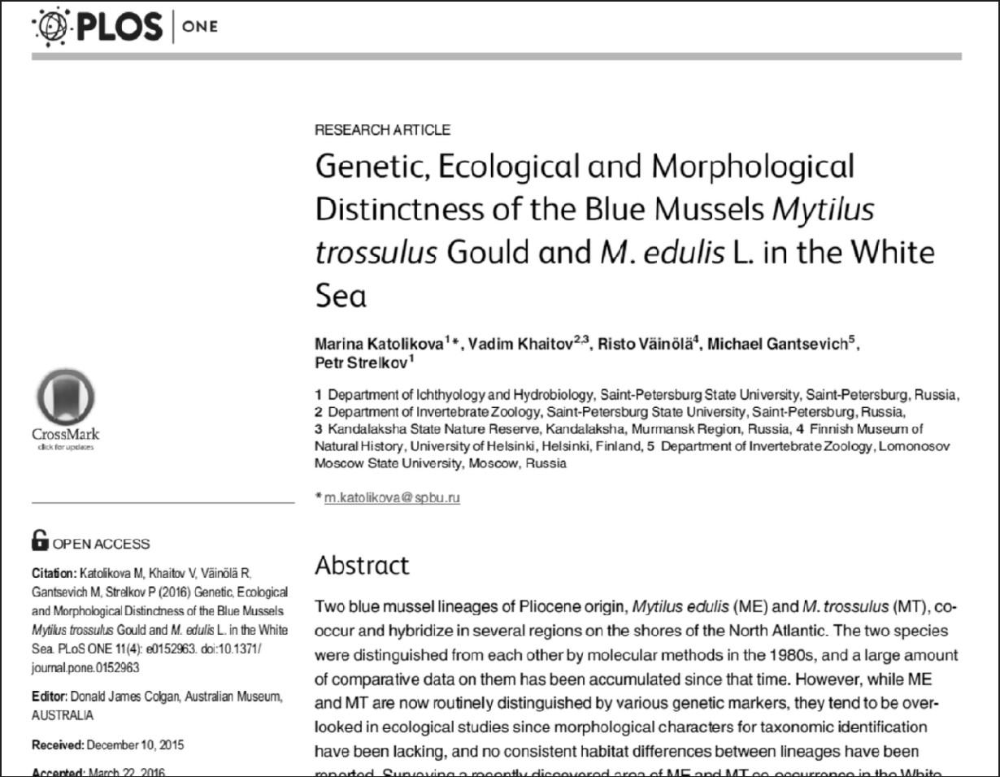
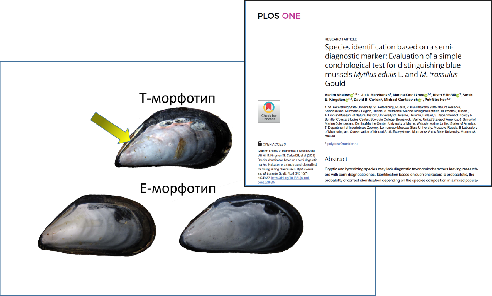
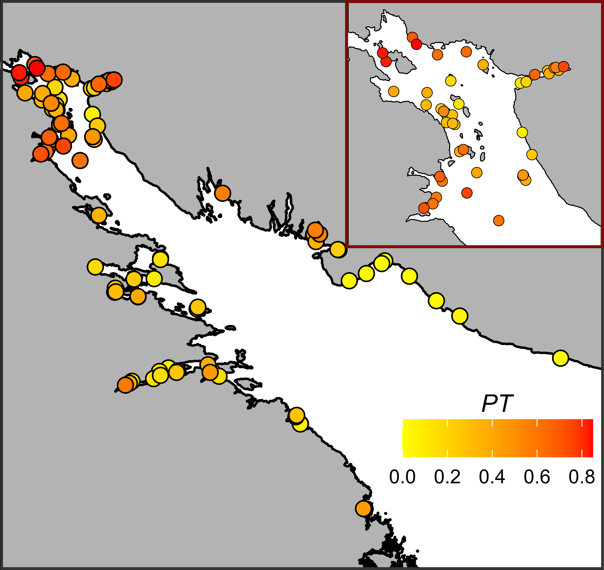
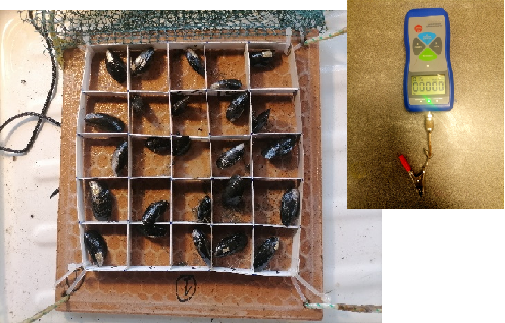
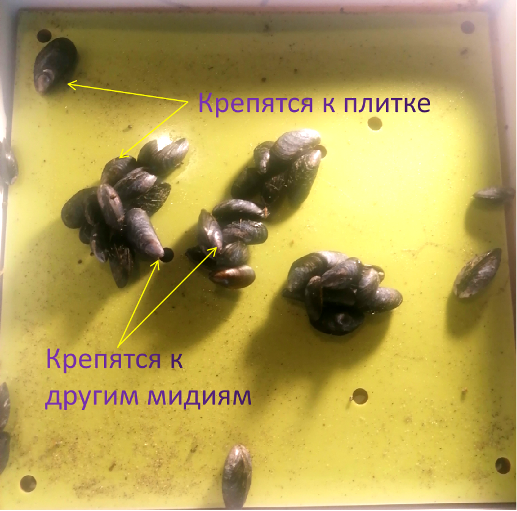
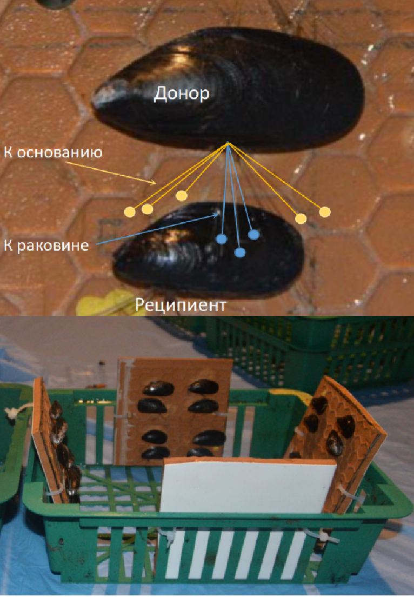
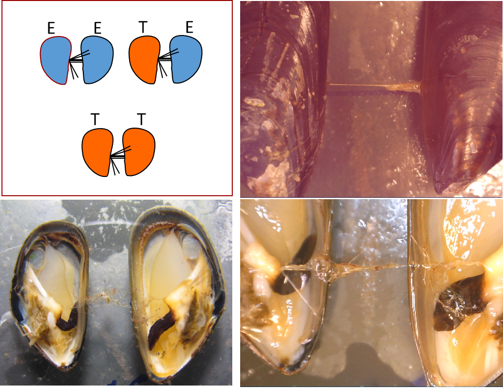
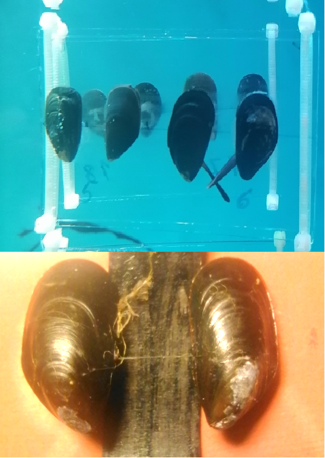
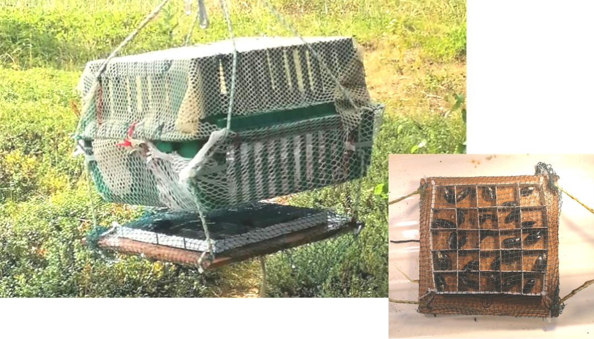
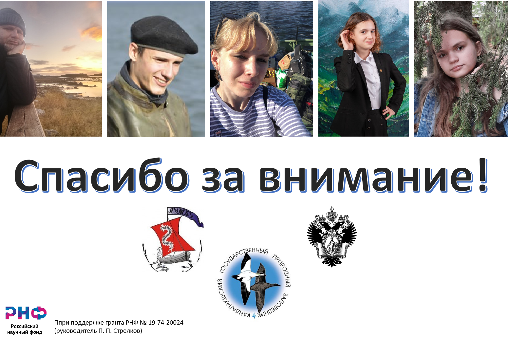

```{r setup, include=FALSE}
library(knitr)
opts_chunk$set(echo = FALSE, warning = FALSE, message = FALSE)
```

```{r  packages}
library(readxl)
library(dplyr)
library(ggplot2)

theme_set(theme_bw())
```


```{r}
y_lab_size = 15
```


## Беломорские мидии

:::::::::::::: {.columns}
::: {.column}



:::


::: {.column}

### В Белом море обитает два вида мидий

- *Mytilus edulis* --- коренной для Белого моря вид 
- *Mytilus trossulus* --- Вид вселенец, завезенный в акваторию Баренцева и Белого морей судами из Северной Америкой во время Второй Мировой Войны.

:::
::::::::::::::


## Морфотип-тест для идентификации мидий 

:::::::::::::: {.columns}
::: {.column}


```{r out.width = "30%", fig.align = "center", fig.cap="Khaitov et al., 2021"}

```


:::

::: {.column}

**Морфотипы мидий позволяют с высокой вероятностью идентифицировать мидий**

- *E - морфотип* --- соответствует *M.edulis* (вероятность правильного определения ~90%) 
- *T- морфотип* ---  соответствует *M.trossulus* (вероятность правильного определения ~80%)


:::

::::::::::::::


## Разделение экологических ниш у беломорских мидий

:::::::::: {.columns}

:::{.column}

```{r, out.width = "30%", fig.cap = "Мидии *T-морфотипа* чаще встречаются в эстуариях"}

```

:::

:::{.column}


```{r data_reading}
myt <- read_excel("Data/myt_full.xls")
```


```{r fig.cap="Частота мидий *T-морфотипа* на фукоидах выше, чем на грунте."}
myt <- myt %>% mutate(PT = N_T/(N_T + N_E)) 

myt %>% 
  ggplot(., aes(x = Position, y = PT)) +
  geom_boxplot(fill = "gray") +
  labs(x = "Субстрат", y = "Доля мидий T-морфотипа") +
  theme(axis.title = element_text(size = y_lab_size), axis.text.x = element_text(size = y_lab_size))
  
  
```


:::

::::::::::


## Возможные причины расхождения по субстратам

- Талломы водорослей находятся под воздействием прибоя.

- Если мидии разных видов имеют разную силу прикрепления, то на фукоидах будет удерживаться тот вид, у которого биссус прочнее. 

- **Необходимо изучение свойств биссуса у мидий разных видов.**


## Задачи, решаемые с помощью биссуса

- Закрепление на субстрате
- "Оружие" против конкурентов и хищников

 


# Биссус в мире беломорских мидий

## Количество биссусных нитей


<!-- :::::::::: {.columns} -->

<!-- :::{.column} -->

```{r }
#Биссусные нити на бакпечатках вывешенных в море

mytred2022 <- read_excel("Data/BysTrEd2022.xlsx", sheet = "BysTrEd2022 N_bys")

bys2022 <- mytred2022 %>%  filter(Type == "O") %>% mutate(N_bys = N_bys_1 + N_bys_2) %>% select(Morphotype , N_bys) %>% mutate(Type = "В море")


fucbys2023 <- read_excel("Data/FucBys_2023.xlsx", sheet = "Experiment FucBys")

bys2023 <-fucbys2023 %>% filter(Treatment == "Control") %>% select(Morphotype , N_byss) %>% rename(N_bys = N_byss) %>% mutate(Type = "В лаборатории")  

bys <- rbind(bys2022, bys2023)

Pl_plaq <- 
ggplot(bys, aes(x = Morphotype, y = N_bys)) + 
  geom_boxplot(aes(fill = Morphotype)) +
  facet_wrap(~Type) +
  scale_fill_manual(values = c("blue", "red")) +
  guides(fill = "none") +
  labs(x = "Морфотипы мидий", y = "Число бляшек биссуса") +
  theme(axis.title = element_text(size = y_lab_size))
  

```

```{r fig.cap="**Мидии T-морфотипа выделяют больше нитей биссуса.**"}
library(png)

bak <- readPNG(source = "Figures/Bakpechatka.png")

library(cowplot)
Pl_plaq_2 <- ggdraw() +
  draw_plot(Pl_plaq) +
  draw_image(bak,  x = -0.25, y = 0.25, scale = .3)
  
Pl_plaq_2
```


<!-- ::: -->

<!-- :::{.column} -->

<!-- **Мидии T-морфотипа выделяют больше нитей биссуса.** -->

<!-- ::: -->

<!-- ::::::::::::: -->

## Сила прикрепления 

::::::::::::::{.columns}

:::{.column}



:::

:::{.column}

```{r fig.cap="Мидии T-морфотипа сильнее прикрепляются к субстрату"}

mytred2022_force <- read_excel("Data/BysTrEd2022.xlsx", sheet = "BysTrEd2022 Force", na = "NA")


force_2022 <- mytred2022_force %>% filter(Treatment == "0") %>% select(Morphotype, Force, W) %>% filter(complete.cases(.)) %>% mutate(Type = "2022")


# mytred2021_force <- read_excel("Data/Mytred_Byss_Control_2021.xlsx", na = "NA")

mytred2021_force <- read_excel("Data/Mytred_2021_byssus_force.xlsx", na = "NA")


force_2021 <- mytred2021_force %>% mutate(Morphotype = ifelse(Morphotype  == "t", "T", "E")) %>% rename(W = Weight) %>% filter(complete.cases(.)) %>% select(Morphotype, Force, W) %>% mutate(Type = "2021") 


force <- rbind(force_2022, force_2021)

force <- force %>% mutate(True_Force = Force - 9.81*W/1000)

force <- force %>% filter(Force > 0)

ggplot(force, aes(x = Morphotype, y = (True_Force) )) + 
  geom_boxplot(aes(fill = Morphotype)) +
  facet_wrap(~Type, scales = "free_y") +
  scale_fill_manual(values = c("blue", "red")) +
  guides(fill = "none") +
  labs(x = "Морфотипы мидий", y = "Сила отрыва (N)") 
  

```

:::

:::::::::::::::

## Влияние солености на силу прикрепления к субстрату

```{r}
byss_s <- read_excel('Data/Mytred_Byss_Salinity_2021.xlsx', sheet = 'list1', na = "NA")

byss_s<-
byss_s %>% filter(is.na(Comment)) %>% mutate(Morphotype = ifelse(Morph_type  == "t", "T", "E")) %>% rename(W = Wtotal) %>% mutate(True_Force = Force - 9.81*W/1000) %>% mutate(True_Force = ifelse(Force == 0, 0, True_Force)) %>% filter(!is.na(Force))
 
byss_s$Plate_Num <- factor(byss_s$Plate_Num)
byss_s$Morphotype <- factor(byss_s$Morphotype)
byss_s$Log_True_Force <- log(byss_s$True_Force +1)


library(nlme)
Mod <- lme(Log_True_Force ~ Salinity * Morphotype, random = ~1|Plate_Num, method = "REML", data = byss_s) 

Mydata <- expand.grid(Morphotype = c("T", "E"), Salinity = 12:24) 

Mydata$fit <- predict(Mod, newdata = Mydata, level =  0)

X <- model.matrix(~ Salinity * Morphotype, data = Mydata)

Mydata$SE <- sqrt(diag(X %*% vcov(Mod) %*% t(X)))

Pl_Salinity <-
ggplot(Mydata, aes(x = Salinity, y = fit)) + 
  geom_ribbon(aes(fill = Morphotype, ymin = fit - 1.96*SE, ymax = fit + 1.96*SE), alpha = 0.4 ) + 
  geom_line(aes(color = Morphotype), linewidth = 1) + 
  geom_point(data = byss_s, aes(y = Log_True_Force, color = Morphotype), position = position_jitter(width = 0.1)) +
  scale_color_manual(values = c("red", "blue")) +
  labs(x = "Соленость", y = "Log(Силы прикрепления)", color = "Морфотип") +
  guides(fill = "none")

```

:::::::::::{.columns}

:::{.column}
```{r}
Pl_Salinity+
  theme(axis.title = element_text(size = y_lab_size))
```

:::


:::{.column}

**В экспериментальных условиях:**

- По мере уменьшения солености, сила прикрепления мидий *E-морфотипа* значимо снижается. 
- Для мидий *T-морфотипа* связь с соленостью не выявлена
:::

:::::::::::


# Война между мидиями


## Однослойные VS многослойные поселения мидий, или кто на ком? 

```{r}
layer <- read_excel("Data/Layer_TrEd_2023.xlsx")


myt <- layer %>% 
  mutate(Prop_T = (T_1_layer + T_2_layer)/(T_1_layer + E_1_layer + T_2_layer + E_2_layer), 
         Prop_2_lev  = (T_2_layer + E_2_layer)/(T_1_layer + E_1_layer + T_2_layer + E_2_layer), 
         Prop_E2 = E_2_layer/(E_1_layer + E_2_layer), 
         PropT2 = T_2_layer/(T_1_layer + T_2_layer))


Pl_layers <- 
  ggplot(myt, aes(x = Prop_T, y = Prop_2_lev)) + 
  geom_point(size = 4, shape = 21, aes(fill = Prop_T)) +
  scale_fill_gradient(low = "blue", high = "red")+
  geom_smooth(method = "lm") +
  labs(x = "Доля мидий T-морфотипа на пластине", y = "Доля мидий, \n прикрпепляющихся к мидиям") +
  theme(axis.title = element_text(size = y_lab_size)) +
  guides(fill = "none")


```


:::::::::{.columns}

:::{.column}


:::


:::{.column}

```{r, fig.cap = "Мидии T-морфотипа чаще прикрепляются к пластине, чем к раковинам соседних мидий"}
Pl_layers +
  theme(axis.title = element_text(size = y_lab_size))
```


:::

:::::::::


## Кто кого?


```{r}

myt <- read_excel("Data/Touchtred_2021_2023.xlsx", na = "NA") 

myt <- myt %>% mutate(Duration = as.numeric(Date_of_End - Date_of_Begin), Prop_to_Rec = Byss_to_Recipient/(Byss_to_Substrate + Byss_to_Recipient))

myt <- myt %>% mutate(N_bys = Byss_to_Recipient + Byss_to_Substrate)

myt<- myt %>% filter( (Expected_Donor == True_Donor)&(Expected_Recipient == True_Recipient))


# myt <- myt %>% filter(Year !=2023)


myt$True_Donor <- factor(myt$True_Donor, labels =  c("Donor_E", "Donor_T"))
myt$True_Recipient <- factor(myt$True_Recipient, labels =  c("Rec_E", "Rec_T"))

Pl_Donor_Recip_Prop <- 
myt %>% 
  ggplot(., aes(x = True_Recipient, y = Prop_to_Rec, fill = True_Recipient)) + geom_boxplot()  + facet_wrap(~True_Donor) +
  geom_hline(yintercept = 0.5, linetype = 2) +
  scale_fill_manual(values = c("blue", "red")) +
  guides(fill = "none") +
  labs(x = "Морфотип реципиента", y = "Доля нитей к реципиенту")

```

:::::::::{.columns}

:::{.column}



:::


:::{.column}

```{r, fig.cap="Мидии E-морфотипа при соседстве с мидиями T-морфотипа большую долю нитей крепят к чужаку, а не к субстрату"}
Pl_Donor_Recip_Prop +
  theme(axis.title = element_text(size = y_lab_size))
```

:::

:::::::::


## "Проникающий" биссус

::::::::::::::{.columns}

:::{.column}

:::

:::{.column}

При постановке эксперимента, когда моллюски были ориентированы брюшной стороной друг к другу, было отмечено прикрепление биссуса к стволу биссусных нитей партнера.

:::


:::::::::::::::

## *Mytilus trossulus*: бей своих?


::::::::::::::{.columns}

:::{.column}


:::

:::{.column}

```{r}

myt_d <- read_excel("Data/TouchTrEd_D_2023.xlsx", na = "NA")

myt_d  <- myt_d  %>% filter(!is.na(Supposed_Morph_A))

myt_d  <- myt_d  %>% mutate(Reciproc = ifelse(Reciprocal_threads == "0", "No", "Present"), Total_Bys_A =  To_Substr_A + To_mate_A, Total_Bys_B = To_Substr_B + To_mate_B, Prop_to_Mate_A = To_mate_A/Total_Bys_A, Prop_to_Mate_B = To_mate_B/Total_Bys_B)

myt_d  <- myt_d  %>% filter(Experiment_Type == "Field")

myt_d  <-
  myt_d  %>% mutate(Pair_Type = case_when(Morph_A == "t" & Morph_B == "t" ~ "TT",
                                        Morph_A == "e" & Morph_B == "e" ~ "EE",
                                        Morph_A == "t" & Morph_B == "e" |  Morph_A == "e" & Morph_B == "t"  ~ "ET") )


myt_d2 <-
myt_d  %>% filter(!((Supposed_Morph_A != Morph_A)|(Supposed_Morph_B != Morph_B)) )


# myt2 %>%
#   group_by(Morph_A, Morph_B) %>%
#   summarise(Prop_Reciproc = mean(Reciproc == "Present"))

myt_d2 <-
myt_d2 %>% mutate(Pair_Type = case_when(Morph_A == "t" & Morph_B == "t" ~ "TT",
                                      Morph_A == "e" & Morph_B == "e" ~ "EE",
                                      Morph_A == "t" & Morph_B == "e" |  Morph_A == "e" & Morph_B == "t"  ~ "ET") )

Pl_mutual_bys <- 
myt_d2 %>%
  group_by(Pair_Type) %>%
  summarise(Prop_Reciproc = mean(Reciproc == "Present"), N = n(), SE = sqrt(Prop_Reciproc*(1-Prop_Reciproc)/N)) %>%
  ggplot(., aes(x = Pair_Type, y = Prop_Reciproc)) +
  geom_col(fill = "gray", color = "gray20") +
  geom_errorbar(aes(ymin = Prop_Reciproc -  SE, ymax = Prop_Reciproc +  SE), width = 0.2) +
  labs(x = "Тип пары", y = "Частота 'Проникающего' биссуса") +
  theme(axis.title = element_text(size = y_lab_size))
  
library(png)  

EE <- readPNG(source = "Figures/EE.png")
ET <- readPNG(source = "Figures/ET.png")
TT <- readPNG(source = "Figures/TT.png")


library(cowplot)
Pl_mutual_bys_2 <- ggdraw() +
  draw_plot(Pl_mutual_bys) +
  draw_image(EE,  x = -0.22, y = -0.29, scale = .2) +
  draw_image(ET,  x = 0.06, y = -0.29, scale = .2) +
  draw_image(TT,  x = 0.33, y = -0.29, scale = .2) 
  
Pl_mutual_bys_2


```
 
:::

::::::::::::

# Биссус в войне с врагами

## Морские звезды - естественные враги мидий

:::::::::::{.columns}

:::{.column}

:::


:::{.column}

```{r}
astr <-read_excel("Data/BysTrEd2022.xlsx", na = "NA")


astr2022 <- astr %>% filter(complete.cases(.)) 

astr2022 <- astr2022 %>% mutate(Treatment2 = case_when(Treatment == "AT" | Treatment == "AE" | Treatment == "AH" ~ "Asterias",Treatment == "0" ~ "Control")) %>% mutate(True_Force = Force - 9.81*W/1000) 

astr2022 <- astr2022 %>% filter(Force > 0)

Pl_astred <-
ggplot(astr2022, aes(x = Treatment2, y = (True_Force) )) +
  geom_boxplot(aes(fill = Morphotype)) +
  scale_fill_manual(values = c("blue", "red")) +
  labs(x = "Источник сигнала", y = "Сила отрыва (N)", fill = "Морфотип") +
  theme(axis.title = element_text(size = y_lab_size), legend.position = c(0.9, 0.85), axis.text.x = element_text(size = y_lab_size))
  

```


```{r fig.cap="В присутствии химических сигналов от хищника мидии сильнее прикрепляются к субстрату"}

Pl_astred

```


:::

:::::::::::


# Война с биссусом

## Фукоиды: борьба с обрастанием?

::::::::::::{.columns}

:::{.column}

**Получение "кондиционированной" воды:**

- Вода с метаболитами *Ascophyllum nodosum* \n(600 г водорослей на 0.5 л морской воды, 6 часов, 2 контейнера)
- Вода с метаболитами *Fucus vesiculosus* \n(600 г водорослей на 0.5 л морской воды, 6 часов, 2 контейнера)
- Контроль 0.5 л морской воды. 6 часов, 2 контейнера

:::

:::{.column}

```{r}

fucbys2023$Treatment <- factor(fucbys2023$Treatment) 

fucbys2023$Treatment <- relevel(fucbys2023$Treatment, ref = "Control")

Pl_fucbys <-
ggplot(fucbys2023, aes(x = Treatment, y = N_byss, fill = Morphotype)) +
  geom_boxplot() +
  theme(axis.title = element_text(size = y_lab_size), legend.position = c(0.9, 0.85),axis.text.x = element_text(size = 15)) +
  scale_fill_manual(values = c("blue", "red")) +
  labs(x = "Источник сигнала", y = "Количество биссусных бляшек", fill = "Морфотип")


```


```{r, fig.cap="Выделения *F.vesiculosus* полностью подавляют образование биссуса"}
Pl_fucbys
```

:::


::::::::::::

# Итоги

## Использование биссуса беломорскими мидиями

- Мидии T-морфотипа (~ *M.trossulus*)  выделяют больше биссуса и крепятся к субстрату сильнее, чем мидии E-морфотипа (~ *M.edulis*). Это может объяснять преобладание *M.trossulus* на фукоидах, а *M.edulis* на грунте.


## Использование биссуса беломорскими мидиями

- Сила прикрепления мидий T-морфотипа не демонстрирует существенной связи с соленостю в пределах  диапазона ее варьирования, характерного для Белого моря. 

- Сила прикрепления мидий E-морфотипа значимо снижается при солености, характерной для эстуариев.

- Это может объяснять более низкую частоту *M.eduls* в эстуариях, где преобладает *M.trossulus*.


## Использование биссуса беломорскими мидиями

- Биссус может использоваться как оружие в межвидовой конкуренции (*M.edulis* подавляет *M.trossulus*)

- Биссус может использоваться как оружие во внутривидовой конкуренции (*M.trossulus* подавляет конспецификов). Вероятно, следствием этого является тенденция  к формированию однослойных плотных поселений, характерная для *M.trossulus*.


## Использование биссуса беломорскими мидиями

- Биссус позволяет обороняться от морских звезд: оба вида сильнее прикрепляются к субстрату при наличии сигналов от звезд. 

- Различий в этом поведенческом паттерне между *M.edulis* и *M.trossulus* мы не обнаружили


## Использование биссуса беломорскими мидиями

- Некоторые виды фукоидов (*F.vesiculosus*), вероятно, могут выделять метаболиты, угнетающие образование биссуса.

- Различий в чувствительности к этому влиянию между *M.edulis* и *M.trossulus* мы не обнаружили.

##



