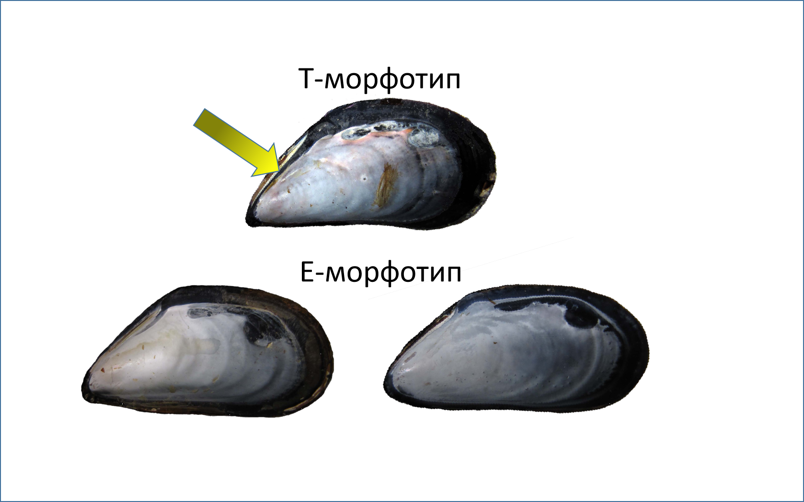
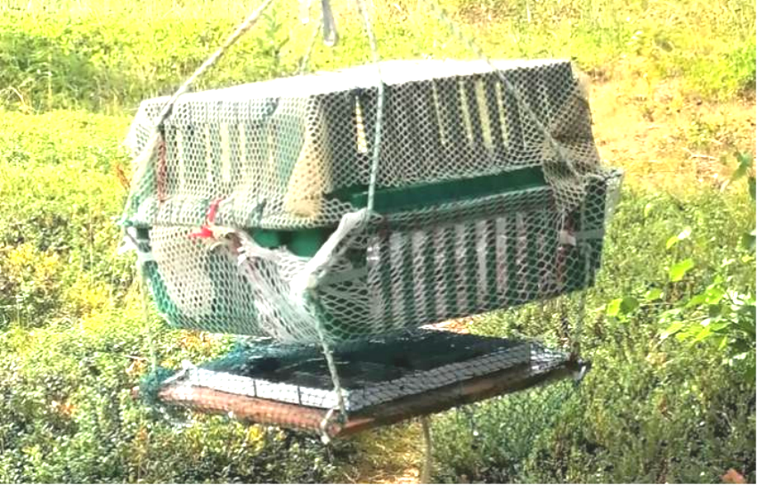

```{r setup, include=FALSE}
library(knitr)

opts_chunk$set(echo = FALSE, warning = FALSE, message = FALSE)

```

```{r}
library(readxl)
library(ggplot2)
library(dplyr)
library(flextable)

```


```{r}
theme_set(theme_bw())
y_lab_size = 15
```

# Введение

Нити биссуса, формирующиеся за счет выделений особой железы, расположенной в основании ноги  [@vekhova2021byssal], являются одной из характерных черт двустворчатых моллюсков [@gosling2015phylogeny]. В последние десятилетия исследование биссуса стало предметом активного интереса,  связанного с его механическим свойствами и потенциальными хозяйственными приложениями в различных областях, таких как биомедицинские технологии и материалы для строительства [@waite2022following]. В жизни же самих мидий биссус играет существенную роль, позволяя решать несколько важнейших задач. 

Биссус начинает использоваться уже на самых ранних этапах онтогенеза. После метаморфоза педивелигера, плантиграда, осевшая на дно,  использует нити биссуса для вторичного плавания в толще воды. Молодые моллюски, раскинув нити, подхватываются течением и флотируют в толще воды [@lane1985byssus]. Биссусный дрифт позволяет плантиградам найти наиболее пригодное место для поселения [@bayne1964primary]. После оседания в благоприятные биотопы, биссус позволяет  моллюскам решать следующие задачи. Во-первых, с помощью нитей биссуса моллюски заякореваются  на твердых субстратах, что предотвращает отрыв особей за счет волнового воздействия [@price1982analysis]. По всей видимости, исходным биотопом, в котором проходило формирование самой группы Mytilidae были прибойные местообитания [@gosling2015phylogeny]. Мидии, обитая в таких условиях, адаптированы к поселению в плотных агрегациях, формированию которых способствует характерная клиновидная, митилизованная раковина [@gosling2015phylogeny]. Во-вторых, поселение моллюсков в  формате плотных скоплений, где особи крепятся не только к субстрату, но и друг к другу, снижает пресс хищников (в первую очередь птиц, крабов и морских звезд), которым для поглощения жертвы необходимо отделить ее от субстрата. В связи с этим моллюски, располагающиеся в центре агрегации и на ее периферии имеют разные шансы быть атакованными хищниками и, следовательно, могут по-разному вкладывать энергию в формирование биссуса [@cheung2009anti]. В-третьих, биссус может быть использован не только в пассивной защите от хищников, но и в активной обороне. Так, мидии обездвиживают нападающих на них хищных улиток, облепляя их нитями биссуса [@petraitis1987immobilization]. В-четвертых, аналогичный механизм используется и для подавления конкурентов. Например, мидии прикрепляют биссус к туникам асцидий, которые будучи фильтраторами, занимают сходную с мидиями экологическую нишу в морских эпибиозах [@khalaman2015clumping].

Используя термин «мидия» (*mussel*), исследователи обычно понимают широкий спектр таксонов, не ограничивающийся только семейством Mytilidae. Далее мы будем рассматривать узкую группу мидий, *blue mussel*, входящих в комплекс «*Mytilus edulis*». Этот комплекс состоит из трех криптических видов [@Riginos2005], нативные ареалы которых связаны с Пацификой (*Mytilus trossulus*), Атлантикой (*M. edulis*) и Средиземноморьем (*M. galloprovincialis*). 

Естественное расселение и антропогенное перемещение этих видов привели к формированию зон контакта, где два (реже все три) вида встречаются в одном местообитании [@Riginos2005].  Одна из зон контакта двух видов мидий сформировалась в Кандалакшском заливе Белого моря [@katolikova2016genetic]. Коренной для Белого моря вид *M.edulis* (далее, *ME*) во второй половине XX в. встретился с интродуцентом - *M.trossulus* (далее *MT*). Последний проник в российскую субарктику во время Второй Мировой Войны на днищах судов, курсировавших между Северной Америкой и портами СССР [@vainola2011mytilus]. В зонах контакта между встретившимися видами начинают формироваться как генетические связи (например, проявляется интрогрессивная гибридизация, @michalek2021mytilus), так и экологические отношения (близкие виды мидий неизбежно должны конкурировать за ресурсы).

Анализ экологических связей требует введения некоторых характеристик, позволяющих оценить уровень благосостояния вида. В этом отношении биссус мидий может быть удобным индикатором, так как на его производство моллюск затрачивает энергию. Биссус является органическим продуктом биссусной железы и состоит, преимущественно, из коллагена, задубливающих веществ (фенольной природы) и мукополисахаридов [@smeathers1979mechanical; @tamarin1976structure]. Экскреция органических веществ (и особенно белков и пептидов) является энергетически очень затратным процессом. Согласно литературе, мидии могут вкладывать в образование биссуса от 2-3% (в нормальных условиях) до 47% (в условиях, когда биссус необходимо синтезировать регулярно на постоянной основе)  своего энергетического бюджета [@roberts2021resource]. Повышение энергетических инвестиций в образование биссуса сопровождается снижением скорости роста и уменьшением репродуктивного вклада [@roberts2021resource; @sebens2018estimation]. И, напротив, во время нереста у мидий наблюдается снижение силы прикрепления к субстрату [@lachance2008biotic]. Предположительно, при условии поступления большого количества энергии, ассимилируемой с пищей, энергетический бюджет животного приобретает большую пластичность, тогда как в условиях недостатка пищи выгоды от перераспределения энергии в синтез биссуса становятся уже не так очевидны.

Сказанное выше позволяет утверждать, что варьирование в продукции биссуса (количестве производимых нитей, их толщине или прочности) может трактоваться как сигнал, позволяющий судить о физиологическом состоянии мидии. В пользу этого говорит то, что ранее уже были выявлены корреляции между продукцией биссуса и воздействием как абиотических, так и биотических факторов [@carvallo2024responses]. Это позволяет рассматривать продукцию биссуса, как удобный признак для изучения реакции мидий на воздействия, складывающиеся в зоне контакта *ME* и *MT*.

В связи со сказанным выше мы поставили целью нашего исследования оценить, как варьирует продукция биссуса двух видов мидий, сосуществующих в Кандалакшском заливе Белого моря, в следующих жизненных ситуациях, складывающихся в условиях зоны контакта.  

1.При изолированном поселении разных видов мидий, в стандартных условиях, при отсутствии прямого взаимодействия как с конспецификами, так и с другими видами макробентоса.

2.При разных значениях солености, которая является важнейшим абиотическим фактором, регулирующим распространение мидий в зоне их контакта.

3.В одновидовых (*ME* или *MT*) и смешанных (*ME* + *MT*) плотных поселениях.

4.При наличии химических сигналов от морских звезд, как основных врагов мидий.

5.При наличии химических сигналов от фукоидов, которые являются наиболее важным биогенным субстратом, на котором поселяются мидии в условиях Белого моря.


# Идентификация беломорских мидий

Давняя дивергенция *ME* и *MT* привела к значительным расхождениям в их генофондах, однако не затронула ключевых морфологических черт мидий [@Riginos2005]. Внешне моллюски разных видов, тем более в симпатрии, отличаются крайне слабо. Это свидетельствует о значительной роли стабилизирующего отбора. Вместе с тем, некоторые морфологические отличия, позволяющие с достаточно высокой точностью идентифицировать виды, по крайней мере *ME* и *MT*, были найдены [@katolikova2016genetic; @Khaitov2021].

В изученных зонах контакта *ME* и *MT* моллюски демонстрируют два морфотипа [@katolikova2016genetic; @Khaitov2021], различающиеся по характеру закладки перламутрового слоя в районе нимфы лигамента (Рис. 1).


```{r fig.cap= "**Рисунок 1**. Мидии двух морфотипов. Стрелка указывает на полоску призматического слоя, не покрытую перламутром."}



```

Ранее было показано [@Khaitov2021], что в Белом море мидии, имеющие E-морфотип, с вероятностью около 90% могут быть идентифицированы, как *ME*, а мидии, имеющие T-морфотип с вероятностью около 80%, как *MT*. Потери в точности определения могут быть компенсированы возможностью обработки большого объема материала, необходимого для экологических исследований.


# Биссус в мире беломорских мидий

## Сравнительная характеристика прикрепления биссусом беломорских мидий

Коренной для Белого моря вид, *MT*, образует на мелководьях Белого моря три типа плотных поселений. Во-первых, это обширные мидиевые банки. Такие поселения возникают, как правило, на литорали и в верхней сублиторали в условиях быстрого течения. Моллюски в таких поселениях, сцепляясь друг с другом нитями биссуса, формируют многослойные образования. Под слоями живых моллюсков обычно располагается толстый слой илистых отложений, пропитанных сероводородом. В этих отложениях представлены многочисленные створки погибших моллюсков прошлых генераций. Сила сцепления мидий в таких многослойных структурах достаточно слаба: моллюски без особых усилий могут быть отделены от субстрата и друг от друга.   Второй тип поселений - это мидиевые друзы - локальные скопления небольшой площади, в которых моллюски крепятся как к некоторому основанию (камень, обрывок фукоида), так  и друг другу. Сила сцепления биссусом в таких агрегациях, визуально, значительно выше, чем на банках. Третий тип - это поселения мидий на талломах водорослей. Молодь мидий часто селится на нитчаты водорослях, а более крупные особи поселяются на фукоидах. 

Анализ поселений мидий в нативном для *MT* ареале (литораль Охотского моря, в окрестностях г. Магадан) позволил обнаружить лишь один тип агрегаций. Моллюски в этом регионе формируют  исключительно однослойные поселения, преимущественно покрывая поверхность скал или валунов. Даже в затишных участках на горизонтальной поверхности заиленного дна мидии не создают многослойных скоплений. В таких местах поселения имеют вид небольших пятен. Для отделения мидий от субстрата и друг от друга требуется очень большое усилие. Ни в одном из обследованных мест нам не удалось обнаружить поселения мидий на фукоидах. 

Описанные выше наблюдения позволили нам предположить, что тихоокеанский вид-вселенец (*MT*) в условиях Белого моря может сохранять свойственное его предкам более сильное прикрепление биссусом к субстрату. Для проверки этой гипотезы мы провели серию экспериментов. 


```{r }
#Биссусные нити на бакпечатках вывешенных в море

mytred2022 <- read_excel("Data/BysTrEd2022.xlsx", sheet = "BysTrEd2022 N_bys")

bys2022 <- mytred2022 %>%  filter(Type == "O") %>% mutate(N_bys = N_bys_1 + N_bys_2) %>% select(Morphotype , N_bys) %>% mutate(Type = "В море")


fucbys2023 <- read_excel("Data/FucBys_2023.xlsx", sheet = "Experiment FucBys")

bys2023 <-fucbys2023 %>% filter(Treatment == "Control") %>% select(Morphotype , N_byss) %>% rename(N_bys = N_byss) %>% mutate(Type = "В лаборатории")  

bys <- rbind(bys2022, bys2023)

Pl_plaq <- 
ggplot(bys, aes(x = Morphotype, y = N_bys)) + 
  geom_boxplot(aes(fill = Morphotype)) +
  facet_wrap(~Type) +
  scale_fill_manual(values = c("gray80", "gray40")) +
  guides(fill = "none") +
  labs(x = "Морфотипы мидий", y = "Число бляшек биссуса") +
  theme(axis.title = element_text(size = y_lab_size))
  

```


По результатам предыдущих работ нами было обнаружено несколько поселений, в которых подавляющее большинство моллюсков имело T-морфотип (то есть в поселениях доминировали *MT*) и несколько поселений, где преобладали особи с E-морфотипом (доминировали *ME*). Расстояние между этим поселениями не превышало нескольких сотен метров. Это позволяло считать, что абиотические условия, в которых обитали моллюски, были более или менее сопоставимы. Для контроля таксономического состава экспериментальных моллюсков дополнительно применяли тест предложенный Бюмоном [@beaumont2008three]: при сдавливании створок в спинно-брюшном направлении у *MT*, обладающих более тонкими и гибкими раковинами, на сифональном крае появляется зияющая щель. Собранные моллюски были вывешены в сетках в море, где их содержали в течение нескольких дней перед началом экспериментов. 

Для экспериментов использовали стандартные цилиндрические емкости из оргстекла (бакпечатки). Было проведено два эксперимента. В первом было использовано `r nrow(bys2022)`  емкости, в крышках которых были просверлены по пять отверстий диаметром 3 мм. Это позволяло обеспечивать водообмен. В половину бакпечаток поместили мидий предположительно имеющих к T-морфотип, в другую - мидиий E-морфотип. Бакпечатки были заполнены морской водой и помещены в случайном порядке в три решетчатых садка. Садки далее были свешены в море. После периода экспозиции (24 часа) бакпечатки были извлечены, мидии были сразу изъяты из емкостей, что предотвратило дальнейшее образование биссуса. Далее было подсчитано количество бляшек биссуса на стенках и крышках бакпечаток. Для контрастирования нитей и следов их прикрепления поверхность бакпечатки обрабатывали спиртовым раствором йода. Мидий, извлеченных их пронумерованных емкостей, вскрывали и на сухихи створках определяли морфотип. Дизайн второго эксперимента был аналогичн первому, но `r nrow(bys2023)` бакпечаток экспонировали в течение 24 часов не в море, а в неотапливаемом лабораторном помещении. Дальнейшая обработка была аналогична описанной выше.


Подсчет количества биссусных бляшек (Рис. 2) показал, что при содержании мидий в одинаковых условиях, как в море, так и в лабораторном помещении, особи T-морфотипа выделяют больше биссуса, чем особи E-морфотипа. 


```{r fig.cap="**Рисунок 2**. Количество бляшек биссуса на стенках экспериментальных контейнеров  (бакпечаток, см. врезку) при содержании мидий в море и в лабораторном помещении."}
library(png)

bak <- readPNG(source = "Figures/Bakpechatka.png")

library(cowplot)
Pl_plaq_2 <- ggdraw() +
  draw_plot(Pl_plaq) +
  draw_image(bak,  x = -0.25, y = 0.25, scale = .3)
  
Pl_plaq_2
```


Третий эксперимент, в котором были использованы моллюски из тех же сборов, был направлен на анализ силы прикрепления биссуса. Для этого исследования мы подготовили несколько керамических плиток (Рис. 3). На плитке были размещены пластмассовые перегородки высотой около 10 мм. Перегородки перекрещивались, образуя 25 ячеек шириной 3 и длиной 3 см. В каждую ячейку помещали по одной мидии, чередуя моллюсков предположительно относящихся к разным морфотипам. Всего в эксперименте было задействовано 288 животных.  Сверху моллюски закрывались делью (размер ячеи 6 мм), прикрепленной к пластине хомутами. Дель препятствовала переползанию моллюсков из ячейки в ячейку, но не прижимала их к пластине.  Конструкции были свешены в море с плавучего причала на глубину 1 м, где экспонировались в течение трех суток.

Для измерения силы прикрепления биссуса мы аккуратно снимали дель, накрывающую мидий (если вместе с делью отрывалась и мидия, то данная особь исключалась из анализа).  На раковине каждого из представленных на пластине моллюсков мы закрепляли зажим-«крокодильчик», прикрепленный к электронному динамометру («Мегеон», точность измерения 0.01 Н). Далее динамометр медленно двигался перпендикулярно плоскости прикрепления мидии к субстрату до тех пор, пока не происходил отрыв моллюска от пластины. Мы фиксировали максимальное показание динамометра. После измерения силы прикрепления, мидий взвешивали на электронных весах с точностью до 0.001 г. В дальнейшем, за истинную силу прикрепления мы принимали разницу между показаниями динамометра и весом мидий (масса умноженная на ускорение свободного падения 9.81 кг/мс^2^). Этот эксперимент мы проводили дважды: в 2021 и 2022 гг. 


В экспериментах, проведенных в оба года (Рис. 4), были выявлены одинаковые закономерности: сила прикрепления мидий T-морфотипа была выше, чем сила мидий E-морфотипа.   


```{r fig.cap="**Рисунок 4**. Сила прикрепления к субстрату у мидий двух морфотипов."}

mytred2022_force <- read_excel("Data/BysTrEd2022.xlsx", sheet = "BysTrEd2022 Force", na = "NA")


force_2022 <- mytred2022_force %>% filter(Treatment == "0") %>% select(Morphotype, Force, W) %>% filter(complete.cases(.)) %>% mutate(Type = "2022")


# mytred2021_force <- read_excel("Data/Mytred_Byss_Control_2021.xlsx", na = "NA")

mytred2021_force <- read_excel("Data/Mytred_2021_byssus_force.xlsx", na = "NA")


force_2021 <- mytred2021_force %>% mutate(Morphotype = ifelse(Morphotype  == "t", "T", "E")) %>% rename(W = Weight) %>% filter(complete.cases(.)) %>% select(Morphotype, Force, W) %>% mutate(Type = "2021") 


force <- rbind(force_2022, force_2021)

force <- force %>% mutate(True_Force = Force - 9.81*W/1000)

force <- force %>% filter(Force > 0)

ggplot(force, aes(x = Morphotype, y = (True_Force) )) + 
  geom_boxplot(aes(fill = Morphotype)) +
  facet_wrap(~Type, scales = "free_y") +
  scale_fill_manual(values = c("gray80", "gray40")) +
  guides(fill = "none") +
  labs(x = "Морфотипы мидий", y = "Сила отрыва (N)") 
  

```


Таким образом, наша гипотеза о том, что вид-вселенец (*MT*) сохраняет характерные для нативного ареала свойства получает подтверждение. Можно предположить, что в условиях побережья Тихого океана, подверженного значительному воздействию волн, у моллюсков возникла адаптация к инвестиции большей доли энергии в образование биссуса, чем это было в истории атлантических *ME*. Тем более степень различия должна быть заметно выше в условиях полуизолированного Белого моря, где даже значительные шторма уступают умеренным волнам обрушивающися на побережья Тихого океана. 


```{r data_reading}
myt <- read_excel("Data/myt_full.xls")
```


```{r fig.cap="**Рисунок 5**. Частота мидий T-морфотипа на фукоидах (Algae) и на донных субстратах (Bottom) на литорали Кандалакшского залива Белого моря."}
myt <- myt %>% mutate(PT = N_T/(N_T + N_E)) 

myt %>% 
  ggplot(., aes(x = Position, y = PT)) +
  geom_boxplot(fill = "gray") +
  labs(x = "Субстрат", y = "Доля мидий T-морфотипа") +
  theme(axis.title = element_text(size = y_lab_size), axis.text.x = element_text(size = y_lab_size))
  
  
```

Различия в продукции биссуса, на наш взгляд, объясняют наблюдаемую в Белом море сегрегацию *MT* и *ME*. Ранее нами было показано [@katolikova2016genetic], что два вида мидий расходятся в выборе субстратов для прикрепления. Эту закономерность иллюстрирует Рис. 5, на котором обобщены данные  `r nrow(myt)` проб, собранных как с поверхности грунта (Bottom), так и с талломов фукоидов (Algae), на `r length(unique(myt$Site))` литоральных участках, разбросанных по всему побережью Кандалкшского залива Белого моря. Доля мидий T-морфотипа значимо выше на водорослях, чем на грунте. Мы полагаем, что это связано с тем, что мидии T-морфотипа, т.е. с высокой вероятностью *MT*, выделяя больше биссуса, лучше удерживаются на талломах фукоидов, которые во время прилива колеблются под воздействием волн. Возможно, также, что *MT*, вследствие более прочного прикрепления к субстрату, испытывают угнетение на поверхности дна. Это может быть связано с седиментацией. Оседающие на дно частицы (ил, песок), ожидаемо, будут более негативно воздействовать на тех моллюсков, которые прочнее прикрепляются к субстрату (и друг к другу). Такие особи с большей вероятностью могут быть погребены под слоем осадка. 


## Влияние солености на силу прикрепления к субстрату

Помимо расхождения экологических ниш *MT* и *ME* по субстратам в литературе описано также расхождение двух видов в градиенте солености [@Riginos2005]. Считается, что *MT*  более толерантны к пониженной солености, чем *ME*. Вместе с тем, однозначных данных, которые свидетельствовали бы в пользу этого положения, полученных в экофизиологических экспериментах до сих пор не было. Вместе с тем, сила прикрепления моллюсков к субстрату может быть использована как удобный маркер физиологического состояния мидий, находящихся в разных условиях. В связи с этим мы решили проверить существует ли связь между силой прикрепления и влиянием солености. 


```{r}
byss_s <- read_excel('Data/Mytred_Byss_Salinity_2021.xlsx', sheet = 'list1', na = "NA")

byss_s<-
byss_s %>% filter(is.na(Comment)) %>% mutate(Morphotype = ifelse(Morph_type  == "t", "T", "E")) %>% rename(W = Wtotal) %>% mutate(True_Force = Force - 9.81*W/1000) %>% mutate(True_Force = ifelse(Force == 0, 0, True_Force)) %>% filter(!is.na(Force))
 
byss_s$Plate_Num <- factor(byss_s$Plate_Num)
byss_s$Morphotype <- factor(byss_s$Morphotype)
byss_s$Log_True_Force <- log(byss_s$True_Force +1)


library(nlme)
Mod <- lme(Log_True_Force ~ Salinity * Morphotype, random = ~1|Plate_Num, method = "REML", data = byss_s) 

Mydata <- expand.grid(Morphotype = c("T", "E"), Salinity = 12:24) 

Mydata$fit <- predict(Mod, newdata = Mydata, level =  0)

X <- model.matrix(~ Salinity * Morphotype, data = Mydata)

Mydata$SE <- sqrt(diag(X %*% vcov(Mod) %*% t(X)))

Pl_Salinity <-
ggplot(Mydata, aes(x = Salinity, y = fit)) + 
  geom_ribbon(aes(fill = Morphotype, ymin = fit - 1.96*SE, ymax = fit + 1.96*SE), alpha = 0.4 ) + 
  geom_line(aes(color = Morphotype), linewidth = 1) + 
  geom_point(data = byss_s, aes(y = Log_True_Force, fill = Morphotype), position = position_jitter(width = 0.1), shape = 21) +
  scale_color_manual(values = c("gray40", "gray80")) +
  scale_fill_manual(values = c("gray40", "gray80")) +
  labs(x = "Соленость", y = "Log(Силы прикрепления)", color = "Морфотип") +
  guides(fill = "none")

```


Данный эксперимент был нацелен на определение влияния острого соленостного стресса на абсолютную силу прикрепления мидий обоих видов. Животные для эксперимента были собраны в начале июня 2021 года в двух точках, разнесенных друг от друга на расстояние около 13 км. Первое поселение - мидиевая банка, расположенная в районе эстуария реки Лувеньга, здесь преобладали *ME*, второе поселеине располагалось на литорали о. Олений (кутовая часть Кандалакшского залива), здесь доминировали *МТ*. Мидии были доставлены на ББС ЗИН РАН «Картеш» и размещены для акклимации в условиях аквариальной комнаты (10°С) в четырех аквариумах объемом 60 литров при солености 24,5‰. В аквариумах каждый день производилась замена воды: вода была взята из природной среды с глубины 10 м с помощью насоса. Перед заполнением емкостей вода была предварительно термостатирована. Длительность акклимации составила 21 день. Дополнительного кормления мидий не производилось. Смертность в период акклимации для обоих видов составила менее 1%.


После акклимации животные были размещены `r length(unique(byss_s$Plate_Num))` керамических пластинах (см. выше) и помещены в аквариумы с разной соленостью для экспозиции (по две пластны в контейнере с определенной соленостью). Экспозиция составила 1 сутки. Эксперимент предусматривал четыре типа экспозиции: нормальные соленостные условия (24‰), умеренно гипосалинные условия (20‰ и 16‰) и экстремальное опреснение (10‰). Таким образом, в эксперименте было 8 групп (мидии двух морфотипов T и E, 4 солености). Количество мидий в каждой группе равнялось 25. После экспозиции у мидий измерялась сила прикрепления к субстрату с помощью той же техники, которая была описана выше. Далее животные  были вскрыты для определения морфотипов. 

На основе полученных данных была построена смешанная регрессионная модель с гауссовым распределением остатков. В этой модели зависимой переменной была сила прикрепления (величина была подвергнута log(x+1) преобразованию для стабилизации дисперсии). В качестве предикторов были использованы соленость (рассматривалась как непрерывная величина) и морфотип мидии. В модель также было включено взаимодействие этих предикторов. В качестве случайного (группирующего) фактора был использован номер керамической пластины.  

Параметры построенной модели (Табл. 1), позволяют заметить, что сила прикрепления статистически значимо зависит от всех предикторов и их взаимодействия. Для трактовки полученных результатов был построен Рис.6. Можно заметить, что, согласно построенной модели, сила прикрепления у мидий T-морфотипа выше, чем у мидий E-морфотипа. Эти различия сохраняются на всем диапазоне солености.  Это хорошо согласуется с описанными выше закономерностями.  

Вторая закономерность, выявленная с помощью построенной модели, заключается в том, что по мере понижения солености сила прикрепления мидий T-морфотипа значимо не изменяется. В то же время, при кратковременном стрессировании пониженной соленостью мидий E-морфотипа у этих моллюсков сила прикрепления значимо снижается.  


```{r}
library(broom.mixed)

df <- tidy(Mod)

# summary(Mod)
df <- df[, -c(1,2)]

df[,2] <- round(df[,2], 2)
df[,3] <- round(df[,3], 3)
df[,5] <- round(df[,5], 2)
df[,6] <- round(df[,6], 4)


ft <- flextable(df)

column_name <- c(
  "Член модели",
  "Оценка параметра",
  "Стандартная ошибка",
  "df",
  "t-статистика",
  "p"
)

ft <-
ft %>% 
set_header_labels(values = column_name) %>% 
  set_caption(caption = "Таблица 1. Параметры смешанной регрессионной модели, описывающей связь между соленостью и логарифмом силы прикрепления мидий двух морфотипов.")

ft


```


```{r, fig.cap="**Рисунок 6**. Зависимость силы прикрпления мидий двух морфотипов при кратковременном (1 сутки) воздействии разной солености. Линии регрессии и довертельные интервалы построены в соответствии со смешанной линейной моделью, параметры которой приведены в Таблице 1. "}
Pl_Salinity+
  theme(axis.title = element_text(size = y_lab_size))
```


Полученные нами данные позволяют отчасти устранить существующую в литературе неопределенность: существует некоторая предвзятость в оценке способности *MT* переносить гипосалинные условия [@Riginos2005]. Такая предвзятость связана с тем, что многие исследования по оценке толерантных диапазонов к солености у *MT* выполнены на балтийских мидиях, которые являются, по-видимому, совершенно иной генетической и физиологической сущностью, нежели остальные *MT* Северной Атлантики [@katolikova2016genetic]. Наши результаты показывают, что у "не балтийских" *MT*, обитающих в Белом море, также прослеживается более высокая толерантность к пониженной солености. По крайней мере при кратковременном ее влиянии. Последнее, видимо, очень важно в условиях Белого моря, где существуют сезонные стрессы, связанные с формированием гипосалинных условий. В условиях опреснения *ME* хуже прикрепляются к субстрату, что создает преимущества для *MT*, особенно в эстуариях. Мы полагаем, что способность нормально прикрепляться к субстрату в условиях гипосалинного стресса создает предпосылки для эксансии *MT* в Кандалакшском заливе Белого моря, где, помимо естетсвенного сезонного опреснения, периодически случаются также и антропогенные воздействия, связанные с мощными сбросами пресной воды из водохранилищ ГЭС [@shklarevich2015].   


# Биссус в войне между мидиями

Если не считать хищников, главным врагом мидий являются их конкуренты. В эпибиозах сублиторали таковыми являются асцидии [@khalaman2015clumping], с которыми мидии борются, используя в качестве средства подавления нити биссуса, которыми они обклеивают асцидий. В условиях литоральных поселений, единственным конкурентом мидий, занимающим идентичную экологическую нишу,  являются сами мидии. В условиях формирования смешанных поселений *ME* и *MT*, ожидаемая внутривидовая конкуренция должна усугубляться еще и межвидовыми взаимодействиями. Учитывая, что биссус может быть использован как средство интерференции, появляется необходимость оценить то, как мидии используют это оружие для подавления конспецификов и конгенериков. Для оценки этих взаимодействий мы провели серию экспериментов. 

Мидии для экспериментов были собраны в двух точках. Первая точка располагалась на литорали острова Олений (67.078244 N, 32.416381 E), где доминируют *MT*.  Моллюсков собирали с поверхности талломов фукоидов. Второе место сборов располагалось на литоральной мидиевой банке, представленной на нижней литорали острова Большой Ломнишный (66.975210 N, 32.627321 E). В этом районе доминируют *ME* материал собирали непосредственно с илисто-песчаного грунта на мидиевой банке. Собранные моллюски были отмыты от ила и для дальнейших экспериментов были отобраны особи с длиной раковины 14.5 - 29.6 см. Дополнительно, для контроля таксономического состава моллюсков  применяли тест Бюмона (см. выше).

Для проведения экспериментов нами было заготовлено 26 пластин из керамической плитки (Рис. 7). Поверхность, не покрытая эмалью, была зачищена наждачной бумагой и разделена на четыре участка. На каждом из участков располагалась пара мидий. Моллюски были закреплены на пластинах с помощью циан-акрилатного гель-клея (“*тм* Момент”). Для этого раковину протирали бумажным полотенцем и наносили на нее каплю клея. После этого моллюска прижимали к пластине на несколько секунд. Один из моллюсков (далее “донор”) в каждой из пар располагался сверху, а другой моллюск (далее “реципиент”) располагался снизу от него (Рис. 7). Расстояние от брюшного края раковины донора до спинного края раковины реципиента составляло около 10 мм. Сифональные края всех моллюсков были ориентированы в одну сторону.


Донор имел возможность выделять биссусные нити, которые прикреплялись как к раковине реципиента, так и к субстрату (поверхность керамической пластины). Сразу после приклеивания всех пар моллюсков, керамическую плитку оставляли в ведре со свежей морской водой. После изготовления пяти пластин, они были закреплены стяжками в пластиковом решетчатом садке (Рис. 7), который был закрыт решетчатой крышкой. Перед закрытием крышки мы с помощью скальпеля разрезали все биссусные нити, которые мидии могли образовать за время подготовки экспериментального садка. Далее садки были зафиксированы металлическими шурупами на деревянной доске с закрепленными на ней грузами. Эта система была свешена в воду с плавучего причала на глубине около 1 метра на восемь дней. 

По истечении срока экспозиции были подсчитаны биссусные нити, которые выделил донор. Подсчет проходил под бинокуляром. При этом препаровальной иглой отделяли одну нить (если нити слипались, воду между ними выдували) и после учета этой нити, ее разрывали. При этом мы учитывали к какому объекту идет каждая из нитей. Сначала производился подсчет нитей, идущих от донора к раковине реципиента, потом от донора к субстрату (керамической пластине). Нити, которые выделил реципиент не учитывались.

После подсчетов нитей моллюсков отделяли от субстрата и удаляли мягкие ткани, а раковины маркировали и высушивали. На сухих раковинах определяли морфотип мидии. 


```{r}

myt <- read_excel("Data/Touchtred_2021_2023.xlsx", na = "NA") 

myt <- myt %>% mutate(Duration = as.numeric(Date_of_End - Date_of_Begin), Prop_to_Rec = Byss_to_Recipient/(Byss_to_Substrate + Byss_to_Recipient))

myt <- myt %>% mutate(N_bys = Byss_to_Recipient + Byss_to_Substrate)

myt<- myt %>% filter( (Expected_Donor == True_Donor)&(Expected_Recipient == True_Recipient))


# myt <- myt %>% filter(Year !=2023)


myt$True_Donor <- factor(myt$True_Donor, labels =  c("Donor_E", "Donor_T"))
myt$True_Recipient <- factor(myt$True_Recipient, labels =  c("Rec_E", "Rec_T"))

Donor_E_Rec_T <- myt$Prop_to_Rec[myt$True_Donor == "Donor_E" & myt$True_Recipient == "Rec_T" ]


Pl_Donor_Recip_Prop <- 
myt %>% 
  ggplot(., aes(x = True_Recipient, y = Prop_to_Rec, fill = True_Recipient)) + geom_boxplot()  + facet_wrap(~True_Donor) +
  geom_hline(yintercept = 0.5, linetype = 2) +
  scale_fill_manual(values = c("gray80", "gray40")) +
  guides(fill = "none") +
  labs(x = "Морфотип реципиента", y = "Доля нитей к реципиенту")

```


```{r fig.cap="**Рисунок 8**. Распределение значений доли нитей биссуса, образованных донором и  прикрепленных к реципиенту, в общем количестве образованных нитей (нити, которые не прикреплялись к реципиенту, прикреплялись к керамической плитке)."}

Pl_Donor_Recip_Prop +
  theme(axis.title = element_text(size = y_lab_size))
```


Для каждой пары мы оценили долю нитей биссуса, идущих от донора к реципиенту, в общем количестве выпущенных нитей биссуса. Эта величина должна быть близка к 0.5 если никакого выбора между прикреплением к реципиенту или к субстрату не существует. Если эта величина оказывается выше 0.5, то это означает, что донор большую часть нитей прикрепляет к реципиенту, а не к субстрату. Наши результаты (было проведено два однотипных эксперимента в 2021 и 2023 гг) показали, что мидии T-морфотипа, скорее, не делают выбора между реципиентом и субстратом. 

У мидий E-морфотипа селективность была выше. При этом, если донором была мидия T-морфотипа то доля бииссусных нитей направленных к нему была значимо выше 0.5. Это говорит о том, что *ME* не только различают раковины и неорганический субстрат, прикрепляясь с большей вероятностью к первому, но и чаще крепятся к раковинам  другого вида. 

Мы полагаем, что два вида мидий  демонстрируют разную стратегию в использовании биссуса во взаимодействии с особями своего и чужого вида. Для *MT*, видимо, характерно прикрепление к любым доступным твердым субстратам, безразлично будь то неорганический субстрат или раковина соседней мидии. Другой вид (*ME*) демонстрирует более тонкую настройку в использовании биссуса. Ниже мы рассмотрим две особенности *ME*, которые проявляются в использовании бисуса при взаимодействии как с конспецификами, так и с представителями другого вида (*MT*). 


Первая особенность заключается в том, что *ME* чаще прикрепляются к раковинам, чем к неорганическому субстрату (Рис. 8). Если соседняя мидия (реципиент) относится к своему виду, то моллюск (донор) может крепиться как неорганическому субстрату, так и к реципиенту. Однако частота прикрепления к раковинам соседних мидий оказывается несколько выше (Рис. 8). Это, вероятно, и определяет то, что мидиевые банки на Белом море представлены моллюсками сцепляющимися друг с другом и формирующими сплошной ковер на поверхности грунта. Возможно, эта особенность *ME* дает им больше шансов для выживания на поверхности грунта, где относительное обилие *ME* выше, чем на, например, на водорослях [@katolikova2016genetic]. По нашим наблюдениям (собственные неопубликованные данные) подавляющее большинство особей (более 70%), формирующих банки - это мидии E-морфотипа. Нам не удалось найти на мелководьях Белого моря ни одной настоящей, многослойной мидиевой банки, где преобладали бы мидии T-морфотипа. 


```{r}

layer <- read_excel("Data/Layer_TrEd_2023.xlsx")


myt2 <- layer %>% 
  mutate(Prop_T = (T_1_layer + T_2_layer)/(T_1_layer + E_1_layer + T_2_layer + E_2_layer), 
         Prop_2_lev  = (T_2_layer + E_2_layer)/(T_1_layer + E_1_layer + T_2_layer + E_2_layer), 
         Prop_E2 = E_2_layer/(E_1_layer + E_2_layer), 
         PropT2 = T_2_layer/(T_1_layer + T_2_layer))


Pl_layers <- 
  ggplot(myt2, aes(x = Prop_T, y = Prop_2_lev)) + 
  geom_point(size = 4, shape = 21, aes(fill = Prop_T)) +
  scale_fill_gradient(low = "gray80", high = "gray40")+
  geom_smooth(method = "lm") +
  labs(x = "Доля мидий T-морфотипа на пластине", y = "Доля мидий, \n прикрпепляющихся к мидиям \n (второй слой)") +
  theme(axis.title = element_text(size = y_lab_size)) +
  guides(fill = "none")


```

В пользу того, что *ME*  склонны крепится, скорее, к раковинам, чем к неорганическим субстратам, говорят результаты еще одного эксперимента, проведенного нами на литорали Белого моря. В литоральной луже на побережье о. Ряжкова мы разместили `r nrow(layer)` керамических пластин, ограниченных пластиковыми бортиками, на которых было высажено по 40 моллюсков. При этом соотношение T- и E-морфотипов варьировалось в широких пределах: минимальная доля моллюсков T-морфотипа в общей численности высаженных моллюсков была `r min(myt2$Prop_T, na.rm = T)`, а максимальная - `r max(myt2$Prop_T, na.rm = T)`. После суток экспонирования мы проанализировали частоту тех моллюсков, которые забрались на поверхность раковин других особей и прикрепились к ним, то есть сформировали "второй этаж" (Рис. 9). 

```{r fig.cap = "**Рисунок 9**. Зависимость доли особей, прикрепившихся к раковинам мидий и сформировавших второй слой, от соотношения численностей особей Е- и T-морфотипа."}

Pl_layers

```

Полученные результаты свидетельствуют о том, что в тех поселениях, где доминировали мидии E-морфотипа второй слой мидий формировался более активно, чем в тех поселениях, где доминировали мидии T-морфотипа. Последние чаще прикреплялись к неорганической поверхности керамической пластины. Таким образом, оба эксперимента свидетельствуют о том, что *ME* охотно прикрепляются к раковинам конспецификов, что необходимо для формирования многослойных поселений на поверхности грунта. 

Вторая особенность использования биссуса *ME* заключается в том, что мидии этого вида могут также использовать его и в качестве оружия. Как показали наши эксперименты (Рис. 8) если для *ME* (донора) реципиентом оказывается *MT*, то подавляющее большинство нитей (в среднем `r round(mean(Donor_E_Rec_T), 2) * 100`% нитей) будет прикреплено именно к раковинам соседа (Рис. 8). То есть, если у *ME* соседом оказывается особь другого вида (*MT*), то моллюск большинство нитей прикрепит к его раковине. Поскольку ранее уже отмечалось, что *ME* могу использовать биссус для обороны от хищных улиток [@petraitis1987immobilization] и от конкурентов [@khalaman2015clumping], то можно предположить, что и в смешанных поселениях, где *ME* встречаются c *MT*, первые могут обездвиживать и мешать нормальной фильтрации своим конкурентам. Если этот механизм действительно работает, то он может объяснять столь низкое относительное обилие *MT* на беломорских мидиевых банках. 


Несмотря на то, что *MT* менее склонны к избирательному прикреплению биссуса к раковинам других особей (не имеет значение конспецифики ли это или представители другого вида), моллюски этого вида, похоже, могут все-таки использовать биссус в войне с соседями. В серии экспериментов, проведенных нами в 2023 г., мы закрепили мидий не друг под другом, как это было в описанных ранее исследованиях (Рис. 7), а сориентировали их друг напротив друга так, чтобы брюшная поверхность раковины одного моллюска смотрела в сторону брюшной стороны раковины другого моллюска (Рис. 10). Расстояние между особями составляло 10 мм и моллюски при такой рассадке могли дотягиваться друг до друга ногой. Всего было подготовлено три группы особей: особи E-морфотипа напротив особей E-морфотипа (EE), T напротив E (TE) и  T напротив T (TT). После экспонирования пластин с наклеенными моллюсками в море (от 4 до 7 суток) мы обнаружили, что во многих случаях биссусные нити от одной особи заходили внутрь раковины другой особи. После вскрытия таких моллюсков мы обнаружили, что биссус одной мидии полностью сливается  с биссусом другой. То есть нити идут от биссусного ствола, исходящего из ямки, где располагается биссусная железа, одного моллюска  к биссусному стволу другой особи. При этом определить какая особь является донором, а какая реципиентом в такой ситуации не представлялось возможным. При этом частота "проникающего" биссуса значимо зависела от типа пары (Рис. 11)    


```{r}

myt_d <- read_excel("Data/TouchTrEd_D_2023.xlsx", na = "NA")

myt_d  <- myt_d  %>% filter(!is.na(Supposed_Morph_A))

myt_d  <- myt_d  %>% mutate(Reciproc = ifelse(Reciprocal_threads == "0", "No", "Present"), Total_Bys_A =  To_Substr_A + To_mate_A, Total_Bys_B = To_Substr_B + To_mate_B, Prop_to_Mate_A = To_mate_A/Total_Bys_A, Prop_to_Mate_B = To_mate_B/Total_Bys_B)

myt_d  <- myt_d  %>% filter(Experiment_Type == "Field")

myt_d  <-
  myt_d  %>% mutate(Pair_Type = case_when(Morph_A == "t" & Morph_B == "t" ~ "TT",
                                        Morph_A == "e" & Morph_B == "e" ~ "EE",
                                        Morph_A == "t" & Morph_B == "e" |  Morph_A == "e" & Morph_B == "t"  ~ "ET") )


myt_d2 <-
myt_d  %>% filter(!((Supposed_Morph_A != Morph_A)|(Supposed_Morph_B != Morph_B)) )


# myt2 %>%
#   group_by(Morph_A, Morph_B) %>%
#   summarise(Prop_Reciproc = mean(Reciproc == "Present"))

myt_d2 <-
myt_d2 %>% mutate(Pair_Type = case_when(Morph_A == "t" & Morph_B == "t" ~ "TT",
                                      Morph_A == "e" & Morph_B == "e" ~ "EE",
                                      Morph_A == "t" & Morph_B == "e" |  Morph_A == "e" & Morph_B == "t"  ~ "ET") )

Pl_mutual_bys <- 
myt_d2 %>%
  group_by(Pair_Type) %>%
  summarise(Prop_Reciproc = mean(Reciproc == "Present"), N = n(), SE = sqrt(Prop_Reciproc*(1-Prop_Reciproc)/N)) %>%
  ggplot(., aes(x = Pair_Type, y = Prop_Reciproc)) +
  geom_col(fill = "gray", color = "gray40") +
  geom_errorbar(aes(ymin = Prop_Reciproc -  SE, ymax = Prop_Reciproc +  SE), width = 0.2) +
  labs(x = "Тип пары", y = "Частота 'Проникающего' биссуса") +
  theme(axis.title = element_text(size = y_lab_size))
  
library(png)  

EE <- readPNG(source = "Figures/EE.png")
ET <- readPNG(source = "Figures/ET.png")
TT <- readPNG(source = "Figures/TT.png")


library(cowplot)
Pl_mutual_bys_2 <- ggdraw() +
  draw_plot(Pl_mutual_bys) +
  draw_image(EE,  x = -0.22, y = -0.29, scale = .2) +
  draw_image(ET,  x = 0.06, y = -0.29, scale = .2) +
  draw_image(TT,  x = 0.33, y = -0.29, scale = .2) 
  

```
   

```{r fig.cap= "**Рисунок 11**. Частота 'проникающего' биссуса в парах мидий разного состава"}

Pl_mutual_bys_2

```

Полученные результаты говорят о том, что количество случаев "проникающего" биссуса повышается по мере увеличения доли мидий T-морфотипа во взаимодействующих парах. Это позволяет предположить, что формиование "проникающего" биссуса - это черта более свойственная *MT*. Если это действительно так, и если считать, что прикрепление биссуса (фактически к биссусной железе контрагента)  инактивирует апарат, секретирующий биссус, то можно предположить, что такое воздействие является способом подавления конспецификов. 

Если эти рассуждения верны, то можно описать достаточно логичную схему взаимодействия *MT* в  одновидовых поселениях. Поскольку *MT* выделяют больше биссусных нитей, прочность которых выше, чем у *ME* (см. выше), для этих моллюсков формирование многослойных поселений типа мидиевых банок оказывается смертельно опасным. В таких поселениях моллюски будут замурованы соседями, что повысит градус внутривидовой конкуренции и дестабилизирует само поселение. В такой ситуации формирование лишь однослойных агрегаций, которые мы встречаем в нативной для *MT* части ареала (Охотское море), где степень волнового воздействия неизмеримо выше, чем в Белом море, может быть выгодной адаптацией. "Проникающей" биссус, как метод борьбы с конспецификами, может предупреждать образование многослойных поселений. 


# Биссус в войне с врагами

Помимо конспецификов и конгенериков в жизни мидий есть еще один злейший враг - это морские звезды, *Asterias rubens*, которые могут существенно сокращать численность популяции моллюсков (Беэр, 1979). Ранее было показано, что для защиты от хищников мидии могут применять как «традиционные» для моллюсков пассивные формы защиты, например, увеличивая толщину створок, так и специфические для мидий формы защиты: увеличивая силу прикрепления биссусных нитей (Lowen at all, 2013). При этом для ответной реакции мидиям необязательно вступать в тактильный контакт с хищником, они способны распознавать химические сигналы, исходящие от хищника [@carvallo2024responses; @lowen2013predator]. Для оценки реакции беломорских мидий на присутствие морских звезд мы провели серию экспериментов летом 2022 г. 



Мидии были собраны на мидевой банке, расположенной на о. Б. Ломнишный (66,98N 32.62E) и на литорали острова Олений (16,09N 32,37E) в Кандалакшском заливе Белого моря. Мидий размещали на керамических пластинах, предназначенных для оценки силы прикрепления (см. выше). Для содержания морских звезд, которых отлавливали в верхней сублиторали Южной губы о. Ряжкова,  использовали решетчатые садки, обшитые делью (Рис. 12). В четыре таких садках помещали по три морских звезды, четыре других были использованы в качестве контроля (не содержали звезд). Пластины с мидиями подвешивали под садками на расстоянии нескольких сантиметров (Рис. 12). После трехдневной экспозиции провели измерение силы прикрепления биссуса по той же методике, которая была описана выше.  


```{r}
astr <-read_excel("Data/BysTrEd2022.xlsx", na = "NA")


astr2022 <- astr %>% filter(complete.cases(.)) 

astr2022 <- astr2022 %>% mutate(Treatment2 = case_when(Treatment == "AT" | Treatment == "AE" | Treatment == "AH" ~ "Asterias",Treatment == "0" ~ "Control")) %>% mutate(True_Force = Force - 9.81*W/1000) %>% filter(Treatment %in% c("AH", "0")) 

astr2022 <- astr2022 %>% filter(Force > 0)

Pl_astred <-
ggplot(astr2022, aes(x = Treatment2, y = (True_Force) )) +
  geom_boxplot(aes(fill = Morphotype)) +
  scale_fill_manual(values = c("gray80", "gray40")) +
  labs(x = "Источник сигнала", y = "Сила отрыва (N)", fill = "Морфотип") +
  theme(axis.title = element_text(size = y_lab_size), legend.position = c(0.9, 0.85), axis.text.x = element_text(size = y_lab_size))
  

```


```{r fig.cap="**Рисунок 13**. Сила прикрепления мидий под воздействием химических сигналов от морских звезд."}

Pl_astred

```


В условиях Белого моря реакция двух видов мидий на химические сигналы от морских звезд полностью совпала с описанной с в других регионах: мидии увеличили силу прикрепления в случае присутствия хищника (Рис. 13). При этом описанная ранее разница в силе прикрепления у двух разновидностей сохранялась: как в присутствии хищника, так и в контроле, мидии T-морфотипа крепились сильнее, чем мидии E-морфотипа.


# Война с биссусом

Прикрепление биссуса к телам других организмов обычно пагубно сказывается на жизни того, к кому прикрепилась мидия (исключение составляют, видимо, только *ME*, которые получают выгоду от прикрепления друг к другу, см. выше). По всей видимости, самыми уязвимыми в этом отношении могут считаться бурые водоросли-фукоиды. Для нормальной жизнедеятельности их талломы должны подниматься над поверхностью дна во время прилива, для чего на них имеются пузыри заполненные газом. Однако, если к фукоиду прикрепляются мидии, то его плавучесть с очевидностью снижается. Если мидий становится слишком много, то водоросль прижимается ко дну и с высокой вероятностью гибнет. Мы заметили, что в большинстве случаев мидиевые друзы, представленные на литорали и в сублиторали Белого моря, имеют в своем основании мертвые фукоиды. В связи с этим можно ожидать, что в эволюции водорослей могли бы выработаться некоторые механизмы защиты от обрастания. В ряде случаев были обнаружены метаболиты, которые препятствуют формированию сообщества обрастателей на поверхности водорослей (Gama et al. 2014). Мы решили проверить существуют ли какие-то химические методы борьбы с образованием биссуса у двух массовых видов беломорских фукоидов: *Fucus vesiculosus* и *Ascophyllum nodosum*.    

Мидии для экспериментов были обранны на острове Большой Ломнишный (66,98N 32.62E) и с плавучего причала на о. Ряжкове (67.007642N, 32.575518E). Выбор этих точек был обусловлен отсутствием *A. nodosum* и *F. vesiculosus* в непосредственной близости от поселения мидий для исключения контакта с фукоидами. В первой точке преобладали особи E-морфотипа, во второй было больше мидий T-морфотипа. Мидий калибровали, отбирая моллюсков размером 10-15 мм. До начала эксперимента мидии находились в садках, свешенных с причала, в течение 1 дня.

Для подготовки  воды, содержащей метаболиты водорослей, брали 6 контейнеров размером 70х50х40 см. В два контейнера помещали пучки *A nodosum* массой 185 грамм, в два *F. vesiculosus* такой же массы и заливали 0.5 литрами морской воды. Оставшиеся 2 наполнили только 0.5 морской воды. Выбор указанного количества воды был обусловлен следующим предположением: во время отлива вокруг фукуса остается небольшой объем воды, в котором концентрация веществ, выделяемых фукусом, будет близка к получаемой при указанном объеме. Спустя сутки фукоиды были извлечены. 

Для расадки мидий были подготовлены 120 бакпечаток (см. выше), которые разделили на 3 группы. Первая группа включала бакпечатки, куда была налита вода из контейнера с *Ascophyllum* (половину заполнили водой из первого контейнера, половину из второго). Вторую и третью группу составляли аналогичные бакпечатки с водой из контейнеров с *Fucus* и чистой водой (контроль).В бакпечатки каждой группы клали мидий определенного морфотипа.


Эксперимент продолжался в течение 3 суток, после чего моллюсков извлекали из бакпечаток и после вскрытия определяли морфотип. Внутреннюю поверхность бакпечатки окрашивали спиртовым раствором йода и просматривали в проходящем свете под бинокуляром, подсчитывая биссусные бляшки.

```{r}
fucbys2023$Treatment <- factor(fucbys2023$Treatment) 


fucbys2023$Treatment <- relevel(fucbys2023$Treatment, ref = "Control")

Pl_fucbys <-
ggplot(fucbys2023, aes(x = Treatment, y = N_byss, fill = Morphotype)) +
  geom_boxplot() +
  theme(axis.title = element_text(size = y_lab_size), legend.position = c(0.9, 0.85),axis.text.x = element_text(size = 15)) +
  scale_fill_manual(values = c("gray80", "gray40")) +
  labs(x = "Источник сигнала", y = "Количество биссусных бляшек", fill = "Морфотип")

```


```{r, fig.cap="**Рисунок 14**. Влияние метаболитов *F.vesiculosus* и *A.nodosum* на количество биссусных бляшек."}

Pl_fucbys
```

Полученные результаты (Рис. 14) очередной раз демонстрируют то, что мидии T-морфотипа выделяют больше биссуса, чем мидии E-морфотипа. Однако отчетливо видна и еще одна тенденция: в бакпечатках с водой, содержащей метаболиты F.vesiculosus, биссусные бляшки практически отсутствовали. В то же время значимых отличий от контроля в случае метаболитов *A. nodosum* мы не наблюдали. Таким образом, выделения *F. vesiculosus*, вероятно, подавляют образование биссуса (или препятствуют его адгезии) как в случае *ME*, так и в случае *MT*. Если эта закономерность проявляется и в природе, то можно ожидать, что структура поселений мидий (обилие, размерно-возрастная структруа и т.п.) на талломах *F.vesiculosus*  должна отличаться от структуры поселений на талломах *A.nodosum*. Для изучения этого аспекта взаимоотношений мидий и фукоидов нужны дополнительные исследования. 

## Заключение

Наши исследования позволяют описать следующие закономерности, проявляющиеся в тех аспектах жизни беломорских мидий, которые связаны с формированием нитей биссуса.

1. Мидии T-морфотипа (с высокой вероятностью *M.trossulus*) выделяют больше биссуса и крепятся к субстрату сильнее, чем мидии E-морфотипа (с высокой вероятностью *M.edulis*). То есть вид вселенец сохраняет свои биологические свойства, почвившиеся в эволюции в нативном ареале, в котором сила прибоя существенно выше, чем в Белом море. Это различие может объяснять преобладание *M.trossulus* на фукоидах (более подверженный прибою субстрат), а *M.edulis* на грунте, которое было описано в предыдущих работах.

2. Сила прикрепления мидий T-морфотипа не демонстрирует существенной связи с соленостю в пределах диапазона ее варьирования, характерного для Белого моря. Однако сила прикрепления мидий E-морфотипа значимо снижается при кратковременном воздействии пониженной солености. Это может объяснять более низкую частоту *M.eduls* в эстуариях, где преобладает *M.trossulus*. В условиях, где периодически происходят падения солености, *M.trossulus*, вероятно, имеет конкурентное преимущество.  

3. Биссус может использоваться как оружие в межвидовой конкуренции. При этом, *M.edulis*, вероятно, обладает поведенческими механизмами позволяющими распознавать особей *M.trossulus*, к раковинам которых они прикрепляют относительно больше биссусных нитей, чем к раковинам конспецификов. Это, возможно, дает *M.edulis* конкурентное преимущество в условиях нормальной солености. 

4. Биссус может использоваться как оружие во внутривидовой конкуренции в поселениях *M.trossulus*, которые могут подавлять конспецификов, формируя "проникающий" биссус. Вероятно, следствием этого является тенденция к формированию однослойных плотных поселений, характерная для *M.trossulus*.

5. Биссус позволяет обороняться от морских звезд: оба вида сильнее прикрепляются к субстрату при наличии сигналов от звезд. Однако явных различий в этом поведенческом паттерне между *M.edulis* и *M.trossulus* мы не обнаружили.

6. Некоторые виды фукоидов (*F.vesiculosus*), вероятно, могут выделять метаболиты, угнетающие образование биссуса (или его адгезию). Различий в чувствительности к этому влиянию между *M.edulis* и *M.trossulus* мы не обнаружили.


# Литература


