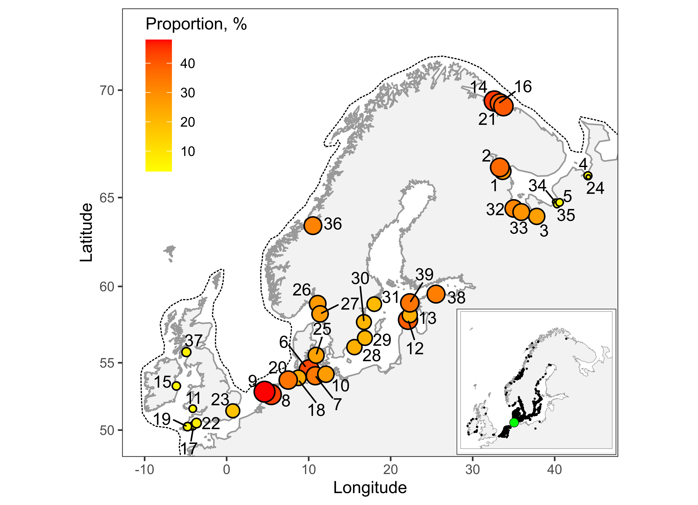

```{r setup, include=FALSE}
library(knitr)
opts_chunk$set(echo = FALSE, warning = FALSE, message = FALSE)

```

```{r}
library(mgcv)
library(ggplot2)
library(dplyr)
library(broom)
library(car)
library(reshape2)
library(readxl)

options(knitr.kable.NA = '')


# Функция, задающая нумерацию рисунков

figRef <- local({
    tag <- numeric()
    created <- logical()
    used <- logical()
    function(label, caption, prefix = options("figcap.prefix"), 
        sep = options("figcap.sep"), prefix.highlight = options("figcap.prefix.highlight")) {
        i <- which(names(tag) == label)
        if (length(i) == 0) {
            i <- length(tag) + 1
            tag <<- c(tag, i)
            names(tag)[length(tag)] <<- label
            used <<- c(used, FALSE)
            names(used)[length(used)] <<- label
            created <<- c(created, FALSE)
            names(created)[length(created)] <<- label
        }
        if (!missing(caption)) {
            created[label] <<- TRUE
            paste0(prefix.highlight, prefix, " ", i, sep, prefix.highlight, 
                " ", caption)
        } else {
            used[label] <<- TRUE
            paste(prefix, tag[label])
        }
    }
})

options(figcap.prefix = "Рисунок", figcap.sep = ".", figcap.prefix.highlight = "**")


theme_set(theme_bw())

age_all <- read.table("Data/age_Onega.csv", sep = ",", header = T, dec = ".")

age <- age_all %>% filter(Age %in% 2:7)

# age_old <- age_all %>% filter(Age > 7)
# 
# age_old <- age_old %>% group_by(Sex) %>% filter(Right + Left >0) %>% summarise(Age = mean(Age), Right = sum(Right), Left  = sum(Left))
# 
# age <- rbind(age, age_old)

```


```{r}
library(ggmap)
library(mapproj)
library(maps)

library(rgeos) #этот пакет содержит какую-то хрень, которая позволяет обойти проблему пр чтении фалов средсвами maptools. 
#Att! Этот пакет должен быть загружен до maptools

library(mapdata)
library(maptools) # Rgshhs
library(PBSmapping)
library(gridExtra)
library(grid)
library(ggrepel)


theme_set(theme_bw() + theme(legend.key = element_blank()))

df_europ <- read.csv("Data/Europe_polygon.csv", header = T)


# Задаем пределы координат

Full_x <- c(-10, 45)
Full_y <- c(49, 72)

gg_full <- ggplot(df_europ, aes(x=long, y=lat, group=group)) +
  geom_polygon(fill = "gray95", colour = "gray60") + 
  coord_map(xlim = Full_x, ylim = Full_y) + 
  theme_bw() +  
  theme(plot.background = element_rect(fill = "white"), panel.grid = element_blank()) +
  labs(x = "Longitude", y = "Latitude")


```


**Для материала и методов**

In order to reveal the geographical range of the species, we used data from The Global Biodiversity Information Facility (GBIF.org (28 September 2022) GBIF Occurrence Download https://doi.org/10.15468/dl.qe7bf3). We obtained coordinates of ++ unique points of flunder occurrence in Europe. Using this data we calculated the geometric center of the range as a point with geographical coordinates equal to mean latitude and longitude. This point has the coordinates 54.29339N, 8.772293E.    

We calculated the geographical distance from each point where frequency of left-sided morph was assessed, to geometrical center of the flounder's range. 

To analyse the pattern of geographic distributon we constructed two regression models in which the dependent variable was the proportion of left-sided morphs (the value was assumed to follow the beta distribution). The distance from the geometrical center of the European part of the species' range was used as the first predictor in both models. We considered longitude as the second predictor, additionally describing the geographic position. We did not include latitude in the models, because in our material it showed collinearity with the other predictors. 

The first model was built for the European part of the material (points 14 - 39, Table 1), and the second one for the group of points located in the Arctic (points 1 - 13, Table 1). We did not combine both data sets (European and Arctic) into one model, as this would led to the appearance of collinearity between the predictors.    

Statistical processing was performed using the functions of the statistical programming language R (R Core Team, 2021). We used the "betareg" package (Cribari-Neto, Zeileis, 2010) to fit the regression model. To check collinearity of predictors in the models we estimated variance inflation factor using functions from "car" package (Fox,  Weisberg, 2019). No collinearity was detected in final versions of the models. 


**Ссылки**

Cribari-Neto F, Zeileis A (2010). “Beta Regression in R.” _Journal of Statistical Software_, *34*(2), 1-24.
doi: 10.18637/jss.v034.i02 (URL: https://doi.org/10.18637/jss.v034.i02).

R Core Team (2021). R: A language and environment for statistical computing. R Foundation for Statistical
  Computing, Vienna, Austria. URL https://www.R-project.org/.

Fox J.,  Weisberg S. (2019). An R Companion to Applied Regression, Third Edition. Thousand Oaks
  CA: Sage. URL: https://socialsciences.mcmaster.ca/jfox/Books/Companion/


**Таблица 1.**

```{r}
sites <- read_excel("Data/Points_coordinates_new.xlsx")

sites$Lat <- as.numeric(gsub(",", ".", sites$Lat))
sites$Lon <- as.numeric(gsub(",", ".", sites$Lon))
sites$Left_prop <- as.numeric(gsub(",", ".", sites$Left_prop))

sites_print <- sites %>% select(-Area) %>% select(Position, Site, Lat, Lon, Left_prop, Source)

sites_print$Site <- 1:nrow(sites_print)

kable(sites_print)

```


```{r}

gbif <- read.table("Data/GBIF_flunder_occurences_coordinates.csv", sep = "\t", header =  T)

occurence <- gbif %>% unique(.) 

nrow(occurence)
names(occurence) <- c("lat", "long")

mean_coord <- occurence %>% summarise_all(.funs = mean)

Pl_gbif <-
  gg_full + geom_point(data = occurence, aes(group = 1)) + geom_point(data = mean_coord, aes(group = 1), size = 4, shape = 21, fill= "yellow") + theme(axis.title = element_blank(), axis.text = element_blank(), axis.ticks = element_blank()) 

# Pl_gbif

ggsave(plot = Pl_gbif, filename = "Map_of_flunder_occurences.svg")  


```


**At! Эту картинку надо переделать, так как здесь не изменены номера точек. Сделаю.**




```{r,  fig.cap= figRef("Left_map", ""), fig.height=5}


sites <- read_excel("Data/Points_coordinates_new.xlsx")

sites$Lat <- as.numeric(gsub(",", ".", sites$Lat))
sites$Lon <- as.numeric(gsub(",", ".", sites$Lon))
sites$Left_prop <- as.numeric(gsub(",", ".", sites$Left_prop))


point_n <- read.csv("Data/point_sample_size.csv", header = T)

points <- data.frame(Point = 1:nrow(sites), Left_prop = sites$Left_prop, Lat = sites$Lat, Long = sites$Lon)


# ggplot(sites, aes(x = Left_prop)) + geom_histogram(binwidth = 3)


Pl_revers <-
  gg_full + 
  geom_point(data = points, aes(x = Long, y = Lat, size = Left_prop, group = 1, fill = Left_prop), shape = 21) + 
  scale_size_continuous(breaks = seq(0, 50, 5)) + 
  scale_fill_gradient(low = "yellow", high = "red")+
  geom_text_repel(data = points, aes(x = Long, y = Lat, group = 1, label = Point), force = 3, box.padding = 0.3) + 
  labs(size = "Proportion of Reverse", fill = "Proportion, %") +
  theme(legend.position = c(0.15, 0.81)) +
  guides(size = "none")


ggsave(plot = Pl_revers, filename = "Map_of_reverse_distribution.pdf")
 
 ggsave(plot = Pl_revers, filename = "Map_of_reverse_distribution.tiff")  

 ggsave(plot = Pl_revers, filename = "Map_of_reverse_distribution.png")  

 ggsave(plot = Pl_revers, filename = "Map_of_reverse_distribution.svg")  

# Pl_revers


ws_points <- read.table("Data/White_sea_points.csv", sep = ",", header = T)

ws_points$lat <- with(ws_points, N + N_m/100)
ws_points$long <- with(ws_points, E + E_m/100)


df_white_sea <- read.table("Data/ggWhite_Sea.csv", sep = ",", header = TRUE)

White_x <- c(min(df_white_sea$long), max(df_white_sea$long))
White_y <- c(min(df_white_sea$lat), max(df_white_sea$lat))


gg_white <- ggplot(df_white_sea, aes(x=long, y=lat, group=group)) +
  geom_polygon(fill = "gray95", colour = "gray60") + 
  coord_map(xlim = White_x, ylim = White_y) + 
  theme_bw() +  
  theme(plot.background = element_rect(fill = "white"), panel.grid = element_blank()) +
  labs(x = "Longitude", y = "Latitude") +
  geom_point(data = ws_points, aes(group = 1), size = 4) 


Pl_White_sea <- 
gg_white + 
  geom_point(data = ws_points, aes(group = 1), size = 4) + 
  geom_text(aes(x = 36, y = 66.8, group = 1, label = "Kandalaksha Bay")) + 
  geom_text(aes(x = 33.5, y = 64.5, group = 1, label = "Onega Bay")) + 
  geom_text(aes(x = 41.5, y = 65, group = 1, label = "Dvina Bay"))+ 
  geom_text(aes(x = 42, y = 66.2, group = 1, label = "Mezen Bay")) +
  geom_text_repel(data = ws_points, aes(label = Site, group = 1), box.padding = 1.2,force = 0.5, size = 3)
 


```

<br>
<br>


```{r}
kam <- read.table("Data/kambala.csv", sep = ",", header = T, dec = ".")

# str(kam)
kam$Outcome <- ifelse(kam$Sidedness == "Left", 1, 0)


kam$Bay <- factor(kam$Bay, levels = c("Kandalaksha_Bay", "Onega_Bay", "Dvina_Bay", "Mezen_Bay" ), labels = c("Kandalaksha Bay", "Onega Bay", "Dvina Bay", "Mezen Bay" ))


frq_Orient <- kam %>% group_by(Bay) %>% summarise(Left = sum(Sidedness == "Left"), Right = sum(Sidedness == "Right"))
  
# Добавляем то, что не было измерено в Кандалакшском заливе
frq_Orient[frq_Orient$Bay == "Kandalaksha Bay", 2:3] <- frq_Orient[frq_Orient$Bay == "Kandalaksha Bay", 2:3] + c(37, 132)
  
frq_Orient2 <- frq_Orient %>% mutate(Left_prop = Left/(Left + Right), Right_prop = Right/(Left + Right)) %>% select(Bay, Left_prop, Right_prop) %>% melt()
  
frq_Orient2$perc_value <- round(frq_Orient2$value*100,1)


# library(ggpubr)
# 
# ggpie(data = frq_Orient2, x = "perc_value", label = "lab", lab.pos = c("out" ), lab.adjust = 0,
#   lab.font = c(4, "bold", "black"), font.family = "",
#   color = "black", fill = "white", palette = NULL, size = NULL,
#   ggtheme = theme_pubr()) +  facet_grid(~Bay)
# 
# 

frq_Orient2$lab <- ifelse(frq_Orient2$variable == "Left_prop", paste(frq_Orient2$perc_value), " ")

# frq_Orient2$lab <- c("28.4", "20.6",   "5.2",  "3.3",  " ",    " ",    " ",    " "  )

frq_Orient2$lab <- c(" 28.4", " 20.6",   "5.2",  "3.3",  " ",    " ",    " ",    " "  )

frq_Orient3 <- frq_Orient2 %>% group_by(Bay) %>% mutate(position = cumsum(value) - 0.5*value)

frq_Orient3$position_y <- frq_Orient3$position + c(-0.1, -0.09, 0.05, 0.05, 0,0,0,0)


# str(frq_Orient3)
frq_Orient3$Bay <- factor(frq_Orient3$Bay, levels = c( "Kandalaksha Bay", "Mezen Bay", "Onega Bay", "Dvina Bay"))

frq_Orient3$value[2] <- 0.206
frq_Orient3$value[6] <- 1 - 0.206


# library(ggrepel)
Pl_pay_charts <-
  ggplot(frq_Orient3, aes(x ="", y = value, fill = variable)) + 
  geom_bar(stat= "identity", width=1, color = "black") + 
  coord_polar("y", start=0)  + 
  facet_wrap(~ Bay)+
  scale_fill_manual(values = c("gray10", "gray80")) +
  theme(axis.text = element_blank(), panel.grid = element_blank(), panel.border = element_blank(), axis.title = element_blank(), strip.background = element_blank(), strip.text = element_text(size = 15))+ 
  guides(fill="none") + 
  geom_text(aes(label = lab, y = position_y), position = position_dodge(width = -1))


library(cowplot)
Pl_pay_charts_map <- plot_grid(gg_white, Pl_pay_charts, rel_widths = c(1, 0.8))


 ggsave(plot = Pl_pay_charts_map, filename = "Pie_charts_with_left_proportion.pdf")
 
 ggsave(plot = Pl_pay_charts_map, filename = "Pie_charts_with_left_proportion.tiff")  

 ggsave(plot = Pl_pay_charts_map, filename = "Pie_charts_with_left_proportion.png")  


 ggsave(plot = Pl_pay_charts_map, filename = "Pie_charts_with_left_proportion.eps")
  
# Pl_pay_charts
```


```{r}

library(readxl)
library(ggplot2)


sites <- read_excel("Data/Points_coordinates_new.xlsx")

sites$Lat <- as.numeric(gsub(",", ".", sites$Lat))
sites$Lon <- as.numeric(gsub(",", ".", sites$Lon))
sites$Left_prop <- as.numeric(gsub(",", ".", sites$Left_prop))

sites$Left_prop2 <- sites$Left_prop/100


library(raster)


my.sites <- as.matrix(sites[, 5:4])


salinity = raster("D:/Data_LMBE/BIO_Oracle_predictors/Present.Surface.Salinity.Mean.asc")


sites.environment <- data.frame(Lat = sites$Lat, Lon = sites$Lon,
                                Site = sites$Site,
                                Area = sites$Area,
                                Left_prop = sites$Left_prop/100,
                                Sal = extract(salinity,my.sites[,1:2])
)
     

library(dplyr)

# В качестве точки отсчета берется центр области, где изучена частота левосторонних
dist_1 <- acos(sin(55.36654   * pi/180)*sin(sites.environment$Lat*pi/180) + cos(55.36654  *pi/180)*cos(sites.environment$Lat*pi/180)*cos(9.046538*pi/180 - sites.environment$Lon*pi/180)) * 6371


sites.environment$Dist1 <- dist_1


# В качестве точки отсчета берется центр Европейской части ареала по GBIF

dist_2 <- acos(sin(54.29339  * pi/180)*sin(sites.environment$Lat*pi/180) + cos(54.29339 *pi/180)*cos(sites.environment$Lat*pi/180)*cos(8.772293 * pi/180 - sites.environment$Lon*pi/180)) * 6371


sites.environment$Dist2 <- dist_2


sites_arctic <- sites.environment %>% filter(Area == "Arctic")

sites_european <- sites.environment %>% filter(Area != "Arctic")


```


```{r}
library(betareg)
library(car)
library(broom)


mod_europ <- betareg(Left_prop ~ Dist2 + Lon, data = sites_european )
# vif(mod_europ)
# summary(mod_europ)

mod_arctic <- betareg(Left_prop ~ Dist2 + Lon, data = sites_arctic )
# vif(mod_arctic)
# summary(mod_arctic)


```


```{r}
# kable(tidy(mod_europ)[, -1])

```


Table 2. Parameters of beta-regression model describing the dependency between frequency of left-sided morphs in European populations and distance from geometric center of European part of the species' range and geographic longitude.


|Term        |   Parameter| SE| z-value|   p.value|
|:-----------|----------:|---------:|---------:|---------:|
|(Intercept) | -1.0433374| 0.1957489| -5.329978| 0.0000001|
|Distance       | -0.0009912| 0.0002569| -3.858260| 0.0001142|
|Longitude         |  0.0493457| 0.0108508|  4.547664| 0.0000054|
|Precision coefficient (phi)       | 25.0491193| 6.8834960|  3.639011| 0.0002737|


```{r}
# kable(tidy(mod_arctic)[,-1])

```


Table 3. Parameters of beta-regression model describing the dependency between frequency of left-sided morphs in Arctic populations and distance from geometric center of European part of the species' range and geographic longitude.


|Term        |   Parameter| SE| z-value|   p.value|
|:-----------|----------:|----------:|---------:|---------:|
|(Intercept) |  9.1662318|  1.7262327|  5.309963| 0.0000001|
|Distance      | -0.0000264|  0.0008599| -0.030749| 0.9754697|
|Longitude         | -0.2864276|  0.0348244| -8.224910| 0.0000000|
|Precision coefficient (phi)       | 54.5865992| 21.4711824|  2.542319| 0.0110120|


**Текст для изложения**

For European flounder populations, a statistically significant relationship was shown between the frequency of left-handed morphs with both the distance from the geometrical center of the European part of the species' range and the geographic longitude. The negative coefficient (Table 2) indicates a decrease in the frequency of anomalous flatfish with increase of distance from the center of the species' range. This decrease is well traceable both when moving from the center of the European part of the range towards the British islands, and when moving towards the inner regions of the Baltic Sea. 

The positive coefficient for geographic latitude (Table 2) indicates an increase in the frequency of left-handed morphs when moving from west to east.   


For Arctic flounder populations, a statistically significant relationship of the dependent variable with geographic longitude only was shown. The negative coefficient (Table 3) indicates a decrease in the frequency of abnormal flounder when moving from west to east.   


