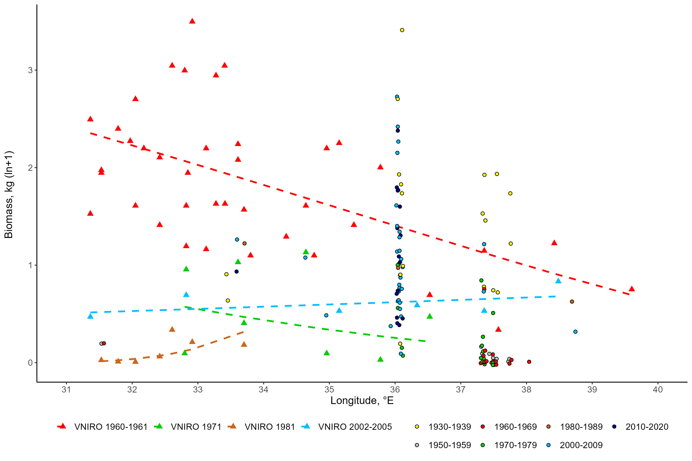
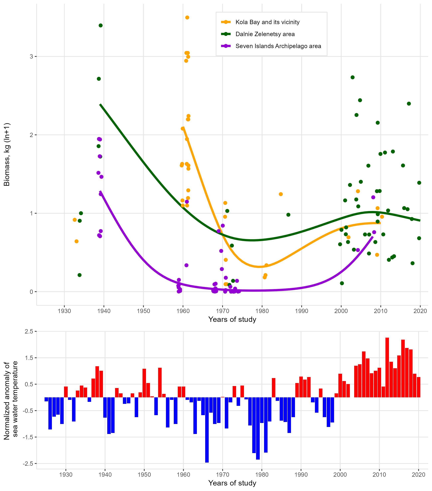
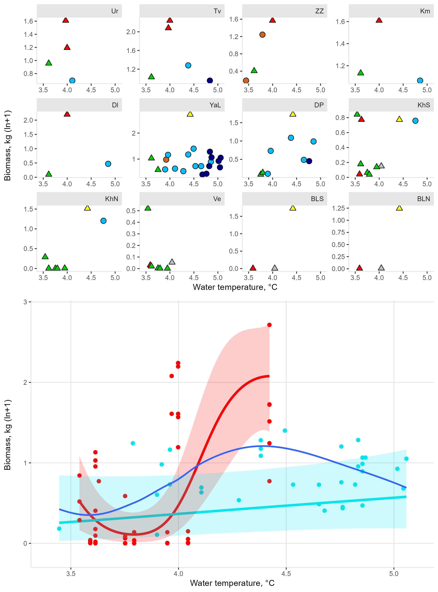

```{r setup, include=FALSE}

knitr::opts_chunk$set(echo = TRUE, message = FALSE, warning = FALSE)

```

```{r Packages}
library(readxl)
library(AID)
library(dplyr)
library(mgcv)
library(gratia)
library(ggplot2)
library(ggnewscale)
library(ggpubr)
library(broom)
library(reshape2)
library(vegan)
# install.packages("remotes")
# remotes::install_github("gavinsimpson/ggvegan")
library(ggvegan)
library(ggrepel)
library(ggpp)
```

# Long-term dynamics

## Data reading and preparation

```{r}
myt <- read_excel("data/Murman_mussels.xlsx", sheet = "long-term data")

```

Site - locality name;
Monitoring - reference to the monitoring site;
Abbreviation - abbreviated names of monitoring site;
Area - the best studied areas;
Year - year of study;
Decade - decade of study;
Biomass -  mussel biomass, kg/sq.m;
Latitude - degrees north latitude;
Longitude - degrees east longitude;
Survey - VNIRO surveys.

Similar information is provided in Table S3.

```{r}
myt$Site <- factor(myt$Site)
myt$Monitoring <- factor(myt$Monitoring)
myt$Area <- factor(myt$Area)
myt$Survey <- factor(myt$Survey)
myt$Decade <- factor(myt$Decade)
```

## Data transformation

```{r}
bc_out <- boxcoxnc(myt$Biomass) # Box-Cox transformation

myt$Biomass_bc <- bc_out$tf.data

box_cox_back <- 
  function(x, lyam = 0.22)(x*lyam + 1)^(1/lyam) # Function for back-Box-Cox-transformation
```

## Production of Model 1 and Figure 2

### Data filtering

```{r}
myt_survey <- 
  myt %>% 
  filter(Survey %in% c("VNIRO 1960-1961", "VNIRO 1971", "VNIRO 1981", "VNIRO 2002-2005"))
```

### Model 1 constructing

```{r}
Model_1 <- 
  gam(Biomass_bc ~ s(Longitude, by = Survey) + Survey, data = myt_survey)

summary(Model_1) # the information is given in Table S4
```

### Model 1 validation

```{r}
appraise(Model_1) # GAM check
```

### Model 1 visualisation (Figure 2)

```{r}
MyData_gam1 <- 
  myt_survey %>% 
  dplyr::select(Biomass, Biomass_bc, Survey, Longitude) %>%  
  group_by(Survey)

MyData_gam1$B_predicted_gam <-  
  predict(Model_1, newdata = MyData_gam1)

myt_no_survey <- 
  myt %>% 
  filter(Survey %in% "-") %>% 
  dplyr::select(Biomass, Decade, Longitude) %>%  
  group_by(Decade) %>% 
  as.data.frame()

cols <- 
  c("1930-1939" = "yellow", "1950-1959" = "grey", "1960-1969" = "red", "1970-1979" = "green3", "1980-1989" = "chocolate3", "2000-2009" = "deepskyblue", "2010-2020" = "darkblue")

jitter <- position_jitter(width = 0.03, height = 0.03)

MyData_gam1$back_B_predicted_gam <- box_cox_back(MyData_gam1$B_predicted_gam)
MyData_gam1$log_back_B_predicted_gam <- log(MyData_gam1$back_B_predicted_gam+1)

MyData_gam1$log_B <- log(MyData_gam1$Biomass+1)

myt_no_survey$log_B <- log(myt_no_survey$Biomass+1)

Figure2 <-
  ggplot(data = MyData_gam1, aes(x = Longitude, y = log_back_B_predicted_gam)) + 
  geom_line(aes(color = Survey), linewidth = 1, linetype = 2) +
  geom_point(aes(y = log_B, color = Survey), shape = 17, size = 2.5) +
  scale_color_manual(values = c("red", "green3", "chocolate3", "deepskyblue")) +
  new_scale_fill() +
  geom_point(data = myt_no_survey, position = jitter, shape = 21, size = 1.7, aes(x = Longitude, y = log_B, fill = Decade)) +
  scale_fill_manual(values = cols) +
  labs(y = "Biomass, kg (ln+1) \n", x = "Longitude, °E") +
  scale_x_continuous(n.breaks = 10, limits = c(31, 40)) +
  guides(color = guide_legend(position = "bottom"),
         fill = guide_legend(position = "bottom")) +
  theme(legend.position = "bottom",
        panel.grid.major = element_blank(), 
        panel.grid.minor = element_blank(),
        panel.background = element_rect(fill = "white"),
        axis.line = element_line(color = "black"),
        legend.title = element_blank(),
        axis.text = element_text(size = 11),
        axis.title = element_text(size = 13),
        legend.text = element_text(size = 11))
        
ggsave(filename = "Figure2.jpeg", plot = Figure2, units = "cm",  height = 20, width = 30, dpi = 300, limitsize = FALSE)
```


## Production of Model 2 and Figure 3

### Data filtering

```{r}
myt_area <- 
  myt %>% 
  filter(Area %in% c("Kola Bay and its vicinity", "Dalnie Zelenetsy area", "Seven Islands Archipelago area"))

myt_area2 <- 
  myt_area %>% 
  filter(Year > 1934)

myt_area2$Area <- 
  factor(myt_area2$Area, levels = c("Kola Bay and its vicinity", "Dalnie Zelenetsy area", "Seven Islands Archipelago area"))
```

### Model 2 constructing

```{r}
Model_2 <- 
  gam(Biomass_bc ~ s(Year, by = Area) + Area + s(Site, bs = "re"),  method = "REML", data = myt_area2)

summary(Model_2) # the information is given in Table S4
```

### Model 2 validation

```{r}
appraise(Model_2) # GAM check
```

### Model 2 visualisation (Figure 3)

```{r}
MyData_gam2 <- 
  myt_area2 %>% 
  group_by(Area) %>%
  do(data.frame(Year = seq(min(.$Year), max(.$Year)))) %>% 
  unique()

predicted <- 
  predict(Model_2, newdata = MyData_gam2, se.fit = TRUE, exclude = "s(Site)", newdata.guaranteed = TRUE)

MyData_gam2$B_predicted_gam <- predicted$fit

MyData_B <- 
  myt_area %>% 
  dplyr::select(Biomass, Area, Year) %>%
  group_by(Area)

MyData_gam2$back_B_predicted_gam <- box_cox_back(MyData_gam2$B_predicted_gam)
MyData_gam2$log_back_B_predicted_gam <- log(MyData_gam2$back_B_predicted_gam+1)

MyData_B$log_B <- log(MyData_B$Biomass+1)

jitter2 <- position_jitter(width = 0.4)

Figure3A <-
  ggplot(data = MyData_gam2, aes(x = Year, y = log_back_B_predicted_gam)) + 
  geom_line(aes(color = Area), size = 1.5) +
  geom_point(data = MyData_B, position = jitter2, size= 2, aes(x = Year, y = log_B, color = Area)) +
  scale_color_manual(values = c("orange", "darkgreen", "darkviolet")) +
  labs(y = "Biomass, kg (ln+1)", x = "Years of study") +
  scale_x_continuous(n.breaks = 10, limits = c(1925, 2020), expand = c(0, 2)) +
  theme(legend.position = c(0.6, 0.9),
        legend.background = element_rect(fill = "white", colour = "grey90"),
        panel.grid.minor = element_blank(),
        panel.grid.major = element_line(color = "grey90"),
        axis.line = element_line(color = "grey90"),
        panel.background = element_rect(fill = "white"),
        legend.title = element_blank())

# Reading Kola Section Sea Temperature data
temp <- read_excel("data/Murman_mussels.xlsx", sheet = "Kola Section data", na = "NA")
```

Year - year of observation;
Temp - mean annual water temperatures in the 0-200 m layer at stations 3-7 of the Kola Section;
Temp_lag5 - average value over five years preceding the year of observation.

```{r}
temp$anomT <- temp$Temp-mean(temp$Temp)
temp$norm_anomT <- (temp$anomT - mean(temp$anomT))/sd(temp$anomT)
temp$period <- ifelse(temp$norm_anomT < 0, "cold", "warm")

Figure3B <-
  ggplot(data = temp, aes(x = Year, y = norm_anomT)) + 
  geom_col(aes(fill = period)) +
  scale_fill_manual(values = c("blue", "red")) +
  labs(y = "Normalized anomaly of \n sea water temperature", x = "Years of study") +
  scale_y_continuous(breaks = c(-2.5, -1.5, -0.5, 0.5, 1.5, 2.5), expand = c(0.01, 0.2)) +
  scale_x_continuous(n.breaks = 10, expand = c(0, 2)) +
  theme(legend.position = "",
        panel.grid.minor = element_blank(),
        panel.grid.major = element_line(color = "grey90"),
        axis.line = element_line(color = "grey90"),
        panel.background = element_rect(fill = "white"))

Figure3 <- 
  ggarrange(Figure3A, Figure3B, nrow = 2, ncol=1, heights = c(2, 1), align = "hv")

ggsave(filename = "Figure3.jpeg", plot = Figure3, units = "cm",  height = 25, width = 22, dpi = 300, limitsize = FALSE)
```


## Production of Model 3 and Figure 4

### Data filtering

```{r}
myt_monitor <- 
  myt %>% 
  filter(Monitoring %in% "yes")

myt_monitor$Period <- 
  ifelse(myt_monitor$Year < 1980, "1930-1979", "1980-2020")

myt_monitor$Period <- 
  factor(myt_monitor$Period)

myt_monitor$Site <-
  factor(myt_monitor$Site, levels = c("Ura Inlet", "Tyuva Inlet", "Zelenetskaya Zapadnaya  Inlet", "Klimkovka Inlet", "Dolgaya Inlet", "Yarnyshnaya Inlet_lit", "Dalne-Zelenetskaya Inlet", "Kharlov Island_S", "Kharlov Island_N", "Veshnyak Island_S", "Bolshoy Litsiy Island_S", "Bolshoy Litskiy Island_N"))

levels(myt_monitor$Site) <- c("Ur", "Tv", "ZZ", "Km", "Dl", "YaL", "DP", "KhS", "KhN", "Ve", "BLS", "BLN")

mon_temp <- 
  merge(myt_monitor, temp, by = "Year")
```

### Model 3 constructing

```{r}
Model_3 <- gam(Biomass_bc ~ s(Temp_lag5, by = Period, bs = "cr", k = 5) + Period + s(Site, bs = "re"), method = "REML", data = mon_temp)

summary(Model_3) # the information is given in Table S4
```

### Model 3 validation

```{r}
appraise(Model_3) # GAM check
```

### Model 3 visualisation (Figure 4)

```{r}
Figure4A <-
  ggplot(data = mon_temp, aes(x = Temp_lag5, y = log(Biomass+1), group = Site, fill = Decade, shape = Period, size = Period)) +
  geom_point() +
  scale_fill_manual(values = cols) +
  scale_shape_manual(values = c(24, 21)) +
  scale_size_manual(values = c(2.5, 3)) +
  facet_wrap(~Site, scale = "free_y", axes	= "all") +
  labs(y = "Biomass, kg (ln+1) \n", x = "Water temperature, °C") +
  theme(legend.position = "c(0.9, 0.9)",
        panel.grid.minor = element_blank(),
        panel.grid.major = element_blank(),
        axis.line = element_line(color = "grey90"),
        panel.background = element_rect(fill = "white"),
        strip.background = element_rect(color = "grey90", fill = "grey90"),
        strip.text = element_text(hjust = 1))

MyData_gam3 <- 
  mon_temp %>% 
  group_by(Period) %>%
  do(data.frame(Temp_lag5 = seq(min(.$Temp_lag5), max(.$Temp_lag5), length.out = 100))) %>%
  unique()

predicted <- 
  predict(Model_3, newdata = MyData_gam3, type = "response", se.fit = TRUE, exclude = "s(Site)", newdata.guaranteed = TRUE)

MyData_gam3$B_predicted_gam <- predicted$fit

MyData_gam3$SE <- predicted$se.fit

MyData_gam3$back_B_predicted_gam <- box_cox_back(MyData_gam3$B_predicted_gam)
MyData_gam3$log_back_B_predicted_gam <- log(MyData_gam3$back_B_predicted_gam+1)

MyData_gam3$CI_upper <- MyData_gam3$B_predicted_gam+1.96*MyData_gam3$SE
MyData_gam3$CI_lower <- MyData_gam3$B_predicted_gam-1.96*MyData_gam3$SE

MyData_gam3$back_CI_upper <- box_cox_back(MyData_gam3$CI_upper)
MyData_gam3$log_back_CI_upper <- log(MyData_gam3$back_CI_upper+1)

MyData_gam3$back_CI_lower <- box_cox_back(MyData_gam3$CI_lower)
MyData_gam3$log_back_CI_lower <- log(MyData_gam3$back_CI_lower+1)

Figure4B <-
  ggplot(data = MyData_gam3, aes(x = Temp_lag5, y = log_back_B_predicted_gam)) +
  geom_line(aes(color = Period), size = 1.5) +
  geom_point(data = mon_temp, aes(x = Temp_lag5, y = log(Biomass+1), color = Period), size = 2) +
  geom_ribbon(aes(ymin = log_back_CI_lower, ymax = log_back_CI_upper, fill = Period), alpha = 0.2) +
  scale_color_manual(values = c("red", "turquoise2")) +
  scale_fill_manual(values = c("red", "turquoise2")) +
  scale_y_continuous(breaks = c(0, 1, 2, 3), expand = c(0, 0.3)) +
  scale_x_continuous(expand = c(0.01, 0.01)) +
  labs(y = "Biomass, kg (ln+1) \n", x = "Water temperature, °C") +
  xlim(3.4, 5.1) +
  theme(legend.position = "",
        panel.grid.minor = element_blank(),
        panel.grid.major = element_line(color = "grey90"),
        axis.line = element_line(color = "grey90"),
        panel.background = element_rect(fill = "white")) +
  geom_smooth(data = mon_temp, aes(x = Temp_lag5, y = log(Biomass+1)), se = F)

Figure4 <- 
  ggarrange(Figure4A, Figure4B, nrow = 2, ncol=1)

ggsave(filename = "Figure4.jpeg", plot = Figure4, units = "cm",  height = 27, width = 20, dpi = 300, limitsize = FALSE)
```


# Demografic anlysis

## Demografic data reading and preparation

```{r}
Ya <-
  read_excel("data/Murman_mussels.xlsx", sheet = "demorgafic data")
```

Year - year of study;
Sample - sample number;
Length  - mussel length, mm;
Age - mussel age;
Part_studied - indicated proportion of mussels in the sample were age-determined;
Frame_area - core, sq.m;

The age structure of mussels for each sample is given in Table S1.

```{r}
# Age-abundance matrix construction
Ya_count <-
  dcast(Year + Sample + Part_studied + Frame_area  ~ Age, data = Ya)

# Recalculation of abundance per sample to abundance per sq. m
Ya_count[ , 5 : ncol(Ya_count)] <- Ya_count[ , 5 : ncol(Ya_count)] / Ya_count$Part_studied / Ya_count$Frame_area

# Total abundance of age classes per year
Ya_count <-
  Ya_count %>%
  group_by(Year, Sample) %>%
  summarise_at(vars(- c(Part_studied,  Frame_area)),.funs = sum)

# Matrix transformation to long format
Ya_N <-
  melt(Ya_count, id.vars = c("Year", "Sample"), variable.name = "Age", value.name = "N")

# Calculation of generation year
Ya_N <-
  Ya_N %>%
  mutate(Generation = Year - as.numeric(Age))

# Mean abundance of generations
Ya_gen <-
  Ya_N %>%
  group_by(Year, Generation, Age) %>%
  summarise(mean_N = mean(N, na.rm = TRUE))

Ya_gen %>%
  filter(mean_N > 0) %>%
  filter(Generation >= 1999) %>%
  mutate(Age = as.numeric(Age)) ->
  df

df %>%
  group_by(Generation) %>%
  summarise(N = n()) ->
  df_sample_size

# Years in which generations where presented in the population
df %>%
  group_by(Generation) %>%
  summarise(min_Year = mean(Generation), max_Year = max(Year)) ->
  generation_limits

# Fitting regression of log-transformed generation abundance on age
df %>%
  merge(., df_sample_size) %>%
  group_by(Generation) %>%
  filter(Age > 1) %>% # Mussels with age 1+ where not used in analysis
  filter(N > 3) %>% # Only generation with more 3 ind per year were used
  filter(Generation %in% c(1999:2014)) %>%
  group_modify( ~ tidy(lm(log(mean_N) ~ Age, data = .))) ->
  df_lm_filtered # Data-frame with linear models parameters

# Extracting regression Intercepts as measure of recruits' abundance (N0)
df_lm_filtered %>%
  filter(term == "(Intercept)") %>%
  dplyr:: select(Generation, estimate) %>%
  mutate(Anundance_0 = exp(estimate)) ->
  N0

# Extracting regression slopes  as measure of generation's mortality
df_lm_filtered %>%
  filter(term == "Age") %>%
  dplyr:: select(Generation, estimate) ->
  mortality
```

As a result of this code, we obtained the values of N0 and z for generation born between 1999 and 2014. The information is given in Table S5.

## Data on environmental parameters

```{r}
clim <- read_excel("data/Murman_mussels.xlsx", sheet = "environmental data", na = "NA")
```

Param_Type - monthly average values of environmental parameters (Tw_mean - water surface temperatures,°C; Ta_mean - air temperatures above water surface,°C; Waves_mean - wave height, m; Wind_mean - wind speed above water surface, m/s);
Month - month ordinal number (-11 and -12 correspond to the last two months of the previous year);
1999-2020 - year of observation.

```{r}
clim_long <-
  melt(clim, id.vars = c("Param_Type",	"Month"), variable.name = "Year") %>%
  filter(complete.cases(.)) %>%
  mutate(Year = as.numeric(as.character(Year)))

# Seasons
clim_long <-
  clim_long %>%
  mutate(Season = case_when(Month %in% 7:8 ~ "Summer",
                            Month %in% 9:10 ~ "Autumn",
                            Month %in% c(-11,-12, 1:4) ~ "Winter",
                            Month %in% 5:6 ~ "Spring")) %>%
  filter(complete.cases(.))

# Constructing data-frame with environmental parameters in years of particular generations' life
generation_limits$Winter_Tw_birth <- NA
generation_limits$Spring_Tw_birth <- NA
generation_limits$Summer_Tw_birth <- NA
generation_limits$Autumn_Tw_birth <- NA

generation_limits$Winter_Ta_birth <- NA
generation_limits$Spring_Ta_birth <- NA
generation_limits$Summer_Ta_birth <- NA
generation_limits$Autumn_Ta_birth <- NA

generation_limits$Winter_Waves_birth <- NA
generation_limits$Spring_Waves_birth <- NA
generation_limits$Summer_Waves_birth <- NA
generation_limits$Autumn_Waves_birth <- NA

generation_limits$Winter_Wind_birth <- NA
generation_limits$Spring_Wind_birth <- NA
generation_limits$Summer_Wind_birth <- NA
generation_limits$Autumn_Wind_birth <- NA

generation_limits$Winter_Tw_lifespan <- NA
generation_limits$Spring_Tw_lifespan <- NA
generation_limits$Summer_Tw_lifespan <- NA
generation_limits$Autumn_Tw_lifespan <- NA

generation_limits$Winter_Ta_lifespan <- NA
generation_limits$Spring_Ta_lifespan <- NA
generation_limits$Summer_Ta_lifespan <- NA
generation_limits$Autumn_Ta_lifespan <- NA

for(i in 1:nrow(generation_limits)){

  years <- generation_limits$Generation[i]

  generation_limits$Winter_Tw_birth[i] <-
    clim_long %>%
    filter(Param_Type == "Tw_mean" & Year %in% years & Season == "Winter") %>%
    pull(value) %>%
    mean

  generation_limits$Spring_Tw_birth[i] <-
    clim_long %>%
    filter(Param_Type == "Tw_mean" & Year %in% years & Season == "Spring") %>%
    pull(value) %>%
    mean

  generation_limits$Summer_Tw_birth[i] <-
    clim_long %>%
    filter(Param_Type == "Tw_mean" & Year %in% years & Season == "Summer") %>%
    pull(value) %>%
    mean

  generation_limits$Autumn_Tw_birth[i] <-
    clim_long %>%
    filter(Param_Type == "Tw_mean" & Year %in% years & Season == "Autumn") %>%
    pull(value) %>%
    mean

  generation_limits$Winter_Ta_birth[i] <-
    clim_long %>%
    filter(Param_Type == "Ta_mean" & Year %in% years & Season == "Winter") %>%
    pull(value) %>%
    mean

  generation_limits$Spring_Ta_birth[i] <-
    clim_long %>%
    filter(Param_Type == "Ta_mean" & Year %in% years & Season == "Spring") %>%
    pull(value) %>%
    mean

  generation_limits$Summer_Ta_birth[i] <-
    clim_long %>%
    filter(Param_Type == "Ta_mean" & Year %in% years & Season == "Summer") %>%
    pull(value) %>%
    mean

  generation_limits$Autumn_Ta_birth[i] <-
    clim_long %>%
    filter(Param_Type == "Ta_mean" & Year %in% years & Season == "Autumn") %>%
    pull(value) %>%
    mean

  generation_limits$Winter_Wind_birth[i] <-
    clim_long %>%
    filter(Param_Type == "Wind_mean" & Year %in% years & Season == "Winter") %>%
    pull(value) %>%
    mean

  generation_limits$Spring_Wind_birth[i] <-
    clim_long %>%
    filter(Param_Type == "Wind_mean" & Year %in% years & Season == "Spring") %>%
    pull(value) %>%
    mean

  generation_limits$Summer_Wind_birth[i] <-
    clim_long %>%
    filter(Param_Type == "Wind_mean" & Year %in% years & Season == "Summer") %>%
    pull(value) %>%
    mean

  generation_limits$Autumn_Wind_birth[i] <-
    clim_long %>%
    filter(Param_Type == "Wind_mean" & Year %in% years & Season == "Autumn") %>%
    pull(value) %>%
    mean

  generation_limits$Winter_Waves_birth[i] <-
    clim_long %>%
    filter(Param_Type == "Waves_mean" & Year %in% years & Season == "Winter") %>%
    pull(value) %>%
    mean

  generation_limits$Spring_Waves_birth[i] <-
    clim_long %>%
    filter(Param_Type == "Waves_mean" & Year %in% years & Season == "Spring") %>%
    pull(value) %>%
    mean

  generation_limits$Summer_Waves_birth[i] <-
    clim_long %>%
    filter(Param_Type == "Waves_mean" & Year %in% years & Season == "Summer") %>%
    pull(value) %>%
    mean

  generation_limits$Autumn_Waves_birth[i] <-
    clim_long %>%
    filter(Param_Type == "Waves_mean" & Year %in% years & Season == "Autumn") %>%
    pull(value) %>%
    mean

  generation_limits$Winter_Tw_lifespan[i] <-
    clim_long %>%
    filter(Param_Type == "Tw_mean", Year %in% years &  Season == "Winter") %>%
    pull(value) %>%
    mean(na.rm = T)

  generation_limits$Spring_Tw_lifespan[i] <-
    clim_long %>%
    filter(Param_Type == "Tw_mean", Year %in% years & Season == "Spring") %>%
    pull(value) %>%
    mean(na.rm = T)

  generation_limits$Summer_Tw_lifespan[i] <-
    clim_long %>%
    filter(Param_Type == "Tw_mean", Year %in% years & Season == "Summer") %>%
    pull(value) %>%
    mean(na.rm = T)

  generation_limits$Autumn_Tw_lifespan[i] <-
    clim_long %>%
    filter(Param_Type == "Tw_mean", Year %in% years & Season == "Autumn") %>%
    pull(value) %>%
    mean(na.rm = T)

  generation_limits$Winter_Ta_lifespan[i] <-
    clim_long %>%
    filter(Param_Type == "Ta_mean", Year %in% years &  Season == "Winter") %>%
    pull(value) %>%
    mean(na.rm = T)

  generation_limits$Spring_Ta_lifespan[i] <-
    clim_long %>%
    filter(Param_Type == "Ta_mean", Year %in% years & Season == "Spring") %>%
    pull(value) %>%
    mean(na.rm = T)

  generation_limits$Summer_Ta_lifespan[i] <-
    clim_long %>%
    filter(Param_Type == "Ta_mean", Year %in% years & Season == "Summer") %>%
    pull(value) %>%
    mean(na.rm = T)

  generation_limits$Autumn_Ta_lifespan[i] <-
    clim_long %>%
    filter(Param_Type == "Ta_mean", Year %in% years & Season == "Autumn") %>%
    pull(value) %>%
    mean(na.rm = T)

}

generation_limits <- 
  generation_limits %>% 
  filter(Generation <= 2014) # the information is given in Table S2
```

## Statistical analysis of demographic and environmental data

### Data reading and preparation

```{r}
dem_multivar <- read_excel("data/Murman_mussels.xlsx", sheet = "data for mult.stat.")
```

Year - year of generation birth;
N2-N10 - logarithmic values of mussel numbers per sq.m. at ages 2-10. Missing empirical values were predicted from the models fitted (see Table S5 for details);
No and Z - parameters of survivorship curves;
Columns 13-36 contain information about the environment parameters from data-frame "generation_limits".

```{r}
dem_multivar$Year <- factor(dem_multivar$Year)

dem_multivar <- as.data.frame(dem_multivar)

row.names(dem_multivar) <- dem_multivar$Year

dem_multivar %>%
  filter(complete.cases(.)) %>%
  dplyr::select(2:12) %>%
  as.data.frame() ->
  No_demogr # Data-frame with demographic parameters

dem_multivar %>%
  filter(complete.cases(.)) %>%
  dplyr::select(-c(1:12)) %>%
  as.data.frame() ->
  predictors # Data-frame with environmental parameters
```

### BIOENV
Attention! Running the following bioenv() takes a very long time!

```{r, eval=FALSE}
BIOENV <- bioenv(comm = No_demogr, env = predictors, method = "spearman", index = "euclidean", metric = "euclidean", parallel = 2)

summary(BIOENV) # the information is given in Table S6
```

### RDA

```{r}
rda(No_demogr ~ Spring_Wind_birth + Summer_Tw_lifespan + Spring_Tw_birth + Summer_Ta_birth + Spring_Ta_birth, data = dem_multivar) -> ord_rda

anova(ord_rda, permutations = 9999) # the information is given in Table S7
anova(ord_rda, by = "axis", permutations = 9999) # the information is given in Table S7
anova(ord_rda, by = "margin", permutations = 9999) # the information is given in Table S7
```

### RDA visualisation (Figure 5C)

```{r}
rda_scores <- fortify(ord_rda, scaling = "symmetric", display = c("sp","wa","bp"))
rda_scores_site <- rda_scores[rda_scores$score == "sites", ] 
rda_scores_sp <- rda_scores[rda_scores$score == "species", ] 
rda_scores_cons <- rda_scores[rda_scores$score == "biplot", ] 

d <- plot(ord_rda, scaling = "symmetric")
mul <- attr(d$biplot,"arrow.mul")

Figure5C <- 
  ggplot(rda_scores_site, aes(x = RDA1, y = RDA2)) + 
  theme_test() +
  geom_vline(xintercept = 0) + 
  geom_hline(yintercept = 0) + 
  geom_point(shape = 21, size = 5, fill = "steelblue2", color = "black") + 
  geom_segment(data = rda_scores_cons, aes(x = 0, y = 0, xend = RDA1 * mul, yend = RDA2 * mul),
               color = "chocolate4", arrow = arrow(type = "closed", angle = 4), size = 0.8) +
  geom_text_repel(data = rda_scores_sp, aes(label = label), color = "red3", size = 4) + 
  geom_text_repel(data = rda_scores_site, aes(label = label), color = "steelblue4", size = 3.5) + 
  geom_text_repel(data = rda_scores_cons, aes(x = RDA1 * mul, y = RDA2 * mul, label = label),
                  color = "chocolate4", size = 4, position = position_nudge_center(0.2, 0.2, 0, 0)) +
  guides(fill = guide_legend(title = NULL), shape = guide_legend(title = NULL), size = guide_legend(title = NULL)) +
  theme(axis.text = element_text(size = 11),
        axis.title = element_text(size = 13)) +
  labs (x = "RDA1  (50%)", y = "RDA2  (20%)") +
  xlim(-2, 2) +
  ylim(-1.5, 1.5)

ggsave(filename = "Figure5C.jpeg", plot = Figure5C, units = "cm",  height = 20, width = 32, dpi = 300, limitsize = FALSE)
```

