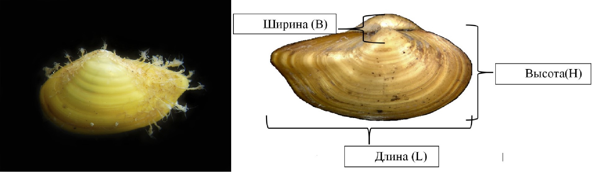

```{r setup, include=FALSE}
knitr::opts_chunk$set(echo = FALSE, warning = FALSE, message = FALSE)

library(reshape2)
library(knitr)
library(broom)
library(dplyr)
library(ggplot2)
library(gridExtra)


theme_set(theme_bw())


editor <- "Толмачева Е. Л."
editor_eng <- "Tolmacheva E. L."

# Функция, задающая нумерацию рисунков

figRef <- local({
    tag <- numeric()
    created <- logical()
    used <- logical()
    function(label, caption, prefix = options("figcap.prefix"), 
        sep = options("figcap.sep"), prefix.highlight = options("figcap.prefix.highlight")) {
        i <- which(names(tag) == label)
        if (length(i) == 0) {
            i <- length(tag) + 1
            tag <<- c(tag, i)
            names(tag)[length(tag)] <<- label
            used <<- c(used, FALSE)
            names(used)[length(used)] <<- label
            created <<- c(created, FALSE)
            names(created)[length(created)] <<- label
        }
        if (!missing(caption)) {
            created[label] <<- TRUE
            paste0(prefix.highlight, prefix, " ", i, sep, prefix.highlight, 
                " ", caption)
        } else {
            used[label] <<- TRUE
            paste(prefix, tag[label])
        }
    }
})

options(figcap.prefix = "Рисунок", figcap.sep = ".", figcap.prefix.highlight = "**")

```


```{r}
port <- read.table("data/Peregonimus2019.csv", header = T, sep = ",")

port <- port %>% mutate(N_polip = N_polip_right + N_polip_left )


sample_depth <- c("18-13", "8-9", "16-10", "12-11", "15-11")

port_print <- port %>% group_by(Proba) %>% summarise(Total = n())

port_print$Depth <- sample_depth

port_print <- port_print %>% select(Proba, Depth, Total)
```


**Методика сбора материала**


Сборы проводились в сублиторали Северной губы острова Ряжков в июле-августе 2019 года. Было взято 5 проб с помощью шлюпочной драги на глубине 8 - 18 м (Табл. +.1). Содержимое промывали через сито с диаметром ячеи 2 мм. Моллюсков, обнаруженных в пробах, определяли на месте и фиксировали в 75% спирте. Всего было обработано `r nrow(port)` моллюсков *Portlandia arctica*.


```{r}
kable(port_print, col.names = c("ID пробы по первичным записям", "Глубина (М)", "Количество измеренных молюсков"), caption = "Таблица +.1. Характеристика дражных проб, взятых в Северной губе августе 2019 г. Characteristics of samples taken in Severnaya inlet in August 2019.")
```

На каждом моллюске было подсчитано количество гидрантов *H.yoldiaearcticae* отдельно на левой и правой створках моллюска. После этого у моллюсков определяли три параметра раковины (`r figRef("Port_measur")`): длину (L), высоту (H), ширину (B). Измерение проводили точностью до 0,1 мм с помощью окуляра-микрометра бинокуляра МБС-10. Измеренные параметры приведены в таблице +.5.


```{r, fig.cap=figRef("Port_measur", "Внешний вид поселения гидроидов *H.yoldiaearcticae* и  схема измерения раковины *P. arctica*. The settlement of hydroids  *H.yoldiaearcticae* and measurement of *Portlandia arctica* shell parameters.")}



```

 
```{r}
invasiveness <- port %>% summarise(Inv_prop = round(mean((N_polip_right + N_polip_left) != 0)*100, 1), Inv_intens = round(mean((N_polip_right + N_polip_left)), 1), Sd_intens = round(sd((N_polip_right + N_polip_left)), 2))

```
 
 
Общая зараженность моллюсков составила `r   invasiveness$Inv_prop`%, при этом на одну особь моллюска приходится в среднем `r invasiveness$Inv_intens` ± `r invasiveness$Sd_intens` (средняя ± стандартное отклонение). 

Наблюдается отчетливая связь интенсивности (среднее количеством полипов на особь) и экстенсивности (доля зараженных) инвазии с длиной раковины хозяина (Таблица +.2, 3).  Чем больше размер раковины, тем больше вероятность заражения и больше количество полипов на раковине. 


```{r}

mod_intns <- lm(N_polip ~ L, data = port)
mod_int_print <- tidy(mod_intns)

mod_int_print$p.value <- ifelse(mod_int_print$p.value <0.01, "<0.01", round(mod_int_print$p.value, 3))


port$Infect_presence <- ifelse(port$N_polip > 0, 1, 0)


mod_ekst <- glm(Infect_presence ~ L, data = port, family = "binomial")
mod_ekst_print <- tidy(mod_ekst)

mod_ekst_print$p.value <- ifelse(mod_ekst_print$p.value <0.01, "<0.01", round(mod_ekst_print$p.value, 3))

```


```{r}
kable(mod_int_print, col.names = c("Параметр модели", "Значение", "Станд. ошибка", "t-статистика", "Уровень значимости"), digits = 3, 
      caption = "Таблица +.2. Параметры линейной модели, связывающей количество полипов на раковине и размер раковины. Parameters of a linear model linking the number of polyps on the shell and its size .")
```

 
 
 
```{r}
kable(mod_ekst_print, col.names = c("Параметр модели", "Значение", "Станд. ошибка", "z-статистика", "Уровень значимости"), digits = 3, 
      caption = "Таблица +.3. Параметры линейной модели, связывающей вероятность заражения и размер раковины. Parameters of a linear model linking the infection probability and shell size.")
```

 
Форма раковины *P.arctica* может быть описана величиной индекса уплощенности (HB), который отражает отношение высоты раковины к ее ширине. Чем больше этот показатель, тем более плоской является раковина моллюска. Индекс уплощенности демонстрирует заметную связь с размером моллюска (`r figRef("HB_L")`). Наиболее плоскими раковинами обладают самые мелкие и самые крупные моллюски. С другой стороны, индекс уплощенности демонстрирует связь и с количеством полипов, населяющих раковину (`r figRef("HB_L")`). Для описания зависимости индекса уплощенности от размера раковины и от количества полипов, одновременно, была построена линейная модель, параметры которой приведены в таблице +.4. Согласно полученной модели степень уплощенности раковины моллюска находится в зависимости количества полипов, поселившихся на поверхности раковины. Это позволяет предположить, что присутствие полипов-эктосимбионтов изменяет характер роста раковины.  


```{r, fig.cap=figRef("HB_L", "Зависимость индекса уплощенности от размера раковины и количества полипов. The dependence of the flatness index on the size of the shell and the number of polyps")}
port$HB <- port$H / port$B

Pl_HB_L <- ggplot(port, aes(x = L, y = HB)) + geom_point() + geom_smooth()
Pl_HB_polip <- ggplot(port, aes(x = N_polip, y = HB)) + geom_point() + geom_smooth() + labs(x = "Количество полипов")

grid.arrange(Pl_HB_L, Pl_HB_polip, ncol = 2)

```


```{r}
Mod_HB <- lm(HB ~ L + N_polip, data = port)

Mod_HB_print <- tidy(Mod_HB)

kable(Mod_HB_print, col.names = c("Параметр модели", "Значение", "Станд. ошибка", "t-статистика", "Уровень значимости"), caption = "Таблица +.4. Параметры линейной модели, связывающей степень уплощенности раковины (HB) c размером раковины (L) и количеством полипов, поселяющихся на ней (N_polip). Parameters of a linear model linking the degree of flattening of the shell (HB) with the size of the shell (L) and the number of polyps settling on it (N_polip). ")
```


```{r}
port_print <- port %>% select(Proba, N_polip_right, N_polip_left,     L,     B,      H)

kable(port_print, col.names = c("ID пробы", "Число полипов на правой створке", "Число полипов на левой створке", "L", "B", "H" ), digits = 2, caption = "Таблица +.5. Обилие полипов *H. yoldiaearcticae* на раковине *P.arctica* и параметры раковины моллюска")

```


