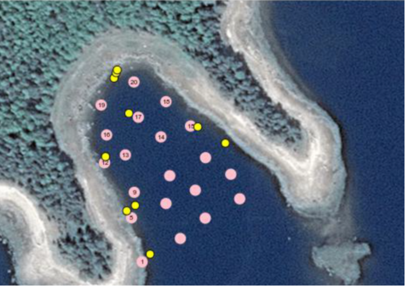
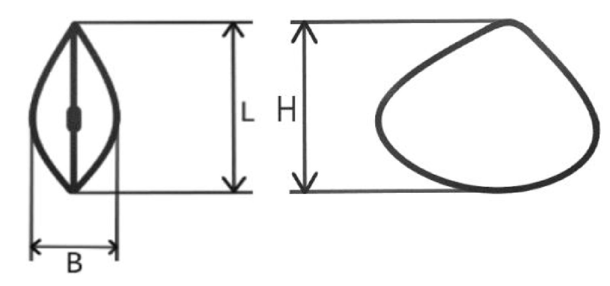
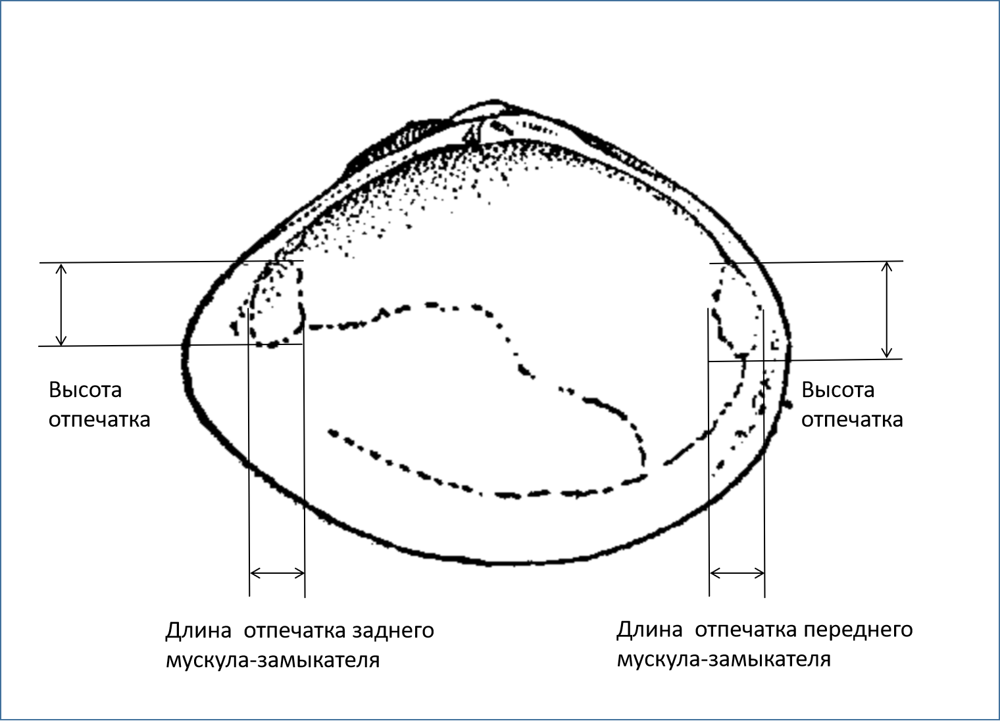

```{r setup, include=FALSE}
knitr::opts_chunk$set(echo = FALSE, warning = FALSE, message = FALSE)

library(reshape2)
library(knitr)
library(broom)
library(dplyr)
library(ggplot2)
library(gridExtra)


theme_set(theme_bw())


editor <- "Толмачева Е. Л."
editor_eng <- "Tolmacheva E. L."

# Функция, задающая нумерацию рисунков

figRef <- local({
    tag <- numeric()
    created <- logical()
    used <- logical()
    function(label, caption, prefix = options("figcap.prefix"), 
        sep = options("figcap.sep"), prefix.highlight = options("figcap.prefix.highlight")) {
        i <- which(names(tag) == label)
        if (length(i) == 0) {
            i <- length(tag) + 1
            tag <<- c(tag, i)
            names(tag)[length(tag)] <<- label
            used <<- c(used, FALSE)
            names(used)[length(used)] <<- label
            created <<- c(created, FALSE)
            names(created)[length(created)] <<- label
        }
        if (!missing(caption)) {
            created[label] <<- TRUE
            paste0(prefix.highlight, prefix, " ", i, sep, prefix.highlight, 
                " ", caption)
        } else {
            used[label] <<- TRUE
            paste(prefix, tag[label])
        }
    }
})

options(figcap.prefix = "Рисунок", figcap.sep = ".", figcap.prefix.highlight = "**")

```


```{r}
mac <- read.table("data/Ilistaya_Macoma_morphometry.csv", header = T, sep = ",")

mac$HB <- mac$H / mac$B 
mac <- mac %>% filter(HB < 6)


mac_adductor <- read.table("data/Macoma_Baltica_shell_morphometry_and_retractor_size_Ilistaya_inlet.csv", header = T, sep = ",")

years <- unique(mac[mac$Season == "Winter",1])


```


**Методика сбора материала**

Сбор материала проходил на территории Кандалакшского Государственного заповедника в Илистой губе о. Горелого (Лувеньгский архипелаг). Материал был собран зимой `r sort(years)` годов и летом (июль) 2018  года. Материал зимних сборов был собран на стандартной сети станций (см. главы Летописи, посвященные мониторингу бентосных сообществ Илистой губы за предыдущие годы). В данной работе был использован только материал станций №№ 1, 5, 9,12, 13, 14, 15, 16, 17, 18, 19, 20. Выбор этих точек был обусловлен тем, что на этих станциях присутствует только один вид - *M.balthica*, в то время как на остальных станциях может присутствовать также и *M.calcarea*, молодь которой плохо отличается от молоди *M.balthica*. Пробы, собранные летом 2018 г. располагались без привязки к стандартным станциям, но на глубине, соответствующей глубине стандартных станций (`r figRef("Stations")`) 


```{r, fig.cap=figRef("Stations", "Расположение стандартных станция (зимние сборы, серые точки на карте) и станций, на которых был собран материал летом 2018 г (желтые точки). The location of the standard stations (gray dots on the map) and the stations at which the material was collected in the summer of 2018 (yellow dots).")}



```


Для сбора проб применялся дночерпатель Петерсена с площадью захвата 1/40 кв. м. Зимой на каждой станции бралось по 4 пробы, а летом 2018 г. – по 2 пробы. Пробы, взятые на каждой станции, объединялись. Таким образом, зимой на каждой станции материал был получен с площади 1/10 кв. м, а летом - 1/20 кв. м. Во всех случаях пробы были промыты через сито с диаметром ячеи 0,5 мм. Из пробы были выбраны все моллюски *M. balthica* и зафиксированы в 4% растворе формалина.

У каждого моллюска, извлеченного из формалина и отмытого пресной водой, было измерено три параметра (`r figRef("Measur")`):  длина (L), как расстояние от переднего края раковины до сифонального края  ширина (B), как максимальное расстояние между левой и правой створками  при рассмотрении со стороны вершины;  и высота (H), как расстояние от вершины до противоположного ей брюшного края раковины. Первичные данные приведены в таблице 4. Для каждого моллюска был вычислен индекс уплощенности, как отношение высоты раковины (H) к ее ширине (B). Далее этот индекс будет обозначаться, как "HB" Чем выше значение HB, тем более плотской раковиной обладает моллюск. 


```{r, fig.cap=figRef("Measur", "Схема измерения раковины *Macoma balthica*. Слева вид со стороны вершины. L - длина, B - ширина, H - высота раковины. Shell measurement of * Macoma balthica *. Left view from the umbo of the shell. L is the length, B is the width, H is the height of the shell.")}



```

Для анализа многолетних изменений индекса HB была построена линейная модель, в которой индекс уплощенности выступал в качестве зависимой переменной, а год, как непрерывный предиктор. Однако, поскольку HB также зависит и от размера моллюсков, то в качестве ковариаты в модель также была включена и величина L. Оценка параметров модели приведена в таблице 1.

```{r}
Mod <- lm(HB ~ L + Year, data = mac)

Mod_prnt <- tidy(Mod)

Mod_prnt$p.value[Mod_prnt$p.value <=0.01] <- "<0.01"

kable(Mod_prnt, caption = "Таблица +.1. Параметры линейной модели, описывающей многолетние изменения индекса уплощенности. Parameters of a linear model describing long-term changes in the flatness index", digits = 3)
```


Согласно полученной модели, за время, прошедшее с начала наблюдений, индекс уплощенности существенно уменьшился (`r figRef("HB_dynam")`). Таким образом, была выявлена тенденция к изменению формы раковины моллюска. Если в начале периода наблюдений моллюски обладали более сплющенными раковинами (HB выше среднего), то в последние годы они демонстрируют более вздутые раковины (HB ниже среднего). Полученные данные хорошо согласуются с наблюдениями, сделанными другими авторами (Genelt-Yanovskiy et al., 2017), которые так же отметили увеличение "вздутости"  моллюсков этого вида в 2000-е годы по сравнению с наблюдениями, сделанными в 1990-е годы. 


```{r}
mac_adductor$Anterior_Adductor_size <- with(mac_adductor, (AAH_L+AAH_R)/2*(AAL_L+AAL_R)/2) 
mac_adductor$Posterior_Adductor_size <- with(mac_adductor, (PAH_L+PAH_R)/2*(PAL_L+PAL_R)/2) 


mac_adductor$HB <- mac_adductor$H/mac_adductor$B
mac_adductor$W_sh <- mac_adductor$WL+mac_adductor$WR 
                                    
Mod2 <- lm(Anterior_Adductor_size ~ HB + W_sh, data = mac_adductor)


Mod3 <- lm(Posterior_Adductor_size ~ HB + W_sh, data = mac_adductor)

```


```{r, fig.cap=figRef("HB_dynam", "Многолетние изменеия индекса уплощенности раковины *M.balthica* в популяции Илистой губы. Горизонтальная пунктирная линия отражает среднее значение за весь период наблюдений. Long-term changes in the flattening index of the M.balthica shell in the population of Ilistaya inlet. The horizontal dashed line represents the mean value over the entire observation period.")}

new_data <- data.frame(Year = seq(min(mac$Year), max(mac$Year), 1), L = mean(mac$L))

predictions <- predict(Mod, newdata = new_data, se.fit = T)

new_data$Fit <- predictions$fit
new_data$SE <- predictions$se.fit


ggplot(new_data, aes(x = Year, y = Fit)) + geom_point(data = mac, aes(y = HB), size = 0.5, position = position_jitter(width = 0.1), alpha = 0.2) + geom_hline(yintercept = mean(mac$HB), linetype = 2) + geom_line(color = "blue") + geom_ribbon(aes(ymin = Fit - 1.96*SE, ymax = Fit + 1.96*SE), alpha = 0.2) + labs(x = "Годы", y = "Индекс уплощенности (HB)") + scale_x_continuous(breaks = seq(min(mac$Year), max(mac$Year), 2)) 
```


Дополнительно, на отдельной выборке (N = `r nrow(mac_adductor)` экз., сборы из акватории Илистой губы), были изучены еще несколько параметров раковин *M.balthica*: вес створок, отдельно взвешивали левую и правую створку, высота и длина отпечатка переднего мускула замыкателя, высота и длина отпечатка заднего мускула замыкателя (табл. +.5, `r figRef("Adductor")` ). Измерение этих параметров позволило оценить связь размера отпечатка мускула замыкателя с индексом уплощенности. Размер отпечатка оценивали, как произведение его длины на высоту, при этом размеры, снятые с левой и с правой створок усредняли. Были построены две регрессионные модели (таблица +.2, +.3), в которых зависимой переменной были размер отпечатка переднего мускула замыкателя и размер отпечатка заднего мускула замыкателя, соответственно. В обеих моделях в качестве предиктора выступали индекс уплощенности и вес створок (вес левой и правой створок был суммирован). Как для размера отпечатка переднего мускула замыкателя, так и для размера отпечатка заднего мускула была выявлена статистически значимая отрицательная связь с индексом уплощенности (таблица +.2,  +.3). Это означает, что моллюски с более вздутой раковиной (меньшее значение HB) обладают более крупными мускулами-замыкателями. Последнее, в свою очередь, означает, что створки более вздутых моллюсков могут сильнее сжиматься. Это может давать преимущество таким особям перед угрозой хищников, открывающих раковины двустворок путем их растяжения, как это делают, например, морские звезды *Asterias rubens*. Поскольку в последние годы в Илистой губе отмечено большое количество морских звезд (см. специальные главы Летописи за 2018 г.) можно предположить, что смещение индекса уплощенности, обнаруженное в результате многолетних наблюдений, является следствием влияния этих хищников.      


```{r, fig.cap=figRef("Adductor", "Схема измерения размера отпечатков переднего и заднего мускулов-замыкателей. Measurement of anterior and posterior adductors.")}



```


```{r}

Mod2_prnt <- tidy(Mod2)

Mod2_prnt$p.value<- round(Mod2_prnt$p.value,3)
Mod2_prnt$p.value[Mod2_prnt$p.value <=0.01] <- "<0.01"

kable(Mod2_prnt, caption = "Таблица +.2. Параметры линейной модели, описывающей связь размеров отпечатка переднего мускула-замыкателя с индексом уплощенности (HB) и весом раковины (W_sh). Parameters of a linear model describing association beween anterior adductor size and  flatness index (HB) and shell weight (W_sh)", digits = 3)
```


```{r}

Mod3_prnt <- tidy(Mod3)

Mod3_prnt$p.value<- round(Mod3_prnt$p.value,3)
Mod3_prnt$p.value[Mod3_prnt$p.value <=0.01] <- "<0.01"

kable(Mod3_prnt, caption = "Таблица +.3. Параметры линейной модели, описывающей связь размеров отпечатка заднего мускула-замыкателя с индексом уплощенности (HB) и весом раковины (W_sh). Parameters of a linear model describing association beween posterior adductor size and  flatness index (HB) and shell weight (W_sh)", digits = 3)
```


```{r}
mac$HB <- round(mac$HB, 3)
mac_print <- mac %>% arrange(Year)
kable(mac_print,col.names = c("Год", "Станция", "Сезон", "L", "B", "H", "HB"), caption = "Таблица +.4. Мофометрические показатели *M.balthica*. Morphoetrics of *M.balthica* shells")
```


```{r}
mac_adductor_print <- mac_adductor[, 2:15] 
kable(mac_adductor_print,  caption = "Таблица +.5. Дополнительные морфометрические параметры  *M.balthica*. Additional morphoetrics parameters of *M.balthica*")
```


В таблице +.5 использованы следующие обозначения:

*L* - Длина раковины     
*H* - Высота раковины     
*B* - Ширина раковины     
*WST* - Вес мягких тканей (Weight of Soft Tissue)      
*WL* - Вес левой створки     
*WR* - Вес правой створки     
*AAH_L* - Высота переднего мускула замыкателя на левой створке (Anterior Adductor height on left valve)    
*AAL_L* - Длина переднего мускула замыкателя на левой створке (Anterior Adductor length on left valve)    
*PAH_L* - Высота заднего мускула замыкателя на левой створке (Posterior Adductor  height on left valve)    
*PAL_L* - Длина заднего мускула замыкателя на левой створке (Posterior Adductor  height on left valve)    
*AAH_R* - Высота переднего мускула замыкателя на правой створке (Anterior Adductor height on right valve)    
*AAL_R* - Длина переднего мускула замыкателя на правой створке (Anterior Adductor length on right valve)    
*PAH_R* - Высота заднего мускула замыкателя на правой створке (Posterior Adductor  height on right valve)    
*PAL_R* - Длина заднего мускула замыкателя на правой створке (Posterior Adductor  height on right valve)    


