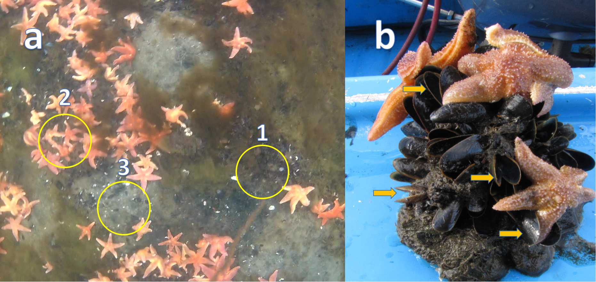
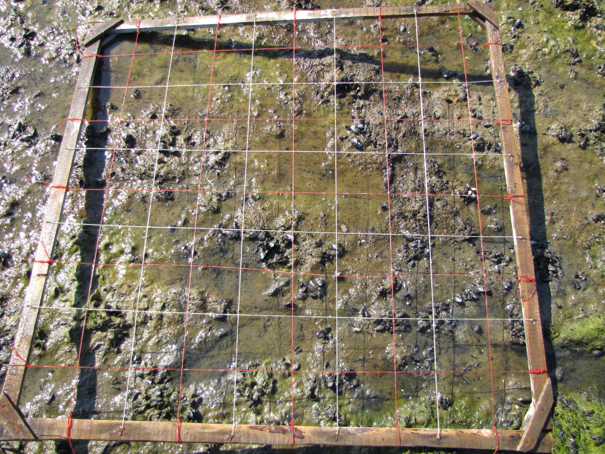

```{r setup, include=FALSE}
knitr::opts_chunk$set(echo = FALSE, warning = FALSE, message = FALSE)

library(reshape2)
library(knitr)
library(broom)


editor <- "Толмачева Е. Л."
editor_eng <- "Tolmacheva E. L."

# Функция, задающая нумерацию рисунков

figRef <- local({
    tag <- numeric()
    created <- logical()
    used <- logical()
    function(label, caption, prefix = options("figcap.prefix"), 
        sep = options("figcap.sep"), prefix.highlight = options("figcap.prefix.highlight")) {
        i <- which(names(tag) == label)
        if (length(i) == 0) {
            i <- length(tag) + 1
            tag <<- c(tag, i)
            names(tag)[length(tag)] <<- label
            used <<- c(used, FALSE)
            names(used)[length(used)] <<- label
            created <<- c(created, FALSE)
            names(created)[length(created)] <<- label
        }
        if (!missing(caption)) {
            created[label] <<- TRUE
            paste0(prefix.highlight, prefix, " ", i, sep, prefix.highlight, 
                " ", caption)
        } else {
            used[label] <<- TRUE
            paste(prefix, tag[label])
        }
    }
})

options(figcap.prefix = "Рисунок", figcap.sep = ".", figcap.prefix.highlight = "**")

```

**Методика сбора материала**

*Места сбора*

 Материал для исследования звезд в качестве хищников был собран с мидиевых банок, расположенных вблизи о. Куричек (66.99003 N, 32.58361 E) и между о. Горелый и о. Каменный (далее обозначается, как Лувеньга) (67.09726 N, 32.67953 E). Места сбора выбирались, исходя из большого количества морских звезд на мидиевых банках. 
 
 Материал для описания питания куликов-сорок был собран с четырех точек, где по результатам наблюдений сотрудников Кандалакшского заповедника наблюдались массовые скопления куликов: Восточное побережье о. Ряжков (67.03016 N, 32.554416 Е), корга на входе в Воронью губу (66.932523 N, 32.512762 E), мидиевая банка в проливе между о. Телячий и о. Олений (67.106342 N, 32.322750 E), мидиевая банка в Вороньей губе Vor 4 (66.934269 N, 32.506908 E) и мидиевая банка на о. Куричек (66.9833 N, 32.5833 E; материал приведен в Летописи природы за 2018 г). 

Все сборы проводились в августе 2019 г.

*Методика сбора материала в местах кормления морских звезд*

Для сбора материала в местах кормления морских звезд привлекался водолаз, который, перемещаясь над дном на глубине около 1.5 м, выискивал точки, соответствующие трем типам (`r figRef("Ast_sample")`). Точки первого типа – это участки дна, не занятые скоплениями звезд, на которых при визуальном наблюдении все мидии были живыми. На таких точках брали пробы с помощью рамки площадью 1/182 м2. Точки второго типа – это участки дна, покрытые плотными агрегациями морских звезд.  Водолаз помещал рамку 1/182 м2 непосредственно на агрегацию так, чтобы в рамку попали и звезды, и мидии, находящиеся под скоплением звезд. Точки третьего типа – участки дна, на которых визуально звезд было мало, но при этом просматривались многочисленные открытые створки мертвых моллюсков. На таких участках бралась проба с помощью рамки 1/20 м2. Выбор рамки большего размера в последнем случае был обусловлен тем, что обилие живых особей на таких участках было невелико. Далее пробы на участках первого типа будут обозначаться, как «Нет агрегации звезд», второго типа – «Агрегация звезд» и третьего типа - «Скопление мертвых створок».  


```{r, fig.cap=figRef("Ast_sample", "Схема расположения проб при описании кормления морских звезд. (a) Три типа проб: 1 - пробы на мидиях не тронутых звездами (Нет агрегации); 2 - Место, покинутое звездами, видны только мертвые створки; 3 - Проба на скоплении звезд (Агрегация звезд). (b) Внешний вид пгрегации звезд на друзе мидий. Стрелками показаны мертвые моллюски, съеденные морскими звездами. Sample layout for feeding starfish. (a) Three types of samples: 1 - samples on mussels not touched by stars (No aggregation); 2 - The place abandoned by the stars, only dead shells are visible; 3 - Sample on a aggregation of sea stars (Aggregation of stars). (b) Appearance of star aggregation on mussel patch. Arrows indicate dead mollusks eaten by starfish.")}




```

 


При дальнейшей обработке материал был промыт на сите с диаметром ячеи 3 мм. Если в пробе находились морские звезды, они отделялись от моллюсков. Из каждой пробы мидий были выбраны живые и предположительно съеденные (мертвые моллюски с двумя соединенными створками и без мягких тканей) мидии больше 10 мм. Все живые моллюски были сварены, из них были удалены мягкие ткани, а створки высушены. Створки мертвых съеденных моллюсков были отмыты от ила и также высушены. Морские звезды были взвешены с точностью до одной десятой грамма. 


**Методика сбора материала в местах кормления куликов-сорок**

В отливное время на поверхность подходящей мидиевой банки случайным образом располагалась квадратная рамка со сторонами 100 см, разделенная леской на квадраты со стороной 10 см. Эта рамка обозначала учетную площадку, с которой затем собирался материал. 


```{r, fig.cap=figRef("Core", "Рамка, спользованная для учета мидий. The mussel counting core used.")}



```


Каждый квадрат площадки был осмотрен; из каждого собирались мертвые створки мидий, которые были соединены между собой лигаментом и были видны с поверхности. После этого со скоплений живых мидий в пределах данной площадки были взяты три пробы мидий рамкой 1/182 м2. Каждая такая проба была пронумерована в соответствие со своей учетной площадкой. Всего таких площадок с разных точек было взято 18 и таким образом с каждой площадки собрано по 4 пробы (одна проба мертвых мидий со всей учетной площадки и три пробы живых мидий рамкой 1/182 м2).
Материал был промыт от ила на сите с диаметром ячеи 3 мм. Из каждой пробы живых мидий были выбраны моллюски с длиной створки больше 10 мм. Затем все живые моллюски были сварены, из них удалили мягкие ткани, а створки высушили. 

Пробы мертвых мидий были разделены на три группы:
1. Группа A – мидии, у которых на створках были обнаружены свежие остатки мускула-замыкателя; это характерно для мидий, съеденных куликами-сороками, которые перекусывают мускул, когда открывают створки. 
2. Группа B – мидии, у которых на створках были обнаружены свежие остатки любых других мягких тканей (чаще всего обрывки мантийных складок), но не было остатков мускул-замыкателя.
3. Группа C – створки, полностью без мягких тканей.
Все створки мертвых мидий были высушены. 

Для оценки влияния куликов-сорок на структуру литоральных поселений мидий были использованы только те мертвые моллюски, на раковинах которых были отмечены остатки мягких тканей (группы A и B, данные по мертвым моллюскам из группы C в анализ не включены).


**Обработка створок**

Каждая особь была измерена (определяли длину раковины с точностью до 1 мм) и отнесена к одному из двух морфотипов (`r figRef("Morph")`): T-морфотип (с высокой вероятностью *Mytilus trossulus*) или E-морфотип (с высокой вероятностью *M.edulis*) 


```{r, fig.cap=figRef("Morph", "Морфотипы мидий.  Mussel's morphotypes.")}

include_graphics('figure/Morphotypes1.jpg')


```


```{r}

library(ggplot2)

library(car)
library(reshape2)
# library(MASS)
library(mgcv)
# library(lme4)
library(gridExtra)
library(stringr)
library(dplyr)
# Установки паарметров графиков ########################

theme_set(theme_bw() + theme(axis.title = element_text(size = 10), plot.title = element_text(hjust = 0.5, size = 10), legend.text = element_text(size = 10)))


###########################
ast_size <- read.table('Data/Astfood_Length.csv', sep = ',', header = TRUE)
 

ast_size$Status <- factor(ast_size$Status, labels =  c("Живые", "Съеденные"))


# Рисунок Размерная структура съеденных и несъеденныъ мидий ######################

Pl_size_ast <- ggplot(ast_size, aes(x = Length, fill = Status)) + geom_density(alpha = 0.5) + scale_fill_manual(values = c("yellow", "black")) + labs(x = "Размер мидии", fill = "") + theme(legend.position = c(0.6, 0.8))


########################################
ast_myt <- read.table('Data/Astfood_2019.csv', sep = ',', header = TRUE)

asterias <- read.table('Data/Astfood_Asterias_2019.csv', sep = ',', header = TRUE)


asterias_abund <- asterias %>% group_by(Site, Sample) %>% summarise(N_aster = n(), B_aster = sum(B))


all_ast_abund <- merge(ast_myt, asterias_abund, all.x = T)

all_ast_abund[is.na(all_ast_abund)]<- 0 

all_ast_abund[all_ast_abund$Stage == "Stage_3", c("N_T_alive", "N_T_dead", "N_E_alive", "N_E_dead", "N_aster", "B_aster")] <- all_ast_abund[all_ast_abund$Stage == "Stage_3", c("N_T_alive", "N_T_dead", "N_E_alive", "N_E_dead", "N_aster", "B_aster")] * 20  

all_ast_abund[all_ast_abund$Stage != "Stage_3", c("N_T_alive", "N_T_dead", "N_E_alive", "N_E_dead", "N_aster", "B_aster")] <- all_ast_abund[all_ast_abund$Stage != "Stage_3", c("N_T_alive", "N_T_dead", "N_E_alive", "N_E_dead", "N_aster", "B_aster")] * 182  


all_ast_abund$Prop_dead <- with(all_ast_abund, (N_T_dead + N_T_dead)/(N_T_dead + N_T_dead + N_T_alive + N_T_alive))


all_ast_abund$N_dead <- with(all_ast_abund, (N_T_dead + N_T_dead))

all_ast_abund$Prop_T_alive <- with(all_ast_abund, N_T_alive/(N_T_alive + N_E_alive))


all_ast_abund$Prop_T_total <- with(all_ast_abund, (N_T_alive + N_T_dead)/(N_T_alive + N_T_dead + N_E_alive + N_E_dead) )

all_ast_abund$Prop_T_dead <- with(all_ast_abund, (N_T_dead)/(N_T_dead + N_E_dead) )


# Модель, описывающее поведение обилия звезд

Mod_ast_1 <- gam((B_aster) ~ s(Prop_dead, by = Site) + Site, data = all_ast_abund)

new_dat_ast <- all_ast_abund %>% group_by(Site) %>% do(expand.grid(levels = seq(from = 0,to = 1,by = 0.01), Prop_dead = seq(min(.$Prop_dead), max(.$Prop_dead), by = 0.01)))


new_dat_ast$Predict <- predict(Mod_ast_1, newdata = new_dat_ast)

Pl_aster_abund <- ggplot(new_dat_ast, aes(x = Prop_dead)) + geom_raster(aes(y = levels, fill = Predict), alpha = 0.6) + facet_wrap(~Site) + scale_fill_gradient(low = "white", high = "red") + guides(fill = "none")


# РИсунок зависимость обилия мертвых створок от биомассы звезд #########################

Pl_Baster_N_dead <- ggplot(all_ast_abund, aes(x = B_aster, y = N_dead)) + geom_point(size = 4, shape = 21, fill = "red")+  labs(x = "Биомасса звезд (г/кв.м)", y = "Обилие мертвых мидий (экз/кв.м)") 


###########################
Mod_1 <- glm(cbind(N_T_alive, N_E_alive) ~ Prop_dead * Site, data = all_ast_abund, family = "quasibinomial")

# drop1(Mod_1, test = "Chi")

Mod_2 <- update(Mod_1, . ~ . - Prop_dead:Site)

# drop1(Mod_2, test = "Chi")


new_data <- all_ast_abund %>% group_by(Site) %>% do(data.frame(Prop_dead = seq(min(.$Prop_dead), max(.$Prop_dead), length.out = 100)))

predicted <- predict(Mod_2, newdata = new_data, type = "response", se.fit = T)


new_data$Predicted <- predicted$fit 
new_data$SE <- predicted$se.fit


# Рисунок зависимость обилия доли Т-морфотипа среди живых  от обилия мертвых 

Pl_Prop_dead_Prop_T <- Pl_aster_abund + geom_point(data = all_ast_abund, aes(x = Prop_dead, y= Prop_T_alive)) + facet_wrap(~Site) + geom_ribbon(data = new_data, aes(ymin = Predicted - 1.96*SE, ymax = Predicted + 1.96*SE), alpha = 0.2) +  geom_line(data = new_data, aes(x = Prop_dead, y = Predicted),  color = "blue", size = 1) + guides (fill = "none") + labs(x = "Относительное обилие мертвых моллюсков", y = "Доля T-морфотипа среди живых")
# 
# ggsave("figures/Prop_dead_Prop_T.png", Pl_Prop_dead_Prop_T)


##############################
# Pay charts 
total_N <- melt(all_ast_abund %>% filter (Stage == "Stage_3" | Stage == "Stage_2" ) %>% summarise(N_T_dead = sum(N_T_dead), N_E_dead = sum(N_E_dead),  N_T_alive = sum(N_T_alive),  N_E_alive= sum(N_E_alive)) )

total_N$Status <- c("dead", "dead", "alive", "alive")

total_N <- dcast( variable ~ Status, data = total_N, value.var = "value")


#Рисунок пайчарты доля Тморфотипа среди живых и среди мертвых для питания звезд#######################

Pl_alive <- ggplot(total_N, aes(x ="", y = alive, fill = variable)) + geom_bar(stat= "identity", width=1, color = "black") + coord_polar("y", start=0)  + theme(axis.text = element_blank(), panel.grid = element_blank(), panel.border = element_blank(), axis.title = element_blank())+ guides(fill="none") + ggtitle("Живые")  + scale_fill_manual(values = c("red", "white"))


Pl_dead <- ggplot(total_N, aes(x ="", y = dead, fill = variable)) + geom_bar(stat= "identity", width=1, color = "black") + coord_polar("y", start=0) + theme(axis.text = element_blank(), panel.grid = element_blank(), panel.border = element_blank(), axis.title = element_blank()) + guides(fill="none")+ ggtitle("Съеденные звездами")  + scale_fill_manual(values = c("red", "white"))


```


**Воздействие морских звезд на структуру сублиторальных поселений мидий**

Первичные данные по обилию морских звезд и их размерной структуре в пробах приведены в Таблице +.1. Данные по размерам мидий и их морфотипам приведены в таблице +.2, обилие мидий разных морфотипов в пробах приводится в Таблице +.3.

Обилие створок мертвых мидий, обнаруженных в пробах, демонстрировало существенную взаимосвязь с обилием морских звезд (`r figRef("Dead_vs_Ast")`): в пробах с большим количеством хищников количество створок мертвых мидий возрастает. Это подтверждает принятое нами предположение, что основным источником мертвых моллюсков в пробах были атаки морских звезд. Размерная структура живых мидий и моллюсков, съеденных морскими звездами существенно не отличалась (`r figRef("Astfood_myt_size")`). Соотношение морфотипов  среди живых и мертвых моллюсков (`r figRef("Morph_dead_alive")`) свидетельствует о выборе хищниками в пользу мидий T-морфотипа. Доля мидий Т-морфотипа среди живых особей существенно снижается по мере увеличения интенсивности влияния хищников, о которой можно судить по частоте мертвых особей в пробах  (`r figRef("Prop_T_Prop_Dead")`).  


```{r, fig.cap=figRef("Dead_vs_Ast", "Зависимость обилия мертвых мидий от биомассы морских звезд в пробах.Dependence of the abundance of dead mussels on the biomass of starfish in samples.")}
Pl_Baster_N_dead
```


```{r, fig.cap=figRef("Astfood_myt_size", "Размерная структура живых мидий и моллюсков, съеденных морскими звездами. Size structure of live mussels and mollusks eaten by starfish.")}
Pl_size_ast
```


```{r, fig.cap=figRef("Astfood_myt_size", "Соотношение морфотипов мидий среди живых и мертвых моллюсков. Красный сектор - Т-морфотип, белый сектор - Е-морфотип. The ratio of mussel’s morphotypes among living and dead mollusks.The red sector is the T-morphotype, the white sector is the E-morphotype.")}

grid.arrange(Pl_alive, Pl_dead, ncol=2)
```


```{r, fig.cap=figRef("Prop_T_Prop_Dead", "Зависимость доли мидий Т-морфотипа среди живых моллюсков от относительного обилия мертвых моллюсков (частота мертвых моллюсков в пробе). Site 1 - окрестности о. Кричек; Site 2 - Лувеньгский архипелаг. Интенсивность заливки фона пропорциональна биомассе морских звезд. Dependence of the proportion of T-morphotype among alive mollusks on the relative abundance of dead mollusks (frequency of dead mussels in a sample). The intensity of the background fill is proportional to the biomass of starfish.Site 1 - near Kurichek island; Site 2 - Luvenga archipelago")}

Pl_Prop_dead_Prop_T
```


<!-- ################################ -->


```{r}
hem <- read.table("Data/Hotred_Length.csv", sep = ",", header = T)

hem <- hem[hem$Sample != "C", ]


## Рисунок размерная структура мидий в метсах питания куликов  #####


hem$Status <- factor(hem$Status, labels = c("Живые", "Съеденные"))


Pl_size_dist_hem <- ggplot(hem, aes(x = Length, fill = Status)) + geom_density(alpha = 0.5) + scale_fill_manual(values = c("yellow", "black")) + labs(x = "Размер мидии", fill = "") + theme(legend.position = c(0.7, 0.8))
 

# ggsave("figures/Size_dist_hem.png", Pl_size_dist_hem)


hem$Status <- factor(hem$Status, labels = c("alive", "dead"))


## Зависимость от доли мертвых у куликов #####

hem_abund <- hem %>% group_by(Site, Square) %>% summarise(N_T_alive = sum(Status == "alive" & Morph == "T")/3*182, N_E_alive = sum(Status == "alive" & Morph == "E")/3*182, N_T_dead = sum(Status == "dead" & Morph == "T"), N_E_dead = sum(Status == "dead" & Morph == "E"))
  


hem_abund$N_dead <- with(hem_abund, N_T_dead + N_E_dead)

hem_abund$N_alive <- with(hem_abund, N_T_alive + N_E_alive)

hem_abund$Prop_T_alive <- with(hem_abund, N_T_alive/(N_T_alive + N_E_alive))  

hem_abund$Prop_dead <- with(hem_abund, N_dead/(N_dead + N_alive ))  
hem_abund$Prop_T_dead <- with(hem_abund, N_T_dead/(N_T_dead + N_E_dead))  

hem_abund$Prop_T <- with(hem_abund,  N_T_alive / (N_T_alive + N_E_alive))


hem_abund_bank <- hem %>% group_by(Site) %>% summarise(N_T_alive = sum(Status == "alive" & Morph == "T"), N_E_alive = sum(Status == "alive" & Morph == "E"), N_T_dead = sum(Status == "dead" & Morph == "T"), N_E_dead = sum(Status == "dead" & Morph == "E"), n = length(unique(Square)))


hem_abund_bank$N_dead <- with(hem_abund_bank, N_T_dead + N_E_dead)/hem_abund_bank$n 

hem_abund_bank$N_alive <- with(hem_abund_bank, N_T_alive + N_E_alive)/hem_abund_bank$n / 3 * 182


hem_abund_bank$Prop_T <- with(hem_abund_bank,  N_T_alive / (N_T_alive + N_E_alive))

hem_abund_bank$Prop_dead <- with(hem_abund_bank, N_dead/N_alive)


## Рисунок Зависимость обилия живых от обилия мертвых в местах питания кулиаов ###################


Pl_N_dead_N_alive_hem <- ggplot(hem_abund_bank, aes(x = N_dead, y = N_alive)) + geom_point(size = 4) + labs(x = "Мертвые мидии (экз./кв.м)", y = "Живые мидии (экз./кв.м)") + geom_smooth(method = "glm", method.args = list(family = "quasipoisson"), size = 1.5) 


# ggsave("figures/N_dead_N_alive_hem.png", Pl_N_dead_N_alive_hem)


## Рисунок Зависимость доли Т-морфотипа среди живых от обилия мертвых в местах питания кулиаов ###################


Pl_N_dead_Prop_T_hem <- ggplot(hem_abund_bank, aes(x = N_dead, y = Prop_T)) + geom_point(size = 4, color = "red") + labs(x = "Среднее количество съеденных на кв. метр", y = "Доля T-морфотипа  среди живых") + geom_point(data =  hem_abund) +  geom_smooth(method = "glm", method.args = list(family = "quasibinomial"), size = 1.5) 


# ggsave("figures/N_dead_Prop_T_hem.png", Pl_N_dead_Prop_T_hem)


# Pay charts 
total_N <- melt(hem_abund_bank  %>% summarise(N_T_dead = sum(N_T_dead), N_E_dead = sum(N_E_dead),  N_T_alive = sum(N_T_alive),  N_E_alive= sum(N_E_alive)) )

total_N$Status <- c("dead", "dead", "alive", "alive")

total_N <- dcast( variable ~ Status, data = total_N, value.var = "value")

Pl_alive_hem <- ggplot(total_N, aes(x ="", y = alive, fill = variable)) + geom_bar(stat= "identity", width=1, color = "black") + coord_polar("y", start=0)  + theme(axis.text = element_blank(), panel.grid = element_blank(), panel.border = element_blank(), axis.title = element_blank())+ guides(fill="none") + ggtitle("Живые") + theme(plot.title = element_text(hjust = 0.5)) + scale_fill_manual(values = c("red", "white"))

Pl_dead_hem <- ggplot(total_N, aes(x ="", y = dead, fill = variable)) + geom_bar(stat= "identity", width=1, color = "black") + coord_polar("y", start=0) + theme(axis.text = element_blank(), panel.grid = element_blank(), panel.border = element_blank(), axis.title = element_blank()) + guides(fill="none") + ggtitle("Съеденные куликами") + theme(plot.title = element_text(hjust = 0.5)) + scale_fill_manual(values = c("red", "white"))


# ggsave("figures/Pay_charts_hem.png", grid.arrange(Pl_dead, Pl_alive,  ncol = 2))


```


**Воздействие куликов-сорок на структуру литоральных поселений мидий**

Данные по размерам мидий и их морфотипам приведены в таблице +.4. Моллюски, съеденные куликами-сороками, были в среднем крупнее, чем живые мидии, представленные на тех же участках (`r figRef("Hem_myt_size")`). Как и в случае с морскими звездами, соотношение морфотипов  среди живых и мертвых моллюсков (`r figRef("Hem_Morph_dead_alive")`) свидетельствует о выборе куликами-сороками в пользу мидий T-морфотипа.

Между обилием мертвых створок, обнаруженных на тех или иных участках, и долей мидий Т-морфотипа среди живых моллюсков наблюдалась заметная отрицательная корреляция (`r figRef("Hem_morph_dead")`). То есть на тех участках, где кулики кормились наиболее интенсивно, частота мидий Т-морфотипа среди живых моллюсков была ниже, чем на тех участках, где интенсивность выедания была ниже.  


```{r, fig.cap=figRef("Hem_myt_size", "Размерная структура живых мидий и моллюсков, съеденных куликами-сороками. Size structure of live mussels and mollusks eaten by oystercatchers.")}
Pl_size_dist_hem
```


```{r, fig.cap=figRef("Astfood_myt_size", "Соотношение морфотипов мидий среди живых и мертвых моллюсков в местах кормления куликов-сорок. Красный сектор - Т-морфотип, белый сектор - Е-морфотип. The ratio of mussel’s morphotypes among living and dead mollusks in the sites of oystercatcher's feeding. The red sector is the T-morphotype, the white sector is the E-morphotype.")}

grid.arrange(Pl_alive_hem, Pl_dead_hem, ncol=2)
```


```{r, fig.cap=figRef("Hem_morph_dead", "Зависимость доли мидий Т-морфотипа среди живых моллюсков от обилия мертвых моллюсков (количество мертвых моллюсков в пробе). Маленькими точками показаны отдельные квадраты, крупные точки обозначают средние значения для каждой мидиевой банки. Данные, полученные в 2018 г. также представлены на графике. Dependence of the proportion of mussel T-morphotype among living mollusks on the abundance of dead mussels (the number of dead specimens in the sample). Small dots indicate individual squares; large dots indicate the average values for each mussel bed. Data obtained in 2018 is also presented on the chart.")}

Pl_N_dead_Prop_T_hem

```


<!-- ######################### Таблицы с первичкой по звездам ########################### -->


```{r}
sample_type <- ast_size %>% group_by(Sample) %>% summarise(Type_2 = unique(Type_2))

asterias2 <- merge(asterias, sample_type)

# «Нет агрегации звезд», второго типа – «Агрегация звезд» и третьего типа - «Скопление мертвых створок»

asterias2$Sample_type [asterias2$Type_2 == "Stage 1"] <- "Нет агрегации звезд" 
asterias2$Sample_type [asterias2$Type_2 == "Stage 2"] <- "Агрегация звезд" 
asterias2$Sample_type [asterias2$Type_2 == "Stage 3"] <- "Скопление мертвых створок" 

asterias2$Site_Name [asterias2$Site == "Site 1"] <- "Окрестности о. Куричек" 
asterias2$Site_Name [asterias2$Site == "Site 2"] <- "Лувеньга" 


asterias_print <- asterias2 %>% arrange(desc(Site_Name)) %>% select(Sample, Site_Name, Sample_type, D, B) 

asterias_print$D <- round(asterias_print$D)

kable(asterias_print, col.names = c("Проба", "Точка сбора", "Тип пробы", "Размер морской звезды (мм)", "Вес морской звезды (г)"), 
      caption = "**Таблица +.1**. Размеры (максимальное расстояние от основания интеррадиуса до конца противоположного луча) и индивидуальный вес морских звезд, обнаруженных в пробах трех типов, взятых в двух точках сбора материала. The sizes (maximum distance from the base of the interradius to the end of the opposite arm) and the individual weight of starfish found in samples of three types taken at two localities.")


```


```{r}
ast_size2 <- ast_size  

ast_size2$Sample_type [ast_size2$Type_2 == "Stage 1"] <- "Нет агрегации звезд" 
ast_size2$Sample_type [ast_size2$Type_2 == "Stage 2"] <- "Агрегация звезд" 
ast_size2$Sample_type [ast_size2$Type_2 == "Stage 3"] <- "Скопление мертвых створок" 

ast_size2$Site_Name <- NA

ast_size2$Site_Name [ast_size2$Site == "Site 1"] <- "Окрестности о. Куричек" 
ast_size2$Site_Name [ast_size2$Site == "Site 2"] <- "Лувеньга" 


ast_size_print <- ast_size2 %>% arrange(desc(Site_Name)) %>% select(Sample, Site_Name, Sample_type, Status, Morph, Length ) 

ast_size_print2 <- ast_size_print %>% group_by(Sample, Site_Name, Sample_type, Status, Morph, Length) %>% summarise(N = n())

kable(ast_size_print2, col.names = c("Проба", "Точка сбора", "Тип пробы", "Состояние моллюска", "Морфотип", "Размер моллюска (мм)", "Количество особей"), 
      caption = "Таблица +.2. Индивидуальные характеристики мидий, собранных на участках кормления морских звезд.  Individual characteristics of mussels collected at star feeding sites.")


```


```{r}
ast_myt2 <- merge(ast_myt, sample_type)  

ast_myt2$Sample_type [ast_myt2$Type_2 == "Stage 1"] <- "Нет агрегации звезд" 
ast_myt2$Sample_type [ast_myt2$Type_2 == "Stage 2"] <- "Агрегация звезд" 
ast_myt2$Sample_type [ast_myt2$Type_2 == "Stage 3"] <- "Скопление мертвых створок" 

ast_myt2$Site_Name <- NA

ast_myt2$Site_Name [ast_myt2$Site == "Site 1"] <- "Окрестности о. Куричек" 
ast_myt2$Site_Name [ast_myt2$Site == "Site 2"] <- "Лувеньга" 


ast_myt2_print <- ast_myt2 %>% arrange(desc(Site_Name)) %>% select(Sample, Site_Name, Sample_type, N_T_dead, N_E_dead, N_T_alive, N_E_alive) 


kable(ast_myt2_print, col.names = c("Проба", "Точка сбора", "Тип пробы", "Мертвые Т-морф.", "Мертвые Е-морф.", "Живые Т-морф.", "Живые Е-морф."), 
      caption = "Таблица +.3. Обилие живых и мертвых мидий разных морфотипов.The abundance of living and dead mussels of different morphotypes.")

```


<!-- ######################### Таблицы с первичкой по куликам ########################### -->
<!-- Восточное побережье о. Ряжков (67.03016 N, 32.554416 Е), корга на входе в Воронью губу (66.932523 N, 32.512762 E), мидиевая банка в проливе между о. Телячий и о. Олений (67.106342 N, 32.322750 E), мидиевая банка в Вороньей губе Vor 4 (66.934269 N, 32.506908 E) и мидиевая банка на о. Куричек (66.9833 N, 32.5833 E; материал приведен в Летописи природы за 2018 г).  -->


```{r}
hem_print <- hem %>% group_by(Site, Square, Sample, Morph, Status, Length) %>% summarise(N = n())

hem_print$Site_name <- NA

hem_print$Site_name[hem_print$Site == "Kur"] <- "о. Куричек"
hem_print$Site_name[hem_print$Site == "Ryazhkov"] <- "о. Ряжков"
hem_print$Site_name[hem_print$Site == "Tel"] <- "Корга у о. Телячий"
hem_print$Site_name[hem_print$Site == "Vor4"] <- "Воронья губа, мидиевая банка Vor4"
hem_print$Site_name[hem_print$Site == "VorKorg"] <- "Воронья губа, корга"

hem_print2 <- hem_print %>% select(Site_name, Square, Sample, Morph, Status, Length,N) 

hem_print2 <- hem_print2[,-1]

kable(hem_print2, col.names = c("Расположение участка", "Номер квадрата", "Проба", "Морфотип", "Состояние мидии", "Размер (мм)", "Количество" ), 
      caption = "Таблица +.4. Индивидуальные характеристики мидий, собранных на участках кормления куликов-сорок.  Individual characteristics of mussels collected at oystercatcher’s feeding  sites.")


```

