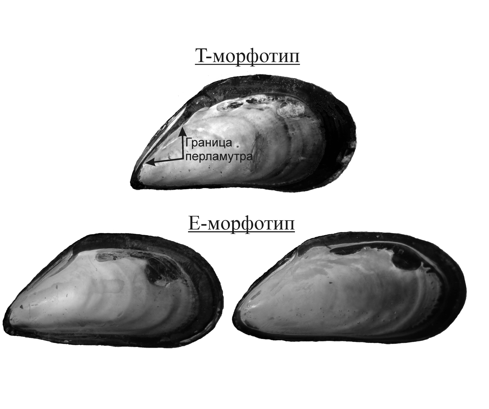

```{r setup, include=FALSE}


knitr::opts_chunk$set(echo = FALSE, warning = FALSE, message = FALSE, dpi=300)

library(reshape2)
library(knitr)
library(readxl)
library(dplyr)
library(ggplot2)
library(cowplot)
library(flextable)
library(officer)
library(lubridate)
library(ggmap)


editor <- "Толмачева Е. Л."
editor_eng <- "Tolmacheva E.L."

Year <- 2024

# Функция, задающая нумерацию рисунков

figRef <- local({
    tag <- numeric()
    created <- logical()
    used <- logical()
    function(label, caption, prefix = options("figcap.prefix"), 
        sep = options("figcap.sep"), prefix.highlight = options("figcap.prefix.highlight")) {
        i <- which(names(tag) == label)
        if (length(i) == 0) {
            i <- length(tag) + 1
            tag <<- c(tag, i)
            names(tag)[length(tag)] <<- label
            used <<- c(used, FALSE)
            names(used)[length(used)] <<- label
            created <<- c(created, FALSE)
            names(created)[length(created)] <<- label
        }
        if (!missing(caption)) {
            created[label] <<- TRUE
            paste0(prefix.highlight, prefix, " ", i, sep, prefix.highlight, 
                " ", caption)
        } else {
            used[label] <<- TRUE
            paste(prefix, tag[label])
        }
    }
})

options(figcap.prefix = "Рисунок", figcap.sep = ".", figcap.prefix.highlight = "**")


theme_set(theme_bw())


```


```{r }


Kand_upper_x <- c(32.2, 33.06)
Kand_upper_y <- c(66.9, 67.16)

ggKand_upper <- read.csv("Data/ggKand_upper.csv")


Plot_Kand_upper <- 
  ggplot(ggKand_upper, aes(x=long, y=lat, group=group)) + 
  geom_polygon(fill = "gray70", colour = "black") + 
  coord_map(xlim = Kand_upper_x, ylim = Kand_upper_y) + 
  theme(axis.ticks=element_blank(), axis.title.x =element_blank(),  axis.title.y= element_blank(), plot.background = element_rect(fill = NULL), panel.grid = element_blank())  +  
  annotate (x= 32.410973,  y = 67.154371, geom =  "point", size = 5, shape = 21, color = "black", fill = "white") +
  annotate (x= 32.52,  y = 67.154371, geom = "text", label =  "Кандалакша")


points <- read_excel("Data/Point_coordiates.xlsx")


library(ggrepel)

Pl_monitoring_position <-
Plot_Kand_upper + 
  geom_point(data = points %>% filter(Type =="NT_monitoring"), aes(x = Lon, y = Lat, group = 1), size = 5, fill = "yellow", shape = 21) +
  geom_text(data = points %>% filter(Type =="NT_monitoring"), aes(x = Lon, y = Lat, group = 1, label = 1:4)) +
  geom_point(data = points %>% filter(Type !="NT_monitoring"), aes(x = Lon, y = Lat, group = 1), size = 4, fill = "blue", shape = 22) +
  annotate (x= 32.663313,  y = 67.13, geom = "text", label =  "Лувеньгский архипелаг") +
  annotate (x= 32.461079,  y = 66.91, geom = "text", label =  "Воронья губа") +
  geom_text_repel(data = points %>% filter(Type =="Mussel_Bed"), aes(x = Lon, y = Lat, group = 1, label = 5:9))  

```


## Цель мониторинговой программы

В Белом море, помимо аборигенного вида  *Mytilus edulis*, или атлантической мидии, обнаружен второй, криптический, вида  тихоокеанская мидия, или *M.trossulus*. Этот второй вид предположительно был завезен в акваторию Белого моря после Второй Мировой Войны на днищах судов, курсировавших между Белым  и Баренцевым морями. В Баренцево море M.trossulus, предположительно, был завезен с Атлантического побережья Северной Америки конвоями судов, курсировавших по программе лендлиза. 

В связи с проникновением в акваторию Белого моря нового вида встал вопрос о динамике системы, в которой в смешанных поселениях сосуществуют аборигенный вид *M.edulis* и вселенец *M.trossulus*. Для отслеживания событий в этих смешанных поселениях были заложены четыре участка на островах вершины Кандалакшского залива (`r figRef("Monitor_points")`). Параллельно, проводится мониторинга размерной структуры пяти мидевых банок (`r figRef("Monitor_points")`), входе которого специальной задачи анализа таксономической структуры поселений не ставилось, однако собранные на этих банках сухие створки моллюсков были депонированы в коллекциях Лаборатории экологии морского бентоса (гидробиологии), что  позволило провести ретроспективный анализ таксономической струкутры этих поселений. Данные данного анализа позволили включить наблюдения на мидиевых банках в программу мониторинга смешанных поселений мидий. Приведенные ниже результаты анализа таксономической структуры поселений мидий на мидевых банках включаются в Летопись природы впервые.     


```{r, fig.cap=figRef("Monitor_points", "Точки мониторинга таксономического состава поселений мидий в вершине Кандалакшского залива Белого моря. 1 - о. Б. Лупчостров, 2 - о. Малый, 3 - о. Овечий, 4 - о. Ряжков. Мидиевые банки (Обозначения, согласно принятым в других главах Летописи природы): 5 - Mat, 6 - Korg, 7 - Vor2, 8 - Vor4, 9 - Vor5. Monitoring points of the taxonomic structure of mussel settlements in the top of the Kandalaksha Bay of the White Sea. 1 - о. B. Lupchostrov, 2 - island. Maly, 3 - Ovechy Island, 4 - Ryazhkov Island.  Mussel beds (Designations according to those adopted in other chapters of the Letopis): 5 - Mat, 6 - Korg, 7 - Vor2, 8 - Vor4, 9 - Vor5."), fig.width=6}


Pl_monitoring_position

```


## Описание таксономического состава смешанных поселений мидий по соотношению морфотипов

Для анализа многолетней динамики поселений была введена классификация, принятая в предыдущих публикациях (Katolikova et al., 2016; Khaitov et al., 2021): все моллюски были разделены на две группы, обозначаемые, как T- и E- морфотипы (`r figRef("Morph")`). Определение морфотипов проводилось в соответствии с паттерном закладки перламутрового слоя в районе нифы лигамента. У мидий T-морфотипа под нимфой прослеживается полоска перламутрового слоя не покрытая перламутром. У мидий E-морфотипа  эта полоска отсутствует или полоска призматического слоя прослеживается лишь под задней частью нимфы лигамента. 


Моллюски T-морфотипа с высокой вероятностью являются *Mytilus trossulus*, моллюски E-морфотипа - *M.edulis* (Khaitov et al., 2021). Для каждой пробы было подсчитано количество особей того или иного морфотипа и вычислена доля моллюсков T-морфотипа в общей численности. Данная величина является надежной оценкой вероятности встретить в поселении представителей *M.tossulus* (Khaitov et al., 2021). 


```{r fig.cap = figRef("Morph", "Внутренняя поверхность раковины мидий дух морфотипов. The inner surface of the shell of mussel spirit morphotypes."), fig.width=4}



```


## Методика описания поселений на фукоидах

Ежегодно, начиная с 2002 г., проводятся сборы мидий на литорали четырех островов (`r figRef("Monitor_points")`), расположенных в вершине Кандалакшского залива Белого моря в том числе и на территории Кандалакшского Государственного Природного Заповедника: О.Б.Лубчостров (N67.145842, E32.350530); О.Малый (N67.118464, E32.406149); О.Овечий (N67.090252, E32.460394); О.Ряжков (N67.019912, E32.571287).  

На каждом острове (за исключением о.Ряжкова) в одних и тех же точках отбирали по пять пучков фукоидов (пучки водорослей отбирались таким образом, чтобы на них визуально было представлено достаточно большое количество мидий). При сборах на о. Ряжкове было взято по 3 пучка фукоидов, что связано с существенно большим обилием мидий в этом районе. 

При разборке проб мидии были отделены от талломов фукоидов. В дальнейшем анализе были использованы только моллюски, имевшие длину раковины не менее 10 мм. Каждая проба (отдельный пучок водорослей) разбиралась независимо. Все отобранные моллюски были очищены от мягких тканей и в дальнейшей работе были использованы сухие створки.


Сборы мидий 2002 – 2010 гг. были  предоставлены А. В. Полоскиным в виде коллекций сухих створок. К сожалению, мидии из проб, взятых на каждом из островов в этот период, были объединены. То есть, структура поселений мидий на каждом из островов в эти годы формально была описана по одной выборке. 


## Методика описания поселений мидий на мидиевых банках


В тексте использованы обозначения мидиевых банок, устоявшиеся в предыдущих изданиях «Летописи природы Кандалакшского заповедника». 

Мидиевая банка *«Korg»* (67,110668 N;	32,642790 E) Расположена на корге в районе о-вов Малый и Большой Куртяжные (Лувеньгский архипелаг).

Мидиевая банка *«Mat»* (67,113299 N;	32,642897 E) Расположена на косе, идущей от материка, на расстоянии 260 м от предыдущей банки.

Мидиевая банка *«Vor2»*  (66,939778 N;	32,43461 E)  Банка расположена на нижней части литорали острова Воронинского, расположенного  в куту Вороньей губы. 

Мидиевая банка *«Vor4»* (66,934386 N; 32,506852 E) Банка расположена на косе, идущей от материка на расстоянии около 500 м от входа в Воронью губу. 

Мидиевая банка *«Vor5»* (66,928006 N; 32,491124 E) Банка расположена в проливе, соединяющем губу Воронью и губу Белую.  

На каждой банке были отобраны пробы с помощью пробоотборника площадью 55 см^2^. Начиная с 2010 г. раковины моллюсков длиной более 10 мм, собранные в каждой из проб, были очищены от мягких тканей, высушены и помещены в коллекции. В 2024 г. коллекционные сборы были обработаны и в каждой из проб была определена численность мидий двух морфотипов по той же методике, которая была использована при анализе таксономического состава смешанных поселений на фукоидах. 


## Динамика таксономического состава поселений мидий на фукоидах

Первичные данные по обилию мидий двух морфотипов в 2024 г. приведены в Таблице +.1. Данные за остальные годы наблюдений представлены в соответствующих главах Летописи за предыдущие годы.

```{r}
# Читаем данные
monitor <- read_excel("data/nt_ne_monitoring_2002_2024.xlsx") 

monitor$PropT <- round(with(monitor, Nt/(Nt+Ne)), 3)

monitor$Site <- factor(monitor$Site)


monitor <- 
  monitor %>% 
  mutate(Site2 = case_when(Site == "Lupch" ~ "о. Б. Лубчостров",
                                     Site == "Malij" ~ "о. Малый",
                                     Site == "Ovech" ~ "о. Овечий",
                                     Site == "Ryashkov" ~ "о. Ряжков")) 


```


```{r}
monitor_print <- 
  monitor %>% 
  filter(Year == 2024) %>% 
  select(Year, Site2, Sample, Nt, Ne, PropT)


library(officer)
std_border = fp_border(color="gray", width = 1)

colname <- c("Год", "Место сбора", "Номер пробы в первичном источнике", "Численность T-морфотипа", "Численность E-морфотипа",  "Доля T-морфотипа в общей численности")

monitor_print %>% 
  flextable() %>% 
  fontsize(part = "all") %>% 
   border_inner_h(border = std_border ) %>% 
  border_inner_v(border = std_border ) %>% 
  fontsize(size = 8, part = "all") %>% 
  set_header_labels(values = colname) %>% 
  colformat_double(j = 1,  big.mark = "", digits = 0) %>% 
  set_caption("Таблица +.1  Соотношение численностей T- и E-морфотипов в пробах на четырех островах в 2024 г. Abundance of T- and E-morfotypes in samples from four island in 2024.") 

# %>% 
  # autofit()
```


```{r}
library(mgcv)

monitor2 <- monitor %>% mutate(PropT_corrected = case_when( PropT == 1 ~ 0.9999,
                                                            PropT == 0 ~ 0.0001, 
                                                            PropT != 1 & PropT !=0 ~ PropT))

Mod_monitor_1 <- gam(PropT_corrected ~ s(Year, by = Site, bs = "tp") + Site, family = "betar", data = monitor2)


MyData2 <- expand.grid(Year = seq(min(monitor$Year), max(monitor$Year), 0.1), Site = levels(monitor$Site))

# unique(monitor[,1:2])

MyData2$Predict <- predict(Mod_monitor_1, newdata = MyData2, type = "response", se = T)$fit

MyData2$SE <- predict(Mod_monitor_1, newdata = MyData2, type = "response", se = T)$se.fit


MyData2 <- MyData2 %>% mutate(Site2 = case_when(Site == "Lupch" ~ "о. Б. Лубчостров",
                                     Site == "Malij" ~ "о. Малый",
                                     Site == "Ovech" ~ "о. Овечий",
                                     Site == "Ryashkov" ~ "о. Ряжков"))

Pl_dynam <- 
  ggplot(MyData2, aes(x = Year, y = Predict)) + 
  facet_wrap(~Site2, dir = "v") + 
  geom_point(data = monitor, aes(x = Year, y = PropT )) + 
  geom_ribbon(aes(ymin = Predict - 1.96*SE, ymax = Predict + 1.96*SE), alpha = 0.2) + 
  geom_path(color = "black", size = 1) +
  theme_bw() + 
  xlab("Годы") + 
  ylab("Доля мидий с T-морфотипом")  + 
  scale_x_continuous(breaks = seq(min(monitor$Year), max(monitor$Year), 1) )+
  theme(axis.text.x = element_text(angle = 90))

```

Соотношение обилий мидий двух морфотипов в 2024 г., в целом, соответствует тенденциям, наметившимся ранее (`r figRef("dynam")`). На литорали острова Б. Лупчостров, расположенного в куту залива, доля особей T-морфотипа колеблется год от года. Однако эти колебания могут быть объяснены малыми объемами выборок. Однако следует отметить, что в 2023 - 2024 гг. доля мидий T-морфотипа в данной точке заметно снижается. Тенденция к падению доли мидий T-морфотипа явно прослеживается как на о. Малый, так и на о. Овечий (`r figRef("dynam")`). На о. Ряжкове заметных отклонений от установившегося за последние годы соотношения не выявляется (`r figRef("dynam")`). 


```{r fig.cap= figRef("dynam", "Многолетняя динамика доли мидий, имеющих T-морфотип, в поселениях на талломах фукоидов на островах в вершине Кандалакшского залива. Острова расположены в порядке удаления от кута. Сплошная линия – непараметрическая сглаживающая функция (Обобщенная аддитивная модель; серая облсть ограничивает 95% доверительные интервалы). Long-term dynamics of T-morphotype proportions in mixed populations on fucoids at islands. Islands are ordered accordingly to distance from upper part of Kandlaksha bay. Solid line - fitted generalized additive model (GAM), gray area eround solid line - 95% confidence interval."), fig.width=6}

Pl_dynam
```


## Динамика таксономического состава поселений мидий на мидиевых банках

```{r}
myt <- read_excel("Data/nt_ne_mussel beds_2010_2024.xlsx", sheet = "Соотношение T и E  в пробах", na = "NA")

myt <- 
myt %>% 
  filter(bank %in% c("korg", "mat",  "vor2", "vor4", "vor5"))

```

Первичные данные по обилию мидий двух морфотипов в пробах на мидевых банках в 2010 - 2024 гг. приведены в Таблице +.2. В таблицу сведены результаты анализа коллекций во всем имеющемся материале, включая те пробы, которые были взяты вне программы мониторинга размерной структуры мидиевых банок. 

```{r}

myt_print <- 
  myt %>% 
  select(year, bank, Season, sample,  N_T, N_E) %>% 
  mutate(PropT = round(N_T/(N_T+N_E), 3)) 

myt_print <-
  myt_print %>%
  arrange(year)
  

colname <- c("Год", "Мидиевая банка", "Месяц сбора", "Номер пробы в первичном источнике", "Численность T-морфотипа", "Численность E-морфотипа",  "Доля T-морфотипа в общей численности")

myt_print %>% 
  flextable() %>% 
  fontsize(part = "all") %>% 
   border_inner_h(border = std_border ) %>% 
  border_inner_v(border = std_border ) %>% 
  fontsize(size = 8, part = "all") %>% 
  set_header_labels(values = colname) %>% 
  colformat_double(j = 1,  big.mark = "", digits = 0) %>% 
  set_caption("Таблица +.1  Соотношение численностей T- и E-морфотипов в пробах на мидиевых банках. Abundance of T- and E-morfotypes in samples from mussel beds.") 

# %>% 
  # autofit()
```


```{r}

monitor2 <- myt_print %>% mutate(PropT_corrected = case_when( PropT == 1 ~ 0.9999,
                                                            PropT == 0 ~ 0.0001, 
                                                            PropT != 1 & PropT !=0 ~ PropT))

monitor2$bank <- factor(monitor2$bank)

Mod_monitor_1 <- gam(PropT_corrected ~ s(year, by = bank, bs = "tp", k = 5) + bank, family = "betar", data = monitor2)


MyData2 <- expand.grid(year = seq(min(monitor2$year), max(monitor2$year), 0.1), bank = levels(monitor2$bank))

# unique(monitor[,1:2])

MyData2$Predict <- predict(Mod_monitor_1, newdata = MyData2, type = "response", se = T)$fit

MyData2$SE <- predict(Mod_monitor_1, newdata = MyData2, type = "response", se = T)$se.fit


Pl_dynam_2 <- 
  ggplot(MyData2, aes(x = year, y = Predict)) + 
  facet_wrap(~ bank, dir = "h", ncol = 3) + 
  geom_point(data = monitor2, aes(x = year, y = PropT ), size = 0.5) + 
  geom_ribbon(aes(ymin = Predict - 1.96*SE, ymax = Predict + 1.96*SE), alpha = 0.2) + 
  geom_path(color = "black", size = 1) +
  theme_bw() + 
  xlab("Годы") + 
  ylab("Доля мидий с T-морфотипом")  + 
  scale_x_continuous(breaks = seq(min(monitor2$year), max(monitor2$year), 1) )+
  theme(axis.text.x = element_text(angle = 90))


```


Многолетние тренды в динамике доли T-морфотипа на разных мидиевых банках существенно отличаются (`r figRef("dynam_bank")`). Вместе с тем, в последние годы на банках Korg, Mat и Vor5 простматривается тенденция к увеличению доли T-морфотипа.  В целом, эта тенденция прослеживается и на Vor2. Однако банке Vor4, скорее, видна тенденция к снижению частоты мидий T-морфотипа.      

Наиболее ярко многолетний тренд увеличения частоты T-морфотипа выражен на банке Korg. Здесь доля мидий T-морфотипа возросла за время наблюдений почти в три раза. 


```{r fig.cap= figRef("dynam_bank", "Многолетняя динамика доли мидий, имеющих T-морфотип, в поселениях на талломах фукоидов на островах в вершине Кандалакшского залива. Острова расположены в порядке удаления от кута. Сплошная линия – непараметрическая сглаживающая функция Обобщенная аддитивная модель; серая облсть ограничивает 95% доверительные интервалы. Long-term dynamics of T-morphotype proportions in mixed populations on fucoids at islands. Islands are ordered accordingly to distance from upper part of Kandlaksha bay. Solid line - fitted generalized additive model (GAM), gray area eround solid line - 95% confidence interval."), fig.width=6}

Pl_dynam_2
```

## Сравнение динамики таксономического состава поселений на талломах фукоидав и на мидиевых банках

На основе полученных данных было проведено сравнение обобщенных терндов в  многолетних изменениях в двух биотопах: на талломах фукоидов и на мидиевых банках (`r figRef("dynam_all"). Полученные данные показывают, что частота Т-морфотипа на фукоидах выше, чем в поселениях на грунте. Однако наблюдаемые многолетние тренды свидетельствуют о присутсвии многолетних колебаний таксономического состава на фукоидах (в целом по региону). При этом в последние годы наблюдается тенденция к существенному снижению доли T-морфотипа. На банках подобные колебания не выражены, однако прослеживается отчетливая тенденция к росту доли мидий T-морфотипа. Этот результат можно трактовать, как постепенное завоевание *M.trossulus* не только талломов фукоидов, но и плотных поселений мидий на грунте. Является ли снижение частоты T-морфотипа  на талломах водорослей новой тенденцией, наметившейся в регионе, пока непонятно.


```{r}
# Читаем данные
monitor <- read_excel("data/nt_ne_monitoring_2002_2024.xlsx") 

monitor$PropT <- with(monitor, Nt/(Nt+Ne))

monitor$Site <- factor(monitor$Site)


monitor <- monitor %>% mutate(Site2 = case_when(Site == "Lupch" ~ "о. Б. Лубчостров",
                                     Site == "Malij" ~ "о. Малый",
                                     Site == "Ovech" ~ "о. Овечий",
                                     Site == "Ryashkov" ~ "о. Ряжков")) 
monitor$Biotope <- "Fucales"

myt <- read_excel("Data/nt_ne_mussel beds_2010_2024.xlsx", sheet = "Соотношение T и E  в пробах", na = "NA")

myt$Biotope <- "Bank" 

```


```{r}

all_monitor <- data.frame(Year = c(monitor$Year, myt$year),
                          Site = c(monitor$Site, myt$bank), 
                          Sample = c(monitor$Sample, myt$sample),
                          Biotope = c(monitor$Biotope, myt$Biotope),
                          N_T = c(monitor$Nt, myt$N_T),
                          N_E = c(monitor$Ne, myt$N_E))

all_monitor$Biotope <- factor(all_monitor$Biotope)
all_monitor$Site <- factor(all_monitor$Site)

all_monitor <- 
  all_monitor %>% 
  mutate(PropT = N_T/(N_T + N_E))

all_monitor <- 
  all_monitor %>%
  mutate(PropT_corrected = case_when( PropT == 1 ~ 0.9999,
                                      PropT == 0 ~ 0.0001,
                                      PropT != 1 & PropT !=0 ~ PropT))

all_monitor2 <-
  all_monitor %>% 
  filter(Year >= 2010)
  
```


```{r}

Mod <- gam(PropT_corrected ~ s(Year, by = Biotope, bs = "cr") + Biotope + s(Site, bs = "re"), family = "betar", method = "REML", data = all_monitor2)


# appraise(Mod)
# 
# simulateResiduals(Mod, plot = T)


# draw(Mod)

# summary(Mod)
```


```{r}
options(scipen = 999)

MyData <- expand.grid(Biotope = c("Fucales", "Bank"), Year = seq(2010, 2024, 0.1))
  
MyData$Predict <- predict(Mod, newdata = MyData, type = "response", se = T, exclude = "s(Site)", newdata.guaranteed=TRUE )$fit

MyData$SE <- predict(Mod, newdata = MyData, type = "response", se = T, exclude = "s(Site)", newdata.guaranteed=TRUE )$se.fit


# 
# MyData <- MyData %>% mutate(Site = case_when(Site == "Lupch" ~ "о. Б. Лубчостров",
#                                      Site == "Malij" ~ "о. Малый",
#                                      Site == "Ovech" ~ "о. Овечий",
#                                      Site == "Ryashkov" ~ "о. Ряжков"))

Pl_dynam_3 <- 
  ggplot(MyData, aes(x = Year, y = Predict, color = Biotope)) +
  geom_line(linewidth = 2)+ 
  geom_ribbon(aes(ymin = Predict - 1.96*SE, ymax = Predict + 1.96*SE), alpha = 0.2)+   scale_color_manual(values = c("darkgreen", "blue")) +
  geom_point(data = all_monitor2, aes(x = Year, y = PropT, color = Biotope), size = 1, position = position_jitter(width = 0.1)) +
  xlab("Годы") + 
  ylab("Доля мидий T-морфотипа")  + 
  scale_x_continuous(breaks = seq(2008,2024, 2) )+
  theme(axis.text.x = element_text(angle = 90)) +
  ylim(0, 1) +
  labs(color = "Биотоп") +
  geom_hline(yintercept = 0.5, linetype = 2)

```


```{r fig.cap= figRef("dynam_all","Динамика доли мидий T-морфотипа в двух биотопах в целом по всему изученному региону. Точки - первичные данные в отдельных пробах. Dynamics of the T-morphotype mussels proportions in two biotopes in the whole studied region. Dots - primary data in individual samples."), fig.width=6}

Pl_dynam_3

```


