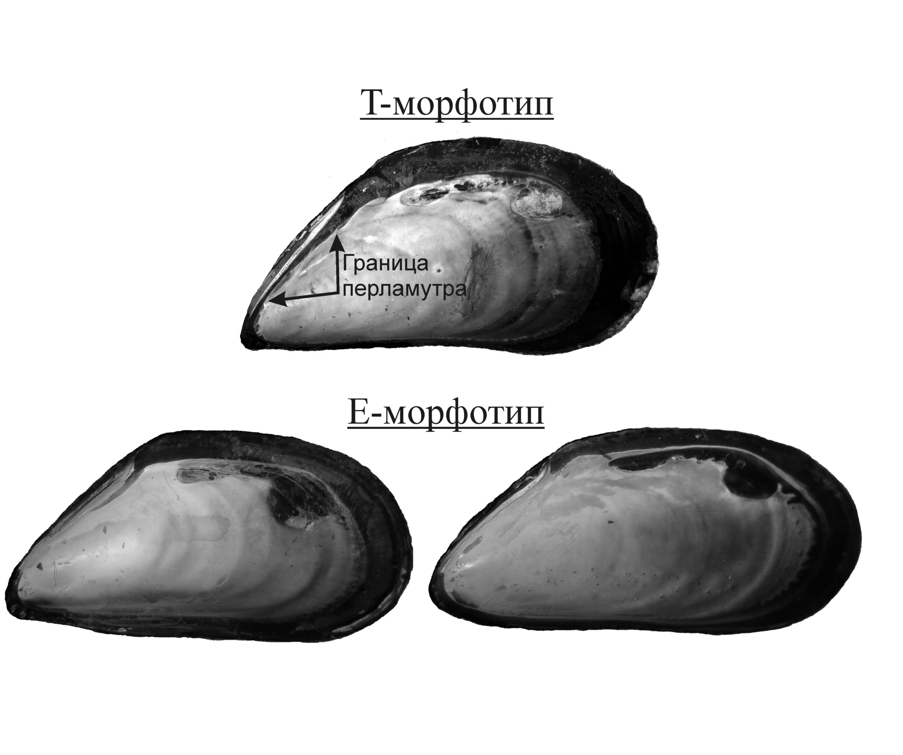

```{r setup, include=FALSE}


knitr::opts_chunk$set(echo = FALSE, warning = FALSE, message = FALSE, dpi=300)

library(reshape2)
library(knitr)
library(readxl)
library(dplyr)
library(ggplot2)
library(cowplot)
library(flextable)
library(officer)
library(lubridate)
library(ggmap)


editor <- "Толмачева Е. Л."
editor_eng <- "Tolmacheva E.L."

Year <- 2024

# Функция, задающая нумерацию рисунков

figRef <- local({
    tag <- numeric()
    created <- logical()
    used <- logical()
    function(label, caption, prefix = options("figcap.prefix"), 
        sep = options("figcap.sep"), prefix.highlight = options("figcap.prefix.highlight")) {
        i <- which(names(tag) == label)
        if (length(i) == 0) {
            i <- length(tag) + 1
            tag <<- c(tag, i)
            names(tag)[length(tag)] <<- label
            used <<- c(used, FALSE)
            names(used)[length(used)] <<- label
            created <<- c(created, FALSE)
            names(created)[length(created)] <<- label
        }
        if (!missing(caption)) {
            created[label] <<- TRUE
            paste0(prefix.highlight, prefix, " ", i, sep, prefix.highlight, 
                " ", caption)
        } else {
            used[label] <<- TRUE
            paste(prefix, tag[label])
        }
    }
})

options(figcap.prefix = "Рисунок", figcap.sep = ".", figcap.prefix.highlight = "**")


theme_set(theme_bw())


```


```{r }


Kand_upper_x <- c(32.2, 33.06)
Kand_upper_y <- c(66.9, 67.16)

ggKand_upper <- read.csv("Data/ggKand_upper.csv")


Plot_Kand_upper <- 
  ggplot(ggKand_upper, aes(x=long, y=lat, group=group)) + 
  geom_polygon(fill = "gray70", colour = "black") + 
  coord_map(xlim = Kand_upper_x, ylim = Kand_upper_y) + 
  theme(axis.ticks=element_blank(), axis.title.x =element_blank(),  axis.title.y= element_blank(), plot.background = element_rect(fill = NULL), panel.grid = element_blank())  +  
  annotate (x= 32.410973,  y = 67.154371, geom =  "point", size = 5, shape = 21, color = "black", fill = "white") +
  annotate (x= 32.52,  y = 67.154371, geom = "text", label =  "Кандалакша")


points <- read_excel("Data/Point_coordiates.xlsx")


library(ggrepel)

Pl_monitoring_position <-
Plot_Kand_upper + 
  geom_point(data = points %>% filter(Type =="NT_monitoring"), aes(x = Lon, y = Lat, group = 1), size = 5, fill = "yellow", shape = 21) +
  geom_text(data = points %>% filter(Type =="NT_monitoring"), aes(x = Lon, y = Lat, group = 1, label = 1:4)) +
  geom_point(data = points %>% filter(Type !="NT_monitoring"), aes(x = Lon, y = Lat, group = 1), size = 4, fill = "blue", shape = 22) +
  annotate (x= 32.663313,  y = 67.13, geom = "text", label =  "Лувеньгский архипелаг") +
  annotate (x= 32.461079,  y = 66.91, geom = "text", label =  "Воронья губа") 
  

```


```{r}
# Читаем данные
monitor <- read_excel("data/nt_ne_monitoring_2002_2024.xlsx") 

monitor$PropT <- with(monitor, Nt/(Nt+Ne))

monitor$Site <- factor(monitor$Site)


monitor <- 
  monitor %>% 
  mutate(Site2 = case_when(Site == "Lupch" ~ "о. Б. Лубчостров",
                                     Site == "Malij" ~ "о. Малый",
                                     Site == "Ovech" ~ "о. Овечий",
                                     Site == "Ryashkov" ~ "о. Ряжков")) 

```


## Методика описания поселений на фукоидах

Ежегодно, начиная с 2002 г., проводятся сборы мидий на литорали четырех островов, расположенных в вершине Кандалакшского залива Белого моря в том числе и на территории Кандалакшского Государственного Природного Заповедника: О.Б.Лубчостров (N67.145842, E32.350530); О.Малый (N67.118464, E32.406149); О.Овечий (N67.090252, E32.460394); О.Ряжков (N67.019912, E32.571287). 

На каждом острове (за исключением о.Ряжкова) в одних и тех же точках отбирали по пять пучков фукоидов (пучки водорослей отбирались таким образом, чтобы на них визуально было представлено достаточно большое количество мидий). При сборах на о. Ряжкове было взято по 3 пучка фукоидов, что связано с существенно большим обилием мидий в этом районе. 

При разборке проб мидии были отделены от талломов фукоидов. В дальнейшем анализе были использованы только моллюски, имевшие длину раковины не менее 10 мм. Каждая проба (отдельный пучок водорослей) разбиралась независимо. Все отобранные моллюски были очищены от мягких тканей и в дальнейшей работе были использованы сухие створки.


Сборы мидий 2002 – 2010 гг. были  предоставлены А. В. Полоскиным в виде коллекций сухих створок. К сожалению, мидии из проб, взятых на каждом из островов в этот период, были объединены. То есть, структура поселений мидий на каждом из островов в эти годы формально была описана по одной выборке. 


## Методика описания поселений мидий на мидиевых банках


Для анализа многолетней динамики поселений была введена классификация, принятая в предыдущих публикациях (Katolikova et al., 2016; Khaitov et al., 2021): все моллюски были разделены на две группы, обозначаемые, как T- и E- морфотипы (`r figRef("Morph")`). Определение морфотипов проводилось в соответствии с паттерном закладки перламутрового слоя в районе нифы лигамента. У мидий T-морфотипа под нимфой прослеживается полоска перламутрового слоя не покрытая перламутром. У мидий E-морфотипа  эта полоска отсутствует или полоска призматического слоя прослеживается лишь под задней частью нимфы лигамента. 


Моллюски T-морфотипа с высокой вероятностью являются *Mytilus trossulus*, моллюски E-морфотипа - *M.edulis* (Khaitov et al., 2021). Для каждой пробы было подсчитано количество особей того или иного морфотипа (Таблица +.1) и вычислена доля моллюсков T-морфотипа в общей численности. Данная величина является надежной оценкой вероятности встретить в поселении представителей *M.tossulus* (Khaitov et al., 2021). 


```{r fig.cap = figRef("Morph", "Внутренняя поверхность раковины мидий дух морфотипов. The inner surface of the shell of mussel spirit morphotypes."), fig.width=4}



```


```{r}
library(mgcv)

monitor2 <- monitor %>% mutate(PropT_corrected = case_when( PropT == 1 ~ 0.9999,
                                                            PropT == 0 ~ 0.0001, 
                                                            PropT != 1 & PropT !=0 ~ PropT))

Mod_monitor_1 <- gam(PropT_corrected ~ s(Year, by = Site, bs = "tp") + Site, family = "betar", data = monitor2)


MyData2 <- expand.grid(Year = seq(min(monitor$Year), max(monitor$Year), 0.1), Site = levels(monitor$Site))

# unique(monitor[,1:2])

MyData2$Predict <- predict(Mod_monitor_1, newdata = MyData2, type = "response", se = T)$fit

MyData2$SE <- predict(Mod_monitor_1, newdata = MyData2, type = "response", se = T)$se.fit


MyData2 <- MyData2 %>% mutate(Site2 = case_when(Site == "Lupch" ~ "о. Б. Лубчостров",
                                     Site == "Malij" ~ "о. Малый",
                                     Site == "Ovech" ~ "о. Овечий",
                                     Site == "Ryashkov" ~ "о. Ряжков"))

Pl_dynam <- 
  ggplot(MyData2, aes(x = Year, y = Predict)) + 
  facet_wrap(~Site2, dir = "v") + 
  geom_point(data = monitor, aes(x = Year, y = PropT )) + 
  geom_ribbon(aes(ymin = Predict - 1.96*SE, ymax = Predict + 1.96*SE), alpha = 0.2) + 
  geom_path(color = "black", size = 1) +
  theme_bw() + 
  xlab("Годы") + 
  ylab("Доля мидий с T-морфотипом")  + 
  scale_x_continuous(breaks = seq(min(monitor$Year), max(monitor$Year), 1) )+
  theme(axis.text.x = element_text(angle = 90))

```


```{r fig.cap= figRef("dynam", "Многолетняя динамика доли мидий, имеющих T-морфотип, в поселениях на островах в вершине Кандалакшского залива. Острова расположены в порядке удаления от кута. Сплошная линия – непараметрическая сглаживающая функция (Обобщенная аддитивная модель; серая облсть ограничивает 95% доверительные интервалы). Long-term dynamics of T-morphotype proportions in mixed populations at islands. Islands are ordered accordingly to distance from upper part of Kandlaksha bay. Solid line - fitted generalized additive model (GAM), gray area eround solid line - 95% confidence interval."), fig.width=7}

Pl_dynam
```

Соотношение обилий мидий двух морфотипов в 2023 г., в целом, соответствует тенденциям, наметившимся ранее (`r figRef("dynam")`). На литорали острова Б. Лупчостров, расположенного в куту залива, доля особей T-морфотипа колеблется год от года. Однако эти колебания могут быть объяснены малыми объемами выборок. Однако следует отметить, что в 2023 г. доля мидий T-морфотипа в данной точке несколько ниже, чем в прошлом году (Таблица +.1). Тенденция к падению доли мидий T-морфотипа более явно прослеживается на о. Малый, где отчетливое снижение наметилось уже в прошлом, 2022 г (`r figRef("dynam")`). На остальных точках мониторинга заметных отклонений от установившегося за последние годы соотношения не выявляется (`r figRef("dynam")`). 


```{r}
monitor_print <- 
  monitor %>% 
  select(Site2, Year, Sample, Nt, Ne, PropT) %>% 
  filter(Year %in% c(2022, 2023) )

colname <- c("Остров", "Год", "Номер пробы в первичном источнике", "Численность T-морфотипа", "Численность E-морфотипа", "Доля T-морфотипа в общей численности")

library(officer)
std_border = fp_border(color="gray", width = 1)

monitor_print %>% 
 flextable() %>% 
  fontsize(part = "all") %>% 
   border_inner_h(border = std_border ) %>% 
  border_inner_v(border = std_border ) %>% 
  fontsize(size = 10, part = "all") %>% 
  set_header_labels(values = colname) %>% 
  colformat_double(j = 2,  big.mark = "", digits = 0) %>% 
  colformat_double(j = 6,  digits = 2) %>%
  set_caption("Таблица +.1 Соотношение численностей T- и E-морфотипов в пробах на четырех островах в 2022-2023 г. Abundance of T- and E-morfotypes in samples from four island in 2022-2023") 


# kable(monitor_print, digits = c(0,0,0,0,2), caption = "Таблица +.1 Соотношение численностей T- и E-морфотипов в пробах на четырех островах в 2023 г. Abundance of T- and E-morfotypes in samples from four island in 2023")

```


