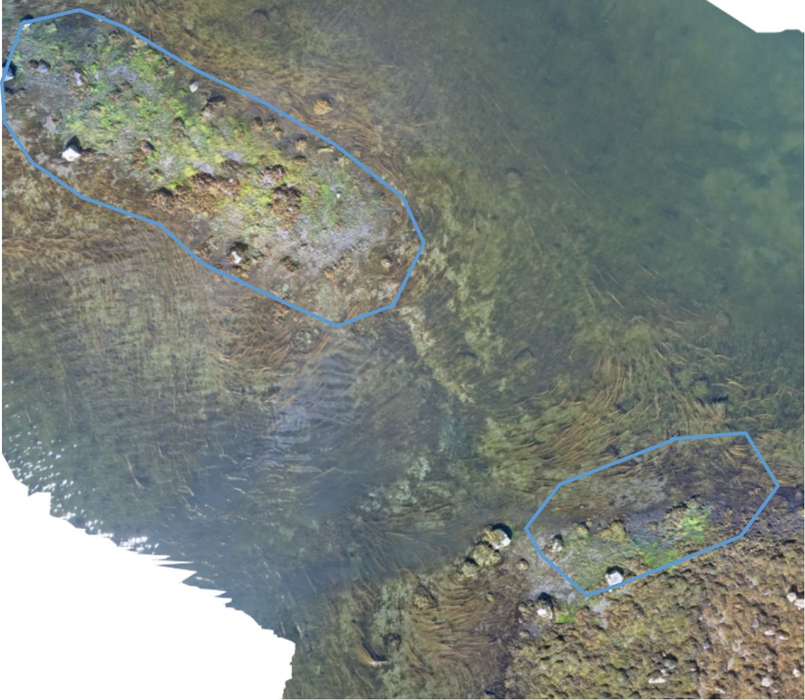
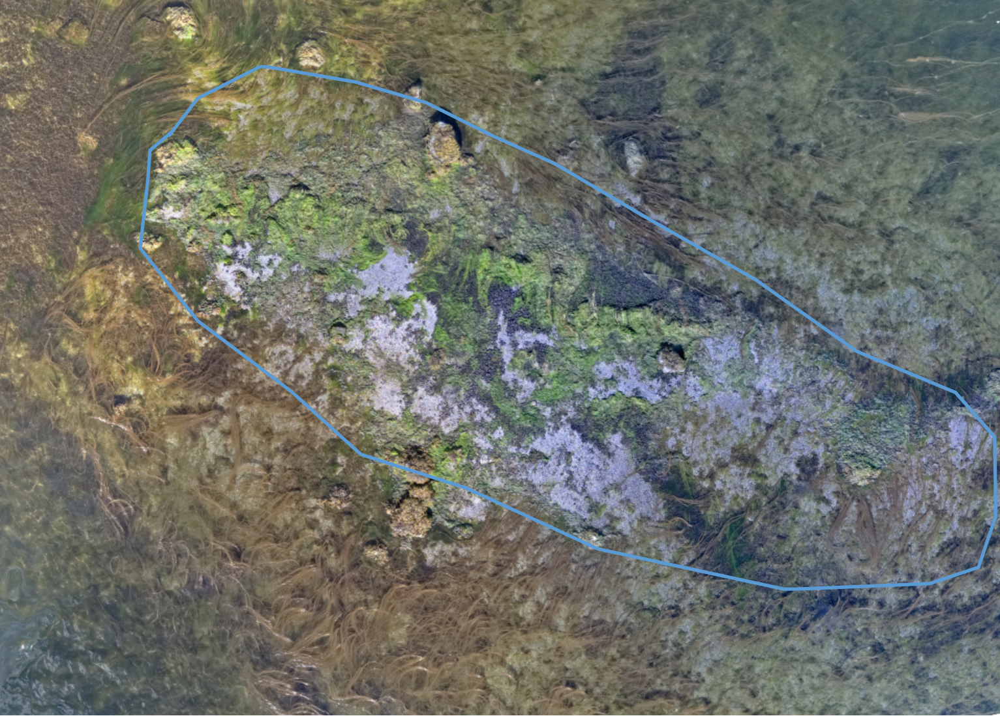
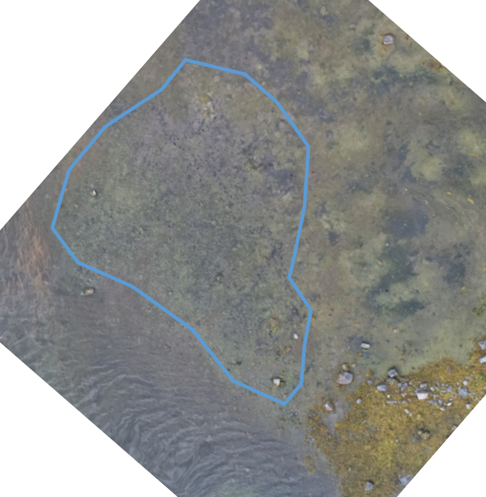
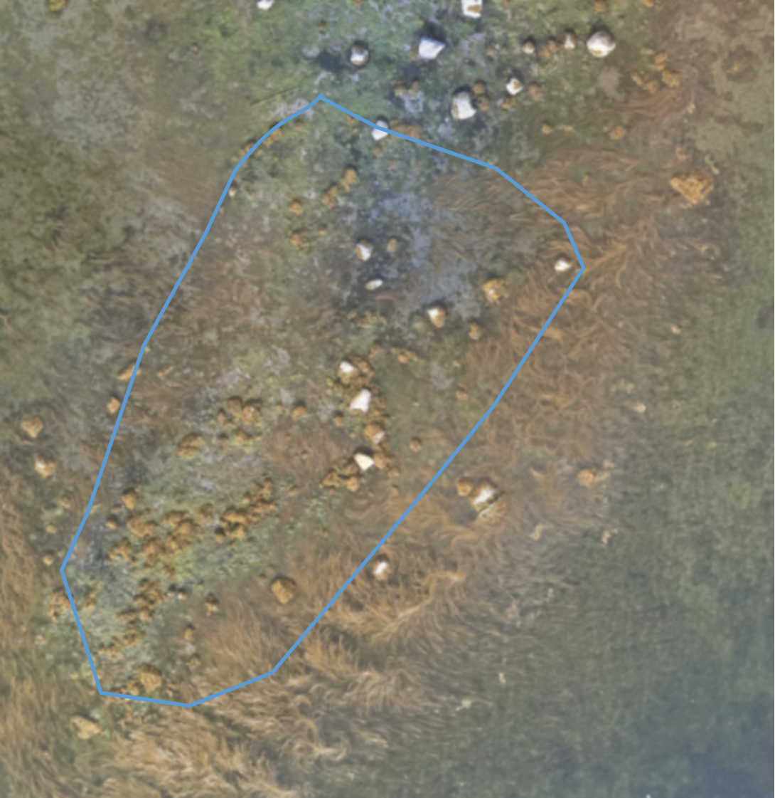
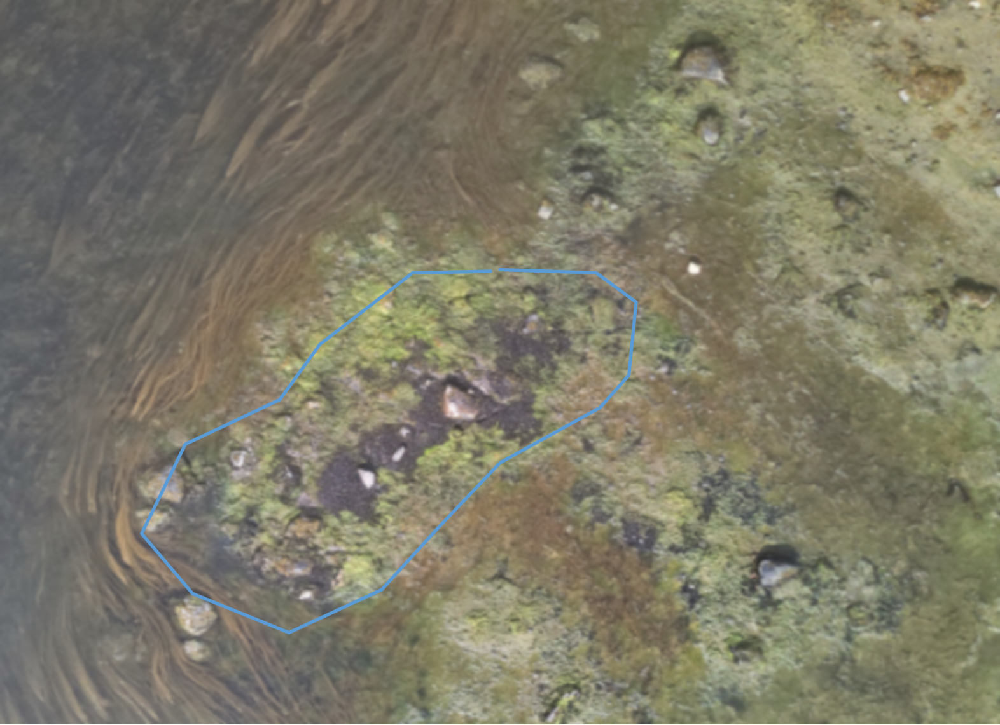

::: {custom-style="Abstract"} 

**Хайтов В. М. Размерная структура мидиевых банок летом 2025 года** // Толмачева Е. Л. (ред.) Летопись природы Кандалакшского заповедника за 2025 год (ежегодный отчет). Кандалакша. Т.1 (Летопись природы Кандалакшского заповедника, кн. ++)

Рассматриваются данные по обилию и размерной структуре мидий  на шести мидиевых банках, расположенных в акватории Вороньей губы и в Лувеньгском архипелаге.   
    
**Khaitov V.M., Size structure of mussel beds in summer 2025** // Tolmacheva E. L. (ed.)  The Chronicle of Nature by the Kandalaksha Reserve for 2025 (Annual report).  Kandalaksha. V.1. (The Chronicle of Nature by the Kandalaksha Reserve, Book N ++)
     
The chapter considers the abundance and size structure of mussels  at 5 mussel beds situated in Voronia bay and in Luvenga archipelago.   

:::


```{r setup, include=FALSE}


library(knitr)
opts_chunk$set(echo = FALSE, warning = FALSE, message = FALSE, dpi=300, fig.align = "center")

library(reshape2)
library(readxl)
library(dplyr)
library(ggplot2)
library(cowplot)
library(flextable)
library(officer)
library(lubridate)
library(ggmap)


editor <- "Толмачева Е. Л."
editor_eng <- "Tolmacheva E.L."

Year <- 2025

theme_set(theme_bw())

```


```{r}
# Читаем данные
# col_types <- c("numeric", "text", "text", "text", "numeric", "text", "guess"  )
# 
# vor_size_1 <-read_excel("data/Mussel beds data base 96-25.xlsx", na = "NA", sheet = "Vor2, vor4, vor5 1996-2008" , col_types = col_types)
# 
# vor_size_2 <-read_excel("data/Mussel beds data base 96-25.xlsx", na = "NA", sheet = "Vor2, vor4, vor5 2009-2016" , col_types = col_types)
# 
# vor_size_3 <-read_excel("data/Mussel beds data base 96-25.xlsx", na = "NA", sheet = "Vor2, Vor4, Vor5 2017-2021" , col_types = col_types)
# 
# vor_size_4 <-read_excel("data/Mussel beds data base 96-25.xlsx", na = "NA", sheet = "vor2, vor4, vor5 2022", col_types = col_types )
# 
# vor_size_5 <-read_excel("data/Mussel beds data base 96-25.xlsx", na = "NA", sheet = "vor2, vor3, vor4, vor5 23-24-25" , col_types = col_types)
# 
# 
# 
# 
# luv_size_1 <- read_excel("data/Mussel beds data base 96-25.xlsx", na = "NA", sheet = "Korg, Mat 1997-2008" , col_types = col_types)
# 
# luv_size_2 <- read_excel("data/Mussel beds data base 96-25.xlsx", na = "NA", sheet = "Korg, Mat 2009-2011" , col_types = col_types)
# 
# luv_size_3 <- read_excel("data/Mussel beds data base 96-25.xlsx", na = "NA", sheet = "Korg, Mat 2012-2016" , col_types = col_types)
# 
# 
# luv_size_4 <- read_excel("data/Mussel beds data base 96-25.xlsx", na = "NA", sheet = "Korg, Mat, 2017-2021" , col_types = col_types)
# 
# luv_size_5 <- read_excel("data/Mussel beds data base 96-25.xlsx", na = "NA", sheet = "Korg, Mat 2022" , col_types = col_types)
# 
# luv_size_6 <- read_excel("data/Mussel beds data base 96-25.xlsx", na = "NA", sheet = "Korg, Mat 2023-24-25" , col_types = col_types)
# 
# 
# 
# # balg <- read.table("data/Algae biomass on mussel beds 1997 2016.csv", header = T, sep = ";")
# # cover <- read.table("data/coverage_2004-2017.csv", header = T, sep = ";")
# 
# 
# all_size <- rbind(vor_size_1, vor_size_2, vor_size_3, vor_size_4, vor_size_5, luv_size_1, luv_size_2, luv_size_3, luv_size_4, luv_size_5, luv_size_6)
# 
# # nrow(all_size)
# 
# names(all_size) <- c("Year", "Season", "Bank", "Sample", "L", "Status", "Number_of_crushed")
# 
# write.csv(x = all_size, file = "Data/all_mussel_bed_sizes_96_25.csv", row.names = F)

# Убираем лишние периоды взятия проб

all_size <- read.csv("data/all_mussel_bed_sizes_96_25.csv")


all_size <- all_size %>% filter(Season %in% c("August", "July", "June"))

all_size <- all_size %>% filter(!(Bank %in% c("korg", "mat") & (Season == "June" & Year %in% 2008:2012)))

all_size <- all_size %>% filter(!(Bank %in% c("vor2", "vor4", "vor5") & (Season == "June" & Year %in% 2013)))


all_size <- all_size %>% filter(!(Bank %in% c("vor2", "vor4", "vor5", "korg", "mat") & (Season == "July" & Year %in% c(2013, 2017))))


all_size$Sample <- gsub("B", "", all_size$Sample) #Убираем метку B из обозначений номеров проб

all_size$Sample <- gsub("A", "", all_size$Sample) #Убираем метку A из обозначений номеров проб

# table(all_size$Year, all_size$Sample)


# table(all_size$Bank, all_size$Year, all_size$Season)


all_size_dead <- all_size %>% filter(Status == "dead")

all_size <- all_size %>% filter(Status == "alive")

all_size_no_spat <- all_size %>% filter(L >= 1)


# all_size$L_class <- round(all_size$L, 0)


```


Описание методики взятия проб приведено в аналогичной главе Летописи природы за 2019 год. В данной главе приводятся данные по размерной структуре мидий и их плотности поселения, полученные по стандартной методике в июле-августе 2025 г. и дается характеристика многолетней динамики наблюдаемых поселений. 

В тексте использованы обозначения мидиевых банок, устоявшиеся в предыдущих изданиях «Летописи природы Кандалакшского заповедника». 

**Аэрофотосъемка мониторинговых мидиевых банок**


Мидиевая банка *«Korg»* (67,110668 N;	32,642790 E, @fig-Korg) Расположена на корге в районе о-вов Малый и Большой Куртяжные (Лувеньгский архипелаг).


```{r,  out.width=400}
#| label: fig-Korg
#| fig-cap: "Вид мидиевой банки *korg* летом 2025 г. Линия очерчивает приблизительные границы, в которых производится отбор проб. Здесь и далее съемка с квадрокоптера, пилотируемого Александрой Пилипенко. A quadrocopter view of the mussel bed *korg* in summer 2025. The line shows the area of smplings."



```

\pagebreak 

Мидиевая банка *«Mat»* (67,113299 N;	32,642897 E, @fig-Mat) Расположена на косе, идущей от материка, на расстоянии 260 м от предыдущей банки.


```{r, out.width=600,fig.width=7}
#| label: fig-Mat
#| fig-cap: "Вид мидиевой банки *mat* летом 2025 г. A quadrocopter view of the mussel bed *mat* in summer 2025"



```

\pagebreak 

Мидиевая банка *«Vor2»*  (66,939778 N;	32,43461 E, @fig-Vor2)  Банка расположена на нижней части литорали острова Воронинского, расположенного  в куту Вороньей губы. 


```{r, out.width=400}
#| label: fig-Vor2
#| fig-cap: "Вид мидиевой банки *vor2* летом 2025 г. A quadrocopter view of the mussel bed *vor2* in summer 2025"



```


\pagebreak 

Мидиевая банка *«Vor4»* (66,934386 N; 32,506852 E, @fig-Vor4) Банка расположена на косе, идущей от материка на расстоянии около 500 м от входа в Воронью губу. 


```{r, out.width=600}
#| label: fig-Vor4
#| fig-cap: "Вид мидиевой банки *vor4* летом 2025 г. A quadrocopter view of the mussel bed *vor4* in summer 2025"



```

\pagebreak 

Мидиевая банка *«Vor5»* (66,928006 N; 32,491124 E, @fig-Vor5) Банка расположена в проливе, соединяющем губу Воронью и губу Белую.  


```{r, out.width=600}
#| label: fig-Vor5
#| fig-cap: "Вид мидиевой банки *vor5* летом 2025 г. A quadrocopter view of the mussel bed *vor5* in summer 2025"



```


 


**Визуальное описание мидиевых банок**

При рассмотрении аэрофотоснимков мидиевых банок (@fig-Korg - @fig-Vor5) видно, что все они покрыты слоем нитчатых водорослей. Этот слой присутствует более или менее постоянно на всех мидиевых банках во все годы наблюдений, однако в последнее десятилетие он значительно увеличился по площади. В настоящее время нитчатки покрывают практически всю поверхность всех мидиевых банок. Сплошной ковер мидий, который ранее был представлен на каждой из них (именно его присутствие и заставило ранее выбрать эти участки как сайты мониторинга мидевых банок), сильно фрагментировался. В последние годы большинство мидий, представленных на банках, поселяются среди нитчатых водорослей. 

На мидиевой банке *vor2* пятна мидий практически отсутствуют. Течения размыли вязкие илистые отложения, которые ранее подстилали эту мидиевую банку и имели почти метровую глубину. В настоящий момент на поверхности *vor2* видны многочисленные камни, которых раньше не было заметно. Сходная картина наблюдается на банках *korg* и *mat*. Последняя некогда была покрыта сплошным слоем мидий, а нитчатые водоросли присутствовали лишь по периферии. В 2025 г. большая часть банки *mat*, имеет вид обнаженной ракуши. Пятна мидий здесь лишь фрагментарны. Заметные пята мидий остались лишь на банке *vor5*.          


**Размерная структура мидий летом 2025 г.**


 Исходные данные по размерной структуре мидий в 1996-2016 гг. приводятся в томе Летописи природы за 2016 г., данные за 2017 г. в Летописи природы за 2017 г. Данные, полученные в летние сезоны (июль, август) 2018-2019 гг  в Летописи природы за 2019 г. Данные, полученные за 2020-2022 гг. в Летописи природы за 2022 г. Данные, полученные в 2023 гг. в Летописи природы за 2023 г. Данные, полученные в 2024 г. приведены в Летописи природы за 2024 г.  
 
 Численность особей разных размеров в каждой из проб, взятых на мидиевых банках в 2025 г., приводятся в @tbl-vor2 - @tbl-korg. Частотные распределения размеров на разных мидиевых банках иллюстрирует @fig-Size-Structure. В этом году продолжилась тенденция, наметившаяся в прошлые годы. Если ранее на всех банках доминировали моллюски с длиной раковины 1-5 мм, то уже 2024 г. на банках *vor2* и *vor5* максимальная численность приходилась на размерный класс 5-10 мм. В 2025 году только на банке *mat* отмечено преобладание мидий размером 1-5 мм, на всех остальных модальное значение сместилось на размерный класс 5-10 мм.  На большинстве банок (исключение составляет **vor5**) в 2024-2025 гг наметилась тенденция к увеличению среднего размера особей (@fig-Mean-Size), хотя размеры моллюсков в последние годы, по-прежнему, меньше, чем в прошлые годы. 


Данные, по обилию мидий на мидиевых банках, полученные в 2025 г (@fig-N) показывают, что обилие мидий на банках Лувеньгского архипелага *mat* и  *korg*, как и в былые годы, выше обилия мидий  на баках из Вороньей губы (*vor2*, *vor4*, *vor5*). Вместе с тем, следует отметить что обилие мидий на банках *mat* и *vor2* в 2025 г. заметно снизилось по сравнению с предыдущим годом. 


```{r, fig.width=4}
#| label: fig-Size-Structure
#| fig-cap: "Размерная структура мидий на банках летом 2025 г. Mussel's size structure at mussel beds in 2025" 

all_size_no_spat_25 <- 
  all_size_no_spat %>% 
  filter(Year == 2024)


ggplot(all_size_no_spat_25, aes(x = L)) + 
  geom_histogram(binwidth = 5, fill = "gray", color = "black") + 
  facet_wrap(~Bank, ncol = 2, scales = "free_y", dir = "v") + 
  labs(x = "Длина раковины (мм)", y = "Количество особей")

```


```{r, fig.height=4}
#| label: fig-Mean-Size
#| fig-cap: "Многолетние изменения среднего размера мидий на разных мидиевых банках. Кривая линия - сглаживающая непараметрическая функция (GAM).Long-term changes in average mussel shell length at different mussel beds. Curve line represents fitted GAM-smoother." 

all_size_no_spat %>%
  filter_out(Bank == "vor3") %>% 
  mutate(Bank = factor(Bank)) %>% 
  ggplot(aes(x = Year, y = L)) + 
  geom_smooth(method = "gam") + 
  facet_wrap(~Bank, ncol = 2, dir = "v") + 
  labs(x = "Годы", y = "Длина раковины (мм)") +
  scale_x_continuous(breaks=seq(min(all_size_no_spat$Year), max(all_size_no_spat$Year), 2)) + 
  theme(axis.text.x = element_text(angle = 90, size = 5))

```


```{r, fig.width=6}
#| label: fig-N
#| fig-cap: "Плотность поселения мидий на разных мидиевых банках в 2025 г. Abundance of mussels on different mussel beds in 2024." 


Abund <- 
  all_size_no_spat %>% 
  filter(Year %in% c(2024, 2025)) %>% 
  group_by(Year, Bank, Sample) %>% 
  summarise(Abund = n() *182) %>% 
  mutate(Log_Abund = log(Abund * 182)) %>% 
  ungroup()


ggplot(data = Abund, aes(x = Bank, y = Abund, fill = factor(Year) )) +
  geom_boxplot() +
  labs(x = "Мидевые банки", y = "Плотность поселения (экз./кв.м)", fill = "Годы")


```


Данные, полученные в 2025 г. свидетельствуют о том, что тенденция постоянному увеличению обилия мидий, наметившаяся в прошлые годы (@fig-N-Dynam), сменилась тенденцией к стабилизации или даже уменьшению обилия мидий. 


```{r, fig.width=7}
#| label: fig-N-Dynam
#| fig-cap: "Многолетние изменения средней плотности поселения мидий на разных мидиевых банках. Кривая линия - сглаживающая непараметрическая функция (GAM).Long-term changes in average mussel abundance at different mussel beds. Curve line represents fitted GAM-smoother."

Abund <- all_size_no_spat %>% group_by(Bank, Year, Sample) %>% summarise(Abund = n())

Abund <-
  Abund %>% 
  filter(Bank != "vor3")

Abund_mean <- Abund %>% group_by(Bank, Year) %>% summarise(Mean_N = mean(Abund)) 


ggplot(data = Abund, aes(x = Year, y = (Abund * 182))) +
  facet_wrap(~ Bank, scale = "free_y", dir = "v")  + 
  geom_line(data = Abund_mean, aes(y = Mean_N * 182), color = "black", linetype = 1)+
  theme(axis.text.x = element_text(angle =90)) + 
  geom_smooth(linewidth = 1, method = "gam") + 
  labs(x = "Годы", y = "Плотность поселения (экз./кв.м)") + 
  scale_color_manual(values = c("black", "blue", "red", "black", "blue")) +
  scale_x_continuous(breaks=seq((min(all_size_no_spat$Year) + 1), max(all_size_no_spat$Year), 2)) +
   scale_y_continuous(labels = scales::number_format(accuracy = 1)) +
  theme(axis.text.x = element_text(angle = 90, size = 5))


```


```{r}

all_size <- 
  all_size %>% 
  filter(!is.na(L))


all_size <- all_size %>% filter(L != 0)


all_size$L <- ifelse(all_size$L == 0.5, "спат", all_size$L)


```


\pagebreak 

```{r}
#| label: tbl-vor2 
#| tbl-cap: "Размерная структура мидий в отдельных пробах в 2025 г на мидиевой банке  **Vor2**. Size structure of mussels in samples at mussel bed in 2025 at mussel beds **Vor2**"

freq_size <- 
  all_size %>% 
  filter(Bank == "vor2") %>% 
  filter(Year %in% 2025)  %>% 
  group_by(Year, Bank, Sample, L) %>% 
  summarise(N = n())

freq_size_sample <- dcast(freq_size, Year + Bank + L ~ Sample, value.var = "N")

freq_size_sample[is.na(freq_size_sample)] <- 0

freq_size_sample$L <- ifelse(freq_size_sample$L == "0.5", "Спат", freq_size_sample$L)

freq_size_sample$Year <- as.character(freq_size_sample$Year)

freq_size_sample <- freq_size_sample %>% select(-Year)


freq_size_sample <- 
  freq_size_sample %>% 
  arrange(as.numeric(L))

ft <- flextable(freq_size_sample)


ft <- set_header_labels(ft,
  Bank = "Банка", 
  L = "Размер, мм"
)

# Добавляем повторение заголовка на каждой странице
ft <-  set_table_properties(ft, opts_word = list(repeat_headers = TRUE)) 


library(officer)
std_border = fp_border(color="gray", width = 1)

ft <- border_inner_h(ft, border = std_border )
ft <- border_inner_v(ft, border = std_border )


ft %>% 
   fontsize(size = 8, part = "all") %>% 
  autofit()


```
**Примечание** Категорией *Спат* обозначаются мидии с длиной раковины меньше 1 мм. При анализе динамики размерной структуры и обилия моллюски этой категории не учитываются.   

\pagebreak 


```{r}
#| label: tbl-vor4 
#| tbl-cap: "Размерная структура мидий в отдельных пробах в 2025 г на мидиевой банке  **Vor4**. Size structure of mussels in samples at mussel bed in 2025 at mussel beds **Vor4**"


freq_size <- 
  all_size %>% 
  filter(Bank == "vor4") %>% 
  filter(Year %in% 2025)  %>% 
  group_by(Year, Bank, Sample, L) %>% 
  summarise(N = n())

freq_size_sample <- dcast(freq_size, Year + Bank + L ~ Sample, value.var = "N")

freq_size_sample[is.na(freq_size_sample)] <- 0

freq_size_sample$L <- ifelse(freq_size_sample$L == "0.5", "Спат", freq_size_sample$L)

freq_size_sample$Year <- as.character(freq_size_sample$Year)

freq_size_sample <- freq_size_sample %>% select(-Year)

freq_size_sample <- freq_size_sample %>% select("Bank", "L", "1", "2", "3", "4", "5", "6")

freq_size_sample <- 
  freq_size_sample %>% 
  arrange(as.numeric(L))


ft <- flextable(freq_size_sample)


ft <- set_header_labels(ft,
  Bank = "Банка", 
  L = "Размер, мм"
 )


ft <- border_inner_h(ft, border = std_border )
ft <- border_inner_v(ft, border = std_border )

ft %>% 
   fontsize(size = 8, part = "all") %>% 
  autofit()


```


\pagebreak 


```{r}
#| label: tbl-vor5
#| tbl-cap: "Размерная структура мидий в отдельных пробах в 2025 г на мидиевой банке  **Vor5**. Size structure of mussels in samples at mussel bed in 2025 at mussel beds **Vor5**"

freq_size <- 
  all_size %>% 
  filter(Bank == "vor5") %>% 
  filter(Year %in% 2025)  %>% 
  group_by(Year, Bank, Sample, L) %>% 
  summarise(N = n())

freq_size_sample <- dcast(freq_size, Year + Bank + L ~ Sample, value.var = "N")

freq_size_sample[is.na(freq_size_sample)] <- 0

freq_size_sample$L <- ifelse(freq_size_sample$L == "0.5", "Спат", freq_size_sample$L)

freq_size_sample$Year <- as.character(freq_size_sample$Year)

freq_size_sample <- freq_size_sample %>% select(-Year)

freq_size_sample <- freq_size_sample %>% select("Bank", "L", "1", "2", "3", "4", "5", "6")

freq_size_sample <- 
  freq_size_sample %>% 
  arrange(as.numeric(L))


ft <- flextable(freq_size_sample)


ft <- set_header_labels(ft,
  Bank = "Банка", 
  L = "Размер, мм"
 )


ft <- border_inner_h(ft, border = std_border )
ft <- border_inner_v(ft, border = std_border )

ft %>% 
   fontsize(size = 8, part = "all") %>% 
  autofit()


```


\pagebreak 


```{r}
#| label: tbl-mat 
#| tbl-cap: "Размерная структура мидий в отдельных пробах в 2025 г на мидиевой банке  **mat**. Size structure of mussels in samples at mussel bed in 2025 at mussel beds **mat**"

freq_size <- 
  all_size %>% 
  filter(Bank == "mat") %>% 
  filter(Year %in% 2025)  %>% 
  group_by(Year, Bank, Sample, L) %>% 
  summarise(N = n())

freq_size_sample <- dcast(freq_size, Year + Bank + L ~ Sample, value.var = "N")

freq_size_sample[is.na(freq_size_sample)] <- 0

freq_size_sample$L <- ifelse(freq_size_sample$L == "0.5", "Спат", freq_size_sample$L)

freq_size_sample$Year <- as.character(freq_size_sample$Year)

freq_size_sample <- freq_size_sample %>% select(-Year)

freq_size_sample <- freq_size_sample %>% select("Bank", "L", "1", "2", "3", "4", "5", "6")


freq_size_sample <- 
  freq_size_sample %>% 
  arrange(as.numeric(L))


ft <- flextable(freq_size_sample)

ft <- set_header_labels(ft,
  Bank = "Банка", 
  L = "Размер, мм"
 )


ft <- border_inner_h(ft, border = std_border )
ft <- border_inner_v(ft, border = std_border )


ft %>% 
   fontsize(size = 8, part = "all") %>% 
  autofit()

```


\pagebreak 


```{r}
#| label: tbl-korg 
#| tbl-cap: "Размерная структура мидий в отдельных пробах в 2025 г на мидиевой банке  **korg**. Size structure of mussels in samples at mussel bed in 2025 at mussel beds **korg**"

freq_size <- 
  all_size %>% 
  filter(Bank == "korg") %>% 
  filter(Year %in% 2025)  %>% 
  group_by(Year, Bank, Sample, L) %>% 
  summarise(N = n())

freq_size_sample <- dcast(freq_size, Year + Bank + L ~ Sample, value.var = "N")

freq_size_sample[is.na(freq_size_sample)] <- 0

freq_size_sample$L <- ifelse(freq_size_sample$L == "0.5", "Спат", freq_size_sample$L)

freq_size_sample$Year <- as.character(freq_size_sample$Year)

freq_size_sample <- freq_size_sample %>% select(-Year)

freq_size_sample <- freq_size_sample %>% select("Bank", "L", "1", "2", "3", "4", "5", "6")

freq_size_sample <- 
  freq_size_sample %>% 
  arrange(as.numeric(L))


ft <- flextable(freq_size_sample)

ft <- set_header_labels(ft,
  Bank = "Банка", 
  L = "Размер, мм"
 )


ft <- border_inner_h(ft, border = std_border )
ft <- border_inner_v(ft, border = std_border )

ft %>% 
   fontsize(size = 8, part = "all") %>% 
  autofit()


```


