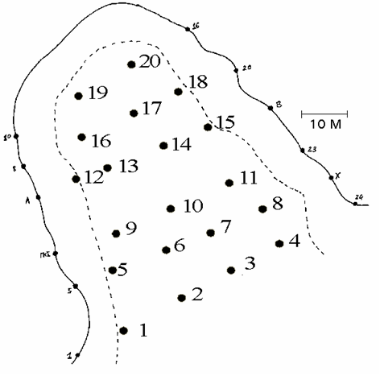
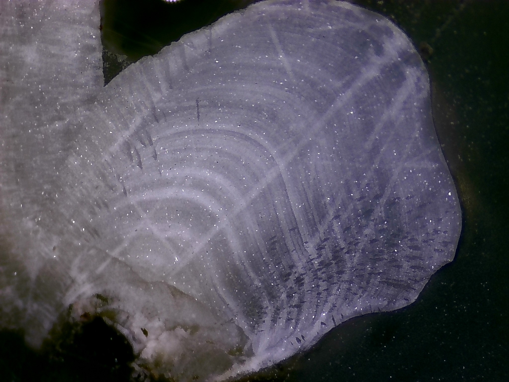

::: {custom-style="Abstract"} 

**Хайтов В. М. Характеристика поселений *Tridonta borealis* в Северной губе о. Ряжкова и в Илистой губе о.Горелого** // Толмачева Е. Л. (ред.) Летопись природы Кандалакшского заповедника за 2025 год (ежегодный отчет). Кандалакша. Т.1 (Летопись природы Кандалакшского заповедника, кн. ++)

Рассматриваются данные по размерной и возрастной структуре двустворчатых моллюсков *Tridonta borealis* в сублиторали Северной губы о. Ряжкова и Илистой губы о. Горелого по данным сборов, проведенных летом 2025 г. Дается ретроспективная оценка периодов пополнения этих поселений молодью. 

**Khaitov V.M., Description of Tridonta borealis settlements in Severnaya inlet (Ryazhkov Island) and Ilistaya inlet (Gorely Island)** // Tolmacheva E. L. (ed.)  The Chronicle of Nature by the Kandalaksha Reserve for 2025 (Annual report).  Kandalaksha. V.1. (The Chronicle of Nature by the Kandalaksha Reserve, Book N ++)
     
Data on the size and age structure of *Tridonta borealis* in the sublittoral zone of Severnaya inlet of Ryazhkov Island and Ilistaya inlet of Gorely Island are considered, based on samples collected in the summer of 2025. A retrospective assessment of the recruitment periods of these settlements by juveniles is provided.

:::


```{r setup, include=FALSE}


library(knitr)
opts_chunk$set(echo = FALSE, warning = FALSE, message = FALSE, dpi=300, fig.align = "center")

library(reshape2)
library(readxl)
library(dplyr)
library(ggplot2)
library(cowplot)
library(flextable)
library(officer)
library(lubridate)
library(ggmap)
library(mgcv)
library(gratia)
library(DHARMa)
library(ggrepel)


editor <- "Толмачева Е. Л."
editor_eng <- "Tolmacheva E.L."

Year <- 2025

theme_set(theme_bw())


```


```{r }


Kand_upper_x <- c(32.2, 33.06)
Kand_upper_y <- c(66.9, 67.16)

ggKand_upper <- read.csv("Data/ggKand_upper.csv")


Plot_Kand_upper <- 
  ggplot(ggKand_upper, aes(x=long, y=lat, group=group)) + 
  geom_polygon(fill = "gray70", colour = "black") + 
  coord_map(xlim = Kand_upper_x, ylim = Kand_upper_y) + 
  theme(axis.ticks=element_blank(), axis.title.x =element_blank(),  axis.title.y= element_blank(), plot.background = element_rect(fill = NULL), panel.grid = element_blank())  +  
  annotate (x= 32.410973,  y = 67.154371, geom =  "point", size = 5, shape = 21, color = "black", fill = "white") +
  annotate (x= 32.52,  y = 67.154371, geom = "text", label =  "Кандалакша")


```


Двустворчатые моллюски *T.borealis*  играют роль доминантов по биомассе в сообществах, связанных с илистыми грунтами  в верхней сублиторали шхерных районов Белого моря. Моллюски этого вида поселяются преимущественно на склонах дна на глубине более 3 метров. 

**Полевые сборы**

Пробы брали в августе 2025 года в двух губах - Северной губе о. Ряжкова и Илистой губе о. Горелый Кандалакшского залива Белого моря (@fig-Samples).


```{r}
#| label: fig-Samples
#| fig-cap: "Точки сбора материала. Samplings points."

library(ggrepel)

Plot_Kand_upper +
  annotate(geom = "point", x = 32.679619, y = 67.095068, size = 4, shape = 21, fill="yellow") +
  annotate(geom = "text_repel", x = 32.679619, y = 67.095068, label = "Илистая губа \nо. Горелого")+
    annotate(geom = "point", x = 32.536686, y = 67.028825, size = 4, shape = 21, fill="yellow") +
  annotate(geom = "text_repel", x = 32.536686, y = 67.028825, label = "Северная губа \nо. Ряжкова")


```

```{r}
#| label: fig-Ilistaya
#| fig-cap: "Илистая губа острова Горелого. Расположение станций и опорных колов.Ilistaya inlet of Gorely island (stations and coastal strongholds are shown)"
 

```

В Илистой губе пробы брались дночерпателем Петерсона с площадью захвата 1/40 м^2^. Пробы были взяты в раонах четырех стандартных точек мониторинга (@fig-Ilistaya): Ст2 (1 проба), Ст4  (6 проб), Ст6 (3 пробы), Ст8 (1 проба).

В Северной губе было взято 4 пробы драгой в точках с координатами     
Tribor1: N = 67° 01.632(67.02720) E = 32° 32.250 (32.53750)    
Tribor2: N = 67° 01.647(67.02745) E = 32° 32.351(32.53918)    
Tribor3: N = 67° 01.619(67.02698) E = 32° 32.386(32.53977)    
Tribor4: N = 67° 01.639 (67.02732) E = 32° 32.371(32.53952)    


**Определение возраста моллюсков**

```{r}
age <- read_excel("data/Tridonta_age.xlsx")

age2025 <-
  age %>% 
  filter(year == "2025") 

age2025$Area <- factor(age2025$Area)


```


Из собранных в двух акваториях моллюсков была сделана выборка из `r nrow(age2025)` особей разного размера. После заливки в эпоксидную смолу моллюски были распилены с помощью прецизионной пилы  с алмазным диском. Распил проходил в районе кардиального зуба замка. Далее спилы шлифовали на наждачной бумаге P100, потом по мере приближения к нужной зоне шлифовали на более тонкой наждачной бумаге (P1500). Полученный шлиф полировали на стекле с помощью шлифовального оптического порошка, который добавляли в каплю глицерина. Отполированную поверхность протравливали 6% уксусной кислотой, контролируя процесс под бинокуляром. Травление останавливали тогда, когда становилась видна слоистая структура раковины (@fig-Shell-Section).После промывки пресной водой и просушивания протравленного шлифа производилась фотосъемка. При необходимости проводили контрастирование фотографий. По снимку определяли число слоев зимней остановки роста. У самых мелких особей, для снимков которых не хватало разрешающей способности камеры, подсчет числа слоев проводили непосредственно под бинокуляром. 


```{r}
#| label: fig-Shell-Section
#| fig-cap: "Пример спила раковины *T.borealis*. Видны слои нарастания. Example of a T. borealis shell cross-section. Growth layers are visible."
#| fig-width: 6



```

```{r}
age %>% 
  filter(year == 2019) ->
  age_2019

```


Дополнительно для проверки предсказаний модели (см.ниже) было отобрано `r nrow(age_2019)` раковины *T.borealis*, собранных в Илистой губе летом 2019 г. Моллюски из тестовой выборки были обработаны по той же методике. Результатыы оценок возраста приведены в @tbl-Age-Test.


**Анализ связи возраста и размера**

Длина раковины и возраст проанализированных особей приведены в @tbl-Ages (у `r sum(is.na(age2025$age3))` особей оценить возраст не удалось из-за повреждения раковины в районе замка).


```{r}
#| label: tbl-Ages
#| tbl-cap: "Размеры и возраст моллюсков, попавших в выборку. Size and age of mollusks included in the analyzis of age."

age2025 %>% 
  select(Area, station, size, age3) %>% 
  mutate(Area = factor(Area, labels = c("Илистая губа", "Северная губа")), age3 = round(age3)) %>%
  flextable() ->
  ft
  
ft <- set_header_labels(ft,
  Area = "Акватория",
  station = "Проба",
  size = "Длина раковины, мм",
  age3 = "Возраст, годы"
 ) %>% 
  fontsize(size = 10, part = "all")

std_border = fp_border(color="gray", width = 1)

ft <- border_inner_h(ft, border = std_border )
ft <- border_inner_v(ft, border = std_border )

ft %>% 
  fontsize(size = 10, part = "all") %>% 
  autofit()
```


Дополнительно для проверки предсказаний модели (см.ниже) было отобрано `r nrow(age_2019)` раковины *T.borealis*, собранных в Илистой губе летом 2019 г. Моллюски из тестовой выборки были обработаны по той же методике. Результатыы оценок возраста приведены в @tbl-Age-Test.

```{r}
#| label: tbl-Age-Test
#| tbl-cap: "Размеры и возраст моллюсков, из тестовой выборки, собранной в Илистой губе в 2019 г.. Size and age of mollusks in the testing dataset sampled in the Ilistaya inlet in 2019."

age_2019 %>% 
  select(Area, size, age3) %>% 
  mutate(Area = factor(Area, labels = c("Илистая губа")), age3 = round(age3)) %>%
  flextable() ->
  ft
  
ft <- set_header_labels(ft,
  Area = "Акватория",
  size = "Длина раковины, мм",
  age3 = "Возраст, годы"
 ) %>% 
   fontsize(size = 10, part = "all")

ft <- border_inner_h(ft, border = std_border )
ft <- border_inner_v(ft, border = std_border )

ft %>% 
  fontsize(size = 10, part = "all") %>%  
  autofit()
```


Между размером раковины и возрастом моллюска выявляется надежная линейная зависимость, не связанная с акваторией (@tbl-Mod-Summary): не было выявлено значимого взаимодействия факторов и значимого влияния фактора "Акватория". В связи с этим модель была упрощена (@tbl-Mod-Summary2). Визуализация связи  (@fig-Mod-Visualisation) позволяет заметить, что построенная модель позволяет реконструировать возраст моллюсков, основываясь на данных по длине раковины. 


```{r}
Mod <- lm(age3 ~ size*Area, data = age2025)

```

```{r}
#| label: tbl-Mod-Summary
#| tbl-cap: "Параметры линейной модели, связывающей возраст и длину раковины у моллюсков из разных акваторий. Parameters of the linear model relating age and shell length for mollusks from different areas."

library(broom)
ft <- flextable(tidy(Mod)) %>%
  colformat_double(
    j = c("estimate", "std.error", "statistic"), # adjust column names as needed
    digits = 3,
    na_str = "—"
  ) %>%
  colformat_double(
    j = "p.value",  # p-values
    digits = 4,      # more decimal Areas for p-values
    na_str = "—"
  ) %>% 
  compose(
    j = "term",
    value = as_paragraph(
      case_when(
        term == "(Intercept)" ~ "Intercept",
        term == "size" ~ "Размер",
        term == "Areasevernaya" ~ "Акватория(Северная губа)",
        term == "size:Areasevernaya" ~ "Размер : Акватория",
        TRUE ~ term
      )
    )
  )

ft %>% 
  fontsize(size = 10, part = "all") %>% 
  autofit()


```


```{r}
Mod <- lm(age3 ~ size, data = age2025)

```

```{r}
#| label: tbl-Mod-Summary2
#| tbl-cap: "Параметры упрощенной линейной модели, связывающей возраст и длину раковины *T.borealis*. Parameters of the linear model relating age and shell length for *T.borealis*."

library(broom)
ft <- flextable(tidy(Mod)) %>%
  colformat_double(
    j = c("estimate", "std.error", "statistic"), # adjust column names as needed
    digits = 3,
    na_str = "—"
  ) %>%
  colformat_double(
    j = "p.value",  # p-values
    digits = 4,      # more decimal Areas for p-values
    na_str = "—"
  ) %>% 
  compose(
    j = "term",
    value = as_paragraph(
      case_when(
        term == "(Intercept)" ~ "Intercept",
        term == "size" ~ "Размер",
        TRUE ~ term
      )
    )
  )

ft %>% 
  fontsize(size = 10, part = "all") %>% 
  autofit()

```


```{r}
#| label: fig-Mod-Visualisation
#| fig-cap: "Зависимость возраста моллюсков от длины их раковины. Dependence of mollusk age on shell length."

age2025 %>% 
  mutate(Area = factor(Area, labels = c("Илистая губа", "Северная губа"))) %>% 
  ggplot(aes(x = size, y = age3)) +
  geom_point(aes(color = Area), size = 3) +
  geom_smooth(method = "lm", se = TRUE) +
  labs(
    x = "Длина раковины",
    y = "Возраст (годы)",
    color = "Акватория",
    fill = "Акватория"
  ) +
  theme(
    legend.position = "bottom",
    plot.title = element_text(hjust = 0.5)
  )
```


```{r}

age_2019$age_predicted <- predict(Mod, newdata = age_2019) 

mean_error <- round(mean(age_2019$age3 - age_2019$age_predicted, na.rm = T), 1)
```


```{r}
#| label: fig-Predicted-Observed
#| fig-cap: "Соотношение наблюдаемого возраста и возраста, оцененного по размерам моллюска, для тестовой выборки, собранной в Илистой губе в 2019 г. Линия Y=X описывает идеальное совпадение наблюдаемого и предсказанного возраста.  Comparison of observed age and age estimated from mollusk size for the test sample collected in Ilistaya inlet in 2019. The Y = X line indicates perfect agreement with the model."

age_2019 %>% 
  ggplot(aes(x = age3, y=age_predicted)) +
  geom_point(size = 3) +
  geom_abline(linetype = 2) +
  labs(x = "Наблюдаемый возраст", y = "Предсказанный возраст")+
  theme_bw()


```


Вместе с тем, видно, что разброс точек вокруг линии регрессии (@fig-Mod-Visualisation) достаточно велик, максимальная ошибка предсказания возраста приходится на размеры от 5 до 20 мм. В этом диапазоне разброс варьирования возраста достигает 10 лет. Отклонение наблюдаемого возраста от предсказанного, в среднем,  составлет `r round(mean(abs(resid(Mod))))`года. Для проверки работоспособности подобранной модели для тестовой выборки (@tbl-Age-Test) был предсказан возраст на основе размеров раковины. Полученные значения были сопоставлены с наблюдаемым возрастом. Предсказания модели были очень близки к наблюдаемым (@fig-Predicted-Observed).


**Реконструкция периодов пополнения поселений молодью**

На основе полученной модели для всех особей *T.borealis*, отловленных в 2025 г., были проведены оценки возраста  (@tbl-Age-Reconstruction), которые позволили оценить год прихода в популяцию особей разного разера. Согласно полученным оценкам, строгой синхронизации пополнения в обеих акваториях не наблюдается (@fig-Year-Birth). Массовый приток молоди происходил в конце 2010-х годов (@fig-Year-Birth). Однако в Илистой губе этот процесс произошел несколько раньше, чем в Северной губе. Приток молоди, отмеченный в Илистой губе в середине 1990-х годов, в Северной губе в этот период отмечен не был. 

По всей видимости, пополнение поселений *T.borealis* регулируется локальными факторами, сильно варьирующими в пределах одной акватории. В пользу этого говорит то, что реконструированные периоды пополнения молодью разных участков Северной губы (разные точки отбора проб) сильно различаются (@fig-Year-Birth-Severnaya). 


```{r}

size <- read_excel("data/Tribor_ilistaia.xlsx")

size %>% 
  filter_out(state == "dead") %>% 
  group_by(size, Area, station) %>% 
  summarise(N = n()) %>% 
  ungroup() ->
  size_print


# 

X <- model.matrix(~size, data = size_print)

size_print$Age_predicted <- round(as.vector(X %*% coef(Mod))) 

size_print <- 
  size_print %>% 
  select(Area, station, size, N, Age_predicted) %>% 
  arrange(Area, station) %>% 
  mutate(Area = factor(Area, labels = c("Илистая губа", "Северная губа")),
         Year_Recruitment = 2025 - Age_predicted) 


```

```{r}
#| label: tbl-Age-Reconstruction
#| tbl-cap: "Размеры и  предсказанный возраст у моллюсков, собранных в Илистой и Северной губе летом 2025 г. Sizes and estimated ages of mollusks collected in Ilistaya and Severnaya inlets, summer 2025"

size_print %>%
select(Area, station, size, Age_predicted, Year_Recruitment, N) %>%   
flextable() ->
  ft
  
ft <- set_header_labels(ft,
  Area = "Акватория",
  station = "Проба", 
  size = "Длина раковины, мм",
  Age_predicted = "Предсказанный возраст",
  Year_Recruitment = "Год рождения",
  N = "Количество особей"
 )

ft <- border_inner_h(ft, border = std_border )
ft <- border_inner_v(ft, border = std_border )

ft %>% 
  colformat_double(big.mark = "", digits = 0) %>% 
  fontsize(size = 10, part = "all") 
  # autofit()
```


```{r}
size$Age_predicted <- round(predict(Mod, newdata = size))
size$Year_Recruitment = 2025 - size$Age_predicted 

# size_ilist <- 
#   size %>%
#   filter(Area == "ilistaya") %>% 
#   mutate(Station = case_when(station %in% c("2.1") ~ "St2",
#                              station %in% c("4.1", "4.2", "4.4", "4.5", "4.6", "4.8") ~ "St4",
#                              station %in% c("6.1", "6.2", "6.3") ~ "St6",
#                              station %in% c("8.1") ~ "St8"
#                              ))
  
  
  
```

\pagebreak

```{r}
#| label: fig-Year-Birth
#| fig-cap: "Реконструкция периодов поплнения молодью поселений *T.borealis* в Илистой губе (о. Горелый) и Северной губе (о. Ряжков).Reconstruction of juvenile recruitment periods for *T. borealis* settlements in Ilistaya Inlet (Gorely Island) and Severnaya Inlet (Ryazhkov Island)."

size %>%
  mutate(Area = factor(Area, labels = c("Илистая губа", "Южная губа"))) %>% 
    ggplot(aes(x = Year_Recruitment, color = Area)) +
    geom_density(size = 1) +
  guides(color = "none") +
  facet_wrap(~Area, scales = "free_y") +
  scale_x_continuous(breaks = seq(min(size$Year_Recruitment), max(size$Year_Recruitment), 2) ) +
  theme(axis.text.x = element_text(angle = 90)) +
  labs(x = "Год, пополнения", y = "Частота")

```


```{r}
Pl_recruitment_Severnaya <-
size %>%
  filter(Area == "severnaya") %>% 
  ggplot(aes(x = Year_Recruitment, color = Area)) +
    geom_density(size = 1) +
  guides(color = "none") +
  facet_wrap(~station, scales = "free_y") +
  scale_x_continuous(breaks = seq(min(size$Year_Recruitment), max(size$Year_Recruitment), 2) ) +
  theme(axis.text.x = element_text(angle = 90)) +
  labs(x = "Год, пополнения", y = "Частота")
```

```{r}
severnaya_points <- 
  data.frame(
    Station = c("Tribor1", "Tribor2", "Tribor3", "Tribor4"),
    N = c(67.02720, 67.02745, 67.02698, 67.02732), 
    E = c(32.53750, 32.53918, 32.53977, 32.53952)
  )
```


```{r}
load("Data/Ryazh_map.RData")

Kand_upper_x <- c(32.525, 32.555)
Kand_upper_y <- c(67.022, 67.032)


Pl_Severn_Staions <-
ggmap(Ryazh_map,  base_layer=ggplot(severnaya_points, aes(x=E, y=N))) + 
  coord_map(xlim = Kand_upper_x, ylim = Kand_upper_y) + 
  geom_point(shape=21, fill="yellow", size = 4) + 
  theme(axis.text = element_blank(), axis.title = element_blank(), axis.ticks = element_blank()) +
  geom_text_repel(data = severnaya_points, aes(label = Station), color = "white")

```


```{r}
#| label: fig-Year-Birth-Severnaya
#| fig-cap: "Реконструкция периодов поплнения молодью поселений *T.borealis* на отдельных участках Северной губы. Reconstruction of juvenile recruitment periods for *T. borealis* settlements in different parts of Severnaya Inlet."
#| fig-height: 9

library(patchwork)
Pl_Severn_Staions / Pl_recruitment_Severnaya

```
