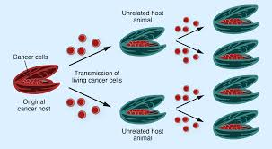
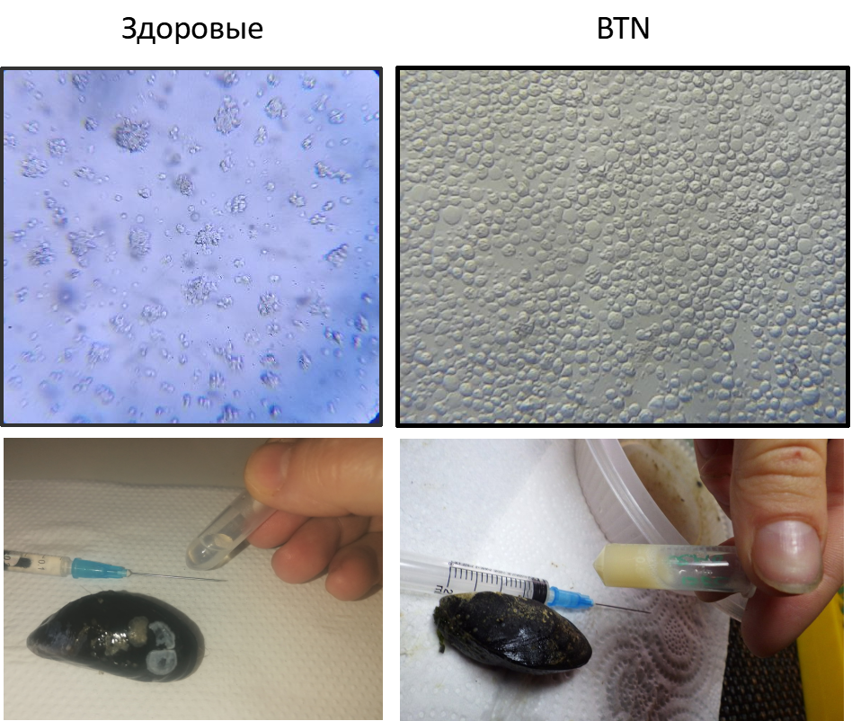
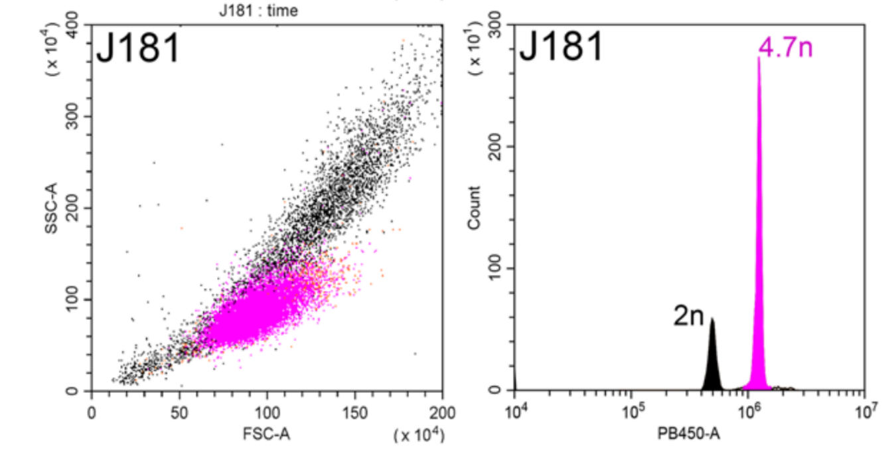
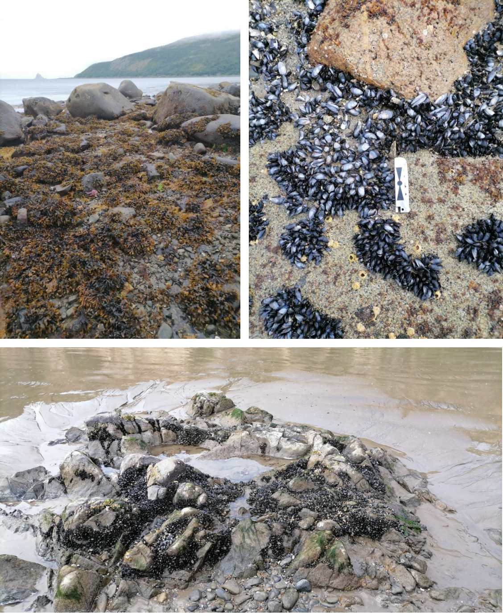
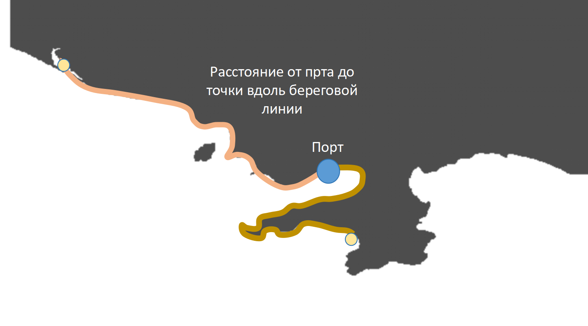
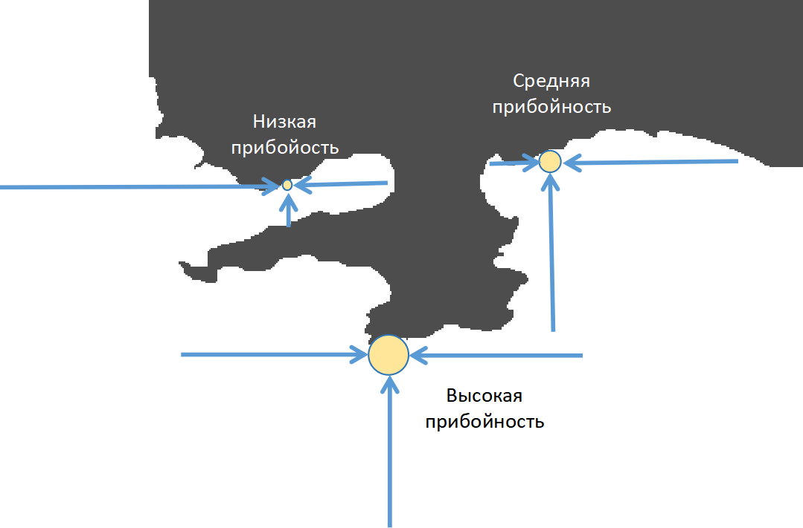

```{r setup, include=FALSE}
library(knitr)
opts_chunk$set(fig.show='hold',  warning=FALSE, message=FALSE, cache = FALSE, echo = FALSE)

opts_chunk$set(echo = FALSE, fig.cap = TRUE)

library(officedown)

```


```{r}

library(sf)
library(rnaturalearth)
library(rnaturalearthdata)


library(sp)
library(ggmap)
library(mapproj)
library(maps)

library(ggmap)
library(readxl)
library(ggrepel)
library(dplyr)
library(reshape2)
library(cowplot)
library(magrittr)
library(patchwork)
library(vegan)
library(mgcv)
library(gratia)
library(broom.mixed) 

library(rvg)

library(flextable)


default_theme <- 
  theme_bw() + 
  theme(axis.text = element_text(size = 15), axis.title = element_text(size = 20) )

theme_set(default_theme)
```


## Bivalvia Transmissible Neoplasia (BTN) — Заразный рак у двустворчатых моллюсков


:::::::::::::: {.columns}

:::{.column width="70%"}


- По феноменологии - диссеминированная неоплазия гемолимфы  (DN)
- Злокачественные клетки являются инфекционным агентом и передаются между особями через воду
- У каждого рака свой уникальный генотип, родственный индивидуальному генотипу особи, у которой этот рак возник впервые
- Впервые описанный у *Mya arenaria* в 2015,  $BTN$ выявлен еще у восьми систематически далеких видов (*Mytilus*, *Cerastoderma*, *Macoma* и др.)


:::

:::{.column width="30%"}


```{r, fig.cap="Схема заражения $BTN$", out.width="5%"}


``` 

:::

::::::::::::::

## Клиническая картина заражения $BTN$ у мидий

:::::::::::::: {.columns}

:::{.column width=70%}


- Зараженные моллюски внешне неотличимы от здоровых
- В материале пункции гемолимфы из мускула замыкателя видны округлые клетки со слабой адгезией.
- Гемолимфа зараженных особей мутная из-за повышенной концентрации клеток

:::

:::{.column width=30%}


```{r, fig.cap="Внешний вид здоровых и раковых клеток гемолимфы", out.width="5%"}


``` 

:::

::::::::::::::


## Диагностика $BTN$ с помощью проточной цитометрии

:::::::::::::: {.columns}

:::{.column width=70%}


- Проточная цитометрия (окраска DAPI) позволяет выявлять анеуплоидные раковые клетки
- По соотношению нормальных и анеуплоидных клеток можно судить о стадии заболевания
- Для подтверждения $BTN$ требуется генотипирование

:::

:::{.column width=30%}


```{r, fig.cap="Результаты проточной цитометрии", fig.width=4}



``` 

:::

::::::::::::::

## Две эволюционные линии $BTN$ у *Mytilus trossulus*

- $BTN$ у *M.trossulus* возникал неоднократно
- Известно две линии: $MtrBTN1$ и $MtrBTN2$
- Диагностика линий происходит по молекулярным маркерам (*mtCOI*)
- $BTN2$ широко распространен и найден у нескольких видов мидий в Атлантике и в Пацифике в обоих полушариях
- $BTN1$ отмечен только у *M.trossulus* в субарктике


## Что мы понимаем под экологическими аспектами распространения BTN

- Линии $BTN$ - самостоятельные виды одноклеточных паразитов
- Для анализа их связей со средой, включая организм мидии-хозяина, применим концептуальный аппарат экологии
- Для разных линий $BTN$ можно описать их экологические ниши, т.е. выявить связи со средовыми предикторами, включая характеристики популяций хозяев, как это делается при построении моделей ниш «обычных» видов
- Для разных линий $BTN$ можно изучить влияние на организм хозяина, как это делается для «обычных» паразитов

## Возможные ожидания

- Повышенная частота $BTN$, как онкологического заболевания, должна коррелировать с уровнем стресса, понижающего иммунитет мидий.
- Линии $BTN1$ и $BTN2$ будучи по происхождению клетками  одного «родительского» вида (*M.trossulus*) и близкого эволюционного возраста должны иметь сходные связи с факторами среды.
- Подобно другим паразитам, клетки $BTN$ должны манипулировать хозяином, увеличивая приток ресурсов.


# BTN  в окрестностях Магадана

## Почему Магадан?

:::::::::::::: {.columns}

:::{.column width=70%}

- Единственное известное место, где с «уловимой» частотой представлены обе линии $BTN$
- Представлен только один вид мидий *Mytilus trossulus*
- Мидий много, они формируют поселения в контрастных местообитаниях 

:::


:::{.column width=30%}

```{r}
points <- 
  read_excel("Data/Magadan_2021_2023_ecology.xlsx", sheet = "Points  characteristic 2021-23", na = "NA")

points_local <- 
  points %>% 
  filter(lat > 59.3)
```


```{r, fig.cap="", out.width="100%"}

world <- ne_countries(scale = "large", returnclass = "sf")

# Фильтрация стран Евразии по континенту
eurasia <- subset(world, continent %in% c("Europe", "Asia"))


Pl_map_large <- 
ggplot(data = eurasia) +
  geom_sf(fill = "lightgreen", color = "gray30") +
  coord_sf(
    xlim = c(150, 153),   
    ylim = c(58.8, 59.8)    
  ) +
  geom_point(aes(x = 150.8, y = 59.566667), size = 4, color = "red") +
  theme(panel.grid = element_blank()) +
  labs(x = "Долгота", y = "Широта") +
  scale_x_continuous(breaks = seq(150, 153, by = 1)) +  # Шкала с шагом 1 градус
  scale_y_continuous(breaks = seq(58.8, 59.8, by = 0.5)) +  
  annotate( geom = "text", x = 150.8, y = 59.61, label = "Магадан")

Pl_map_large +
  geom_point(data = points, aes(x = lon, y = lat), size = 2) +
  annotate(geom = "text", x= 151, y = 59.3, label = "Охотское море \nТауйская губа") 


``` 

:::

::::::::::::::


##  *Mytilus trossulus* в окрестностях Магадана




## Обследованные точки 

:::::::::::::: {.columns}

:::{.column width=70%}

- Обследовано 11 точек в 2021 г. и 15 в 2023 г (всего 20 локаций). 
- На каждой точке собирали *крупных* мидий для отбора проб гемолимфы и оценки ростовых процессов и репродуктивного статуса (обработано 3000 моллюсков)
- Брали выборки для описания размерной структуры и плотности поселения мидий

:::


:::{.column width=30%}

```{r, fig.cap="Точки сбора материала"}

load("Data/gg_Magadan_large.RData")

Magadan <- data.frame(long = 150 + 48/60, lat = 59 + 34/60)

Pl_map <- 
ggplot(gg_Magadan_large, aes(x = long, y = lat, group = group)) + 
  geom_polygon(fill = "gray30") + 
  coord_map(xlim = c(150., 151.52), ylim = c(59.4, 59.8) ) +
  theme(plot.margin = unit(c(0, 0, 0, 0), "cm")) +
  theme_map() 


Pl_map +
  geom_point(data = points_local, aes(x = lon, y = lat, group = 1), shape = 21, fill = "yellow", size = 3) +
  scale_fill_manual(values =  c("gray50", "yellow")) +
  theme_minimal() +
  guides(fill = "none", size = "none") +
  labs(x = "Долгота", y = "Широта") +
  geom_point(data = Magadan, aes(x = long + 0.01), shape = 22, group = 1, fill = "red", size = 6)+
  geom_text(data =  Magadan, aes(x = long, y = lat+0.02, label = "Магадан", group = 1), color = "white")+
  theme_map()
  


```

:::

::::::::::::::


## Частота BTN в окрестностях Магадана

```{r}
cancer <- read_excel("Data/Cancer_Magadan_2021-2023.xlsx", na = "NA", sheet = "Magadan_cancer_prevalence")

cancer2 <-
  cancer %>%
  group_by(Year, Site, Sample_ID) %>%
  summarise(N_processed = sum(N_Processed), N_cancer = sum(BTN)) %>% 
  filter(Year == 2023)

```


```{r}
# Данные по разновидности BTN
myt <- read_excel("Data/summary table_Magadan_itog.xlsx", sheet = "data")

myt <-
myt %>% 
  select(-Site) %>% 
  mutate(Site = Site_code)


myt %<>%
  mutate(BTN2 = BTN2.1 + BTN2.2)

myt_23 <- 
  myt %>% 
  filter(Year == 2023)


myt_23 %<>%
  select(-c(Site, Lat, Lon,  Date, BTN2.1, BTN2.2,  DN_FC  )) %>% 
  mutate(Site = Site_code)

cancer <- 
  myt %>% 
  mutate(Prop_BTN1 = BTN1/N, Prop_BTN2 = (BTN2.1 + BTN2.2)/N, Prop_BTN2.1 = (BTN2.1)/N,  Prop_BTN2.2 = (BTN2.2)/N ) 


cancer2 <-
  cancer %>% 
  filter(Year == 2023) %>% 
  select(-Site) %>% 
  rename(Site = Site_code)


cancer <- 
  merge(points, cancer)


cancer %>% 
  group_by(Site) %>% 
  summarise(Lat = mean(Lat), Lon = mean(Lon), N_total = sum(N), BTN1 = sum(BTN1), BTN2 = sum(BTN2)) %>% 
  mutate(BTN1 = BTN1/N_total*100, BTN2 = BTN2/N_total*100) %>% 
  select(Site, Lat, Lon, BTN1, BTN2)  %>% 
  melt(., id.vars = c("Site", "Lat", "Lon"), value.name = "Prop_BTN", variable.name = "Lineage" ) ->
  prop_BTN
  
```


```{r}
Pl_map_BTN <- 
Pl_map + 
  geom_point(data = prop_BTN, aes(x = Lon, y = Lat, size = Prop_BTN, group = 1), shape = 21, fill = "yellow") + 
  theme_map()+
  guides(size = "none") +
  scale_size_continuous(range = c(0, 5)) + 
  facet_wrap(~ Lineage, ncol = 1)

```


```{r}
Pl_hist <- 
  ggplot(prop_BTN, aes(x = Prop_BTN)) +
  geom_histogram(binwidth = 1.9) +
  labs(x = "Доля зараженных (%)", y = "Количество участков") +
  theme_bw() +
  facet_wrap(~ Lineage)

```


:::::::::::::: {.columns}

:::{.column width=30%}

```{r, fig.cap = "Частота зараженных мидий невелика: единицы процентов в поселении" }
Pl_hist
```

:::


:::{.column width=70%}

```{r, fig.cap = "Частота BTN варьирует вдоль побережья", dpi = 300, fig.width= 8}
Pl_map_BTN
```


:::

::::::::::::::


# Связь частоты BTN1 и BTN2  с факторами среды

## Возможные предикторы


```{r, fig.cap="Соленость варьирует в очень узких пределах"}
points %>% 
  ggplot(aes(Salinity)) + 
  geom_histogram(binwidth = 5) +
  labs(x = "Соленость", y = "Количество участков")  +
  theme_bw()
```


## Возможные предикторы
 



## Возможные предикторы





## Возможные предикторы


```{r}
# Данные по разновидности BTN
myt <- read_excel("Data/summary table_Magadan_itog.xlsx", sheet = "data")

myt <-
myt %>% 
  select(-Site) %>% 
  mutate(Site = Site_code)


myt %<>%
  mutate(BTN2 = BTN2.1 + BTN2.2)

myt_23 <- 
  myt %>% 
  filter(Year == 2023)

Prob_BTN1_total <- sum(myt$BTN1)/sum(myt$N)
Prob_BTN2_total <- sum(myt$BTN2)/sum(myt$N)


myt_23 %<>%
  select(-c(Site, Lat, Lon,  Date, BTN2.1, BTN2.2,  DN_FC  )) %>% 
  mutate(Site = Site_code)


```


```{r}

size <- read_excel("Data/Magadan_2021_2023_ecology.xlsx", na = "NA", sheet = "Размерная струкутра 2023 2021")

size <- size[complete.cases(size), ]

library(reshape2)

scam <- dcast(Year + Site ~ Size_class, data = size)

area <- read_excel("Data/Magadan_2021_2023_ecology.xlsx", na = "NA", sheet = "Площадь проб на размер")

sample_area <- 
  area %>% group_by(Year, Site) %>% summarise(Total_area = sum(Area))

scam <- 
  scam %>% group_by(Year, Site)


scam [ ,3:ncol(scam)] <- 
  round((scam[ ,3:ncol(scam)] / sample_area$Total_area) *10000, 0)


# scam_23 <- scam %>% filter(Year == 2023)


pca_scam <- rda(decostand(scam[ , -c(1,2)], method = "hellinger" ))

# plot(pca_scam, display = "sp")

sum_pca_scam <- summary(pca_scam)

pca_scam_size_scores <- as.data.frame(scores(pca_scam)$species)


pca_scam_scores <- as.data.frame(scores(pca_scam)$sites)

pca_scam_scores$N_Juv <- scam$L3    

pca_scam_scores$N_Large = scam$L8 + scam$L13 + scam$L18 + scam$L18 + scam$L23 + scam$L28 + scam$L33 + scam$L38 + scam$L43 

pca_scam_scores$N_Total <- scam$L3 + scam$L8 + scam$L13 + scam$L18 + scam$L23 + scam$L28 + scam$L33 + scam$L38 + scam$L43 + scam$L48 + scam$L53 + scam$L58

pca_scores_scam <- data.frame(Year = scam$Year, Site = scam$Site, pca_scam_scores)
```

```{r}
cover_23 <- read_excel("Data/Magadan_2021_2023_ecology.xlsx", sheet = "Покрытия миидий 2023")

mean_cover_23 <-
  cover_23 %>%
  group_by(Site) %>%
  summarise(Cover = mean(`Number of squares`/30))


# Анализ без объедиения проб сайтов

cancer <- 
  myt %>% 
  mutate(Prop_BTN1 = BTN1/N, Prop_BTN2 = (BTN2.1 + BTN2.2)/N, Prop_BTN2.1 = (BTN2.1)/N,  Prop_BTN2.2 = (BTN2.2)/N ) 


cancer2 <-
  cancer %>% 
  filter(Year == 2023) %>% 
  select(-Site) %>% 
  rename(Site = Site_code)


cancer_2023 <- 
  merge(points, cancer2) %>% 
  filter(Year == 2023)

pca_scores_scam_23 <- 
  pca_scores_scam %>% 
  filter(Year == 2023)

cancer_2023 <- 
merge(cancer_2023, pca_scores_scam_23)

cancer_2023 <- 
  merge(cancer_2023, mean_cover_23)


cancer_2023 <- 
  cancer_2023 %>% 
  mutate(BTN2 = BTN2.1 + BTN2.2,
         BTN2.1 = BTN2.1,
         BTN2.2 = BTN2.2)
```


```{r}
size_23 <- 
size %>% filter(Year == 2023)  

Sites <- 
pca_scores_scam_23 %>% arrange(PC1) %>% pull(Site) 

size_23$Site <- factor(size_23$Site, levels = Sites)

Pl_size_stricture <-
size_23 %>% 
  ggplot(., aes(x = L)) +
  geom_histogram(binwidth = 5) +
  facet_wrap(~Site, scales = "free_y", dir = "v") +
  theme_bw() +
  theme(strip.text = element_blank()) +
  labs(x = "Размерные классы (мм)", y = "Частота")
  
```

```{r, fig.width=7, fig.cap="Размерная структура - значительно различается между участками"}
Pl_size_stricture  
```


## Возможные предикторы

:::::::::::::: {.columns}

:::{.column width=70%}

### Размерная структура

- Матрица обилия размерных классов использована для компонентного анализа (PCA)
- Значения **PC1** (48% общей дисперсии) обобщенное описание размерной структуры 
- **PC1** отражает обилие молоди

:::

:::{.column width=30%}


```{r, fig.cap="Cвязь доли молоди со значениями PC1." }
ggplot(pca_scores_scam, aes(PC1, N_Juv/(N_Juv + N_Large))) + 
  geom_text(aes(label = Site)) +
  labs(x = "Значения PC1", y = "Доля молоди") +
  geom_smooth(method = "lm") +
  theme_bw()

```


:::

::::::::::::::
