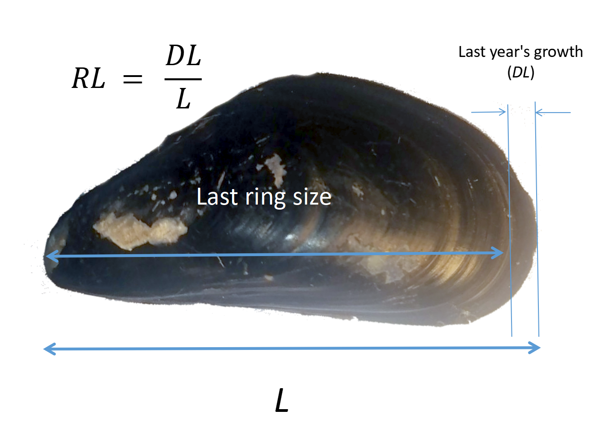

```{r setup, include=FALSE}
library(knitr)
opts_chunk$set(fig.show='hold',  warning=FALSE, message=FALSE, cache = FALSE, echo = FALSE)


```


```{r}

library(sf)
library(rnaturalearth)
library(rnaturalearthdata)


library(sp)
library(ggmap)
library(mapproj)
library(maps)

library(ggmap)
library(readxl)
library(ggrepel)
library(dplyr)
library(reshape2)
library(cowplot)
library(magrittr)
library(patchwork)
library(vegan)
library(mgcv)
library(gratia)
library(broom.mixed) 

library(rvg)

library(flextable)


default_theme <- 
  theme_bw() + 
  theme(axis.text = element_text(size = 15), axis.title.y = element_text(size = 15), axis.title.x = element_text(size = 20) )

theme_set(default_theme)
```


```{r}
points <- 
  read_excel("Data/Magadan_2021_2023_ecology_cleaned.xlsx", sheet = "Points  characteristic 2021-23", na = "NA")

points_local <- 
  points %>% 
  filter(lat > 59.3)
```


```{r}

load("Data/gg_Magadan_large.RData")

Magadan <- data.frame(long = 150 + 48/60, lat = 59 + 34/60)

Pl_map <- 
ggplot(gg_Magadan_large, aes(x = long, y = lat, group = group)) + 
  geom_polygon(fill = "gray30") + 
  coord_map(xlim = c(150., 151.52), ylim = c(59.4, 59.8) ) +
  theme(plot.margin = unit(c(0, 0, 0, 0), "cm")) +
  theme_map() 


```

```{r}
cancer <- read_excel("Data/Cancer_Magadan_2021-2023.xlsx", na = "NA", sheet = "Magadan_cancer_prevalence")

cancer2 <-
  cancer %>%
  group_by(Year, Site, Sample_ID) %>%
  summarise(N_processed = sum(N_Processed), N_cancer = sum(BTN)) %>% 
  filter(Year == 2023)

```


```{r}
# Данные по разновидности BTN
myt <- read_excel("Data/summary table_Magadan_itog.xlsx", sheet = "data")

myt <-
myt %>% 
  dplyr::select(-Site) %>% 
  mutate(Site = Site_code)


myt %<>%
  mutate(BTN2 = BTN2.1 + BTN2.2)

myt_23 <- 
  myt %>% 
  filter(Year == 2023)


myt_23 %<>%
  dplyr::select(-c(Site, Lat, Lon,  Date, BTN2.1, BTN2.2,  DN_FC  )) %>% 
  mutate(Site = Site_code)

cancer <- 
  myt %>% 
  mutate(Prop_BTN1 = BTN1/N, Prop_BTN2 = (BTN2.1 + BTN2.2)/N, Prop_BTN2.1 = (BTN2.1)/N,  Prop_BTN2.2 = (BTN2.2)/N ) 


cancer2 <-
  cancer %>% 
  filter(Year == 2023) %>% 
  dplyr::select(-Site) %>% 
  rename(Site = Site_code)


cancer <- 
  merge(points_local, cancer)


cancer %>% 
  group_by(Site) %>% 
  summarise(Lat = mean(Lat), Lon = mean(Lon), N_total = sum(N), BTN1 = sum(BTN1), BTN2 = sum(BTN2)) %>% 
  mutate(BTN1 = BTN1/N_total*100, BTN2 = BTN2/N_total*100) %>% 
  dplyr::select(Site, Lat, Lon, BTN1, BTN2)  %>% 
  melt(., id.vars = c("Site", "Lat", "Lon"), value.name = "Prop_BTN", variable.name = "Lineage" ) ->
  prop_BTN
  
```


```{r}
Pl_map_BTN <- 
Pl_map + 
  geom_point(data = prop_BTN, aes(x = Lon, y = Lat, size = Prop_BTN, group = 1), shape = 21, fill = "yellow") + 
  theme_map()+
  guides(size = "none") +
  scale_size_continuous(range = c(0, 5)) + 
  facet_wrap(~ Lineage, ncol = 1)

```


```{r}
Pl_hist <- 
  ggplot(prop_BTN, aes(x = Prop_BTN)) +
  geom_histogram(binwidth = 1.9) +
  labs(x = "Prevalence (%)", y = "Number of sites") +
  theme_bw() +
  facet_wrap(~ Lineage)

```


```{r, fig.cap="Fig. . Salinity varies in narrow limits in the region observed.", eval=FALSE}
points_local %>% 
  ggplot(aes(Salinity)) + 
  geom_histogram(binwidth = 5) +
  labs(x = "Salinity", y = "Number of sites")  +
  theme_bw()
```


```{r}
# Данные по разновидности BTN
myt <- read_excel("Data/summary table_Magadan_itog.xlsx", sheet = "data")

myt <-
myt %>% 
  dplyr::select(-Site) %>% 
  mutate(Site = Site_code)


myt %<>%
  mutate(BTN2 = BTN2.1 + BTN2.2)

myt_23 <- 
  myt %>% 
  filter(Year == 2023)

Prob_BTN1_total <- sum(myt$BTN1)/sum(myt$N)
Prob_BTN2_total <- sum(myt$BTN2)/sum(myt$N)


myt_23 %<>%
  dplyr::select(-c(Site, Lat, Lon,  Date, BTN2.1, BTN2.2,  DN_FC  )) %>% 
  mutate(Site = Site_code)


```


```{r fig.cap="**Fig 1. Sampling sites. Areas surveyed only in 2021 are marked in white, only in 2023 in yellow, and in both years in red.**"}

library(ggspatial)

points_local %>% 
  mutate(Group = ifelse(Site %in% c("KHOL","MAM", "MAR", "NUK-I", "UM", "VES"), yes = "Resampled", no = "One")) ->
  points_local

points_local %>% 
mutate(Group = case_when(Group == "Resampled" ~  "Resampled",
                         Group == "One" & Year == 2021 ~ "2021",
                         Group == "One" & Year == 2023 ~ "2023")) ->
  points_local

points_local$Group <- factor(points_local$Group)

Pl_map +
  geom_point(data = points_local, aes(x = lon, y = lat, group = 1, fill = Group), shape = 21,  size = 3) +
  scale_fill_manual(values =  c("white", "yellow", "red")) +
  theme_minimal() +
  guides(size = "none") +
  labs(x = "Lon", y = "Lat") +
  geom_point(data = Magadan, aes(x = long + 0.01), shape = 22, group = 1, fill = "gray", size = 6)+
  geom_text(data =  Magadan, aes(x = long, y = lat+0.03, label = "Magadan", group = 1), color = "white")+
  annotate(geom = "text", x= 150.25, y = 59.5, label = "Sea of \nOkhotsk")
```

At each site: projective cover of mussels using photos, 1-3 qualitative samples of big mussels (L>25 mm) for BTN diagnostics by flow cytometry and for reproductive state by gonad smears under microscope (data on gonads is missing for some samples), 2-3 quantitative samples for mussel demography (local abundance, size structure) and growth rate by year rings on shells. 

Sampling time: 05.07-14.07 2021 and 25.06-05.07 2023. Both years mussels in populations were in pre-spawning condition or in spawning condition (as expected for subarctic seas).

For each site a number of “abiotic” environmental predictors were available (see below)


```{r, fig.cap = "**Fig. 2. The frequency distribution of BTN1 and BTN2.**"}

Pl_hist
```

The prevalence of BTN1 in samples averages `r round(Prob_BTN1_total * 100, 2)`%, BTN2 – `r round(Prob_BTN2_total * 100, 2)`   %.


```{r, fig.cap = "**Fig. 3. Prevalence of BTN1 and BTN2 along shore**", dpi = 600, fig.width= 8}
Pl_map_BTN
```

Symbol size is proportional to BTN prevalence, with data for BTN1 and BTN2 presented separately.


```{r}
cover <- read_excel("Data/Magadan_2021_2023_ecology_cleaned.xlsx", sheet = "Покрытия миидий 2023")

cover %>% 
  group_by(Site) %>% 
  summarise(Mean_Cover = mean(`Number of squares`)/30) ->
  site_cover


```


```{r}
site_cover <-
  site_cover %>% 
  mutate(Cover_Type = ifelse(Mean_Cover >= 0.10, "High", "Low"))

Cover_factor <- 
site_cover %>% 
  group_by(Cover_Type) %>% 
  summarise(Mean_Cover = mean(Mean_Cover)) %>% 
  pull(Mean_Cover) 

High_factor <- (Cover_factor[1])
Low_factor <- (Cover_factor[2])
```


```{r}

size <- read_excel("Data/Magadan_2021_2023_ecology_cleaned.xlsx", na = "NA", sheet = "Размерная струкутра 2023 2021")

size <- size[complete.cases(size), ]

library(reshape2)

scam <- dcast(Year + Site ~ Size_class, data = size)

area <- read_excel("Data/Magadan_2021_2023_ecology_cleaned.xlsx", na = "NA", sheet = "Площадь проб на размер")

sample_area <- 
  area %>% 
  group_by(Year, Site) %>% 
  summarise(Total_area = sum(Area))

scam <- 
  scam %>% group_by(Year, Site)


scam [ ,3:ncol(scam)] <- 
  round((scam[ ,3:ncol(scam)] / sample_area$Total_area) *10000, 0)

```


```{r}
# Связь размера и веса мидии.

LW <- read_excel("Data/Magadan_2021_mussel_L_W.xlsx")
LW$W <- as.numeric(gsub(pattern = ",", replacement = ".", x = LW$W))

mod_W <- lm(W ~ I(L^3) - 1, data = LW)

LW$Predicted <- predict(mod_W)

# LW %>%
#   ggplot() +
#   geom_point(aes(x = L, W)) +
#   geom_point(aes(L, Predicted), color = "blue")

```


```{r}
df <- 
  merge(site_cover, scam, all.y = T) 


# Расставляем типы покрытия (Cove_Type), оцененные по воспоминаниям 

df$Cover_Type[c(3,4, 11)] <- "Low"
df$Mean_Cover[c(3,4, 11)] <- Low_factor

df$Cover_Type[c(14, 23)] <- "High"
df$Mean_Cover[c(14, 23)] <- High_factor


SCAM <- df

# SCAM[,5:ncol(SCAM)] <- SCAM[,5:ncol(SCAM)] * df$Mean_Cover


SCAM <-
  SCAM %>%
  select(-c(Mean_Cover, Cover_Type)) %>%
  arrange(Year)

size_classes <- data.frame(L = as.numeric(gsub(x = names(SCAM)[-c(1:2)], pattern = "L", replacement = "")))


size_classes$W <- predict(mod_W, newdata = size_classes)

Biomass <- as.numeric(as.matrix(SCAM[ , -c(1:2)]) %*% as.vector(size_classes$W))

df$Biomass <- Biomass * df$Mean_Cover


SCAM <- df

SCAM <-
  SCAM %>%
  select(-c(Cover_Type)) %>%
  arrange(Year)

```


```{r}
growth <- read.table("Data/Mussel_growth_Magadan_2021_2023.csv", sep = ";", header = T, dec = ",")

growth <-
  growth %>% 
  dplyr::select(-Site) %>% 
  rename(Site = Site_code) 

ogp <- 
  growth %>% 
  group_by(Site) %>% 
  summarise(OGP = mean(OGP_site))

```

<!-- ```{r} -->
<!-- SCAM <- merge(SCAM, ogp) -->
<!-- ``` -->


```{r}
# scam_23 <- scam %>% filter(Year == 2023)

# pca_scam <- rda(decostand(SCAM[ , -c(1,2)], method = "hellinger" ))


# pca_scam <- rda(log(SCAM[ , -c(1,2)] + 1))


# pca_scam <- rda(SCAM[ , -c(1,2)])

# plot(pca_scam)

pca_scam <- rda(decostand(SCAM[ , -c(1, 3)], method = "standardize" ))


# plot(pca_scam, display = "sp")

# sum_pca_scam_1 <- summary(pca_scam_1)

sum_pca_scam <- summary(pca_scam)


pca_scam_size_scores <- as.data.frame(scores(pca_scam)$species)


pca_scam_scores <- as.data.frame(scores(pca_scam)$sites)

pca_scam_scores$N_Juv <- SCAM$L3    

pca_scam_scores$N_Large = SCAM$L8 + SCAM$L13 + SCAM$L18 + SCAM$L18 + SCAM$L23 + SCAM$L28 + SCAM$L33 + SCAM$L38 + SCAM$L43 

pca_scam_scores$N_Total <- SCAM$L3 + SCAM$L8 + SCAM$L13 + SCAM$L18 + SCAM$L23 + SCAM$L28 + SCAM$L33 + SCAM$L38 + SCAM$L43 + SCAM$L48 + SCAM$L53 + SCAM$L58

pca_scores_scam <- data.frame(Year = SCAM$Year, Site = SCAM$Site,  Biomass = SCAM$Biomass, Mean_Cover = SCAM$Mean_Cover, pca_scam_scores)


pca_scores_scam <-
  pca_scores_scam %>% 
  mutate(Site_Year = paste(Site, "_", Year, sep = ""))

pca_scores_scam$Site_Year <- gsub(pattern = "20", replacement = "", x = pca_scores_scam$Site_Year) 

```

## Mussel population structure

```{r fig.cap="**Fig. 4. Ordination of population parameters in PCA axes.**"}
pca_scam_size_scores %>% 
  mutate(Param = row.names(.)) %>% 
  ggplot(aes(PC1, PC2)) +
  geom_text(aes(label = Param)) +
  geom_hline(yintercept = 0) +
  geom_vline(xintercept = 0)
```


<!-- ```{r} -->
<!-- pca_scores_scam %>%  -->
<!--   ggplot(aes(PC1, N_Juv)) + -->
<!--   geom_point() + -->
<!--   geom_smooth() -->

<!-- pca_scores_scam %>%  -->
<!--   ggplot(aes(PC1, N_Large)) + -->
<!--   geom_point() + -->
<!--   geom_smooth() -->


<!-- pca_scores_scam %>%  -->
<!--   ggplot(aes(PC1, Biomass)) + -->
<!--   geom_point()+ -->
<!--   geom_smooth() -->


<!-- pca_scores_scam %>%  -->
<!--   ggplot(aes(PC1, Mean_Cover)) + -->
<!--   geom_point() + -->
<!--   geom_smooth() -->

<!-- ``` -->

```{r, fig.cap="**Fig. 5. Ordination of all sites in PCA axes.**"}
pca_scores_scam %>% 
  ggplot(aes(PC1, PC2)) +
  geom_text(aes(label = Site_Year)) +
  geom_hline(yintercept = 0) +
  geom_vline(xintercept = 0)

```

In the analysis, L3-L58 is the abundance of mussel size classes in quantitative samples at each sampling site. (At each site 2-3 samples were taken for mussel size structure analysis). Biomass is the biomass at the entire site, taking into account the cover of mussels.  

Before calculating PCA, all variables were standardized (mean = 0, sd = 1).

#### PCA interpretation

PC1 reflects a gradient from sparse mussel beds dominated by large molluscs with length 38-58 mm to populations with abundant young mussels, high projective cover and high biomass.


```{r fig.cap="**Fig. 6. Ordination of resampled sites in PCA axes.**"}
# unique(pca_scores_scam$Site)
# 
# table(pca_scores_scam$Site)

pca_scores_scam %>% 
  filter(Site %in% c("KHOL","MAM", "MAR", "NUK-I", "UM", "VES")) %>% 
  ggplot(aes(x = PC1, y = PC2)) +
  # Соединяем одинаковые Site (группируем по Site)
  geom_line(aes(group = Site), 
            color = "gray60", 
            alpha = 0.7, 
            linewidth = 0.6,
            linetype = "dashed") +
  # Точки с цветом по году
  geom_point(aes(color = as.factor(Year)), size = 3) +
  # Метки с Site и Year
  geom_text(aes(label = paste0(Site, "\n", Year)), 
            size = 2.8, 
            nudge_y = 0.02) +
  scale_color_viridis_d(name = "Year")


```


The same figure, but only the populations studied in 2021 and 2023 are shown.
Note that, with the exception of the "Khol" site, all populations have shifted from left to right along the PC1 axis. That is, the populations have become, on average, younger over the two years. Below are box plots of PC1 values for the same sites in different years.

Thus PC1 partly reflects the temporal changes in mussel population structure: between 2021 and 2023 populations on average became "younger".


```{r fig.cap="**Fig. 7. PC1 values for resampled sites in 2021 and 2023.**"}
pca_scores_scam %>% 
  filter(Site %in% c("KHOL","MAM", "MAR", "NUK-I", "UM", "VES")) %>% 
  ggplot(aes(x = Year, y = PC1, group = Year)) +
  geom_boxplot()

```


```{r}
pca_scores_scam <-
merge(pca_scores_scam, df , all = T) 

```


```{r}
Sites_Year <- 
pca_scores_scam %>% arrange(PC1) %>% pull(Site_Year) %>% unique() 

size <-
size %>%
  mutate(Site_Year = paste(Site, "_", Year, sep = ""))

size$Site_Year <- gsub(pattern = "20", replacement = "", x = size$Site_Year) 


size$Site_Year <- factor(size$Site_Year, levels = Sites_Year)


Pl_size_stricture <-
size %>% 
  ggplot(., aes(x = L)) +
  geom_histogram(binwidth = 5) +
  facet_wrap(~Site_Year, scales = "free_y", dir = "v", ncol = 4) +
  theme_bw() +
  # theme(strip.text = element_blank()) +
  labs(x = "Размерные классы (мм)", y = "Частота")
```

```{r, fig.height=10, fig.cap="**Fig. 8. Population size structures, ordered by increasing PC1.**"}
growth %>% 
  select(Site, Year, L) %>% 
  filter(complete.cases(.)) ->
  analyzed_myt_size

 size %>% 
   select(Year, Site, Site_Year) %>% 
   unique(.) %>% 
   merge(., analyzed_myt_size) ->
   analyzed_myt_size
 
 

Pl_size_stricture +
  geom_rug(data = analyzed_myt_size, aes(y = 0, x = L), color = "blue")
  
```

 Blue ticks below the X-axis represent the sizes of mussels analyzed for BTN infection. Note: Samples for population structure analysis and BTN diagnosis were collected separately from the same population. 


```{r}
myt %>% 
  select(Site_code,  Year,  N, BTN1, BTN2) %>%
  group_by(Site_code, Year) %>% 
  summarise(N = sum(N), BTN1 = sum(BTN1), BTN2 = sum(BTN2)) %>% 
  melt(., id.vars = c( "Site_code",  "Year", "N"), variable.name = "Lineage", value.name = "N_cancer") %>% 
  mutate(N_helthy = N - N_cancer) %>% 
  rename(Site = Site_code) ->
  cancer_21_23

df <- merge(cancer_21_23, points)


df2 <-merge(df, pca_scores_scam)

cancer_21_23_predictors <- merge(df2, ogp)

cancer_21_23_predictors$Year <- factor(cancer_21_23_predictors$Year)

cancer_21_23_predictors$Site <- factor(cancer_21_23_predictors$Site) 

```

# Dependence of BTN prevalence on predictors: raw data

Predictors were the next. 

* `Fetch`, openness of the shore to the surf. Technically - unobstructed length of water surface (km) over which wind from a certain direction can blow.
* `Dist_port` - distance from the harbor measured along the shoreline. 
* `PC1` (see above)
* `OGP`, overall growth performanse. OGP = log (L∞ ∗ K), where L∞ and K – parameters of the vonBertalanffy equation calculated from the sizes of the year rings on mussel shells. To estimate OGP for a site, a few dozen of biggest mussels were studied and individual OGP values were averaged.


Salinity was not included in the analysis, as it did not vary between the sites.


```{r}
cancer %>% 
  group_by(Site, Year) %>% 
  summarise(Lat = mean(Lat), Lon = mean(Lon), N_total = sum(N), BTN1 = sum(BTN1), BTN2 = sum(BTN2)) %>% 
  mutate(BTN1 = BTN1/N_total*100, BTN2 = BTN2/N_total*100) %>% 
  dplyr::select(Site,Year, Lat, Lon, BTN1, BTN2)  %>% 
  melt(., id.vars = c("Site", "Year", "Lat", "Lon"), value.name = "Prop_BTN", variable.name = "Lineage" ) ->
  prop_BTN_2


prop_BTN_2_points <- 
  merge(prop_BTN_2, cancer_21_23_predictors)


```


```{r}
Pl_BTN1_dynamics <- 
prop_BTN_2_points %>% 
  filter(Site %in% c("KHOL","MAM", "MAR", "NUK-I", "UM", "VES")) %>% 
  filter(Lineage == "BTN1") %>% 
  ggplot(aes(x = Year, y = Prop_BTN, group = Year)) +
  geom_boxplot() +
  ggtitle("BTN1") +
  ylim(0, 7.5) +
  labs(y = "Prevalence (%)")

Pl_BTN2_dynamics <- 
prop_BTN_2_points %>% 
  filter(Site %in% c("KHOL","MAM", "MAR", "NUK-I", "UM", "VES")) %>% 
  filter(Lineage == "BTN2") %>% 
  ggplot(aes(x = Year, y = Prop_BTN, group = Year)) +
  geom_boxplot() +
  ggtitle("BTN2") +
  ylim(0, 7.5)+
  labs(y = "Prevalence (%)")


```

```{r}
prop_BTN_2_points %>% 
  filter(Site %in% c("MAM", "MAR", "NUK-I", "UM", "VES")) %>% 
  filter(Lineage == "BTN1") %>% 
  ggplot(aes(x = PC1, y = Prop_BTN, group = Site)) +
  geom_line(aes(group = Site), 
            color = "gray60", 
            alpha = 0.7, 
            linewidth = 0.6,
            linetype = 1,
            arrow = arrow(angle = 15, type = "closed")) +
  # Точки с цветом по году
  geom_point(aes(color = as.factor(Year)), size = 3) +
  geom_line(data = prop_BTN_2_points %>% filter(Site %in% c("KHOL") & Lineage == "BTN1"), aes(group = Site), 
            color = "gray60", 
            alpha = 0.7, 
            linewidth = 0.6,
            linetype = 1,
            arrow = arrow(angle = 15, type = "closed", ends = "first")) +
  geom_point(data = prop_BTN_2_points %>% filter(Site %in% c("KHOL") & Lineage == "BTN1"), aes(color = as.factor(Year)), size = 3) +
  geom_point(data = prop_BTN_2_points %>% filter(!Site %in% c("KHOL", "MAM", "MAR", "NUK-I", "UM", "VES") & Lineage == "BTN1")) +
  scale_color_viridis_d(name = "Year") +
  ggtitle("BTN1") +
  geom_smooth(data = prop_BTN_2_points %>% filter(Lineage == "BTN1"), method = "gam", aes(group = 1), se = F) +
  ylim(0, 7.5) +
  labs(y = "Prevalence (%)")->
  BTN1_PC1


```


```{r}
prop_BTN_2_points %>% 
  filter(Site %in% c("MAM", "MAR", "NUK-I", "UM", "VES")) %>% 
  filter(Lineage == "BTN2") %>% 
  ggplot(aes(x = PC1, y = Prop_BTN, group = Site)) +
  geom_line(aes(group = Site), 
            color = "gray60", 
            alpha = 0.7, 
            linewidth = 0.6,
            linetype = 1,
            arrow = arrow(angle = 15, type = "closed")) +
  # Точки с цветом по году
  geom_point(aes(color = as.factor(Year)), size = 3) +
  geom_line(data = prop_BTN_2_points %>% filter(Site %in% c("KHOL") & Lineage == "BTN2"), aes(group = Site), 
            color = "gray60", 
            alpha = 0.7, 
            linewidth = 0.6,
            linetype = 1,
            arrow = arrow(angle = 15, type = "closed", ends = "first")) +
  geom_point(data = prop_BTN_2_points %>% filter(Site %in% c("KHOL") & Lineage == "BTN1"), aes(color = as.factor(Year)), size = 3) +
  geom_point(data = prop_BTN_2_points %>% filter(!Site %in% c("KHOL", "MAM", "MAR", "NUK-I", "UM", "VES") & Lineage == "BTN2")) +
  scale_color_viridis_d(name = "Year") +
  ggtitle("BTN2") +
  geom_smooth(data = prop_BTN_2_points %>% filter(Lineage == "BTN2"), method = "gam", aes(group = 1), se = F) +
  ylim(0, 7.5)+
  labs(y = "Prevalence (%)") ->
  BTN2_PC1

```


```{r fig.cap = "**Fig. 9. Dependence of BTN prevalence on population structure.**"}
(BTN1_PC1 | BTN2_PC1) + 
  plot_layout(guides = "collect") & # собираем все легенды вместе
  theme(legend.position = "bottom")
```

The arrows indicate temporary changes in the populations studied both in 2021 and 2023. The prevalence of BTN1 showed a nonlinear U-shaped relationship with PC1. In contrast, no clear relationship was observed for BTN2.


```{r fig.cap="**Fig. 10. Prevalence of two BTN lineages across repeatedly sampled sites (2021–2023).**"}
plot_grid(Pl_BTN1_dynamics, Pl_BTN2_dynamics)
```

On average, across the six resampled sites, the frequency of BTN1 decreased between 2021 and 2023. This again support the idea about temporal changes reflecting by PC1. No clear temporal pattern was observed for BTN2


```{r, fig.cap="**Fig 11. BTN Prevalence in Relation to Along-Shore Distance from Magadan Sea Port**"}
prop_BTN_2_points %>% 
  ggplot(aes(x = Dist_Port, y = Prop_BTN)) +
  geom_point() +
  facet_wrap(~Lineage) +
  geom_smooth(method = "lm", se = F) +
  labs(y = "BTN prevalence (%)", x = "Distance to Magadan Port")

```

BTN1 prevalence shows a clear increasing trend, while BTN2 exhibits no clear pattern.


```{r, fig.cap="**Fig 12. Relationship Between BTN Prevalence and Fetch, a Proxy for Wave Action**"}
prop_BTN_2_points %>% 
  ggplot(aes(x = fetch, y = Prop_BTN)) +
  geom_point() +
  facet_wrap(~Lineage)+
  geom_smooth(method = "lm", se = F) +
  labs(y = "BTN prevalence (%)", y = "Distance to Magadan Port")

```


The prevalence of BTN1 shows a clear upward trend, while BTN2 does not show a clear pattern


```{r, fig.cap="**Fig. 13. Prevalence of BTN depending on mussel growth rate (OGP) in populationse)**"}

prop_BTN_2_points %>%
  ggplot(aes(x = OGP, y = Prop_BTN)) +
  geom_point() +
  facet_wrap(~Lineage) +
  geom_smooth(method = "lm", se = F) +
  labs(y = "BTN proportion (%)")

```


Both lineages show a positive association with mussel growth rate.


```{r}
# 
# prop_BTN_2_points %>% 
#   ggplot(aes(x = PC1, y = Prop_BTN)) +
#   geom_point() +
#   facet_wrap(~Lineage)+
#   geom_smooth(method = "loess", se = F) +
#   labs(y = "BTN proportion (%)")
# 
#   


```


# Modelling the dependencies of BTN prevalences on predictors 


```{r}
Mod <- gam(cbind(N_cancer, N_helthy) ~ 
             s((Dist_Port), by = Lineage,  bs = "cs", k = 5) + 
             s((fetch), by = Lineage,  bs = "cs", k = 5) +  
             s((PC1), by = Lineage,  bs = "cs", k = 5) + 
             s((OGP), by = Lineage, bs = "cs", k = 5) +  
             Lineage +  
             s(Year, Site, bs = "re"),  
           family = "binomial", 
           method = "REML", 
           data = cancer_21_23_predictors )


# summary(Mod)


# Mod_no_re <- gam(cbind(N_cancer, N_helthy) ~ 
#              s((Dist_Port), by = Lineage,  bs = "tp", k = 5) + 
#              s((fetch), by = Lineage,  bs = "tp", k = 5) +  
#              s((PC1), by = Lineage,  bs = "tp", k = 5) + 
#              s((OGP), by = Lineage, bs = "tp", k = 5) +  
#              Lineage + Year,  
#            family = "binomial", 
#            method = "REML", 
#            data = cancer_21_23_predictors )


# Mod2 <- gam(cbind(N_cancer, N_helthy) ~ s((Dist_Port), by = interaction(Lineage, Year), k = 10, bs = "tp") + s((fetch), by = interaction(Lineage, Year), k = 10, bs = "tp")  + s((PC1), by = interaction(Lineage, Year), k = 10, bs = "tp") + s((OGP), by = interaction(Lineage, Year), k = 5, bs = "tp")  +  Lineage + Year +  s(Site, bs = "re"),  family = "binomial", method = "REML", data = cancer_21_23_predictors )

```


Generalized Additive Mixed Model (GAMs) was fitted using the 'mgcv' package in R to assess the relationships between BTN prevalence and the predictors under consideration. "Site" and "Year" were included in the model as random factors.


```{r, echo=TRUE, eval=FALSE}
Mod <- gam(cbind(N_cancer, N_helthy) ~ 
             s((Dist_Port), by = Lineage,  bs = "cs", k = 5) + 
             s((fetch), by = Lineage,  bs = "cs", k = 5) +  
             s((PC1), by = Lineage,  bs = "cs", k = 5) + 
             s((OGP), by = Lineage, bs = "cs", k = 5) +  
             Lineage +  
             s(Year, Site, bs = "re"),  
           family = "binomial", 
           method = "REML", 
           data = cancer_21_23_predictors )

```


<!-- ### Проверка валидности модели -->

<!-- ```{r} -->
<!-- library(DHARMa) -->


<!-- sim_res <- simulateResiduals(fittedModel = Mod, plot = F, n = 2500, refit = FALSE) -->

<!-- # 2. Дополнительные тесты -->
<!-- testResiduals(sim_res)  # Комплексная проверка -->
<!-- #  -->
<!-- testDispersion(sim_res) -->


<!-- # conc <- concurvity(Mod, full = T) -->
<!-- # print(conc) -->

<!-- gam.check(Mod) -->

<!-- ``` -->

<!-- Не супер, но можно принять... -->


```{r}
library(flextable)
ft <- flextable(tidy(Mod))


ft %>%
  colformat_double(j = c(2, 3, 4), digits = 1) %>% 
  colformat_double(j = 5, digits = 3) %>% 
  set_header_labels(values = c("Smoother term", "edf", "ref.df", "F", "p-value" )) %>% 
  set_caption("Summary of the generalized additive mixed model (GAMM) assessing the effects of predictors on BTN prevalence")


```

Significant associations were found for BTN1 with distance to port, Fetch, and PC1, while no significant patterns were found for BTN2. In terms of growth rates, BTN2 was significantly associated with OGP (p=0.02), while the association for BTN1 was marginally significant (p=0.06).


### Model visualization 

```{r}
Pl_BTN1_dist_port<-
  draw(Mod, residuals = T, select = 1)+ 
  geom_hline(yintercept = 0, linetype = 2)
```


```{r}
Pl_BTN2_dist_port<-
draw(Mod, residuals = T, select = 2)+ 
  geom_hline(yintercept = 0, linetype = 2)
```


```{r, fig.cap="**Fig. 14. Relationship between the frequency of two BTN lineages and distance to port. Partial effects show the effect of a predictor after accounting for all other predictors in the model. The horizontal line represents the mean; positive values indicate above-mean effects, negative values below-mean effects. Points are partial residuals.**"}
plot_grid(Pl_BTN1_dist_port, Pl_BTN2_dist_port) 
```


```{r}
Pl_BTN1_fetch <-
draw(Mod, residuals = T, select = 3) +   
  geom_hline(yintercept = 0, linetype = 2)
```


```{r}
Pl_BTN2_fetch <-
draw(Mod, residuals = T, select = 4) +   
  geom_hline(yintercept = 0, linetype = 2)
```

```{r, fig.cap="**Fig. 15.Relationship between the prevalence of two BTN lineages and Fetch as proxy of surf level.**"}
plot_grid(Pl_BTN1_fetch, Pl_BTN2_fetch)
```


```{r}
Pl_BTN1_PC1 <- 
draw(Mod, residuals = T, select = 5) + 
  geom_hline(yintercept = 0, linetype = 2)
```


```{r}
Pl_BTN2_PC1 <- 
draw(Mod, residuals = T, select = 6) + 
  geom_hline(yintercept = 0, linetype = 2)
```

```{r, fig.cap="**Fig. 16. Relationship between the prevalence of two BTN lineages and PC1 as proxy of mussel population structure.**"}
plot_grid(Pl_BTN1_PC1, Pl_BTN2_PC1)
```


```{r}
Pl_BTN1_OGP <- 
draw(Mod, residuals = T, select = 7)+ 
  geom_hline(yintercept = 0, linetype = 2)
```


```{r}
Pl_BTN2_OGP <- 
draw(Mod, residuals = T, select = 8)+ 
  geom_hline(yintercept = 0, linetype = 2)
```


```{r, fig.cap="**Fig. 17. Relationship between the prevalence of two BTN lineages and OGP as proxy of mussel lifetime growth rates and fitness.** "}
plot_grid(Pl_BTN1_OGP, Pl_BTN2_OGP)
```


# Effects of BTN infection on reproductive function and growth of the host


```{r}
# Данные по индивидуальным характристикам мидий
myt_ind <- read_excel("Data/Mussel_growth_Magadan_2021_2023.xlsx", na = "NA")

myt_ind$Sample <- paste(myt_ind$Site_code, myt_ind$Sample, sep = "_")


# Удаляем идий, которые были испольованы для анализа роста, но не анализировались с для определения BTN

myt_ind %<>%
  filter(!is.na(DN))


myt_ind$DN <- factor(myt_ind$DN)
myt_ind$Site_code <- factor(myt_ind$Site_code)
myt_ind$Sample <- factor(myt_ind$Sample)
myt_ind$Rate_of_aneuploid_cells <- as.numeric(myt_ind$Rate_of_aneuploid_cells)

myt_ind %<>%
  mutate(Prop_Increment = Increment/L) %>%
  mutate(BTN_Type = case_when(BTN_genotype == "BTN1" ~ "BTN1",
                              BTN_genotype %in% c("BTN2.1", "BTN2.2") ~ "BTN2",
                              BTN_genotype == "healthy" ~ "healthy"))

myt_ind$BTN_Type <- factor(myt_ind$BTN_Type)


myt_ind %<>%
  mutate(Gonad_quality = case_when(Sex == "male" ~ "Developed",
                                   Sex == "female" ~ "Developed",
                                   Sex == "no gametes" ~ "No"))


myt_ind <-
  myt_ind %>%
  filter(!is.na(BTN_Type))


# myt_ind %>%
#   filter(!is.na(Sex)) %>%
#   ggplot(aes(BTN_Type, Prop_Increment, fill = BTN_Type)) +
#   geom_boxplot() +
#   facet_grid(Sex ~ Year)


myt_ind_clean <-
  myt_ind %>%
  filter(!is.na(BTN_Type)) %>%
  filter(Sex != "hermaphrodite") %>%
  filter(!is.na(Sex))

myt_ind_clean$Fi_Increment <- 2*asin(sqrt(myt_ind_clean$Prop_Increment)) * 180/pi

points <- read_excel("Data/Magadan_2021_2023_ecology_cleaned.xlsx", sheet = "Points  characteristic 2021-23", na = "NA")

points %<>%
  rename(Site_code = Site)


# points_2023 <-
#   points %>%
#   filter(Year == 2023) %>%
#   rename(Site_code = Site)

myt_ind_clean <- merge(myt_ind_clean, points)


myt_ind_clean$BTN_Type <- factor(myt_ind_clean$BTN_Type, labels = c("BTN1", "BTN2", "Healthy"))

myt_ind_clean$Gonad_quality <- factor(myt_ind_clean$Gonad_quality, labels = c("Gamets present", "No gamets"))

```


```{r, fig.cap=" **Fig. 18. Frequency of individuals with different reproductive conditions among mussels infected with different BTN lineages, compared to healthy specimens.**",  fig.width=10, eval=TRUE}

# At! размер картинки на слайдах этого типа регулируется fig.width=

myt_ind_clean %>%
  group_by(Year, BTN_Type, Gonad_quality) %>%  # Группируем по годам и типам BTN
  summarise(Frequency = n(), .groups = 'drop') %>%  # Считаем количество наблюдений
  group_by(Year, BTN_Type) %>%  # Группируем для вычисления долей
  mutate(Frequency = Frequency / sum(Frequency)) %>%  # Преобразуем в доли
  ggplot(aes(x = "", y = Frequency, fill = Gonad_quality)) +
  geom_bar(stat = "identity", width = 1, color = "black") +
  coord_polar("y", start = 0) +
  theme_void() +
  facet_grid(Year ~ BTN_Type) + # Разделяем на подграфики по годам и типам BTN
  scale_fill_manual(values = c("green", "red")) +
  labs(fill = "") +
  theme(strip.text = element_text(size = 18))


```

In mussels infected with BTN, gametes were usually absent in gonad smears, indicating impaired reproductive function.


## The relationship between the frequency of “gamete-free” mussels and the BTN severity, assessed by the frequency of aneuploid (i.e., cancerous) cells in the haemolymph using flow cytometry.

To investigate the effect of the rate of aneuploid hemocytes in haemolymph on reproductive status of mussels in terms of presence/absence of gametes, we fitted a generalized additive model (GAM). The model included a smooth term for the rate of aneuploid cells (s(Aneuploid_Proportion)), which was allowed to vary by BTN lineage (using the by = Lineage argument). BTN lineage was also included as a parametric factor. The model was fitted with a binomial family to account for the binary nature of the gonad outcome variable.


```{r, echo=TRUE, eval=FALSE}
Mod_gonad <- gam(Gonad_Out ~ s(Aneuploid_Proportion, by = Lineage) + 
                   Lineage , 
                 family = "binomial",  
                 method = "REML", 
                 data = myt_ind_clean_not_healthy)

```


```{r}

myt_ind_clean %>%
  mutate(Gonad_Out = ifelse(Gonad_quality == "No gamets", 1, 0)) %>%
  filter(BTN_Type != "Healthy") ->
  myt_ind_clean_not_healthy

myt_ind_clean_not_healthy <-
  myt_ind_clean_not_healthy %>%
  mutate(Lineage = BTN_Type, Aneuploid_Proportion = Rate_of_aneuploid_cells)


Mod_gonad <- gam(Gonad_Out ~ s(Aneuploid_Proportion, by = Lineage) + Lineage , family = "binomial",  method = "REML", data = myt_ind_clean_not_healthy)

mod_sum2 <- tidy(Mod_gonad)
```


```{r}
ft <- flextable(mod_sum2)

ft <-
  ft %>%
  colformat_double(j = 2:4, digits = 1) %>%
  colformat_double(j = 5, digits = 3) %>%
  # bg(i = c(1), bg = "yellow", part = "body") %>%
  set_header_labels(statistic = "Chi.sq Statistic",
                    term = "Model term") %>%
  set_caption(caption = "GAM parameters")

ft %>%
  # Увеличиваем размер таблицы для заполнения слайда
  fontsize(size = 14, part = "all") %>%
  height_all(height = 0.4) %>%
  width(width = 2.5) %>%
  autofit()
```


```{r}

part_residuals <- add_partial_residuals(model =  Mod_gonad, data = myt_ind_clean_not_healthy)


logit_back <- function(x) exp(x)/(1 + exp(x)) # обратная логит-трансформация


sm <- smooth_estimates(Mod_gonad)  %>%
  add_confint()


sm <-
  sm %>%
  mutate(.estimate_pi = logit_back(.estimate + coef(Mod_gonad)["(Intercept)"]),
         .lower_ci_pi = logit_back(.lower_ci + coef(Mod_gonad)["(Intercept)"]),
         .upper_ci_pi = logit_back(.upper_ci +coef(Mod_gonad)["(Intercept)"]))


```


```{r}
Pl_gonad_BTN1 <-
sm %>%
  filter(.smooth == "s(Aneuploid_Proportion):LineageBTN1") %>%
  ggplot(aes(x = Aneuploid_Proportion, y = .estimate_pi)) +
  geom_ribbon(aes(ymax = .upper_ci_pi,
                  ymin = .lower_ci_pi),
              alpha = 0.4) +
  geom_line(color = "red", linewidth = 1)+
  # geom_hline(yintercept = 0, linetype = 2) +
  ggtitle("BTN1", subtitle = "") +
  labs(x = "Proportion (%) of anneuploid cells", y = "Proportion of gamete-free specimens") +
  # ylim(-5, 4)+
  # annotate(geom = "text", x = 25, y = 0.5, label = "Среднее значение")  +
  # theme_bw() +
  theme(axis.title.x = element_text(size = 15))
  # geom_point(data = part_residuals, aes(x = Aneuploid_Proportion, y = `s(Aneuploid_Proportion):LineageBTN1`))

Mean_aomalia_proportion <- mean(myt_ind_clean_not_healthy$Gonad_Out)

myt_ind_clean %>%
  filter(Rate_of_aneuploid_cells == 0) %>%
  mutate(Gonad_Out = ifelse(Gonad_quality == "No gamets", 1, 0)) %>%
  pull(Gonad_Out) %>%
  mean() ->
  Mean_anomalia_proportion_helthy

df_BTN1_prop_castrats <-
myt_ind_clean_not_healthy %>% 
  filter(Lineage == "BTN1") %>% 
  mutate(Prop_aneupl_class = case_when(
    Rate_of_aneuploid_cells < 25 ~ "1",
    Rate_of_aneuploid_cells >= 25 & Rate_of_aneuploid_cells < 50 ~ "2",
    Rate_of_aneuploid_cells >= 50 & Rate_of_aneuploid_cells < 75 ~ "3",
    Rate_of_aneuploid_cells >= 75  ~ "4"
  )) %>%
  group_by(Prop_aneupl_class) %>% 
  summarise(Rate_of_aneuploid_cells = mean(Rate_of_aneuploid_cells), Prop_anomaly = mean(Gonad_quality == "No gamets"), n = n())
  


Pl_gonad_BTN1 <-
Pl_gonad_BTN1 +
  geom_hline(yintercept = Mean_aomalia_proportion, linetype = 2) +
  geom_hline(yintercept = Mean_anomalia_proportion_helthy, linetype = 1, color = "darkgreen", linewidth = 3) +
  annotate(x = 30, y = Mean_aomalia_proportion, geom = "text", label = "Population mean \nfor infected mussels") +
  annotate(x = 50, y = Mean_anomalia_proportion_helthy + 0.05, geom = "text", label = "Population mean for healthy mussels") +
  geom_point(data = df_BTN1_prop_castrats, aes(x = Rate_of_aneuploid_cells, y = Prop_anomaly), size = 4)

```


```{r}

Pl_gonad_BTN2 <-
sm %>%
  filter(.smooth == "s(Aneuploid_Proportion):LineageBTN2") %>%
  ggplot(aes(x = Aneuploid_Proportion, y = .estimate_pi)) +
  geom_ribbon(aes(ymax = .upper_ci_pi,
                  ymin = .lower_ci_pi),
              alpha = 0.4) +
  geom_line(color = "blue", linewidth = 1)+
  # geom_hline(yintercept = 0, linetype = 2) +
  ggtitle("BTN2", subtitle = "") +
  labs(x = "Prooportion (%) of anneuploid cells", y = "Proportion of gamete-free specimens") +
  # ylim(-5, 4)+
  # annotate(geom = "text", x = 25, y = 0.5, label = "Среднее значение")  +
  # theme_bw() +
  theme(axis.title.x = element_text(size = 15))
  # geom_point(data = part_residuals, aes(x = Aneuploid_Proportion, y = `s(Aneuploid_Proportion):LineageBTN2`))


df_BTN2_prop_castrats <-
myt_ind_clean_not_healthy %>% 
  filter(Lineage == "BTN2") %>% 
  mutate(Prop_aneupl_class = case_when(
    Rate_of_aneuploid_cells < 25 ~ "1",
    Rate_of_aneuploid_cells >= 25 & Rate_of_aneuploid_cells < 50 ~ "2",
    Rate_of_aneuploid_cells >= 50 & Rate_of_aneuploid_cells < 75 ~ "3",
    Rate_of_aneuploid_cells >= 75  ~ "4"
  )) %>%
  group_by(Prop_aneupl_class) %>% 
  summarise(Rate_of_aneuploid_cells = mean(Rate_of_aneuploid_cells), Prop_anomaly = mean(Gonad_quality == "No gamets"), n = n())
  


Pl_gonad_BTN2 <-
Pl_gonad_BTN2 +
  geom_hline(yintercept = Mean_aomalia_proportion, linetype = 2) +
  geom_hline(yintercept = Mean_anomalia_proportion_helthy, linetype = 1, color = "darkgreen", linewidth = 3) +
  annotate(x = 30, y = Mean_aomalia_proportion, geom = "text", label = "Population mean \nfor infected mussels") +
  annotate(x = 50, y = Mean_anomalia_proportion_helthy + 0.05, geom = "text", label = "Population mean for healthy mussels") +
  geom_point(data = df_BTN2_prop_castrats, aes(x = Rate_of_aneuploid_cells, y = Prop_anomaly), size = 4)

```


```{r, fig.width=15, fig.height=9, fig.cap="**Fig. 19.Dependence of gametogenic abnormalities on the proportion of aneuploid cells.**"}
plot_grid(Pl_gonad_BTN1, Pl_gonad_BTN2)

# ggsave("BTN1_BTN2_gonad_Magadan.jpg", dpi=600)
```

As in the case of BTN1, in the case of BTN2, the probability of not finding gametes in a diseased mussel increased with the proportion of aneuploid cells in its haemolymph, indicating disease as the cause of reproductive disorders. 


```{r fig.cap="**Fig. 20. Distribution of aneuploid cell frequencies across different mussel groups.**"}
myt_ind_clean_not_healthy %>% 
  # filter(Gonad_quality == "No gamets") %>% 
  ggplot(aes(x = Gonad_quality, y = Rate_of_aneuploid_cells)) +
  geom_violin(aes(fill = Lineage )) +
  geom_boxplot(width = 0.1) +
  scale_fill_manual(values = c("red", "blue")) +
  facet_wrap(~Lineage) +
  labs(y = "Proportion of anneuploid cells") +
  coord_flip()
```


The figure above illustrates that the negative effect of the BTN2 lineage on gamete formation manifests at slightly earlier stages of disease progression than that of BTN1. 


## Effect of BTN on mollusk growth

```{r, fig.cap="**Fig. 21. Scheme showing measurement of the shell increment over the last growth season. The size of the last year ring was used as a covariate, and the growth increment for the last season (i.e. from spring to sampling date) divided by the shell length, RL, was used as a response in statistical models.** ", fig.width=7}


```

To examine the effect of BTN on the shell growth through the last growth season, we fitted a generalized additive model (GAM). The model included BTN lineage (BTN_Type) as a parametric factor and a cubic regression smooth term for the size of the last ring (s(Last_ring, bs = “cr”)), which was allowed to vary by BTN lineage (using the by = BTN_Type argument). To account for repeated sampling and potential individual-level variation, a random effect smooth term for individual sample ID (s(Sample, bs = “re”)) was included. The model was fit with a Gaussian family (the dependent variable was $\varphi$-transformed).


```{r, echo=TRUE, eval=FALSE}
Mod_prop_incr_btn <- gam(Fi_Increment ~ BTN_Type + 
                           s(Last_ring, bs = "cr", by = BTN_Type)  + 
                           s(Sample, bs = "re"), 
                         family = "gaussian", 
                         data = myt_ind_clean, method = "REML")

```


The dependent variable Fi_Increment is $\varphi$-transposed relative growth (RL).


```{r}
Mod_prop_incr_btn <- gam(Fi_Increment ~ BTN_Type + s(Last_ring, bs = "cr", by = BTN_Type)  + s(Sample, bs = "re"), family = "gaussian", data = myt_ind_clean, method = "REML")

# summary(Mod_prop_incr_btn)
mod_sum3 <- tidy(Mod_prop_incr_btn, parametric = T)

```


```{r}
ft <- flextable(mod_sum3)

ft <-
  ft %>%
  colformat_double(j = 2:4, digits = 2) %>%
  colformat_double(j = 5, digits = 4) %>%
  set_header_labels(statistic = "F",
                    term = "Model term") %>%
  set_caption(caption = "")

ft %>%
  # Увеличиваем размер таблицы для заполнения слайда
  fontsize(size = 14, part = "all") %>%
  height_all(height = 0.4) %>%
  width(width = 2.5) %>%
  autofit()
```


<!-- ```{r} -->
<!-- Pl_Last_ring <- -->
<!--   draw(Mod_prop_incr_btn, grouped_by = T, select = c(1, 2, 3)) + -->
<!--   xlim(20, 55) + -->
<!--   ylim(-30, 30) + -->
<!--   labs(fill = "", color = "Статус", x = "Расстояние до последнего кольца") + -->
<!--   ggtitle(NULL, subtitle = NULL)  + -->
<!--   # theme_bw() + -->
<!--   guides(fill = "none", color = "none")+ -->
<!--   theme(axis.title.x = element_text(size = 15)) -->

<!-- ``` -->


```{r}

My_data <- data.frame(BTN_Type = levels(myt_ind_clean$BTN_Type), Last_ring = mean(myt_ind_clean$Last_ring))


Predicted <- predict(Mod_prop_incr_btn, newdata = My_data, exclude = "s(Sample)", newdata.guaranteed=TRUE, se.fit = TRUE)

My_data$Fit <- Predicted$fit
My_data$SE <- Predicted$se.fit

Fi_back <- function(x) (sin((x*pi)/360))^2

My_data$P_incr <- Fi_back(My_data$Fit)
My_data$upr <- Fi_back(My_data$Fit + 1.96*My_data$SE)
My_data$lwr <- Fi_back(My_data$Fit - 1.96*My_data$SE)


library(itsadug)

# wald_gam(Mod_prop_incr_btn)


library(ggeffects)

My_data <-
as.data.frame(ggpredict(Mod_prop_incr_btn, terms = "BTN_Type", typical = "weighted.mean")) %>%
  dplyr::select(x, predicted, conf.low, conf.high) %>%
  mutate(P_incr = Fi_back(predicted), upr = Fi_back(conf.high), lwr = Fi_back(conf.low), BTN_Type = x )

library(ggsignif)

Pl_Status <-
  ggplot(My_data, aes(x = BTN_Type, y = P_incr)) +
  geom_col(aes(fill = BTN_Type), color = "black") +
  scale_fill_manual(values = c("red", "blue", "green")) +
  geom_errorbar(aes(ymin = lwr, ymax = upr), width = 0.2, color = "black") +
  labs(x = "", y = "Partial effect") +
  geom_signif(comparisons = list(
      c("BTN1", "BTN2"),
      c("BTN2", "Healthy")),
      annotations = c("W = 6.5, p = 0.011", "W = 7.5, p = 0.006")
      )  +
  # theme_bw()+
  theme(axis.text.x = element_text(size = 15)) +
  guides(fill = "none")


```


```{r}

Pl_Staus_initial <-
  ggplot(data = myt_ind_clean, aes(x = BTN_Type, y = Prop_Increment)) +
  geom_violin(aes(fill = BTN_Type)) +
  # geom_boxplot(aes(group = BTN_Type)) +
  # facet_wrap(~ Gonad_quality) +
  scale_fill_manual(values = c("red", "blue", "green")) +
  labs(x = "", y = "Last year's relative \ngrowth increment") +
   guides(fill = "none")

```


<!-- ```{r, fig.cap="По мере увеличения размеров прирост последнего года закономерно снижается", eval=FALSE} -->
<!-- Pl_Last_ring -->
<!-- ``` -->


```{r, fig.width=15, fig.height=9, fig.cap="**Fig. 22. Relative growth increment over the last year in mollusks infected with BTN1 and BTN2 and in healthy individuals. A. Kernel density plots showing the distribution of raw values of RL. B. Model predictions adjusted for covariates. Whiskers indicate the 95% confidence interval. Wald test statistics are shown above the whiskers.**"}

plot_grid(Pl_Staus_initial, Pl_Status,  labels = c("A", "B"))

# ggsave("BTN1_BTN2_growth_Magadan.jpg", dpi=600)
```


Unlike BTN1, BTN2 infection stimulates mussels growth, considerably.

