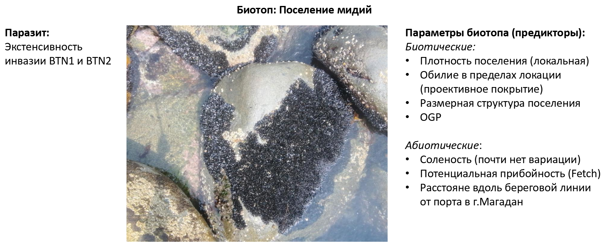

```{r setup, include=FALSE}
library(knitr)
opts_chunk$set(echo = FALSE, message = FALSE, warning = FALSE)
```


```{r}
library(readxl)
library(dplyr)
library(tidyr)
library(magrittr)
library(mgcv)
library(gratia)
library(ggplot2)
library(DHARMa)
```

```{r}
# Данные по индивидуальным характристикам мидий
myt_ind <- read_excel("Data/individual data_Magadan2023_inter2.xlsx", sheet = "clean_R", na = "NA")

myt_ind$Sample <- paste(myt_ind$Site_code, myt_ind$Sample, sep = "_")


# Удаляем идий, которые были использованы для анализа роста, но не анализировались с для определения BTN

myt_ind %<>%
  filter(!is.na(DN))

myt_ind$DN <- factor(myt_ind$DN)
myt_ind$Site_code <- factor(myt_ind$Site_code)
myt_ind$Sample <- factor(myt_ind$Sample)
myt_ind$Rate_of_aneuploid_cells <- as.numeric(myt_ind$Rate_of_aneuploid_cells)

myt_ind %<>%
  mutate(Prop_Increment = Increment/L) %>% 
  mutate(BTN_Type = case_when(BTN_genotype == "BTN1" ~ "BTN1",
                              BTN_genotype %in% c("BTN2.1", "BTN2.2") ~ "BTN2",
                              BTN_genotype == "healthy" ~ "healthy"))

myt_ind$BTN_Type <- factor(myt_ind$BTN_Type)


myt_ind %<>%
  mutate(Gonad_quality = case_when(Sex == "male" ~ "Developed",
                                   Sex == "female" ~ "Developed",
                                   Sex == "no gametes" ~ "No"))

myt_ind <-
  myt_ind %>% 
  filter(!is.na(BTN_Type))

myt_ind_clean <- 
  myt_ind %>%  
  filter(!is.na(BTN_Type)) %>% 
  filter(Sex != "hermaphrodite") %>% 
  filter(!is.na(Sex)) 


```


```{r}
points <- read_excel("Data/Magadan_2021_2023_ecology.xlsx", sheet = "Points  characteristic 2021-23", na = "NA")


points_2023 <- 
  points %>% 
  filter(Year == 2023) %>% 
  rename(Site_code = Site)

myt_ind_clean <- merge(myt_ind_clean, points_2023)


myt_ind_clean$Fi_Increment <- 2*asin(sqrt(myt_ind_clean$Prop_Increment)) * 180/pi

```


# Уровни существования BTN

## "Индивидуальный" уровень: отдельная мидия, как биотоп для паразита


## "Популяционный" уровень: Мидиевая банка, как биотоп для "популяционной групировки" паразита




# Индивидуальный уровень: Влияние зараженности BTN1 и BTN2 на продукцию гамет 


```{r}

table(myt_ind_clean$BTN_Type, myt_ind_clean$Gonad_quality) %>% 
  as.data.frame() %>% 
  ggplot(aes(x = Var1, y = Freq, fill = Var2)) + 
  geom_bar(stat="identity", width=1) +
  coord_polar("y", start=0) + 
  facet_wrap(~Var1, scales = "free_y") +
  theme_void() + 
  theme(legend.position="none")

```


# Индивидуальный уровень: Влияние зараженности BTN1 и BTN2 на продукцию гамет 

```{r}

myt_ind_clean_btn <-
  myt_ind_clean %>% 
  mutate(Out_gonad = ifelse(Gonad_quality == "No", 1, 0)) %>% 
  filter(BTN_Type != "healthy")

# names(myt_ind_clean_btn)

Mod_gonad_quality <- gam(Out_gonad ~ s(Rate_of_aneuploid_cells, by = BTN_Type) + BTN_Type + s(Sample, bs = "re"), family = "binomial", method = "REML", data = myt_ind_clean_btn)

summary(Mod_gonad_quality)

draw(Mod_gonad_quality, select = 1:2)

# simulateResiduals(Mod_gonad_quality, plot = TRUE)
```


# Индивидуальный уровень: Влияние зараженности на рост 

```{r}
Mod_tmb_prop_incr_btn <- gam(Fi_Increment ~ BTN_Type + s(Last_ring, by = BTN_Type, bs = "cr") + s(Sample, bs = "re"), data = myt_ind_clean)

myt_ind_clean_btn <- 
  myt_ind_clean %>% 
  filter(BTN_Type != "healthy")

Mod_prop_incr_btn <- gam(Fi_Increment ~ s(Last_ring, by = BTN_Type, bs = "cr") + s(Rate_of_aneuploid_cells, by = BTN_Type, bs = "cr") + s(Sample, bs = "re"), data = myt_ind_clean_btn)

summary(Mod_prop_incr_btn)

draw(Mod_prop_incr_btn, select = 3:4)

simulateResiduals(Mod_prop_incr_btn, plot = T)

```


# Популяционный уровень 