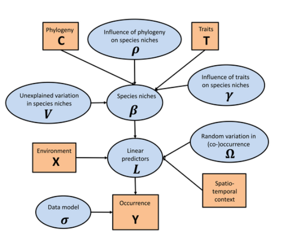

```{r setup, include=FALSE}
library(knitr)
opts_chunk$set(echo = FALSE, message = F, warning = F)

```


```{r}
library(officer)
```


In the absence of monitoring data (the monitoring system should be launched as the engineering structures are put into operation), two ways of searching for indicators of disturbance of benthic communities can be proposed. First, based on the study of already existing surveys of the areas that have already been impacted. Second, it is possible to model anthropogenic changes and consider the response of the "modeled" community to potential impacts. We realized the first way by analysisng of total benthic community biomass on stations envolved into previous surways. The second way was realized by so-called Joined Species Distribution Modelling approach.         


# Assessment of expected changes using existing data on community biomass


```{r}
# Packages ######################
library(ggmap)
library(mapproj)
library(maps)

library(rgeos) 

library(mapdata)
library(maptools) # Rgshhs
library(PBSmapping)

library(readxl)
library(dplyr)
library(cowplot)
library(mgcv)
library(reshape2)
library(ggplot2)
library(ggrepel)

library(png)

library(vegan)

library(broom)
library( broom.mixed)


library(ggvegan)
library(car)


theme_set(theme_bw())
```


```{r}

# Data reading ####################

Ob_df <- read.csv("Data/Obskaya_bay_map.csv") # Map poligones

# All Station position
stations <- read_excel("Data/Obskaya_bay_2020.xlsx", sheet = "Station parameters", na = "NA")

# Stations with biological samples
stat_full <- stations %>% filter(Exclude == 0)

stat_full <- as.data.frame(stat_full)

# Data on organic matter from the file "Содержание органического вещества в ДО.docx"

org <-  read.csv("Data/Organic matter_2020.csv")

org <- org[org$Station %in% stat_full$Station, ]

org <- org %>% select(Station, Org_Aug_20)


# Data on Granulmetric from the file "Грансостав ДО.docx"

granul <- read_excel("Data/Granulometry_2020.xlsx",  na = "NA")


granul$Small <- with(granul, F_0.002 + `F_0.01-0.002` + `F_0.05-0.01`)              

granul$Big <- rowSums(granul[ ,8:15]  )


granul$Season <- factor(granul$Season)


# Chlorophyll a 

chlor <- read_excel("Data/Obskaya_bay_2020.xlsx", sheet = "Chlorophyll august 2020", na = "NA")


# Biogenes

biogen <- read_excel("Data/Obskaya_bay_2020.xlsx", sheet = "Biogenes_August", na = "NA")

biogen_full <- biogen %>% filter(Exclude == 0) %>% select(-Exclude)

biogen_full_melt <- melt(biogen_full, id.vars = c("Station", "Layer"))

biogen_full_2 <- dcast(biogen_full_melt, Station ~ Layer + variable )


# Zooplancton

zoopl_long <- read_excel("Data/Obskaya_bay_2020.xlsx", sheet = "Zooplancton_long", na = "NA")

zoopl <- dcast(zoopl_long %>%select(-B), Station ~ Taxa) 

zoopl[is.na(zoopl)] <- 0

zoopl$Station_ID <- as.numeric(gsub("O","", zoopl$Station))

zoopl <- zoopl[order(zoopl$Station_ID), ] %>% select(-Station_ID)


# Ship activity and Sattelite data on suspended matter and distances to dumping

# ships <- read.table("Data/Stations_tsm_ships.shp.txt", header = T, sep = "\t")
# write.table(ships, "clipboard", sep = "\t")

ships <- read_excel("Data/Obskaya_bay_2020.xlsx", sheet = "Ship_activity")

ships <- ships %>% filter(Exclude != 1) %>% select(Station, Ships, Distance_Dump, Distance_to_Drag)

ships2 <- merge(stat_full %>% select(Station, Lat, Long), ships)

ships2$Station_ID <- as.numeric(gsub("O","", ships2$Station))

ships2 <- ships2[order(ships2$Station_ID), ] %>% select(-Station_ID)


# nrow(ships2)


# All chlorophyll
chlorophyll <- read_excel("Data/Obskaya_bay_2020.xlsx", sheet = "Chlorophyll august 2020")

# Suspensed matter

suspensed_metter_by_layers <- read_excel("Data/Obskaya_bay_2020.xlsx", sheet = "Suspensed matters August", na = "NA")

suspensed_metter_by_layers <- suspensed_metter_by_layers %>% filter(Exclude !=1) %>% select(-Exclude)  


# Phytoplancton Species

phytopl_long <- read_excel("Data/Obskaya_bay_2020.xlsx", sheet = "Phytoplancton Species long")


# Zoobenthos

bent <- read_excel("Data/Obskaya_bay_2020.xlsx", sheet = "Benthos")


bent_B <- bent %>% filter(Type == "Biomass") %>% select(-Type)

bent_N <- bent %>% filter(Type == "Abundance") %>% select(-Type)


```


```{r}
library(shapefiles)

chanel <- read.shp("Data/Канал.shp")

chanel_df <- chanel$shp[[1]]$points

```


```{r}

# Данные для карт ###############################################

# Coordinate limites 
# Ob_x <- c(71, 79)

Ob_x <- c(71, 75)
Ob_y <- c(70, 73.2)

# Sabetta
Sabetta_y <- 71.235220
Sabetta_x <- 72.126754

# Terminal

Terminal_y <- 71.010886
Terminal_x <- 73.793525


grid_data <- expand.grid(Lat = seq(from = 70.01, to =72.89, length.out = 100), Long =  seq(from = 71, to =75.2 , length.out = 100))


Pl_Obskaya_bay <- 
ggplot(Ob_df, aes(x=long, y=lat, group=group)) +
  geom_polygon(fill = "gray90", colour = "gray20") + 
  coord_map(xlim = Ob_x, ylim = Ob_y) + 
  theme_bw() +  
  theme(axis.title.x = element_blank(),  axis.title.y = element_blank(), plot.background = element_blank(), panel.border = element_blank(), panel.grid = element_blank()) + 
  theme(axis.text.x =element_blank(), axis.text.y= element_blank()) + 
  theme(axis.ticks = element_blank())  + 
  geom_point(aes(x = Terminal_x, y = Terminal_y), size = 3, shape = 22, fill = "yellow") 


Obskaya_bay_cover <-function(plt){
  plt <- plt + 
    geom_polygon(data = Ob_df, aes(x=long, y=lat, group=group), fill = "gray90", colour = "gray20") + 
    coord_map(xlim = Ob_x, ylim = Ob_y) + 
    theme_bw() +  
    theme(axis.title.x = element_blank(),  axis.title.y = element_blank(), plot.background = element_blank(), panel.border = element_blank(), panel.grid = element_blank()) + 
    theme(axis.text.x =element_blank(), axis.text.y= element_blank()) + 
    theme(axis.ticks = element_blank()) + 
    geom_point(aes(x = Terminal_x, y = Terminal_y), size = 3, shape = 22, fill = "yellow") +
    geom_point(data = stat_full, aes(x = Long, y = Lat, group = 1), size = 0.5) +
    theme(strip.background = element_blank())
  plt
}


```


```{r}
# Подготовка таблицы предикторов ####################################
predictors <- stat_full %>% select(Station, Lat, Long,  Depth_aug_20, Transparency_aug_20, Surface_Salinity_Aug_20, Bottom_Salinity_Aug_20, Surface_Turbidity_Aug_20, Bottom_Turbidity_Aug_20, Surface_Susp_Aug_20, Interm_Susp_Aug_20, Bottom_Susp_Aug_20)


chlor_surface <- chlor %>% filter(Layer == "Surface") %>% select(Station, Chla) %>% rename(Chla_surface = Chla)


chlor_intermed <- chlor %>% filter(Layer == "Intermediate") %>% select(Station, Chla) %>% rename(Chla_intermed = Chla)

chlor_bottom <- chlor %>% filter(Layer == "Bottom") %>% select(Station, Chla) %>% rename(Chla_bottom = Chla)


predictors2 <- merge(predictors, chlor_surface, all.x = T)

predictors3 <- merge(predictors2, chlor_intermed, all.x = T)

predictors4 <- merge(predictors3, chlor_bottom, all.x = T)


predictors5 <- merge(predictors4, org %>% select(Station, Org_Aug_20), all.x = T)


predictors6 <- merge(predictors5, granul %>% filter(Season == "August") %>% select(Station, Small, Big) %>% rename(Fine_particles = Small, Coarce_particles = Big), all.x =T)


predictors7 <- merge(predictors6, biogen_full_2, all.x = T)


# # All variables from intermediate layer will be excluded from analysis 
# 
# predictors8 <- predictors7 %>% select(-c(Interm_Susp_Aug_20, Chla_intermed, Intermediate_Color, Intermediate_O2, Intermediate_pH,  Intermediate_Amon_N, Intermediate_Nitrit_N, Intermediate_Nitrat_N, Intermediate_Total_N, Intermediate_Mineral_P, Intermediate_Toal_P, Intermediate_Si, Intermediate_Organic_N, Intermediate_Organic_P))

predictors8 <- merge(predictors7, ships2 %>% select(Station, Ships, Distance_Dump, Distance_to_Drag, ))

# nrow(ships2)
# Variable names cleaning

var_names <- names(predictors8)

var_names <- gsub("Bottom", "Bot", var_names)

var_names <- gsub("Surface", "Surf", var_names)

var_names <- gsub("Intermediate", "Int", var_names)

var_names <- gsub("_aug_20", "", var_names)

var_names <- gsub("_Aug_20", "", var_names)


names(predictors8) <- var_names

complete_stations <- nrow(predictors8[complete.cases(predictors8),])

NA_present <- predictors8 %>% summarise_all(funs(sum(is.na(.)))) %>% t() %>% as.data.frame()%>% mutate(Param = row.names(.))

library(imputeTS)
predictors9 <- na_mean(predictors8)

predictors9$Station_ID <- as.numeric(gsub("O","", predictors9$Station))

predictors10 <- predictors9[order(predictors9$Station_ID), ] %>% select(-Station_ID)

# nrow(predictors10)
```


```{r}
# Рабочая таблица по зоопланктону


biogen_full_wide <- dcast(biogen_full_melt, Station  ~ variable, mean)


zoopl_biogen <- merge(zoopl, biogen_full_wide, all.x = T)


suspensed_metter <- suspensed_metter_by_layers %>% group_by(Station) %>% summarise(Suspended_matter = mean(Suspended_matter , na.rm = T)) 

zoopl_biogen_susp <- merge(zoopl_biogen, suspensed_metter, all.x = T)


zoopl_biogen_susp_ship <- merge(zoopl_biogen_susp, ships, all.x = T)

zoopl_pred <- predictors10 %>% select(Station, Depth, Transparency, Surf_Salinity, Bot_Salinity, Surf_Turbidity, Bot_Turbidity)

zoopl_biogen_susp_ship_pred <- merge(zoopl_biogen_susp_ship, zoopl_pred, all.x = T)


zoopl_bio <- zoopl_biogen_susp_ship_pred %>% select(-c(Color, O2,pH, Amon_N, Nitrit_N, Nitrat_N, Total_N, Mineral_P, Total_P, Si, Organic_N, Organic_P, Suspended_matter, Ships, Distance_Dump, Distance_to_Drag, Depth, Transparency, Surf_Salinity, Bot_Salinity, Surf_Turbidity, Bot_Turbidity))


zoopl_env <- zoopl_biogen_susp_ship_pred %>% select(c(Station,  Color, O2,pH, Amon_N, Nitrit_N, Nitrat_N, Total_N, Mineral_P, Total_P, Si, Organic_N, Organic_P,  Depth, Transparency, Surf_Salinity, Bot_Salinity, Surf_Turbidity, Bot_Turbidity))

zoopl_techno <- zoopl_biogen_susp_ship_pred %>% select(Suspended_matter, Ships, Distance_Dump, Distance_to_Drag)

zoopl_coord <- merge(zoopl_env, stat_full %>% select(Station, Long, Lat), all.x = T) %>% select(Station, Long, Lat)


###################################################
# Рабочая таблица по фитопланктону
phytopl_long2 <- phytopl_long %>% select(-Taxa_2) %>% group_by(Station, Taxa_1) %>% summarize(N = mean(N, na.rm = T))


phytopl_wide <- dcast(phytopl_long2, Station  ~ Taxa_1, sum) 


biogen_full_wide <- dcast(biogen_full_melt, Station  ~ variable, mean)


phyt_biogen <- merge(phytopl_wide, biogen_full_wide, all.x = T)

# nrow(phyt_biogen)

suspensed_metter <- suspensed_metter_by_layers %>% group_by(Station) %>% summarise(Suspended_matter = mean(Suspended_matter , na.rm = T)) 

phyt_biogen_susp <- merge(phyt_biogen, suspensed_metter, all.x = T)


phyt_biogen_susp_ship <- merge(phyt_biogen_susp, ships, all.x = T)

phytopl_pred <- predictors10 %>% select(Station, Depth, Transparency, Surf_Salinity, Bot_Salinity, Surf_Turbidity, Bot_Turbidity)

phyt_biogen_susp_ship_pred <- merge(phyt_biogen_susp_ship, phytopl_pred, all.x = T)


phytopl_bio <- phyt_biogen_susp_ship_pred %>% select(-c(Color, O2,pH, Amon_N, Nitrit_N, Nitrat_N, Total_N, Mineral_P, Total_P, Si, Organic_N, Organic_P, Suspended_matter, Ships, Distance_Dump, Distance_to_Drag, Depth, Transparency, Surf_Salinity, Bot_Salinity, Surf_Turbidity, Bot_Turbidity))


phytopl_env <- phyt_biogen_susp_ship_pred %>% select(c(Station,  Color, O2,pH, Amon_N, Nitrit_N, Nitrat_N, Total_N, Mineral_P, Total_P, Si, Organic_N, Organic_P,  Depth, Transparency, Surf_Salinity, Bot_Salinity, Surf_Turbidity, Bot_Turbidity))

phytopl_techno <- phyt_biogen_susp_ship_pred %>% select(Suspended_matter, Ships, Distance_Dump, Distance_to_Drag)

phytopl_coord <- merge(phytopl_env, stat_full %>% select(Station, Long, Lat), all.x = T) %>% select(Station, Long, Lat)


###################################################
# Рабочая таблица по Бентосу


bent_biogen <- merge(bent_N, biogen_full_wide, all.x = T)

# nrow(phyt_biogen)

suspensed_metter <- suspensed_metter_by_layers %>% group_by(Station) %>% summarise(Suspended_matter = mean(Suspended_matter , na.rm = T)) 

bent_biogen_susp <- merge(bent_biogen, suspensed_metter, all.x = T)


bent_biogen_susp_ship <- merge(bent_biogen_susp, ships, all.x = T)

bent_pred <- predictors10 %>% select(Station, Depth, Transparency, Surf_Salinity, Bot_Salinity, Surf_Turbidity, Bot_Turbidity, Fine_particles, Coarce_particles)

bent_biogen_susp_ship_pred <- merge(bent_biogen_susp_ship, bent_pred, all.x = T)

bent_biogen_susp_ship_pred_org <- merge(bent_biogen_susp_ship_pred, org, all.x = T)
 

bent_bio <- bent_biogen_susp_ship_pred_org %>% select(-c(Color, O2,pH, Amon_N, Nitrit_N, Nitrat_N, Total_N, Mineral_P, Total_P, Si, Organic_N, Organic_P, Suspended_matter, Ships, Distance_Dump, Distance_to_Drag, Depth, Transparency, Surf_Salinity, Bot_Salinity, Surf_Turbidity, Bot_Turbidity, Fine_particles, Coarce_particles, Org_Aug_20))


bent_env <- bent_biogen_susp_ship_pred_org %>% select(c(Station,  Color, O2,pH, Amon_N, Nitrit_N, Nitrat_N, Total_N, Mineral_P, Total_P, Si, Organic_N, Organic_P,  Depth, Transparency, Surf_Salinity, Bot_Salinity, Surf_Turbidity, Bot_Turbidity, Fine_particles, Coarce_particles,  Org_Aug_20))

bent_techno <- bent_biogen_susp_ship_pred_org %>% select(Suspended_matter, Ships, Distance_Dump, Distance_to_Drag)

bent_coord <- merge(bent_env, stat_full %>% select(Station, Long, Lat), all.x = T) %>% select(Station, Long, Lat)

# nrow(bent_coord)

```


```{r}
total_B <- bent_B %>% mutate(Total_B = rowSums(.[,-1])) %>% select(Station, Total_B)

total_N <- bent_N %>%  mutate(Total_N = rowSums(.[,-1])) %>% select(Station, Total_N)


total_B <- merge(total_B, bent_coord) %>% mutate(Anomaly = case_when(Total_B > mean(Total_B) ~ "High", Total_B <= mean(Total_B) ~ "Low"))

total_N <- merge(total_N, bent_coord) %>% mutate(Anomaly = case_when(Total_N > mean(Total_N) ~ "High", Total_N <= mean(Total_N) ~ "Low"))

Pl_B <- Pl_Obskaya_bay + 
  geom_point(data = total_B, aes(x = Long, y = Lat, group = 1, size = (Total_B), fill = Anomaly), shape = 21) +
  scale_fill_manual(values = c("red", "gray")) + 
  labs(size = "Биомасса \n(г/кв.м)") +
  guides(fill = "none")

Pl_N <- Pl_Obskaya_bay + 
  geom_point(data = total_N, aes(x = Long, y = Lat, group = 1, size = (Total_N), fill = Anomaly), shape = 21) +
  scale_fill_manual(values = c("red", "gray")) + 
  labs(size = "Плотность \n(экз./кв.м)") +
  guides(fill = "none")


```


```{r}


Spec_abund <- bent_N %>% select(-Station) %>% colSums(.) %>% t() %>% as.vector() 

spec_total_abund <- data.frame(Sp = bent_bio %>% select(-Station) %>% colnames(), Spec_abund)

N_porog <- 500 

spec_selected <- spec_total_abund %>% filter(Spec_abund > N_porog)

bent_bio_short <- bent_bio %>% select(spec_selected$Sp)


```


```{r message=FALSE, warning=FALSE}

total_B_N <- merge(total_N %>% select(-Anomaly), total_B %>% select(-Anomaly))

library(mixtools)

x <- log(total_B_N$Total_B)
model <- normalmixEM(x=x, verb = F)


index.lower <- which.min(model$mu)  # Index of component with lower mean


find.cutoff <- function(proba=0.5, i=index.lower) {
  ## Cutoff such that Pr[drawn from bad component] == proba
  f <- function(x) {
    proba - (model$lambda[i]*dnorm(x, model$mu[i], model$sigma[i]) /
               (model$lambda[1]*dnorm(x, model$mu[1], model$sigma[1]) + model$lambda[2]*dnorm(x, model$mu[2], model$sigma[2])))
  }
  return(uniroot(f=f, lower=-1, upper=10)$root)  # Careful with division by zero if changing lower and upper
}


# Предсказанная моделью граница двух распределений
cutoffs <- c(find.cutoff(proba=0.25))  # Around c(1.8, 1.5)


n1 = round(length(x) * model$lambda[1])
mean1 = model$mu[1]
sd1 = model$sigma[1]

binwidth = 0.5 # passed to geom_histogram and stat_function

n2 = round(length(x) * model$lambda[2])
mean2 = model$mu[2]
sd2 = model$sigma[2]

Pl_B_distr <- 
ggplot(total_B_N, aes(x = log(Total_B) )) + geom_histogram( binwidth = binwidth, fill = "gray", color = "black") +  stat_function(fun = function(x) dnorm(x, mean = mean1, sd = sd1) * n1 * binwidth, color = "darkred", size = 1) + stat_function(fun = function(x) dnorm(x, mean = mean2, sd = sd2) * n2 * binwidth, color = "darkred", size = 1)  + xlim(-2.5, 7) + geom_vline(xintercept = cutoffs)
  
  
  
  
```


One of the most obvious signs of disturbed habitat is the low abundance of organisms in the community compared to undisturbed areas. The most adequate assessment of abundance would be to describe their production characteristics. In a disturbed community, production should be low. Therefore, it is reasonable to use total biomass of organisms as an indicator approximating the productive characteristics of the community. The Figure ++ shows the frequency distribution of the values of the logarithm of the total biomass of all bottom animals at the station. The distribution of this value has a clear bimodal character. Using an algorithm based on splitting mixed distributions into separate populations (Bengalia et al., 2009)^[Benaglia, T., Chauveau, D., Hunter, D. R., and Young, D. mixtools: An R package for analyzing finite mixture models. Journal of Statistical Software, 32(6):1-29, 2009.], the empirical distribution was approximated by the set of two normal distributions. The parameters of the two approximating distributions selected by the algorithm are as follows: $\mu_1=$ `r round(mean1, 3)`, $\sigma_1=$ `r round(sd1,3)`, $\mu_2=$ `r round(mean2, 3)`, $\sigma_2=$ `r round(sd2,3)`.  


The left peak corresponds to communities with a biomass significantly lower than the biomass of the background biocenotic cover. Presumably, these are stations located in disturbed habitats. If we take the boundary of the third quartile of the approximating distribution ($log(B_{Total})=$ `r cutoffs`) as the threshold for assigning a station to the left peak, communities in which the total biomass is less than `r round(exp(cutoffs), 1)` g/m^2^) can be conventionally considered disturbed. In fact, this is a conditional boundary and for some natural communities in a given water area, this value may be within the normal range.    


```{r fig.cap= "Fig. ++. Distribution of total benthos biomass at stations. Approximating normal distributions are given. The vertical line passes through the third quartile of the left peak."}

Pl_B_distr + geom_text(aes(x = -0.8, y = 12, label = "Potentially \ndisturbed \ncommunities")) + labs(x = "Logarithm of Total Biomass ", y = "Number of stations")

```


```{r}
total_B_N <- total_B_N %>% mutate(Type_ = ifelse(log(Total_B) <= cutoffs, "Disturbed", "Native"))

disturbed <- total_B_N %>% filter(Type_ == "Disturbed")

Tambey_y = 71.474355
Tambey_x = 71.813562

Seyakha_y = 70.160113
Seyakha_x = 72.533310

Pl_disturbed <-   
Pl_Obskaya_bay + 
  geom_point(data = total_B_N %>% filter(Type_ == "Disturbed"), aes(x = Long, y = Lat, group = 1), size = 2, color = "red") +
  geom_point(aes(x = Sabetta_x, y = Sabetta_y, group = 1), size = 3, shape = 22, fill = "blue") + 
  geom_text(aes(x = Sabetta_x - 0.7, y = Sabetta_y, label = "Sabetta", group = 1), color = "black") + 
  geom_point(aes(x = Terminal_x, y = Terminal_y, group = 1), size = 3, shape = 22, fill = "blue") +
  geom_text(aes(x = Terminal_x + 0.7, y = Terminal_y, label = "Utrenny", group = 1), color = "black") +
  geom_polygon(data = chanel_df, aes(x = X, y = Y, group = 1), color = "black",  fill = "black")


```


The stations that form the left peak in the distribution include stations as follows: `r disturbed$Station`. We can notice that most of the stations from this group are in the zone of technogenic impact (Fig. ++).


```{r fig.cap="Fig. ++. Stations with abnormally low total benthos biomass"}

Pl_disturbed
```


```{r}

bent_env2 <- merge(bent_env, total_B_N, by = "Station")
bent_bio2 <- cbind(bent_bio_short, total_B_N %>% select(Station, Type_))

Mod_cca <- cca(log(bent_bio_short + 1) ~ Type_ + Bot_Salinity, data = bent_env2)


# summary(Mod_cca)

```


Indicator species of disturbance can be understood as such forms whose relative abundance turns out to be rather high in disturbed communities. In order to distinguish such species objectively, we calculated a model of zoobenthos species ordination in the axes of canonical correspondent analysis (Fig. ++) in which benthic salinity (*Bot_Salinity*) and station type (*Type*) acted as predictors. The factor was *Bot_Salinity* supposed to differentiate communities associated with marine and desalinated water masses. The categorical predictor *Type* had two gradations: *Disturbed* for stations whose total biomass values formed the leftmost peak and *Native* for stations with biomass values falling within the rightmost peak of the distribution.   

The two canonical axes were statistically significant. The first canonical axis was related to salinity. The position of centroids of factor *Type* allows to interpret the second canonical axis characterizing division of stations according to division into peaks in distribution of total biomass. 

The centroid corresponding to the *Disturbed* group occupies a position in the first quadrant of the ordination. Accordingly, the species represented on the ordination that fall into this quadrant can be classified with high probability as indicators of anomalously low biomass. Such forms include polychaetes *Marenzelleria* spp., sipunculids, and isopods *Saduria entomon*. Where these species are sufficiently abundant, the presence of disturbances can be expected. All three species show maximum abundances at sites associated with potential sources of anthropogenic impact (Fig. ++). Two species falling in the second quadrant of the ordination (*Portlandia aestuariorum*, *Diastylis sulcata*) can be classified as indicators only conditionally since they are located far enough from the centroid *Disturbed* on the ordination.  


Thus the increase of abundance of three revealed indicator cpecies could be considered as a signal of some disturbance leading to total biomass decreasing. 

```{r fig.cap="Fig. ++. Ordination of species in canonical correspondent axes."}

plot(Mod_cca, display = c("cn", "species"), type = "t", scaling = "symmetric")

```


```{r}
Pl_Merenc <-
Pl_Obskaya_bay + geom_point(data = bent_env2, aes(x = Long, y = Lat, size = bent_bio2$Marenzelleria_sp., group = 1, color = log(bent_bio2$Marenzelleria_sp.+1) ) ) + 
  scale_color_gradient(low = "white", high = "black") + 
  guides(color = "none") + labs(size ="") + ggtitle("Marenzelleria spp.") +
  geom_point(aes(x = Sabetta_x, y = Sabetta_y, group = 1), shape = 22, fill = "blue") + 
  geom_point(aes(x = Terminal_x, y = Terminal_y, group = 1), shape = 22, fill = "blue") +
  geom_polygon(data = chanel_df, aes(x = X, y = Y), fill = "black", group = 1) + 
  theme(plot.title = element_text(size=10))


Pl_Sipunc <-
Pl_Obskaya_bay + geom_point(data = bent_env2, aes(x = Long, y = Lat, size = bent_bio2$Sipunculidea_gen._sp., group = 1, color = log(bent_bio2$Sipunculidea_gen._sp.+1) ) ) + scale_color_gradient(low = "white", high = "black") + guides(color = "none") + labs(size ="") + ggtitle("Sipunculida gen. sp.") +geom_point(aes(x = Sabetta_x, y = Sabetta_y), shape = 22, fill = "blue") +   geom_point(aes(x = Sabetta_x, y = Sabetta_y, group = 1), shape = 22, fill = "blue") + 
  geom_point(aes(x = Terminal_x, y = Terminal_y, group = 1), shape = 22, fill = "blue") +
  geom_polygon(data = chanel_df, aes(x = X, y = Y), fill = "black", group = 1)+ 
  theme(plot.title = element_text(size=10))


Pl_Sadur <-
Pl_Obskaya_bay + geom_point(data = bent_env2, aes(x = Long, y = Lat, size = bent_bio2$Saduria_entomon, group = 1, color = log(bent_bio2$Saduria_entomon +1) ) ) + scale_color_gradient(low = "white", high = "black") + guides(color = "none") + labs(size ="") + ggtitle("S. entomon") + geom_point(aes(x = Sabetta_x, y = Sabetta_y), shape = 22, fill = "blue") + 
  geom_point(aes(x = Sabetta_x, y = Sabetta_y, group = 1), shape = 22, fill = "blue") + 
  geom_point(aes(x = Terminal_x, y = Terminal_y, group = 1), shape = 22, fill = "blue") +
  geom_polygon(data = chanel_df, aes(x = X, y = Y), fill = "black", group = 1) + 
  theme(plot.title = element_text(size=10))

Pl_Port <-
Pl_Obskaya_bay + geom_point(data = bent_env2, aes(x = Long, y = Lat, size = bent_bio2$Portlandia_aestuariorum, group = 1, color = log(bent_bio2$Portlandia_aestuariorum +1) ) ) + scale_color_gradient(low = "white", high = "black") + guides(color = "none") + labs(size ="") + ggtitle("P. aestuariorum") + geom_point(aes(x = Sabetta_x, y = Sabetta_y), shape = 22, fill = "blue") +   geom_point(aes(x = Sabetta_x, y = Sabetta_y, group = 1), shape = 22, fill = "blue") + 
  geom_point(aes(x = Terminal_x, y = Terminal_y, group = 1), shape = 22, fill = "blue") +
  geom_polygon(data = chanel_df, aes(x = X, y = Y), fill = "black", group = 1)+ 
  theme(plot.title = element_text(size=10))

Pl_Diast <-
Pl_Obskaya_bay + geom_point(data = bent_env2, aes(x = Long, y = Lat, size = bent_bio2$Diastylis_sulcata, group = 1, color = log(bent_bio2$Diastylis_sulcata +1) ) ) + scale_color_gradient(low = "white", high = "black") + guides(color = "none") + labs(size ="") + ggtitle("D. sulcata") + geom_point(aes(x = Sabetta_x, y = Sabetta_y), shape = 22, fill = "blue") +   geom_point(aes(x = Sabetta_x, y = Sabetta_y, group = 1), shape = 22, fill = "blue") + 
  geom_point(aes(x = Terminal_x, y = Terminal_y, group = 1), shape = 22, fill = "blue") +
  geom_polygon(data = chanel_df, aes(x = X, y = Y), fill = "black", group = 1) + 
  theme(plot.title = element_text(size=10))


```


```{r fig.cap="Fig. ++. Stations where potential indicators of community disturbance were found. The size of the dots and the intensity of the fill are proportional to the number of species at the station. Stations with zero species abundance values are not shown."}

library(patchwork)

(Pl_Merenc + Pl_Sipunc + Pl_Sadur) / (Pl_Port + Pl_Diast) 
```

# Assessment of expected changes using Joint Species Distribution Modelling

Substantial changes in the hydrological characteristics associated with the construction of structures can have a noticeable impact not only on habitats directly associated with  the area of impact, but also on remote habitats. In the practice of ecological monitoring, areas remote from areas of direct anthropogenic influence are often outside the focus of monitoring programs. Therefore, the spatial pattern of changes may be underestimate. At the same time, the trends detected in the analysis of relatively small areas may provide reliable information to extrapolate these trends to larger areas. This problem can be solved by modeling the behavior of biosystems. 


In the case of communities, i.e. systems consisting of a large number of species interacting not only with environmental parameters but also with each other, the concept of Joint Species Distribution Modelling (JSDM, Fig. ++) is a powerful tool for the modeling and prediction. The core of this approach comes down to that when modeling relationships between community and environmental parameters, we take into account not only the response of each individual species, but also the relationships between community members. The spatial particularities of sampling design (presence of random clustering factors and/or factors generating spatial or temporal autocorrelations) are also taking into account when applying JSDM. Potentially, phylogenetic and functional characteristics of species can also be taken into account within the JSDM framework.





This approach allow to build a model describing the construction of the community under given conditions and then calculate the parameters of the "predicted" community for a new combination of environmental parameters. This approach has been successfully applied to ornithological and geobotanical material (Ovaskainen, Abrego, 2020)^[Ovaskainen, O., & Abrego, N. (2020). Joint Species Distribution Modelling. In Joint Species Distribution Modelling: With Applications in R (Ecology, Biodiversity and Conservation, p. I). Cambridge: Cambridge University Press.] and has also been successfully tested in studies of freshwater macrobenthos (Shitikov, Zinchenko and Golovotyuk, 2021)^[Шитиков, В. К., Зинченко, Т. Д., & Головатюк, Л. В. (2021). Модели совместного распределения видов на примере донных сообществ малых рек волжского бассейна. Журнал общей биологии, 82(2), 143-154.] and marine fish communities (Roberts, Halpin and Clark, 2022)^[Roberts, S. M., Halpin, P. N., & Clark, J. S. (2022). Jointly modeling marine species to inform the effects of environmental change on an ecological community in the Northwest Atlantic. Scientific reports, 12(1), 1-12.]. 


Large-scale building of various engineering constructions is setting up in the Gulf of Ob. This can potentially change the hydrological regime of the entire water area. The most sensitive biological systems under impact are benthic communities. They will experience both direct impact in the sites of constructions and may response in remote areas due to changes in the bottom topography followed by changes in current velocity, new scheme of water mass movements etc. 


Hydrophysical consequences of engineering activities changing the bottom relief can be reliably predicted and modeled. This allowed to develop the **INMOM** model which give a possibility to predict the hydrological regime of the Gulf of Ob under two scenarios: "*Native*" (hydrological conditions in the area before engineering) and "*Constructed*" (conditions predicted after constructions builded). The response of benthic communities is not so unambiguously related to hydrophysical conditions and requires special analysis using JSDM. The later being applied to hydrobiological data will enable to answer some questions.

1. How much will the benthic communities change with the implementation of the engineering plans?

2. Which areas of the water area are expected to experience the greatest changes?

3. Which species of hydrobionts are expected to reveal  the greatest changes in abundance after engineering plans realization?


The benthic communities were modeled according to the following algorithm.


1. Using the functions from the "Hmsc" package (Tikhonov, Ovaskainen,Oksanen, 2021)^[Tikhonov, G., Opedal, Ø. H., Abrego, N., Lehikoinen, A., de Jonge, M. M., Oksanen, J., & Ovaskainen, O. (2020). Joint species distribution modelling with the R‐package Hmsc. Methods in ecology and evolution, 11(3), 442-447.], we built a model describing the relationship between the benthos community structure and the hydrological characteristics under "Native" scenario (i.e. without hydrotechnical works). The matrix of species abundances was used as dependent matrix (values were subjected to $ln(N+1)$ transformation). Hydrological parameters predicted by the **INMOM** model, were included as predictors in the model. Three relatively independent (non-collinear) characteristics were used to train the model: salinity, modulus of the zonal current velocity component, and modulus of the meridian current velocity component. The values of the above parameters were predicted by the **INMOM** model for each day of the calendar year. Further, all values were averaged. 

When building the model, the relationship with salinity was described by a second degree polynom whereas the relationship with flow velocities was assessed by  linear functions. 

Since the spatial arrangement of sampling stations can potentially cause autocorrelations of response variables, the geographic coordinates of sampling points were included in the model as a random factor. 


2. Using the **INMOM**, predictor's values were obtained for each calendar day accordingly to the "Constructed" scenario, i.e. after engineering  works. Analogously to the previous step the matrix of predictor's values was obtained after averaging of daily data.

3. Using the model coefficients estimated in step 1, a matrix characterizing the "predicted" community under the "Constructed" scenario was constructed. 

4. Using the data on species biomass, the mean weights of individuals for each species were calculated. Using this data the total benthic biomass predicted by the model for two regimes were calculated for each station. 


5. To assess the degree of difference between the total biomass of communities under  the "Native" and "Constructed" scenario, the value $Dif$ was calculated as follow. 


$$
Dif = ln(\frac{B_{Constructed}}{B_{Native}})
$$ 

Positive values of this value indicate some increase in total biomass after engineering, whereas negative ones indicate a decrease. 


```{r}
library(readxl)
library(ggplot2)
library(dplyr)
library(lubridate)

library(ggmap)
library(mapproj)
library(maps)

library(rgeos) 

library(mapdata)
library(maptools) # Rgshhs
library(PBSmapping)
library(cowplot)
library(mgcv)
library(ggrepel)
library(png)
library(broom)

theme_set(theme_bw())

predictors <- read.csv("data/Bottom_salinity_and_curents_from_model.csv")


predictors_No <- predictors %>% filter(Scenario == "No") %>% select(Station, Long, Lat, Depth, Month, Sal_predicted, Cur_Zon_predicted, Cur_Mer_predicted)


predictors_Constructed <- predictors %>% filter(Scenario == "Constructed") %>% select(Station, Long, Lat, Depth, Month, Sal_predicted, Cur_Zon_predicted, Cur_Mer_predicted)


mean_predictors_No <- predictors_No %>% group_by(Station) %>% summarise( Long = mean(Long), Lat= mean(Lat), Sal = mean(Sal_predicted), Cur_Zon = mean(abs(Cur_Zon_predicted) ), Cur_Mer = mean(abs(Cur_Mer_predicted)), Prop_Sal_anomalia = mean(Sal_predicted > mean(Sal_predicted)), Prop_Sal_5 = mean(Sal_predicted > 5))


mean_predictors_No <- mean_predictors_No %>% filter(complete.cases(.))


mean_predictors_Constructed <- predictors_Constructed %>% group_by(Station) %>% summarise( Long = mean(Long), Lat= mean(Lat), Sal = mean(Sal_predicted), Cur_Zon = mean(abs(Cur_Zon_predicted) ), Cur_Mer = mean(abs(Cur_Mer_predicted)), Prop_Sal_anomalia = mean(Sal_predicted > mean(Sal_predicted)), Prop_Sal_5 = mean(Sal_predicted > 5))


mean_predictors_Constructed <- mean_predictors_Constructed %>% filter(complete.cases(.))


# Data on benthic communities ######
bent <- read_excel("Data/Obskaya_bay_2020.xlsx", sheet = "Benthos")


bent_B <- bent %>% filter(Type == "Biomass") %>% select(-Type)

bent_N <- bent %>% filter(Type == "Abundance") %>% select(-Type)


Spec_abund <- bent_N %>% select(-Station) %>% colSums(.) %>% t() %>% as.vector() 

spec_total_abund <- data.frame(Sp = bent_N %>% select(-Station) %>% colnames(), Spec_abund)

N_porog <- 0 

spec_selected <- spec_total_abund %>% filter(Spec_abund > N_porog)

bent_short <- bent_N %>% select(Station, spec_selected$Sp)
bent_B <- bent_B %>% select(Station, spec_selected$Sp)


bent_short <-
  bent_short %>% mutate(Oligochaeta = Oligochaeta_gen._sp. + Oligochaeta_gen._spp.) %>% 
  select(-c(Oligochaeta_gen._sp., Oligochaeta_gen._spp., Oligochaeta_gen._sp._cocons,Senecella_siberica) )

bent_B <-
  bent_B %>% mutate(Oligochaeta = Oligochaeta_gen._sp. + Oligochaeta_gen._spp.) %>% 
  select(-c(Oligochaeta_gen._sp., Oligochaeta_gen._spp., Oligochaeta_gen._sp._cocons,Senecella_siberica) )


mean_weight <- (bent_B %>% select(-Station) %>% colSums()) / (bent_short %>% select(-Station) %>% colSums()) 


stations <- read_excel("Data/Obskaya_bay_2020.xlsx", sheet = "Station parameters", na = "NA")

# Stations with biological samples
stat_full <- stations %>% filter(Exclude == 0)

stat_full <- as.data.frame(stat_full)


### Данные для модели ######


# Убираем станции с отсутствующими оценками предикторов

bent_short <- bent_short %>% filter(Station %in% mean_predictors_No$Station)


bent_short <- bent_short %>% select(-Station)

bent_short <- bent_short[, colSums(bent_short) > 0]


stat_full <- stat_full %>% filter(Station %in% mean_predictors_No$Station)


mean_weight <- mean_weight[names(mean_weight) %in% names(bent_short)] 


n <- nrow(bent_short) # Число станций 
ns <- ncol(bent_short) #Число видов


xycoords <- mean_predictors_No %>% select(Station, Long, Lat) %>% select(-Station) %>% as.matrix(.)

colnames(xycoords) = c("x-coordinate","y-coordinate")
rownames(xycoords) = 1:n


Ydata <- bent_short  %>% round(., 0) %>% as.matrix(.)
colnames(Ydata) <- names(bent_short)
rownames(Ydata) = 1:n

Ydata <- log(Ydata + 1)


Xdata_No <- mean_predictors_No %>% select(Sal, Cur_Zon, Cur_Mer, Prop_Sal_anomalia, Prop_Sal_5) 

colnames(Xdata_No) <- c("Sal", "Cur_Zon", "Cur_Mer", "Prop_Sal_anomalia", "Prop_Sal_5")


Xdata_Constructed <- mean_predictors_Constructed %>% select(Sal, Cur_Zon, Cur_Mer, Prop_Sal_anomalia, Prop_Sal_5) 

colnames(Xdata_Constructed) <- c("Sal", "Cur_Zon", "Cur_Mer", "Prop_Sal_anomalia", "Prop_Sal_5")


```


```{r}

# set.seed(123456)
library(Hmsc)

load( "m.spatial_No_new.RData")


X_new <- as.matrix(data.frame(intercept = 1, Sal = Xdata_No$Sal, Sal2 = Xdata_No$Sal^2, Xdata_No$Cur_Zon, Xdata_No$Cur_Mer))

Predicted_No <- predict(m.spatial, X = X_new, expected = TRUE)


Predicted_No_mean <- Reduce("+", Predicted_No) / length(Predicted_No)

Predicted_No_mean <- round(exp(Predicted_No_mean) -1, 0)
Predicted_No_mean <- as.data.frame(Predicted_No_mean)

Predicted_No_mean_B <- Predicted_No_mean * mean_weight


# Новые значения для предсказания для сценария, когда есть конструкции 
X_new <- as.matrix(data.frame(intercept = 1, Sal = Xdata_Constructed$Sal, Sal2 = Xdata_Constructed$Sal^2, Xdata_Constructed$Cur_Zon, Xdata_Constructed$Cur_Mer))

Predicted_Constr <- predict(m.spatial, X = X_new, expected = TRUE)


Predicted_Constr_mean <- Reduce("+", Predicted_Constr) / length(Predicted_Constr)

Predicted_Constr_mean <- round(exp(Predicted_Constr_mean) -1, 0)
Predicted_Constr_mean <- as.data.frame(Predicted_Constr_mean)

Predicted_Constr_mean_B <- Predicted_Constr_mean * mean_weight

```

```{r}
library(vegan)

H_No <- rowSums(Predicted_No_mean_B)

H_Constructed <- rowSums(Predicted_Constr_mean_B)


# H_No <- diversity(Predicted_No_mean)
# 
# H_Constructed <- diversity(Predicted_Constr_mean)


H <- data.frame(Station = stat_full$Station , Lat = xycoords[,2], Long = xycoords[,1], H_No = round(H_No, 4), H_Constructed =  round(H_Constructed, 4))

H$Dif_H <- with(H, round(log(H_Constructed/H_No), 4))

H <- H %>%  mutate(Dif_class = case_when(round(Dif_H, 4) >  0 ~ "Increase",
                                         round(Dif_H, 4) ==  0 ~ "Stable",
                                         round(Dif_H, 4) < 0  ~ "Decrease"))


```


```{r}
Ob_df <- read.csv("Data/Obskaya_bay_map.csv") # Map poligones


# Coordinate limites 
# Ob_x <- c(71, 79)

Ob_x <- c(71, 75.2)
Ob_y <- c(70, 73.2)


# Sabetta
Sabetta_y <- 71.235220
Sabetta_x <- 72.126754

# Terminal

Terminal_y <- 71.010886
Terminal_x <- 73.793525


my_data <- expand.grid(Lat = seq(from = 70.8, to = 72.8 , length.out = 200), Long =  seq(from = Ob_x[1], to =Ob_x[2] , length.out = 200))


H$Decrewase <- ifelse(H$Dif_H < 0, 1, 0)


Mod_Dif_H <- gam(Decrewase ~ s(Long, Lat, bs = "tp"), data = H, family = "binomial")


# plot(Mod_Dif_H)

my_data$Dif_predicted <- predict(Mod_Dif_H, newdata = my_data, type = "response")

# quantiles <- quantile(H$Dif_H, probs = c(0.25, 0.75))

# my_data <- my_data %>% mutate(Dif_class = case_when(Dif_predicted > quantiles[2] ~ "Increase",
#                                          Dif_predicted <= quantiles[2] & Dif_predicted >= quantiles[1] ~ "Stable",
#                                          Dif_predicted < quantiles[1] ~ "Decrease"))

# 
# my_data <- my_data %>% mutate(Dif_class = case_when(round(Dif_predicted, 4) >=  0 ~ "Increase",
#                                                     round(Dif_predicted, 4) < 0  ~ "Decrease"))


# my_data$Dif_class <- ifelse(my_data$Dif_predicted >= 0, "Increase", "Decrease")

# unique(my_data$Dif_class)

```


```{r}
total_B_observed_predicted <-
rbind(data.frame(B = total_B_N$Total_B, Type = "Observed"),
data.frame(B = H$H_No, Type = "Predicted 'Native' scenario"), 
data.frame(B = H$H_Constructed, Type = "Predited 'Constructed' scenario"))

Pl_Total_B_boxplot <- 
  ggplot(total_B_observed_predicted, aes(x = Type, y = log(B) )) + 
  geom_boxplot() + 
  labs(x = "Type of community", y = "Logarithm of total biomass")
```

The  "predicted" community evaluated using JSDM possess characteristics very similar to observed community. The range of total biomass and its median in observed community (inital data for benthic stations) was rather similar to the same characteristics for "predicted" community (Fig. ++).  Thus the model constructed by JSDM produce rather realistic reconsruction of benthic communities.

```{r fig.cap= "Fig. ++. Total biomass in observed and predicted by JSDM community."}

Pl_Total_B_boxplot

```


In general, no significant changes in the communities under different hydrological regimes was detected. However, accordingly to model predictions, before engineering, average total biomass is `r round(mean(H$H_No), 4)` g/m^2^, but after works the total biomass is expected to decrease slightly to  `r round(mean(H$H_Constructed), 4)` g/m^2^. Thus, compared to the "Native" mode, the "Constructed" one is expected to reduce the total biomass by `r round(abs((mean(H$H_Constructed) - mean(H$H_No))/mean(H$H_No)*100), 2)`%.  


All stations, according to $Dif$ value, can be divided into three groups (Table ++ ; Fig. +++):    
- stations with expected biomass decrease, they have negative value of $Dif$ value;   
- stations with expected benthos biomass increase (positive values of $Dif$ value);   
- stations where no change is expected ($Dif = 0$). 

The proportion of stations in the first group is `r round(mean(H$Dif_H < 0) * 100, 1)`%. The proportion of stations predicted to increase biomass is slightly smaller and is `r round(mean(H$Dif_H > 0) * 100, 1)`%. Most stations (`r round(mean(H$Dif_H == 0) * 100, 1)`%) fall into the third group. Thus, there will be no significant changes in most of the area under the two hydrological regimes. 


```{r}

H <- H %>% mutate(Prop_changes = round((H_Constructed - H_No)/H_No*100, 2) ) %>% select(Station, Lat, Long, H_No, H_Constructed, Dif_H, Prop_changes, Dif_class) 


kable(H, col.names = c("Station", "Lat", "Long", "$B_{Native}$", "$B_{Constructed}$", "Dif", "Proportion of chages (%)", "Direction of changes"),caption = "Table +. Predicted total macrobenthos biomass (g/m^2^) at each station under two hydrological scenarios and expected direction of changes when engineering would be perfomed. Proportion of changes are given in comparison of $B_{Constructed}$ with $B_{Native}$" ) 
```


As it was shown in previous works^["Комплексные исследованиЯ экологического состояния Обской губы в зоне потенциального воздействия Проекта «Арктик СПГ 2» и на смежной акватории. Итоговый отчет по договору № 488-ALNG2-2020 от «17» июля 2020 г. Москва, 2021] benthic communities of the Ob Bay form well expressed gradient, associated with salinity. Conditionally this gradient can be devided into three categories: Fresh water  (salinity lesser 5 PPM), intermediate (5-20 PPM) and marine (more 20 PPM) habitats. It could be seen (Fig. ++) that median $Dif$ values are approximatelly equal to zero for all groups of stations. However, the obvious pattern in dispersion could be revealed: the $Dif$ values are more variable in marine water mass. This is an evidence of more expressed sensitivity of marine communities to expected antropogenic impacts.       

```{r fig.cap = "Fig. ++. Boxplots reflecting the variation in Dif values for communities existing in different salinity."}

stat_full %>% select(Station, Bottom_Salinity_Aug_20) %>% merge(H) %>% mutate(Sal_class = case_when(
  Bottom_Salinity_Aug_20 <= 5 ~ "Fresh water",
  Bottom_Salinity_Aug_20 >5 & Bottom_Salinity_Aug_20 <20 ~ "Intermediate water",
  Bottom_Salinity_Aug_20 >= 20 ~ "Marine water"
)) %>% 
  ggplot(., aes(x = Sal_class, y = Dif_H)) + geom_boxplot() + labs(x = "Water mass", y = "Dif value")

```


```{r fig.cap="Fig. ++. Direction of total biomass changes at different stations"}

ggplot(H, aes(x = Long, y = Lat)) +
     geom_polygon(data = Ob_df, aes(x=long, y=lat, group=group), fill = "gray90", colour = "gray20") +
  geom_point(aes(fill = Dif_class), shape = 21, size = 3) +
  scale_fill_manual(values = c("red", "yellow", "gray"))+
  labs(fill = "Changes direction") +
  geom_point(aes(x = Sabetta_x, y = Sabetta_y), size = 3, shape = 22, fill = "blue") + 
  geom_text(aes(x = Sabetta_x - 0.7, y = Sabetta_y, label = "Sabetta")) + 
  geom_point(aes(x = Terminal_x, y = Terminal_y), size = 3, shape = 22, fill = "blue") +
  geom_text(aes(x = Terminal_x + 0.7, y = Terminal_y, label = "Utrenny")) 
```


```{r}


Native_df <- read.csv("Data/no_construction_raster.csv")

library(Hmsc)

load( "m.spatial_No_new.RData")


X_new <- as.matrix(data.frame(intercept = 1, Sal = Native_df$Sal, Sal2 = Native_df$Sal^2, Cur_Zon = Native_df$Uucn, Cur_Mer = Native_df$Vucn ))


# Предсказанное сообщество  до строительства #####################

betas <- getPostEstimate(m.spatial, parName = "Beta")

betas <- betas$mean


predicted_community <- round((exp(X_new %*% betas) - 1), 2)


                    
predicted_community[predicted_community < 0] <- 0

predicted_community_Native <- predicted_community 

predicted_B <- rowSums(predicted_community_Native * mean_weight) 


predicted_B_df_Native <- data.frame(x = Native_df$x, y = Native_df$y, B_total = predicted_B, Sal = Native_df$Sal, Cur_Zon = Native_df$Uucn, Cur_Mer = Native_df$Vucn )


mod_raster <- gam(log(B_total) ~ s(x, y), data = predicted_B_df_Native)


predicted_B_df_Native$Smooth_B_total <- predict(mod_raster)


Pl_B_total_Native <- 
ggplot(predicted_B_df_Native, aes(x, y, color = exp(Smooth_B_total) ) ) + geom_point() + scale_color_gradient(low = "yellow", high = "red") + ggtitle("Native")  + labs(x = "Lon", y = "Lat", color = "Total Biomass") + geom_polygon(data = Ob_df, aes(x=long, y=lat, group=group), fill = "gray90", colour = "gray20")


Pl_Sal_Native <- 
ggplot(predicted_B_df_Native, aes(x, y, color = Sal) ) + geom_point() + scale_color_gradient(low = "yellow", high = "red") + geom_polygon(data = Ob_df, aes(x=long, y=lat, group=group), fill = "gray90", colour = "gray20")  + ggtitle("Native") +  labs(x = "Lon", y = "Lat", color = "Salinity")


Pl_Cur_Zon_Native <- 
ggplot(predicted_B_df_Native, aes(x, y, color = abs(Cur_Zon) ) )+ geom_point() + scale_color_gradient(low = "yellow", high = "red") + geom_polygon(data = Ob_df, aes(x=long, y=lat, group=group), fill = "gray90", colour = "gray20") + ggtitle("Native")  + labs(x = "Lon", y = "Lat", color = "Zonal current velocity")


Pl_Cur_Mer_Native <- 
ggplot(predicted_B_df_Native, aes(x, y, color = abs(Cur_Mer) ) ) + geom_point() + scale_color_gradient(low = "yellow", high = "red", breaks = c(0.020, 0.075, 0.125)) + geom_polygon(data = Ob_df, aes(x=long, y=lat, group=group), fill = "gray90", colour = "gray20") + ggtitle("Native") + labs(x = "Lon", y = "Lat", color = "Meredianal current velocity")


########## Предсказываем сообщество при условии создания сооружений #####################


Constructed_df <- read.csv("Data/construction_present_raster.csv")


X_new <- as.matrix(data.frame(intercept = 1, Sal = Constructed_df$Sal, Sal2 = Constructed_df$Sal^2, Cur_Zon = Constructed_df$Uucn, Cur_Mer = Constructed_df$Vucn ))


# Предсказанное сообщество  после строительства #####################

predicted_community <- round((exp(X_new %*% betas) - 1), 2)

predicted_community[predicted_community < 0] <- 0

predicted_community_Constructed <- predicted_community

predicted_B <- rowSums(predicted_community * mean_weight) 


predicted_B_df_Constructed <- data.frame(x = Constructed_df$x, y = Constructed_df$y, B_total = predicted_B, Sal = Constructed_df$Sal, Cur_Zon = Constructed_df$Uucn, Cur_Mer = Constructed_df$Vucn )


mod_raster <- gam(log(B_total) ~ s(x, y), data = predicted_B_df_Constructed)


predicted_B_df_Constructed$Smooth_B_total <- predict(mod_raster)


Pl_B_total_Construted <- 
ggplot(predicted_B_df_Constructed, aes(x, y, color = exp(Smooth_B_total) ) ) + geom_point() + scale_color_gradient(low = "yellow", high = "red") + ggtitle("Constructed") + labs(x = "Lon", y = "Lat", color = "Total Biomass") + geom_polygon(data = Ob_df, aes(x=long, y=lat, group=group), fill = "gray90", colour = "gray20")

Pl_Sal_Construted <- 
  ggplot(predicted_B_df_Constructed, aes(x, y, color = Sal) ) + geom_point() + scale_color_gradient(low = "yellow", high = "red")+ geom_polygon(data = Ob_df, aes(x=long, y=lat, group=group), fill = "gray90", colour = "gray20")+ ggtitle("Constructed")  +  labs(x = "Lon", y = "Lat", color = "Salinity")


Pl_Cur_Zon_Construted <-
ggplot(predicted_B_df_Constructed, aes(x, y, color = abs(Cur_Zon) ) ) + geom_point() + scale_color_gradient(low = "yellow", high = "red")+ geom_polygon(data = Ob_df, aes(x=long, y=lat, group=group), fill = "gray90", colour = "gray20")+ ggtitle("Constructed") + labs(x = "Lon", y = "Lat", color = "Zonal current velocity")

Pl_Cur_Mer_Construted <-
ggplot(predicted_B_df_Constructed, aes(x, y, color = abs(Cur_Mer) ) ) + geom_point() + scale_color_gradient(low = "yellow", high = "red", breaks = c(0.020, 0.075, 0.125))+ geom_polygon(data = Ob_df, aes(x=long, y=lat, group=group), fill = "gray90", colour = "gray20")+ ggtitle("Constructed") + labs(x = "Lon", y = "Lat", color = "Meredianal current velocity")


```


```{r}


sp_changes <- ((Predicted_Constr_mean - Predicted_No_mean) * mean_weight) %>% summarise_all(.funs = mean)   %>% t() 


sp_decreas <- gsub(pattern = "_", replacement = " ", row.names(sp_changes)[sp_changes<0])

sp_decreas <- sp_decreas[-c(4,5)]


sp_increas <- gsub(pattern = "_", replacement = " ", row.names(sp_changes)[sp_changes>0])

```


A comparison of the model predicted abundances of individual species allows us to identify forms whose abundance is predicted to increase or decrease. An increase in abundance is expected for the following taxa:`r sp_increas`. The species expected to decrease their abundance are as follows: `r sp_decreas`. It is important to note that species predicted to decrease in abundance include the most abundant crustacean species for the Gulf of Ob (*Saduria entomon*, *Monoporeia affinis*, *Pontoporeia femorata*), which form the basis for feeding benthic fish species. 

It should be noted that indicators revealed by JSDM are more numerous than indicators revealed by the analysis of total biomass (see section " Assessment of expected changes using existing data on community biomass"). However both species lists are intersected.


## The Spatial pattern of changes 


To make the analysis of  the spatial pattern of predicted changes, the model predictions were extrapolated for all the Gulf of Ob area using more dense grid cells. The values of predictors used for the JSDM construction were slightly different for two scenarios (Fig. +, + and +).


```{r fig.cap="Fig. ++. Across area distribution of Salinity for two scenarios. The annual averaged distribution of the parameter is shown."}

library(ggpubr)

ggarrange(Pl_Sal_Native, Pl_Sal_Construted, ncol=2, common.legend = TRUE, legend="bottom")

```


```{r fig.cap="Fig. ++. Across area distribution of Zonal current velocity for two scenarios. The annual averaged distribution of the parameter is shown."}

ggarrange(Pl_Cur_Zon_Native, Pl_Cur_Zon_Construted, ncol=2, common.legend = TRUE, legend="bottom")

```


```{r fig.cap="Fig. ++. Across area distribution of Meredianal current velocity for two scenarios. The annual averaged distribution of the parameter is shown."}

ggarrange(Pl_Cur_Mer_Native, Pl_Cur_Mer_Construted, ncol=2, common.legend = TRUE, legend="bottom")

```


```{r}


df1 <- predicted_B_df_Constructed[,c(1, 2, 3, 7)]

df1$x <- round(df1$x, 4)
df1$y <- round(df1$y, 4)


df2 <- predicted_B_df_Native[,c(1, 2, 3, 7)]

df2$x <- round(df2$x, 4)
df2$y <- round(df2$y, 4)

dif <- base::merge(df1, df2, by = c("x", "y"))

dif$Dif <- log(dif$B_total.x / dif$B_total.y)

dif$Decrease <- as.numeric(dif$Dif < 0) 

dif$Dif_smooth <- dif$Smooth_B_total.x -  dif$Smooth_B_total.y

dif <- dif %>% mutate(Dif_smooth_class = case_when(round(Dif_smooth, 2) < 0 ~ "Decrease",
                                                   round(Dif_smooth, 2) == 0 ~ "Stable",
                                                   round(Dif_smooth, 2) > 0 ~ "Increase"))


```


To assess the spatial changes in community structure for two scenarios the JSDM prediction was made foe the same raster grid. Visual changes in values of total biomass of communities predicted for two scenarios were negligible (Fig. ++).  


At the same time, the Dif value calculated for a given raster grid varied widely (Fig. +). The proportion area where the $Dif$ value were negative (decrease of total biomass) is `r round(mean(round(dif$Dif, 0) < 0) * 100, 1)`%. Thus about a third part of the area is expected to show decreasing of total biomass after engineering would be performed.  At the same time, an increase in biomass is expected on the other third part of the area (`r round(mean(round(dif$Dif, 0) > 0) * 100, 1)`%). About a third of the area is expected to be more or less stable after  engineering.


```{r fig.cap="Fig. ++. Across area distribution of Total Community Biomass predicted by JSDM for two scenarios. "}

ggarrange(Pl_B_total_Native, Pl_B_total_Construted, ncol=2, common.legend = TRUE, legend="bottom")

```


```{r}
library(shapefiles)

chanel <- read.shp("Data/Канал.shp")

chanel_df <- chanel$shp[[1]]$points

```


```{r fig.cap="Fig. ++. The frequency distribution of $Dif$ values."}

ggplot(dif, aes(x = Dif)) + geom_histogram() + labs(x = "Dif value", y = "Number of grid cells")

```


```{r fig.cap="Fig. ++. The difference between Total Community Biomass predicted by JSDM for two scenarios: “Constructed” vs “Native”. Negative values indicate biomass decreasing in “Constructed” scenario in comparison vith “Native” one."}

Pl_B_smooth <- 
ggplot(dif, aes(x, y, color = Dif_smooth) ) + 
  geom_point() + 
  scale_color_gradient(low = "yellow", high = "red") + labs(x = "Lon", y = "Lat", color = "Difference in Total Biomass") + 
  geom_polygon(data = Ob_df, aes(x=long, y=lat, group=group), fill = "gray90", colour = "gray20") +
  geom_point(aes(x = Sabetta_x, y = Sabetta_y), size = 3, shape = 22, fill = "blue") + 
  geom_text(aes(x = Sabetta_x - 0.7, y = Sabetta_y, label = "Sabetta"), color = "black") + 
  geom_point(aes(x = Terminal_x, y = Terminal_y), size = 3, shape = 22, fill = "blue") +
  geom_text(aes(x = Terminal_x + 0.7, y = Terminal_y, label = "Utrenny"), color = "black") +
  geom_polygon(data = chanel_df, aes(x = X, y = Y), color = "black",  fill = "black") +
  labs(x = "Lon", y = "Lat", color = "Total biomass changes")

Pl_B_smooth
```


However when predicted Total Biomass values for "Native" scenario were subtracted from those predicted for "Constructed" one some spatial heteragenety of changes could be revealed (Fig. +). In some areas biomass expected to increase but in other decrease. For more accurate assessment of spatial pattern of changes we applaied follow analysis.  


If we would estimate the probabilities of biomass decline as the proportion of grid cells with a negative $Dif$ value in the set of cells in a given locality, it will give an opportunity to consider the spatial variation in expected changes. A special model was constructed to estimate the probability of total biomass decreasing in a given geographic point. To do this, cells that experienced a decrease in biomass (negative $Dif$ value) were coded as "1" and cells that did not experience decreasing  were coded as "0".  Next, a logistic binomial Generalized Additive Model  (GAM) was fitted. This model assessed a relationship between the probability of event (biomass reducing) and geographic coordinates. 


$$
GAM: P_{Decrease} = f(Lat, Long) + \varepsilon
$$


$f$ - two dimensional thin-plate smoother,     
$Lat$, $Long$ - geographic coordinates,    
$\varepsilon$ - residuals.      


```{r}


mod_Dif_raster <- gam(Decrease ~ s(x, y), data = dif, family = "binomial")

dif$Smooth_Decrease <- predict(mod_Dif_raster, type = "response")


Pl_Dif <- 
  ggplot(dif, aes(x, y, fill = Smooth_Decrease ) ) + geom_raster() + scale_fill_gradient(low = "yellow", high = "red", breaks = c(0.48, 0.5, 0.52))+
geom_polygon(data = Ob_df, aes(x=long, y=lat, group=group), fill = "gray90", colour = "gray20") + 
  geom_point(aes(x = Sabetta_x, y = Sabetta_y), size = 3, shape = 22, fill = "blue") + 
  geom_text(aes(x = Sabetta_x - 0.7, y = Sabetta_y, label = "Sabetta")) + 
  geom_point(aes(x = Terminal_x, y = Terminal_y), size = 3, shape = 22, fill = "blue") +
  geom_text(aes(x = Terminal_x + 0.7, y = Terminal_y, label = "Utrenny")) +
  geom_polygon(data = chanel_df, aes(x = X, y = Y), fill = "black") +
  labs(x = "Lon", y = "Lat", fill = "Probability of Total biomass decreasing") +
  theme(legend.position = "bottom")


 
```


```{r fig.cap="Fig. ++. Spatial distribution of probability of biomass decreasing after engineering wuld be performed. The position of the area where the dredging is planned is marked with a black stripe."}

Pl_Dif

```


Accordingly to the model the highest probability of biomass decreasing is presented in the area situated in south direction from the ship channel projected to be constructed (Fig. +++). The proportion of grid cells with expected decrease of total biomass calculated for the entire area is `r round(mean(dif$Decrease), 2)`. This value is slightly higher of proportion of stations with biomass decreasing predicted for two scenario, the proportion of stations with biomass decreasing expected is `r round(mean(H$Dif_class == "Decrease"), 2)`. This difference can be explained by uneven station spatial distribution (the station net possess obvious clasterisation). Additionally it should be noted, that the expected probability of negative changes is rather low (about 0.5), only few parts of area possess higher probability of decreasing. It could be explained by rather local disturbance effect. However it should be taken into account that all states of this analysis are based on the investigations of modelled objects but not based on the real field observations.    


## Biological indicators


```{r}
Community_Constructed <- Predicted_Constr_mean %>% mutate(Scenario = "Constructed") 


Community_Native <- Predicted_No_mean %>% mutate(Scenario = "Native") 

all_scenario_community <- rbind(Community_Native, Community_Constructed)

simp <- simper(all_scenario_community[,-ncol(all_scenario_community)], all_scenario_community$Scenario)

simp_sp <- simp$Native_Constructed$species
simp_order <- simp$Native_Constructed$ord
simp_cum <- simp$Native_Constructed$cusum

simp_res <- data.frame(Species = simp_sp[simp_order], Contribution =  round(simp_cum, 2))


simp_res$Species2 <- gsub(pattern = "_", replacement = " ", x = simp_res$Species)

simp_res_short <- simp_res[simp_res$Contribution <= 0.80,]
```


To assess anthropogenic changes in benthos communities, it is necessary to reveal some indicator species that are most sensitive to changes in environmental parameters^[Виды — биологические индикаторы состояния морских арктических экосистем / ПАО «НК «Роснефть», ООО «Арктический Научный Центр», Фонд «НИР». — Москва: Фонд «НИР», 2020]. Unfortunately, the peculiarity of the Gulf of Ob does not allow us to fully apply the existing approaches developed in this direction. The previously proposed indicator species for Arctic Seas are scarce or absent in the region of the Ob Gulf. This makes it necessary to develop special approaches to bioindication adapted for this region. This work is just beginning.   


As a first step in this direction we could reveal a set of benthic animals which demonstrate expressed reaction for the changes in the hydrological conditions predicted by **INMOM** model. These species could be considered as potential candidates for to be indicators which is most sensitive to anthropogenic influences. To find such  species the SIMPER procedure^[Clarke, K.R. 1993. Non-parametric multivariate analyses of changes in community structure. Australian Journal of Ecology, 18, 117–143.]  was applied. Using this analysis, the contributions of species to the formation of differences between the communities predicted by the JSDM for the two scenarios were evaluated. This analysis (Table +) reveal `r nrow(simp_res_short)` taxa which response for 80% of differences between communities predicted for two scenarios. These taxa are as follow: `r paste(simp_res_short$Species2, sep = ", ")`. It seems to be obvious that populations of these species should be in the focus of monitoring program. 


```{r}
simp_res %>% select(Species2, Contribution) %>% 
kable(., col.names = c("Taxa", "Cumulative contributions to differences between communities"), caption = "Table +. Results of SIMPER reflecting the cumulative contribution of species in differences between communities predicted for *Native* VS *Constructed* scenarios")
```


These taxa demonstrated the most abundance (the upper quartile of their abundance) at different sets of stations which summarized bellow.  


```{r}
indicators <- bent_short %>%  select(simp_res_short$Species) %>% mutate(Station = stat_full$Station) %>% as.data.frame()

station <- function(x){
  q <- quantile(as.numeric(x), probs = 0.75)
  if(q == 0) q <- quantile(as.numeric(x), probs = 0.8)
  indicators$Station[which(x >= q)] 
}

```

\newpage


```{r}
n = 1
```

Potential indicator: **`r gsub("_", " ", paste(names(indicators %>%  select(n))))`**

Stations with maximal abundance: `r station(indicators[,n])`

```{r fig.cap= "Here and bellow the map illustrates the position of stations with high abundance of potential indicator"}

stat_full %>% filter(Station %in% station(indicators[,n])) %>% 
ggplot(., aes(x = Long, y = Lat)) + geom_point(color = "red", size = 2) + geom_polygon(data = Ob_df, aes(x=long, y=lat, group=group), fill = "gray90", colour = "gray20") + 
  geom_point(aes(x = Sabetta_x, y = Sabetta_y), size = 3, shape = 22, fill = "blue") + 
  geom_text(aes(x = Sabetta_x - 0.7, y = Sabetta_y, label = "Sabetta")) + 
  geom_point(aes(x = Terminal_x, y = Terminal_y), size = 3, shape = 22, fill = "blue") +
  geom_text(aes(x = Terminal_x + 0.7, y = Terminal_y, label = "Utrenny")) +
  geom_polygon(data = chanel_df, aes(x = X, y = Y), fill = "black") 

```

```{r}
N <- indicators %>%  filter(Station %in% station(indicators[,n])) %>% select(n) %>% pull()

Mean_N <- round(mean(N), 1)

SD <- round(sd(N), 2)

SE <- round(SD / sqrt(length(N)), 2)

```


Mean abundance at selected stations (± SE): `r paste(Mean_N, "±", SE)` (ind/m^2^). 


\newpage


```{r}
n = 2
```

Potential indicator: **`r gsub("_", " ", paste(names(indicators %>%  select(n))))`**

Stations with maximal abundance: `r station(indicators[,n])`

```{r fig.cap= " "}

stat_full %>% filter(Station %in% station(indicators[,n])) %>% 
ggplot(., aes(x = Long, y = Lat)) + geom_point(color = "red", size = 2) + geom_polygon(data = Ob_df, aes(x=long, y=lat, group=group), fill = "gray90", colour = "gray20") + 
  geom_point(aes(x = Sabetta_x, y = Sabetta_y), size = 3, shape = 22, fill = "blue") + 
  geom_text(aes(x = Sabetta_x - 0.7, y = Sabetta_y, label = "Sabetta")) + 
  geom_point(aes(x = Terminal_x, y = Terminal_y), size = 3, shape = 22, fill = "blue") +
  geom_text(aes(x = Terminal_x + 0.7, y = Terminal_y, label = "Utrenny")) +
  geom_polygon(data = chanel_df, aes(x = X, y = Y), fill = "black")
```

```{r}
N <- indicators %>%  filter(Station %in% station(indicators[,n])) %>% select(n) %>% pull()

Mean_N <- round(mean(N), 1)

SD <- round(sd(N), 2)

SE <- round(SD / sqrt(length(N)), 2)

```


Mean abundance at selected stations (± SE): `r paste(Mean_N, "±", SE)` (ind/m^2^). 


\newpage


```{r}
n = 3
```

Potential indicator: **`r gsub("_", " ", paste(names(indicators %>%  select(n))))`**

Stations with maximal abundance: `r station(indicators[,n])`

```{r fig.cap= " "}

stat_full %>% filter(Station %in% station(indicators[,n])) %>% 
ggplot(., aes(x = Long, y = Lat)) + geom_point(color = "red", size = 2) + geom_polygon(data = Ob_df, aes(x=long, y=lat, group=group), fill = "gray90", colour = "gray20") + 
  geom_point(aes(x = Sabetta_x, y = Sabetta_y), size = 3, shape = 22, fill = "blue") + 
  geom_text(aes(x = Sabetta_x - 0.7, y = Sabetta_y, label = "Sabetta")) + 
  geom_point(aes(x = Terminal_x, y = Terminal_y), size = 3, shape = 22, fill = "blue") +
  geom_text(aes(x = Terminal_x + 0.7, y = Terminal_y, label = "Utrenny")) +
  geom_polygon(data = chanel_df, aes(x = X, y = Y), fill = "black")
```

```{r}
N <- indicators %>%  filter(Station %in% station(indicators[,n])) %>% select(n) %>% pull()

Mean_N <- round(mean(N), 1)

SD <- round(sd(N), 2)

SE <- round(SD / sqrt(length(N)), 2)

```


Mean abundance at selected stations (± SE): `r paste(Mean_N, "±", SE)` (ind/m^2^). 


\newpage

```{r}
n = 4
```

Potential indicator: **`r gsub("_", " ", paste(names(indicators %>%  select(n))))`**

Stations with maximal abundance: `r station(indicators[,n])`

```{r fig.cap= " "}

stat_full %>% filter(Station %in% station(indicators[,n])) %>% 
ggplot(., aes(x = Long, y = Lat)) + geom_point(color = "red", size = 2) + geom_polygon(data = Ob_df, aes(x=long, y=lat, group=group), fill = "gray90", colour = "gray20") + 
  geom_point(aes(x = Sabetta_x, y = Sabetta_y), size = 3, shape = 22, fill = "blue") + 
  geom_text(aes(x = Sabetta_x - 0.7, y = Sabetta_y, label = "Sabetta")) + 
  geom_point(aes(x = Terminal_x, y = Terminal_y), size = 3, shape = 22, fill = "blue") +
  geom_text(aes(x = Terminal_x + 0.7, y = Terminal_y, label = "Utrenny")) +
  geom_polygon(data = chanel_df, aes(x = X, y = Y), fill = "black")
```

```{r}
N <- indicators %>%  filter(Station %in% station(indicators[,n])) %>% select(n) %>% pull()

Mean_N <- round(mean(N), 1)

SD <- round(sd(N), 2)

SE <- round(SD / sqrt(length(N)), 2)

```


Mean abundance at selected stations (± SE): `r paste(Mean_N, "±", SE)`  (ind/m^2^). 

\newpage

```{r}
n = 5
```

Potential indicator: **`r gsub("_", " ", paste(names(indicators %>%  select(n))))`**

Stations with maximal abundance: `r station(indicators[,n])`

```{r fig.cap= " "}

stat_full %>% filter(Station %in% station(indicators[,n])) %>% 
ggplot(., aes(x = Long, y = Lat)) + geom_point(color = "red", size = 2) + geom_polygon(data = Ob_df, aes(x=long, y=lat, group=group), fill = "gray90", colour = "gray20") + 
  geom_point(aes(x = Sabetta_x, y = Sabetta_y), size = 3, shape = 22, fill = "blue") + 
  geom_text(aes(x = Sabetta_x - 0.7, y = Sabetta_y, label = "Sabetta")) + 
  geom_point(aes(x = Terminal_x, y = Terminal_y), size = 3, shape = 22, fill = "blue") +
  geom_text(aes(x = Terminal_x + 0.7, y = Terminal_y, label = "Utrenny")) +
  geom_polygon(data = chanel_df, aes(x = X, y = Y), fill = "black")
```

```{r}
N <- indicators %>%  filter(Station %in% station(indicators[,n])) %>% select(n) %>% pull()

Mean_N <- round(mean(N), 1)

SD <- round(sd(N), 2)

SE <- round(SD / sqrt(length(N)), 2)

```


Mean abundance at selected stations (± SE): `r paste(Mean_N, "±", SE)`  (ind/m^2^). 


\newpage

```{r}
n = 6
```

Potential indicator: **`r gsub("_", " ", paste(names(indicators %>%  select(n))))`**

Stations with maximal abundance: `r station(indicators[,n])`

```{r fig.cap= " "}

stat_full %>% filter(Station %in% station(indicators[,n])) %>% 
ggplot(., aes(x = Long, y = Lat)) + geom_point(color = "red", size = 2) + geom_polygon(data = Ob_df, aes(x=long, y=lat, group=group), fill = "gray90", colour = "gray20") + 
  geom_point(aes(x = Sabetta_x, y = Sabetta_y), size = 3, shape = 22, fill = "blue") + 
  geom_text(aes(x = Sabetta_x - 0.7, y = Sabetta_y, label = "Sabetta")) + 
  geom_point(aes(x = Terminal_x, y = Terminal_y), size = 3, shape = 22, fill = "blue") +
  geom_text(aes(x = Terminal_x + 0.7, y = Terminal_y, label = "Utrenny")) +
  geom_polygon(data = chanel_df, aes(x = X, y = Y), fill = "black")
```

```{r}
N <- indicators %>%  filter(Station %in% station(indicators[,n])) %>% select(n) %>% pull()

Mean_N <- round(mean(N), 1)

SD <- round(sd(N), 2)

SE <- round(SD / sqrt(length(N)), 2)

```


Mean abundance at selected stations (± SE): `r paste(Mean_N, "±", SE)`  (ind/m^2^). 

\newpage

```{r fig.cap= "Position of stations with high abundance of potential indicator"}
n = 7
```

Potential indicator: **`r gsub("_", " ", paste(names(indicators %>%  select(n))))`**

Stations with maximal abundance: `r station(indicators[,n])`

```{r fig.cap= " "}

stat_full %>% filter(Station %in% station(indicators[,n])) %>% 
ggplot(., aes(x = Long, y = Lat)) + geom_point(color = "red", size = 2) + geom_polygon(data = Ob_df, aes(x=long, y=lat, group=group), fill = "gray90", colour = "gray20") + 
  geom_point(aes(x = Sabetta_x, y = Sabetta_y), size = 3, shape = 22, fill = "blue") + 
  geom_text(aes(x = Sabetta_x - 0.7, y = Sabetta_y, label = "Sabetta")) + 
  geom_point(aes(x = Terminal_x, y = Terminal_y), size = 3, shape = 22, fill = "blue") +
  geom_text(aes(x = Terminal_x + 0.7, y = Terminal_y, label = "Utrenny")) +
  geom_polygon(data = chanel_df, aes(x = X, y = Y), fill = "black")
```

```{r}
N <- indicators %>%  filter(Station %in% station(indicators[,n])) %>% select(n) %>% pull()

Mean_N <- round(mean(N), 1)

SD <- round(sd(N), 2)

SE <- round(SD / sqrt(length(N)), 2)

```


Mean abundance at selected stations (± SE): `r paste(Mean_N, "±", SE)` (ind/m^2^). 

\newpage

```{r}
n = 8
```

Potential indicator: **`r gsub("_", " ", paste(names(indicators %>%  select(n))))`**

Stations with maximal abundance: `r station(indicators[,n])`

```{r fig.cap= " "}

stat_full %>% filter(Station %in% station(indicators[,n])) %>% 
ggplot(., aes(x = Long, y = Lat)) + geom_point(color = "red", size = 2) + geom_polygon(data = Ob_df, aes(x=long, y=lat, group=group), fill = "gray90", colour = "gray20") + 
  geom_point(aes(x = Sabetta_x, y = Sabetta_y), size = 3, shape = 22, fill = "blue") + 
  geom_text(aes(x = Sabetta_x - 0.7, y = Sabetta_y, label = "Sabetta")) + 
  geom_point(aes(x = Terminal_x, y = Terminal_y), size = 3, shape = 22, fill = "blue") +
  geom_text(aes(x = Terminal_x + 0.7, y = Terminal_y, label = "Utrenny")) +
  geom_polygon(data = chanel_df, aes(x = X, y = Y), fill = "black")
```

```{r}
N <- indicators %>%  filter(Station %in% station(indicators[,n])) %>% select(n) %>% pull()

Mean_N <- round(mean(N), 1)

SD <- round(sd(N), 2)

SE <- round(SD / sqrt(length(N)), 2)

```


Mean abundance at selected stations (± SE): `r paste(Mean_N, "±", SE)`  (ind/m^2^). 


\newpage

```{r}
n = 9
```

Potential indicator: **`r gsub("_", " ", paste(names(indicators %>%  select(n))))`**

Stations with maximal abundance: `r station(indicators[,n])`

```{r fig.cap= " "}

stat_full %>% filter(Station %in% station(indicators[,n])) %>% 
ggplot(., aes(x = Long, y = Lat)) + geom_point(color = "red", size = 2) + geom_polygon(data = Ob_df, aes(x=long, y=lat, group=group), fill = "gray90", colour = "gray20") + 
  geom_point(aes(x = Sabetta_x, y = Sabetta_y), size = 3, shape = 22, fill = "blue") + 
  geom_text(aes(x = Sabetta_x - 0.7, y = Sabetta_y, label = "Sabetta")) + 
  geom_point(aes(x = Terminal_x, y = Terminal_y), size = 3, shape = 22, fill = "blue") +
  geom_text(aes(x = Terminal_x + 0.7, y = Terminal_y, label = "Utrenny")) +
  geom_polygon(data = chanel_df, aes(x = X, y = Y), fill = "black")
```

```{r}
N <- indicators %>%  filter(Station %in% station(indicators[,n])) %>% select(n) %>% pull()

Mean_N <- round(mean(N), 1)

SD <- round(sd(N), 2)

SE <- round(SD / sqrt(length(N)), 2)

```


Mean abundance at selected stations (± SE): `r paste(Mean_N, "±", SE)`  (ind/m^2^). 

\newpage


```{r}
n = 10
```

Potential indicator: **`r gsub("_", " ", paste(names(indicators %>%  select(n))))`**

Stations with maximal abundance: `r station(indicators[,n])`

```{r fig.cap= " "}

stat_full %>% filter(Station %in% station(indicators[,n])) %>% 
ggplot(., aes(x = Long, y = Lat)) + geom_point(color = "red", size = 2) + geom_polygon(data = Ob_df, aes(x=long, y=lat, group=group), fill = "gray90", colour = "gray20") + 
  geom_point(aes(x = Sabetta_x, y = Sabetta_y), size = 3, shape = 22, fill = "blue") + 
  geom_text(aes(x = Sabetta_x - 0.7, y = Sabetta_y, label = "Sabetta")) + 
  geom_point(aes(x = Terminal_x, y = Terminal_y), size = 3, shape = 22, fill = "blue") +
  geom_text(aes(x = Terminal_x + 0.7, y = Terminal_y, label = "Utrenny")) +
  geom_polygon(data = chanel_df, aes(x = X, y = Y), fill = "black")
```

```{r}
N <- indicators %>%  filter(Station %in% station(indicators[,n])) %>% select(n) %>% pull()

Mean_N <- round(mean(N), 1)

SD <- round(sd(N), 2)

SE <- round(SD / sqrt(length(N)), 2)

```


Mean abundance at selected stations (± SE): `r paste(Mean_N, "±", SE)` (ind/m^2^). 


\newpage

## Metrics of changes

The value of the above-described species as potential indicators is currently unknown. Some of them, probably, will poorly play this role due to natural temporal instability of their populations. That's why the optimal scheme of monitoring should be based on the regular (at least once per year) sampling at all or part of the stations where the abundance of one or another potential indicator is high enough.   

To reduce sampling effort only those stations that's common for several potential indicators should be sampled. After these stations would be sampled the mean abundance of species should be assessed. After this value  calculated it should be statistically compared with values presented above. As a simplest statistical test Student's t-test could be applied. 

We propose the scale of changes for each particular species summarized in the Table +. During the monitoring program it is highly recommended to store all sampled animals (alcohol fixation) with careful description of all sampling parameters (coordinates, dates, environmental parameters).

However it is necessary to note that information for all  species should be considered in combined way. It means that signals about changes in population of particular species should be combined with information about population of other species. For example  "Red" signal received for only one species it should be considered as more weak signal in comparison with situation when "red" signals were received for two or more species.       

Table +. Signals of changes in abundance of indicator species populations and recommendations for research activities.

| **Signal** | **Discription**                                                                                                                                                                                                                                                                                              | **Recommendation**                                                                                                                                                                                                                                                                               |
|------------|--------------------------------------------------------------------------------------------------------------------------------------------------------------------------------------------------------------------------------------------------------------------------------------------------------------|--------------------------------------------------------------------------------------------------------------------------------------------------------------------------------------------------------------------------------------------------------------------------------------------------|
| "Green"    | Abundance of a given species is not significantly differ from presented values. If differences are not significant (p>0.05) we would not have reasons to consider the impact presence.                                                                                                                       | Continue to accumulate information                                                                                                                                                                                                                                                               |
| "Blue"     | Theoretically the abundance of the species selected could increase after anthropogenic disturbance. For example it can be due to reducing of competitor/predator pressing after a disturbance. That's why the significant increase of species abundance should be considered as a signal of changes as well. | An study of the biology of species that have demonstrated an outbreak of abundance is required. It is necessary to carry out mapping of the species population distribution at an expanded network of additional stations. It is necessary to study the demographic structure of the population. |
| "Yellow"   | Abundance of a given species is significantly (p<0.05) lower than presented values. This event should be a bell of warning.                                                                                                                                                                                  | Additional sampligs should be made at an expanded network of stations in order to map the distribution of the species. The population might changed its spatial configuration (sites with maximum species abundance may relocate in space).                                                      |
| "Red"     | A given species is absent in samples from stations where it was abundant before impact. It should be considered as an obvious signal of some changes.                                                                                                                                                        | A detailed study of environmental conditions, search for harmful factors (chemical pollution, physical disturbances of habitats, biological invasions) is required.                                                                                                                              |

