---
output:
  word_document:
    reference_docx: Report_structure.docx
    fig_width: 8
    fig_height: 8
bibliography: invasive_species_Ob_estuary.bib
csl: chicago_style.csl
---

```{r setup, include=FALSE}
library(knitr)
opts_chunk$set(echo = FALSE, message = FALSE, warning = FALSE)
```


```{r packages}
library(lubridate)
library(dplyr)
library(ggplot2)
library(cowplot)
library(vegan)
library(e1071)
library(ggmap)
library(tidyverse)
library(ggrepel)


theme_set(theme_bw())

setwd("D:/Text/Article/Articles_in_progress/Obskaya bay invasive species/R_calc_for_invasive_species")
```


```{r}

# Загрузка данных с координатами встреч видов
library(dplyr)


benthic_species <- read.csv("Data/benthos_occurence_all_final.csv")
benthic_species <- benthic_species[,-1] 

Plankton_species <- read.csv("Data/plancton_occurence_all_final.csv")

benthic_species$Group <- "Benthos"
Plankton_species$Group <- "Plankton"

all_species <- rbind(benthic_species, Plankton_species)

all_species$lon <- as.numeric(all_species$lon)
all_species$lat <- as.numeric(all_species$lat)


```


## Key terms

**Plankton** - pelagic animals that are unable to propel themselves against a current. 

**Benthos** -  organisms that live on, in, or near the bottom of a sea, river or lake.

**Non-indigenous species** (NIS) - species introduced outside their natural past or present range, which might survive and subsequently reproduce in new area.  

**Potentially Non-indigenous species** (PNIS) - species which were refered as *NIS* in previus investigations in any area of world.

**Salinity** - mount of salt dissolved in a body of water.  It is measured in unit of PSU (Practical Salinity Unit), which is a unit based on the properties of sea water conductivity. It is equivalent to per thousand or promille or to  g/kg.

**Sea surface temperature** (SST) - the water temperature close to the water body surface. 

**Geographic information system** (GIS) -  is a type of database containing geographic data (that is, descriptions of phenomena for which location is relevant)


**Ballast water** is taken into the hull of ship to maintain its stability when a ship is not loaded or is only partially loaded.

**Ecosystems** is a dynamic complex of plant, animal, and microorganism communities and the nonliving environment interacting as a functional unit. Humans are an integral part of ecosystems. Ecosystems vary enormously in size; a temporary pond in a tree hollow and an ocean basin can both be ecosystems

**Fouling, or biofouling,** means the accumulation of aquatic organisms such as micro-organisms, plants, and animals on surfaces of structures immersed in or exposed to the aquatic environment.

**Indigenous**, of **Native**, species is an organism, normally observed for a long time in this area and where it is embedded in the local ecosystem and its vital activity is constrained by the interaction with other organisms, and these interactions are the product of coevolution.

**Native area** is an area, where organism is normally observed for a long time, and where it is embedded in the local ecosystem.


**Phytoplankton** – small, mostly unicellular, algae forming a vegetable part of plankton

**Zooplankton** – animal part of plankton.

**Ecological license** -  the set of conditions in an ecosystem owing to which a population already existing or emerging there has or obtains (1) a specific position in space and time, (2) a specific position in the gradient of environmental factors, and (3) a specific role in the flows of matter, energy, and information (Ozerskii, 2011) ^[Ozerskii, P. V. (2011). On the term Station used in Russian ecological and faunistic literature. Russian Journal of Ecology, 42(6), 453–457. https://doi.org/10.1134/S1067413611060129].

## Потенциальные пути заноса чужеродных видов

In the last half of the 20th century, a primary mode of organism transfer in marine systems has been their transportation in the ballast water of ships (Smith et al., 1999) ^[Smith, L. D., Wonham, M. J., McCann, L. D., Ruiz, G. M., Hines, A. H., & Carlton, J. T. (1999). Invasion pressure to a ballast-flooded estuary and an assessment of inoculant survival. Biological Invasions, 1, 67–87.]. The main source of ballast water, and therefore NIS, are ports, where ballast is taken, when a ship is not loaded or is not fully loaded (Smith et al., 1999; Drake, Lodge, 2004) ^[Smith, L. D., Wonham, M. J., McCann, L. D., Ruiz, G. M., Hines, A. H., & Carlton, J. T. (1999). Invasion pressure to a ballast-flooded estuary and an assessment of inoculant survival. Biological Invasions, 1, 67–87.] ^[Drake, J. M., & Lodge, D. M. (2004). Global hot spots of biological invasions: evaluating options for ballast–water management. Proceedings of the Royal Society of London. Series B: Biological Sciences, 271(1539), 575–580.].

Planktonic organisms are transferred in ballast water. Benthic organisms which have long-living planktonic larvae may also be transferred in ballast water (Chu et al., 1997; Deagle et al., 2003) ^[Chu, K., Tam, P., Fung, C., & Chen, Q. (1997). A biological survey of ballast water in container ships entering Hong Kong. Dalam Asia-Pacific Conference on Science and Management of Coastal Environment (hlm. 201–206). Springer.] ^[Deagle, B., Bax, N., Hewitt, C., & Patil, J. (2003). Development and evaluation of a PCR-based test for detection of Asterias (Echinodermata: Asteroidea) larvae in Australian plankton samples from ballast water. Marine and Freshwater Research, 54(6), 709–719.]. However, there is another way of transportation of benthic organisms – it is biofouling on hulls of ships (Sylvester et al., 2011) ^[Sylvester, F., Kalaci, O., Leung, B., Lacoursière-Roussel, A., Murray, C. C., Choi, F. M., … MacIsaac, H. J. (2011). Hull fouling as an invasion vector: can simple models explain a complex problem? Journal of Applied Ecology, 48(2), 415–423.].

As an example, in 29 November 2020 and 1 February 2021 investigations of ballast water of several ships working in "Utrenniy" terminal area were conducted (Integrated investigations… 2020) ^[Integrated investigations of ecological conditions in the Ob Estuary in the area of potential influence of the Progect "Arctic LNG 2" and on the adjacent area. (2020).]. 4 ships were surveyed, 2-3 taxons of planktonic organisms were found: *Limnocalanus grimaldii* (Fig. ++), *Pseudocalanus* spp., Calanoida nauplii in numbers up to 630 m^-3^. Many individuals were dead at the moment of sampling (up to 50%). It should be noted, that no NIS were found in ballast water samples in 2020 and 2021. Those were all cargo ships, operating, according to plankton composition, on the local routes. However, on long-distance routes situation may be absolutely different.


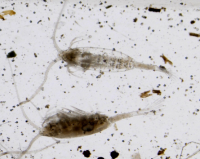


In October 2020 investigations of fouling on constructions of terminal "Utrenniy" were conducted as well. No real fouling was observed, because constructions were newly built. In the silt from vertical walls 50 species of microalgae were revealed from 5 taxonomic groups (Bacillariophyta, Cyanophyta, Chlorophyta, Euglenophyta, Cryptophyta). No animals were detected in samples. However, the process of fouling requires some more time, and should be monitored continuously (see Recommendations).

The main prerequisite for successful organism transfer and establishment is similarity of environmental conditions (first of all salinity and temperature) in ports of departure and destination (Smith et al., 1999) ^[Smith, L. D., Wonham, M. J., McCann, L. D., Ruiz, G. M., Hines, A. H., & Carlton, J. T. (1999). Invasion pressure to a ballast-flooded estuary and an assessment of inoculant survival. Biological Invasions, 1, 67–87.]. Taking this into account, we can analyze potential source ports of NIS for our study area. 

The most active traffic on the Northern Sea Route (NSR)as a whole and in the Ob Estuary in particular falls on August and September (Fig. +++, +++ and +++; https://arctic-lio.com/category/maps/), when ice extent in the Arctic Ocean is the lowest. The analysis of traffic of the long-distance of LNG tankers from Sabetta has shown that there were 43, 32 and 40 voyages in July, August and September 2021. Other vessels were mostly cargo ships, which operate the most probably on the local routes (inside the Arctic region) and could hardly carry any potential NIS. 

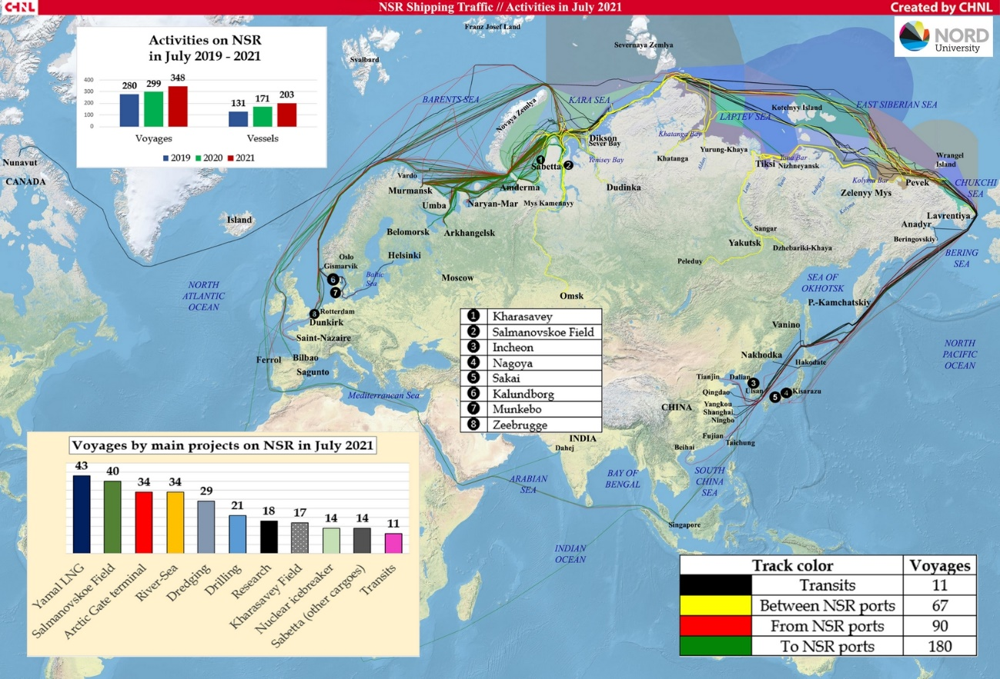


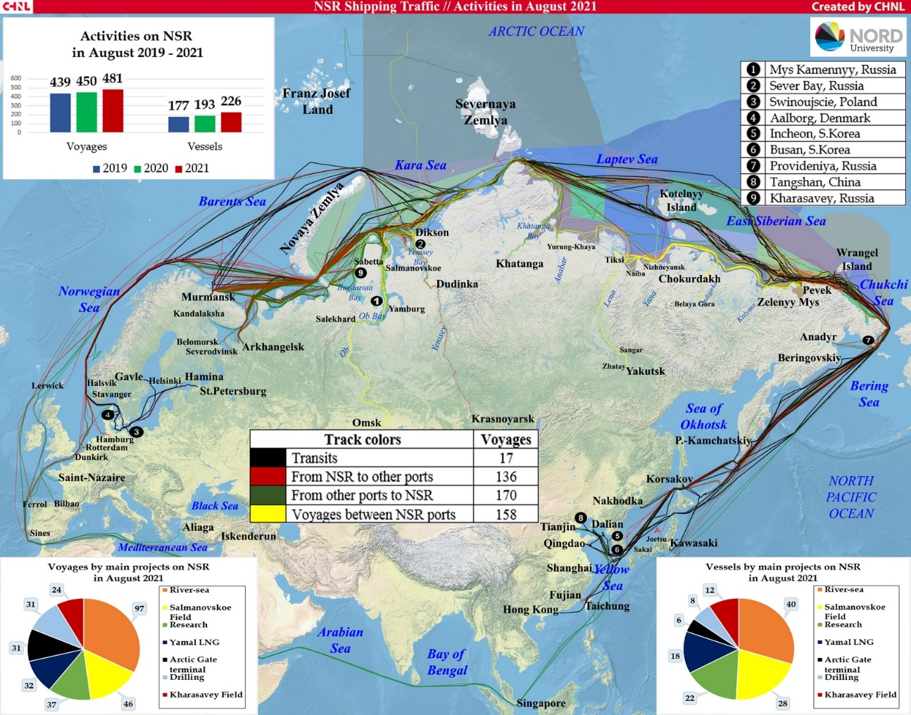


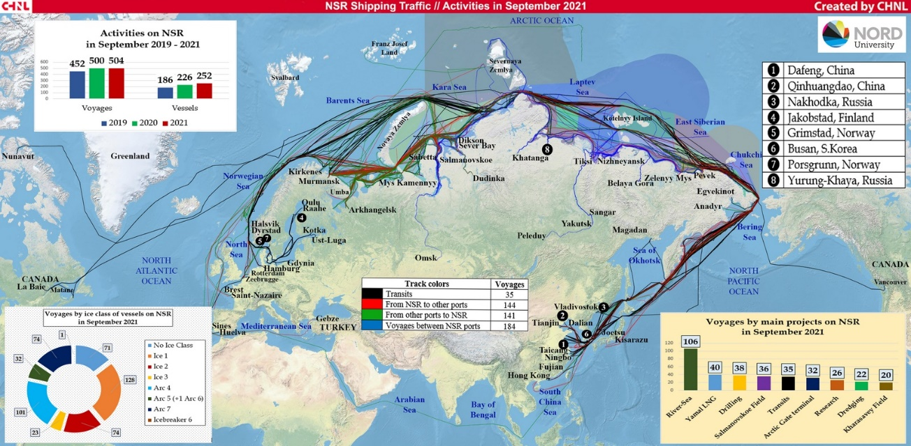

More than half of the export shipments in July and August 2021 went eastward – to China, Japan and South Korea (8 shipments out of 14), and 6 vessels went to Europe – to the Netherlands, Spain, Portugal and France (https://arctic-lio.com/). In 2020 main destination of LNG and gas condensate were European ports: Belgium (62 voyages), France (58), Netherlands (26), Spain (30), UK (22). There were 25 voyages in China. 

The most likely rout for NIS transfer is the western one, because all destination ports in Asia are situated further south than European ones. The most probable candidate are Netherlands as the most northward location. Therefore, we should concentrate on organisms, which are documented as numerous and spreading their range in the northern Europe.
We should keep in mind the increase of voyage number during the last three years and very probable preservation of this trend in future, which means increase of NIS load in the area of interest. 

**Conclusion**

The total traffic has been increasing for the last three years, and this tendency will remain in future, because of development of new projects. The number of long-distance voyages will rise significantly as new fields and terminals are put into operation. So the load of alien species will increase and probability of introduction invasive species will increase as well. However, we can prevent introduction by monitoring plankton and benthos and take effective measures to treat ballast water and fouling. 


## Источники информации и их анализ

Information on native species of benthos and zooplankton was taken from (Integrated investigations… 2020) ^[Integrated investigations of ecological conditions in the Ob Estuary in the area of potential influence of the Progect "Arctic LNG 2" and on the adjacent area. (2020).]. Native species involved in the analysis included those forms that were determined to species level (or in cases of presumed cryptic species, to genus). We considered only those species which were found and abundant in benthic and plankton surveys in the estuarine portion of the water area (at stations south of 73 degrees N). Pure marine species, represented mainly in the northern part of the water area, were not included in the consideration.


The *Invasive Species in Russia* database (http://www.sevin.ru/top100worst/index.html) was used to identify PNIS among benthic forms. Several species mentioned as potential invasive species in Arctic waters (Goldshmit et al. 2020) ^[Goldsmit, J., McKindsey, C. W., Schlegel, R. W., Stewart, D. B., Archambault, P., & Howland, K. L. (2020). What and where? Predicting invasion hotspots in the Arctic marine realm. Global Change Biology, 26(9), 4752–4771. https://doi.org/10.1111/gcb.15159] were included in the analysis as well. 

Analogously several planktonic species referred as invasive species in *Invasive Species in Russia* database (http://www.sevin.ru/top100worst/index.html) were included in our analysis. However, since only few forms were mentioned in this data base, the additional search for potential NIS was accomplished as follows. As it was shown above, the most probable way of introduction of NIS is western Europe. We analyzed the plankton fauna of estuaries of the western Europe, where the most destination ports are situated. We chose eurybiont species with the most northward range, which were then included in analysis of potential NIS in the Ob Estuary.

Additionally one species (planktonic copepod Acartia bifilosa) which is referred as abundant element of season planktonic community of the White and Baltic seas was included in the analysis since the conditions in these seas can be similar to Ob estuary. This species was not found in the *Invasive Species in Russia* database. However another species, Acartia tonsa, is referred there. Since taxonomic disagreements are highly possible in the case of plankton identification we included both species in the analysis. 


### Analysis of geographic distribution of hydrobionts

In the summarized list of benthic and planktonic species (`r all_species %>% select(species) %>% unique %>% nrow` вида), each of them  was labeled as "Native" or "PNIS". Next, for each species, the Global Biodiversity Information Facility database (https://www.gbif.org/) was queried to find the geographic localities where the species was occured. Only unique combinations of latitude and longitude were considered. A Geographic Dataset (GDS) was generated from these queries ( `r all_species %>% unique %>% nrow` unique localities were included). 

The GDS was used to analyze the latitudinal distribution of species. This analysis compared the latitudinal range limits of native species and PNIS. This analysis is designed to screen out those PNIS whose distribution centers are far from the geographic boundaries of the analyzed water area. The following values were calculated from the GDS and considered as biogeographic characteristics of the species. 


$Median_{lat}$ - the median of latitude values. It is assumed that this value characterizes the "core" of the latitudinal range. 

$Upper_{lat}$ - Maximum value of latitude, at which the species was occured

$Q_{low}$ - value of 2.5% quantile of latitude

$Q_{up}$ - value of 97.5% of the quantile of latitude

$Prop_{polar}$ - the ratio of the number of localities with latitude above the Arctic Circle to the total number of encounters. It is assumed that the higher this value, the more likely this species is found in the Polar region. 

$Skewness$ - the value of asymmetry in the distribution of latitude values. It is assumed that the more asymmetric the distribution, the more pronounced is the tendency of displacement of the species from the range. 

$Asymmetry$ - value similar to the previous one. It is the ratio of the distance from the median of latitude to Q_low to the distance from the median to Q_up. The logathmic transformation was applied to make the values distributed in range between 0 and 1 more pronounced. 

$$
Asymmetry = \ln(\frac{|Q_{up} - M|}{|Q_{low}-M|})
$$

The matrix of these variables was used in principal component analysis (PCA). The score of PC1 was used for a general assessment of latitudal species distribution.

### Assessment of environmental parameters 

For all species included in the analysis (Native and PNIS), salinity and temperature values at their occurence (GBIF) points were estimated. Bio-ORACLE GIS (https://bio-oracle.org/; Tyberghein et al. 2021; Assis et al. 2017) ^[Tyberghein, L., Verbruggen, H., Pauly, K., Troupin, C., Mineur, F., & De Clerck, O. (2012). Bio-ORACLE: a global environmental dataset for marine species distribution modelling. Global ecology and biogeography, 21(2), 272–281.] ^[Assis, J., Tyberghein, L., Bosch, S., Verbruggen, H., Serrão, E. A., & De Clerck, O. (2018). Bio-ORACLE v2. 0: Extending marine data layers for bioclimatic modelling. Global Ecology and Biogeography, 27(3), 277–284.] was used to estimate hydrological parameters in marine areas. Sea water salinity (mean at mean depth) and sea water temperature (mean at mean depth) were extracted from this GIS for each occurence point. Because some of the geographic locations of the species occurence were in freshwater areas, temperature data were additionally searched using EarthEnv GIS (http://www.earthenv.org/streams; Domisch et al., 2015) ^[Domisch, S., Amatulli, G., & Jetz, W. (2015). Near-global freshwater-specific environmental variables for biodiversity analyses in 1 km resolution. Scientific data, 2(1), 1–13.].  For the locations whose parameters were estimated using the EarthEnv GIS, the salinity value was assumed to be zero.   


### Statistic analysis
All data processing was performed with functions of R statistical programming language (R Core Team, 2021) ^[R Core Team. (2021). R: A Language and Environment for Statistical Computing. Vienna, Austria: R Foundation for Statistical Computing. Diambil dari https://www.R-project.org/]. 

The queries for GBIF were performed with package "spocc" (Scott, Chamberlain, 2021) ^[Chamberlain, S. (2021). spocc: Interface to Species Occurrence Data Sources. Diambil dari https://CRAN.R-project.org/package=spocc]. The verification of taxonomic characteristics of species was processed with the package "worms" 
(Holstein, 2018) ^[Holstein, J. (2018). worms: Retriving Aphia Information from World Register of Marine Species. Diambil dari https://CRAN.R-project.org/package=worms] retriving the information from WoRMS data base (https://www.marinespecies.org/).

Principal component analysis was performed with the package "vegan" (Oksanen et al. 2020) ^[Oksanen, J., Blanchet, F. G., Friendly, M., Kindt, R., Legendre, P., McGlinn, D., … Wagner, H. (2020). vegan: Community Ecology Package. Diambil dari https://CRAN.R-project.org/package=vegan].


# Assessment Results

## Short introduction to hydrological conditions in the Ob estuary


```{r}
hydrol_model <- read.csv("Data/hydrological modelling data.csv")


hydrol_model$Season <- factor(hydrol_model$Season, levels = c("Winter", "Spring", "Summer", "Autumn")) 

forecast_points <- hydrol_model %>% select(lon, lat) %>% unique


```

```{r}

Ob_df <- read.csv("Data/Obskaya_bay_map.csv") # Map poligones


Ob_x <- c(71, 75)
Ob_y <- c(70, 73.2)


hotspot <- read.table("Data/Obskaya_bay_ports.csv", sep = ",", header = T) 

grid_data <- expand.grid(Lat = seq(from = 70.01, to =72.89, length.out = 100), Long =  seq(from = 71, to =75.2 , length.out = 100))


Pl_Obskaya_bay <- 
  ggplot(Ob_df, aes(x=long, y=lat, group=group)) +
  geom_polygon(fill = "gray90", colour = "gray20") + 
  coord_map(xlim = Ob_x, ylim = Ob_y) +
  theme_bw() +  
  theme(axis.title.x = element_blank(),  axis.title.y = element_blank(), plot.background = element_blank(), panel.border = element_blank(), panel.grid = element_blank()) + 
  theme(axis.text.x =element_blank(), axis.text.y= element_blank()) + 
  theme(axis.ticks = element_blank())


Ob_x_port <- c(72, 74)
Ob_y_port <- c(70.8, 71.4)


Pl_Obskaya_bay_ports <- 
  ggplot(Ob_df, aes(x=long, y=lat, group=group)) +
  geom_polygon(fill = "gray90", colour = "gray20") + 
  coord_map(xlim = Ob_x_port, ylim = Ob_y_port) + 
  theme_bw() +  
  theme(axis.title.x = element_blank(),  axis.title.y = element_blank(), plot.background = element_blank(), panel.border = element_blank(), panel.grid = element_blank()) + 
  theme(axis.text.x =element_blank(), axis.text.y= element_blank()) + 
  theme(axis.ticks = element_blank())


hotspot2 <- hotspot %>% filter(Object %in% c("Sabetta", "Utrenniy"))

Pl_Ob_bay <-
Pl_Obskaya_bay + 
  geom_point(data = hotspot2,  aes(x = Lon, y = Lat, group =1), size = 4, shape = 22, fill = "yellow") + 
  geom_point(data = forecast_points, aes(x = lon, y = lat, group =1), size = 0.1, color = "blue") +
  geom_text_repel(data = hotspot2,  aes(x = Lon, y = Lat, group =1, label = Object), size = 4, box.padding = 0.8)

Pl_ports_area <- 
Pl_Obskaya_bay_ports + geom_point(data = hotspot,  aes(x = Lon, y = Lat, group =1), size = 4, shape = 22, fill = "yellow") + geom_point(data = forecast_points, aes(x = lon, y = lat, group =1), size = 0.1, color = "blue")

```

    


The hydrological model (**INMOM**) was a source of information to describe hydrological conditions in the Ob estuary. The model made it possible to consider values of two key hydrological parameters (water temperature and salinity) in areas located in the vicinity of the currently operating port, "Sabetta", and the port under design, Terminal "Utrenniy" (Fig ++). 


```{r }

# plot_grid(Pl_Ob_bay, Pl_ports_area, ncol = 2)

plot_grid(Pl_Ob_bay)


```

Figure ++. Position of ports in the Ob estuary. Blue area marks a set of points nearest to ports selected for analysis of variation in hydrological parameters calculated by INMOM  model. 


```{r}


path = "D:/Data_LMBE/Obskaya Bay additional data/nc_files_from_model/After_construction_building"


##### Данные модели на осень

library(ncdf4)
library(raster)

name <- "inmom_20161015.nc"
ncin <- nc_open(paste(path, "/",name, sep = ""))


lon <- ncvar_get(ncin,"lon")
lat <- ncvar_get(ncin,"lat")
time <- ncvar_get(ncin,"time")
date_from_model <- as.POSIXct(time, origin = "1900-01-01 00:00:00")

tmp_array <- ncvar_get(ncin,"temp")
  
  tmp_slice_0 <- tmp_array[,,1]
  tmp_slice_5 <- tmp_array[,,2]
  tmp_slice_10 <- tmp_array[,,3]
  tmp_slice_15 <- tmp_array[,,4]
  tmp_slice_20 <- tmp_array[,,5]
  
 salt_array <- ncvar_get(ncin,"salt")
  
  salt_slice_0 <- salt_array[,,1]
  salt_slice_5 <- salt_array[,,2]
  salt_slice_10 <- salt_array[,,3]
  salt_slice_15 <- salt_array[,,4]
  salt_slice_20 <- salt_array[,,5]
 lonlat <- as.matrix(expand.grid(lon = lon,lat = lat))
  
  
  df_model <- data.frame(cbind(lonlat, T_0 = as.vector(tmp_slice_0), T_5 = as.vector(tmp_slice_5), T_10 = as.vector(tmp_slice_10), T_15 = as.vector(tmp_slice_15), T_20 = as.vector(tmp_slice_20), S_0 = as.vector(salt_slice_0), S_5 = as.vector(salt_slice_5), S_10 = as.vector(salt_slice_10), S_15 = as.vector(salt_slice_15), S_20 = as.vector(salt_slice_20)), Date = date_from_model)
  
detach("package:raster", unload = TRUE)
detach("package:dplyr", unload = TRUE)

  library(dplyr)  
df_model_Spt1<- df_model %>% filter(!is.na(T_0))
  


##### Данные модели на зиму
library(ncdf4)
library(raster)


name <- "inmom_20170115.nc"
ncin <- nc_open(paste(path, "/",name, sep = ""))


lon <- ncvar_get(ncin,"lon")
lat <- ncvar_get(ncin,"lat")
time <- ncvar_get(ncin,"time")
date_from_model <- as.POSIXct(time, origin = "1900-01-01 00:00:00")

tmp_array <- ncvar_get(ncin,"temp")
  
  tmp_slice_0 <- tmp_array[,,1]
  tmp_slice_5 <- tmp_array[,,2]
  tmp_slice_10 <- tmp_array[,,3]
  tmp_slice_15 <- tmp_array[,,4]
  tmp_slice_20 <- tmp_array[,,5]
  
 salt_array <- ncvar_get(ncin,"salt")
  
  salt_slice_0 <- salt_array[,,1]
  salt_slice_5 <- salt_array[,,2]
  salt_slice_10 <- salt_array[,,3]
  salt_slice_15 <- salt_array[,,4]
  salt_slice_20 <- salt_array[,,5]
 lonlat <- as.matrix(expand.grid(lon = lon,lat = lat))
  
  
  df_model <- data.frame(cbind(lonlat, T_0 = as.vector(tmp_slice_0), T_5 = as.vector(tmp_slice_5), T_10 = as.vector(tmp_slice_10), T_15 = as.vector(tmp_slice_15), T_20 = as.vector(tmp_slice_20), S_0 = as.vector(salt_slice_0), S_5 = as.vector(salt_slice_5), S_10 = as.vector(salt_slice_10), S_15 = as.vector(salt_slice_15), S_20 = as.vector(salt_slice_20)), Date = date_from_model)

detach("package:raster", unload = TRUE)
detach("package:dplyr", unload = TRUE)

library(dplyr)  
df_model_Dec1<- df_model %>% filter(!is.na(T_0))
  
  

  
  
  
  
##### Данные модели на весну
library(ncdf4)
library(raster)

name <- "inmom_20170415.nc"
ncin <- nc_open(paste(path, "/",name, sep = ""))


lon <- ncvar_get(ncin,"lon")
lat <- ncvar_get(ncin,"lat")
time <- ncvar_get(ncin,"time")
date_from_model <- as.POSIXct(time, origin = "1900-01-01 00:00:00")

tmp_array <- ncvar_get(ncin,"temp")
  
  tmp_slice_0 <- tmp_array[,,1]
  tmp_slice_5 <- tmp_array[,,2]
  tmp_slice_10 <- tmp_array[,,3]
  tmp_slice_15 <- tmp_array[,,4]
  tmp_slice_20 <- tmp_array[,,5]
  
 salt_array <- ncvar_get(ncin,"salt")
  
  salt_slice_0 <- salt_array[,,1]
  salt_slice_5 <- salt_array[,,2]
  salt_slice_10 <- salt_array[,,3]
  salt_slice_15 <- salt_array[,,4]
  salt_slice_20 <- salt_array[,,5]
 lonlat <- as.matrix(expand.grid(lon = lon,lat = lat))
  
  
  df_model <- data.frame(cbind(lonlat, T_0 = as.vector(tmp_slice_0), T_5 = as.vector(tmp_slice_5), T_10 = as.vector(tmp_slice_10), T_15 = as.vector(tmp_slice_15), T_20 = as.vector(tmp_slice_20), S_0 = as.vector(salt_slice_0), S_5 = as.vector(salt_slice_5), S_10 = as.vector(salt_slice_10), S_15 = as.vector(salt_slice_15), S_20 = as.vector(salt_slice_20)), Date = date_from_model)
  

  detach("package:raster", unload = TRUE)
detach("package:dplyr", unload = TRUE)

library(dplyr)  
  df_model_Mar1<- df_model %>% filter(!is.na(T_0))
  
  
  
  

##### Данные модели на лето

library(ncdf4)
library(raster)

name <- "inmom_20170715.nc"
ncin <- nc_open(paste(path, "/",name, sep = ""))


lon <- ncvar_get(ncin,"lon")
lat <- ncvar_get(ncin,"lat")
time <- ncvar_get(ncin,"time")
date_from_model <- as.POSIXct(time, origin = "1900-01-01 00:00:00")

tmp_array <- ncvar_get(ncin,"temp")
  
  tmp_slice_0 <- tmp_array[,,1]
  tmp_slice_5 <- tmp_array[,,2]
  tmp_slice_10 <- tmp_array[,,3]
  tmp_slice_15 <- tmp_array[,,4]
  tmp_slice_20 <- tmp_array[,,5]
  
 salt_array <- ncvar_get(ncin,"salt")
  
  salt_slice_0 <- salt_array[,,1]
  salt_slice_5 <- salt_array[,,2]
  salt_slice_10 <- salt_array[,,3]
  salt_slice_15 <- salt_array[,,4]
  salt_slice_20 <- salt_array[,,5]
 lonlat <- as.matrix(expand.grid(lon = lon,lat = lat))
  
  
  df_model <- data.frame(cbind(lonlat, T_0 = as.vector(tmp_slice_0), T_5 = as.vector(tmp_slice_5), T_10 = as.vector(tmp_slice_10), T_15 = as.vector(tmp_slice_15), T_20 = as.vector(tmp_slice_20), S_0 = as.vector(salt_slice_0), S_5 = as.vector(salt_slice_5), S_10 = as.vector(salt_slice_10), S_15 = as.vector(salt_slice_15), S_20 = as.vector(salt_slice_20)), Date = date_from_model)
  
df_model_Jun1<- df_model %>% filter(!is.na(T_0))
    
  
  
  
df_model_Spt1$Season <- "Autumn"
df_model_Dec1$Season <- "Winter"
df_model_Mar1$Season <- "Spring"
df_model_Jun1$Season <- "Summer"

detach("package:raster", unload = TRUE)
detach("package:dplyr", unload = TRUE)
library(dplyr)
df_model <- rbind(df_model_Spt1, df_model_Dec1, df_model_Mar1,df_model_Jun1)
  
df_model$Season <- factor(df_model$Season, levels = c("Winter", "Spring", "Summer", "Autumn"))
  
```


Temperature and salinity in the area experience seasonal fluctuations (Fig. ++). The highest salinity is observed in spring, when the saline water tongue goes far upstream.

Water temperature values increase as the distance from the mouth of the Gulf of Ob upstream increases (Fig. ++).


```{r }

ggplot(df_model) + geom_tile(aes(x = lon, y = lat, color = S_0, group = 1)) + scale_color_gradient(low = "white", high = "blue") + geom_polygon(data = Ob_df, aes(x=long, y=lat, group=group), fill = "gray90", colour = "gray20") + labs(color = "Surface water salinity") + theme(legend.position = "bottom") + facet_wrap(~Season)


```

Figure ++. Salinity in the Ob estuary in four seasons


```{r }

ggplot(df_model) + geom_tile(aes(x = lon, y = lat, color = T_0, group = 1)) + scale_color_gradient(low = "yellow", high = "red") + geom_polygon(data = Ob_df, aes(x=long, y=lat, group=group), fill = "gray90", colour = "gray20") + labs(color = "Surface water temperature") + theme(legend.position = "bottom") + facet_wrap(~Season)


```

Figure ++. Surface temperature in the Ob estuary in four seasons


Model predictions were made for `r  nrow(forecast_points)` points located in the areas adjacent to the ports (Fig. ++). For these points, salinity and water temperature values were calculated for each day of the calendar year for five depth levels (0, 5, 10, 15, and 20 meters). In the further analysis, the average value of salinity and temperature calculated for each point was used.


T-S diagrams (Fig. ++) show that cold, saline water is present in the port area in winter and spring. Salinity during this period varies within `r range(hydrol_model %>% filter(Season %in% c("Winter", "Spring")) %>% pull(Sal) %>% round(.,0) )` ppm and temperature within `r range(hydrol_model %>% filter(Season %in% c("Winter", "Spring")) %>% pull(Temp) %>% round(.,1) )` degrees.


```{r }
env_limits <- hydrol_model %>% group_by(Season) %>% summarise(Sal_low = quantile(Sal, probs = 0.005), Sal_up = quantile(Sal, probs = 0.995), Temp_low = quantile(Temp, probs = 0.005), Temp_up = quantile(Temp, probs = 0.995))


# ggplot(hydrol_model2, aes(x = Temp, y = Sal)) + 
#   geom_point(size = 0.1, alpha = 0.1) 
   

ggplot(data = env_limits) +  geom_rect(aes(xmin = Temp_low, xmax = Temp_up, ymin = Sal_low, ymax = Sal_up), fill = "white", color = "blue", alpha = 0.1) + facet_wrap(~Season) + geom_point(data = hydrol_model, aes(x = Temp, y = Sal), size = 0.1, alpha = 0.1) + labs(x = "Water temperature", y = "Salinity")


```

Figure ++. T-S diagram reflecting limits of salinity and temperature variation in the area of ports in different seasons.


During the summer and fall salinity is low but there is considerable warming of the water in these seasons. During these periods salinity varies within `r range(hydrol_model %>% filter(Season %in% c("Summer", "Autumn")) %>% pull(Sal) %>% round(.,1) )` ppm and temperature: `r range(hydrol_model %>% filter(Season %in% c("Summer", "Autumn")) %>% pull(Temp) %>% round(.,1) )` degrees.


To describe the boundaries of the ecological license of the biotope that could potentially be inhabited by NIS, the salinity and temperature limits in the water area adjacent to the port areas were calculated as values of 0.5% and 99.5% quantiles of each of the parameters. In the Figure ++, these limits are indicated by rectangles. 


The boundary of ecological license is the hydrological conditions that can be inhabited by PNIS.  The port area seems to be the most likely areas for NIS invasion. However, according to climate change projections (https://interactive-atlas.ipcc.ch/), ocean surface temperatures  will gradually increase in the Russian Arctic region (about 2 degrees per century. **Проверить**). Hence, the boundaries of the ecological license along the temperature axis will shift towards higher temperatures, which will expand the possibility of NIS invasion in the future. 


**Conclusion**

The warmest water mass is present in the water area during the autumn period. Thus this is a season that should be considered as the most dangerous in terms of the probability of introducing species from temperate latitudes.  

It should be emphasized that any antropgenic temperature increase will increase the likelihood of NIS invasion.


## Biogeographical analysis of potential NIS

```{r}
library(tidyr)
spec_number<-
  all_species %>% select(species, Status, Group) %>% unique() %>% table() %>% as.data.frame() %>% group_by(Status, Group) %>% summarise(N = sum(Freq)) %>% spread(key = "Status", value = "N") 


```

Using available datasets we found rather large amount PNIS between benthic animals but only few one between zooplankton (Table ++). However controversy situation was found between native forms.

```{r}
kable(spec_number, caption = "Table ++. Number of native and potentialy Non-indigenous speciesinvolved in the biogeografical analysis for benthic and planktonic animals.")
```


```{r}
species_stat <- all_species %>% group_by(species, Status, Group) %>% summarise(Median_lat = median(lat), Upper_lat = max(lat), Q_low = quantile(lat, probs = 0.025), Q_up = quantile(lat, probs = 0.975), N_S_skewness = skewness(lat, type = 1), N_S_asymmetry = log(abs(Q_up - Median_lat)/abs(Q_low - Median_lat)), Prop_polar = mean(lat > 66.5622))

```


```{r}

mod <- rda(species_stat[ , -c(1, 2, 3)])


scores_rda_all <- scores(mod)

species_rda_all <- as.data.frame(scores_rda_all$sites)


species_rda_all$species <- species_stat$species 
species_rda_all$Status <-species_stat$Status 
species_rda_all$Group <-species_stat$Group 


Low_PC1 <- species_rda_all %>% filter(Status == "Native") %>% group_by(Group) %>% summarise (Q_3 = quantile(PC1, probs = 0.95))

bent_boundary <- Low_PC1[1,2]
planct_boundary <- Low_PC1[2,2]


# ggplot(species_rda_all, aes(PC1, PC2, color = Status)) + geom_point(size = 3) + scale_color_manual(values = c("blue", "red"))


```


The first principal component describing `r round(summary(mod)$cont$importance[3,1]*100,1)`% of the total variation in species biogeographic characteristics shows a high negative correlation with the southern species distribution boundary ($Q_{low}$), median latitude ($Median_{lat}$) and northern species distribution boundary ($Q_{up}$). Thus, PC1 values can be interpreted as a latitudinal gradient in species distribution. Smaller values of PC1 correspond to higher latitudes. 

It can be observed that native forms of benthos have a slightly more northern distribution than native planktonic forms. The latitudinal core of distribution of potential NIS involved in the analysis is shifted southerly in both benthic and planktonic potential invaders. 


```{r}
ggplot(species_rda_all, aes(x = PC1)) + geom_density(aes(fill = Status), alpha = 0.5, bw = "ucv") + geom_vline(data = Low_PC1, aes(xintercept = Q_3), linetype =2) + scale_fill_manual(values = c("blue", "red")) + facet_wrap(~Group, ncol = 1)

```


Figure ++. Frequency distribution of PC1 scores for native and PNIS between benthic and planktonic species.

If we consider the value of the 95% quantile of PC1 as the southern boundary of native species distribution (vertical lines in Fig. ++), then among benthic species `r species_rda_all %>% filter(Group == "Benthos") %>% filter(PC1 < bent_boundary) %>% filter(Status == "PNIS")%>% nrow` falls into number of species whose ranges are close to native species, but among planktonic only `r species_rda_all %>% filter(Group == "Plankton") %>% filter(PC1 < planct_boundary) %>% filter(Status == "PNIS")%>% nrow ` species distributed closely to with native zooplankton species. Biogeographic characteristics of potential NIS are given in Table ++.


```{r}

benthic_PNIS <- species_rda_all %>% filter(Group == "Benthos") %>% filter(PC1 < bent_boundary) %>% filter(Status == "PNIS")%>% pull(species)

Planktonic_PNIS <- species_rda_all %>% filter(Group == "Plankton") %>% filter(PC1 < planct_boundary) %>% filter(Status == "PNIS")%>% pull(species)


all_spec_biogeogr <- species_stat %>% filter(species %in% c(benthic_PNIS, Planktonic_PNIS)) %>% select(species, Group, Q_low, Median_lat, Q_up)


```


For all species included in the analysis (both Native and PNIS), salinity and temperature values at their occurence localities, taken from the GBIF database, were estimated. Bio-ORACLE GIS and EarthEnv GIS were used to estimate hydrological parameters in points of species occurences.

The area of maximum concentration of points corresponding to native species of benthos organisms agrees very well with the boundaries of the ecological license of the Ob estuary. Salinity values in the range of 0-10 ppm and 0-10 degrees can be considered as conditional niche boundaries for native benthos species. In the case of native plankton species some points also presented inside these boundaries. However, the maximum concentration of points, although falling within the cold-water range (less than 10 degrees), falls within ranges of the normal oceanic salinity.


```{r }


benthic_env <- read.csv("Data/benthos_environment_all_final.csv")
benthic_env <- benthic_env[,-1] 

Plankton_env <- read.csv("Data/plancton_environment_all_final.csv")

benthic_env$Group <- "Benthos"
Plankton_env$Group <- "Plankton"

all_species_env <- rbind(benthic_env, Plankton_env)


env_limits_cold <- env_limits %>% filter(Season %in% c("Sinter", "Spring"))
env_limits_warm <- env_limits %>% filter(Season %in% c("Summer", "Autumn"))

  
ggplot(all_species_env, aes(x = Temp, y = Sal)) + 
  geom_point(size = 0.1, position = position_jitter(width = 0.1, height = 0.5)) +
  facet_grid(Status ~ Group) + 
  geom_density2d(color = "green") + 
  geom_rect(aes(xmin = min(env_limits_cold$Temp_low), xmax = max(env_limits_cold$Temp_up), ymin = min(env_limits_cold$Sal_low), ymax = min(env_limits_cold$Sal_up)), fill = NA, color = "blue") +
  geom_rect(aes(xmin = min(env_limits_warm$Temp_low), xmax = max(env_limits_warm$Temp_up), ymin = min(env_limits_warm$Sal_low), ymax = min(env_limits_warm$Sal_up)), fill = NA, color = "blue") +  
  geom_rect(aes(xmin = 0, xmax = 10, ymin = 0, ymax = 10), fill = NA, color = "red", linetype = 2) +
  labs(x = "Water temperature", y = "Salinity")


```

Figure ++. Occurence of benthic and planktonic native species and PNIS in different hydrological conditions. The boundary of ecological license of Ob estuary in cold and warm seasons are represented by blue rectangles. The red rectangles reflect expanded ecological license. Green lines reflects areas with maximal point density.    


To quantify the probability of PNIS colonization in the conditions of the Gulf of Ob, we introduced the value $P_{inv}$. To calculate this estimate, we calculated the number of locations obtained from the GBIF database for which the salinity-temperature conditions approximately corresponded to the ecological license of the Gulf of Ob (Salinity:0-10 ppm, Temperature 0-10 degrees). This value was divided by the total number of locations (for this species in the GBIF database) for which salinity and temperature were assessed. Values of these values are given in Table ++.


```{r}
all_env_stat <- all_species_env %>% group_by(Status, species, Group) %>% summarise(N_occ_total = n())
  

all_env_stat_in_env <- all_species_env  %>% filter(Sal <= 10 & Temp <= 10) %>% group_by(species, Group) %>% summarise(N_occ_in_env = n())


all_occur_probability <- merge(all_env_stat_in_env, all_env_stat, all = T)

all_occur_probability <- all_occur_probability %>% mutate(P_inv = round(N_occ_in_env/N_occ_total, 3)) %>% arrange(desc(P_inv)) 


```

```{r}

all_spec_biogeogr_full <- species_stat %>% select(species, Group, Q_low, Median_lat, Q_up)

PNIS_table <- merge(all_spec_biogeogr_full, all_occur_probability, all = T ) %>% arrange(Status, desc(P_inv)) 

PNIS_table$Q_low <- round(PNIS_table$Q_low, 1)
PNIS_table$Median_lat <- round(PNIS_table$Median_lat, 1)
PNIS_table$Q_up <- round(PNIS_table$Q_up, 1)


PNIS_table$N_occ_in_env <- ifelse(is.na(PNIS_table$N_occ_in_env) & PNIS_table$N_occ_total != 0, 0, PNIS_table$N_occ_in_env)

PNIS_table$P_inv <- ifelse(PNIS_table$N_occ_in_env == 0 & PNIS_table$N_occ_total != 0, 0, PNIS_table$P_inv)


```


```{r}
kable(PNIS_table, caption = "Table ++. Native species and PNIS for the Ob estuary ecosystem involved in analysis. Biogeographical characteristics: $Q_{low}$ - 2.5% quantile of latitude, $Median_{lat}$ - median of latitude, $Q_{up}$ - 97.5% quantile of latitude. $N_{env}$ - number of references in GBIF with environmental parameters inside the ecological license of the Ob estuary. $N_{total}$ - total number of references with salinity and temperature assessed.", col.names = c("Status", "Species", "Group", "$Q_{low}$", "$Median_{lat}$", "$Q_{up}$", "$N_{env}$", "$N_{total}$", "$P_{inv}$" ))
```


```{r}
PNIS_table_short <- PNIS_table %>%  filter(Status == "PNIS") %>% filter(N_occ_total > 100 & P_inv >0.05)

```

To form a short list of PNIS, we removed those species for which the number of locations with the environmental parameters estimated was less than 100. In addition, species for which the estimated probability of invasion (P_inv) was less than 5% were removed. In total, the short list of the most likely invaders included `r nrow(PNIS_table_short)` species: `r paste(PNIS_table_short %>% pull(species), sep = ", ")`. Below is a description of them with an assessment of the possible consequences of the introduction of these species into the ecosystem of the Ob estuary. 

Additionally we included in this short list polychaete from genues *Marenzelleria*. This species complex is well known as active invader in the Baltic Sea (Maximov, 2010; Kauppi et al. 2015) ^[Maximov, A. A. (2011). Large Scale Invasion of Marenzelleria spp . ( Polychaeta ; Spionidae ) in the Eastern Gulf of Finland , Baltic Sea, 2(1), 11–19. https://doi.org/10.1134/S2075111711010036]. The taxonomic status of this polychaetes in the Ob estuary is doubt and it is highly possible that the presence of *Marenzelleria* sp. as "native" taxa reflects an initial stage of its invasion started after beginning of active exploitation of the area.     


**Conclusion**

The severe conditions of the Gulf of Ob (an estuary with very cold water) are able to be potentially invaded only by a few hydrobionts. Mostly benthic organisms whose ranges are shifted to the north are expected to be potential invaders. Only few planktonic species are capable of surviving under such severe conditions. Even most native zooplankton species, in their relation to two key hydrological factors (salinity and temperature), are rather related to marine pelagic communities and probably presented in the area due to inflow of marine waters from the Kara Sea. Investigation of reproductive cycles of planktonic animals is needed for assessment their ability to establish local populations.


## Discription of most expected invasive species

```{r}
world <- map_data("world")


 World_map <- 
  ggplot(world, aes(x=long, y=lat, group=group)) +
  geom_polygon(fill = "gray70") + 
  coord_map(xlim = c(-180, 180), ylim = c(-50, 90) ) +
  theme_bw() +  
  theme(axis.title.x = element_blank(),  axis.title.y = element_blank(), plot.background = element_blank(),  panel.grid = element_blank()) + 
  theme(axis.text.x =element_blank(), axis.text.y= element_blank()) + 
  theme(axis.ticks = element_blank()) 
 # +
 #   geom_point(data = hotspot, aes(x = Lon, y = Lat, group = 1), size = 3, fill = "yellow", shape = 21, color = "black")

```


```{r}
taxonomy <- read.csv("Data/taxonomy.csv")
```


### Plankton

<!-- Species discription -->

```{r}

spec <- "Prorocentrum cordatum"
tax <- taxonomy %>% filter(scientificname == spec)

spec_full <- paste(spec, tax$authority)

```

##### *`r spec_full`*

**Phyllum:**`r tax$phylum`   
**Class:** `r tax$class`    
**Order:** `r tax$order`    
**Family:** `r tax$family`   

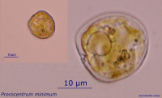


```{r }
spec_data <- read.csv("Data/Prorocentrum cordatum.csv")

World_map +   geom_point(data = spec_data, aes(x = lon, y = lat, group = 1), size = 0.5) 
# + geom_density2d(data = spec_data, aes(x = lon, y = lat, group = 1))


```

Figure ++. Worldwide distribution of `r spec` accordingly to GBIF.

*P. cordatum* (minimum) (Dinophyceae) was introduced in the Baltic Sea and caused recognizable environmental effect (Olenina et al., 2010) ^[Olenina, I., Wasmund, N., Hajdu, S., Jurgensone, I., Gromisz, S., Kownacka, J., … Olenin, S. (2010). Assessing impacts of invasive phytoplankton: The Baltic Sea case. Marine Pollution Bulletin, 60(10), 1691–1700.]). This species has wide salinity and temperature tolerance and low-light adaptation (Tyler, Seliger, 1981, Hajdu et al., 2005) ^[Tyler, M. A., & Seliger, H. (1981). Selection for a red tide organism: Physiological responses to the physical environment 1, 2. Limnology and Oceanography, 26(2), 310–324.] ^[Hajdu, S., Pertola, S., & Kuosa, H. (2005). Prorocentrum minimum (Dinophyceae) in the Baltic Sea: morphology, occurrence—a review. Harmful algae, 4(3), 471–480.]. *P. minimum* was found also in the White Sea (Ilyash et al., 2018) ^[Ilyash, L. V., Belevich, T. A., Zhitina, L. S., Radchenko, I. G., & Ratkova, T. N. (2018). Phytoplankton of the White sea. Dalam Biogeochemistry of the atmosphere, ice and water of the White Sea (hlm. 187–222). Springer.], which proves it to be eurybiotic species. Is one of the red-tide-forming toxic species (Heil et al., 2005) ^[Heil, C. A., Glibert, P. M., & Fan, C. (2005). Prorocentrum minimum (Pavillard) Schiller: a review of a harmful algal bloom species of growing worldwide importance. Harmful Algae, 4(3), 449–470.]. Being introduced into Ob Estuary *P. cordatum* may cause poisoning of the local aquatic organisms, especially in case of intensive warming. Besides that, may occupy spatial niches of native planktonic algae.


<!-- Species discription -->

```{r}

spec <- "Acanthocyclops robustus"
tax <- taxonomy %>% filter(scientificname == spec)

spec_full <- paste(spec, tax$authority)

```

##### *`r spec_full`*

**Phyllum:**`r tax$phylum`   
**Class:** `r tax$class`    
**Order:** `r tax$order`    
**Family:** `r tax$family`   


```{r }
spec_data <- all_species %>% filter(species == spec)

World_map +   geom_point(data = spec_data, aes(x = lon, y = lat, group = 1), size = 0.5) 
# + geom_density2d(data = spec_data, aes(x = lon, y = lat, group = 1))


```

Figure ++. Worldwide distribution of `r spec` accordingly to GBIF.

*A. robustus* is temperate freshwater species, which is numerous in European lakes, ponds and estuaries (Purasjoki, Viljamaa, 1984; Gonçalves et al., 2012) ^[Purasjoki, K., & Viljamaa, H. (1984). Acanthocyclops robustus (Copepoda, Cyclopoida) in plankton of the Helsinki sea area, and a morphological comparison between A. robustus and A. vernalis. Finnish Mar. Res, 250, 33–44.] ^[Gonçalves, A. M., Pardal, M. Â., Marques, S. C., Mendes, S., Fernández-Gómez, M. J., Galindo-Villardón, M. P., & Azeiteiro, U. M. (2012). Responses of Copepoda life-history stages to climatic variability in a Southern-European temperate estuary. Zoological Studies, 51(3), 321–335.].  This species dominates in the freshwater zone of Schelde estuary (Belgium, Netherlands), which is strongly influenced by human activity and characterized by a high load of organic matter as well as toxic substances (Tackx et al., 2004) ^[Tackx, M. L., De Pauw, N., Van Mieghem, R., Azémar, F., Hannouti, A., Van Damme, S., … Meire, P. (2004). Zooplankton in the Schelde estuary, Belgium and The Netherlands. Spatial and temporal patterns. Journal of Plankton research, 26(2), 133–141.]. This species was found to be little affected by environmental gradients, so it must be capable to establish in areas with high variability of environmental parameters, which is typical for Ob Estuary. *A. robustus* was also regularly documented near Helsinki, in area, highly affected by human activity (Purasjoki, Viljamaa, 1984) ^[Purasjoki, K., & Viljamaa, H. (1984). Acanthocyclops robustus (Copepoda, Cyclopoida) in plankton of the Helsinki sea area, and a morphological comparison between A. robustus and A. vernalis. Finnish Mar. Res, 250, 33–44.]. *A. robustus* was documented in waters along Norwegian coast up to Kola peninsula (Fig. +++). This predator, being established, could affect local ecosystem, feeding on local organisms, which do not have behavioral adaptations to this new species. In a perspective, this invasion can lead to significant decrease of populations of prey organisms (Rotifera and small Diplostraca).


<!-- Species discription -->

```{r}

spec <- "Acartia bifilosa"
tax <- taxonomy %>% filter(scientificname == spec)

spec_full <- paste(spec, tax$authority)

```

##### *`r spec_full`*

**Phyllum:**`r tax$phylum`   
**Class:** `r tax$class`    
**Order:** `r tax$order`    
**Family:** `r tax$family`   

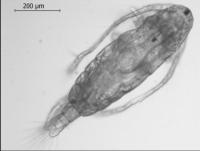


```{r }
spec_data <- all_species %>% filter(species == spec)

World_map +   geom_point(data = spec_data, aes(x = lon, y = lat, group = 1), size = 0.5) 
# + geom_density2d(data = spec_data, aes(x = lon, y = lat, group = 1))

```

Figure ++. Worldwide distribution of `r spec` accordingly to GBIF.

*A. bifilosa*  is eryhaline species inhabiting estuaries in the Western Europe (Belgiun, Netherlands), is constituent of brakish-water-marine group in winter-spring (Sautour, Castel, 1995) ^["sautour1995comparative]. May survive salinities down to 6-12 psu and temperatures down to 0°C. Was found in estuaries of the northern Europe. *A. bifilosa* is normal component of the summer planktonic community in the White Sea, prefers waters with low salinities in estuaries (Prudkovsky, 2003) ^[Prudkovsky A. (2003) Life cycle of Acartia bifilosa (Copepoda, Calanoida) in the White Sea (Chernorechenskaya Inlet, Kandalaksha Bay). Proc White Sea Biol Stn Mosc State Univ 9:164–168. (in Russian)]. *A. bifilosa* lays resting eggs to survive unfavourable conditions. The latter fact may facilitate transfer of this species in ballast waters. *A. bifilosa* is basically herbivorous species, which is capable to feed on animal preys, when phytoplankton is scarce (Martynova et al., 2011) ^[Martynova, D. M., Kazus, N. A., Bathmann, U. V., Graeve, M., & Sukhotin, A. A. (2011). Seasonal abundance and feeding patterns of copepods Temora longicornis, Centropages hamatus and Acartia spp. in the White Sea (66 N). Polar Biology, 34(8), 1175–1195.]. This may lead to competitive pressure of this species on local herbivorous organisms, and negative changes in populations of the latter.


### Benthos

<!-- Species discription -->

```{r}

spec <- "Amphibalanus improvisus"
tax <- taxonomy %>% filter(scientificname == spec)

spec_full <- paste(spec, tax$authority)

```

##### *`r spec_full`*


**Phyllum:**`r tax$phylum`   
**Class:** `r tax$class`    
**Order:** `r tax$order`    
**Family:** `r tax$family`   

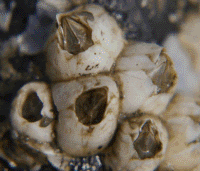


```{r}
spec_data <- all_species %>% filter(species == spec)

World_map +   geom_point(data = spec_data, aes(x = lon, y = lat, group = 1), size = 0.5) 
# + geom_density2d(data = spec_data, aes(x = lon, y = lat, group = 1))


```

Figure ++. Worldwide distribution of `r spec` accordingly to GBIF.


These sessile crustaceans have planktonic larvae, so the most likely way of their invasion into the Ob estuary is the introduction with ballast water. The second route of entry is also possible: on the bottoms of ships. Adult barnacles attached to the hulls of boats would not be able to inhabit the area. However, after cross copulation (they are hermaphroditic animals) the fertilized eggs accumulate in a special cavity where eggs develop and nauplius larvae hatched (Dorit et al. 1991) ^[Dorit, R. L., Walker, W. F., & Barnes, R. D. (1991). Zoology. Saunders College Pub.]. Then the already formed larvae enter the water column and, after a certain period of swimming, settle on solid substrates and undergo metamorphosis.  If vessels with adults of this species regularly enter the Ob estuary, a successful emergence of the nauplii may take place if the temperature is high enough and the salinity is at least 2 ppm (Dineen, Hines, 1992) ^[Dineen Jr, J. F., & Hines, A. H. (1992). Interactive effects of salinity and adult extract upon settlement of the estuarine barnacle Balanus improvisus (Darwin, 1854). Journal of experimental marine biology and ecology, 156(2), 239–252.]. 

In the case of successful colonization, barnacles inhabiting hard substrates (including man-made ones) will increase the structure complexity of the bottom.  In the space between the calcareous barnacle's shells other benthic forms will be able to settle. In case of mass settlement, which is unlikely, there may be failures in underwater structures: increase in friction, decrease in pipelines capacity. 


<!-- Species discription -->

```{r}

spec <- "Gammarus tigrinus"
tax <- taxonomy %>% filter(scientificname == spec)

spec_full <- paste(spec, tax$authority)

```

##### *`r spec_full`*


**Phyllum:**`r tax$phylum`   
**Class:** `r tax$class`    
**Order:** `r tax$order`    
**Family:** `r tax$family`   

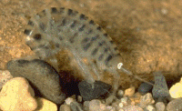


```{r}
spec_data <- all_species %>% filter(species == spec)

World_map +   geom_point(data = spec_data, aes(x = lon, y = lat, group = 1), size = 0.5) 
# + geom_density2d(data = spec_data, aes(x = lon, y = lat, group = 1))


```

Figure ++. Worldwide distribution of `r spec` accordingly to GBIF.


The most likely vector of introduction of this species is ballast water (Berezina, 2007) ^[Berezina, N. A. (2007). Expansion of the North American amphipod Gammarus tigrinus Sexton, 1939 to the Neva Estuary (easternmost Baltic Sea). Oceanologia, 49(1).]. The critical factor limiting the normal development of this euryhaline amphipod is temperature. This species can enter reproduction as early as 2 degrees, but developmental duration is delayed at low temperatures (Chambers, 1976) ^[Chambers, M. (1977). The population ecology of Gammarus tigrinus (Sexton) in the reed beds of the Tjeukemeer. Hydrobiologia, 53(2), 155–164.]. 

If introduced successfully, this species could significantly alter the ecosystem structure of the Ob Estuary. The expected impact may be due to the fact that this species is polyphagous and can feed not only on detritus, but also on animals including oligochaetes (Most dangerous invasive species ..., 2018) ^[Dgebuadze, Y. Y., Petrosyan, V. G., & Khlyap, L. A. (Ed.). (2018). The most dangerous invasive species of Russia (TOP-100) (in Russian) (hlm. 688). KMK Scientific Press.], which dominate the benthic communities in the south part of the estuary. The second expected impact may be related to the competitive relationship of the invasive species with native amphipods, primarily Monoporeia affinis. The latter species, being one of the most abundant forms of benthos (Integrated investigations… 2020) ^[Integrated investigations of ecological conditions in the Ob Estuary in the area of potential influence of the Progect "Arctic LNG 2" and on the adjacent area. (2020).], serve as the basis of diet of valuable fish species inhabiting the Ob estuary(Stepanova 2017) ^[Stepanova, V. B. (2017). Fish feeding in the Gulf of Ob in the Kara Sea during the ice season. Vestnik rybokhozajstvennoj nauki (in Russian), 4(4), 94–100.]. 

It should be noted that an in-depth taxonomic survey of the gammarid fauna in the Ob estuary has not been conducted. Therefore, there is a possibility that this species is already represented in the water area. 


<!-- Species discription -->

```{r}

spec <- "Rhithropanopeus harrisii"
tax <- taxonomy %>% filter(scientificname == spec)

spec_full <- paste(spec, tax$authority)

```

##### *`r spec_full`*


**Phyllum:**`r tax$phylum`   
**Class:** `r tax$class`    
**Order:** `r tax$order`    
**Family:** `r tax$family`   


```{r}
spec_data <- all_species %>% filter(species == spec)

World_map +   geom_point(data = spec_data, aes(x = lon, y = lat, group = 1), size = 0.5) 
# + geom_density2d(data = spec_data, aes(x = lon, y = lat, group = 1))


```


Figure ++. Worldwide distribution of `r spec` accordingly to GBIF.

The main expected vector of transport is ballast water. However, since the crab is very small in size, its infestation is also possible due to ship bottom fouling (Most dangerous invasive species..., 2018 ) ^[Dgebuadze, Y. Y., Petrosyan, V. G., & Khlyap, L. A. (Ed.). (2018). The most dangerous invasive species of Russia (TOP-100) (in Russian) (hlm. 688). KMK Scientific Press.]. The presence of this species in *Dreissena polymorpha* druses seems most likely. 

The crab is omnivorous (Most dangerous invasive species ..., 2018) ^[Dgebuadze, Y. Y., Petrosyan, V. G., & Khlyap, L. A. (Ed.). (2018). The most dangerous invasive species of Russia (TOP-100) (in Russian) (hlm. 688). KMK Scientific Press.], which determines its potential threat to native benthos species. 


<!-- Species discription -->

```{r}

spec <- "Eriocheir sinensis" 
tax <- taxonomy %>% filter(scientificname == spec)

spec_full <- paste(spec, tax$authority)

```

##### *`r spec_full`*


**Phyllum:**`r tax$phylum`   
**Class:** `r tax$class`    
**Order:** `r tax$order`    
**Family:** `r tax$family`   

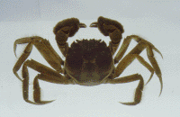


```{r}
spec_data <- all_species %>% filter(species == spec)

World_map +   geom_point(data = spec_data, aes(x = lon, y = lat, group = 1), size = 0.5) 
# + geom_density2d(data = spec_data, aes(x = lon, y = lat, group = 1))


```


Figure ++. Worldwide distribution of `r spec` accordingly to GBIF.


It is one of the most successful invasive species moving northward (Most dangerous invasive species..., 2018) ^[Dgebuadze, Y. Y., Petrosyan, V. G., & Khlyap, L. A. (Ed.). (2018). The most dangerous invasive species of Russia (TOP-100) (in Russian) (hlm. 688). KMK Scientific Press.]. At present, this species was undoubtly occured in the estuaries of the White Sea (Berger and Naumov, 2002) ^[Berger, V. J., & Naumov, A. D. (2002). Biological invasions in the White Sea. Dalam Invasive aquatic species of Europe. Distribution, impacts and management (hlm. 235–239). Springer.].

The species belongs to cathodromic organisms, i.e. it migrates from the sea to fresh waters and backward (Most dangerous invasive species..., 2018) ^[Dgebuadze, Y. Y., Petrosyan, V. G., & Khlyap, L. A. (Ed.). (2018). The most dangerous invasive species of Russia (TOP-100) (in Russian) (hlm. 688). KMK Scientific Press.]. Therefore, potentially, with time, it can reach the Ob estuary by natural way. It is also possible to disperse with ballast water (due to pelagic larvae) and as part of ship bottom fouling (The most dangerous invasive species..., 2018) ^[Dgebuadze, Y. Y., Petrosyan, V. G., & Khlyap, L. A. (Ed.). (2018). The most dangerous invasive species of Russia (TOP-100) (in Russian) (hlm. 688). KMK Scientific Press.]. 

The species is very tolerant to low temperature (The most dangerous invasive species ..., 2018) ^[Dgebuadze, Y. Y., Petrosyan, V. G., & Khlyap, L. A. (Ed.). (2018). The most dangerous invasive species of Russia (TOP-100) (in Russian) (hlm. 688). KMK Scientific Press.] thus its occurrence in the Ob estuary is very probable. 

When introduced, this species, being a polyphagous, can significantly impact on both benthic invertebrates and on fish, eating their eggs (Most dangerous invasive species ..., 2018) ^[Dgebuadze, Y. Y., Petrosyan, V. G., & Khlyap, L. A. (Ed.). (2018). The most dangerous invasive species of Russia (TOP-100) (in Russian) (hlm. 688). KMK Scientific Press.]. Another potential impact could be digging of burrowes that can reach several tens of centimeters (Most Dangerous Invasive Species ..., 2018) ^[Dgebuadze, Y. Y., Petrosyan, V. G., & Khlyap, L. A. (Ed.). (2018). The most dangerous invasive species of Russia (TOP-100) (in Russian) (hlm. 688). KMK Scientific Press.], this can destabilize bottom sediment .  


<!-- Species discription -->

```{r}

spec <- "Dreissena polymorpha"
tax <- taxonomy %>% filter(scientificname == spec)

spec_full <- paste(spec, tax$authority)

```

##### *`r spec_full`*


**Phyllum:**`r tax$phylum`   
**Class:** `r tax$class`    
**Order:** `r tax$order`    
**Family:** `r tax$family`   

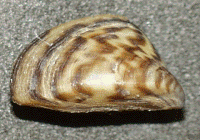


```{r}
spec_data <- all_species %>% filter(species == spec)

World_map +   geom_point(data = spec_data, aes(x = lon, y = lat, group = 1), size = 0.5) 
# + geom_density2d(data = spec_data, aes(x = lon, y = lat, group = 1))


```

Figure ++. Worldwide distribution of `r spec` accordingly to GBIF.


This is a typical fouling species settling on hard underwater substrates (Orlova, 2002) ^[Orlova, M. I. (2002). Dreissena (D.) polymorpha: evolutionary origin and biological peculiarities as prerequisites of invasion success. Dalam Invasive aquatic species of Europe. Distribution, impacts and management (hlm. 127–134). Springer.]. Adults are likely to be introduced on ship's bottoms (Orlova, 2002) ^[Orlova, M. I. (2002). Dreissena (D.) polymorpha: evolutionary origin and biological peculiarities as prerequisites of invasion success. Dalam Invasive aquatic species of Europe. Distribution, impacts and management (hlm. 127–134). Springer.]. In the case of detachment of adult mollusks from the ship's bottoms, they can re-establish themselves on natural and anthropogenic substrates of ship mooring areas. The important condition for this scenario could be realized is that a vessels should stay for quite a long time in water areas where dense settlements of this species are present, which will provide a sufficiently large number of larvae competent for settling. Such locations include many ports in Europe. However, ballast water, which may contain very small planktonic larvae of this species, seems to be the most likely route of introduction of this species (Orlova, 2002; Karatayev, 2007) ^[Orlova, M. I. (2002). Dreissena (D.) polymorpha: evolutionary origin and biological peculiarities as prerequisites of invasion success. Dalam Invasive aquatic species of Europe. Distribution, impacts and management (hlm. 127–134). Springer.] ^[Karatayev, A. Y., Padilla, D. K., Minchin, D., Boltovskoy, D., & Burlakova, L. E. (2007). Changes in global economies and trade: The potential spread of exotic freshwater bivalves. Biological Invasions, 9(2), 161–180. https://doi.org/10.1007/s10530-006-9013-9].  These clams actively spread in the northern direction: settlements of this clam in the rivers of the Northern Dvina basin are reliably known (Makhnovich, 2018; Travina et al. 2020) ^[Makhnovich, N. M. (2018). Characteristics of Dreissena polymorpha (Pallas, 1771) population in the estuary area of the Northern Dvina River. Problemy regionalnoj ecologii (in Russian), 2, 68–72. https://doi.org/10.24411/1728-323X-2018-12068] ^[Travina, O. V., Bespalaya, Y. V., Aksenova, O. V., Shevchenko, A. R., Sokolova, S. E., Kosheleva, A. E., & Ovchinnikov, D. V. (2020). Distribution and population density of Dreissena polymorpha (Pallas, 1771) in the peripheral part of the range. Rossijsky zhurnal biologicheskikh invzij (in Russian), 13(1), 61–71.] .

In the case of successful colonization, clams will be able to form settlements on natural hard substrates and hydro-technical constructions. The most likely places of settlement formation are pipelines associated with heated water. This can lead to reduced efficiency or equipment failure. 

The impact of these mollusks on the ecosystem is ambiguous (Karatayev, 2007) ^[Karatayev, A. Y., Padilla, D. K., Minchin, D., Boltovskoy, D., & Burlakova, L. E. (2007). Changes in global economies and trade: The potential spread of exotic freshwater bivalves. Biological Invasions, 9(2), 161–180. https://doi.org/10.1007/s10530-006-9013-9]. On the one hand, by increasing the structure complexity of the biotope, additional microbiotopes for native species (oligochaetes, crustaceans) may appear. On the other hand, filter mollusks may lead to a decrease in the abundance of phytoplankton. It is important that settlements of this species may lead to changes in the content of biogens in water (Karatayev, 2007) ^[Karatayev, A. Y., Padilla, D. K., Minchin, D., Boltovskoy, D., & Burlakova, L. E. (2007). Changes in global economies and trade: The potential spread of exotic freshwater bivalves. Biological Invasions, 9(2), 161–180. https://doi.org/10.1007/s10530-006-9013-9], which may significantly increase the phytobenthos development.

If the invasion of this species occurs, it seems apectedly to spread upstream of the Ob River, where, most likely, dense settlements will be formed.  


<!-- Species discription -->

```{r}

spec <- "Mya arenaria"
tax <- taxonomy %>% filter(scientificname == spec)

spec_full <- paste(spec, tax$authority)

```

##### *`r spec_full`*


**Phyllum:**`r tax$phylum`   
**Class:** `r tax$class`    
**Order:** `r tax$order`    
**Family:** `r tax$family`   
`

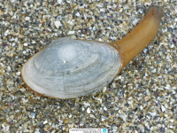


```{r}
spec_data <- all_species %>% filter(species == spec)

World_map +   geom_point(data = spec_data, aes(x = lon, y = lat, group = 1), size = 0.5) 
# + geom_density2d(data = spec_data, aes(x = lon, y = lat, group = 1))


```

Figure ++. Worldwide distribution of `r spec` accordingly to GBIF.


Despite the fact that this species successfully colonizes the cold estuaries of Alaska (Powers et al., 2006) ^[Powers, S. P., Bishop, M. A., Grabowski, J. H., & Peterson, C. H. (2006). Distribution of the invasive bivalve Mya arenaria L. on intertidal flats of southcentral Alaska. Journal of Sea Research, 55(3), 207–216. https://doi.org/10.1016/j.seares.2005.10.004], it is more likely to belong to the marine fauna. So its invasion, if it occurs, will expectedly be associated with deep-water areas where more dense sea water enters. 

This burrowing in muddy sediments bivalve feeds on suspended benthic organic particles. In the White Sea, where temperature conditions are close to the Arctic seas, this species may show high abundance (Gerasimova et al., 2021) ^[Gerasimova, A. V., Maximovich, N. V., Filippova, N. A., Filippov, A. A., & Malova, D. S. (2021). Bivalve Mya arenaria L. as a model object in demecology: dynamics of bed structure, mortality and growth in the Kandalaksha Bay of the White Sea. Hydrobiologia, 848(19), 4511–4533. https://doi.org/10.1007/s10750-021-04658-y]. In the Black Sea, where this species has recently introduced, the formation of dense aggregations of this species has led to some changes in sedimentation patterns (Zolotarev, 1996) ^[Zolotarev, V. (1996). The Black Sea ecosystem changes related to the introduction of new mollusc species. Marine Ecology, 17(1-3), 227–236. https://doi.org/10.1111/j.1439-0485.1996.tb00504.x]. Through burrowing activity, these molluscs may contribute to sediment aeration and slow the formation of hydrogen sulfide in bottom sediments (Hansen et al., 1996) ^[Hansen, K., King, G. M., & Kristensen, E. (1996). Impact of the soft-shell clam Mya arenaria on sulfate reduction in an intertidal sediment. Aquatic Microbial Ecology, 10(2), 181–194. https://doi.org/10.3354/ame010181], positively affecting the infauna.  Therefore, there is no reason to predict a significant negative impact of this species on the Ob estuary ecosystem. 


<!-- Species discription -->

```{r}

spec <- "Potamopyrgus antipodarum"
tax <- taxonomy %>% filter(scientificname == spec)

spec_full <- paste(spec, tax$authority)

```

##### *`r spec_full`*


**Phyllum:**`r tax$phylum`   
**Class:** `r tax$class`    
**Order:** `r tax$order`    
**Family:** `r tax$family`   


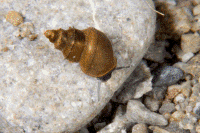


```{r}
spec_data <- all_species %>% filter(species == spec)

World_map +   geom_point(data = spec_data, aes(x = lon, y = lat, group = 1), size = 0.5) 
# + geom_density2d(data = spec_data, aes(x = lon, y = lat, group = 1))


```


Figure ++. Worldwide distribution of `r spec` accordingly to GBIF.

The most probable way of introdction of this species is with billast water. However, due to the fact that this species well tolerates passage through the digestive tract of birds (The most dangerous invasive species..., 2018) ^[Dgebuadze, Y. Y., Petrosyan, V. G., & Khlyap, L. A. (Ed.). (2018). The most dangerous invasive species of Russia (TOP-100) (in Russian) (hlm. 688). KMK Scientific Press.], natural introduction of this species is also possible. However, in the development of this scenario, the spread of the species will take place, rather, from the upper Ob-Yenisei system. In the case of formation of *Dreissena polymorpha* populations in the Ob estuary, it will be able to actively colonize this biotope (The most dangerous invasive species..., 2018) ^[Dgebuadze, Y. Y., Petrosyan, V. G., & Khlyap, L. A. (Ed.). (2018). The most dangerous invasive species of Russia (TOP-100) (in Russian) (hlm. 688). KMK Scientific Press.]. There is no reliable basis for predicting the consequences (both negative and positive) of the invasion of this species. 


<!-- Species discription -->

```{r}

spec <- "Marenzelleria" 
tax <- taxonomy %>% filter(scientificname == spec)

spec_full <- paste(spec, tax$authority)

```

##### *`r spec_full`*


**Phyllum:**`r tax$phylum`   
**Class:** `r tax$class`    
**Order:** `r tax$order`    
**Family:** `r tax$family`   

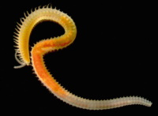


```{r}
spec_data <- all_species %>% filter(species == spec)

World_map +   geom_point(data = spec_data, aes(x = lon, y = lat, group = 1), size = 0.5) 
# + geom_density2d(data = spec_data, aes(x = lon, y = lat, group = 1))


```

Figure ++. Worldwide distribution of `r spec` accordingly to GBIF.

De facto worms of this genus already occur and are very abundant in the Ob Estuary (Integrated investigations… 2020) ^[Integrated investigations of ecological conditions in the Ob Estuary in the area of potential influence of the Progect "Arctic LNG 2" and on the adjacent area. (2020).].  However, without a detailed genetic analysis, only one species, *M.wireni*, noted in previous studies (Galkin et al. 2010) ^[Galkin, S. V., Kucheruk, N. V., Minin, K. V., Raysky, A. K., & Goroslavskaya, E. I. (2010). Macrobenthos of the Ob River Estuary Zone and Adjacent Areas of the Kara Sea. Okeanologija (in Russian), 50(5), 837–841.], cannot be confidently asserted to be represented in the Obi Estuary. 
 
 These polychaetes were not noted in early studies of the zoobenthos of the Ob Estuary (Stepanova et al. 2011) ^[Stepanova, V. B. (2017). Fish feeding in the Gulf of Ob in the Kara Sea during the ice season. Vestnik rybokhozajstvennoj nauki (in Russian), 4(4), 94–100.]. However, worms of this genus were already encountered in 1993 (Galkin et al. 2010) ^[Galkin, S. V., Kucheruk, N. V., Minin, K. V., Raysky, A. K., & Goroslavskaya, E. I. (2010). Macrobenthos of the Ob River Estuary Zone and Adjacent Areas of the Kara Sea. Okeanologija (in Russian), 50(5), 837–841.] and were among the guiding forms, but only at one station located much more northward than stations where these forms were abundant in later surveys (Integrated investigations… 2020) ^[Integrated investigations of ecological conditions in the Ob Estuary in the area of potential influence of the Progect "Arctic LNG 2" and on the adjacent area. (2020).]. These data indirectly indicate an expansion of the area populated by this species and an increase in its abundance in the area. Considering that species of the genus *Marenzelleria* show active invasion in the Baltic and North Sea (Kauppi et al., 2015) ^[Kauppi, L., Norkko, A., & Norkko, J. (2015). Large-scale species invasion into a low-diversity system: spatial and temporal distribution of the invasive polychaetes Marenzelleria spp. in the Baltic Sea. Biological Invasions, 17(7), 2055–2074. https://doi.org/10.1007/s10530-015-0860-0], we can assume that the presence of these polychaetes in the Ob estuary is the result of relatively recent colonization.  

The presence of *Marenzelleria* may lead to a marked stimulation of sulfate reduction and degradation of organic matter (Quintana et al., 2013) ^[Quintana, C. O., Kristensen, E., & Valdemarsen, T. (2013). Impact of the invasive polychaete Marenzelleria viridis on the biogeochemistry of sandy marine sediments. Biogeochemistry, 115(1-3), 95–109. https://doi.org/10.1007/s10533-012-9820-2].

