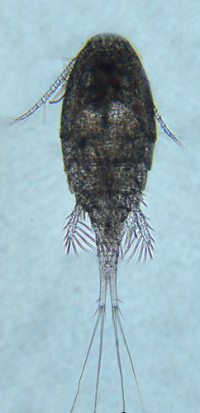

---
output:
  word_document:
    reference_docx: Report_structure.docx
    fig_width: 8
    fig_height: 8
bibliography: invasive_species_Ob_estuary.bib
csl: my_csl2.csl

---

```{r setup, include=FALSE}
library(knitr)
opts_chunk$set(echo = FALSE, message = FALSE, warning = FALSE)
```


```{r packages}
library(dplyr)
library(ggplot2)
library(cowplot)


theme_set(theme_bw())

setwd("D:/Text/Article/Articles_in_progress/Obskaya bay invasive species/R_calc_for_invasive_species")
```


```{r}

# Загрузка данных с координатами встреч видов
library(dplyr)


benthic_species <- read.csv("Data/benthos_occurence_all_final.csv")
benthic_species <- benthic_species[,-1] 

Plankton_species <- read.csv("Data/plancton_occurence_all_final.csv")

benthic_species$Group <- "Benthos"
Plankton_species$Group <- "Plankton"

all_species <- rbind(benthic_species, Plankton_species)

all_species$lon <- as.numeric(all_species$lon)
all_species$lat <- as.numeric(all_species$lat)


```


## Discription of most expected invasive species


```{r}
taxonomy <- read.csv("Data/taxonomy.csv")
```


### Plankton
<!-- Species discription -->

```{r}

spec <- "Acanthocyclops robustus"
tax <- taxonomy %>% filter(scientificname == spec)

spec_full <- paste(spec, tax$authority)

```

##### *`r spec_full`*

**Phyllum:**`r tax$phylum`   
**Class:** `r tax$class`    
**Order:** `r tax$order`    
**Family:** `r tax$family`   




Figure ++. Worldwide distribution of `r spec` accordingly to GBIF.

*A. robustus* is temperate freshwater species, which is numerous in European lakes, ponds and estuaries (Purasjoki, Viljamaa, 1984; Gonçalves et al., 2012) ^[Purasjoki, K., & Viljamaa, H. (1984). Acanthocyclops robustus (Copepoda, Cyclopoida) in plankton of the Helsinki sea area, and a morphological comparison between A. robustus and A. vernalis. Finnish Mar. Res, 250, 33–44.] ^[Gonçalves, A. M., Pardal, M. Â., Marques, S. C., Mendes, S., Fernández-Gómez, M. J., Galindo-Villardón, M. P., & Azeiteiro, U. M. (2012). Responses of Copepoda life-history stages to climatic variability in a Southern-European temperate estuary. Zoological Studies, 51(3), 321–335.].  This species dominates in the freshwater zone of Schelde estuary (Belgium, Netherlands), which is strongly influenced by human activity and characterized by a high load of organic matter as well as toxic substances (Tackx et al., 2004) ^[Tackx, M. L., De Pauw, N., Van Mieghem, R., Azémar, F., Hannouti, A., Van Damme, S., … Meire, P. (2004). Zooplankton in the Schelde estuary, Belgium and The Netherlands. Spatial and temporal patterns. Journal of Plankton research, 26(2), 133–141.]. This species was found to be little affected by environmental gradients, so it must be capable to establish in areas with high variability of environmental parameters, which is typical for Ob Estuary. *A. robustus* was also regularly documented near Helsinki, in area, highly affected by human activity (Purasjoki, Viljamaa, 1984) ^[Purasjoki, K., & Viljamaa, H. (1984). Acanthocyclops robustus (Copepoda, Cyclopoida) in plankton of the Helsinki sea area, and a morphological comparison between A. robustus and A. vernalis. Finnish Mar. Res, 250, 33–44.]. *A. robustus* was documented in waters along Norwegian coast up to Kola peninsula (Fig. +++). This predator, being established, could affect local ecosystem, feeding on local organisms, which do not have behavioral adaptations to this new species. In a perspective, this invasion can lead to significant decrease of populations of prey organisms (Rotifera and small Diplostraca).

