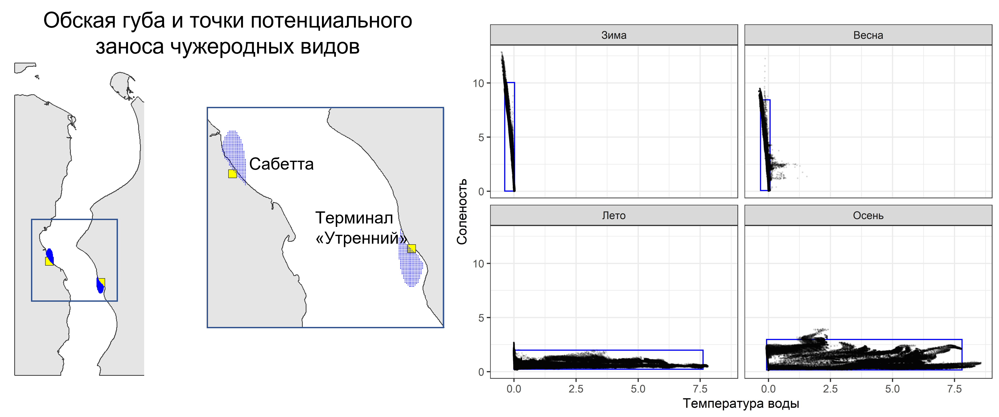
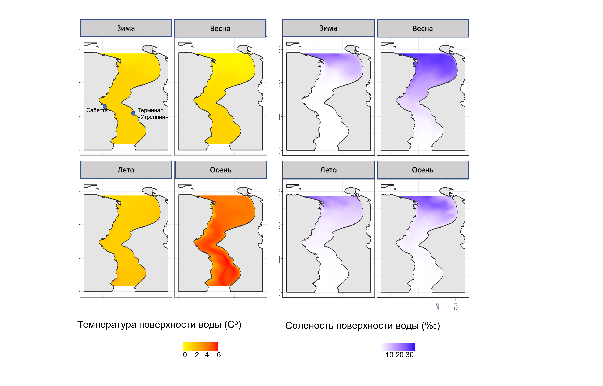
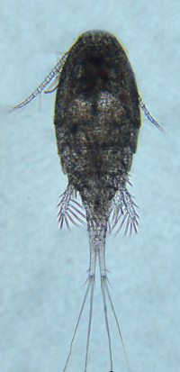

---
output:
  word_document:
    reference_docx: Report_structure.docx
    fig_width: 8
    fig_height: 8
bibliography: invasive_species_Ob_estuary.bib
csl: gost-r-7-0-5-2008.csl
---


```{r setup, include=FALSE}
library(knitr)
opts_chunk$set(echo = FALSE, message = FALSE, warning = FALSE)
```


```{r packages}
library(lubridate)
library(dplyr)
library(ggplot2)
library(cowplot)
library(vegan)
library(e1071)
library(ggmap)
library(tidyverse)
library(ggrepel)
library(reshape2)
library(flextable)
library(patchwork)
library(magick)


theme_set(theme_bw())
```


## 2.1	Морская биота
### 2.1.1	Общая схема анализа
Примененный подход близок к реализованному в недавних оценках [@Goldsmit2020; @miralles2021if]. Однако, мы были вынуждены значительно упростить подход из-за недостатка гидробиологических данных.

Для надежного прогнозирования рисков вселения чужеродных видов необходима система мониторинга. Такой системы в описываемой акватории пока нет. Исторические данные о морской биоте Обской губы скудны и не дают основы для построения анализа, подобного тому, который представлен в работе @Goldsmit2020. Поэтому единственно возможным способом является метаанализ опубликованных данных.

Применяемый подход прост по своей методологии и воспроизводим. Подход основан на четырех ключевых положениях:
1. Описание экологических лицензий района (в терминологии П. В. Озерского  [@Ozerskii2011]).
2. Определение наиболее полного набора видов, потенциально способных к инвазии.
3. Оценка параметров экологических ниш потенциальных инвазивных видов.
4. Формирование списка видов путем сравнения их ниш и экологических лицензий данного района.

Следует принять во внимание некоторые ограничения в отношении подхода, который мы применили.

— Прежде всего, был составлен список потенциально чужеродных видов. Анализ предоставляет только информацию о том, какие виды можно было бы ожидать в качестве чужеродных, при отсутствии каких-либо свидетельств инвазий.

— Во-вторых, невозможно сделать вывод о том, когда и как этот ожидаемый чужеродный вид будет занесен в зону проекта: произойдет его занос с балластными воды или на биообрастании корпуса.

— В-третьих, примененный подход не позволяет предсказать, какие аборигенные виды Обской губы потенциально могут быть вывезены за пределы района и, таким образом, стать инвазивными видами в других районах, с которыми будет судовое транспортное сообщение.

— И, наконец, наш подход основан на анализе экологических характеристик Обской губы: солености и температуры воды. Последние могут измениться из-за процессов глобального потепления. Мы рассматривали диапазон условий, расширенный по сравнению с наблюдениями (например, диапазон температур был взят шире, чем наблюдаемый диапазон). Таким образом, изменения, потенциально связанные с потеплением океана, были неявно включены в анализ. Однако нельзя гарантировать отсутствие каких-либо других сценариев проникновения чужеродных видов, основанных на неожиданных изменениях экологических условий района исследования (например, из-за антропогенных изменений гидрологических условий в регионе) или экологической пластичности и адаптивной способности видов.

Информация о местных видах бентоса и зоопланктона была взята из отчета по комплексным исследованиям Обской губы (**ИЭПИ, 2021 Нужны библиографические описания всех отчетов за 2022, 2023** ). В анализ включали те формы аборигенных видов, которые были определены на уровне вида. Поскольку в нашу задачу входило наиболее полная характеристика видов, которые потенциально могут осваивать экологическую лицензию акваторий, прилежащих к портам, мы не исключали из анализа также и морские нативные виды, встречающиеся в северной, осолоненной, части акватории.  


## Гидрологические условия в районе портов
Для характеристики гидрологических условий акватории были использованы два источника данных. Во-первых, были использованы данные предсказаний модели INMOM. Гидродинамическая модель была построена на основе хорошо протестированной российской универсальной трехмерной σ-модели морской и океанической циркуляции INMOM (Institute of Numerical Mathematics Ocean Model), которая была создана в Институте вычислительной математики Российской академии наук (ИВМ РАН) [@diansky2013]. Следует отметить, что сложная вертикальная структура течений Обской губы делает практически невозможным использование упрощенных двумерных моделей для расчета термогидродинамических характеристик залива без учета стратификации плотности, даже несмотря на его относительную мелководность. Для корректного воспроизведения плотностной стратификации Обской губы использование трехмерных гидротермодинамических моделей полностью оправдано.

Модель INMOM хорошо зарекомендовала себя при решении практических задач расчета гидрологических характеристик в различных морях России, а также в международных проектах. Глобальные версии INMOM служат океаническими блоками в различных версиях модели земной системы Института численной математической модели климата (INMCM)[@volodin2017simulation], созданной в ИВМ РАН и участвующей в программе прогнозирования изменения климата под эгидой МГЭИК (Межправительственная группа экспертов по изменению климата) в рамках проектов CMIP (Coupled Model Intercomparison Project). Модель INMOM также принимала участие в программе CORE II (Coordinated Ocean-ice Reference Experiments, фаза II) по изучению циркуляции Мирового океана и его изменчивости на основе мультимодельного подхода[@danabasoglu2014north].

Модель INMOM была успешно использована для изучения циркуляции западных морей Российской Арктики, включая Обскую губу, и других морей Российской Федерации [@diansky2014simulation; @diansky2015modelling; @diansky2015asesment; @diansky2020system].

Для верификации модели INMOM были использованы данные океанографических съемок, проведенных в районе Проекта “Арктик СПГ 2” и Морского канала в северной части Обской губы. Данные измерений текущих скоростей и уровня моря были получены от Заказчика. Данные охватывают период с 2012 по 2020 год, исключая 2014, 2016, 2018, 2019 годы. Измерения проводились в основном весной, летом и осенью.

В глобальном масштабе суда широко признаны основным переносчиком водных инвазивных видов с субвекторами, такими как балластные воды, балластные отложения, биообрастание корпуса, биообрастание внутренних резервуаров, углублений в корпусах кораблей и внутренних систем трубопроводов для морской воды (по @miralles2021if). Несмотря на то, что все суда различны с точки зрения риска переноса с различиями в захвате, переносе и выпуске видов [@davidson2018history], анализ рисков и управленческие действия по сокращению распространения видов, опосредованных судами, часто ограничены районами портов (например, @miralles2021if). Для целей настоящего отчета считается, что район порта, по-видимому, является наиболее вероятным районом вселения чужеродных видов. Портовая зона (включая зоны якорных стоянок) испытывает наиболее интенсивное движение судов, здесь формируются специальные искусственные рифовые среды обитания, а местные сообщества адаптируются к растущей антропогенной нагрузке  [@tamburini2021monitoring]. Таким образом, мы используем экологическое состояние этих районов для прогнозирования инвазий.

Модель позволила учесть значения двух ключевых гидрологических параметров (температуры воды и солености) в районах, расположенных вблизи действующего порта “Сабетта” и строящегося терминала “Утренний” (Рисунок +++).

T-S диаграммы (Рис. ++) показывают, что в районе портов зимой и весной присутствует холодная, осолоненная вода. Cоленость в данный период варьирует в пределах 0, 12.9 промилле, а температура в пределах -0.5, 1.6 градуса.





В летний и осенний период осолонение незначительное, но при этом наблюдается значительный прогрев воды. В этот период соленость варьирует в пределах 0.1-4 промилле, а температура: -0.1-8.6

Наиболее прогретая водная масса представлена в акватории в осенний период. Именно этот период следует считать наиболее опасным с точки зрения вероятности заноса видов из умеренных широт.


Для описания границ “экологической лицензии” биотопа [@Ozerskii2011] который может быть потенциально заселен NIS, были вычислены пределы солености и температуры в акватории, прилегающей к районам портов, как значения 0.5% и 99.5% квантилей каждого из параметров (Таблица ++). На рисунке +++ эти границы обозначены прямоугольниками.

Таблица ++. Максимальные и минимальные значения солености, определяющие экологическую лицензию акватории

| Время года | Нижнее значение солености | Верхнее значение солености | Нижнее значение температуры воды | Верхнее значение температуры воды |
|------------|---------------------------|----------------------------|----------------------------------|-----------------------------------|
| Зима       | 0.02                      | 10.04                      | -0.37                            | 0.02                              |
| Весна      | 0.07                      | 8.44                       | -0.32                            | 0.07                              |
| Лето       | 0.23                      | 1.99                       | -0.01                            | 7.62                              |
| Осень      | 0.16                      | 2.97                       | -0.07                            | 7.80                              |


Полученные значения ограничивают гидрологические условия, которые могу быть предоставлены акваторией для вселения NIS в настоящее время в районе портов, как наиболее вероятных областей вселения NIS. Однако, согласно прогнозам развития климатических изменений (https://interactive-atlas.ipcc.ch/), температура поверхности океана в районе Российской Арктики будет постепенно повышаться (приблизительно на 2 градуса за столетие). Стало быть границы экологической лицензии по оси температуры будут смещаться с сторону большей температуры, что будет расширять возможности вселения NIS в будущем.

Значения температуры воды закономерно увеличиваются по мере удаления от устья Обской губы вверх по течению (Рис. ++). Соленость в акватории испытывает сезонные колебания (Рис. ++). Наиболее высокая соленость наблюдается весной, когда язык саленой воды заходит далеко вверх по течению.




## Отбор потенциальных NIS

Для поиска потенциальных NIS (PNIS) было использовано пять источников информации.

1. Мы руководствовались изданием “Инвазионные виды России” (http://www.sevin.ru/top100worst/index.html ). По матералам этого издания мы выбрали те виды PNIS, которые описаны, как самые активные вселенцы в морских, солоноватоводных и пресных водоемов.

2. Для расширения списка PNIS был сделан запрос из Глобальной базы данных инвазивных видов (Global invasive species database) Международного союза охраны природы (МСОП) http://www.iucngisd.org/gisd/. Из этой базы были извлечены названия пресноводных, солоноватоводных и морских бентосных и планктонных форм, которые были зарегистрированы, экспертами, модерирующими базу данных, как виды-вселенцы.

3. Поскольку в двух указанных базах данных были приведены лишь виды, которые уже проявили себя как вселенцы, то мы расширили поиск потенциальных чужеродных видов среди тех форм, которые потенциально могли бы занять эту нишу. Как было показано выше, наиболее вероятным источником заноса чужеродных видов является Западная Европа. Мы проанализировали планктонную фауну эстуариев Западной Европы, где расположено большинство портов назначения и выбрали виды-эврибионты с наиболее северным ареалом, которые затем были включены в анализ потенциальных чужеродных видов в Обской губе. Кроме того, в анализ был включен один вид (планктонный вид веслоногих ракообразных *Acartia bifilosa*), который упоминается как распространенный элемент сезонного планктонного сообщества Белого и Балтийского морей, поскольку условия в этих морях могут быть похожи на эстуарий Оби. Этот вид не был включен в базу данных “Инвазионные виды России”, но там упоминается другой вид, *Acartia tonsa*. Поскольку в случае идентификации планктона возможны таксономические разногласия, мы включили в анализ оба вида.

4. В 2021, 2022 и 2023 гг. были проведены исследования ДНК, выделенной из балластных вод судов, курсирующих в Обской губе. Использование баркодинговых маркеров позволило идентифицировать несколько видов, чья ДНК присутствовала в балластных водах. В одном случае разрешающая способность метода не позволила однозначно найти соответствие полученных сиквенсов ни одному из видов рода *Cylichna* (Gastropoda, Opistobranchia). Поэтому в число PNIS мы включили два вида этого рода (*C.occulta* и *C.alba*), которые наиболее часто встречаются в северных морях.

(5) Наконец, к числу NIS мы условно отнесли веслоногого рачка *Eurytemora velox*, который при интенсивных исследованиях планктона, проведенных в 2019-2020 гг., ни разу не был отмечен в пробах. Однако ранее этот вид уже был отмечен в акватории Обской губы: первые его находки в районе порта Сабетта были сделаны в 2015 г. [@ermolaeva2015]. В сборах планктона 2022-2023 гг. этот вид в районе порта Сабетта был уже достаточно обилен (**Отчет 2023**). Данный вид мы будем использовать для тестирования работоспособности примененного метода отбора PNIS. Если логика метод верна, то параметры экологической ниши данного вида должны соответствовать критериям отбора PNIS, примененного в данном исследовании.


```{r}
all_species <- read.csv("Data/All_species_ecology.csv")

all_species$Lon <- as.numeric(all_species$Lon)

all_species$Status <- factor(all_species$Status, levels = c("Native", "PNIS", "DNA_PNIS" ))

all_species <-
all_species %>% 
  mutate(Group_rus = case_when(Group == "Benthos" ~ "Зообентос",
                                Group == "Plancton" ~ "Зоопланктон",
                                Group == "Phytoplancton" ~ "Фитопланктон",
                               Group == "Protista" ~ "Планктонные протисты"))


# unique(all_species$Status)

# native_species_benthos <- 
#                   c("Limnodrilus hoffmeisteri", 
#                     "Mysis relicta",
#                     "Halicryptus spinulosus",
#                     "Saduria entomon",
#                     "Saduria sabini",
#                     "Saduria sibirica",
#                     "Gammaracanthus lacustris",
#                     "Gammaracanthus",
#                     "Monoporeia affinis",
#                     "Pontoporeia femorata",
#                     "Portlandia aestuariorum",
#                     "Marenzelleria",
#                     "Ampharete vega",
#                     "Mysis oculata"
#                     )
# 
# exclude <- 
#   all_species %>% 
#   filter(Status  == "Native" & Group == "Benthos" & !species %in% native_species_benthos) %>% 
#   pull(species) %>% 
#   unique()
# 
# all_species <- 
#   all_species %>% 
#   filter(!species %in% exclude)


PNIS <- 
  all_species %>% 
  filter(Status %in% c("PNIS", "DNA_PNIS"))
  
```


## Селекция видов на основе парметров экологических ниш

Используя все источники информации был создан единый список видов, которые далее будут обозначаться как потенциальные виды-вселенцы (Potentialy Non Indigenous Species, **PNIS**). Всего в этот long list PNIS вошло `r PNIS %>%  select(species) %>% unique %>% nrow`  вида.

Для сравнения в анализ были включены представители зоопланктона, фитопланктона и зообентоса, которые были идентифицированы до видового уровня при исследованиях, проведенных в 2019, 2020, 2021, 2022 и 2023 гг (**ссылка на Отчеты ++++ **). Далее местные виды будут обозначаться как нативные, или аборегенные (Native).

```{r}
all_species %>%
  select(species, Status, Group_rus) %>% 
  unique() %>% 
  group_by(Status, Group_rus) %>% 
  summarise(N = n()) %>% 
  dcast(Group_rus ~ Status) %>% 
  kable(caption = "Таблица ++. Количество нативных и потенциально инвазивных видов среди разных экологических групп",
        col.names = c("Экологическая группа",	"Нативные",	"PNIS",	"Обнаружена ДНК в балластных водах"))

  

```


Для всех этих видов, как PNIS, так и нативных форм, используя базу GBIF (https://www.gbif.org/) были получены координаты локаций, где эти виды были обнаружены всеми поставщиками данных этой базы. Всего была получена информация о `r nrow(all_species)` уникальных локациях (Рис. +++).


Для количественной оценки вероятности вселения PNIS в условия Обской губы мы ввели показатель, который оценивает вероятность вселения данного вида в акваторию Обской губы ($P_{invasion}$). Для вычисления этого показателя мы оценили количество локаций, полученных из базы GBIF, для которых соленостно-температурные условия приблизительно соответствуют экологической лицензии акватории Обской губы (Соленость:0-10 промилле, Температура 0-10 градусов). Эта величина была отнесена к общему количеству локаций (отмеченных для данного вида в базе GBIF), для которых была проведена оценка солености и температуры. Значения этих показателей для PNIS приведены в таблице ++.

```{r}
df_PNIS_print <- 
  PNIS %>% 
  group_by(species, Status, Group_rus) %>% 
  summarise(N_occ_in_env = sum(Temp <= 10 & Sal <= 10), N_occ_total = n(), P_inv = round(N_occ_in_env / N_occ_total, 3)) %>% 
  arrange(desc(N_occ_total))


# 
# 
# kable(df_PNIS_print, 
#       caption = "Таблица ++. Оценка вероятности попадания потенциальных видов-вселенцев (PNIS) в эстуарий Обской губы.",
#       col.names = c("Виды", "Статус", "ЭКологическая группа", "Количество ссылок в базе данных GBIF с параметрами окружающей среды, близкими к экологической лицензии акватории", "общее количество ссылок в базе данных GBIF", "$P_{invasion}$")
#       )


```


```{r}
footnote_line <-
  which(df_PNIS_print$species == "Eurytemora velox")

footnote_line2 <-
  which(df_PNIS_print$Status == "DNA_PNIS")


ft <- flextable(df_PNIS_print)

header <- c("Виды", "Статус", "Экологическая группа", "Количество ссылок в базе данных GBIF с параметрами окружающей среды, близкими к экологической лицензии акватории", "общее количество ссылок в базе данных GBIF", "P")

ft <- 
  ft %>% 
  set_header_labels(values = header) %>% 
  footnote(i = footnote_line, j = 2,
  value = as_paragraph("Вид Eurytemora velox не был отмечен в составе зоопланктона в 2019-2020 гг, но позднее продемонстрировал вспышку обилия, мы условно включили этот вид в список PNIS для проверки работоспособности предложенной методики отбора видов"),
  ref_symbols = c("*")
  )

ft <- 
  ft %>% 
  footnote(i = footnote_line2, j = 2,
  value = as_paragraph("Потенциальные виды-вселенцы, чья ДНК была обнаружена в балластных водах"),
  ref_symbols = c("**")
  )

ft <- 
  ft %>% 
  colformat_num(big.mark = "")

ft <- 
  ft %>% 
  set_caption("Таблица ++. Оценка вероятности попадания потенциальных видов-вселенцев (PNIS) в эстуарий Обской губы.")

ft
# autofit(ft)

```


```{r}
PNIS_short <- 
  df_PNIS_print %>% 
  filter(N_occ_total > 10 & P_inv > 0.05)
  
```


Для создания сокращенного списка видов мы включили в дальнейший анализ только те PNIS, для которых в базе GBIF было найдено более 10 записей точек встречи. Для видов с меньшим количеством встреч оценки вероятности попадания в диапазон экологической лицензии Обской губы будут недостоверны из-за высокой статистической ошибки, вызванной малым объемом данных. Среди оставшихся видов мы отобрали те формы, у которых величина $P_{invasion}$ была выше 0.05 (5%). Всего было выделено 18 видов, удовлетворяющих этим условиям. 

Большинство из этих видов - это бентосные форм (Таблица ++). Также в число потенциальных вселенцев попадают 4 вида планктонных животных и 1 вид фитопланктона, а также 1 вид планктонных протист, обнаруженный в балластных водах при изучении выделенной оттуда ДНК.

```{r}
options(knitr.kable.NA = '')

PNIS_short %>% 
  group_by(Status, Group_rus) %>% 
  summarise(N = n()) %>% 
  dcast(Group_rus ~ Status) %>% 
  kable(caption = "Таблица ++. Количество видов наиболее вероятных PNIS среди разных экологических групп организмов", 
        col.names = c("Экологическая группа", "Число видов PNIS", "Число видов PNIS, чья ДНК была обнаружена в балластных водах") )
  
# write.table(PNIS_short, "clipboard", sep = "\t", row.names = F)

```

Важно отметить, что для *Eurytemora velox* величина, характеризующая вероятность попадания в экологическую лицензию Обской губы составляет $P_{invasion}$ = 0.185. Этот вид не является интродуцентом [@sukhikh2024resettlement], однако попадание этого види в шорт-лист PNIS дает основание полагать, что аборигенные виды способные давать внезапные вспышки численности, имеют экологические характеристики соответствующие критериям отбора PNIS, примененным в данной работе. 


## Описание наиболее вероятных инвайдеров


```{r}
world <- map_data("world")


 World_map <- 
  ggplot(world, aes(x=long, y=lat, group=group)) +
  geom_polygon(fill = "gray70") + 
  coord_map(xlim = c(-180, 180), ylim = c(-50, 90) ) +
  theme_bw() +  
  theme(axis.title.x = element_blank(),  axis.title.y = element_blank(), plot.background = element_blank(),  panel.grid = element_blank()) + 
  theme(axis.text.x =element_blank(), axis.text.y= element_blank()) + 
  theme(axis.ticks = element_blank()) 
 # +
 #   geom_point(data = hotspot, aes(x = Lon, y = Lat, group = 1), size = 1, fill = "yellow", shape = 21, color = "black")

```


```{r}
taxonomy <- read.csv("Data/taxonomy_PNIS.csv")
```


### Планктонные протисты


<!-- ############################ -->

```{r}

spec <- "Thraustochytrium aureum"
tax <- taxonomy %>% filter(scientificname == spec)

spec_full <- paste(spec, tax$authority)

```

##### *`r spec_full`*

**Phyllum:**`r tax$phylum`   
**Class:** `r tax$class`    
**Order:** `r tax$order`    
**Family:** `r tax$family`   

<!-- ```{r} -->
<!-- Pl_spec <- image_read("Figure/Cercopagis.jpeg") %>% -->
<!--   image_ggplot() -->
<!-- ``` -->


<!--  -->


```{r fig.cap="Рисунок ++. Распространение `r spec`, согласно базе данных GBIF, и частотное распределение значений температуры и солености, при которых встречается данный вид. Вертикальные линии отсекают диапазон экологической лицензии акватории Обской губы."}

spec_data <- all_species %>% filter(species == spec)

Pl_map <-
World_map +   geom_point(data = spec_data, aes(x = Lon, y = Lat, group = 1), size = 1, color = "red") 
# + geom_density2d(data = spec_data, aes(x = lon, y = lat, group = 1))

Pl_temp <-
  ggplot(spec_data, aes(x = Temp)) + 
  geom_density(fill = "gray") + 
  geom_vline(xintercept = 10, color = "red", linetype = 2, linewidth = 1) +
  labs(x = "Температура", y = "Вероятность встречи")

Pl_sal <-
  ggplot(spec_data, aes(x = Sal)) + 
  geom_density(fill = "gray") + 
  geom_vline(xintercept = 10, color = "red", linetype = 2, linewidth = 1) +
  labs(x = "Соленость", y = "Вероятность встречи")

Pl_data <-
  Pl_map/(Pl_temp + Pl_sal)

Pl_data

```

Это единственный представитель организмов, чья ДНК была отмечена в балластных водах, и который способен по своим характеристикам вселиться в акваторию Обской губы. Количество ДНК этого вида невелико (1.18% от общего количества амплифицированных молекул, **Отчет ++++ 2023**).Биология этих организмов иизучена плохо.


#### Фитопланктон


<!-- ############################ -->

```{r}

spec <- "Didymosphenia geminatum"
tax <- taxonomy %>% filter(scientificname == spec)

spec_full <- paste(spec, tax$authority)

```

##### *`r spec_full`*

**Phyllum:**`r tax$phylum`   
**Class:** `r tax$class`    
**Order:** `r tax$order`    
**Family:** `r tax$family`   

```{r}
Pl_spec <- image_read("Figure/Didymosphenia_geminata.jpg") %>%
  image_ggplot()
```


<!--  -->


```{r fig.cap="Рисунок ++. Распространение `r spec`, согласно базе данных GBIF, и частотное распределение значений температуры и солености, при которых встречается данный вид. Вертикальные линии отсекают диапазон экологической лицензии акватории Обской губы."}

spec_data <- all_species %>% filter(species == spec)

Pl_map <-
World_map +   geom_point(data = spec_data, aes(x = Lon, y = Lat, group = 1), size = 1, color = "red") 
# + geom_density2d(data = spec_data, aes(x = lon, y = lat, group = 1))

Pl_temp <-
  ggplot(spec_data, aes(x = Temp)) + 
  geom_density(fill = "gray") + 
  geom_vline(xintercept = 10, color = "red", linetype = 2, linewidth = 1) +
  labs(x = "Температура", y = "Вероятность встречи")

Pl_sal <-
  ggplot(spec_data, aes(x = Sal)) + 
  geom_density(fill = "gray") + 
  geom_vline(xintercept = 10, color = "red", linetype = 2, linewidth = 1) +
  labs(x = "Соленость", y = "Вероятность встречи")

Pl_data <-
  Pl_map/(Pl_temp + Pl_sal)

Pl_spec | Pl_data

```


С середины 1980-х годов *D. geminata* постепенно расширяет свой ареал. *D. geminata* может демонстрировать массовое цветение, которое  может негативно влиять на пресноводных рыб, растения и беспозвоночных [@kilroy2011arrival].


 


### Зоопланктон

<!-- ############################ -->

```{r}

spec <- "Acanthocyclops robustus"
tax <- taxonomy %>% filter(scientificname == spec)

spec_full <- paste(spec, tax$authority)

```

##### *`r spec_full`*

**Phyllum:**`r tax$phylum`   
**Class:** `r tax$class`    
**Order:** `r tax$order`    
**Family:** `r tax$family`   

```{r}
Pl_spec <- image_read("Figure/Acanthocyclops.png") %>%
  image_ggplot()
```


<!--  -->


```{r fig.cap="Рисунок ++. Распространение `r spec`, согласно базе данных GBIF, и частотное распределение значений температуры и солености, при которых встречается данный вид. Вертикальные линии отсекают диапазон экологической лицензии акватории Обской губы."}

spec_data <- all_species %>% filter(species == spec)

Pl_map <-
World_map +   geom_point(data = spec_data, aes(x = Lon, y = Lat, group = 1), size = 1, color = "red") 
# + geom_density2d(data = spec_data, aes(x = lon, y = lat, group = 1))

Pl_temp <-
  ggplot(spec_data, aes(x = Temp)) + 
  geom_density(fill = "gray") + 
  geom_vline(xintercept = 10, color = "red", linetype = 2, linewidth = 1) +
  labs(x = "Температура", y = "Вероятность встречи")

Pl_sal <-
  ggplot(spec_data, aes(x = Sal)) + 
  geom_density(fill = "gray") + 
  geom_vline(xintercept = 10, color = "red", linetype = 2, linewidth = 1) +
  labs(x = "Соленость", y = "Вероятность встречи")

Pl_data <-
  Pl_map/(Pl_temp + Pl_sal)

Pl_spec | Pl_data

```


*A. robustus* - вид умеренного пояса, многочисленный в европейских пресных водах и эстуариях[@purasjoki1984acanthocyclops; @gonccalves2012responses]. Этот вид доминирует в пресноводной зоне эстуария Шельды (Бельгия, Нидерланды), которая находится под сильным антропогенным влиянием [@tackx2004zooplankton]. Было установлено, что этот вид крайне эврибионтен, поэтому он потенциально способен заселять районы с высокой изменчивостью экологических параметров, что характерно для Обского эстуария. *A. robustus* также регулярно регистрируется окрестностях Хельсинки, подверженных сильному антропогенному влиянию [@purasjoki1984acanthocyclops]. *A. robustus* отмечен в водах вдоль норвежского побережья вплоть до Кольского полуострова. Этот хищник,  может повлиять на местную экосистему, питаясь нативными организмами, которые не имеют поведенческих адаптаций к этому новому виду. В перспективе такое вторжение может привести к значительному сокращению популяций хищных организмов (Rotifera и мелких Diplostraca).


<!-- ############################ -->

```{r}

spec <- "Acartia bifilosa"
tax <- taxonomy %>% filter(scientificname == spec)

spec_full <- paste(spec, tax$authority)

```

##### *`r spec_full`*

**Phyllum:**`r tax$phylum`   
**Class:** `r tax$class`    
**Order:** `r tax$order`    
**Family:** `r tax$family`   

```{r}
Pl_spec <- image_read("Figure/Acartia.png") %>%
  image_ggplot()
```


```{r fig.cap="Рисунок ++. Распространение `r spec`, согласно базе данных GBIF, и частотное распределение значений температуры и солености, при которых встречается данный вид. Вертикальные линии отсекают диапазон экологической лицензии акватории Обской губы."}

spec_data <- all_species %>% filter(species == spec)

Pl_map <-
World_map +   geom_point(data = spec_data, aes(x = Lon, y = Lat, group = 1), size = 1, color = "red") 
# + geom_density2d(data = spec_data, aes(x = lon, y = lat, group = 1))

Pl_temp <-
  ggplot(spec_data, aes(x = Temp)) + 
  geom_density(fill = "gray") + 
  geom_vline(xintercept = 10, color = "red", linetype = 2, linewidth = 1) +
  labs(x = "Температура", y = "Вероятность встречи")

Pl_sal <-
  ggplot(spec_data, aes(x = Sal)) + 
  geom_density(fill = "gray") + 
  geom_vline(xintercept = 10, color = "red", linetype = 2, linewidth = 1) +
  labs(x = "Соленость", y = "Вероятность встречи")

Pl_data <-
  Pl_map/(Pl_temp + Pl_sal)

Pl_spec / Pl_data

```


*A. bifilosa* - эригалинный вид, обитающий в эстуариях Западной Европы [@autour1995comparative]. Может переносить соленость до 6-12 промилле и температуру до 0°C. Был найден в эстуариях Северной Европы. *A. bifilosa* - обычный компонент летнего планктонного сообщества в Белом море, предпочитает воды с низкой соленостью в эстуариях [@Prudkovsky]. *A. bifilosa* откладывает покоящиеся яйца, чтобы пережить неблагоприятные условия. Последний факт может способствовать переносу этого вида в балластных водах. *A. bifilosa* - в преимущественно растительноядный вид, но способен при недостатке фитопланктона питаться животной пищей [@martynova2011seasonal]. Это может привести к конкурентному давлению данного вида на аборигенные виды зооопланктона, питающиеся фитопланктоном. 


<!-- ############################ -->

```{r}

spec <- "Cercopagis pengoi"
tax <- taxonomy %>% filter(scientificname == spec)

spec_full <- paste(spec, tax$authority)

```

##### *`r spec_full`*

**Phyllum:**`r tax$phylum`   
**Class:** `r tax$class`    
**Order:** `r tax$order`    
**Family:** `r tax$family`   

```{r}
Pl_spec <- image_read("Figure/Cercopagis.jpeg") %>%
  image_ggplot()
```


<!--  -->


```{r fig.cap="Рисунок ++. Распространение `r spec`, согласно базе данных GBIF, и частотное распределение значений температуры и солености, при которых встречается данный вид. Вертикальные линии отсекают диапазон экологической лицензии акватории Обской губы."}

spec_data <- all_species %>% filter(species == spec)

Pl_map <-
World_map +   geom_point(data = spec_data, aes(x = Lon, y = Lat, group = 1), size = 1, color = "red") 
# + geom_density2d(data = spec_data, aes(x = lon, y = lat, group = 1))

Pl_temp <-
  ggplot(spec_data, aes(x = Temp)) + 
  geom_density(fill = "gray") + 
  geom_vline(xintercept = 10, color = "red", linetype = 2, linewidth = 1) +
  labs(x = "Температура", y = "Вероятность встречи")

Pl_sal <-
  ggplot(spec_data, aes(x = Sal)) + 
  geom_density(fill = "gray") + 
  geom_vline(xintercept = 10, color = "red", linetype = 2, linewidth = 1) +
  labs(x = "Соленость", y = "Вероятность встречи")

Pl_data <-
  Pl_map/(Pl_temp + Pl_sal)

Pl_spec / Pl_data

```

*C. pengoi* - хищный ветвичстоусый рак, способный снижать численность некоторых нативных видов зоопланктона, может конкурировать с местными видами хищных планктонных форм *C. pengoi* воздействует на сообщества зоопланктона Эстуарных экосистемах Рижского [@ojaveer2004population] и Финского заливов [@uitto1999distribution]  Балтийского моря, где его вселение коррелирует со снижением местных кладоцер *Bosmina coregoni maritime*, *Evadne nordmanni* и *Pleopsis polyphemoides* [@kotta2006ecological].

#### Зообентос


<!-- ############################ -->

```{r}

spec <- "Amphibalanus improvisus"
tax <- taxonomy %>% filter(scientificname == spec)

spec_full <- paste(spec, tax$authority)

```

##### *`r spec_full`*

**Phyllum:**`r tax$phylum`   
**Class:** `r tax$class`    
**Order:** `r tax$order`    
**Family:** `r tax$family`   

```{r}
Pl_spec <- image_read("Figure/Amphibalanus.gif") %>%
  image_ggplot()
```


```{r fig.cap="Рисунок ++. Распространение `r spec`, согласно базе данных GBIF, и частотное распределение значений температуры и солености, при которых встречается данный вид. Вертикальные линии отсекают диапазон экологической лицензии акватории Обской губы."}

spec_data <- all_species %>% filter(species == spec)

Pl_map <-
World_map +   geom_point(data = spec_data, aes(x = Lon, y = Lat, group = 1), size = 1, color = "red") 
# + geom_density2d(data = spec_data, aes(x = lon, y = lat, group = 1))

Pl_temp <-
  ggplot(spec_data, aes(x = Temp)) + 
  geom_density(fill = "gray") + 
  geom_vline(xintercept = 10, color = "red", linetype = 2, linewidth = 1) +
  labs(x = "Температура", y = "Вероятность встречи")

Pl_sal <-
  ggplot(spec_data, aes(x = Sal)) + 
  geom_density(fill = "gray") + 
  geom_vline(xintercept = 10, color = "red", linetype = 2, linewidth = 1) +
  labs(x = "Соленость", y = "Вероятность встречи")

Pl_data <-
  Pl_map/(Pl_temp + Pl_sal)

Pl_spec / Pl_data

```

Эти сидячие ракообразные имеют планктоную личинку, поэтому наиболее вероятный путь их проникновения в Обскую эстуарию - занос с балластными водами. Возможен и второй путь проникновения: на днищах судов. Взрослые балянусы, прикрепленные к корпусам судов, не смогли бы заселить эту территорию. Однако после перекрестного оплодотворения (это гермафродитные животные) яйца скапливаются в специальной полости, где они претерпевают развитие до  стадии науплиуса [@dorit1991zoology]. Затем уже сформировавшиеся личинки попадают в толщу воды и, после определенного периода плавания, оседают на твердые субстраты.  Если суда со взрослыми особями этого вида будут регулярно заходть в эстуарий Оби, то при достаточно высокой температуре и солености, не менее 2 промилле, может произойти успешное появление науплиев [@dineen1992interactive]. 

В случае успешной колонизации балянусы, населяющие твердые субстраты (в том числе искусственные), повышают структурную сложность на.  В пространстве между известковыми раковинами барнаклов смогут поселиться другие бентосные формы. В случае массового заселения, что маловероятно, возможны сбои в работе подводных сооружений: увеличение трения, снижение пропускной способности трубопроводов. 


<!-- ############################ -->

```{r}

spec <- "Gammarus tigrinus"
tax <- taxonomy %>% filter(scientificname == spec)

spec_full <- paste(spec, tax$authority)

```

##### *`r spec_full`*

**Phyllum:**`r tax$phylum`   
**Class:** `r tax$class`    
**Order:** `r tax$order`    
**Family:** `r tax$family`   

```{r}
Pl_spec <- image_read("Figure/Gammarus_tigrinus.gif") %>%
  image_ggplot()
```


```{r fig.cap="Рисунок ++. Распространение `r spec`, согласно базе данных GBIF, и частотное распределение значений температуры и солености, при которых встречается данный вид. Вертикальные линии отсекают диапазон экологической лицензии акватории Обской губы."}

spec_data <- all_species %>% filter(species == spec)

# Здесь приходится отфильтровывать фэйковые данные по солености
spec_data <-
  spec_data %>% 
  filter(Sal < 15)

Pl_map <-
World_map +   geom_point(data = spec_data, aes(x = Lon, y = Lat, group = 1), size = 1, color = "red") 
# + geom_density2d(data = spec_data, aes(x = lon, y = lat, group = 1))

Pl_temp <-
  ggplot(spec_data, aes(x = Temp)) + 
  geom_density(fill = "gray") + 
  geom_vline(xintercept = 10, color = "red", linetype = 2, linewidth = 1) +
  labs(x = "Температура", y = "Вероятность встречи")

Pl_sal <-
  ggplot(spec_data, aes(x = Sal)) + 
  geom_density(fill = "gray") + 
  geom_vline(xintercept = 10, color = "red", linetype = 2, linewidth = 1) +
  labs(x = "Соленость", y = "Вероятность встречи")

Pl_data <-
  Pl_map/(Pl_temp + Pl_sal)

Pl_spec / Pl_data

```

Наиболее вероятным вектором интродукции этого вида являются балластные воды [@berezina2007expansion]. Критическим фактором, ограничивающим нормальное развитие этой эвригалинной амфиподы, является температура. Этот вид может начать размножаться уже при 2 градусах, но при низких температурах развитие задерживается [@chambers1977population]. 

В случае успешной интродукции этот вид может существенно изменить структуру экосистемы эстуария Оби. Ожидаемое воздействие может быть связано с тем, что этот вид полифаг и может питаться не только детритом, но и животными, в том числе олигохетами [@Most_dang_2018], которые доминируют в бентосных сообществах в южной части эстуария. Второе ожидаемое воздействие может быть связано с конкурентными отношениями инвазивных видов с местными амфиподами, в первую очередь *Monoporeia affinis*. Последние, являясь одной из наиболее массовых форм бентоса [@Integr_2020], составляют основу рациона ценных видов рыб, обитающих в Обском эстуарии [@Stepanova2017]. 

Следует отметить, что углубленное таксономическое исследование фауны гаммарид в Обской губе не проводилось. Поэтому существует вероятность, что данный вид уже представлен в акватории. 


<!-- ############################ -->

```{r}

spec <- "Rhithropanopeus harrisii"
tax <- taxonomy %>% filter(scientificname == spec)

spec_full <- paste(spec, tax$authority)

```

##### *`r spec_full`*

**Phyllum:**`r tax$phylum`   
**Class:** `r tax$class`    
**Order:** `r tax$order`    
**Family:** `r tax$family`   

```{r}
Pl_spec <- image_read("Figure/Rh_harrisii.gif") %>%
  image_ggplot()
```


```{r fig.cap="Рисунок ++. Распространение `r spec`, согласно базе данных GBIF, и частотное распределение значений температуры и солености, при которых встречается данный вид. Вертикальные линии отсекают диапазон экологической лицензии акватории Обской губы."}

spec_data <- all_species %>% filter(species == spec)

Pl_map <-
World_map +   geom_point(data = spec_data, aes(x = Lon, y = Lat, group = 1), size = 1, color = "red") 
# + geom_density2d(data = spec_data, aes(x = lon, y = lat, group = 1))

Pl_temp <-
  ggplot(spec_data, aes(x = Temp)) + 
  geom_density(fill = "gray") + 
  geom_vline(xintercept = 10, color = "red", linetype = 2, linewidth = 1) +
  labs(x = "Температура", y = "Вероятность встречи")

Pl_sal <-
  ggplot(spec_data, aes(x = Sal)) + 
  geom_density(fill = "gray") + 
  geom_vline(xintercept = 10, color = "red", linetype = 2, linewidth = 1) +
  labs(x = "Соленость", y = "Вероятность встречи")

Pl_data <-
  Pl_map/(Pl_temp + Pl_sal)

Pl_spec / Pl_data

```

Основной предполагаемый вектор переноса - балластные воды. Однако, поскольку краб очень мал по размеру, его инвазия возможна также за счет обрастания корпуса судов [@Most_dang_2018]. Наиболее вероятным представляется присутствие этого вида в друзах *Dreissena polymorpha*. Краб всеяден [@Most_dang_2018], что определяет его потенциальную угрозу для местных видов бентоса. 


<!-- ############################ -->

```{r}

spec <- "Eriocheir sinensis"
tax <- taxonomy %>% filter(scientificname == spec)

spec_full <- paste(spec, tax$authority)

```

##### *`r spec_full`*

**Phyllum:**`r tax$phylum`   
**Class:** `r tax$class`    
**Order:** `r tax$order`    
**Family:** `r tax$family`   

```{r}
Pl_spec <- image_read("Figure/Er_sinensis.gif") %>%
  image_ggplot()
```


```{r fig.cap="Рисунок ++. Распространение `r spec`, согласно базе данных GBIF, и частотное распределение значений температуры и солености, при которых встречается данный вид. Вертикальные линии отсекают диапазон экологической лицензии акватории Обской губы."}

spec_data <- all_species %>% filter(species == spec)

Pl_map <-
World_map +   geom_point(data = spec_data, aes(x = Lon, y = Lat, group = 1), size = 1, color = "red") 
# + geom_density2d(data = spec_data, aes(x = lon, y = lat, group = 1))

Pl_temp <-
  ggplot(spec_data, aes(x = Temp)) + 
  geom_density(fill = "gray") + 
  geom_vline(xintercept = 10, color = "red", linetype = 2, linewidth = 1) +
  labs(x = "Температура", y = "Вероятность встречи")

Pl_sal <-
  ggplot(spec_data, aes(x = Sal)) + 
  geom_density(fill = "gray") + 
  geom_vline(xintercept = 10, color = "red", linetype = 2, linewidth = 1) +
  labs(x = "Соленость", y = "Вероятность встречи")

Pl_data <-
  Pl_map/(Pl_temp + Pl_sal)

Pl_spec / Pl_data

```

Это один из самых успешных инвазивных видов, продвигающихся на север [@Most_dang_2018]. В настоящее время этот вид, несомненно, обитает в эстуариях Белого моря [@berger2002biological].Вид относится к катодромным организмам, то есть мигрирует из моря в пресные воды и обратно [@Most_dang_2018]. Поэтому потенциально, со временем, он может попасть в устье Оби естественным путем. Также возможно распространение с балластными водами (из-за пелагических личинок) и в составе донного обрастания судов [@Most_dang_2018]. Вид очень толерантен к низкой температуре [@Most_dang_2018], поэтому его появление в Обской эстуарии весьма вероятно. 

При интродукции этот вид, будучи полифагом, может оказывать значительное воздействие как на донных беспозвоночных, так и на рыб, поедая их икру [@Most_dang_2018]. Другим потенциальным воздействием может быть рытье норок, которые могут достигать нескольких десятков сантиметров вглубину [@Most_dang_2018], что может дестабилизировать донные отложения.  


<!-- ############################ -->

```{r}

spec <- "Pacifastacus leniusculus"
tax <- taxonomy %>% filter(scientificname == spec)

spec_full <- paste(spec, tax$authority)

```

##### *`r spec_full`*

**Phyllum:**`r tax$phylum`   
**Class:** `r tax$class`    
**Order:** `r tax$order`    
**Family:** `r tax$family`   

```{r}
Pl_spec <- image_read("Figure/Pacifastacus_leniusculus.jpg") %>%
  image_ggplot()
```


```{r fig.cap="Рисунок ++. Распространение `r spec`, согласно базе данных GBIF, и частотное распределение значений температуры и солености, при которых встречается данный вид. Вертикальные линии отсекают диапазон экологической лицензии акватории Обской губы."}

spec_data <- all_species %>% filter(species == spec)


# Здесь приходится отфильтровывать фэйковые данные по солености
spec_data <-
  spec_data %>% 
  filter(Sal < 15)


Pl_map <-
World_map +   geom_point(data = spec_data, aes(x = Lon, y = Lat, group = 1), size = 1, color = "red") 
# + geom_density2d(data = spec_data, aes(x = lon, y = lat, group = 1))

Pl_temp <-
  ggplot(spec_data, aes(x = Temp)) + 
  geom_density(fill = "gray") + 
  geom_vline(xintercept = 10, color = "red", linetype = 2, linewidth = 1) +
  labs(x = "Температура", y = "Вероятность встречи")

Pl_sal <-
  ggplot(spec_data, aes(x = Sal)) + 
  geom_density(fill = "gray") + 
  geom_vline(xintercept = 10, color = "red", linetype = 2, linewidth = 1) +
  labs(x = "Соленость", y = "Вероятность встречи")

Pl_data <-
  Pl_map/(Pl_temp + Pl_sal)

Pl_spec / Pl_data

```

Этот агрессивный вид-вселенец активно распространяется в пресных водоемах Европы И Японии [@kumakawa2011established; @dunn2012pacifastacus]. Вселение этого вида в акваторию Обской губы крайне маловероятно, так как это обитатель пресных вод, который вряд ли будет занесен за счет морского трафика.Более вероятным кажется вселение этого вида с юга при условии интродукции этого вида в Обь или ее притоки.


<!-- ############################ -->

```{r}

spec <- "Gmelinoides fasciatus"
tax <- taxonomy %>% filter(scientificname == spec)

spec_full <- paste(spec, tax$authority)

```

##### *`r spec_full`*

**Phyllum:**`r tax$phylum`   
**Class:** `r tax$class`    
**Order:** `r tax$order`    
**Family:** `r tax$family`   

```{r}
Pl_spec <- image_read("Figure/Gmelinoides_fasciatus.jpg") %>%
  image_ggplot()
```


```{r fig.cap="Рисунок ++. Распространение `r spec`, согласно базе данных GBIF, и частотное распределение значений температуры и солености, при которых встречается данный вид. Вертикальные линии отсекают диапазон экологической лицензии акватории Обской губы."}

spec_data <- all_species %>% filter(species == spec)

Pl_map <-
World_map +   geom_point(data = spec_data, aes(x = Lon, y = Lat, group = 1), size = 1, color = "red") 
# + geom_density2d(data = spec_data, aes(x = lon, y = lat, group = 1))

Pl_temp <-
  ggplot(spec_data, aes(x = Temp)) + 
  geom_density(fill = "gray") + 
  geom_vline(xintercept = 10, color = "red", linetype = 2, linewidth = 1) +
  labs(x = "Температура", y = "Вероятность встречи")

Pl_sal <-
  ggplot(spec_data, aes(x = Sal)) + 
  geom_density(fill = "gray") + 
  geom_vline(xintercept = 10, color = "red", linetype = 2, linewidth = 1) +
  labs(x = "Соленость", y = "Вероятность встречи")

Pl_data <-
  Pl_map/(Pl_temp + Pl_sal)

Pl_spec / Pl_data

```


<!-- ############################ -->

```{r}

spec <- "Pontogammarus robustoides"
tax <- taxonomy %>% filter(scientificname == spec)

spec_full <- paste(spec, tax$authority)

```

##### *`r spec_full`*

**Phyllum:**`r tax$phylum`   
**Class:** `r tax$class`    
**Order:** `r tax$order`    
**Family:** `r tax$family`   

```{r}
Pl_spec <- image_read("Figure/Pontogammarus robustoides.jpg") %>%
  image_ggplot()
```


```{r fig.cap="Рисунок ++. Распространение `r spec`, согласно базе данных GBIF, и частотное распределение значений температуры и солености, при которых встречается данный вид. Вертикальные линии отсекают диапазон экологической лицензии акватории Обской губы."}

spec_data <- all_species %>% filter(species == spec)

Pl_map <-
World_map +   geom_point(data = spec_data, aes(x = Lon, y = Lat, group = 1), size = 1, color = "red") 
# + geom_density2d(data = spec_data, aes(x = lon, y = lat, group = 1))

Pl_temp <-
  ggplot(spec_data, aes(x = Temp)) + 
  geom_density(fill = "gray") + 
  geom_vline(xintercept = 10, color = "red", linetype = 2, linewidth = 1) +
  labs(x = "Температура", y = "Вероятность встречи")

Pl_sal <-
  ggplot(spec_data, aes(x = Sal)) + 
  geom_density(fill = "gray") + 
  geom_vline(xintercept = 10, color = "red", linetype = 2, linewidth = 1) +
  labs(x = "Соленость", y = "Вероятность встречи")

Pl_data <-
  Pl_map/(Pl_temp + Pl_sal)

Pl_spec / Pl_data

```


<!-- ############################ -->

```{r}

spec <- "Potamothrix vejdovskyi"
tax <- taxonomy %>% filter(scientificname == spec)

spec_full <- paste(spec, tax$authority)

```

##### *`r spec_full`*

**Phyllum:**`r tax$phylum`   
**Class:** `r tax$class`    
**Order:** `r tax$order`    
**Family:** `r tax$family`   

```{r}
Pl_spec <- image_read("Figure/Potamothrix_vejdovskyi.bmp") %>%
  image_ggplot()
```


```{r fig.cap="Рисунок ++. Распространение `r spec`, согласно базе данных GBIF, и частотное распределение значений температуры и солености, при которых встречается данный вид. Вертикальные линии отсекают диапазон экологической лицензии акватории Обской губы."}

spec_data <- all_species %>% filter(species == spec)


# Здесь приходится отфильтровывать фэйковые данные по солености
spec_data <-
  spec_data %>% 
  filter(Sal < 15)


Pl_map <-
World_map +   geom_point(data = spec_data, aes(x = Lon, y = Lat, group = 1), size = 1, color = "red") 
# + geom_density2d(data = spec_data, aes(x = lon, y = lat, group = 1))

Pl_temp <-
  ggplot(spec_data, aes(x = Temp)) + 
  geom_density(fill = "gray") + 
  geom_vline(xintercept = 10, color = "red", linetype = 2, linewidth = 1) +
  labs(x = "Температура", y = "Вероятность встречи")

Pl_sal <-
  ggplot(spec_data, aes(x = Sal)) + 
  geom_density(fill = "gray") + 
  geom_vline(xintercept = 10, color = "red", linetype = 2, linewidth = 1) +
  labs(x = "Соленость", y = "Вероятность встречи")

Pl_data <-
  Pl_map/(Pl_temp + Pl_sal)

Pl_spec / Pl_data

```


<!-- ############################ -->

```{r}

spec <- "Potamothrix heuscheri"
tax <- taxonomy %>% filter(scientificname == spec)

spec_full <- paste(spec, tax$authority)

```

##### *`r spec_full`*

**Phyllum:**`r tax$phylum`   
**Class:** `r tax$class`    
**Order:** `r tax$order`    
**Family:** `r tax$family`   

<!-- ```{r} -->
<!-- Pl_spec <- image_read("Figure/Potamothrix_vejdovskyi.bmp") %>% -->
<!--   image_ggplot() -->
<!-- ``` -->


```{r fig.cap="Рисунок ++. Распространение `r spec`, согласно базе данных GBIF, и частотное распределение значений температуры и солености, при которых встречается данный вид. Вертикальные линии отсекают диапазон экологической лицензии акватории Обской губы."}

spec_data <- all_species %>% filter(species == spec)


# Здесь приходится отфильтровывать фэйковые данные по солености
spec_data <-
  spec_data %>% 
  filter(Sal < 15)


Pl_map <-
World_map +   geom_point(data = spec_data, aes(x = Lon, y = Lat, group = 1), size = 1, color = "red") 
# + geom_density2d(data = spec_data, aes(x = lon, y = lat, group = 1))

Pl_temp <-
  ggplot(spec_data, aes(x = Temp)) + 
  geom_density(fill = "gray") + 
  geom_vline(xintercept = 10, color = "red", linetype = 2, linewidth = 1) +
  labs(x = "Температура", y = "Вероятность встречи")

Pl_sal <-
  ggplot(spec_data, aes(x = Sal)) + 
  geom_density(fill = "gray") + 
  geom_vline(xintercept = 10, color = "red", linetype = 2, linewidth = 1) +
  labs(x = "Соленость", y = "Вероятность встречи")

Pl_data <-
  Pl_map/(Pl_temp + Pl_sal)

Pl_data

```


<!-- ############################ -->

```{r}

spec <- "Dreissena polymorpha"
tax <- taxonomy %>% filter(scientificname == spec)

spec_full <- paste(spec, tax$authority)

```

##### *`r spec_full`*

**Phyllum:**`r tax$phylum`   
**Class:** `r tax$class`    
**Order:** `r tax$order`    
**Family:** `r tax$family`   

```{r}
Pl_spec <- image_read("Figure/Dreissena_polymorpha.gif") %>%
  image_ggplot()
```


```{r fig.cap="Рисунок ++. Распространение `r spec`, согласно базе данных GBIF, и частотное распределение значений температуры и солености, при которых встречается данный вид. Вертикальные линии отсекают диапазон экологической лицензии акватории Обской губы."}

spec_data <- all_species %>% filter(species == spec)

Pl_map <-
World_map +   geom_point(data = spec_data, aes(x = Lon, y = Lat, group = 1), size = 1, color = "red") 
# + geom_density2d(data = spec_data, aes(x = lon, y = lat, group = 1))

Pl_temp <-
  ggplot(spec_data, aes(x = Temp)) + 
  geom_density(fill = "gray") + 
  geom_vline(xintercept = 10, color = "red", linetype = 2, linewidth = 1) +
  labs(x = "Температура", y = "Вероятность встречи")

Pl_sal <-
  ggplot(spec_data, aes(x = Sal)) + 
  geom_density(fill = "gray") + 
  geom_vline(xintercept = 10, color = "red", linetype = 2, linewidth = 1) +
  labs(x = "Соленость", y = "Вероятность встречи")

Pl_data <-
  Pl_map/(Pl_temp + Pl_sal)

Pl_spec / Pl_data

```


Это типичный вид-обрастатель, поселяющийся на твердых подводных субстратах [@orlova2002dreissena]. Вероятно, взрослые моллюски могут быть занесены на днищах судов [@orlova2002dreissena]. В случае отрыва взрослых моллюсков от днищ судов они могут вновь закрепиться на естественных и антропогенных субстратах в местах стоянки. Важным условием для реализации этого сценария является достаточно длительное пребывание судов в акваториях, где имеются плотные поселения этого вида, что обеспечит достаточно большое количество личинок, пригодных для оседания. К таким местам относятся многие порты Европы. Однако балластные воды, которые могут содержать личинок этого вида, представляются наиболее вероятным путем интродукции этого вида [@orlova2002dreissena; @Karatayev2007].  Эти моллюски активно распространяются в северном направлении: достоверно известны их поселения в реках бассейна Северной Двины [@Makhnovich2018]^[@Travina2020] .

В случае успешной колонизации моллюски смогут образовывать поселения на естественных твердых субстратах и гидротехнических сооружениях. Наиболее вероятными местами образования поселений являются трубопроводы, связанные с нагретой водой. Это может привести к снижению эффективности или выходу из строя оборудования. 

ВВлияние этих моллюсков на экосистему неоднозначно [@Karatayev2007]. С одной стороны, за счет увеличения структурной сложности биотопа могут появиться дополнительные микробиотопы для местных видов (олигохет, ракообразных). С другой стороны, моллюски-фильтраторы могут привести к снижению численности фитопланктона. Важно, что поселения этого вида могут привести к изменению содержания биогенов в воде [@Karatayev2007], что может значительно усилить развитие фитобентоса.

Если инвазия этого вида произойдет, то, по-видимому, он будет распространяться вверх по течению Оби, где, скорее всего, будут образовываться плотные поселения этих мллюсков.  


<!-- ############################ -->

```{r}

spec <- "Mya arenaria"
tax <- taxonomy %>% filter(scientificname == spec)

spec_full <- paste(spec, tax$authority)

```

##### *`r spec_full`*

**Phyllum:**`r tax$phylum`   
**Class:** `r tax$class`    
**Order:** `r tax$order`    
**Family:** `r tax$family`   

```{r}
Pl_spec <- image_read("Figure/Mya_arenaria.jpg") %>%
  image_ggplot()
```


```{r fig.cap="Рисунок ++. Распространение `r spec`, согласно базе данных GBIF, и частотное распределение значений температуры и солености, при которых встречается данный вид. Вертикальные линии отсекают диапазон экологической лицензии акватории Обской губы."}

spec_data <- all_species %>% filter(species == spec)

Pl_map <-
World_map +   geom_point(data = spec_data, aes(x = Lon, y = Lat, group = 1), size = 1, color = "red") 
# + geom_density2d(data = spec_data, aes(x = lon, y = lat, group = 1))

Pl_temp <-
  ggplot(spec_data, aes(x = Temp)) + 
  geom_density(fill = "gray") + 
  geom_vline(xintercept = 10, color = "red", linetype = 2, linewidth = 1) +
  labs(x = "Температура", y = "Вероятность встречи")

Pl_sal <-
  ggplot(spec_data, aes(x = Sal)) + 
  geom_density(fill = "gray") + 
  geom_vline(xintercept = 10, color = "red", linetype = 2, linewidth = 1) +
  labs(x = "Соленость", y = "Вероятность встречи")

Pl_data <-
  Pl_map/(Pl_temp + Pl_sal)

Pl_spec / Pl_data

```

Несмотря на то, что этот вид успешно колонизирует холодные эстуарии Аляски [@Powers2006], он, скорее всего, относится к морской фауне. Поэтому его вторжение, если оно произойдет, предположительно будет связано с глубоководными участками, куда поступает соленая морская вода. 

Зарываясь в илистые отложения, двустворчатый моллюск питается взвешенными органическими частицами. В Белом море, где температурные условия близки к арктическим морям, этот вид может демонстрировать высокую численность [@Gerasimova2021]. В Черном море, куда этот вид был завезен недавно, образование плотных скоплений этого вида привело к некоторым изменениям в характере осадконакопления [@Zolotarev1996]. Эти моллюски могут способствовать аэрации осадков и замедлять образование сероводорода в донных отложениях [@Hansen1996], что положительно сказывается на инфауне.  Таким образом, нет оснований прогнозировать значительное негативное воздействие этого вида на экосистему эстуария Оби. 


<!-- ############################ -->

```{r}

spec <- "Potamopyrgus antipodarum"
tax <- taxonomy %>% filter(scientificname == spec)

spec_full <- paste(spec, tax$authority)

```

##### *`r spec_full`*

**Phyllum:**`r tax$phylum`   
**Class:** `r tax$class`    
**Order:** `r tax$order`    
**Family:** `r tax$family`   

```{r}
Pl_spec <- image_read("Figure/Pot_antipodarum.gif") %>%
  image_ggplot()
```


```{r fig.cap="Рисунок ++. Распространение `r spec`, согласно базе данных GBIF, и частотное распределение значений температуры и солености, при которых встречается данный вид. Вертикальные линии отсекают диапазон экологической лицензии акватории Обской губы."}

spec_data <- all_species %>% filter(species == spec)


# Здесь приходится отфильтровывать фэйковые данные по солености
spec_data <-
  spec_data %>% 
  filter(Sal < 15)

Pl_map <-
World_map +   geom_point(data = spec_data, aes(x = Lon, y = Lat, group = 1), size = 1, color = "red") 
# + geom_density2d(data = spec_data, aes(x = lon, y = lat, group = 1))

Pl_temp <-
  ggplot(spec_data, aes(x = Temp)) + 
  geom_density(fill = "gray") + 
  geom_vline(xintercept = 10, color = "red", linetype = 2, linewidth = 1) +
  labs(x = "Температура", y = "Вероятность встречи")

Pl_sal <-
  ggplot(spec_data, aes(x = Sal)) + 
  geom_density(fill = "gray") + 
  geom_vline(xintercept = 10, color = "red", linetype = 2, linewidth = 1) +
  labs(x = "Соленость", y = "Вероятность встречи")

Pl_data <-
  Pl_map/(Pl_temp + Pl_sal)

Pl_spec / Pl_data

```


Наиболее вероятный путь интродукции этого вида - с билластной водой. Однако в связи с тем, что этот вид хорошо переносит прохождение через пищеварительный тракт птиц [@Most_dang_2018], возможна и естественная интродукция этого вида. Однако при развитии этого сценария распространение вида будет происходить, скорее, из верхнего течения Обь-Енисейской системы. В случае формирования популяций *Dreissena polymorpha* в эстуарии Оби, он сможет активно колонизировать этот биотоп [@Most_dang_2018]. Надежных оснований для прогнозирования последствий (как негативных, так и позитивных) инвазии этого вида не существует. 


