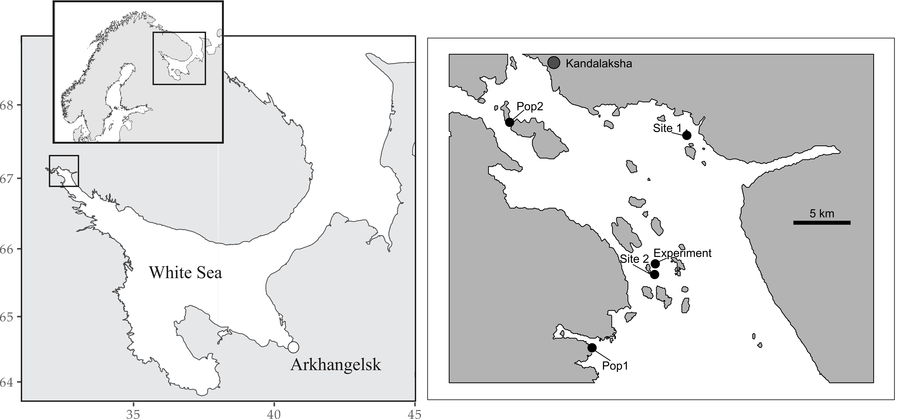

```{r setup, include=FALSE, echo=FALSE}
library(knitr)

opts_chunk$set(echo = FALSE, cache = FALSE, fig.align ="center", warning = FALSE, message = FALSE)

library(ggplot2)
library(ggrepel)
library(cowplot)
library(readxl)

library(dplyr)

library(ggmap)
library(mapproj)
library(maps)
library(rgeos) #этот пакет содержит какую-то хрень, которая позволяет обойти проблему пр чтении фалов средсвами maptools. 
#Att! Этот пакет должен быть загружен до maptools

library(mapdata)
library(maptools) # Rgshhs
library(PBSmapping)
library(gridExtra)
library(grid)


library(lme4)
library(mgcv)
library(broom.mixed)
library(broom)
library(png)

```

^1.^ *St. Petersburg State University, Universitetskaya Emb. 7/9, St. Petersburg, 199034, Russia*

^2.^ *Kandalaksha Nature Reserve, Lineynaya 35,Kandalaksha, 184042, Russia*

^3.^ *Novosibirsk State University, Pirogova Str. 2, Novosibirsk, 630090, Russia*

^4.^ *Novosibirsk division of Institute for Water and Environmental Problems of the Siberian Branch of the RAS (ND IWEP SB RAS),  Morskoy Ave. 2, Novosibirsk, 630090, Russia*

^5.^ *The Herzen State Pedagogical University of Russia, Moyka emb. 48, St. Petersburg, 191186, Russia*


Abstract. 

Cryptic mussel species *Mytilus edulis* (*Me*) and *M.trossulus* (*Mt*) form mixed settlements in shallow waters of the White Sea. The proportion of *Mt* and *Me* in local settlements varies in broad limits but the factors regulating taxonomic composition of mixed populations are poorly understood. Present study focuses on the assessment of the sea star (*Asterias rubens* ) predation influence on the *Mt*-*Me* ratio in natural habitats. For this purpose, we’ve conducted a series of field experiments. For mussels placed on experimental units (ceramic plates submerged in starfish-infested habitats), we’ve estimated a probability of being eaten by starfish. We’ve constructed a linear model that includes several predictors which may influence the probability of being eaten (starfish biomass, mussel size, mussel species, prey abundance, *Mt-Me* ratio on experimental units and abundance of conspecifics). The analysis has revealed that the probability of being eaten expectedly increases with sea stars’ biomass increasing, but it is higher for *Mt* in comparison with *Me*. This indicates *Mt* as a preferable prey. Negative correlations between the probability of being eaten and shell size, number of conspecifics and mussel abundance were also revealed. No significant dependence on *Mt*-*Me* ratio was found. Additionally, we’ve taken field samples which revealed a significant decrease in the proportion of *Mt* in mussel patches after a massive starfish attack. This indicates that starfish ate out *Mt* as its preferable prey. These results show that predators can contribute to the regulation of taxonomic composition of mixed *Mt*-*Me* settlements in the White Sea.

**Key words**: *Asterias*, inter-specific interactions, *Mytilus edulis*, *Mytilus trossulus*,  prey selection


## Introduction

Mussels of several cryptic species, known as “*Mytilus edulis*” complex [@Riginos2005], are widely distributed around the Northern hemisphere. Species of this complex frequently coexist sympatricaly as do, for instance, *M. edulis* Linnaeus, 1758 (*Me*) and *M. trossulus* Gould, 1850 (*Mt*) along both coasts of the North Atlantic [@Riginos2005; @Vainola2011 and references therein] .  The proportion of both species in mixed populations vary within broad limits [@Katolikova2016; @Vainola2011] , but the factors regulating species composition in local populations are poorly understood. 


The most considered factors influencing *Mt*-*Me* composition in mixed populations are abiotic ones: temperature and its correlates [@Popovic2020; @wenne2020trans], salinity [@Riginos2005; @Ridgway2004; @Kijewski2019], surf effects [@Tam2014; @Comesana1999]. Some attempts have also been made to consider anthropogenic influence as an important factor regulating the distribution of the two species [@Vainola2011]: authors believe that *Mt* were introduced into the White Sea with ship traffic and, therefore, concentrated in areas near sea ports. Only few attempts were made to assess the role of biotic interactions in regulation of *Mt*-*Me* proportion in local populations. It was shown that proportion of *Mt* is significantly higher in mussel settlements on fucoid thalli in comparison with the hard- and soft-bottom where *Me* predominate [@Katolikova2016]. In this case, however, the main factor probably isn’t fucoids  as a biotic substrate, but the force of the surf again. The fucoid thalli work as shock absorbers, protecting *Mt* from damaging their thinner shells [@Katolikova2016]. 


In fact, the only actual biotic interaction that plays a role in the regulation of *Mt*-*Me* proportion and which was systematically investigated is starfish pressure. As it was shown, starfish (*Asterias rubens* Linnaeus, 1758) let to prey on the Baltic mussels (*Mt*) and on the North Sea ones (*Me*) preferred to attack *Mt* [@kautsky1990genotypic]. In experiments with *Mt* and *Me* from Canadian hybrid zone sea stars attempted to attack *Mt* more actively than *Me*, defense reactions of which were generally stronger [@Lowen2013].

In practice, the analysis of ecological interactions requires numerous samples with high amounts of specimens. The identification of cryptic mussel species through the use of expensive and time-consuming genotyping does not facilitate it. At the same time, mussel species of “*M.edulis*” complex are morphologically different [@innes1999morphological; @mcdonald1991allozymes; @telesca2018blue; @gardner2009influence]. However, any morphological marker should be considered as a semi-diagnostic trait, which gives the ability to identify species with a high (but not 100%) probability [@Khaitov2021].  Despite this, following certain rules of species identification by using specific morphological traits makes it possible to analyze a large amount of material, which in turn could facilitate the solution of ecological tasks [@Khaitov2021]. While all previous works (see above) considered species' specific shell shape differences, an alternative approach was proposed in @Khaitov2021. A pattern of nacre deposit on mussel shells [@zolotarev1997relations] was suggested as a possible semi-diagnostic marker for probabilistic species identification [@Khaitov2021]. According to this trait, two discrete morphotypes (*T* and *E*) were recognized in different seas of the world, which correspond well to *Mt* and *Me* respectively [@Khaitov2021].

<!-- !!!!!!!!!!!!!!! -->

The ecological analysis of the *Mt*-*Me* hybrid zone in the White Sea has been significantly enhanced by the use of the semi-diagnostic marker mentioned above [@Katolikova2016]. In particular, the introduction of morphotypes as a diagnostic tool allowed a much larger number of mussels to be involved in experiments for assessment of mussel-starfish interactions and, consequentially, to obtain more pronounced results [@Khaitov2018]. Choice experiments conducted in the White Sea confirmed the results from other areas – starfish can feel the difference between *Mt* and *Me* and prefer to consume the former [@Khaitov2018].

<!-- !!!!!!!!!!!!!! -->

These findings, however, do not indicate the role of starfish in regulation of *Mt*-*Me* composition in natural conditions because they’ve been reached in cage experiments. Currently, we do not know if sea stars can change the proportion of species in mixed populations *in situ*. In present investigation we have conducted a series of field experiments and observations to answer three questions. (1) Will sea stars  attack *Mt* with a higher probability (as was shown in cage experiments) in conditions close to natural? (2) Would the mussel settlements dominated by *Mt* be a more preferable foraging place than those dominated by *Me*, as it could be expected from the fact that *Mt* is a more preferable prey? (3) Does the *Mt-Me* proportion change in natural populations after a starfish attack?


## Materials and methods


```{r Maps_construction, message=FALSE, warning=FALSE}

theme_set(theme_bw() + theme(legend.key = element_blank()))
# Задаем пределы координат

Full_x <- c(3, 43)
Full_y <- c(55, 72)

White_sea_x <- c(31, 45) 
White_sea_y <- c(63,68.9)

Kand_x <- c(31.75, 35.5)
Kand_y <- c(66, 67.25)

Kand_upper_x <- c(32.2, 33.06)
Kand_upper_y <- c(66.9, 67.16)

ggWhite_Sea <- read.csv("Data/ggWhite_Sea.csv")
ggKand_upper <- read.csv("Data/ggKand_upper.csv")

Plot_White_sea <- ggplot(ggWhite_Sea, aes(x=long, y=lat, group=group)) + geom_polygon(fill = "gray90", colour = "gray20") + coord_map(xlim = White_sea_x, ylim = White_sea_y) +  theme(axis.title.x =element_blank(),  axis.title.y= element_blank(), plot.background = element_rect(fill = "white"), panel.grid = element_blank())

pol<-data.frame(long = Kand_upper_x, lat = Kand_upper_y, group = 0.1)

Plot_White_sea2 <- 
  Plot_White_sea + 
  geom_rect(data = pol, aes(xmin = long[1], xmax = long[2], ymin = lat[1], ymax = lat[2]), color = "black", fill = NA, size = 1) + 
  annotate (x= 36.891893,  y = 65.661998, geom = "text", label =  "White Sea") +  
  annotate (x= 40.516939,  y = 64.539393, geom =  "point", size = 5, shape = 21, color = "black", fill = "white") +
  annotate (x= 40.421559,  y = 64.35, geom = "text", label =  "Arkhangelsk") 


Plot_Kand_upper <- 
  ggplot(ggKand_upper, aes(x=long, y=lat, group=group)) + 
  geom_polygon(fill = "gray70", colour = "black") + 
  coord_map(xlim = Kand_upper_x, ylim = Kand_upper_y) + 
  theme(axis.ticks=element_blank(), axis.title.x =element_blank(),  axis.title.y= element_blank(), plot.background = element_rect(fill = NULL), panel.grid = element_blank())  +  
  annotate (x= 32.410973,  y = 67.154371, geom =  "point", size = 5, shape = 21, color = "black", fill = "white") +
  annotate (x= 32.52,  y = 67.154371, geom = "text", label =  "Kandalaksha")


 

points <- data.frame(long = c(32.322980,32.490977, 32.594889, 32.681825, 32.583927), lat = c(67.106125,66.927949, 66.991235, 67.095712, 66.990090 ), labels = c("Pop2", "Pop1", "Experiment", "Site 1", "Site 2"), group = 0.1)


Plot_Kand_upper2 <- 
  Plot_Kand_upper + 
  geom_point(data = points, aes(x = long, y = lat), size = 4, shape = 21, fill = "white") + 
  geom_text_repel(data = points, aes(x = long, y = lat, label = labels), box.padding = 0.6)


# + geom_text(aes(x = 32.512752, y = 67.040445), nudge_y = -0.004, label = "Ryazhkov") + geom_text(aes(x = 32.402963, y = 66.959015), nudge_y = -0.004, label = "Voronya bay") + geom_text(aes(x = 32.431115, y = 67.105993), nudge_x = 0.016, label = "Oleny") + geom_text(aes(x = 32.327432, y = 67.127643), nudge_x = 0.006, label = "Telachy") 


bar_long = 32.897982
bar_lat = 67.027434
Long_67parallel = 43.621


Plot_Kand_upper3 <- 
  Plot_Kand_upper2 + 
  geom_segment(x = bar_long, y = bar_lat, yend = bar_lat, xend = (bar_long + 1/Long_67parallel*5 ), size = 2) +
  annotate(geom = "text", x = (bar_long + (bar_long + 1/Long_67parallel*5 ))/2, y = bar_lat + 0.008, label = "5 km") + theme(axis.text = element_blank())  


#grid.arrange(Plot_White_sea2,Plot_Kand_upper3, ncol = 2) 
```


```{r Data_read}
myt <- read_excel("data/Astred_2017_2018_myt.xls", sheet = "Astred All Mussel 2017 2018", na = "NA")
astr <- read_excel("data/Astred_2017_2018_myt.xls", sheet = "Atred Asterias 2017 2018", na = "NA")


astfood_myt <- read_excel('Data/Astfood_2019.xlsx', sheet = "Astfood_2019", na = "NA")
astfood_aster <- read_excel('Data/Astfood_2019.xlsx', sheet = "Astfood_2019_Asterias", na = "NA")

```


```{r Model_1}

myt$Exp <- factor(myt$Exp)
myt$Morph <- factor(myt$Morph)

astr$Exp <- factor(astr$Exp)

myt <- myt %>% filter(complete.cases(.))


# Вероятность индивидуальной мидии быть *Mt* по уравнениям из Khaitov et al. 2021

myt <- myt %>% mutate(P_Mt = case_when(Origin == "vor" & Morph == "e" ~ 1-0.96,
                                Origin == "vor" & Morph == "t" ~ 0.63,
                                Origin == "tel" & Morph == "e" ~ 1-0.46,
                                Origin == "tel" & Morph == "t" ~ 0.94))


myt$P_Mt <- as.numeric(myt$P_Mt)

# Вычисляем долю T-морфотипа, долю съеденных в садках и показатедь смешанности поселений

myt_1 <- myt %>% group_by(Year, Exp, Box) %>% summarise(P_T = mean(Morph == "t"), t = sum(Morph == "t"), e = sum(Morph == "e"), P_eaten = mean(Status == "eaten"), P_pure = mean(P_Mt)*(1 - mean(P_Mt)))


astr_1 <- astr %>% group_by(Year, Exp, Box) %>% summarise(B_aster = sum(Weight), N_aster = n(), Size_mean = mean(Diametr))


myt_aster <- merge(myt_1, astr_1) %>% filter(complete.cases(.))

myt_aster <- myt_aster %>% mutate(N_total = e + t)


myt <- myt %>% filter(!(Exp == "Exp2" & Box == 16)) # Удаляем садок с кривым количесвтом высаженных мидий

myt_aster <- myt_aster %>% filter(!(Exp == "Exp2" & Box == 16))


# ggplot(myt_aster, aes(x = P_T  , y = N_aster)) + geom_point() + facet_wrap(~Exp)


myt_aster_full <- merge(myt, myt_aster) %>% filter(complete.cases(.))

myt_aster_full$Box2 <- paste(myt_aster_full$Box, "_", myt_aster_full$Exp, sep = "")

myt_aster_full$Box2 <- factor(myt_aster_full$Box2)


myt_aster_full <- myt_aster_full %>% mutate(Outcome = ifelse(Status == "eaten", 1, 0))


myt_aster_full$Box2 <- factor(myt_aster_full$Box2)


myt_aster_full <- myt_aster_full %>% mutate(Composition = ifelse(P_T<0.5 & P_T > 0.2, "Mixed", "Pure"))

myt_aster_full$Composition <- factor(myt_aster_full$Composition)

myt_aster_full$Composition <- relevel(myt_aster_full$Composition, ref = "Pure")

myt_aster_full$N_consp <- ifelse(myt_aster_full$Morph == "e", myt_aster_full$e, myt_aster_full$t)


myt_aster_full <- myt_aster_full %>% mutate(Dur = case_when(Exp == "Exp1" ~ 61,
                                                            Exp == "Exp2" ~ 121,
                                                            Exp == "Exp3" ~ 113))


myt_aster_full_short <- myt_aster_full %>% filter(Exp != "Exp1") 


```


### Mussel identification

This research was based on the indirect species identification which uses morphotypes as semi-diagnostic markers. We’ve used an approach proposed in @Khaitov2021 which, in short, can be described as following. We assigned mussels to T-morphotype if nacre was undeveloped in the zone that approaches to the ligament nympha. A thin stripe of prismatic layer not covered by nacre could be seen in this shell area (Fig. 1,  right). In contrast, mussels were assigned to E-morphotype if nacreous layer cames closely to the ligament nympha and no uncovered prismatic layer was recognized in this region (Fig. 1, left). This trait could be seen well both on alive mussels after their dissection and on dead shells (including killed by sea stars) collected in the field.



Figure 1. Internal view of mussel shells of two morphotypes identified through the character of nacreous and prismatic layers under the ligament nympha.


The proportion of *Mt* in a population (*Ptros*) is highly correlated with the proportion of T-morphotype (*PropT*) in the White Sea [@Khaitov2021] and can be recalculated using the following equation:

$$
Ptros = \frac{e^{-2.4+5.4PropT}}{1 + e^{-2.4+5.4PropT}} \qquad (Eq1)
$$
Here *Ptros* - a probability to find *Mt* in a population with a known value of proportion of the T-morphotype (*PropT*).


For probabilistic species identification of individual mussels, which is necessary for experiments, data on the proportion of *Mt-Me* in site of mussel collection is needed [@Khaitov2021]. For mussels of T-morphotype sampled from the population with known Ptros the probability to be *Mt* could be assessed by the Eq2. For mussels of E-morphotype which originate from the population with known *Ptros* the probability to be *Me* can be assessed by Eq3.

$$
P(Mt|T) = \frac{e^{0.2 + 3.2Ptros}}{1 + e^{0.2 + 3.2Ptros}} \qquad (Eq2)
$$


$$
P(Me|E) = \frac{e^{3.7 - 4.9Ptros}}{1 + e^{3.7 - 4.9Ptros}} \qquad (Eq3)
$$

Here *P(Mt|T)* - a probability to be *Mt* if a randomly taken mussel is T-morphotype, *P(Me|E)* – a probability to be *Me* if a mussel is E-morphotype, *Ptros* – a probability to find *Mt* in a settlement where mussels were sampled from. To assess $Ptros$ we’ve either used data on the genotyped populations presented in the Kandalaksha bay of the White sea published in [@Katolikova2016] or  data on *PropT* directly assessed in populations where mussels were sampled from through the use of Eq1. 

### Mussel sampling for experiments

 
To increase the probability of a successful species identification of mussels used in field experiments we’ve sampled material from two populations contrasting by their *Ptros*. The first population (Pop1) was located on a mussel bed in the Voronya Bay (66.92795 N, 32.49098 E, Fig. 2). According to a genetic study [@Katolikova2016], the average *Ptros* in this area is equal to 0.11 (see S1 table in @Katolikova2016, populations # 24-27). It is close to the assessment of *Ptros* = 0.10 obtained from Eq1 by using the proportion of T-morphotype in this population as *PropT* = 0.03 (the proportion of T-morphotype in samples from Pop1). According to these assessments, the probability to be *Me* for any specimen of E-morphotype sampled from Pop1 can be evaluated as *P(Me|E)* = 0.96, but specimens of T-morphotype sampled in Pop1 could be identified as *Mt* with a lower probability *P(Mt|T)* = 0.63. Thus, any randomly taken mussel with E-morphotype sampled in Pop1 can be considered as *Me* with a high probability (we used in further analysis `r sum(myt$P_Mt == "0.04")` individuals of such kind), but the degree of taxonomic uncertainty for mussels with T-morphotype sampled in Pop1 is high enough (`r sum(myt$P_Mt == "0.63")` individuals included in further analysis).


The second population (Pop2) was located on a mussel bed situated between Telachiy and Oleny islands (67.10613 N, 32.49098 E, Fig. 2). No direct assessments of *Ptros* were made in this area, however, knowing a proportion of mussels with T-morphotype in this area (*PropT* = 0.69), we can calculate the proportion of *Mt* in Pop2 using Eq1: *Ptros* = 0.79. This value is close to an average *Ptros* value calculated for the genotyped samples in near locations (populations #18-23, see S1 table in @Katolikova2016): *Ptros* = 0.78. Using this data for mussels sampled from Pop2 we can assess *P(Me|E)* = 0.46 and *P(Mt|T)* = 0.94 . Thus, any randomly taken mussel with T-morphotype sampled in Pop2 can be considered as *Mt* with a very high probability (`r sum(myt$P_Mt == "0.94")` individuals included in further analysis). However, the degree of taxonomic uncertainty for mussels with E-morphotype sampled in Pop2 is very high (such mussels could be with an equal probability assigned both to *Mt* and to *Me*,  `r sum(myt$P_Mt == "0.54")` individuals of such kind ).


Mussels from Pop1 and Pop2 were sampled in August 2017 (experiment 1 and 2) and August 2018 (experiment 3). Mollusks were washed and cleaned from overgrowing organisms. Only individuals with a shell length ranged in `r round(min(myt_aster_full$L), 0)` - `r round(max(myt_aster_full$L), 0)` mm were used for further manipulations. Samples from both populations were placed separately in mesh bags and kept in the sea water by being suspended from the pier situated on the Rayazhkov island (about 1 km away from the site  of experiment, Fig. 2). After several days of adaptation each mussel was labeled by a color tag marking their origin (Pop1 or Pop2).


```{r }

# plot_grid(Plot_White_sea2,Plot_Kand_upper3 + ggtitle("The upper part \nof the Kandalaksha bay"), ncol = 2, rel_widths = c(2, 2)) 

```


Figure. 2. The position of points of sampling for experiments (Pop1 and Pop2), the point of experimental set up and the position of sites (Site 1 and Site 2) where samples for an assessment of *A.rubens* influence on taxonomic structure of mussel settlements were taken from.  The position of Ryazhkov island is marked to show the place where the collected mussels were kept before the experiments.


```{r Number experimental units}

exp_units <- myt_aster %>% group_by(Exp) %>% summarise(N_plate = n())

```


### Experimental set up

We’ve constructed `r max(exp_units$N_plate)` experimental units consisting of a ceramic plate (25 x 25 mm) surrounded by a plastic barrier (3 cm height) around its perimeter. This barrier has prevented mussels from moving outside the experimental unit but allowed sea stars to crawl inside. On the corners of the experimental plate we’ve fastened four ropes which were knot together (appr. 30 cm above the plate) and we’ve tied them to a cord (50 cm length) with a foam float on its end. The foam floats allowed us to find experimental units on the bottom and to pick them up from the boat.

The experimental units were divided into three groups: “*Me*-dominated”, “*Mt*-dominated” and “Mixed”. In two experiments conducted in 2017 on each plate from the first group we’ve placed 100 mussels sampled in Pop1. On the plates of the second group we’ve placed 100 mussels collected in Pop2. Finally, on the plates of the third group we’ve placed 50 mussels from Pop1 and 50 mussels from Pop2. We’ve used 13 experimental units in the first experiment and 26 units in the second one. In 2018, when we’ve conducted the third experiment, the design of an experimental set up was the same but we’ve placed only 60 mussels on each plate (30+30 in case of “Mixed” units). We’ve used all `r max(exp_units$N_plate)` experimental plates this year.


When mussels had been set on experimental units (for all of three experiments) the latter were placed on the bottom of an intertidal pool which wasn’t reachable to sea stars. After two tidal cycles all mussels attached themselves either on the surface of the ceramic plates or on the walls around it, but still inside the unit (only few marked specimens were washed out). After that all experimental units were submerged to the bottom to an about 3 m depth in a starfish infested area (Fig. 2 point marked as “Experiment”). A spatial distribution of units from different groups was random and a distance to the nearest neighboring unit was approximately 1 m. 


```{r}
Potential_N <- 13*100 + 26 * 100 + 30 * 60 
  
Actual_mussel_found <- myt_aster_full %>% filter(!is.na(Origin)) %>% nrow() 

```

Experimental units were exposed to predators for 61 (experiment 1 in 2017), 121 (experiment 2 in 2017) or 113 hours (experiment 3 in 2018). After the exposition period all units were picked up and transported to the laboratory. All starfish found on each plate  were measured. We've used the diameter of the circle outlining the starfish body (doubled starfish radius measured with 1 mm accuracy with a calliper) as an estimate of their size. Each starfish was weighted (with 0.1 g accuracy after removing external water from animal's surface). Dead mussels with color tags (all of them lacked soft tissues which indicated that they were eaten by sea stars) were dried. Alive tagged mussels were boiled, their soft tissues were removed and shells were dried. Only few not marked mussels were found inside the experimental units. Some of the color tagged specimens (`r round(100 - Actual_mussel_found / Potential_N * 100, 1)`% from initially set) were lost.


Dry shells (eaten and uneaten) were measured (maximum distance from the umbo to the opposite side of the shell) using an electronic caliper with an accuracy of 1 mm. The morphotype of each shell was assessed as described in [@Khaitov2021]. This data will further be denoted as the *“Experimental”* data set.

### Field samples for an assessment of sea stars influence on *Mt-Me* composition

In August 2019 a mass swarm of sea stars has attacked shallow water mussel populations in the upper part of the Kandalaksha bay (our personal observation). Such massive invasions periodically occur in this area (our personal observation). We’ve used this event to sample mussels in three types of patches. The patches of the first type were intact mussel settlements presented in a starfish crowding area, but not attacked yet. The patches of the second type were represented by dense clusters of starfish feeding on mussel clumps. And the third type included patches of dead shells visually recognized on the bottom surface. Patches of all three types were situated close to each other (the maximal distance between them was several meters). Unfortunately, our diver did not have a set of unambiguous signs that would allow him to determine the type of a mussel patch (except visual traits described above). *Ex post facto*, we’ve checked whether the samples correspond to the chosen three types by analyzing the proportion of dead mussel shells and the abundance of starfish (see below).    

We’ve sampled patches of each type in two sites (Fig. 2, points marked as Site 1 and Site 2). In both sites a snorkel diver chose a suitable place orienting on sea star abundance. When an appropriate place was found, 10 quantitative samples on each type of patches were taken by using a round core (20 cm diameter). Thus, 30 samples were taken  in each of two sites.

After the samples were washed through a sew-screen (mesh size 2 mm) they were sorted. While sorting the samples we’ve taken into account alive mussels, dead shells (we’ve sampled both alive and dead shells with 10 or more mm length) and starfish. Sea stars were counted and weighted. Dead shells were counted (each shell was counted separately, i.e. double-valved shells were disconnected). Alive mussels were boiled, their soft tissues were removed and shells were dried. On each dried mussel shell we evaluated mussel’s morphotype. 


Each sample was characterized by following values. The proportion of dead shells was estimated as the ratio of the doubled number of dead shells divided by the sum of this value and the number of alive shellfish in the sample. The proportion of T-morphotype among alive mussels (*PropT*) - a ratio of the number of mussels with T-morphotype to a total number of alive mussels in the sample. Finally, a total starfish biomass was assessed. This data will be denoted further as the *“Observation”* data set.


### Statistic processing

All statistical processing and data visualizations were conducted with functions of statistical programming language R 4.05 [@Rcore].

Data from the *“Experimental”* data set was analyzed by the means of a logistic generalized linear mixed model construction based on a binomial distribution with a logit link-function (Model 1). The probability to be eaten was considered as a dependent variable in the Model 1. Each individual mussel was codded as “1” if it was eaten by a sea star and “0” otherwise. The total amount of analyzed mussels was `r nrow(myt_aster_full)`. 

The predictor set for the fixed part of the model included six covariates. No interaction between the predictors described below was included in the Model 1. 

(1)Mussel species. In the case of Pop1 and Pop2 we haven’t dealt with mono-species populations. That’s why using morphotypes as a basis for species identification we can predict mussel species only with a certain probability [@Khaitov2021]. Taking this into consideration we’ve constructed a continuous predictor: a probability to identify an individual as *M. trossulus* (*P~Mt~*). The value of this predictor was calculated as following. We evaluated *P~Mt~* in Pop1 as *P~Mt~* = 1 - *P(ME|E)* = 1 - 0.96 = 0.04 for mussels of E- morphotype and *P~Mt~* = *P(Mt|T)* = 0.63 for mussels of T-morphotype. For mussels collected in Pop2 corresponding values were assessed as *P~Mt~* = *P(Mt|T)* = 0.94 for mussels of T-morphotype and *P~Mt~* = 1 - *P(Me|E)* = 0.54 for E-morphotype. An interpretation of this value is obvious: the higher is *P~Mt~* – the higher is the probability that a certain mussel is *Mt*.

(2)Number of “conspecifics” (*N~consp~*). For each mussel included in the analysis we’ve calculated a number of mussels of the same morphotype presented in the experimental unit where this mussel was placed. We interpret this predictor as following: when this value is low, the mussel of a given morphotype is surrounded mostly by mussels that probably belong to another species, otherwise, when *N~consp~* is high, a mussel is predominantly surrounded by conspecifics. This value should be in average high for mussels placed in “*Mt*-dominated” or “*Me*-dominated” units and low for mussels placed in “Mixed” units.


(3)Proportion of mussels of T-morphotype (*PropT*). This value describes the taxonomic structure of a mixed population. The lowest values of this predictor are in the “E-dominated” units, in “Mixed” they are higher and the highest values are in “T-dominated” units.


(4)Unfortunately, the design of our experiment didn’t allow us to directly asses the association between the probability to be eaten and starfish size. However, an individual weight of a starfish was highly correlated with its size  (Spearman correlation: `r round(cor(astr$Diametr, astr$Weight, method = "pearson", use = "complete.obs"), 2)`, n = `r sum(!is.na(astr$Weight))`, p < 0.001).  By assessing the total weight of all starfish found in experimental units we can indirectly include predators’ size in the model. We’ve used the sea stars’ biomass (*B~aster~*, the sum of individual weights) as a predictor describing both starfish abundance and their size.


(5)Mussel size (*L*) and (6) total amount of mussels (*N~tot~*) are self-evident predictors. They were used as technical covariates which is needed since the mussels of different size were used, the amount of sea stars varied between experimental units and different numbers of mussels were placed on experimental units in 2017 and 2018.


All predictors were scaled by subtracting the mean and dividing them by the standard deviation. Scaling of the predictors allowed us to compare the power of different predictors by the means of comparing the regression coefficients.


The random part of this mixed model described a variation of the model intercept. Two random factors were included in the model: The factor "Experimental unit" was hierarchically nested within the "Experiment" factor.

The Model 1 was fitted by using glmer() function from the lme4 package [@Bates2015]. The validity of the fitted model was tested by means of residual plots. No violations of logistic regression analysis were found.

To assess a goodness of fit for the Model 1 we calculated marginal and conditional $R^2$ [@nakagawa_general_2013]. The marginal $R^2$ represents the variance explained by the fixed effects and the conditional $R^2$ is interpreted as a variance explained by the entire model, including both
fixed and random effects. Function r.squaredGLMM() from the package "MuMIn" [@Mumin] was used for calculations.    

Since the Model 1 included numerous predictors, its visualization was problematic. The association of the dependent variable with a particular predictor in such model could be presented as a chart only by  means of averaging other predictors included, which is uninformative in case of some variables (e.g. *P~Mt~*). To visualize the revealed dependencies, we’ve used the proportion of eaten mussels in some mussels’ groups as a proxy for the probability to be eaten (dependent variable in the Model 1). These groups were constructed in several ways. Firstly, for such predictors as  *N~tot~*, *PropT* and *B~aster~* the proportion of eaten mussels was calculated for each experimental unit and plotted as dot chart against the corresponding predictor’s value. Secondly, for *N~consp~* the proportion of eaten was calculated among mussels of T- and E-morphotype separately for each experimental unit and charted against the corresponding number of alive mussels in these two groups within each experimental plate. Thirdly, for *P~Mt~* we've calculated the  proportion of eaten mussels among four groups of mollusks according to their *P~Mt~* values (see the description of this predictor above). And finally, for *L* we've divided the predictor's range into ten intervals which included approximately equal number of mussels and calculated the proportion of eaten among all mussels in each group.   


We've constructed a set of dot plots that represent  the dependency of the   proportion of eaten mussels with the mean value of the predictor calculated for each group.  To note, these plots have represented rather raw data but not the model prediction.


The *“Observation”* data set was analyzed by the means of generalized additive model construction (beta distribution with logit link-function, the Model 2 thereafter). The proportion of mussels of T-morphotype among alive mussel (PT_alive) was considered as a dependent variable. As the main predictor in the model we’ve considered the discrete factor “Patch Type” with three levels described earlier. The biomass of sea stars was included in the model as a covariate. The Model 2 was fitted by gam() function from the mgcv package [@wood2006generalized]. The factor “Site” was included in the Model 2 as a random effect smoother [@pedersen2019hierarchical]. The Model 2 construction was followed by pairwise comparisons of model predictions for three levels of “Patch type” predictor. For the comparison Tukey test was applied by using glht() function from the “multcomp” package [@Horten2008].   


## Results

### “Experimental” data set

```{r Model 1}


Mod <- glmer(Outcome ~ scale(P_Mt) +  scale(N_consp) + scale(P_T)  + scale(N_total) + scale(B_aster) + scale(L)  +   (1|Exp/Box2), family = binomial(link = "logit"), data = myt_aster_full )

library(MuMIn)

r_glmm <- r.squaredGLMM(Mod)

Mod_sum <- tidy(Mod)


```

Sea stars that attacked experimental units were relatively small in size (median size: `r median(astr$Diametr*10, na.rm = T)` mm, SD = `r round(sd(astr$Diametr*10, na.rm = T), 1)` , Fig. 3). The number of sea stars that crawled on the plates ranged between `r min(myt_aster$N_aster)` and `r max(myt_aster$N_aster)` (median number: `r median(myt_aster$N_aster)`, SD = `r round(sd(myt_aster$N_aster),1)`) ind. per experimental unit.


```{r}
df1 <- astr %>% select(Year, Exp, Diametr, Weight)
df1$Diametr <- df1$Diametr *10 

df2 <- astfood_aster %>% select(Site, D, B)


df2$Year <- 2019
names(df2) <- c("Exp",   "Diametr", "Weight", "Year")


df_size <- rbind(df1, df2)

Fig3 <- 
ggplot(df_size, aes(x = Exp, y = Diametr)) + 
  geom_boxplot() +
  labs(x = "", y = "Diameter of sea star (mm)") +
  theme(axis.text = element_text(size = 20), axis.title.y = element_text(size = 25))

Fig3

ggsave("figures/Fig_3.png", plot = Fig3, width = 200, height =  290, units = "mm" ,dpi = 1200)


```

Figure 3. Size of sea stars found on plates in experiments (Exp1 - Exp3) and in samples from two sites in *"Observation"* data set (Site 1, Site 2). In all boxplots' charts the horizontal lines denote medians, boxes' boundaries correspond to the 1-st and 3-d quartiles of the value, whiskers' size are equal to 1.5 interquartile range, points situated out of the whiskers' range are outliers [@wickham201140].    
    

The  marginal and the conditional $R^2$ were rather close each to other (`r round(r_glmm[1,1], 2)` and `r round(r_glmm[1,2], 2)` respectively). It could be interpreted as a weak role of random effects included in the Model 1. 

Since all predictors in the constructed model (Table 1) were continuous and scaled we can directly compare the power of their influence on the dependent variable. The most powerful predictor (Table 1) was the sea star biomass. A high positive coefficient denotes an increased probability to be eaten when the starfish biomass is increased (Fig. 4 A).


The second most influential predictor was the probability to be *Mt* (*P~Mt~*). A positive value of the corresponding regression coefficient (Table 1, Fig. 4 B) can be interpreted as a higher probability to be eaten for mussels of T-morphotype (maximal value of *P~Mt~*) in comparison with mussels of E-morphotype (minimal value of *P~Mt~*).


The third most powerful predictor (*N~total~*) was associated with a negative regression coefficient. It means that the probability to be eaten was lesser in more abundant mussel settlement (Table 1, Fig. 4 C).


The next predictor, mussel size (*L*), was negatively correlated with the probability to be eaten (Table 1, Fig. 4 D). Thus, starfish consumed smaller mussels more actively than the larger ones.


The last predictor which describes the abundance of mussels of the same morphotype for a given mussel (*N~consp~*) was negatively correlated with the dependent variable (Table 1, Fig. 4 E). Thus, if there was a negligible number of specimens taxonomically similar to a given mussel on an experimental plate, the probability to be eaten for this mussel was higher than for a mussel surrounded by a higher conspecifics amount.

No significant associations between the probability to be eaten and the proportion of T-morphotype (*P~T~*) was revealed (Table 1., Fig. 4 F).

```{r}

Mod_sum$term <- c(
  "(Intercept)",
  "P_{Mt}",
  "N_{consp}", 
  "PropT",
  "N_{total}",
  "B_{aster}",
  "L",
  "Sd_{Intercept}",
  "Sd_{Intercept}"
  )


library(flextable)


  
Mod_sum$estimate <- round(Mod_sum$estimate, 3) 
Mod_sum$std.error <- round(Mod_sum$std.error, 4)
Mod_sum$statistic <- round(Mod_sum$statistic, 2)
Mod_sum$p.value <-  round(Mod_sum$p.value, 4)


Mod_sum <- Mod_sum %>% filter(effect == "fixed") %>% select(-effect, -group) 

names(Mod_sum) <- c(
  "Term",
  "Estimate",
  "SE",
  "z-statistic",
  "p.value"
) 


```


```{r }


ft <- Mod_sum %>% flextable() 
ft <- compose(x = ft, j = "Term",
  value = as_paragraph(as_equation(Term, width = 3, height = .5)))

ft <- align(ft, j = "p.value", align = "right", part = "all")    
ft <- width(ft, j = "z-statistic",  width = 1)
ft <- width(ft, j = "Term",  width = 1)

ft <- set_caption(ft, "Table 1.Parameters of the model describing the probability of being eaten as a function of predictors. Shown are parameters from the fixed part of the Model 1.")

ft
```


Model terms: *P~Mt~* - a probability to be identified as *Mt*; *N~consp~* - a number of conspecifics for given mussel in the experimental unit;  *PropT* - a proportion of mussels of T-morphotype; *N~total~* - a number of mussels in the experimental unit in the end of exposition; *L* - mussel size; *B~aster~* - starfish biomass in the end of the exposition.


```{r Visualisatons}

Pl_P_eaten_B_aster <- 
  ggplot(myt_aster, aes(x = B_aster, y = P_eaten)) + 
  geom_point() + 
  # geom_smooth(method = "lm", se = F) + 
  labs(x = "Starfish biomass", y = "Proportion of eaten") 


Pl_P_eaten_P_Mt <- 
myt_aster_full %>% group_by(P_Mt) %>% summarise(P_eaten = mean(Outcome), N = n()) %>% 
  ggplot(., aes(x = P_Mt, y = P_eaten)) + geom_point(aes(size = N))  + 
  # geom_smooth(method = "lm", se = F) +
  labs(x = "Probability to be Mt", y = " ") +
  guides(size = "none") +
  xlim(0,1)


Pl_P_eaten_N_total <- 
  myt_aster_full %>% group_by(Box2) %>% summarise(P_eaten = mean(Outcome), N_total = mean(N_total)) %>% 
  ggplot(., aes(x = N_total, y = P_eaten)) + geom_point()  + 
  # geom_smooth(method = "lm", se = F) +
  labs(x = "Mussel number (ind.)", y = "Proportion of eaten") +
  guides(size = "none") 


Pl_P_eaten_L <- 
  myt_aster_full %>% mutate(L2 = ntile(L, 10)) %>%  group_by(L2) %>% summarise(P_eaten = mean(Outcome), N = n(), L3 = mean(L)) %>% 
  ggplot(., aes(x = L3, y = P_eaten)) + geom_point(aes(size = N))  + 
  # geom_smooth(method = "lm", se = F) +
  labs(x = "Mussel size (mm)", y = " ") +
  guides(size = "none") +
  scale_size_continuous(range = c(2.5, 4))


Pl_P_eaten_N_consp <- 
  myt_aster_full %>% group_by(Box2, Morph, N_consp) %>% summarise(P_eaten = mean(Outcome), N = n()) %>%   ggplot(., aes(x = N_consp, y = P_eaten)) + geom_point(aes(size = N, fill = Morph), shape = 21)  + 
  # geom_smooth(method = "lm", se = F) +
  labs(x = "Number of conspecifics in experimental unit", y = "Proportion of eaten") +
  guides(size = "none") +
  scale_fill_manual(values = c("black", "white"), labels = c("E", "T"), name = "Morphotype") +
  theme (legend.position = c(0.75, 0.80), legend.box.background = element_rect(colour = "black", fill = NA))


Pl_P_eaten_P_T <- 
  myt_aster_full %>% group_by(P_T) %>% summarise(P_eaten = mean(Outcome)) %>% 
  ggplot(., aes(x = P_T, y = P_eaten)) + geom_point()  + 
  # geom_smooth(method = "lm", se = F) +
  labs(x = "Proportion of T-morphotype", y = " ")


```


```{r}
Fig4 <-
  plot_grid(Pl_P_eaten_B_aster, Pl_P_eaten_P_Mt,  Pl_P_eaten_N_total,  Pl_P_eaten_L, Pl_P_eaten_N_consp, Pl_P_eaten_P_T, ncol = 2, labels = "AUTO")

Fig4

ggsave("figures/Fig_4.png", plot = Fig4, width = 200, height =  290, units = "mm" ,dpi = 1200)
```

Figure 4. Proportion of eaten mussels against different values of the predictors included in the regression Model 1. The figure shows the raw data summarized for three experiments combined. **A**. Relationship of proportion of eaten mussels with starfish biomass. Each point reflects an experimental unit. **B**. Proportion of eaten mussels among specimens with different probabilities of being *Mt*. Each point represents the proportion of eaten mussels among individuals that have the same *P~Mt~* value. The size of the dots is proportional to the number of mussels in each particular group. **C**. Proportion of eaten individuals among mussels on experimental units with different numbers of alive mussels found at the end of the experiment. Each point corresponds to an experimental unit. **D**. Proportion of eaten individuals among mussels of different size. Each point corresponds to a particular size class. Dot size is proportional to the number of mussels in a size group. **E**. Proportion of eaten individuals of different morphotypes among mussels with different numbers of conspecifics within experimental units. The size of the point is proportional to the number of mussels in a group. **F**. Relationship to the proportion of T-morphotype. Each point reflects an experimental unit.       

 
### “Observation” data set

```{r}


asterias_abund <- astfood_aster %>% group_by(Site, Sample) %>% summarise(N_aster = n(), B_aster = sum(B))


all_ast_abund <- merge(astfood_myt, asterias_abund, all.x = T)

all_ast_abund[is.na(all_ast_abund)]<- 0

all_ast_abund <- all_ast_abund %>% mutate(Prop_dead = (N_T_dead + N_E_dead)/(N_T_dead + N_E_dead + N_T_alive + N_E_alive), P_T = N_T_alive/(N_T_alive + N_E_alive), N_alive =  N_T_alive + N_E_alive)

all_ast_abund$Site <- factor(all_ast_abund$Site)

all_ast_abund$Stage2 <- factor(all_ast_abund$Stage, labels = c("Intact patches",   "Starfish clusters", "Dead shells"))


```


```{r Model_2}

Mod_PT <- gam(P_T ~ Stage2 + B_aster + s(Site, bs = "re"), data = all_ast_abund, family=betar(link="logit"))

```


```{r}

Pl_baster <- ggplot(all_ast_abund, aes(x = Stage2, y = B_aster)) + geom_boxplot() + theme(axis.title.x = element_blank(), axis.text.x = element_blank()) + labs(y = "Starfish biomass (g )")


Pl_N_alive <- ggplot(all_ast_abund, aes(x = Stage2, y = N_alive)) + geom_boxplot() + theme(axis.title.x = element_blank(), axis.text.x = element_blank()) + labs(y = "Abundance of alive mussels")
 

Pl_Prop_dead <- ggplot(all_ast_abund, aes(x = Stage2, y = Prop_dead)) + geom_boxplot() + theme(axis.title.x = element_blank(), axis.text.x = element_blank())+ labs(y = "Proportion of dead shells")


compar <- all_ast_abund %>% group_by(Stage2) %>% summarize(y = median(P_T) +0.03) %>% mutate(Lab = c("a", "b", "b"))

Pl_PT <- 
  ggplot(all_ast_abund, aes(x = Stage2, y = P_T)) + 
  geom_boxplot() +  
  theme(axis.title.x = element_blank()) + 
  labs(y = "Proportion of T-morphotype") +
  geom_text(data = compar, aes(x = Stage2, y = y, label = Lab)) +
  theme(axis.text.x = element_text(size = 14))


```


```{r }
Fig5 <-
plot_grid(Pl_baster, Pl_Prop_dead, Pl_PT, ncol = 1 , labels = "AUTO")

Fig5

ggsave("figures/Fig_5.png", plot = Fig5, width = 200, height =  290, units = "mm" ,dpi = 1200)


```

Figure 5. Boxplot representing the *A.rubens* biomass, gram per  20 cm diameter core,  (**A**), proportion of dead shells (**B**) and proportion of mussels of T-morphotype among alive mussels (**C**) in samples from three types of patches. On the panel **C** the results of post-hoc comparisons (on the basis of Model 2) of different levels are presented: different letters denote a significant difference. 


```{r eval=FALSE}
all_ast_abund %>% group_by(Stage2, Site) %>% summarise(N_aster = mean(N_aster))

```


Most of sea stars that gathered around mussel patches were rather small (median `r median(astfood_aster$D/10)` cm, SD =  `r round(sd(astfood_aster$D/10), 1)`, Fig. 3) and in Site 1 they were smaller than in Site 2 (Fig.3). The biomass of sea stars varied on patches of differing types showing the minimal value on the intact mussels and maximal on the starfish crowding ones (Fig 5, A). The proportion of dead shells was minimal on alive mussel patches and maximal on the dead shell patches (Fig 5, B). 

```{r}
patch_summ <- all_ast_abund %>% group_by(Stage2) %>% summarise(MedianPT = median(P_T), MinPT = min(P_T), MaxPT = max(P_T), Ptros = exp(-2.4 + 5.4*MedianPT) / (1+exp(-2.4 + 5.4*MedianPT)))

```


The proportion of T-morphotype (Fig 5, C) was maximal at intact mussel patches (*PropT*: median = `r round(patch_summ$MedianPT[1], 2)`, min = `r round(patch_summ$MinPT[1], 2)`, max = `r round(patch_summ$MaxPT[1], 2)` ) and minimal at dead shells patches (*PropT*: median = `r round(patch_summ$MedianPT[3], 2)`, min = `r round(patch_summ$MinPT[1], 3)`, max = `r round(patch_summ$MaxPT[3], 2)` ). The value of *PropT* in patches with sea star clusters was intermediate (*PropT*: median = `r round(patch_summ$MedianPT[2], 2)`, min = `r round(patch_summ$MinPT[2], 2)`, max = `r round(patch_summ$MaxPT[2], 2)` ). Thus, after using Eq1 the proportion of *Mt* (*Ptros* calculated on the basis of medians) gradually decreases from `r round(patch_summ$Ptros[1], 2)` to `r round(patch_summ$Ptros[2], 2)` followed by `r round(patch_summ$Ptros[3], 2)`  in following sequence: "Intact patches" - "Starfish clusters" - "Dead shell patches". 


The constructed regression model (Table 2) revealed a significant dependence of *PropT* on all predictors. Pairwise post-hoc comparison revealed a significantly higher value of *PropT* in the intact mussel patches than in the patches with sea star clusters and in the patches of dead shells (Fig. 5 C). The difference between the last two groups was not significant (Fig 5 C). Some weak positive correlations between *PropT* and sea stars' biomass were found (Table 2).


```{r}
Mod2_sum_parametric <- tidy(Mod_PT, parametric = T)

Mod2_sum_parametric$term <- c(
  "(Intercept)",
  "Patch_{Starfish \\ clusters}",
  "Patch_{Dead \\ shells}",
  "B_{aster}"
)


names(Mod2_sum_parametric) <- c(
  "Term",
  "Estimate",
  "SE",
  "z-statistic",
  "p.value"
) 


# kable(Mod2_sum_parametric, caption = "Table +. Parametric terms of the Model 2. Intact patches were used as a base level for the factor 'Patch Type' " )
```

```{r}

ft2 <- Mod2_sum_parametric %>% flextable() 

ft2 <- compose(x = ft2, j = "Term",
  value = as_paragraph(as_equation(Term, width = 3, height = .5)))

ft2 <- align(ft2, j = "p.value", align = "right", part = "all")    
ft2 <- width(ft2, j = "z-statistic",  width = 1)
ft2 <- width(ft2, j = "Term",  width = 2)

ft2 <- set_caption(ft2, "Table 2.Parameters of the model describing the proportion of T-morphotype among alive mussels   as a function of predictors. Shown are parameters from the fixed part of the Model 2.")

# ft2 <-  footnote(
#   x = ft2,  
#   ref_symbols = "*",
#   value = as_paragraph("'Intact patches' were used as a base level for the factor 'Patch'")
# )


ft2 <- colformat_double(x = ft2, j = 2:4, digits = 3)

ft2 <- colformat_double(x = ft2, j = "p.value", digits = 4)

ft2
# autofit(ft2) %>% align(i = 1, align = "left")
```
'Intact patches' were used as a base level for the factor 'Patch'


## Discussion

In this study we’ve provided the first evidence that *Asterias rubens* can discriminate between sympatric *Mytilus* species in natural conditions. All previous attempts to determine whether *M. edulis* or *M. trossulus* are more susceptible to predation by *A. rubens* were performed in closed aquarium set ups in laboratory or in natural biotopes [@Lowen2013; @Khaitov2018; @kautsky1990genotypic]. Such closed microcosms may provide conditions that are different in comparison with the natural ones. In our experiments we’ve offered the sea stars infesting natural habitats a free choice between artificially constructed settlements of mussels which differ in their taxonomic composition. This approach was made possible by utilizing a low-cost method of identifying mussel morphotypes followed by estimating the probability of belonging to one of the two cryptic mussel species, as was proposed in @Khaitov2021. With this approach we were able to create several dozen experimental units on which several thousand mussels were placed which was necessary for a more or less accurate assessment of *"Mytilus-Asterias"* system properties in noisy natural habitats.


The second advantage of our approach was that we’ve repeated our experiments several times. These replications were implemented into regression model as random effect. The role of random factors was rather low, indicating that conditions of different experiments were rather standard. 

The third advantage was that we’ve included several covariates potentially affecting the probability of being eaten in a single analysis. The influence of some of these covariates was self-evident. For example, we have shown that the greatest impact on the probability of being eaten is made by the abundance (biomass) of sea stars attacking the experimental units (Table 1). It seems to be a trivial and expected correlation: more predators mean chance that the prey will die.

Another trivial dependency revealed in our analysis was that the probability to be eaten was associated with the prey size. However, the fact that predators preferred smaller mussels (Table 1) seems to be intriguing. We have found the same pattern in our aquarium experiments [@Khaitov2018] and it was also observed by other authors [@Oneil1983; @Hummel2011], although the opposite pattern was revealed as well [@dolmer1998interactions; @aguera2020blue]. On one hand, this correlation can be explained by the fact that starfish which crawled to the experimental units were quiet small in size in comparison with the size of adult sea stars from the White Sea [@sarantchova2001]. On the other hand the choice of smaller (but not the smallest) mussels may be explained by that the delicate walls of the predator’s stomach, embedding between the shells of the victim during the feeding time, suffer less mechanical damage if the smaller individuals are attacked [@Hummel2011]. However, this vector of choice probably depends on prey density: in scarce mussel populations sea stars tend to look for larger victims more than in dense populations [@aguera2020blue]. Intraspecific competition between sea stars can also be important in choice of mussels of larger size when the competition between predators becomes stronger [@Oneil1983]. We have to note that the value of the regression coefficient (Table 1 ) associated with prey size was one of the lowest in the model (recall that all predictor values were standardized, which allows us to directly compare their influence). Thus, the probability of being eaten depends on the size of the prey only to a small extent.


The other covariate which was expected to be associated with the probability of being eaten was the total amount of mussels presented in the experimental unit (Table 1). The negative coefficient indicates that the more there are mussels in the experimental unit, the less is the probability of being eaten. This dependence is inherent for predators that show a functional response of Type II [@holling1959components], which is typical for sea stars [@Dickey2021]. In the case of such functional response, when the prey density increases, the proportion of prey consumed per predator per unit of time should decrease [@Smith2012].


What’s more interesting is that one of the highest values among the coefficients in the model was the coefficient associated with the taxonomic status of prey. In this work, we’ve evaluated the belonging of a specimen to one or another species basing on the assessment of mussel morphotype. By its nature, morphotype is a semi-diagnostic trait [@Khaitov2021] that allows to identify species only with a certain probability which depends, in turn, on the ratio of *Mt* and *Me* in  mixed settlements. Using empirical models constructed on the basis of genotyped specimens [@Khaitov2021], we’ve estimated the taxonomic status of mussels as the probability of being *M.trossulus* (*P~Mt~*). The positive value of the regression coefficient for this predictor (Table 1) indicates that the probability of being eaten increases as *P~Mt~* values increase. Indeed, in total, combining the results of all three experiments (Fig. 4 B), we can see that among *Mt*-like mussels (*P~Mt~* = 0.94) 34% were eaten whereas 22 % were eaten among *Me*-like mussels (*P~Mt~* = 0.04). It is noticeable that the mussels with intermediate values of *P~Mt~* tend to have an intermediate proportion of eaten specimens (Fig. 4 B). This fact indicates that in mixed populations the dominant and the minor morphotypes retain their species specificity. In other words, sea stars recognize mussels of a rare morphotype in a given settlement as representatives of a species other than the species dominating in the settlement. This is an additional argument testifying that mussel morphotypes are a reliable tool for species identification.  


Thus, our study confirms that even under conditions as close to natural as possible, sea stars prey on *Mt* with greater preference than on *Me* as it has been shown in aquarium conditions (Khaitov et al., 2018). Currently, there is no unequivocal explanation for this pattern. On one hand, it is known that *Mt* have a lower weight of soft tissues, hence a lower energy value than *Me* [@Penney2008]. That's why other consumers, humans for instance, prefer *M.edulis* and *M.galloprovincialis* which lack this disadvantage [@Penney2008;  @Michalek2016]. On the other hand, sea stars in their choice of prey are guided either by tactile or chemical signals from the prey and these signals are hardly directly associated with an energetic status of mussels. It’s more likely that the prey size and the difficulty of prey handling plays a bigger role in this case. It is possible that the reason lies in different flexibility of shells: *Mt* have a thinner and more flexible shell than *Me* [@Beaumont2008; @michalek2021mytilus]. This may reduce the time of handling prey and make the shell opening more safe and less energetically consuming which makes *Mt* more preferable.


Chemical signals may also play a role. In experiments conducted by @Lowen2013 sea stars, having no tactile contact with *Mt* and *Me* seating in different parts of aquarium, tended to move to the part which was occupied by *Mt*. The nature of these chemical signals is unclear but there is an obvious candidate for this role: a glycoprotein KEYSTONEin, the release of which stimulates sea stars to attack mussels [@Zimmer2016; @Zimmer2017]. Considering that this glycoprotein is localized in epidermis, extrapallial fluid and shell periostracum (i.e. in body parts that are related to shell formation) [@Zimmer2017] and the difference in *Mt* and *Me* shell thickness [@Beaumont2008; @michalek2021mytilus], it is highly possible that mussels of two species produce KEYSTONEin in different quantities (or, possibly, produce species specific KEYSTONEins).

Initially, our hypothesis was that the populations dominated by *Mt* (i.e. T-morphotype dominated experimental units) would be attacked the most. Surprisingly, despite the high vulnerability of *Mt* that was considered above, we did not observe a higher probability of being eaten for mussels from experimental units that were dominated by mussels of T-morphotype. The probability of being eaten was not dependent significantly on taxonomic structure of settlement (Table 1). We suppose that a possible explanation for this occurrence may be related to the last of the predictors included in our model which is the number of conspecifics (*N~consp~*) in an experimental unit.

The abundance of conspecifics is high for a mussel (let’s say it’s an individual of T-morphotype) if it’s situated in a settlement dominated by individuals of the same morphotype. Similarly, this value will be high for any E-morphotype mussel in a settlement dominated by E-morphotype. The value of this predictor decreases if a mussel of any morphotype is in a mixed settlement. However, the smallest value would be reached if a mussel of a given morphotype is located in a settlement dominated by mussels of another morphotype. Thus, a negative coefficient for this predictor means that the minimal probability of being eaten will be observed if a mussel exists among its conspecifics. The highest probability of being killed by a predator will be for a small amount of mussels living among another *Mytilus* species. The observed pattern may testify to some cooperation between conspecifics which results in the decrease of mortality.


The cooperation of mussels manifested in the formation of dense aggregations is a reliable defense mechanism against predators [@Okamura1986;  @reimer1997predator; @aguera2020blue]. It is possible that a lonely “alien” mussel will be pushed to the periphery of aggregations or outside them becoming a more available prey for sea stars. It is known that *Me* and *Mt* differ in their efforts to form aggregations [@Liu2011], but how it translates into their defense mechanisms against predators is still unknown. Our results allow us to suggest that this effect may be related to the way that the mussels of different species organize themselves when clumping in mixed and mono-specific populations.


If the described pattern really exists, then the "pure", mono-specific, settlements are expected to be more protected against sea stars. This, apparently, explains the absence of a clear dependence of the probability of being eaten on the taxonomic composition of mussel settlements: cooperation inside a pure settlement contributes to mussel defense. At the same time, one would expect a higher mortality of mollusks in mixed settlements. However, we did not observe a clear increase in the probability of being eaten for mussels in settlements with medium *PropT* values (Fig. 4 F). One of the possible reasons may be associated with local segregations of mussels of different species inside “Mixed” experimental units. Obviously, additional studies are needed to analyze this phenomenon.

Sea stars’ preference for one of the mussel cryptic species revealed in this and previous studies [@Lowen2013; @Khaitov2018] does not yet mean that predators can effectively control the taxonomic composition of settlements when two species exist in a common habitat. In long-time experiments, this effect is almost impossible to observe:  if sea stars are let to consume mussels in experimental conditions for a long time, they practically eat out all available prey (personal observation).  At the same time, mass invasions of sea stars, which occur periodically in shallow water habitats all over the world [@galstoff1939natural; @Dare1982] and in the White Sea in particular [@naumov2011], could be considered as natural experiments that allow us to estimate the role of predators in regulating not only the abundance of prey, but also the taxonomic composition of their settlements.

In 2019 we’ve observed swarms of starfish in shallow water (at 1-3 m depth) at many points on top of the Kandalaksha Bay (personal observation). It is known that during such invasions predators can eat up significant amounts of mussels’ population [@galstoff1939natural; @Dare1982; @witman2003massive; @Kamermans2009; @garcia2015role]. A starfish swarm moving through a mussel settlement leaves behind a “scorched earth” - a mussel free area [@seed1969ecology].

In our case, we did not observe a classic mussel bed which looks like a continuous cover that consists of large patches occupied by mussels neighboring with mussel free areas and that occupies hundreds of square meters (see @commito2006hierarchical for image). The mussel settlements we’ve observed were represented by individual small clumps. Starfish were attacking these patches, forming dense and clearly distinguishable clusters. Near intact and attacked patches we’ve also frequently found small fields covered with dead shells.

We cannot state with certainty that the fields of dead shells are consequences of sea star attacks and that the patches which we denoted as "intact" are the settlements that have not yet been attacked. However, the proportion of dead shells in the settlements expectedly increases in the series “intact patches- starfish clusters - fields of dead shells” (Fig. 5 B). Additionally, the uniform assessment of starfish biomass via the use of a standard core allows us to expect a certain pattern of starfish biomass distribution between patch types: minimum in intact patches and maximum in starfish cluster. We have observed this pattern *in situ* as well (Fig. 5 A). All these facts allow us to consider the mentioned series as a temporal sequence. 


The proportion of T-morphotype mussels, i.e. proportion of *Mt*, gradually decreased in the mentioned series (Fig. 5 C). A Although there were no statistically significant differences between samples from the starfish clusters and from the fields of dead shells, both these groups differed significantly from the intact patches. Taking into account that the distance between samples was short and all samples were taken from same habitats, it seems likely that the obtained pattern reflects changes in the taxonomic structure of mussel settlements after sea star attacks rather than the spatial segregation of two mussel species. Predators are thus capable to reduce the frequency of *Mt* in mixed settlements by several times. According to a fitted model (Table 2) after an intact patch was attacked, the proportion of T-morphotype mussels has increased by e^-1.25^ = 0.29 times (i.e. decrease by 3.5 times). Thus, the results of our study allow us to treat predators as one of the important factors regulating the distribution of *Mt* and *Me*.

It is also likely that the segregation of species in gradients of environmental factors noted in other works [@Riginos2005; @Stuckas2017; @Katolikova2016; @dias2009survey ] is, at least partly, the result of an interaction with predators. For example, one might expect that the high proportion of *Mt* in freshened areas [@Riginos2005; @Stuckas2017] may be determined not only by a greater tolerance of this species to reduced salinity, but also by the fact that sea stars may be rare in these habitats. Indeed, the feeding rate of sea stars decreases with a decreasing salinity; at salinity of 12 ppt sea stars do not feed at all [@Dickey2021]. Taking into account the fact that in natural conditions sea stars prefer *Mt*, we can assume that in those marine ecosystems where there is a pronounced salinity gradient, freshened areas would be a sort of refuge for *Mt*.


In the Kandalaksha Bay of the White Sea, where our work was carried out, the upper part of the bay is strongly freshened due to the inflow of the large Niva river. At the top of the bay, the surface salinity usually does not exceed 12 ppt [@Katolikova2016]. Sea stars are absent here (personal observation), but mussel settlements dominated by *Mt* are numerous [@Katolikova2016]. With moving away from the bay’s top the salinity increases and *A.rubens* becomes a common species in the sublittoral communities (personal observation), while the proportion of *Mt* decreases [@Katolikova2016]. The observed pattern is quite consistent with the hypothesis stated above.

However, if our assumption about the role of sea stars as keystone predators restricted in their distribution by salinity is correct, then we could expect that this pattern won’t be seen at the sites of an inflow of small rivers. Rivers of a lower power seem to not be able to stop starfish attacks, at least in the sublittoral, where the freshwater layer may not appear at all. Thus, the dependency of *Mt* frequency on salinity might not be seen well in those regions where the desalination is associated with a small river discharge. At the same time, global desalination due to climatic changes (or anthropogenic influences) may lead to a significant reduction of sea stars’ abundance (Dickey et al. 2021) and, as a consequence, it could give an opportunity for *Mt* to spread widely.


An additional pattern which was found in our observations is the positive correlation between starfish biomass and the proportion of T-morphotype among alive mussels (Table 2). This may indicate that starfish are concentrated in areas where *Mt* frequency is higher. However, this correlation is so weak (although statistically significant) that it is too early to draw unambiguous conclusions regarding this relationship.    

## Conclusion

We have answered all three questions stated in our paper. Indeed, sea stars prefer to attack *Mt* in natural conditions. However, we cannot say that the settlements dominated by *Mt* are the most attractive foraging sites for sea stars. Apparently, in mixed *Mt* and *Me* settlements there are some undescribed intra- and interspecific interactions which may help to increase the survival rate of mussels in single-species populations. At the same time, it leaves no doubt that predators can effectively influence the taxonomic composition of mixed settlements.  

Thus, predators contribute to some purification of native *M.edulis* settlements of the White Sea from the recently arrived *M.trossulus*. In the future, studies should be expanded to consider the role of other mussel-eating predators (primarily oystercatchers and eiders) in this process.  

## Acknowledgments

We are grateful to the administration of the Kandalaksha Nature Reserve for for their support of field works. We would like to express special thanks to Alexander Gornykh for his diving work during the collection of the material. The work was carried out with the support of Russian Scientific Foundation grant 19-74-20024 (leader: Petr Strelkov).

## References

