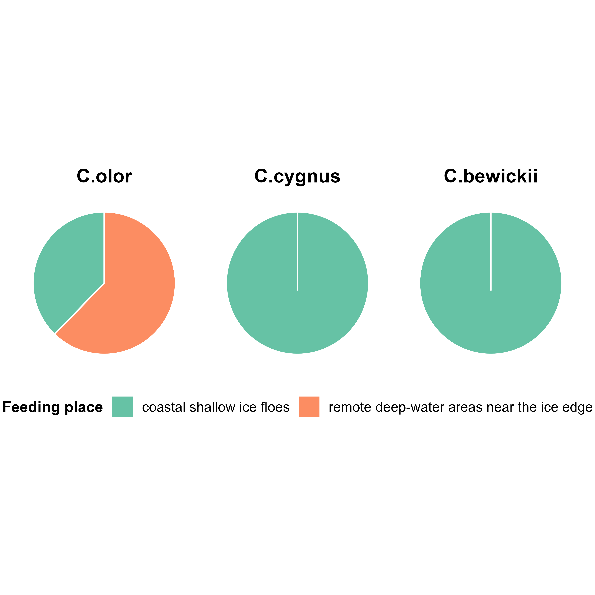
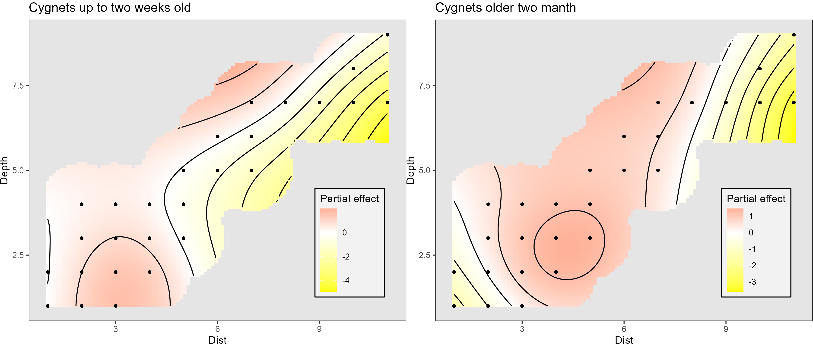
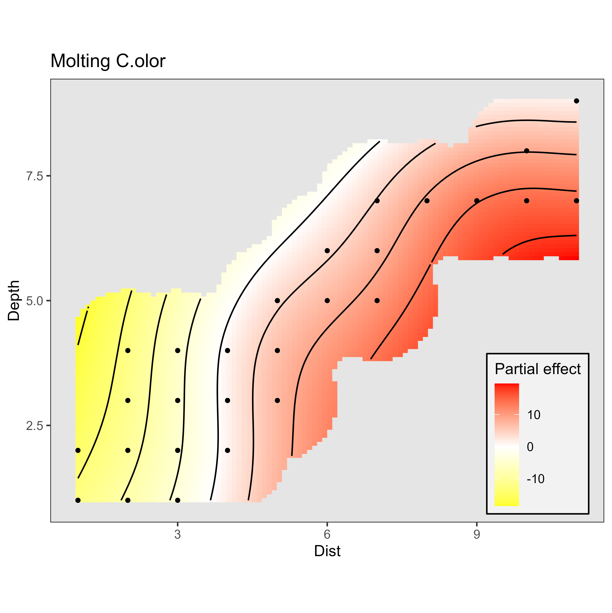

```{r setup, include=FALSE}
library(knitr)
  opts_chunk$set(echo = FALSE, message = FALSE, warning = FALSE)
```


```{r}
library(readxl)
library(dplyr)
library(reshape2)
library(mgcv)
library(ggplot2)
library(cowplot)
library(gratia)


```


```{r}

dat <- read_excel("Data/swans.xlsx")


dat <-
  dat %>% 
  filter(Depth < 20)

dat2 <- 
dat %>% 
  dplyr::select(Ice, Depth,  Dist,  Year, Date, Site, C.olor, C.cygnus, C.bewickii) %>% 
  melt(id.vars = c("Ice", "Depth",  "Dist",  "Year", "Date", "Site" ), variable.name = "Species", value.name = "N")


dat2$Species <- factor(dat2$Species)
dat2$Ice <- factor(dat2$Ice, labels = c("Ice_cover", "No_ice"))
dat2$Site <- factor(dat2$Site)

```


```{r echo=FALSE}
Mod <- gam(N ~ s(Year, by = Species, k = 5) +
             s(Dist, Depth,  by = interaction(Species, Ice), k = 10) +
             Species + Ice +
             s(Site, bs = "re", k = length(unique(dat2$Site))),
             data = dat2,
             family = nb(),
             method = "REML")
```


$$
\begin{aligned}
        N_i &\sim \text{Negative Binomial}(\mu_i, \theta) \\
        \log(\mu_i) &= \beta_0 + f_1(\text{Year}_i) \cdot \mathbb{I}(\text{Species}_i) + f_2(\text{Dist}_i, \text{Depth}_i) \cdot \mathbb{I}(\text{Species}_i, \text{Ice}_i) + \\
        &\quad + \beta_{\text{Species}} \cdot \text{Species}_i + \beta_{\text{Ice}} \cdot \text{Ice}_i + b_{\text{Site}_i} \\
        b_{\text{Site}} &\sim \mathcal{N}(0, \sigma^2_{\text{Site}})
    \end{aligned}
$$

* $N_i$ — численность (обилие) для $i$-го наблюдения;
*  $\mu_i$ — условное математическое ожидание $N_i$;
*  $\theta$ — параметр дисперсии отрицательного биномиального распределения;
*  $\beta_0$ — общий свободный член (intercept);
*  $f_1(\text{Year})$ — функция от года (Year), специфичная для каждого вида (Species);
*  $\mathbb{I}(\text{Species}_i)$ — индикатор вида, позволяющий описывать многолетний тренд для каждого вида;
*  $f_2(\text{Dist}, \text{Depth})$ — двумерная функция от расстояния (Dist) и глубины (Depth), специфичная для каждой комбинации вида (Species) и ледовой обстановки (Ice);
*  $\mathbb{I}(\text{Species}_i, \text{Ice}_i)$ — индикатор взаимодействия вида и ледовой обстановки;
*  $\beta_{\text{Species}}$ — параметрический коэффициент для вида (Species), отражающий фиксированный эффект вида;
*  $\beta_{\text{Ice}}$ — параметрический коэффициент для фактора ледовой обстановки (Ice);
*  $b_{\text{Site}}$ — случайный эффект фактора участка (Site), предполагающий, что наблюдения на одном участке коррелированы;
*  $\sigma^2_{\text{Site}}$ — дисперсия случайных эффектов участка.


<!-- Таблицу summary подобранной модели предлагаю поместить в электронное приложение -->

<!-- ```{r} -->
<!-- library(broom) -->
<!-- library(flextable) -->


<!-- ft <- flextable(tidy(Mod)) -->


<!-- ft %>% -->
<!--   colformat_double(j = c(2, 3, 4), digits = 1) %>%  -->
<!--   colformat_double(j = 5, digits = 3) %>%  -->
<!--   set_header_labels(values = c("Smoother term", "edf", "ref.df", "F", "p-value" )) %>%  -->
<!--   set_caption("Таблица 1. Результаты подгонки обобщенной аддитивной модели  (GAMM) для оценки влияния факторов на пространственное распределение трех видов лебедей в ледовый и безледовый периоды.  Table 1. Fitting results of the generalized additive mixed model (GAMM) assessing the effects of environmental factors on the spatial distribution of three swan speciesduring ice-covered and ice-free periods") -->

<!-- # summary(Mod) -->
<!-- ``` -->


```{r}
theme_set(theme_bw() + theme(legend.position = "botom"))
```


<!-- Эти три картинки я предлагаю убрать в электронное приложение -->

<!-- ```{r} -->
<!-- library(cowplot) -->

<!-- # Извлекаем каждый график и модифицируем -->
<!-- p1 <- draw(Mod, select = 1) +  -->
<!--   scale_x_continuous(breaks = function(x) floor(seq(min(x), max(x), length.out = 11))) + -->
<!--   theme(axis.text.x = element_text(angle = 90)) -->

<!-- p2 <- draw(Mod, select = 2) +  -->
<!--   scale_x_continuous(breaks = function(x) floor(seq(min(x), max(x), length.out = 11)))+ -->
<!--   theme(axis.text.x = element_text(angle = 90)) -->

<!-- p3 <- draw(Mod, select = 3) +  -->
<!--   scale_x_continuous(breaks = function(x) floor(seq(min(x), max(x), length.out = 11)))+ -->
<!--   theme(axis.text.x = element_text(angle = 90)) -->

<!-- # Объединяем -->
<!-- plot_grid(p1, p2, p3, nrow =1) -->


<!-- ``` -->


### Разделение экологических ниш в градиенте Depth-Distance в безледный период


```{r}
sm <- smooth_estimates(Mod) 

# "s(Dist,Depth):interaction(Species, Ice)C.olor.Ice_cover"    
# "s(Dist,Depth):interaction(Species, Ice)C.cygnus.Ice_cover"  
# "s(Dist,Depth):interaction(Species, Ice)C.bewickii.Ice_cover"
# "s(Dist,Depth):interaction(Species, Ice)C.olor.No_ice"       
# "s(Dist,Depth):interaction(Species, Ice)C.cygnus.No_ice"     
# "s(Dist,Depth):interaction(Species, Ice)C.bewickii.No_ice" 

```


```{r}
# color set

color_high = "red"
color_low = "yellow"

```


```{r}
library(sp)
library(raster)

# Данные для конкретной комбинации
points_data <- dat2[dat2$Species == "C.olor" & dat2$Ice == "No_ice", c("Dist", "Depth")]

# Создаем растровую маску на основе расстояния до ближайшей точки
smooth_data <- sm %>% 
  filter(.smooth == "s(Dist,Depth):interaction(Species, Ice)C.olor.No_ice")

# Преобразуем в SpatialPoints
coordinates(points_data) <- ~Dist+Depth

# Для каждой точки сетки вычисляем расстояние до ближайшей точки данных
distances <- apply(smooth_data[, c("Dist", "Depth")], 1, function(point) {
  min(sqrt((points_data$Dist - point["Dist"])^2 + (points_data$Depth - point["Depth"])^2))
})

# Включаем точки, которые находятся в пределах порогового расстояния
threshold <- quantile(distances[distances > 0], 0.15) * 3  # например, удвоенное медианное расстояние
smooth_data_filtered <- smooth_data[distances <= threshold, ]

# График

Pl_sp1 <-
ggplot(smooth_data_filtered, aes(Dist, Depth)) +
  geom_tile(aes(fill = .estimate)) +
  geom_point(data = as.data.frame(points_data), size = 1, alpha = 0.5) +
  geom_contour(aes(z = .estimate), color = "black", bins = 10) +
  scale_fill_gradient2(low = color_low, mid = "white", high =  color_high) +
  coord_fixed() +
  ggtitle("C.olor") +
  labs(fill = "Partial effect", x = NULL, y = NULL) +
  theme(
    panel.grid = element_blank(),
    panel.background = element_rect(fill = "gray90", color = NA),
    legend.position = c(0.88, 0.18),
    legend.background = element_rect(fill = alpha("white", 0.5), color = "black"))

  ggsave(plot = Pl_sp1, filename = "Figures/Pl_sp1_ice_free.png", dpi = 600)
  
```


```{r}
smooth_data <- sm %>% 
  filter(.smooth == "s(Dist,Depth):interaction(Species, Ice)C.cygnus.No_ice")

# Для каждой точки сетки вычисляем расстояние до ближайшей точки данных
distances <- apply(smooth_data[, c("Dist", "Depth")], 1, function(point) {
  min(sqrt((points_data$Dist - point["Dist"])^2 + (points_data$Depth - point["Depth"])^2))
})

# Включаем точки, которые находятся в пределах порогового расстояния
threshold <- quantile(distances[distances > 0], 0.15) * 3  # например, удвоенное медианное расстояние
smooth_data_filtered <- smooth_data[distances <= threshold, ]

# График
Pl_sp2 <-
ggplot(smooth_data_filtered, aes(Dist, Depth)) +
  geom_tile(aes(fill = .estimate)) +
  geom_point(data = as.data.frame(points_data), size = 1, alpha = 0.5) +
  geom_contour(aes(z = .estimate), color = "black", bins = 10) +
  scale_fill_gradient2(low = color_low, mid = "white", high =  color_high) +
  coord_fixed() +
  ggtitle("C.cygnus") +
  labs(fill = "Partial effect", x = NULL, y = NULL) +
 theme(
    panel.grid = element_blank(),
    panel.background = element_rect(fill = "gray90", color = NA),
    legend.position = c(0.88, 0.18),
    legend.background = element_rect(fill = alpha("white", 0.5), color = "black"))

  ggsave(plot = Pl_sp2, filename = "Figures/Pl_sp2_ice_free.png", dpi = 600)
```


```{r}
smooth_data <- sm %>% 
  filter(.smooth == "s(Dist,Depth):interaction(Species, Ice)C.bewickii.No_ice")

# Для каждой точки сетки вычисляем расстояние до ближайшей точки данных
distances <- apply(smooth_data[, c("Dist", "Depth")], 1, function(point) {
  min(sqrt((points_data$Dist - point["Dist"])^2 + (points_data$Depth - point["Depth"])^2))
})

# Включаем точки, которые находятся в пределах порогового расстояния
threshold <- quantile(distances[distances > 0], 0.15) * 3  # например, удвоенное медианное расстояние
smooth_data_filtered <- smooth_data[distances <= threshold, ]

# График
Pl_sp3 <-
  ggplot(smooth_data_filtered, aes(Dist, Depth)) +
  geom_tile(aes(fill = .estimate)) +
  geom_point(data = as.data.frame(points_data), size = 1, alpha = 0.5) +
  geom_contour(aes(z = .estimate), color = "black", bins = 10) +
  scale_fill_gradient2(low = color_low, mid = "white", high =  color_high) +
  coord_fixed() +
  ggtitle("C.bewickii") +
  labs(fill = "Partial effect", x = NULL, y = NULL) +
 theme(
    panel.grid = element_blank(),
    panel.background = element_rect(fill = "gray90", color = NA),
    legend.position = c(0.88, 0.18),
    legend.background = element_rect(fill = alpha("white", 0.5), color = "black"))

  ggsave(plot = Pl_sp3, filename = "Figures/Pl_sp3_ice_free.png", dpi = 600)

```


```{r}

library(png)

Pl_sp1 <- readPNG("Figures/Pl_sp1_ice_free.png")
Pl_sp2 <- readPNG("Figures/Pl_sp2_ice_free.png")
Pl_sp3 <- readPNG("Figures/Pl_sp3_ice_free.png")

library(magick)

# Чтение и соединение
combined <- image_read(c(
  "Figures/Pl_sp1_ice_free.png",
  "Figures/Pl_sp2_ice_free.png",
  "Figures/Pl_sp3_ice_free.png"
)) %>%
  image_append(stack = TRUE)  # stack = TRUE для вертикального соединения

# Сохранение
image_write(combined, "Figures/combined_vertical_ice_free.png")


```


```{r}
library(sp)
library(raster)

# Данные для конкретной комбинации
points_data <- dat2[dat2$Species == "C.olor" & dat2$Ice == "Ice_cover", c("Dist", "Depth")]

# Создаем растровую маску на основе расстояния до ближайшей точки
smooth_data <- sm %>% 
  filter(.smooth == "s(Dist,Depth):interaction(Species, Ice)C.olor.Ice_cover")

# Преобразуем в SpatialPoints
coordinates(points_data) <- ~Dist+Depth

# Для каждой точки сетки вычисляем расстояние до ближайшей точки данных
distances <- apply(smooth_data[, c("Dist", "Depth")], 1, function(point) {
  min(sqrt((points_data$Dist - point["Dist"])^2 + (points_data$Depth - point["Depth"])^2))
})

# Включаем точки, которые находятся в пределах порогового расстояния
threshold <- quantile(distances[distances > 0], 0.15) * 1.6  # например, удвоенное медианное расстояние
smooth_data_filtered <- smooth_data[distances <= threshold, ]

# График
Pl_sp1 <-
ggplot(smooth_data_filtered, aes(Dist, Depth)) +
  geom_tile(aes(fill = .estimate)) +
  geom_point(data = as.data.frame(points_data), size = 1, alpha = 0.5) +
  geom_contour(aes(z = .estimate), color = "black", bins = 10) +
  scale_fill_gradient2(low = color_low, mid = "white", high = color_high) +
  coord_fixed() +
  ggtitle("C.olor") +
  labs(fill = "Partial effect", x = NULL, y = NULL) +
 theme(
    panel.grid = element_blank(),
    panel.background = element_rect(fill = "gray90", color = NA),
    legend.position = c(0.88, 0.18),
    legend.background = element_rect(fill = alpha("white", 0.5), color = "black"))

  ggsave(plot = Pl_sp1, filename = "Figures/Pl_sp1_ice_melting.png", dpi = 600)

```


```{r}
smooth_data <- sm %>% 
  filter(.smooth == "s(Dist,Depth):interaction(Species, Ice)C.cygnus.Ice_cover")

# Для каждой точки сетки вычисляем расстояние до ближайшей точки данных
distances <- apply(smooth_data[, c("Dist", "Depth")], 1, function(point) {
  min(sqrt((points_data$Dist - point["Dist"])^2 + (points_data$Depth - point["Depth"])^2))
})

# Включаем точки, которые находятся в пределах порогового расстояния
threshold <- quantile(distances[distances > 0], 0.15) * 1.6  # например, удвоенное медианное расстояние
smooth_data_filtered <- smooth_data[distances <= threshold, ]

# График
Pl_sp2 <-
ggplot(smooth_data_filtered, aes(Dist, Depth)) +
  geom_tile(aes(fill = .estimate)) +
  geom_point(data = as.data.frame(points_data), size = 1, alpha = 0.5) +
  geom_contour(aes(z = .estimate), color = "black", bins = 10) +
  scale_fill_gradient2(low = color_low, mid = "white", high = color_high) +
  coord_fixed() +
  ggtitle("C.cygnus") +
  labs(fill = "Partial effect", x = NULL, y = NULL) +
 theme(
    panel.grid = element_blank(),
    panel.background = element_rect(fill = "gray90", color = NA),
    legend.position = c(0.88, 0.18),
    legend.background = element_rect(fill = alpha("white", 0.5), color = "black"))

  ggsave(plot = Pl_sp2, filename = "Figures/Pl_sp2_ice_melting.png", dpi = 600)
```


```{r}
smooth_data <- sm %>% 
  filter(.smooth == "s(Dist,Depth):interaction(Species, Ice)C.bewickii.Ice_cover")

# Для каждой точки сетки вычисляем расстояние до ближайшей точки данных
distances <- apply(smooth_data[, c("Dist", "Depth")], 1, function(point) {
  min(sqrt((points_data$Dist - point["Dist"])^2 + (points_data$Depth - point["Depth"])^2))
})

# Включаем точки, которые находятся в пределах порогового расстояния
threshold <- quantile(distances[distances > 0], 0.15) * 1.6  # например, удвоенное медианное расстояние
smooth_data_filtered <- smooth_data[distances <= threshold, ]

# График
Pl_sp3 <-
ggplot(smooth_data_filtered, aes(Dist, Depth)) +
  geom_tile(aes(fill = .estimate)) +
  geom_point(data = as.data.frame(points_data), size = 1, alpha = 0.5) +
  geom_contour(aes(z = .estimate), color = "black", bins = 10) +
  scale_fill_gradient2(low = color_low, mid = "white", high = color_high) +
  coord_fixed() +
  ggtitle("C.bewickii") +
  labs(fill = "Partial effect", x = NULL, y = NULL) +
  theme(
    panel.grid = element_blank(),
    panel.background = element_rect(fill = "gray90", color = NA),
    legend.position = c(0.88, 0.18),
    legend.background = element_rect(fill = alpha("white", 0.5), color = "black"))

  ggsave(plot = Pl_sp3, filename = "Figures/Pl_sp3_ice_melting.png", dpi = 600)
```


```{r}

library(magick)

# Чтение и соединение
combined_ice_melting <- image_read(c(
  "Figures/Pl_sp1_ice_melting.png",
  "Figures/Pl_sp2_ice_melting.png",
  "Figures/Pl_sp3_ice_melting.png"
)) %>%
  image_append(stack = TRUE)  # stack = TRUE для вертикального соединения

# Сохранение
image_write(combined_ice_melting, "Figures/combined_ice_melting.png")

```


```{r}
combined_two_periods <- image_read(c(
  "Figures/combined_ice_melting.png",
  "Figures/combined_vertical_ice_free.png")) %>%
  image_trim() %>%  # убирает пустые поля вокруг каждого изображения
  image_border("white", "0x10") %>%  # опционально: добавить небольшой отступ между ними
  image_append(stack = FALSE) 

# Сохранение
image_write(combined_two_periods, "Figures/combined_two_periods.png")


```


```{r, fig.cap="Рисунок +. Связь численности трех видов лебедей с глубиной и расстоянием от берега в безледный период A и в период таяния льда B в соответствии с Моделью GAMM1. Relationship between the abundance of three swan species and depth and distance from the shore during the ice-free period A and the ice-melting period B according to Model GAMM1."}


include_graphics("Figures/combined_two_periods.png")

```


```{r}
dat_ice <- read_excel("Data/swans.xlsx", sheet = "Ice_period")


dat_ice_long <- 
melt(dat_ice, id.vars = c("ID", "Ice", "Feeding_place", "Depth", "Dist"       , "Year", "Date", "Site" ), variable.name = "Species", value.name = "Abund")

# dat_ice_long %>% 
#   group_by(Feeding_place, Species) %>% 
#   summarise(Mean_abund = mean(Abund))


```


```{r}

mean_data <- dat_ice_long %>%
  group_by(Feeding_place, Species) %>%
  summarise(Mean_abund = mean(Abund, na.rm = TRUE), .groups = "drop") %>%
  group_by(Species) %>%
  mutate(Proportion = Mean_abund / sum(Mean_abund))  # доля для секторной диаграммы


# Создание палитры для Feeding_place
feeding_place_colors <- c(
  "Coastal shallow-water polynyas" = "#66c2a5",
  "Remote deep-water areas near the fast ice" = "#fc8d62"
)

# Функция для создания диаграммы для одного вида
plot_species_pie <- function(species_name) {
  species_data <- mean_data %>%
    filter(Species == species_name)
  
  ggplot(species_data, aes(x = "", y = Proportion, fill = Feeding_place)) +
    geom_bar(stat = "identity", width = 1, color = "white") +
    coord_polar("y", start = 0) +
    scale_fill_manual(values = c("#66c2a5", "#fc8d62")) +
    labs(title = paste(species_name),
         fill = "Feeding place",
         x = NULL, y = NULL) +
    theme_minimal() +
    theme(
      axis.text = element_blank(),
      panel.grid = element_blank(),
      plot.title = element_text(hjust = 0.5, size = 14, face = "bold"),
      legend.position = "bottom",
      legend.text = element_text(size = 10),
      legend.title = element_text(size = 11, face = "bold")
    ) 
    # # Добавление процентов на диаграмму
    # geom_text(aes(label = paste0(round(Proportion * 100, 1), "%")),
    #           position = position_stack(vjust = 0.5),
    #           color = "black", fontface = "bold", size = 5)
}

# Создание диаграмм для каждого вида
plot_Sp1 <- plot_species_pie("C.olor")
plot_Sp2 <- plot_species_pie("C.cygnus")
plot_Sp3 <- plot_species_pie("C.bewickii")


library(patchwork)

combined_plots <- plot_Sp1 + plot_Sp2 + plot_Sp3 +
  plot_layout(guides = "collect") &  # собираем все легенды в одну
  theme(legend.position = "bottom")   # размещаем общую легенду снизу

ggsave(plot = combined_plots, filename = "Figures/Pay_chart.png", dpi = 600)
```


```{r}

```


```{r}

dat_cygnets <- read_excel("Data/swans.xlsx", sheet = "C.olor_Chicks")


dat_cygnets <-
  dat_cygnets %>% 
  filter(Depth < 20)

dat_cygnets2 <- 
dat_cygnets %>% 
  dplyr::select(Depth,  Dist,  Year, Site, Cygnets_Young, Cygnets_Old) %>% 
  melt(id.vars = c("Depth",  "Dist",  "Year", "Site" ), variable.name = "Cygnets_Age", value.name = "N")


dat_cygnets2$Cygnets_Age <- factor(dat_cygnets2$Cygnets_Age)
dat_cygnets2$Site <- factor(dat_cygnets2$Site)


```


```{r}
Mod_2 <- gam(N ~ s(Year, by = Cygnets_Age, k = 10) +
             s(Dist, Depth,  by = Cygnets_Age, k = 10) +
             Cygnets_Age +
             s(Site, bs = "re", k = length(unique(dat2$Site))),
             data = dat_cygnets2,
             family = nb(),
             method = "REML")
```


<!-- ```{r} -->
<!-- library(DHARMa) -->
<!-- simulateResiduals(Mod_2, plot = T) -->
<!-- ``` -->


```{r}
sm <- smooth_estimates(Mod_2) 

```


```{r}
library(sp)
library(raster)

# Данные для конкретной комбинации
points_data <- dat_cygnets2[dat_cygnets2$Cygnets_Age == "Cygnets_Young", c("Dist", "Depth")]

# Создаем растровую маску на основе расстояния до ближайшей точки
smooth_data <- sm %>% 
  filter(.smooth == "s(Dist,Depth):Cygnets_AgeCygnets_Young")

# Преобразуем в SpatialPoints
coordinates(points_data) <- ~Dist+Depth

# Для каждой точки сетки вычисляем расстояние до ближайшей точки данных
distances <- apply(smooth_data[, c("Dist", "Depth")], 1, function(point) {
  min(sqrt((points_data$Dist - point["Dist"])^2 + (points_data$Depth - point["Depth"])^2))
})

# Включаем точки, которые находятся в пределах порогового расстояния
threshold <- quantile(distances[distances > 0], 0.15) * 3  # например, удвоенное медианное расстояние
smooth_data_filtered <- smooth_data[distances <= threshold, ]

# График
Pl_Cygnets_Young <-
ggplot(smooth_data_filtered, aes(Dist, Depth)) +
  geom_tile(aes(fill = .estimate)) +
  geom_point(data = as.data.frame(points_data), size = 1, alpha = 0.5) +
  geom_contour(aes(z = .estimate), color = "black", bins = 10) +
  scale_fill_gradient2(low = color_low, mid = "white", high = color_high) +
  coord_fixed() +
  ggtitle("Cygnets up to two weeks old") +
  labs(fill = "Partial effect") +
  theme(
    panel.grid = element_blank(),
    panel.background = element_rect(fill = "gray90", color = NA),
    legend.position = c(0.85, 0.26),
    legend.background = element_rect(fill = alpha("white", 0.5), color = "black"))

ggsave(plot = Pl_Cygnets_Young, filename = "Figures/Pl_Cygnets_Young.png")
```


```{r}
# Данные для конкретной комбинации
points_data <- dat_cygnets2[dat_cygnets2$Cygnets_Age == "Cygnets_Old", c("Dist", "Depth")]

# Создаем растровую маску на основе расстояния до ближайшей точки
smooth_data <- sm %>% 
  filter(.smooth == "s(Dist,Depth):Cygnets_AgeCygnets_Old")

# Преобразуем в SpatialPoints
coordinates(points_data) <- ~Dist+Depth

# Для каждой точки сетки вычисляем расстояние до ближайшей точки данных
distances <- apply(smooth_data[, c("Dist", "Depth")], 1, function(point) {
  min(sqrt((points_data$Dist - point["Dist"])^2 + (points_data$Depth - point["Depth"])^2))
})

# Включаем точки, которые находятся в пределах порогового расстояния
threshold <- quantile(distances[distances > 0], 0.15) * 3  # например, удвоенное медианное расстояние
smooth_data_filtered <- smooth_data[distances <= threshold, ]

# График
Pl_Cygnets_Old <-
ggplot(smooth_data_filtered, aes(Dist, Depth)) +
  geom_tile(aes(fill = .estimate)) +
  geom_point(data = as.data.frame(points_data), size = 1, alpha = 0.5) +
  geom_contour(aes(z = .estimate), color = "black", bins = 10) +
  scale_fill_gradient2(low = color_low, mid = "white", high = color_high) +
  coord_fixed() +
  ggtitle("Cygnets older two manth") +
  labs(fill = "Partial effect") +
  theme(
    panel.grid = element_blank(),
    panel.background = element_rect(fill = "gray90", color = NA),
    legend.position = c(0.85, 0.26),
    legend.background = element_rect(fill = alpha("white", 0.5), color = "black"))

ggsave(plot = Pl_Cygnets_Old, filename = "Figures/Pl_Cygnets_Old.png")
```

```{r}
combined_cygnets <- image_read(c(
  "Figures/Pl_Cygnets_Young.png",
  "Figures/Pl_Cygnets_Old.png")) %>%
  image_trim() %>%  # убирает пустые поля вокруг каждого изображения
  image_border("white", "0x10") %>%  # опционально: добавить небольшой отступ между ними
  image_append(stack = FALSE) 

# Сохранение
image_write(combined_cygnets, "Figures/combined_Cygnets.png")

```


```{r}

```


# Модель пространственного распределения линяющийх особей лебедя-шипуна

```{r}

dat_molting <- read_excel("Data/swans.xlsx", sheet = "C.olor_Chicks")


dat_molting <-
  dat_molting %>% 
  filter(Depth < 20)

dat_molting2 <- 
dat_molting %>% 
  dplyr::select(Depth,  Dist,  Year, Site, Molting_Birds) %>% 
  melt(id.vars = c("Depth",  "Dist",  "Year", "Site" ), variable.name = "Stage", value.name = "N")

dat_molting2$Site <- factor(dat_molting2$Site)


```


```{r}

Mod_3 <- gam(N ~ s(Year, k = 10) +
             s(Dist, Depth, k = 10) +
             s(Site, bs = "re", k = length(unique(dat2$Site))),
             data = dat_molting2,
             family = nb(),
             method = "REML")
```


<!-- ```{r} -->
<!-- library(DHARMa) -->
<!-- simulateResiduals(Mod_2, plot = T) -->
<!-- ``` -->


```{r}
sm <- smooth_estimates(Mod_3) 

```


```{r}
library(sp)
library(raster)

# Данные для конкретной комбинации
points_data <- dat_molting2[, c("Dist", "Depth")]

# Создаем растровую маску на основе расстояния до ближайшей точки
smooth_data <- sm %>% 
  filter(.smooth == "s(Dist,Depth)")

# Преобразуем в SpatialPoints
coordinates(points_data) <- ~Dist+Depth

# Для каждой точки сетки вычисляем расстояние до ближайшей точки данных
distances <- apply(smooth_data[, c("Dist", "Depth")], 1, function(point) {
  min(sqrt((points_data$Dist - point["Dist"])^2 + (points_data$Depth - point["Depth"])^2))
})

# Включаем точки, которые находятся в пределах порогового расстояния
threshold <- quantile(distances[distances > 0], 0.15) * 3  # например, удвоенное медианное расстояние
smooth_data_filtered <- smooth_data[distances <= threshold, ]

# График
Pl_Molting_Birds <-
ggplot(smooth_data_filtered, aes(Dist, Depth)) +
  geom_tile(aes(fill = .estimate)) +
  geom_point(data = as.data.frame(points_data), size = 1, alpha = 0.5) +
  geom_contour(aes(z = .estimate), color = "black", bins = 10) +
  scale_fill_gradient2(low = color_low, mid = "white", high = color_high) +
  coord_fixed() +
  ggtitle("Molting C.olor") +
  labs(fill = "Partial effect") +
   theme(
    panel.grid = element_blank(),
    panel.background = element_rect(fill = "gray90", color = NA),
    legend.position = c(0.88, 0.2),
    legend.background = element_rect(fill = alpha("white", 0.5), color = "black"))

ggsave(plot = Pl_Molting_Birds, filename = "Figures/Pl_Molting_Birds.png",  dpi = 600)

```


```{r}

```


