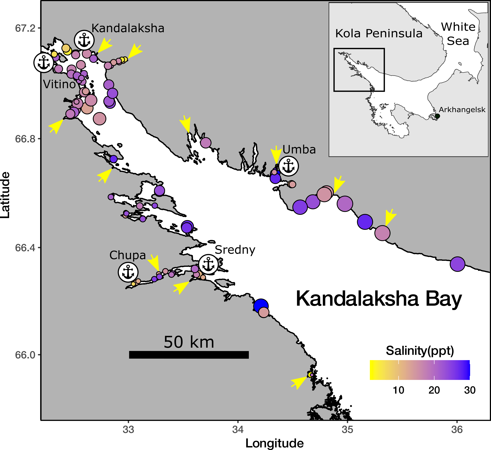
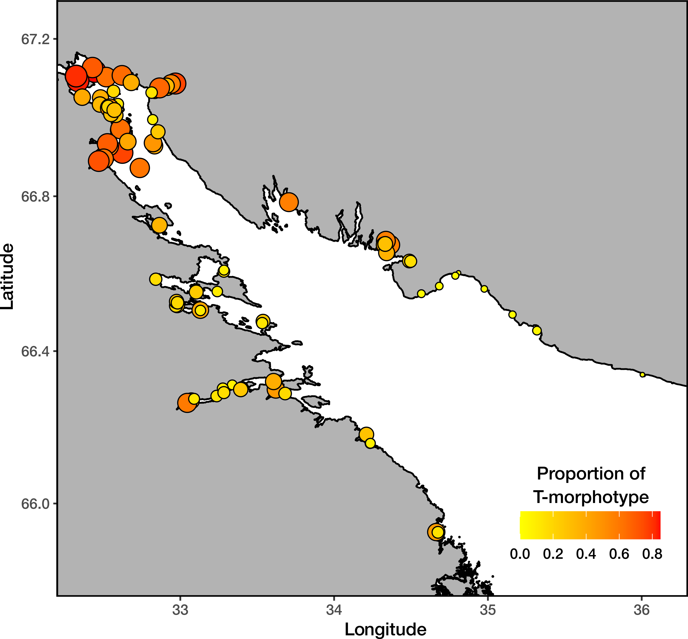

```{r setup, include=FALSE}
library(knitr)
opts_chunk$set(echo = FALSE, message = FALSE)
options(knitr.kable.NA = '')
```

```{r}
## Packages ######

library(ggplot2)
library(lme4)
library(glmmADMB)
library(reshape2)
library(dplyr)
library(patchwork)
library(broom)
library(broom.mixed)
library(tidyr)


```

```{r}
##### Data reading
myt <- read.table("data/Distred_samples_fetch_corrected_2021.csv", header = T, sep = ",")

sal <- read.table("data/Distred_samples_salinity_2021.csv", header = T, sep = ",")

myt <- merge(myt, sal, all = T)

river_full <- read.table("data/Rivers_2021.csv", sep = ",", header = T)

river <- river_full %>% select(-Source)


ports <- data.frame(Shore = c("Kand", "Karel", "Kand", "Karel", "Karel", "Karel"), Port = c("Kandalaksha", "Vitino", "Umba", "Chupa", "Keret", "Kovda"), Status = c("Active", "Active", "Abandoned", "Abandoned", "Abandoned", "Abandoned"  ), Lat = c(67.137283, 67.076570,  66.677970, 66.269964, 66.294178, 66.696754), Lon = c(32.407995, 32.333630, 34.357655, 33.069534, 33.640656, 32.875396))


sites_fetch_df <- read.table("data/Distred_samples_fetch_values_2023.csv", sep = ",", header = T)

sites_fetch_df[,1:5] <- sites_fetch_df[,1:5]/1000 

```

```{r}
# Combine all variables in commondataset

#The function for calculation of neares object and distance to it  

nearest_dist <- function(XY, objects = river, x.name = "Lon", y.name = "Lat"){
  
  XY1 <-as.numeric(XY[,1])
  XY2 <- as.numeric(XY[,2])
  dist <- (acos(sin(XY1*pi/180)*sin(objects[ ,y.name]*pi/180) + cos(XY1*pi/180)*cos(objects[ ,y.name]*pi/180)*cos(XY2*pi/180 - objects[ ,x.name]*pi/180)) * 6371)
  
  MD <- data.frame(Min_dist = min(dist))
  cbind(objects[which(dist == min(dist)), ], MD)
  
}


# The distance to mouth of the neares river 

df_river <- nearest_dist(XY = myt[1, c("Lat", "Lon")], objects = river)

df_river[1,] <- NA

for(i in 1:nrow(myt)) {
  df_river[i,] <- nearest_dist(XY = myt[i, c("Lat", "Lon")], objects = river)
  df_river$Site[i] <- as.character(myt$Site)[i]
}


names(df_river) <- c( "Shore_river", "River",  "Drainage_Area", "River_Size", "Lat_river", "Lon_river", "Min_dist_river", "Site" )


# The distance to mouth of the neares Large river 

river_Large <- river %>% filter(River_Size == "Large")

df_river_Large <- nearest_dist(XY = myt[1, c("Lat", "Lon")], objects = river_Large)

df_river_Large[1,] <- NA

for(i in 1:nrow(myt)) {
  df_river_Large[i,] <- nearest_dist(XY = myt[i, c("Lat", "Lon")], objects = river_Large)
  df_river_Large$Site[i] <- as.character(myt$Site)[i]
}

names(df_river_Large) <- c( "Shore_river_Large", "River_Large",  "Drainage_Area_Large", "River_Size_Large", "Lat_river_Large", "Lon_river_Large", "Min_dist_river_Large", "Site" )


# The distance to the neares port 

df_port <- nearest_dist(XY = myt[1, c("Lat", "Lon")], objects = ports)

df_port[1,] <- NA

for(i in 1:nrow(myt)) {
  df_port[i,] <- nearest_dist(XY = myt[i, c("Lat", "Lon")], objects = ports)
  df_port$Site[i] <- as.character(myt$Site)[i]
}

names(df_port) <- c("Shore_port",  "Port","Port_Status", "Lat_port", "Lon_port", "Min_dist_port", "Site")

# Merging all data in one data set

d1 <- cbind(myt, df_river %>% select( - Site))

d2 <- cbind(d1, df_river_Large %>% select( - Site))

d3 <- cbind(d2, df_port %>% select(-Site))

d4 <- merge(d3, sites_fetch_df, by = "Site")

myt_full <- d4 %>% select(-River_Size_Large)


```


```{r}
# Сonventional coordinates of the top of the Kandalaksha Bay
Shore_boundary = c(67.162360, 32.332371)

# Conversion of coordinates to radians
Shore_boundary <- Shore_boundary*pi/180

# Calculating the distance from each site to the top of the Kandalksha bay
myt_full$Dist_cut <- with(myt_full, acos(sin(Shore_boundary[1])*sin(Lat*pi/180) + cos(Shore_boundary[1])*cos(Lat*pi/180)*cos(Shore_boundary[2] - Lon*pi/180))) * 6371

myt_full <- myt_full %>% mutate(Prop_T = N_T / (N_T + N_E))

```

```{r}
# Убираем сайты с неполной схемой вятия проб (нет пары фукус-грунт, или какой-нибудь другой сбой в схеме взятия проб)

sites_excluded <- c("chupa_fg", "umba_pioner", "umba_06", "umba_fg", "umba_sovhoz", "umba_kamni", "umba_bridge", "umba_pikut", "padan", "porya", "Vor5", "Ovech", "oenij", "Korg", "Mat", "Mal", "salnij", "Lubch", "kanal",  "Vor4", "Vor2", "Kurt", "Ryazh4", "Ryazh5", "Youzh")

myt_full <- myt_full %>% filter(! Site %in% sites_excluded) 


# By design of field collection, each of the samples within the site received equal coordinates. To analyze the presence of spatial autocorrelations (Moran's I test), it is necessary that there are no zero distances between units. For this purpose, the coordinates of five of the six samples in each site were formally changed to the minimum possible value of the coordinates.       

myt_full$Lat2 <- myt_full$Lat + rep(seq(0, 0.00000005, by = 0.00000001), nrow(myt_full)/6)

myt_full$Lon2 <- myt_full$Lon + rep(seq(0, 0.00000005, by = 0.00000001), nrow(myt_full)/6)


```


```{r}

myt_full$Position <- factor(myt_full$Position)

myt_full$Position <- relevel(myt_full$Position, ref = "Bottom")

myt_full$Port_Status <- factor(myt_full$Port_Status)

myt_full$Port_Status <- relevel(myt_full$Port_Status, ref = "Abandoned")

myt_full$River_Size <- factor(myt_full$River_Size)

myt_full$River_Size <- relevel(myt_full$River_Size, ref = "Small")

myt_full$Site <- factor(myt_full$Site)

```


```{r}
myt_site <- myt_full %>% 
  group_by(Shore, Site) %>% 
  select(Lat, Lon, N_T, N_E, Salinity, Min_dist_river, River, River_Size, Min_dist_river_Large, Min_dist_port, Port, Port_Status, Average_Fetch, Dist_cut) %>% 
  summarise(Lat = mean(Lat), Lon = mean(Lon), N_T = sum(N_T), N_E = sum(N_E), Salinity = mean(Salinity), Min_dist_river = mean(Min_dist_river), River = unique(River), River_Size = unique(River_Size), Min_dist_river_Large = mean(Min_dist_river_Large),  Min_dist_port = mean(Min_dist_port), Port = unique(Port), Port_Status = unique(Port_Status), Average_Fetch = mean(Average_Fetch),   Dist_cut = mean(Dist_cut)) %>% 
  mutate(Prop_T = N_T/(N_T+N_E))

```

## Introduction

Blue mussels (genera *Mytilus*) being powerful ecosystem engineers (Günther, 1996; Commito & Rusignuolo, 2000; Arribas et al., 2014; Khalaman et al. 2021) play an important role in structuring coastal communities in the seas of the Northern Hemisphere (Buschbaum et al. 2009). Dense assemblages of these mollusks create habitats for a number of animals, plants and microorganisms inhabiting the biogenic environment created by mussels (Tsuchia & Nishihira, 1985, 1986; Dittman 1990; Khaitov 2013; Khalaman et al 2021 +++). In recent decades one of the significant challenges for the mussel ecology investigations in North Atlantic became their taxonomic heterogeneity (Regines Cunningham, 2005). Three closely related, cryptic, species *M. galloprovincialis*, *M. edulis* (thereafter *ME*) and *M. trossulus* (*MT*) can form mixed settlements (Varvio et al., 1988; Hilbish et al., 2000; Mathiesen et al. 2016; Brooks, Farmen, 2013; Riginos, Cunningham, 2005; Katolikova et al. 2016; Vainola, Strelkov 2011; Wenne et al. 2020). Genetic effects occurring in such contact zones were  in the focus of numerous investigations revealed that these cryptic species, while keeping their relative genetic isolation, are involved in limited introgressive hybridization (Bierne et al., 2002; Bierne et al., 2003; Michalek et al 2016; Simon et al., 2019 and references therein). The later can lead to shifts of some morphological traits which could be important from an ecological point of view (e.g. shell thickness, see Michalek et al., 2021). 
 

<!-- Mussels play a crucial role as a food for numerous consumers such as dog whelks (Hunt, Sheibling 1998), crabs (Chakravarti, Cotton, 2013; Lowen et al, 2013; Wójcik et al. 2015 ), starfish (Nauen, 1978; Dare 1982; Kautsky et al., 1990; Seed, Suchanek, 1992; Gaymer et al., 2001; Saier 2001 ), fish (Lappalainen et al, 2005), birds (Norton-Griffiths, 1967; Beukema et al., 2010; Ens, Goss-Custardt, 1984), and humans, both ancient (Colonese et al., 2011) and modern (Dias et al., 2011). -->


At the same time, it is unclear whether the ecological role of cryptic mussel species differs when they form mixed populations. In some cases, ecologists  turn a blind eye to the presence of several mussel species, continuing to believe that a single species is represented in their region (Khalaman et al. 2021), although genetic investigations revealed two different species (Katolikova et al., 2016). Another approach is to designate the cryptic species complex as "*Mytilus* spp." (Leopold et al 2019). Both approaches can lead to coarsen results and lose some ecological patterns  because different mussel species  can interact differently with both environmental factors (Beyer et al. 2017).  Such ecological asymmetry of different species  was revealed in studies dedicated to interactions of mussels with polutants (Lobel et al., 1990; Beyer et al., 2017), predators (Khaitov et al. 2018; Lowen et al., 2013) and parasites (Pasteur et al. 1991) including transmissible cancer (Hammel et al., 2022). The most striking ecological difference of cryptic mussel species can be seen in their interaction with humans expressing in  different commercial value of  mussels as aquaculture targets (Mallet et al., 1995; Penney et al. 2002; Beaumont et al., 2008; Dias et al., 2011). 


In light of the above, it seems important to develop approaches to the analysis of the ecological role of mussels, taking into account their taxonomic heterogeneity. The primary task, if moving in this direction,  becomes to understand what factors regulate the distribution of species: in which environment one species should be in abundance and in which the other. 

In this paper, we will consider the case where *ME* and *MT* come into contact, forming mixed populations.  At least seven such contact zones are currently known in the North Atlantic: (1) West Greenland, (2) the coast of North America from the Gulf of Maine to Hudson Bay, (3) northeastern Scotland, (4)  the western Baltic Sea, (5) western Norway, (6) the coast of the Kola Peninsula in the Barents Sea and (7)  the coast of the Kandalaksha Bay of the White Sea (Vainola, Strelkov, 2011; Wenne et al. 2016; Wenne et al. 2020; Katolikova et al. 2016; Khaitov et al, 2021). 

A common feature of all these contact zones is the spatial segregation of *MT* and *ME*.  The proportion of MT:ME in the contact zones can change along some key gradients of the environmental parameters (Väinölä and Hvilsom 1991; Riginos and Cunningham 2005; Väinölä and Strelkov 2011) and the spatial structure of this gradient can change over time (Strelkov et al., 2017). However, some cases of mosaic distribution of *MT* and *ME* have also been described, when spots of higher concentrations of one or other species are present within the region (Moreau et al., 2006; Katolikova et al., 2016; Wenne et al. 2020). The spatial scale of this patchness can range from several kilometers (Moreau et al., 2005; Moreau et al., 2006 report) to a few meters (Katolikova et al., 2016).

On a biogeographic scale, the distribution of *Mytilus* species is thought to be regulated by regional temperature and its correlates (Popovic & Riginos, 2019; Wenne et al., 2020). *MT* is believed to be a more northerly species, more tolerant to cold waters inhabiting areas that once existed in glaciation zones. *ME* potentially can distribute in  cold waters but tend to form settlements in more temperate latitudes (Wenne et al., 2020). At the same time there is no clear latitudinal gradient in the distribution of *MT* and *ME*: in the more southern regions, the Baltic Sea, *MT*-dominated settlements are observed (Vainoal and Strelkov, 2011; Kiewsky et al. 2019), and in the high Arctic areas, Svalbard, mussel settlements formed by *ME* (Wenne et al., 2020).


Salinity was often considered as a key factor regulating the spatial segregation of species in local *ME* and *MT* contact zones. *MT* are thought to gravitate toward areas of more freshened water, and *ME* toward areas with higher salinity (Riginos & Cunningham, 2005; Ridgway & Naewdal, 2004; Kijewski et al., 2019; Ridgway & Naevdal, 2004).  For example, *MT* form virtually single-species settlements in the heavily freshened Baltic Sea (Gosling, 1992; Vainola Strelkov, 2011). A change in the dominant species occurs when crossing the Danish straits toward the North Sea with normal salinity  (Kijewski et al., 2019). In other contact areas (Gulf of St. Lawrence, Mareau et al. 2005, Bergen area, Ridgway & Naevdal, 2004) a similar pattern is observed: *MT* settlements are represented in the most desalinated areas. 

Wave action was also considered as an important factor separating species in space. *MT* has been shown to gravitate toward more turbulent habitats and *ME* toward quieter areas (Tam, Scrosati, 2014; Comesaña et al., 1999; Bates, Innes, 1995). The pattern of species segregation by substrate has also been attempted to be linked to surf exposure (Katolikova et al, 2016): *MT* tended toward fuchcoid thalli, and *ME* toward the surface of bottom stony substrates. The authors (Katolikova et al, 2016) suggested that fucoids act as shock absorbers, mitigating the impact of surf damaging *MT* which possess thinner and more fragile shells (Beaumont et al, 2008; Michalek et al, 2021). Importantly, in the last case, an inverse relationship is assumed: *MT* avoids surf-exposed areas. However, in some studies, when the material collection design was specifically adapted to study of the surf effects, the role of this factor in the regulation of the *MT:ME* ratio has not been proven (Moreau et al., 2005). 

Another explanation of the spatial segregation of *MT* and *ME* can be related to the history of formation of the contact zone. For example, it is believed that in the Barents and White Seas, where initially only *ME* were represented, the *MT* settlements appeared as a result of the introduction of this species from the coast of North America by ships  performing transatlantic traffic  during the World War II (Vainola, Strelkov, 2011). According to the authors, the increased concentration of *MT* is observed in the port areas (Vainola and Strelkov, 2011; Katolikova et al. 2016), where this species was originally introduced. 

We can see a large spectrum of factors (salinity, wave action, proximity to harbor, and substrate type) which were considered as possible agents regulating the spatial segregation of *ME* and *MT*. Moreover, some correlations that seem obvious may have a different interpretation. For example, the relationship of high abundance of *MT* with reduced salinity can be interpreted by another way: the most desalinated areas (river mouths) are often also the quietest areas with minimal wave impact. Port structures, similarly, are often represented in the most sheltered and frequently desalinated areas. Thus, there is no strict evidence for the role of one or another factor in the regulation of species distribution. 

The only way to solve this problem is to include all predictors potentially affecting the composition of mixed settlements in one regression model. Such studies have been attempted before (Kijewski et al., 2019; Wenne et al., 2020) and allowed to show a clear relationship of the *MT:ME* ratio primarily with salinity and temperature. However, in the mentioned works, the populations involved in the analysis were scattered over a very wide geographic range, with distances between them reaching hundreds and thousands of kilometers. On the other hand, the gradients of the key factors can vary on much smaller spatial scales. For example, salinity, as a prime candidate regulating the *MT:ME* ratio, can vary significantly on scales of a few kilometers in river estuaries (Van Damme, 2005). Does this mean that the *MT:ME* ratio will show a relationship with salinity at these scales as well? Importantly, other candidate factors (proximity to ports, surf level, substrate character) may vary at even smaller spatial scales. 

The contact zone of *MT* and *ME* found in the relatively small Kandalaksha Bay of the White Sea (Katolikova et al., 2016) is extremely convenient for investigation of  the role of one or another factor in the regulation of the *MT:ME* ratio. Firstly, salinity gradients are well expressed here. The salinity variation is determined by the inflow of several large rivers into the sea (Katolikova et al., 2016). Secondly, the coast of the gulf possesses numerous sheltered areas (numerous bays and skerries) and areas open to the surf.  Third, there are several active and several abandoned ports (Katolikova et al., 2016).  Fourth, the fucoid belt is almost ubiquitous on the intertidal zone of the bay, mussels settle both on algae and on the ground surface throughout the bay (Katolikova et al., 2016), which allows us to assess the role of substrate in the regulation of micro-scale species segregation. Fifth, the small size of the Kandalaksha Bay (Fig. ++) ensures that there are no clear temperature gradients in both warm and cold seasons. Therefore, the influence of temperature, which probably regulates the distribution of *Mytilus* species on a broader geographic scale (Wenne et al. 2020) or in areas where clear water temperature gradients exist (Hayhurst & Rawson, 2009), can be excluded from the discussion.

Finally, it was shown that in the Kandalaksha Bay genetic manipulations aimed at species identification can be replaced by a simple "morphotype test" based on the study of an easy to observe conchological trait (Khaitov et al. 2021). The results of this test allow identifying mussel species with sufficient accuracy (Khaitov et al. 2021). This makes it possible to process large material amount (dosen of sampling sites and thousands of mussels), which is necessary for revealing ecological patterns and which could not be processed using expensive genetic technologies of species identification. 

In this paper, based on the large material collected in the Kandalaksha Bay of the White Sea, we will conduct a regression analysis including all the above candidate factors into one model and estimate the strength of their influence on the ratio of abundance of the two mussel species. 


## Material and methods


```{r}
Total_samples <- nrow(myt_full)
Total_site <- length(unique(myt_full$Site))
Total_N <- sum(myt_full$N_T) + sum(myt_full$N_E)
Min_N <- min(myt_full$N_T + myt_full$N_E)
Max_N <- max(myt_full$N_T + myt_full$N_E)
Mean_N <- mean(myt_full$N_T + myt_full$N_E)
SD_N <- sd(myt_full$N_T + myt_full$N_E)


```


### Study area

The 185 km long Kandalaksha Bay in the north of the White Sea is oriented from southeast to northwest and is funnel-shaped (Fig. ++). Climate is continental subarctic with cold winters (4-5 months of ice cover) and relatively warm summers (August SST is 13.8°C) (Filatov et al., 2005). The bay contains hundreds of banks, skerries and islands. The bay's shoreline is fringed by numerous smaller inlets. Because of this shoreline geometry, different areas even situated close each to other are exposed to wave action in  varying degrees. The summer surface salinity is 24 ppm in most of the Bay (“normal” salinity of the White Sea is 24-30 ppm), but lower in the estuary areas (Filatov et al., 2005). A total of 24 rivers and two canals of hydropower plants (ESM STable ++ ) with catchment area of 141 - 12830 km^2^ (average 240 km^2^) discharge fresh water into the bay creating local salinity gradients. The top of the Kandalaksha Bay is the most desalinated, due to the influence of the largest river Niva (Pantulin 1994; Katolikova et al., 2016). 


Historically (through most of the 20th century), several ports (Fig. ++) were functioning in the area operating high tonnage oceanic vessels (Sailing directions of the White Sea, 1932; Krasavtsev,  2011). Two of these ports, Kandalaksha and Vitino, both in the top of the Bay, are currently functioning while the remaining ports have not been used to serve ocean-going ships in recent decades, but are still visited by coaster ships, according to the conventional knowledge.


Mussels are ubiquitous on the intertidal of the Kandalaksha Bay, and also form subtidal beds in some areas. On the littoral, mussels are most abundant at local mussel beds and within the fucoid belt formed mainly by  *Fucus vesiculosus* and *Ascophyllum nodosum* within depth range approximately 0.2-1.2 m above the chart datum (Naumov, 2019) 


### Field collections

When sampling, we tried to describe littoral populations of mussels in the Kandalaksha Bay in as much detail as possible, also taking into account the heterogeneity of their habitats by salinity, wave exposure and proximity to ports. The material was collected on the littoral of the mainland and the islands of the Kandalaksha Bay (Fig. ++). Collections were carried out in July-August in 2011-2018 at `r Total_site` sites. 


At each site we collected mussels from two substrates: fucoid's thallus (thereafter "Algae") and bottom surface (i.e. stones, pebbles, sand, mud; thereafter "Bottom"). Algae samples were taken as individual bundles of fucoids large enough to contain at least a few dozens of mussels (however, this condition proved to be unfeasible for several samples from sparse populations). Bottom samples were taken using a 0.025 m^2^ square frame placed on a ground in such a way that at least a few dozens of mussels could be sampled. Three samples (replications) of each type were taken in each site no more than 20 meters apart. Geographic coordinates were determined for each site (i.e., the same coordinates were assigned to each sample within the same site). Each sample was placed in a plastic bag and transported to the laboratory.  




Mussels with a shell length more than 10 mm were cleaned from tissues and used in further analyses. Shell morphotypes (E-morphotype, characteristic to *M. edulis*, and T-morphotype, characteristic to *M. trossulus*, see Katolikova et al. 2016) were identified as in Khaitov et al. 2021. In total we processed `r Total_N` specimens. The mean number of mussels collected per sample was `r round(Mean_N)`(range `r Min_N`, - `r Max_N`).   


### Environmental parameters assessment

This work was was aimed to examine the effects of substrate, salinity, surf level and proximity to ports. Some of these parameters were measured directly but for others several proxies were considered. 

The nature of the substrate was characterized by where the corresponding sample was taken from (*Algae* vs *Bottom*). The degree of proximity to port was estimated as the straight line distance (not accounting shoreline bends) from the sampling site to the nearest of the 6 large ports presented in the area (Fig++, STable ++). Additionally each port was assigned to one of two categories: *"Active"* if at the time of sampling the port was serving heavy-tonnage vessels plying out of the White Sea, or *"Abandoned"* if the port served only small vessels cruising within the White Sea, or was completely abandoned at the time of sampling. 

<!-- Earlier all abandoned ports (at least during World War II, before it or immediately after it) served heavy-tonnage vessels plying between the White Sea and the Barents Sea. -->


*Wind fetch as a proxy for wave impact*. When selecting sampling sites, we assumed that collections should characterize both surf and sheltered habitats. Each site was visually assigned to one of two categories: *"Exposed"* (sites located on open shores exposed to waves coming from the open part of the bay) or *"Sheltered"* (sites located in bays or skerries). For a more formal assessment, the value of wind fetch was calculated for each site. It was calculated as the unobstructed length of water surface (in km) over which wind from a certain direction can blow over. These values can be obtained from the analysis of geographical maps of the region. To calculate the wind fetch value, the package *"windfetch"* was used (Seers, 2022). The higher the fetch from a certain direction, the more impact could potentially be brought by waves. Wind fetch was measured for each site from all directions (North, East, South and West, STable +) but as a value for the further analysis we used an averaged fetch value.  

<!-- On average, sites which were visually assessed as "Sheltered" possess lower wind fetch values in comparison with "Exposed" sites (Fig. ++).  -->

*Salinity*. Water samples were taken at each site when mussels were colleced, i.e. in the time of  the low tide. The salinity was measured using a Atago S/Mill-E handheld salinity refractometer (with 1 ppm accuracy). However, salinity measured directly at the sampling site poorly reflects the salinity regime in the site due to its fluctuations during the tidal cycle and due to weather conditions (waving, precipitation *etc.*). Therefore, as an additional estimate of the desalination level in a given site, we used the characteristics of fresh water discharging sources closest to the sampling site (rivers, channels of hydroelectric power plants). 

In total, 24 rivers are present in the region (STable +), information about which is present in open sources. Additionally, two powerful freshwater dischargers (HPP canals) were included in the analysis. For each river, we assessed the catchment basin area and coordinates of its mouth.  For HPP canals and one of the rivers, this information was obtained by visual analysis of geographical maps. Each of the rivers was assigned to one of two conditional categories: “Large” or “Small” depending on whether its catchment area was more of less than an median catchment area of all rivers included in the analysis (240 km^2^). To note, this operational classification should not be misleading  with classification of rivers size proposed by hydrologists (Khublaryan, 2009). 

We calculated the distance (straight line, not accounting shoreline bends) from each sampling site to the mouth of the nearest river. Thus salinity was characterized by three values: directly measured salinity, distance to the nearest river and the nearest river size. 


### Statistical analysis

The number of T- and E-morphotype mussels in each sample was counted and  proportion of T-morphotype mussels (*PT*) was calculated. Additionally this proportion was assessed for each site (the total number of T-morphotype mussels collected at this site divided by total number specimens collected). The proportion of MTs in mixed populations in the White Sea is strongly correlated with *PT* (Khaitov et al., 2021) and can be assumed as a proxy for *MT:ME* ratio.


All statistical processing was performed using the statistical programming language R 4.05 (R core Team, 2021). The analysis was conducted in two steps. The first step was to determine which predictors are statistically related to *PT* reflecting *MT:ME* ratio. The second step was to estimate the contribution of each predictor to the overall variation of *PT*. 


At the first step, we constructed a random intercept logistic generalized linear mixed model (GLMM, Bolker et al., 2009) with beta-binomial residuals distribution where site was considered as a random factor (**Model 1**). The fixed part of the model included predictors as follows: 

- *Substrate*: categorical predictor with two levels "Bottom" vs "Algae";    
- *Salinity*: continuous predictor, the directly measured salinity (ppt);    
- *MinDistRiver*: continuous predictor,  distance to the nearest river (km);    
- *RiverSize*: categorical predictor with two levels "Small" vs "Large" accordingly to size of the nearest river;    
- *MinDistPort*: continuous predictor, the distance to the nearest port (km);   
- *PortStatus*: categorical predictor with two levels "Abandoned" vs "Active"
- *AverageFetch*: continuous predictor, mean for four directions (N, W, S, E) fetch value (km).  


For all categorical predictors, the first mentioned category was used as base level in the analyses. The function glmmadmb() from the package “glmmADMB” (Fournier et al., 2012; Skaug et al., 2016 ) was used to build the GLMM. 

To check the **Model 1** for the predictors collinearaity we calculated the variance inflation factor (VIF, Fox & Monette, 1992). No collinearity was detected, i.e. there is no strong correlation between environmental parameters considered. 


At the second step, the fraction of total variability explained by the fixed part of the model was estimated using marginal coefficient of determination  *R^2^* (Quinn & Keugh, 2002; Nakagawa & Schielzeth, 2013). Marginal *R^2^* can be decomposed into semi-partial coefficients of determination, *semi-part R^2^*, that describe the contribution of each individual predictor to the overall coefficient of determination using the “partR2” package  (Stoffel et al., 2021). Unfortunately this package for now is adopted to use GLMM with binomial residual distribution  only (Stoffel et al., 2021). That's why we constructed the additional model, **Model 2**,  fixed part of which was analogous to that in **Model 1**. However, to take into account the overdispersion in **Model 2** we included in addition to "Site", as a random factor, the observation level random effect (OLRE). OLRE is a random factor which adsorbs overdispersion in GLMM (Harrison, 2015; Harrison, 2014). The **Model 2** was constructed using glmer() function from the lme4 package (Bates et al., 2015)    


## Results

## Environmental parameters

Two of six ports presented in the area were active at the date of material collection (Fig. ++, STable 1 SEM). The distance from sampling sites to the nearest ports ranged from `r round(min(myt_site$Min_dist_port), 2)` to  `r round(max(myt_site$Min_dist_port), 0)` km (Median = `r round(median(myt_site$Min_dist_port), 1)` km) (SEM SFig ++, A). Sites visually categorized as "Sheltered" on average were characterized by lower values of wind fetch than those categorized as "Exposed" (ESM SFig. ++, B). The most exposed sites (maximum values of wind fetch) were located on the northwestern coast, and on the open shores of the islands at the top of the bay (Fig. ++1, ESM  SFig ++). Salinity measured at the time of sampling ranged `r round(min(myt_site$Salinity), 0)` to  `r round(max(myt_site$Salinity), 0)` ppm (Median = `r round(median(myt_site$Salinity), 0)` ppm). The most desalinated areas were the top of the Bay and inlets where rivers flow into (Fig. ++1, ESM SFig ++ ). Salinity at sites close to “large” rivers was markedly lower than at sites closer to “small” ones (ESM Fig. ++, C). 


Salinity tended to increase as the distance to the nearest river increased (ESM Fig. ++ D). All correlations between salinity, distance to the nearest river mouth, distance to the nearest port and wind fetch were rather low (SEM STable +++). The largest correlation revealed was between wind fetch and distance to nearest port (r = 0.46)         


## PT distribution

The values of PT ranged from 0 to 0.85 at different sites. The frequency distribution of PT values displayed a bimodal structure both in the case of "Bottom" and "Algae" samples (Fig. ++). Thus two types of populations can be recognized in the studied area: populations dominated by E-morphotype (conditional boundary PT < 0.5) and samples in which mussels of T-morphotype dominated (PT > 0.5). In collections from the "Bottom" substrate, samples belonging to the first group were more frequent (the left peak in the distribution predominated). In collections from fucoids, both groups of specimens were represented in more or less equal proportions.

```{r, fig.cap="Fig ++. The frequency distributon of PT values at different substrates"}

# myt_site %>% mutate(Prop_T =  N_T/(N_T + N_E)) %>% pull(Prop_T) %>% range()

# cor.test(myt_full$Prop_T, myt_full$Salinity)
# cor.test(myt_full$Prop_T, myt_full$Min_dist_port)
# cor.test(myt_full$Prop_T, myt_full$Min_dist_river)
# cor.test(myt_full$Prop_T, myt_full$Average_Fetch)


myt_full %>% mutate(Prop_T = N_T/(N_T + N_E)) %>% 
ggplot(., aes (x = Prop_T)) + 
  geom_histogram(fill = "grey", color = "black", binwidth = 0.05) +
  geom_density(aes(y=0.05 * ..count..), color = "blue", size = 1, fill="blue", alpha = 0.2, ) + 
  labs(x = "PT", y = "Count") + 
  facet_wrap(~Position) 

```


The maximum proportion of the T-morphotype was observed in the top of the Kandalaksha Bay itself and in the small bays deeping into the mainland (Fig. ++). At the same time, sites with a lower proportion of the T-morphotype were located in the immediate vicinity of sites where settlements with high PT values were represented (Fig. ++), reflecting the high level of patchiness in PT spatial distribution. Settlements with the lowest frequency of T-morphotype were represented in the open areas of the Northwest Coast. 





## Relationship of PT to predictors.

The proportion of T-morphotype mussels was, on average, higher on fucoids than on bottom substrates (Fig. ++ A). This value was slightly higher at sites for which the nearest river was a large river than at sites in the vicinity of small ones (Fig. ++ B). PT at sites for which the nearest port was active was, on average, higher than at sites closer to abandoned ports (Fig. ++ C). The studied value tended to decrease as Salinity, Average wind fetch, and Distance to the nearest port increased (Figs. ++ D, F, G, respectively). No clear association of PT with distance to the nearest river mouth was revealed (Fig. ++, E).


```{r, fig.cap="Figure +. Proportion of mussels with T-morphotype in samples from different conditions. (A) PT on different substrate types; (B) PT at sites adjacent to rivers of different sizes. (C) PT in areas around abandoned and active ports. (D-G) PT as a function of Salinity, Distance to mouth of nearest rivers, average wind fetch and distance to the nearest port. Blue line represent ordianry least square regression fitted, which represent only tendency of association in raw data. This line should not be considered as evidence of correlatin since regression line was fitted without taking into account of presence of other predictors (this is the reason why confidential intervals are not presented at figures)."}

text_size <- 12

Pl_position <- 
  myt_full %>% 
  mutate(Prop_T = N_T/(N_T + N_E)) %>% 
  ggplot(., aes(x = Position, y = Prop_T)) +
  geom_boxplot(fill = "gray80") +
  theme_bw() +
  labs(x = "The sample position", y = "PT") +
  theme(panel.grid = element_blank(), axis.title = element_text(size = text_size), axis.text.x = element_text(size = text_size))


Pl_salinity <- 
  myt_full %>% 
  mutate(Prop_T = N_T/(N_T + N_E)) %>% 
  ggplot(., aes(x = Salinity, y = Prop_T)) +
  geom_point() +
  geom_smooth(se = F, method = "lm") +
  theme_bw() +
  labs(x = "Salinity", y = "PT") +
  theme(panel.grid = element_blank(), axis.title = element_text(size = text_size), axis.text.x = element_text(size = text_size))

Pl_min_dist_river <-  
  myt_full %>% 
  mutate(Prop_T = N_T/(N_T + N_E)) %>% 
  ggplot(., aes(x = Min_dist_river, y = Prop_T)) +
  geom_point() +
  geom_smooth(se = F, method = "lm") +
  theme_bw() +
  labs(x = "Distance to the neares river mouth", y = "") +
  theme(panel.grid = element_blank(), axis.title = element_text(size = text_size), axis.text.x = element_text(size = text_size))


Pl_min_dist_river_Large <-  
  myt_full %>% 
  mutate(Prop_T = N_T/(N_T + N_E)) %>% 
  ggplot(., aes(x = Min_dist_river_Large, y = Prop_T)) +
  geom_point() +
  geom_smooth(se = F, method = "lm") +
  theme_bw() +
  labs(x = "Distance to the neares Large river", y = "") +
  theme(panel.grid = element_blank(), axis.title = element_text(size = text_size), axis.text.x = element_text(size = text_size))


Pl_river_size <-
  myt_full %>% 
  mutate(Prop_T = N_T/(N_T + N_E)) %>% 
  ggplot(., aes(x = River_Size, y = Prop_T)) +
  geom_boxplot(fill = "gray80") +
  theme_bw() +
  labs(x = "The nearest river size", y = "") +
  theme(panel.grid = element_blank(), axis.title = element_text(size = text_size), axis.text.x = element_text(size = text_size))

Pl_fetch <-
  myt_full %>% 
  mutate(Prop_T = N_T/(N_T + N_E)) %>% 
  ggplot(., aes(x = Average_Fetch, y = Prop_T)) +
  geom_point() +
  geom_smooth(se = F, method = "lm") +
  theme_bw() +
  labs(x = "Average wind fetch", y = "PT") +
  theme(panel.grid = element_blank(), axis.title = element_text(size = text_size), axis.text.x = element_text(size = text_size))

Pl_min_dist_port <- 
  myt_full %>% 
  mutate(Prop_T = N_T/(N_T + N_E)) %>% 
  ggplot(., aes(x = Min_dist_port, y = Prop_T)) +
  geom_point() +
  geom_smooth(se = F, method = "lm") +
  theme_bw() +
  labs(x = "Distance to the nearest port", y = "") +
  theme(panel.grid = element_blank(), axis.title = element_text(size = text_size), axis.text.x = element_text(size = text_size))

Pl_port_status <-
  myt_full %>% 
  mutate(Prop_T = N_T/(N_T + N_E)) %>% 
  ggplot(., aes(x = Port_Status, y = Prop_T)) +
  geom_boxplot(fill = "gray80") +
  theme_bw() +
  labs(x = "The nearest port status", y = "") +
  theme(panel.grid = element_blank(), axis.title = element_text(size = text_size), axis.text.x = element_text(size = text_size))


(Pl_position + Pl_river_size + Pl_port_status)/ (Pl_salinity + Pl_min_dist_river) / (Pl_fetch + Pl_min_dist_port) + plot_annotation(tag_levels = "A", tag_prefix = "(", tag_suffix = ")")


```


According to Model 1 (Table ++) significant relationships were found between PT and the substrate type, average wind fetch, distance to the nearest port, and the status of the nearest port. According to positive coefficients (Table ++) PT is higher on "Algae" in comparison with "Bottom" substrates and at sites for which the nearest port belongs to "Active" group in contrast to "Abandoned" one.  The negative slope for "MinDistPort" and "WindFetch" (Table ++) indicates that PT decreased when distance to the nearest port increased and potential wave impacts were enforced. 


<!-- ## Model 1 -->

```{r}


Model_1 <- glmmadmb(cbind(N_T, N_E) ~ Position + Salinity + Min_dist_river + River_Size + Average_Fetch + Min_dist_port + Port_Status + (1|Site),  data = myt_full, family = "betabinomial")

# library(car)
# vif(Model_1)


Model_1_print <- tidy(Model_1)

Model_1_print$p.value <- round(Model_1_print$p.value, 4) 
Model_1_print$p.value <- with(Model_1_print, ifelse(p.value < 0.0001, "<0.0001", p.value))
Model_1_print$estimate <- round(Model_1_print$estimate, 2)
Model_1_print$std.error <- round(Model_1_print$std.error, 3)
Model_1_print$statistic <- round(Model_1_print$statistic, 3)
Model_1_print$effect <- c(rep("fixed", length(fixef(Model_1))), "random")

# Model_1_print$term <- c("$(Intercept)$", "$Position_{Algae}$", "$Salinity$", "$MinDistRiver$", "$RiverSize_{Large}$", "$AverageFetch$", "$MinDistPort$", "$PortStatus_{Active}$", "$SD_{(Intercept)}$")

# names(Model_1_print) <- c("Effect", "Group", "Model term", "Estimate", "SE", "Z statistic", "p-value")

# kable(Model_1_print, align = "lllrrrr", caption = "Table +. Parameters of the GLMM fitted ")
```


Model 2 which was used for assessment of predictors influencing power shows the similar pattern of association between PT and predictors as was revealed in Model 1 (estimated coefficients for Model 2,  Table ++,  are close to those for Model 1). Partial R^2^ for Model 1 was quite low (part R^2^ = 0.21, Table ++, Fig. ++) indicating that none of the predictors included in the model unambiguously explained most of the variation. 


<!-- ## Model 2 -->


```{r}
myt_full$OLRE <- 1:nrow(myt_full)


Model_2 <- glmer(cbind(N_T, N_E) ~ Position + Salinity + Min_dist_river + River_Size + Average_Fetch + Min_dist_port + Port_Status + (1|Site) + (1|OLRE),  data = myt_full, family = binomial(link = "logit"), control=glmerControl(optimizer="bobyqa",optCtrl=list(maxfun=2e5)) )


# Model_2scaled <- glmer(cbind(N_T, N_E) ~ Position + scale(Salinity) + scale(Min_dist_river) + River_Size + scale(Average_Fetch) + scale(Min_dist_port) + Port_Status + (1|Site) + (1|OLRE),  data = myt_full, family = binomial(link = "logit"), control=glmerControl(optimizer="bobyqa",optCtrl=list(maxfun=2e5)) )

options(scipen=999)

Model_2_print <- tidy(Model_2)

Model_2_print$p.value <- round(Model_2_print$p.value, 4) 
Model_2_print$p.value <- with(Model_2_print, ifelse(p.value < 0.0001, "<0.0001", p.value))
Model_2_print$estimate <- round(Model_2_print$estimate, 2)
Model_2_print$std.error <- round(Model_2_print$std.error, 3)
Model_2_print$statistic <- round(Model_2_print$statistic, 3)
Model_2_print$effect <- c(rep("fixed", length(fixef(Model_2))), "random", "random")


# Model_2_print$term <- c("$(Intercept)$", "$Position_{Algae}$", "$Salinity$", "$MinDistRiver$", "$RiverSize_{Large}$", "$AverageFetch$","$MinDistPort$", "$PortStatus_{Active}$", "$SD_{(Intercept)}$", "$SD_{(Intercept)}$")

# names(Model_2_print) <- c("Effect", "Group", "Model term", "Estimate", "SE", "Z statistic", "p-value")
  

  
# kable(Model_2_print, align = "lllrrrr")

```

```{r}
empty_row <- data.frame(effect = NA, group = NA,  term = NA, estimate = NA, std.error = NA, statistic = NA, p.value = NA)

empty_row[1,1] <- "Model 1"
empty_row1 <- empty_row 

empty_row[1,1] <- "Model 2"
empty_row2 <- empty_row 


Model_1_2_print <- rbind(empty_row1, Model_1_print, empty_row2, Model_2_print)
 

kable(Model_1_2_print, align = "lllrrrr", caption = "Table +. Parameters of the GLMM fitted ")
```


However, the semi-partial R^2^ indicates that the best predictors for PT is  substrate type (semi-part R^2^ = 0.040), followed by nearest port status (0.034), Average wind fetch (0.023), and distance to nearest port (0.013). The signal strength from all predictors characterizing salinity was in order of magnitude lower. 


```{r}
# The check for multicollinearity by means of Variance Inflation Factor (VIF)


# library(car)
# 
# vif(Model_1)

# No multicollinearity detected


```


<!-- ### Semi-partial $R^2$ -->

```{r}
library(partR2)

# res_part_R2 <- partR2(Model_2, partvars=c("Position", "Salinity", "Min_dist_river", "River_Size",  "Average_Fetch", "Min_dist_port", "Port_Status"),max_level=1, nboot=50, parallel = FALSE)

# save(res_part_R2, file = "partR2 result glmer binomial samples in sites.RData")

# Calculations by this code take several hours (due to GLMM bootstraping). Thus the results are loaded from the file with saved analysis data.


load(file = "partR2 result glmer binomial samples in sites.RData")

R2 <- res_part_R2$R2

# R2$term <- c("$Full Model$", "$Position$", "$Salinity$", "$MinDistRiver$", "$RiverSize$", "$AverageFetch$", "$MinDistPort$", "$PortStatus$")

R2$estimate <- round(R2$estimate, 4)
R2$CI_lower <- round(R2$CI_lower, 4)
R2$CI_upper <- round(R2$CI_upper, 4)


R2_print <- data.frame(Term = R2$term, Estimate = R2$estimate, Bootstap_CI = paste(R2$CI_lower," : ",R2$CI_upper), df = R2$ndf )


BW <- res_part_R2$BW

# BW$term <- c("$Position_{Algae}$", "$Salinity$", "$MinDistRiver$", "$RiverSize_{Large}$", "$AverageFetch$", "$MinDistPort$", "$PortStatus_{Active}$")

BW$estimate <- round(BW$estimate, 3)
BW$CI_lower <- round(BW$CI_lower, 3)
BW$CI_upper <- round(BW$CI_upper, 3)


BW_print <- data.frame(Term = BW$term, Estimate = BW$estimate, Bootstap_CI = paste(BW$CI_lower," : ",BW$CI_upper))


```


```{r}
kable(R2_print, caption = "Table +. Partial R^2^ for the full model and semi-partial R^2^ with bootstrap CI for predictors from the Model 1.", align = "lrrr")
```

<!-- ```{r} -->
<!-- kable(BW_print, caption = "Table +. Standardized slopes with bootstrap CI from Model 1.", align = "lrr") -->
<!-- ``` -->


```{r, fig.cap="Figure ++. The importance of predictors as drivers of MT distribution.  Partial R^2^ reflecting the proportion of total variation explined."}

Pl_partR2_R2 <- forestplot(res_part_R2, type = "R2")

Pl_partR2_BW <- forestplot(res_part_R2, type = "BW")

# (Pl_partR2_R2 + Pl_partR2_BW)  + plot_annotation(tag_levels = "A")

Pl_partR2_R2
```


```{r}
# # Model_1 diagnostic
# 
# Model_1_diagnostic <- data.frame(Fit = fitted(Model_1),  Resid = residuals(Model_1, type = "pearson"), Lon = myt_full$Lon, Lat = myt_full$Lat, Dist_cut = myt_full$Dist_cut, Shore = myt_full$Shore, Site = myt_full$Site)
# 
# ggplot(Model_1_diagnostic, aes(x= Fit,  y = Resid)) +
#   geom_point() +
#   geom_hline(yintercept = 0)
# 
# ggplot(Model_1_diagnostic, aes(x = Resid)) +
#   geom_histogram()
# 
# # Residuals are more or less evanly distributed, no evident pattern is seen
# 
# 
# library(mgcv)
# 
# Mod_gam_resid <- gam(Resid ~ s(Lon, Lat), data = Model_1_diagnostic)
# 
# summary(Mod_gam_resid)
# 
# # No strong spatial patterns in residuals
# 
# 
# library(spdep)
# 
# spdat <- SpatialPointsDataFrame(cbind(myt_full$Lon, myt_full$Lat), myt_full)
# 
# lstw  <- nb2listw(knn2nb(knearneigh(spdat, k = 60)))
# 
# moran.test(Model_1_diagnostic$Resid, lstw)
# 
# moran.mc(Model_1_diagnostic$Resid, lstw, nsim = 9999) #the same as previous test but with permutational approach
# 
# # No spatial autocorrelation

```


## Discussion

The application of the morphotype test (Khaitov et al., 2021), on which this study is based, leaves room for doubt that our results reflect the real MT:ME ratio. However, on the other hand, the high correlation between Ptros and PT (Khaitov et al., 2021), as well as the very large volume of material (numerous sites and a large number of individuals collected on them) allow us to hope that the obtained pattern correlates with the real pattern of species distribution.

An intriguing result of our study is the very weak signal of the influence of salinity on the MT:ME ratio in mixed settlements. GLMM fitted do not reveal a statistically significant relationship between PT and salinity, per se, measured at the time of sampling. The influence power of this predictor was extremely low. We attempted to estimate the degree of desalination indirectly by introducing into the model quantities that may alternatively characterize salinity at the sampling site: the distance to the nearest river and the size of the nearest river. Both of these quantities, like salinity, contributed negligibly to the total variance explained by the model. This result is in contradiction with the fact that many papers analyzing MT distribution in MT-ME contact zones indicate that MT setting populations to more desalinated habitats and MT gene frequencies decrease as salinity increases (Riginos and Cunningham, 2005; Katolikova et al., 2016; Stuckas et al., 2017; Kijewski et al 2019). 


Surprisingly, in spite of the fact that salinity is considered as a leading factor determining the segregation of MT and ME (+++) all studies discussing this relationship are correlative. Only a few works have been devoted to comparison of ecophysiological responses of these two species to salinity (Gardner&Thompson 2001; Qiu et al., 2002; Knobel et al. 2021), although this is the very kind of data that should be considered as evidence of causal relations.

Moreover, direct investigations tended to influence salinity analysis, did not reveal unequivocal evidence that adult MT stages are better adapted to reduced salinity than adult ME (Gardner&Thompson 2001; Qiu et al., 2002). It has only been shown that larval stages of MT survive lower salinity better than the same ME stages (Qiu et al., 2002). That is, MT larvae are better performed in low salinity corresponding to those conditions in which adults exist (Knobel et al. 2021).

Looking at the raw data presented in our work, as in previous studies, one gets the impression that salinity is an important environmental parameter (Fig. ++ shows a clear negative correlation of PT with salinity). However more accurate analysis, where salinity influence is considered against the influence of other predictors included in a common model, is rather consistent with those ecophysiological works in which no explicit correlation between physiological indices of MT and ME and salinity was found. Thus, the correlation between salinity and the MT:ME ratio, noted on raw data, at least in our work, allows us to consider the above relationship as a spurious correlation. At the same time, it is apparently too early to completely abandon the regulatory role of salinity. A model based on beta-binomial distribution (**Model 1**) allowed us to capture weak but  significant signal about the role of salinity: if we express salinity in terms of the size of the nearest river then PT turns out to be higher on average if the nearest river is large. 

We admit that our methods of salinity determination, the way of sampling, the use of morphotype test instead of direct genotyping, all this does not allow us to reveal the fine  relationship between the MT:ME ratio and salinity. However, if such clear links with salinity, which have been revealed in other regions, exist also in the Kandalaksha Bay of the White Sea, where salinity gradients are very pronounced, then these patterns should have been reflected in the distribution of morphotypes (which are very tightly associated with the species status of mussels) as well. Perhaps we should look for the answer in other influences that shift the observed pattern. For example, it has been shown that only larvae (Qiu et al., 20++) show a clear dependence on salinity. If the critical stage for the formation of the MT:ME ratio relationship with salinity is larvae, then the ratio of larval numbers of the two species in the plankton will play a crucial role. We currently have no data on this ratio in the White Sea. However, it is logical to assume that the number of larvae will be proportional to the abundance of adults living on the bottom. If we consider only bottom substrates, the relative frequency of ME-dominated settlements (low PT values, Fig. ++) greatly exceeds the frequency of MT-dominated settlements (high PT values, Fig. ++). In the case of fucoid settlements, this ratio is close to equal. Mussel settlements existing on the bottom substrates in the White  Sea are very extensive and are represented by numerous extensive littoral and sublittoral mussel beds located on gravel or muddy-sand substrates (Lukanin +++; Khaitov, +++; Khaitov&Lentsman, 2013). The fucoid belt is only a narrow band along the lower part of the intertidal zone (+++). These allow us to expect that in the plankton the absolute advantage should be with the ME. It is possible that with such ratios of species abundance in plankton and with a relatively small area of the Kandalaksha Bay, the salinity driven selection discussed in previous studies (Knobel et al., 2021) cannot manifest itself.  

Against the background of the unexpected failure in identifying the relationship between the MT:ME ratio and salinity, we found other, previously poorly studied, correlations. We found that the proportion of MT is clearly governed by three factors: the nature of the substrate, the proximity of the mixed settlement to active port systems, and the degree to which the coast is open to wave action. According to the data we obtained, the highest MT concentration should be expected on the fuchcoid tally, in sheltered areas close to active ports.


It is believed that MT was introduced into the Barents and White Seas due to ship traffic during World War II (Vainola & Strelkov, 2011). This hypothesis was based primarily on the fact that high concentrations of MT were found in the vicinity of currently active or abandoned ports in the Barents and White Seas (Vainola & Strelkov, 2011; Katolikova et al. 2016). Our study confirmed this hypothesis. The proportion of T-morphotype (and hence MT) in the studied area decreases with the distance from the port (negative coefficients with the predictor MinDistPort in Models 1 and 2, Table ++).


Apparently, the degree of port activity also plays an important role (the predictor "PortStatus" is among the leaders by the strength of influence on the explained variance, Table ++, Fig. ++) . According to our data, if the port nearest to the mixed settlement is active, i.e. it serves the ships coming from outside the White Sea (in our case it is "Kandlaksha" and "Vitino" ports), then the PT value in such settlements is higher than in the settlements adjacent to the abandoned harbors.  This can be explained in several ways. 

It is possible that new MTs are constantly brought to the ports of the Kandalaksha Bay from the Barents Sea (primarily from the ports of Murmansk in the Kola Bay, where the abundance of MT is very high, Vainola&Strelrov, 2013). In the abandoned ports this constant renewation is absent and during the time of port inactivity MTs have been displaced by MEs. 

On the other hand, active ports tend to have a higher degree of anthropogenic pollution, leading to less stress tolerance of mussels (Hellou & Law, 2003). Different mussel species are known to interact differently with pollutants (Beyer et al., 2017) and in the Halifax area, for example, MT are more abundant in the most polluted habitats than ME, but show less stress tolerance than ME (Hellou & Law, 2003). However, studies of the immune systems of MT and ME in the Canadian contact zone suggest a greater suppression of the MT immune system in areas prone to pollution (Coray et al., 2006), making them more sensitive to stress than ME. The last fact contradicts the hypothesis of better performance of MT to pollutant influence allowing them to set populations in active port harbors.   

A third explanation is also possible. Transmissible cancer is known to circulate in MT populations (Skazina et al., 2021). This disease can cross species barriers (Metzger et al., 2016): MTs can infect other mussel species with their cancer cells, causing disseminated neoplasia in them. Although it has not yet been proven that transmissive cancer coming from MT can cause a spike in clam mortality, it can be assumed that it is very likely, since cancer-like diseases are one of the cause of mussels mortality (Benabdelmouna &Ledu, 2016; Burioli et al 2019), mussels infected by MT-originated neoplasia die during several weeks, but cases of remission is known as well (Burioli et al 2019). If propose that MT are more resistant to MT-originated transmissible cancer (Yonemitsu et al., 2019, проверить)then it is expected that in port harbors where MT were introduced to, the abundance and sequently the proportion of ME should decrease due to their higher mortality. 

In any case, our data allow us to confirm the earlier stated hypothesis that in the case of the White Sea, at least,  MT is an invasive species (Vainola&Strelkov 2011). Unfortunately, only few data could be provided to check this hypothesis for other european MT populations since the closeness to the port harbors was never included into species distribution models developed for other areas. In some cases it is probably an unrealistic aim due to absence of predictor variability.  For example in the case of MT populations in the Baltic Sea, where there is extremely active ship traffic and vessels visiting almost all parts of the Baltic, it is not possible to identify a correlation between the distribution of MTs and the presence of ports. Unless, of course, we consider the whole Baltic Sea as a huge port area where MTs were once introduced some ages ago. This is contradicted by the significant genetic difference of the Baltic MTs from the conspecifics represented in other regions of the Atlantic (Wenne et al., 2020). At the same time, if we look at the map of MT distribution (Vainola & Strelkov, 2011), the confinement of MT to large European ports out of the Baltic Sea (e.g. Bergen, Murmansk), rather speaks in favor of the hypothesis of MT introduction due to ship traffic.  The unexpected increase in the number of MT in aquaculture plantations in the Scottish fjords (Beaumont 200+) is rather consistent with the hypothesis of the recent invasion as well. 

Our analysis revealed that the higher the wind fetch value, the lower the PT i.e. MTs avoid open coasts potentially exposed to the surf. The lowest PT value (i.e., E-morphotype mussels dominate in the settlements) is observed on open shores of the northeast coast of Kandalaksha Bay (Fig. ++), exposed to wave action due to southeast and southwest winds which are frequent in Kandalaksha Bay (+++). This result corresponds well with the data on the thickness of MT and ME shells. It is known that MT have thinner, more fragile shells (Beaumont et al., 2008; Michalek et al, 2021). It is logical to expect that mollusks with such characteristics should avoid places with high wave loading. In such habitats, MEs with stronger shells are expected to benefit. A similar pattern can be seen in other contact zones. For example, in Greenland, an increased frequency of MT was noted at the sheltered top of the fjord (GLS and GLD sites, Fig. 1 in Wenne et al. 2016), while the population at a more open site located near fjord mouth (GLL site in Wenne et al. 2016) is dominated by ME. 

Finally the nature of the substrate is the most powerful predictor that has an influence on PT variation (Table ++, Figure ++). The proportion of T-morphotype mussels appears to be significantly higher on fucoids than on bottom substrates (silty-sandy sediment, pebbles, boulders and rock surfaces) located in close proximity (not more than 20 m, within the same fucoid belt). This pattern was first detected in the analysis of a significantly smaller volume of material (Katolikova et al., 2016). Bringing in new data collected in a wider range of conditions confirmed the presence of this pattern. It can be assumed that the effect of substrate type on PT has the same mechanism that underlies the negative correlation of PT with wind fetch. Fucoids may work as shock absorbers, mitigating, to a certain extent, the impact of the surf.  Another explanation could also be given. Perhaps MTs are capable of attaching to underwater substrates more strongly than MEs do. This should cause less strongly attached molluscs to break off and remain on the bottom under constant fluctuations in the thallus of the fucoids. This hypothesis is contradicted by the fact that a comparison of attachment strength in MTs and MEs from the contact zone in Canada, showed no significant differences between the species when they were kept under laboratory  conditions (Lowen et al., 200+). Additional investigations of attachment strength of both species are needed. 

## Conclusion

Our analysis did not reveal the large-scale clinal patterns in the distribution of MT and ME associated with salinity gradients (temperature gradient was out of our interest since temperature does not show variation in the studied region) discussed in previous works. We have shown that in Kandalaksha Bay MTs avoiding exposed areas are concentrated near port harbors, where they were probably originally introduced. Apparently, there are some factors preventing MT dispersal from these refugia.  We have previously suggested that such a factor may be predators (Khaitov et al., 2018), for which port areas may be unfavorable due to their anthropogenic contamination. Our current study revealed the segregation of MT and ME at even smaller spatial scales. We showed that these two species segregate within the same habitat (the local fucoid belt), inhabiting different substrate types. This is the pattern to be expected if we have deal with the two competing species occurring in common habitat. This suggests that, in addition to the influence of predators, competitive relations with ME may also constrain MT dispersal. 

If this hypothesis is correct, then we can expect three temporal patterns in changes of MT:ME ratio. Firstly, one of the species can complitelly outcompete the other. Secondly, MT and ME can form a stable system with each species occupying its own ecological niche. Or, more likely, taking into account the instability of mussel settlements (Khaitov, Lentsman, +++),  these two species will alternately colonize certain habitats changing each other in time. 


### Environmental parameters characteristics (SEM)

<!-- There are 6 ports presented in Kandalaksha Bay (STable +++). Most localities sampled (34 sites) had "Vitino" as the closest harbor, which came into service in the 1990s. The remaining ports, in operation since the beginning of the 20th century, were attributed as closest to 14-17 sites. The distance from sampling sites to the nearest ports varied in broad range (0.11 - 82 km) but on average the distance from port to the corresponding sites ranges in more narrow limits (17 - 26 km, Fig ++, A).  -->


```{r}

ports %>% 
  select(-Shore) %>% 
  kable(col.names = c("Port", "Status", "Latitude", "Longitude"), caption = "STable +. Ports presented in the Kandalaksha bay")
```


```{r}
# names(myt_site)

myt_site %>% select(Salinity, Min_dist_river, Min_dist_port, Average_Fetch) %>% as.data.frame(.) %>% select(-Shore) %>% cor(.)

# cor.test(myt_site$Min_dist_river, myt_site$Min_dist_port)
```


```{r}

site_river <-
  myt_site %>% 
  group_by(River) %>% 
  summarise(Site_Number = n())
  


river_full <-
  merge(river_full, site_river, all.x = T) %>% 
  relocate(Site_Number, .after = Lon) %>% 
  mutate(Site_Number = replace_na(Site_Number, replace = 0))


river_full %>% 
  # filter(River %in% unique(myt_full$River)) %>% 
  select(-Shore, -Source) %>%  
  kable(col.names = c("River", "Drainage Area sq. km", "River Size", "Mouth Latitude", "Mauth Longitude", "Number of sampling sites near the river"), caption = "Table +. Parameters of river and other fresh-water discharging source associated with Kandalaksha Bay.")
  
```


<!-- Most of the sites visually evaluated during sampling time as "Sheltered" have wind fetch values lower than those assigned to the "Exposed" group (Fig. ++, B). For sites in the latter group, the most open direction is the southeastern one (Fig. ++, B), which coincides with the wind direction that prevails in the region during the warm seasons (Lebedev, 2016).  -->

<!-- The most open sites (maximum wind fetch) were located on the northwestern coast and on the open areas of the islands closer to the top of the Kandalaksha bay (Fig. ++1).  -->

<!-- Salinity measured at the time of sampling ranged from 2 to 30 ppm (Median = 19 ppm). The most desalinated areas were at the top of both the Kandalaksha Bay itself and at the tops of smaller inlets deeping into the shore, where rivers often flow into (Fig. ++1). The closest to the sampling sites were the mouths of 18 rivers, of which 11 were classified as "Large" (Table ++, Fig. ++). Salinity at sites where the nearest river was classified as "Large" was markedly lower than at sites closer to small rivers (Fig. ++, C). Salinity tended to increase as the distance to the nearest river increased (Fig. ++ D). -->


```{r}
text_size <- 12

theme_set(theme_bw() + theme(panel.grid = element_blank(), axis.title = element_text(size = text_size), axis.text.x = element_text(size = text_size)))

port_neghbourds <- myt_site %>% group_by(Port) %>% summarise(Site_Number = n(), Median_Dist = median(Min_dist_port))

# range(round(port_neghbourds$Median_Dist))

Pl_Ports <- 
  myt_site %>% 
  ggplot(., aes(x = Port, y = Min_dist_port)) + 
  geom_boxplot(fill = "gray80") + 
  geom_text(data = port_neghbourds, aes(y = Median_Dist - 3, label = Site_Number)) + 
  labs(x = "Ports", y = "Distance to the nearest port (km)") +
  theme(axis.text.x = element_text(angle = 60, vjust = 0.6))


sites_fetch_df2 <- 
  sites_fetch_df %>% 
  melt(., id.vars = c("Site", "Site_Exposition"), value.name = "Fetch", variable.name = "Direction")

sites_fetch_df2$Direction <- factor(sites_fetch_df2$Direction, labels = c("Nort", "East", "South", "West", "Average Fetch"))


Pl_Fetch <-
  ggplot(sites_fetch_df2, aes(x = Site_Exposition, y = Fetch, fill = Direction)) + 
  geom_boxplot() + 
  scale_fill_manual(values = c("gray95", "gray80", "gray70", "gray60", "gray40")) + 
  labs(x = "Visual assessment of \nsite exposition", y = "Wind fetch") +
  theme(axis.text.x = element_text(angle = 60, vjust = 0.6))
# theme(legend.position = c(0.7, 0.75)) +


# range(myt_site$Salinity)

# median(myt_site$Salinity)


Pl_Salinity <-
  myt_full %>% group_by(Site, River_Size) %>% 
  summarise(Salinity = mean(Salinity)) %>% 
  ggplot(., aes(x = River_Size, y = Salinity)) + 
  geom_violin(fill = "gray") +
  labs(x = "The size of the nearest river", y = "Salinity") +
  theme(axis.text.x = element_text(angle = 60, vjust = 0.6))


Pl_Salinity_vs_Dist <- 
  ggplot(myt_site, aes(x = Min_dist_river, y = Salinity)) + 
  geom_point() +
  labs(x = "Distfnce to the nearest River", y = "Salinity")


Pl_Salinity_vs_Dist_to_Large_riv <- 
  ggplot(myt_site, aes(x = Min_dist_river_Large, y = Salinity)) + 
  geom_point() +
  labs(x = "Distfnce to the nearest Large River", y = "Salinity")


Pl_Fetch_vs_Dist_to_Port <- 
  ggplot(myt_site, aes(x = Min_dist_port, y = Average_Fetch)) + 
  geom_point() +
  labs(x = "Distance to the nearest port", y = "Wind Fetch")


Pl_Salinity_vs_Dist_to_Port <- 
  ggplot(myt_site, aes(x = Min_dist_port, y = Salinity)) + 
  geom_point() +
  labs(x = "Distance to the nearest port", y = "Salinity")


```


```{r, fig.cap="SFigure ++. Characteristics of environmental factors used. "}
(Pl_Ports + Pl_Fetch) /
(Pl_Salinity + Pl_Salinity_vs_Dist) /
(Pl_Fetch_vs_Dist_to_Port + Pl_Salinity_vs_Dist_to_Port)  
plot_annotation(tag_levels = "A")


```


```{r}
# Расстояние до ближайших портов

# range(myt_site$Min_dist_port)

```


## Literature cited 

Лоция Белого моря / Гидрографическое управление ; общ. ред. А. Н. Рождественского. – 5-е изд. – Ленинград : Издание Гидрографического управления, 1932. – LXXII, 566 с., 22 вкл. л. ил., карт., схем.


