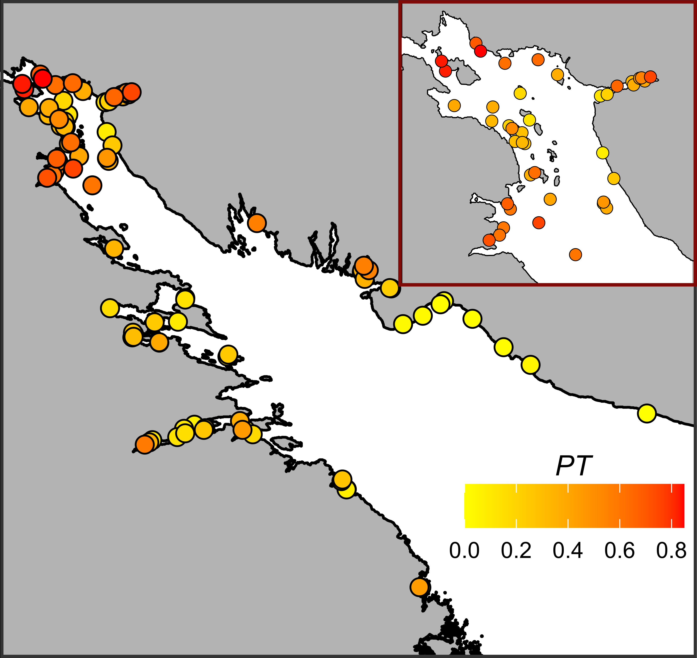

```{r setup, include=FALSE}
library(knitr)
opts_chunk$set(echo = FALSE, message = FALSE, warning = FALSE)
options(knitr.kable.NA = '')
```

```{r}
## Packages ######

library(ggplot2)
library(lme4)
library(glmmADMB)
library(reshape2)
library(dplyr)
library(patchwork)
library(broom)
library(broom.mixed)
library(tidyr)
library(readxl)
library(mgcv)
library(gratia)
library(flextable)
library(cowplot)


```

```{r}
##### Data reading
myt_full <- read_excel(path = "data/myt_full.xls", sheet = "Samples")


ports <- data.frame(Shore = c("Kand", "Karel", "Kand", "Karel", "Karel", "Karel"), Port = c("Kandalaksha", "Vitino", "Umba", "Chupa", "Keret", "Kovda"), Status = c("Active", "Active", "Abandoned", "Abandoned", "Abandoned", "Abandoned"  ), Lat = c(67.137283, 67.076570,  66.677970, 66.269964, 66.294178, 66.696754), Lon = c(32.407995, 32.333630, 34.357655, 33.069534, 33.640656, 32.875396))


sites_fetch_df <- read.table("data/Distred_samples_fetch_values_2023.csv", sep = ",", header = T)

sites_fetch_df[,1:5] <- sites_fetch_df[,1:5]/1000 

# Сonventional coordinates of the top of the Kandalaksha Bay
Shore_boundary = c(67.162360, 32.332371)


river_full <- read.table("data/Rivers_2021.csv", sep = ",", header = T)

river <- river_full %>% select(-Source)


```


```{r}

myt_full$Position <- factor(myt_full$Position)

myt_full$Position <- relevel(myt_full$Position, ref = "Bottom")

myt_full$Port_Status <- factor(myt_full$Port_Status)

myt_full$Port_Status <- relevel(myt_full$Port_Status, ref = "Abandoned")

myt_full$River_Size <- factor(myt_full$River_Size)

myt_full$River_Size <- relevel(myt_full$River_Size, ref = "Small")

myt_full$Site <- factor(myt_full$Site)

```


```{r}
myt_site <- myt_full %>% 
  group_by(Shore, Site) %>% 
  select(Lat, Lon, N_T, N_E, Salinity, Min_dist_river, River, River_Size, Min_dist_river_Large, Min_dist_port, Port, Port_Status, Average_Fetch, Dist_cut) %>% 
  summarise(Lat = mean(Lat), Lon = mean(Lon), N_T = sum(N_T), N_E = sum(N_E), Salinity = mean(Salinity), Min_dist_river = mean(Min_dist_river), River = unique(River), River_Size = unique(River_Size), Min_dist_river_Large = mean(Min_dist_river_Large),  Min_dist_port = mean(Min_dist_port), Port = unique(Port), Port_Status = unique(Port_Status), Average_Fetch = mean(Average_Fetch),   Dist_cut = mean(Dist_cut)) %>% 
  mutate(Prop_T = N_T/(N_T+N_E))

```

## Introduction


One of the urgent tasks of the modern ecology is the construction of relevant species distribution models (SDMs) as numerical tools describing the relationship between species occurrence and environmental parameters (Elith, Leathwick, 2009; ++++). These models allow to predict distribution patterns of ecologically and economically important species (+++) and serve as a basis for prognosis of its distribution in future (+++). The amount of papers devoted to SDMs for marine species has been growing significantly in recent years (Robinson et al 2017). 

Although the biological unit for SDM can be either species, genetically distinct subpopulations, or even genetic lineages (Lowen et al 2019), however, in marine ecology SDMs are currently developed for "good"  species whose taxonomic status is not in doubt (e.g. Reiss et al., 2011; Lindegren et al., 2022). The taxonomic certainty gives an opportunity to focus on solving actual problems related to the search for modeling algorithms (+++) and/or identification of the most significant environmental predictors in marine realm (+++). However, the increasing evidence for cryptic species among marine animals (+++) makes it urgent to build SDMs in such cases as well. Only few papers have directly addressed the construction of SDMs for marine animals' within species genetic lineages and cryptic species (e.g. Dennis, Hellberg, 2010; Lowen et al 2019). 


The construction of SDM for cryptic species has its own peculiarities. If the analysis includes several cryptic species forming exclusively allopatric populations, then the construction of SDM does not fundamentally differ from modeling the distribution of "good" species. The situation with cryptic species forming parapatric and sympatric populations is different: both genetic processes (e.g., hybridization) and ecological interactions between closely related species potentially can influence the result of analysis and consequently model prediction quality. Strictly speaking, in the case when SDM is built not for a single species, but for several coexisting ones, the Joint Species Distribution Models (JSDM) framework should be considered (Ovaskainen, Abreg, 2020). Whereas the standard SDM approach assume to use the presence/absence (or abundance) of a species as a response variable, which is under control of numerous environmental predictors, in JSDM framework some correlative assessment of interspecific interactions should be incorporated into the model as well (Ovaskainen, Abreg, 2020).     

Blue mussels from "*Mytilus edulis*" complex (+++) provide a good opportunity to work out the approaches to SDM construction in the case of cryptic species. For example, native ranges of atlantic *M. edulis* (thereafter *ME*) and pacific *M. trossulus* (*MT*) are differ (Riginos, Cunningham, 2005), but at North Atlantic coasts they form mixed settlements in several contact zones (Varvio et al., 1988; Hilbish et al., 2000; Mathiesen et al. 2016; Brooks, Farmen, 2013; Katolikova et al. 2016; Vainola, Strelkov 2011; Wenne et al. 2020). In general, it is postulated that the proportion of *MT:ME* in a contact zone change along certain environmental gradients (Väinölä and Hvilsom 1991; Riginos and Cunningham 2005; Väinölä and Strelkov 2011). However, some cases of mosaic distribution of *MT* and *ME* have also been described, when spots of higher concentrations of one or other species are present within the region (Moreau et al., 2006; Katolikova et al., 2016; Wenne et al. 2020). In the area of contact zone the proportion of *MT:ME* can vary in broad limits even in small spatial scales (Katolikova et al. 2016) that allows us to consider the *MT:ME* ratio as a very sensitive parameter responding both to the influence of environmental factors and probably to interactions between *MT* and *ME*. Thus the use of *MT:ME* ratio as a dependent variable in the model construction brings it closer to the JSDM framework.

There is no undoubt position bout factors regulating MT and ME distribution. On a biogeographic scale, the distribution of *Mytilus* species is thought to be regulated by regional temperature and its correlates (Popovic & Riginos, 2019; Wenne et al., 2020). *MT* is believed to be a more northerly species, more tolerant to cold waters inhabiting areas that once existed in glaciation zones. *ME* potentially can distribute in  cold waters but tend to form settlements in more temperate latitudes (Wenne et al., 2020). 
Salinity was often considered as a key factor regulating the spatial distribution of species *ME*-*MT* contact zones. *MT* are thought to gravitate toward areas of more freshened water, and *ME* toward areas with higher salinity (Riginos & Cunningham, 2005; Ridgway & Naewdal, 2004; Kijewski et al., 2019; Ridgway & Naevdal, 2004).  For example, *MT* form virtually single-species settlements in the heavily freshened Baltic Sea (Gosling, 1992; Vainola Strelkov, 2011) but *ME* proportion dramatically increase  when crossing the Danish straits toward the North Sea where oceanic salinity occurs (Kijewski et al., 2019). In other contact areas (Gulf of St. Lawrence, Mareau et al. 2005, Bergen area, Ridgway & Naevdal, 2004) a similar pattern is observed: *MT* settlements are represented in the most desalinated areas. Wave action was also considered as an important factor regulated species distribution. *MT* has been shown to gravitate toward more turbulent habitats and *ME* toward quieter areas (Tam, Scrosati, 2014; Comesaña et al., 1999; Bates, Innes, 1995). The pattern of species segregation by substrate has also been attempted to be linked to surf exposure (Katolikova et al, 2016): *MT* tended toward fucoid thalli, and *ME* toward the surface of bottom stony substrates. The authors (Katolikova et al, 2016) suggested that fucoids act as shock absorbers, mitigating the impact of surf damaging *MT* which possess thinner and more fragile shells (Beaumont et al, 2008; Michalek et al, 2021). Importantly, in the last case, an inverse relationship is assumed: *MT* avoids surf-exposed areas. However, in some studies, when the material collection design was specifically adapted to study of the surf effects, the role of this factor in the regulation of the *MT:ME* ratio has not been proven (Moreau et al., 2005). 

Another approach to explanation of patterns in the spatial distribution of *MT* and *ME* can be related to the history of formation of the contact zone. For example, it is believed that in the Barents and White Seas, where initially only *ME* were represented, the *MT* settlements appeared as a result of the introduction of this species from the coast of North America by ships  performing transatlantic traffic  during the World War II (Vainola, Strelkov, 2011). According to the authors, the increased concentration of *MT* is observed in the port areas (Vainola and Strelkov, 2011; Katolikova et al. 2016), where this species was originally introduced. 

We can see a large spectrum of factors (salinity, wave action, proximity to harbor, and substrate type) which were considered as possible agents regulating the distribution of *ME* and *MT*. Moreover, some correlations that seem obvious may have a different interpretation. For example, the relationship of high abundance of *MT* with reduced salinity can be interpreted by another way: the most desalinated areas (river mouths) are often also the quietest areas with minimal wave impact. Port structures, similarly, are often represented in the most sheltered and frequently desalinated areas. Thus, there is no strict evidence for the exclusive role of some leading factor in the regulation of species distribution and consequently no reasons for use it as singular predictor in SDM construction. 

The only way to solve this problem is to include all predictors potentially affecting the composition of mixed settlements in one model which is the main methodology in SDM approach. Such approach to analysis of of *Mytilus* species distribution have been attempted before (but without direct reference to SDM framework, see Kijewski et al., 2019; Wenne et al., 2020) and allowed to show a clear relationship of the *MT:ME* ratio primarily with salinity and temperature gradients. However, the populations involved in the works cited were scattered over a very wide geographic range, with distances between them reaching hundreds and thousands of kilometers. On the other hand, the gradients of the key factors regulating species distribution can vary on much smaller spatial scales. For example, salinity, as a prime candidate regulating the *MT:ME* ratio, can vary significantly on scales of a few kilometers in river estuaries (Van Damme, 2005). If *MT:ME* ratio is regulated by salinity does this mean that the ratio will show the same pattern at smaller geographic scales as well? In addition, will salinity play a leading role amid the inclusion of other predictors in the model as well?

Further, as discussed above, *MT* and *ME* have different substrate preferences (Katolikova et al. 2016). If this result reflects segregation of fundamental niches of *MT* and *ME* (i.e. genetically determined preferences), then substrate type should be considered as important predictor in SDM. If, however, the species segregation associated with substrate is the result of interspecific competition and reflects only separation of realized niches, then the value of such a predictor for SDM is negligible. 

In this paper, we will consider the case where *ME* and *MT* come into contact forming mixed populations in the Kandalaksha Bay of the White Sea (Vainola, Strelkov, 2011; Katolikova et al. 2016; Khaitov et al, 2021). This contact zone found in the relatively small area is extremely convenient for investigation of environmental factors' role  in the regulation of the *MT:ME* ratio and therefore SDM construction.The salinity gradients are well expressed in this area (Filatov et al., 2005) which is determined  by the inflow of several large rivers into the sea (Katolikova et al., 2016). Further, the coast of the gulf possesses numerous sheltered areas (inlets and skerries) and areas open to the surf which provide the opportunity to assess the wave impact gradient.  There are several active and several abandoned ports (Katolikova et al., 2016) that give an opportunity to trace the role of vessel trafic in species distribution.  And finally, the fucoid belt is almost ubiquitous on the intertidal zone of the bay, mussels settle both on algae and on the ground surface throughout the area (Katolikova et al., 2016), which allows us to assess the role of substrate in the regulation of micro-scale species segregation. And important is that the small size of the Kandalaksha Bay (Fig. ++) ensures that there are no clear temperature gradients in both warm and cold seasons. Therefore, the influence of temperature, which probably regulates the distribution of *Mytilus* species on a broader geographic scale (Wenne et al. 2020) can be excluded from the discussion.

Additionally, it was shown that in the Kandalaksha Bay the expensive genetic manipulations aimed at species identification can be replaced by a cheep "morphotype test" based on the study of an easy to observe conchological trait (Khaitov et al. 2021). The morphotype test allow identifying mussel species with sufficient accuracy (Khaitov et al. 2021) and makes it possible to process large material amount (dosen of sampling sites and thousands of mussels), which is necessary for ecological patterns' revealing.


Добавить во введение и для обсуждения
Важная задача - оценка вклада предикторов в SDM (Araujo Guisan, 2006) CHALLENGE 4:It is unsurprizing that the choice of predictors affects the modelled spatial distribution of species. 
Another important issue is the calculation of the contribution of each predictor in the model.
Therefore, except the cases where predictors are orthogonal, the deviance is not and cannot be interpreted as an absolute measure of the contribution of predictors in the model. This sensitivity weakens the utility of the model as it confounds two key factors: which are the most important predictors, and how much variance each predictor can potentially explain. Solutions to the problem have been
proposed, but again they have not been extensively used in species distribution modelling and sufficient statistical validation is lacking.


## Material and methods


```{r}
Total_samples <- nrow(myt_full)
Total_site <- length(unique(myt_full$Site))
Total_N <- sum(myt_full$N_T) + sum(myt_full$N_E)
Min_N <- min(myt_full$N_T + myt_full$N_E)
Max_N <- max(myt_full$N_T + myt_full$N_E)
Mean_N <- mean(myt_full$N_T + myt_full$N_E)
SD_N <- sd(myt_full$N_T + myt_full$N_E)


```


### Study area

The 185 km long Kandalaksha Bay in the north of the White Sea is oriented from southeast to northwest and is funnel-shaped (Fig. ++). Climate is continental subarctic with cold winters (4-5 months of ice cover) and relatively warm summers (August SST is 13.8°C) (Filatov et al., 2005). The bay contains hundreds of banks, skerries and islands. The bay's shoreline is fringed by numerous smaller inlets. Because of this shoreline geometry, different areas even situated close each to other are exposed to wave action in  varying degrees. The summer surface salinity is 24 ppm in most of the Bay (“normal” salinity of the White Sea is 24-30 ppm), but lower in the estuary areas (Filatov et al., 2005). A total of 24 rivers and two canals of hydropower plants (ESM STable ++ ) with catchment area of 141 - 12830 km^2^ (average 240 km^2^) discharge fresh water into the bay creating local salinity gradients. The top of the Kandalaksha Bay is the most desalinated, due to the influence of the largest river Niva (Katolikova et al., 2016). 


Historically (through most of the 20th century), several ports (Fig. ++) were functioning in the area operating high tonnage oceanic vessels (Sailing directions of the White Sea, 1932; Krasavtsev,  2011). Two of these ports, Kandalaksha and Vitino, both in the top of the Bay, are currently functioning while the remaining ports have not been used to serve ocean-going ships in recent decades, but are still visited by coaster ships, according to the conventional knowledge.


Mussels are ubiquitous and abundant along the coasts of the Kandalaksha Bay. On the littoral, they are most abundant at local mussel beds (Khaitov, 2013) and within the fucoid belt formed mainly by  *Fucus vesiculosus* and *Ascophyllum nodosum* (Naumov, 2001) 


### Field collections

When sampling, we tried to describe littoral populations of mussels in the Kandalaksha Bay in as much detail as possible, also taking into account the heterogeneity of their habitats by salinity, wave exposure and proximity to ports. The material was collected on the littoral of the mainland and the islands of the Kandalaksha Bay (Fig. ++). Collections were carried out in July-August in 2011-2018 at `r Total_site` sites. 


At each site we collected mussels from two substrates: fucoid's thallus (thereafter "Algae") and bottom surface (i.e. stones, pebbles, sand, mud; thereafter "Bottom"). Algae samples were taken as individual bundles of fucoids large enough to contain at least a few dozens of mussels (however, this condition proved to be unfeasible for several samples from sparse populations). Bottom samples were taken using a 0.025 m^2^ square frame placed on a ground in such a way that at least a few dozens of mussels could be sampled. Three samples (replications) of each type were taken in each site no more than 20 meters apart. Geographic coordinates were determined for each site (i.e., the same coordinates were assigned to each sample within the same site). Each sample was placed in a plastic bag and transported to the laboratory.  


Mussels with a shell length more than 10 mm were cleaned from tissues and used in further analyses. Shell morphotypes (E-morphotype, characteristic to *ME*, and T-morphotype, characteristic to *MT*, see Katolikova et al. 2016) were identified as in Khaitov et al. 2021. In total we processed `r Total_N` specimens. The mean number of mussels collected per sample was `r round(Mean_N)`(range `r Min_N`, - `r Max_N`).   


### Environmental parameters assessment

This work was aimed to examine the effects of substrate, salinity, surf level and proximity to ports. Some of these parameters were measured directly but for others several proxies were considered. 

The nature of the substrate was characterized by where the corresponding sample was taken from (*Algae* vs *Bottom*). The degree of proximity to port was estimated as the straight line distance (not accounting shoreline bends) from the sampling site to the nearest of the 6 large ports presented in the area (Fig++, STable ++). Additionally each port was assigned to one of two categories: *"Active"* if at the time of sampling the port was serving heavy-tonnage vessels plying out of the White Sea, or *"Abandoned"* if the port served only small vessels cruising within the White Sea, or was completely abandoned at the time of sampling. 

<!-- Earlier all abandoned ports (at least during World War II, before it or immediately after it) served heavy-tonnage vessels plying between the White Sea and the Barents Sea. -->


*Wind fetch as a proxy for wave impact*. When selecting sampling sites, we assumed that collections should characterize both surf and sheltered habitats. Each site was visually assigned to one of two categories: *"Exposed"* (sites located on open shores exposed to waves coming from the open part of the bay) or *"Sheltered"* (sites located in bays or skerries). For a more formal assessment, the value of wind fetch was calculated for each site. It was calculated as the unobstructed length of water surface (in km) over which wind from a certain direction can blow over. These values can be obtained from the analysis of geographical maps of the region. To calculate the wind fetch values, the R-package "windfetch" was used (Seers, 2022). The higher fetch values denote the more wave impact could  be brought from a certain direction. Wind fetch was measured for each site from all directions (North, East, South and West, STable +) but as a value for the further analysis we used an averaged fetch value.  

*Proxies for salinity assessment*. Water samples were taken at each site when mussels were collected, i.e. in the time of  the low tide. The salinity was measured using an "Atago S/Mill-E" handheld salinity refractometer (with 1 ppm accuracy). However, salinity measured directly at the sampling site poorly reflects the salinity regime in the site due to its fluctuations during the tidal cycle and due to weather conditions (waving, precipitation *etc.*). Therefore, as an additional estimate of the desalination level in a given site, we used the characteristics of fresh water discharging sources closest to the sampling site (rivers or channels of hydroelectric power plants). 

In total, 24 rivers are took place in the region, information about which is present in open sources (STable +). Additionally, two powerful freshwater dischargers (HPP canals) were included in the analysis. For each river, we assessed the catchment basin area and coordinates of its mouth.  For HPP canals, this information was obtained by visual analysis of geographical maps. Each of the rivers was assigned to one of two conditional categories: “Large” or “Small” depending on whether its catchment area was more or less than an median catchment area of all rivers included in the analysis (240 km^2^). To note, this operational classification should not be misleading  with classification of rivers size proposed by hydrologists (Khublaryan, 2009). 

We calculated the distance (straight line, not accounting shoreline bends) from each sampling site to the mouth of the nearest river. Thus salinity was characterized by three values: directly measured salinity, distance to the nearest river and the nearest river size. 


### Statistical analysis

The number of T- and E-morphotype mussels in each sample was counted and  proportion of T-morphotype mussels (*PT*) was calculated. Additionally this proportion was assessed for each site (the total number of T-morphotype mussels collected at this site divided by total number specimens collected). The proportion of *MT* in mixed populations in the White Sea is strongly correlated with probability to find *MT* genes in mixed mussels' populations (i.e. STRUCTURE score, Khaitov et al., 2021) and can be assumed as a proxy for *MT:ME* ratio.


All statistical processing was performed using the statistical programming language R 4.05 (R core Team, 2021). The analysis was conducted in two steps. The first step was to determine which predictors are statistically related to *PT*. The second step was to estimate the importance of each predictor as regulator of high *PT* value in mixed mussel populations.


At the first step, we assumed that the relationship between dependent variable and predictors can be curvelinear that's why we constructed a generalized additive mixed model (GAMM, +++) with beta-binomial residuals distribution (hereafter *Model 1*). The fixed part of the *Model 1* included predictors as follows: 

- *Substrate*: categorical, with two levels "Bottom" vs "Algae";    
- *Salinity*: continuous, the directly measured salinity (ppt);    
- *MinDistRiver*: continuous,  distance to the nearest river (km);    
- *RiverSize*: categorical, with two levels "Small" vs "Large" accordingly to size of the nearest river;  
- *MinDistPort*: continuous, the distance to the nearest port (km);   
- *PortStatus*: categorical, with two levels "Abandoned" vs "Active";   
- *AverageFetch*: continuous, fetch value (km).  


For all categorical predictors, the first mentioned category was used as base level in the analyses. The function gam() from the package “mgcv” (+++) was used to build the GAMM.  Smoothers for all continuous predictors were fitted using cubic basic splines (+++). Categorical predictors were included as parametric terms in the model. "Site" was considered as random factor in the model.         

To check for the predictors' collinearaity in the *Model 1* we calculated the variance inflation factor (VIF, Fox & Monette, 1992) for each of them. Additionally we calculated Pearson correlation between continuous predictors. 
 


In the second step, we analyzed the frequency distribution of *PT* values to identify the boundary between *MT*- and *ME*-dominated sites. We hypothesized that these two groups of sites should form separate peaks in the *PT*-distribution, which should have a bimodal shape. In this analysis, we combined all samples from each site and calculated *PT* for each of them (separately for Algae and Bottom). The resulting values were subjected to arcsin transformation (this was necessary to describe the peaks by normal distributions).  Using the approach described in Benaglia et al. (2009), we identified two peaks in the *PT*-distribution, which were approximated by separate normal distributions. Two parameters (mean and standard deviation) were fitted for each of the peak using "normalmixEM()" function from the "mixtools" package (Benaglia et al., 2009). The boundary between these distributions was considered as the value separating two statistical populations. 

Using this boundary, we assigned samples from each of the sites (separately for Algae and Bottom) to *MT*-dominated (high *PT*) or *ME*-dominated  (low *PT*) groups. The former were coded as 1 and the latter as 0. We used this binary variable constructed as dependent one in a mixed logistic regression model (*Model 2*).  This model described the dependence of the probability of being in the *MT*-dominated group on the same predictors as in the *Model 1*. Site was considered as a random factor in the *Model 2*. The model was fitted with "glmer()" finction from "lme4" package (Bates et al., 2015). 

The fraction of total variability explained by the fixed part of the *Model 2* was estimated using marginal coefficient of determination  *R^2^* (Nakagawa & Schielzeth, 2013). Marginal *R^2^* can be decomposed into semi-partial coefficients of determination, *semi-partial R^2^*, that describe the contribution of each individual predictor to the overall coefficient of determination. Using the “partR2” package  (Stoffel et al., 2021) we calculated the "inclusive R^2^" to estimate the total variance explained by each predictors.


To verify that the *Model 1* and *Model 2* meet the assumptions of sampling independence, we examined the presence of  residuals' spatial autocorrelation by means of semivariogram construction (++). Only poor evidences of spatial autocorrelation were revealed for both models.


## Results

## Environmental parameters

Two of six ports presented in the area were active at the date of material collection (Fig. ++, STable ++ SEM). The distance from sampling sites to the nearest ports ranged from `r round(min(myt_site$Min_dist_port), 2)` to  `r round(max(myt_site$Min_dist_port), 0)` km (Median = `r round(median(myt_site$Min_dist_port), 1)` km) (SEM SFig ++, A). Sites visually categorized as "Sheltered" on average were characterized by lower values of wind fetch than those categorized as "Exposed" (ESM SFig. ++, B). The most exposed sites (maximum values of wind fetch) were located on the western coast of the Kandalaksha Bay, and on the open shores of the islands at the top of the bay (Fig. ++1). Salinity measured at the time of sampling ranged from `r round(min(myt_site$Salinity), 0)` to  `r round(max(myt_site$Salinity), 0)` ppm (Median = `r round(median(myt_site$Salinity), 0)` ppm). The most desalinated areas were the top of the Bay and inlets where rivers flow into (Fig. ++1). Salinity at sites situated close to “Large” rivers was lower than at sites closer to “Small” ones (ESM SFig. ++, C). Salinity tended to increase with increasing of distance to the mouth of the nearest river (SEM SFig. ++ D) but no association between distance to the nearest port and salinity was found (SEM SFig. +++ E). Sites situated close to ports tended to have lower wind fetch (SEM SFig. +++ F). All correlations between salinity, distance to the nearest river mouth, distance to the nearest port and wind fetch were rather low (SEM STable +++). The largest correlation revealed was between wind fetch and distance to nearest port (r = 0.46).          


## *PT* spatial distribution


The maximum proportion of the T-morphotype was observed in the top of the Kandalaksha Bay itself and in the small bays deeping into the mainland (Fig. ++). At the same time, sites with a lower proportion of the T-morphotype were located in the immediate vicinity of sites where settlements with high *PT* values were represented (Fig. ++), reflecting the high level of patchiness in PT spatial distribution. Settlements with the lowest frequency of T-morphotype were represented in the open areas of the Northwest Coast. 





## Relationship of *PT* to environmental parameters


```{r}

Mod_gam <- gam(Prop_T ~ s(Salinity, bs = "cr") + s(Min_dist_river, bs = "cr") + s(Average_Fetch, bs = "cr") + s(Min_dist_port, bs = "cr") + Position + River_Size + Port_Status + s(Site, k = Total_site, bs = "re"), method = "REML", family = betar(link = "logit", eps = 0.000000001), data = myt_full )

# appraise(Mod_gam)

# draw(Mod_gam)
# Mod_gamm <- gamm(Prop_T ~ s(Salinity, bs = "cs") + s(Min_dist_river, bs = "cs") + s(Average_Fetch, bs = "cs") + s(Min_dist_port, bs = "cs") + Position + River_Size + Port_Status, random = list(Site = ~1), method = "REML", family = "betar", data = myt_full )


```

```{r}
logit_back <- function(x) exp(x)/(1 + exp(x)) 


sm <- smooth_estimates(Mod_gam) %>%
  add_confint()

sm <- sm %>% 
  mutate(Pi = logit_back(est + coef(Mod_gam)[1]), 
         CI_Pi_low = logit_back(lower_ci + coef(Mod_gam)[1]),
         CI_Pi_up = logit_back(upper_ci + coef(Mod_gam)[1]))

myt_full <- myt_full %>% 
  add_partial_residuals(Mod_gam)

myt_full <- myt_full %>% 
  mutate(Pi_Salinity = logit_back(`s(Salinity)` + coef(Mod_gam)[1]),
         Pi_Min_dist_river = logit_back(`s(Min_dist_river)` + coef(Mod_gam)[1]),
         Pi_Average_Fetch = logit_back(`s(Average_Fetch)` + coef(Mod_gam)[1]),
         Pi_Min_dist_port = logit_back(`s(Min_dist_port)` + coef(Mod_gam)[1]))


```


```{r}

Pl_sal_smoother <-
  sm %>%
  filter(smooth == "s(Salinity)") %>%
  ggplot() +
  geom_point(aes(x = Salinity, y = `s(Salinity)`, color = Position),
             data = myt_full, cex = 1, colour = "steelblue3") +
  geom_rug(aes(x = Salinity),
           data = myt_full,
           sides = "b", length = grid::unit(0.02, "npc")) +
  geom_ribbon(aes(ymin = lower_ci, ymax = upper_ci, x = Salinity),
              alpha = 0.2) +
  geom_line(aes(x = Salinity, y = est), lwd = 1) +
  labs(y = "Partial effect", x = "Salinity") +
  geom_hline(yintercept = 0, linetype = 2) +
  theme_bw()


Pl_riv_dist_smoother <- 
    sm %>%
  filter(smooth == "s(Min_dist_river)") %>%
  ggplot() +
  geom_point(aes(x = Min_dist_river, y = `s(Min_dist_river)`, color = Position),
             data = myt_full, cex = 1, colour = "steelblue3") +
  geom_rug(aes(x = Min_dist_river),
           data = myt_full,
           sides = "b", length = grid::unit(0.02, "npc")) +
  geom_ribbon(aes(ymin = lower_ci, ymax = upper_ci, x = Min_dist_river),
              alpha = 0.2) +
    geom_line(aes(x = Min_dist_river, y = est), lwd = 1) +
  labs(y = "Partial effect", x = "Distance to the nearest river (km)") +
    geom_hline(yintercept = 0, linetype = 2) +
  theme_bw()


  

Pl_port_dist_smoother <-
     sm %>%
  filter(smooth == "s(Min_dist_port)") %>%
  ggplot() +
  geom_point(aes(x = Min_dist_port, y = `s(Min_dist_port)`, color = Position),
             data = myt_full, cex = 1, colour = "steelblue3") +
  geom_rug(aes(x = Min_dist_port),
           data = myt_full,
           sides = "b", length = grid::unit(0.02, "npc")) +
  geom_ribbon(aes(ymin = lower_ci, ymax = upper_ci, x = Min_dist_port),
              alpha = 0.2) +
    geom_line(aes(x = Min_dist_port, y = est), lwd = 1) +
  labs(y = "Partial effect", x = "Distance to the nearest port (km)") +
  geom_hline(yintercept = 0, linetype = 2) +
  theme_bw()
    

Pl_fetch_smoother <-
  sm %>%
  filter(smooth == "s(Average_Fetch)") %>%
  ggplot() +
  geom_point(aes(x = Average_Fetch, y = `s(Average_Fetch)`, color = Position),
             data = myt_full, cex = 1, colour = "steelblue3") +
  geom_rug(aes(x = Average_Fetch),
           data = myt_full,
           sides = "b", length = grid::unit(0.02, "npc")) +
  geom_ribbon(aes(ymin = lower_ci, ymax = upper_ci, x = Average_Fetch),
              alpha = 0.2) +
    geom_line(aes(x = Average_Fetch, y = est), lwd = 1) +
  labs(y = "Partial effect", x = "Average Fetch") +
  geom_hline(yintercept = 0, linetype = 2) +
  theme_bw()
  
##################################

Pl_sal_smoother_Pi <-
  sm %>%
  filter(smooth == "s(Salinity)") %>%
  ggplot() +
  geom_point(aes(x = Salinity, y = Pi_Salinity), data = myt_full, cex = 1, colour = "steelblue3") +
  geom_rug(aes(x = Salinity),data = myt_full, sides = "b", length = grid::unit(0.02, "npc")) +
  geom_ribbon(aes(ymin = CI_Pi_low, ymax = CI_Pi_up, x = Salinity),alpha = 0.2) +
  geom_line(aes(x = Salinity, y = Pi), lwd = 1) +
  labs(y = "Partial effect", x = "Salinity (PPT)") +
  geom_hline(yintercept = median(myt_full$Pi_Salinity), linetype = 2)+
  theme_bw()+
  ylim(0, 0.8)


Pl_riv_dist_smoother_Pi <-
  sm %>%
  filter(smooth == "s(Min_dist_river)") %>%
  ggplot() +
  geom_point(aes(x = Min_dist_river, y = Pi_Min_dist_river), data = myt_full, cex = 1, colour = "steelblue3") +
  geom_rug(aes(x = Min_dist_river),data = myt_full, sides = "b", length = grid::unit(0.02, "npc")) +
  geom_ribbon(aes(ymin = CI_Pi_low, ymax = CI_Pi_up, x = Min_dist_river),alpha = 0.2) +
  geom_line(aes(x = Min_dist_river, y = Pi), lwd = 1) +
  labs(y = "Partial effect", x = "Distance to the nearest river (km)") +
  geom_hline(yintercept = median(myt_full$Pi_Min_dist_river), linetype = 2) +
  theme_bw()+
  ylim(0, 0.8)


Pl_port_dist_smoother_Pi <-
  sm %>%
  filter(smooth == "s(Min_dist_port)") %>%
  ggplot() +
  geom_point(aes(x = Min_dist_port, y = Pi_Min_dist_port), data = myt_full, cex = 1, colour = "steelblue3") +
  geom_rug(aes(x = Min_dist_port),data = myt_full, sides = "b", length = grid::unit(0.02, "npc")) +
  geom_ribbon(aes(ymin = CI_Pi_low, ymax = CI_Pi_up, x = Min_dist_port),alpha = 0.2) +
  geom_line(aes(x = Min_dist_port, y = Pi), lwd = 1) +
  labs(y = "Partial effect", x = "Distance to the nearest port (km)") +
  geom_hline(yintercept = median(myt_full$Pi_Min_dist_port), linetype = 2)+
  theme_bw()+
  ylim(0, 0.8)


Pl_fetch_smoother_Pi <-
  sm %>%
  filter(smooth == "s(Average_Fetch)") %>%
  ggplot() +
  geom_point(aes(x = Average_Fetch, y = Pi_Average_Fetch), data = myt_full, cex = 1, colour = "steelblue3") +
  geom_rug(aes(x = Average_Fetch),data = myt_full, sides = "b", length = grid::unit(0.02, "npc")) +
  geom_ribbon(aes(ymin = CI_Pi_low, ymax = CI_Pi_up, x = Average_Fetch),alpha = 0.2) +
  geom_line(aes(x = Average_Fetch, y = Pi), lwd = 1) +
  labs(y = "Partial effect", x = "Fetch (km)") +
  geom_hline(yintercept = median(myt_full$Pi_Average_Fetch), linetype = 2)+
  theme_bw()+
  ylim(0, 0.8)

```


```{r}
ds <-  data_slice(Mod_gam, Position = evenly(Position),  Port_Status = evenly(Port_Status), River_Size = evenly(River_Size)) 


Fit <- predict.gam(Mod_gam, newdata = ds, se = T,  exclude = c("s(Salinity)", "s(Min_dist_river)",  "s(Average_Fetch)",  "s(Min_dist_port)", "s(Site)"))

ds$Fit = Fit$fit

ds$SE = Fit$se.fit

ds$Pi <- logit_back(Fit$fit)
ds$Pi_CI_low <- logit_back(Fit$fit - 1.96*Fit$se.fit)
ds$Pi_CI_up <- logit_back(Fit$fit + 1.96*Fit$se.fit)


Pl_Small <-
ds %>% filter(River_Size == "Small") %>%   
ggplot(., aes(x = Position, y = Pi, fill = Port_Status)) + 
  geom_col(position = position_dodge()) +
  scale_fill_manual(values = c("blue", "gray")) +
  geom_errorbar(aes(ymin = Pi_CI_low, ymax = Pi_CI_up), width = 0.2, position = position_dodge(width = 0.9)) +
  theme_bw()+
  ggtitle("The nearest River: Small") +
  ylim(0, 0.7)+
  theme(legend.position = c(0.25, 0.7)) +
  labs(x = "", y = "Partial effect", fill = "Nearest port status")     
    
Pl_Large <-
ds %>% filter(River_Size == "Large") %>%   
ggplot(., aes(x = Position, y = Pi, fill = Port_Status)) + 
  geom_col(position = position_dodge()) +
  scale_fill_manual(values = c("blue", "gray")) +
  geom_errorbar(aes(ymin = Pi_CI_low, ymax = Pi_CI_up), width = 0.2, position = position_dodge(width = 0.9)) +
  theme_bw()+
  ggtitle("The nearest River: Large") +
  ylim(0, 0.7)+
  guides(fill = "none") +
  theme(legend.position = c(0.19, 0.8)) + 
  labs(x = "", y = "Partial effect")
    

# appraise(Mod_gam)

# tidy(Mod_gam, parametric = T)

sum_Model_1 <- summary(Mod_gam)

Mod_dummy <- lm(Prop_T ~ Salinity + Min_dist_river + Average_Fetch + Min_dist_port + Position + River_Size + Port_Status,  data = myt_full )

library(car)

VIF <- vif(Mod_dummy) 

```


The values of VIF calculated for the predictors' set included in the analysis were rather small (the maximal VIF was detected for `r paste(names(VIF)[which.max(VIF)])`: `r round(max(VIF), 2)`). Although some pairwise correlation  between environmental factors were found (see above) the low VIF values can be interpreted as a negligible collinearity between predictors (i.e. they don't mask influence of each for other).   

To assess the dependency of *PT* on all predictors considered we constructed the *Model 1* (Table ++, R^2^ = `r round(sum_Model_1$r.sq, 2)`) which explained  `r round(sum_Model_1$ dev.expl*100, 1)`% of total deviance. The *Model 1* revealed statistically significant dependency of *PT* on all predictors except distance to the nearest river (*MinDistRiver*).

The effective degrees of freedom (*edf*, Table ++, A) for most smoothers were equal to 1, reflecting the linear dependence of *PT* on such continous predictors as distance to the nearest port (*MinDistPort*) and fetch (*AverageFetch*). The exception was *Salinity*, where a pronounced curvilinear dependence was revealed.     

```{r}

Model_1_summ_smoothers <- tidy(Mod_gam)

Model_1_summ_smoothers$term <- c(
  "s(Salinity)", 
  "s(MinDistRiver)",
  "s(AverageFetch)",
  "s(MinDistPort)",
  "Random effect s(Site)")
Model_1_summ_smoothers[, 2:4] <- round(Model_1_summ_smoothers[, 2:4], 1)
Model_1_summ_smoothers[, 5] <- round(Model_1_summ_smoothers[, 5], 4)


Model_1_summ_parametric <- tidy(Mod_gam, parametric = T)

Model_1_summ_parametric$term <- c("(Intercept)",
                                  "Substrate(Algae)",
                                  "RiverSize(Large)",
                                  "PortStatus(Active)")
Model_1_summ_parametric[, 2:4] <- round(Model_1_summ_parametric[, 2:4], 1)
Model_1_summ_parametric[, 5] <- round(Model_1_summ_parametric[, 5], 4)

names(Model_1_summ_smoothers) <- names(Model_1_summ_parametric)


all_Model_1_summ <- rbind(Model_1_summ_smoothers, Model_1_summ_parametric)


ft_Model_1_summ_smoothers <- flextable(Model_1_summ_smoothers)

header <- c("Model term", "edf", "ref.edf", "Chi.sq", "p-value")

ft_Model_1_summ_smoothers <- 
  ft_Model_1_summ_smoothers %>% 
  set_header_labels(values = header)


ft_Model_1_summ_parametric <- flextable(Model_1_summ_parametric)
header2 <- c("Model term", "Parameter estimate", "SE", "z-statistic", "p-value")

ft_Model_1_summ_parametric <- 
  ft_Model_1_summ_parametric %>% 
  set_header_labels(values = header2)


```


```{r}
ft_Model_1_summ_smoothers <-
  ft_Model_1_summ_smoothers %>% 
  set_caption(caption = "Table + A. Parameters of smoothers for the Model describing dependency of PT on predictors.")

ft_Model_1_summ_smoothers
```


```{r}
ft_Model_1_summ_parametric <-
  ft_Model_1_summ_parametric %>% 
  set_caption(caption = "Table + B. Parametric terms for the Model describing dependency of PT on predictors.")

ft_Model_1_summ_parametric
```


```{r fig.height= 8,fig.width=8, fig.cap= "Fig. ++. Predictions of the Model describing dependency of PT on substrate type, nearest port status and size of the largest river (A, B), distance to the nearest river (C), distance to the nearest port (D), average fetch (E) and salinity (E). The wiskers and gray ribbons demonstrate 95% confidence interval. The dashed lines at C-E panels reflect median partial effect  value. Points on panels C-F reflect partial residuals but not raw data."}

plot_grid(Pl_Small, Pl_Large,  Pl_riv_dist_smoother_Pi, Pl_port_dist_smoother_Pi, Pl_fetch_smoother_Pi, Pl_sal_smoother_Pi,  ncol = 2, labels = "AUTO")

```


According to the *Model 1* (Table ++, Fig. ++) the value of *PT* is dramatically higher on the Algae substrate than on the Bottom one. This value is higher in those sites which is close to active ports than to abandoned ones. Finally, the *PT* value is slightly higher at sites situated close to large rivers than to small ones. The *PT* has a tendency to decrease with increasing of distance to the nearest port (Fig. ++, D) starting to be in average lower than median partial effect when distance to the nearest port is higher than 20 km. The dependency of *PT* on average fetch (Fig. ++, E) is also negative: *PT* become lover than median partial effect when value of fetch started to be higher of 5 km.   


```{r}
sal_smoother <- 
sm %>% 
  filter(smooth == "s(Salinity)")  

sm_low_salinity <- 
sal_smoother %>% filter(est > median(est)) %>% filter(Salinity < 20) 
  
Min_salinity <- max(sm_low_salinity$Salinity)

sm_high_salinity <- 
sal_smoother %>% filter(est > median(est)) %>% filter(Salinity > 20) 

Max_salinity <- min(sm_high_salinity$Salinity)


Number_sites_low_salinity <- myt_site %>% filter(Salinity <= round(Min_salinity, 0)) %>% nrow()

Number_sites_high_salinity <- myt_site %>% filter(Salinity >= round(Max_salinity, 0)) %>% nrow()

```


The curvilinear dependence of *PT* on salinity (Fig. ++, F) can be described as follows. The predicted value of *PT* is close to the median partial effect at intermediate salinity range. However, at extremely low (less than `r round(Min_salinity,0)` ppt) and high (more than `r round(Max_salinity, 0)` ppt) salinity, *PT* becomes higher than the median predicted value. Extreme low salinity was observed at only `r Number_sites_low_salinity` sites and extreme high salinity at `r Number_sites_high_salinity` sites. For other `r Total_site - Number_sites_low_salinity - Number_sites_high_salinity` sites with intermediate salinity predicted *PT* is close to the median value (Fig. +++, F). 


## Assessment of predictors' importance

```{r}

myt_site_substr <- 
  myt_full %>% 
  group_by(Site, Position) %>% 
  summarise(N_E = sum(N_E), N_T = sum(N_T),
        Salinity = mean(Salinity),
        Min_dist_river = mean(Min_dist_river),
        River_Size = unique(River_Size),
        Average_Fetch = mean(Average_Fetch),
        Min_dist_port = mean(Min_dist_port),
        Port_Status = unique(Port_Status),
        Lon = mean(Lon),
        Lat = mean(Lat)) %>% 
  mutate(Prop_T = N_T/(N_T + N_E)) %>% 
  mutate(Fi_T = 2*asin(sqrt(Prop_T))*180/pi)  
    
  

binwidth <- 15

Pl_Fi_distribution_substrates <-
ggplot(myt_site_substr, aes (x = Fi_T)) + 
  geom_histogram(fill = "grey", color = "black", binwidth = binwidth) +
  geom_density(aes(y=binwidth * ..count..), color = "blue", size = 1, fill="blue", alpha = 0.2, ) + 
  labs(x = "arcsin transformed PT", y = "Count")  +
  facet_wrap(~Position) +
  theme_bw()


Pl_Fi_distribution <-
ggplot(myt_site_substr, aes (x = Fi_T)) + 
  geom_histogram(fill = "grey", color = "black", binwidth = binwidth) +
  geom_density(aes(y=binwidth * ..count..), color = "blue", size = 1, fill="blue", alpha = 0.2, ) + 
  labs(x = "Fi", y = "Count") +
  theme_bw()

library(mixtools)

x <- myt_site_substr$Fi_T

model <- normalmixEM(x=x, verb = F)


index.lower <- which.min(model$mu)  # Index of component with lower mean


find.cutoff <- function(proba=0.5, i=index.lower, ...) {
  ## Cutoff such that Pr[drawn from bad component] == proba
  f <- function(x) {
   proba - (model$lambda[i]*dnorm(x, model$mu[i], model$sigma[i]) /
               (model$lambda[1]*dnorm(x, model$mu[1], model$sigma[1]) + model$lambda[2]*dnorm(x, model$mu[2], model$sigma[2])))
  }
  return(uniroot(f=f, lower=-1, upper=0, extendInt = "yes", maxiter = 10000)$root)  # Careful with division by zero if changing lower and upper
}


# Предсказанная моделью граница двух распределений


cutoffs <- c(find.cutoff(proba = 0.5))  # Around c(1.8, 1.5)


n1 = round(length(x) * model$lambda[1])
mean1 = model$mu[1]
sd1 = model$sigma[1]


n2 = round(length(x) * model$lambda[2])
mean2 = model$mu[2]
sd2 = model$sigma[2]


fi_back <- function(x) (sin((x*pi)/360))^2

annot <- data.frame(x = c(mean1, mean2), y = c(40, 25), label = c("ME-dominated", "MT-dominated"))

Pl_Fi_distribution_total <-
ggplot(myt_site_substr, aes(x = Fi_T)) + 
  geom_histogram( binwidth = binwidth, fill = "gray", color = "black") +  
  # geom_density(aes(y=binwidth * ..count..), color = "blue", size = 1, fill="blue", alpha = 0.2, ) +
  stat_function(fun = function(x) dnorm(x, mean = mean1, sd = sd1) * n1 * binwidth, color = "darkred", size = 1) + 
  stat_function(fun = function(x) dnorm(x, mean = mean2, sd = sd2) * n2 * binwidth, color = "darkred", size = 1)  +
  geom_vline(xintercept = cutoffs, linetype = 2) +
  theme_bw() +
  labs(x = "arcsin transformed PT", y = "Count") +
  ylim(0, 45) +
  geom_text(data = annot, aes(x, y, label = label))
  

boundary <- round(fi_back(cutoffs), 2)


```


The values of *PT* ranged from `r round(min(myt_site_substr$Prop_T), 0)` to `r round(max(myt_site_substr$Prop_T), 2)` at different sites. The frequency distribution of *PT* values displayed a clear bimodal structure both in the case of "Bottom" and "Algae" samples (Fig. ++). Two peaks were recognized in total distribution as well (Fig. ++ lower pannel). Two  Gaussian components were fitted into the total *PT* distribution with parameters as follow: $\mu_1$ = `r round(mean1,1)`, $\mu_2$ = `r round(mean2,1)` and $\sigma_1$ = `r round(sd1, 2)`, $\sigma_2$ = `r round(sd2, 2)`. The boundary between these peaks was `r round(cutoffs,1)`(*PT*=`r boundary`). Thus two types of populations can be recognized in the studied area: populations dominated by *ME* (conditional boundary *PT* < `r boundary`) and samples with MT prevalence (*PT* > `r boundary`). In samples from the "Bottom" substrate, samples belonging to the first group were more frequent (the left peak in the distribution predominated). In samples from the "Algae" substrate, both groups were represented in more or less equal proportions.

```{r, fig.width=8,  fig.cap="Fig ++. The distributon of arcsin transformed *PT* values at different substrates (upper panels) and in total (lower pannel). Blue lines represent the kernell density smoothing the frequency distributions. Black curves on the lower pannel represent normal distributions fitted, dotted line represent boundary between peaks."}


Pl_Fi_distribution_substrates/Pl_Fi_distribution_total


```


```{r}

myt_site_substr <-
  myt_site_substr %>% 
  mutate(T_dominated = ifelse(Prop_T > boundary, 1, 0))


Model_2 <- glmer(T_dominated ~ Position + Salinity + Min_dist_river + River_Size + Average_Fetch + Min_dist_port + Port_Status + (1|Site) ,  data = myt_site_substr, family = binomial(link = "logit"), control=glmerControl(optimizer="bobyqa",optCtrl=list(maxfun=2e5)) )

# summary(Model_2)


# qplot(x= fitted(Model_2), y = residuals(Model_2, type = "pearson")) + geom_smooth(method = "loess") + geom_hline(yintercept = 0)

library(partR2)

res_part_R2 <- partR2(Model_2, R2_type = "marginal")

# save(res_part_R2, file = "partR2 result glmer Model2.RData")

# Calculations by this code take several hours (due to GLMM bootstraping). Thus the results are loaded from the file with saved analysis data.

# load(file = "partR2 result glmer Model2.RData")


# str(res_part_R2)

IR2 <- res_part_R2$IR2


# BW <- res_part_R2$BW
# 
# res_part_R2$SC

# forestplot(res_part_R2, type = "IR2")

IR2 <- 
  IR2 %>% 
  arrange(desc(estimate)) %>% 
  mutate(Predictor = c(
    "Salinity", 
    "PortStatus", 
    "RiverSize",
    "Substrate",
    "AverageFetch",
    "MinDistPort",
    "MinDistRiver")) %>% 
    mutate(PropExplined = round(estimate*100, 1)) %>% 
  select(Predictor, PropExplined) 


```


Parameters of the *Model 2* are presented in STable ++. The marginal coefficient of determination of the *Model 2* (R^2^ = `r round(res_part_R2$R2$estimate, 2)`) was decomposed as follow (Table. +). The highest proportion of total variance explained was associated with *Salinity*. However the influence of other three  predictors (*PortStatus*, *RiverSize* and  *Substrate*) were close to the former.  The minimal influence was determined for *MinDistRiver*. The influence of *AverageFetch* and  *MinDistPort* was intermediate.      

```{r}

ft_IR2 <- flextable(IR2)

ft_IR2 <-
ft_IR2 %>% 
  set_header_labels(values = c("Predictor", "Proportion of variaton explined (%)")) %>% 
  set_caption(caption = "Table +. Proportion of variation explined by different predictors included into Model 2.")

ft_IR2
```


```{r eval=FALSE}

myt_sample_area <- read_excel("Data/myt_full.xls", sheet = "Sampling area assesment", na = "NA")

myt_sample_area <- myt_sample_area %>% select(Site, Sample, Position, SQM_factor)


Sites <- 
myt_sample_area %>% group_by(Site) %>% summarise(Sum = sum(SQM_factor)) %>% filter(!is.na(Sum)) %>% 
filter(Site %in% unique(myt_full$Site)) %>% pull(Site)  


# unique(myt_full$Site)[!(unique(myt_full$Site) %in% Sites)]


myt_full_reduced <- myt_full %>% filter(Site %in% Sites)

myt_full_reduced <-
merge(myt_full_reduced, myt_sample_area)


myt_site_substr_reguced <- 
  myt_full_reduced %>% 
  mutate(D_T = N_T * SQM_factor, D_E = N_E*SQM_factor) %>% 
  group_by(Site, Position) %>% 
  summarise(D = mean(D_E + D_T), N_T = sum(N_T), N_E = sum(N_E),
        Salinity = mean(Salinity),
        Min_dist_river = mean(Min_dist_river),
        River_Size = unique(River_Size),
        Average_Fetch = mean(Average_Fetch),
        Min_dist_port = mean(Min_dist_port),
        Port_Status = unique(Port_Status),
        Lon = mean(Lon),
        Lat = mean(Lat)) %>% 
  mutate(Prop_T = N_T/(N_T + N_E)) %>% 
  mutate(Fi_T = 2*asin(sqrt(Prop_T))*180/pi)  


df1 <-
myt_site_substr_reguced %>% 
  select(Site, Position, Prop_T) %>%
  dcast(., formula = Site ~ Position, value.var = c("Prop_T") ) 


names(df1) <- c("Site", "Prop_T_Bottom", "Prop_T_Algae" )
  

df2 <-
myt_site_substr_reguced %>% 
  select(Site, Position, D) %>%
  dcast(., formula = Site ~ Position, value.var = c("D") )


names(df2) <- c("Site", "D_Bottom", "D_Algae" )

df3 <-
myt_site_substr_reguced %>% 
  select(Site, Position, N_T, N_E) %>% 
  group_by(Site) %>% 
  summarise(N_T = sum(N_T), N_E = sum(N_E)) %>% 
  mutate(Total_Prop_T = N_T/(N_T + N_E)) %>% 
  select(-N_T, -N_E)
  

all_sites <- merge(df1, df2) %>% merge(., df3) %>% 
    mutate(Dif = Prop_T_Algae - Prop_T_Bottom) %>% 
  mutate(D_mean = (D_Bottom + D_Algae)/2 )
  


Mod_Dif <- gam(Dif ~ s(Total_Prop_T) + s(log(D_mean)) + , data = all_sites)

summary(Mod_Dif)

draw(Mod_Dif, residuals = T)


Pl_Dif_Prop_T <-
ggplot(all_sites, aes(Total_Prop_T, Dif)) +
  geom_point(aes(size = N_total)) +
  # scale_size_continuous(breaks = c(100, 500, 1000, 1500)) +
  geom_smooth(method = "gam") +
  geom_hline(yintercept = 0) + 
  geom_vline(xintercept = boundary, linetype = 2) +
  labs(x = "PT at Site", y = "PT at Algae minus PT at Bottom" )


```


## Discussion

Using the "morphotype test" (Khaitov et al. 2021) as a tool for species identification, we were able to construct a *Model 1* describing the relationship between *PT* frequency and all the factors that are generally considered to be the main regulators of the *MT:ME* ratio in mixed mussel settlements.  Our analysis showed that the predictors included in the model, although weakly correlated with each other, do not exhibit high collinearity. This means that we can consider all factors involved as independent entities that do not mask each other in their influence.   

We found that all factors, which were considered as crucial for *MT:ME* proportion regulation in previous works, were significant for *PT* value (and consequently proportion of *MT* in mixed populations) in a rlatively small contact zone of the Kandalaksha Bay. This means that the patterns revealed on more extensive contact zones with longer ecological gradients retain their influence in essentially smaller spatial scales.


The proportion of *MT* is clearly governed by three factors in the Kandalaksha Bay: the nature of the substrate, the proximity  to active port systems, and the degree of coast exposure to wave action. According to the data we obtained, the highest *MT* concentration should be expected on the fuchcoid tally, in sheltered areas close to active ports.


It is believed that *MT* was introduced into the Barents and White Seas due to ship traffic during World War II (Vainola & Strelkov, 2011). This hypothesis was based primarily on the fact that high concentrations of *MT* were found in the vicinity of currently active or abandoned ports in the Barents and White Seas (Vainola & Strelkov, 2011; Katolikova et al. 2016). Our study confirmed this hypothesis. The proportion of T-morphotype (and hence *MT*) in the studied area increased with approaching to ports. Apparently, the degree of port activity also plays an important role. According to our data, if the port nearest to the mixed settlement is active, i.e. it serves the ships coming from outside the White Sea (in our case it is "Kandlaksha" and "Vitino" ports), then the *PT* value in such settlements is higher than in the settlements adjacent to the abandoned harbors.  This can be explained in several ways. 

It is possible that new *MT* are constantly brought to the ports of the Kandalaksha Bay from the Barents Sea (primarily from the ports of Murmansk in the Kola Bay, where the abundance of *MT* is very high, Vainola&Strelrov, 2013; Marchenko et al., 2023). In the abandoned ports this constant renewation is absent and during the time of port inactivity *MT* have been displaced by *ME*. 

On the other hand, active ports tend to have a higher degree of anthropogenic pollution, leading to less stress tolerance of mussels (Hellou & Law, 2003). Different mussel species are known to interact differently with pollutants (Beyer et al., 2017). For example, in the Halifax area *MT* are more abundant in the most polluted habitats than *ME*, but show less stress tolerance than *ME* (Hellou & Law, 2003). However, studies of the immune systems of *MT* and *ME* in the Canadian contact zone suggest a greater suppression of the *MT* immune system in areas prone to pollution (Coray et al., 2006), making them more sensitive to stress than *ME*. The last fact contradicts the hypothesis of better performance of *MT* to pollutant influence allowing them to set populations in active port harbors.   

A third explanation is also possible. As it was shown the Bivalvian Transmissible Neoplasia (BTN) is more frequently distributed in the port area (+++). Taking into account the fatality of BTN for mussels (Benabdelmouna &Ledu, 2016; Burioli et al 2019) and asymmetric resistance of mussel species to BTN infection (Yonemitsu et al., 2019, проверить) we can expect that BTN can play certain role in the regulation of *MT:ME* proportion in the harbor area.    


In any case, our data are in line with earlier stated hypothesis that in the case of the White Sea  *MT* is an invasive species (Vainola&Strelkov 2011). Unfortunately, only few data could be provided to check this hypothesis for other European *MT* populations since the closeness to the port harbors was never included into species distribution models developed for other areas. In some cases it is probably an unrealistic aim due to absence of predictor variability.  For example in the case of *MT* populations in the Baltic Sea, where there is extremely active ship traffic and vessels visiting almost all parts of the Baltic Sea, it is not possible to identify a correlation between the distribution of *MT* and the presence of ports. At the same time, if we look at the map of *MT* distribution (Vainola & Strelkov, 2011), the confinement of *MT* to large European ports out of the Baltic Sea (e.g. Bergen, Murmansk), rather speaks in favor of the hypothesis of *MT* introduction due to ship traffic.  The unexpected increase in the number of *MT* in aquaculture plantations in the Scottish fjords (Beaumont 200+) is rather consistent with the hypothesis of the recent invasion as well. 

Our analysis revealed that the higher wind fetch is associated with lower *PT* value. That means *MT* avoid open coasts potentially exposed to the surf. The lowest *PT* value (i.e., E-morphotype mussels dominate in the settlements) is observed on open shores of the north-east coast of Kandalaksha Bay (Fig. ++), exposed to wave action due to southeast and south-west winds which are frequent in the White Sea region (Berger, Naumov, 2001). This result corresponds well with the data on the thickness of *MT* and *ME* shells. It is known that *MT* have thinner, more fragile shells (Beaumont et al., 2008; Michalek et al, 2021). It is logical to expect that mollusks with such characteristics should avoid places with high wave loading. In such habitats, *ME* with stronger shells are expected to benefit. A similar pattern can be seen in other contact zones. For example, in Greenland, an increased frequency of *MT* was noted at the sheltered top of the fjord (GLS and GLD sites, Fig. 1 in Wenne et al. 2016), while the population at a more open site located near fjord mouth (GLL site in Wenne et al. 2016) is dominated by *ME*.  

Finally the nature of the substrate is the powerful predictor that has an influence on *PT* variation (Table ++, Figure ++). The proportion of T-morphotype mussels appears to be significantly higher on fucoids than on bottom substrates (silty-sandy sediment, pebbles, boulders and rock surfaces) located in close proximity (not more than 20 m, within the same fucoid belt). This pattern was first detected in the analysis of a significantly smaller volume of material (Katolikova et al., 2016). Bringing in new data collected in a wider range of conditions confirmed the presence of this pattern. It can be assumed that the effect of substrate type on *PT* has the same mechanism that underlies the negative correlation of *PT* with wind fetch. Fucoids may work as shock absorbers, mitigating, to a certain extent, the impact of the surf.  Another explanation could also be given. Perhaps *MT* are capable of attaching to underwater substrates more strongly than *ME* do. This should cause less strongly attached molluscs to break off and remain on the bottom under constant fluctuations in the thallus of the fucoids. This hypothesis is contradicted by the fact that a comparison of attachment strength in *MT* and *ME* from the contact zone in Canada, showed no significant differences between the species when they were kept under laboratory  conditions (Lowen et al., 200+). Additional investigations of attachment strength of both species are needed. 

An intriguing result of our study was the absence of clear linear signal of the influence of salinity on the *MT:ME* ratio. GAM fitted reveal a statistically significant curvelinear relationship between *PT* and salinity. From one hand, our *Model 1* revealed expected dependency on salinity: *PT*, in fact, was higher in the lower salinity conditions. However, on the other hand, it was unexpectedly high when salinity was unusually high for the region. 

It should be noted that the number of extreme low salinity sites where PT was found to be quite high is relatively small. Similarly, the number of sites where salinity is very high and where *PT* is also high is very small. In total, the number of such sites is about `r round( (Number_sites_low_salinity + Number_sites_high_salinity)/Total_site *100, 1)  ` % of the total number of sites surveyed.  At other sites where salinity intermediate *PT* does not differ significantly from the background value. That is, anomalously high *PT* values are observed in some marginal habitats. Such pattern can be expected if we assume that *MT* is a weaker competitor, which on average cannot dominate *ME*. This assumption is supported by the fact that the settlements that we classify as *MT*-dominated are essentially scarcer  in the studied area (smaller peak in the frequency distribution, Fig. ++) than the  *ME*-dominated sites. Such displacement of weaker competitor into marginal habitat is well known for other systems where inviders met resident species:  mosquito larvae (Juliano, 1998), geckos (Case et al 1994) and fishes(Herbold, Moyle, 1986). Usually resident species persist in their optimal habitats if they have not been destroyed but introduced species prevail in marginal habitats (Juliano, 1998).  

The analysis of relative importance of different predictors revealed practically equal value of them in regulation of *MT:ME* composition in the Kandalaksha bay contact zone. This means that there is no single leading factor that plays an exclusive role in determining the ratio of species in mixed settlements. Any gradients of factors, whether extended gradients related to salinity or sudden local changes in habitat parameters, as in the case of substrate or surf magnitude, are used by the two mussel species for segregation. 
 
 
## Literature cited 

Лоция Белого моря / Гидрографическое управление ; общ. ред. А. Н. Рождественского. – 5-е изд. – Ленинград : Издание Гидрографического управления, 1932. – LXXII, 566 с., 22 вкл. л. ил., карт., схем.


\pagebreak

## Supplementary electronic materials (SEM)

### Environmental parameters characteristics 

<!-- There are 6 ports presented in Kandalaksha Bay (STable +++). Most localities sampled (34 sites) had "Vitino" as the closest harbor, which came into service in the 1990s. The remaining ports, in operation since the beginning of the 20th century, were attributed as closest to 14-17 sites. The distance from sampling sites to the nearest ports varied in broad range (0.11 - 82 km) but on average the distance from port to the corresponding sites ranges in more narrow limits (17 - 26 km, Fig ++, A).  -->


```{r}

ports %>% 
  select(-Shore) %>% 
  kable(col.names = c("Port", "Status", "Latitude", "Longitude"), caption = "STable +. Ports presented in the Kandalaksha bay")
```

\pagebreak

### Associations between environmental parameters

Pearson correlation between environmental parameters
```{r}
# names(myt_site)
cor_df <- 
myt_site %>% select(Salinity, Min_dist_river, Min_dist_port, Average_Fetch) %>% as.data.frame(.) %>% select(-Shore) %>% cor(., method = "pearson") %>% as.data.frame(.) %>% round(., 3) %>% mutate(Predictor = names(.)) %>% select(-1) 

cor_df <- cor_df[-4,]
cor_df[2:3, 1] <- NA
cor_df[3, 2] <- NA

cor_df <- cor_df %>% select(Predictor, Min_dist_river, Min_dist_port, Average_Fetch)

ft_cor <- flextable(cor_df)

ft_cor

# cor.test(myt_site$Min_dist_river, myt_site$Min_dist_port)
```

\pagebreak

```{r}

site_river <-
  myt_site %>% 
  group_by(River) %>% 
  summarise(Site_Number = n())
  


river_full <-
  merge(river_full, site_river, all.x = T) %>% 
  relocate(Site_Number, .after = Lon) %>% 
  mutate(Site_Number = replace_na(Site_Number, replace = 0))


ft_river <- 
river_full %>% 
  # filter(River %in% unique(myt_full$River)) %>% 
  select(-Shore, -Source) %>% 
  flextable(.)

headers <- c("River", "Drainage Area sq. km", "River Size", "Mouth Latitude", "Mauth Longitude", "Number of sampling sites near the river")


ft_river <-
  ft_river %>% 
  set_header_labels(values = headers) %>% 
  set_caption(caption = "Table +. Parameters of river and other fresh-water discharging source associated with Kandalaksha Bay.")
  
ft_river
  
```

\pagebreak


```{r}
text_size <- 9

theme_set(theme_bw() + theme(panel.grid = element_blank(), axis.title = element_text(size = text_size), axis.text.x = element_text(size = text_size)))

port_neghbourds <- myt_site %>% group_by(Port) %>% summarise(Site_Number = n(), Median_Dist = median(Min_dist_port))

# range(round(port_neghbourds$Median_Dist))

Pl_Ports <- 
  myt_site %>% 
  ggplot(., aes(x = Port, y = Min_dist_port)) + 
  geom_boxplot(fill = "gray80") + 
  geom_text(data = port_neghbourds, aes(y = Median_Dist - 3, label = Site_Number)) + 
  labs(x = "Ports", y = "Distance to the nearest port (km)") +
  theme(axis.text.x = element_text(angle = 60, vjust = 0.6))


sites_fetch_df2 <- 
  sites_fetch_df %>% 
  melt(., id.vars = c("Site", "Site_Exposition"), value.name = "Fetch", variable.name = "Direction")

sites_fetch_df2$Direction <- factor(sites_fetch_df2$Direction, labels = c("Nort", "East", "South", "West", "Average Fetch"))

sites_fetch_df2 <- sites_fetch_df2 %>% filter(Direction == "Average Fetch")

Pl_Fetch <-
  ggplot(sites_fetch_df2, aes(x = Site_Exposition, y = Fetch)) + 
  geom_boxplot() + 
  # scale_fill_manual(values = c("gray95", "gray80", "gray70", "gray60", "gray40")) + 
  labs(x = "Visual assessment of \nsite exposition", y = "Wind fetch (km)") +
  theme(axis.text.x = element_text(angle = 60, vjust = 0.6))
# theme(legend.position = c(0.7, 0.75)) +


# range(myt_site$Salinity)

# median(myt_site$Salinity)


Pl_Salinity <-
  myt_full %>% group_by(Site, River_Size) %>% 
  summarise(Salinity = mean(Salinity)) %>% 
  ggplot(., aes(x = River_Size, y = Salinity)) + 
  geom_violin(fill = "gray") +
  labs(x = "The size of the nearest river", y = "Salinity") +
  theme(axis.text.x = element_text(angle = 60, vjust = 0.6))


Pl_Salinity_vs_Dist <- 
  ggplot(myt_site, aes(x = Min_dist_river, y = Salinity)) + 
  geom_point() +
  labs(x = "Distfnce to the nearest River", y = "Salinity")


Pl_Salinity_vs_Dist_to_Large_riv <- 
  ggplot(myt_site, aes(x = Min_dist_river_Large, y = Salinity)) + 
  geom_point() +
  labs(x = "Distfnce to the nearest Large River", y = "Salinity")


Pl_Fetch_vs_Dist_to_Port <- 
  ggplot(myt_site, aes(x = Min_dist_port, y = Average_Fetch)) + 
  geom_point() +
  labs(x = "Distance to the nearest port", y = "Wind Fetch")


Pl_Salinity_vs_Dist_to_Port <- 
  ggplot(myt_site, aes(x = Min_dist_port, y = Salinity)) + 
  geom_point() +
  labs(x = "Distance to the nearest port", y = "Salinity")


```


```{r, fig.width=8, fig.height=8, fig.cap="SFigure ++. Associations between environmental factors. "}

Pl_predictors <-
(Pl_Ports + Pl_Fetch) /
(Pl_Salinity + Pl_Salinity_vs_Dist) /
(Pl_Salinity_vs_Dist_to_Port + Pl_Fetch_vs_Dist_to_Port) + plot_annotation(tag_levels = "A")

ggsave(plot = Pl_predictors, filename = "figures/Pl_predictors.jpg", device = "jpeg", dpi = 600, width = 20, height = 20, units = "cm")


```


<!-- ![SFigure +. Associations between environmental factors. (A) Boxplots showing the variation in distances to the nearest port. Numbers insite the box indicate the number of sites for which the corresponding port is the nearest. (B) Boxplots showing the variation of wind fetch for two groups of sites (Exposed vs Sheltered) choosen for material collection. (C) The kernel density violin-plots showing salinity variation for sites near Small and Large rivers. (D) The association of salinity with distance to the mouth of the nearest river. (E) The association of salinity with distance to the nearest port. (F) The association between wind fetch and distance to the nearest port.](figures/Pl_predictors.jpg) -->


```{r fig.cap= "SFigure +. Associations between environmental factors. (A) Boxplots showing the variation in distances to the nearest port. Numbers insite the box indicate the number of sites for which the corresponding port is the nearest. (B) Boxplots showing the variation of wind fetch for two groups of sites (Exposed vs Sheltered) choosen for material collection. (C) The kernel density violin-plots showing salinity variation for sites near Small and Large rivers. (D) The association of salinity with distance to the mouth of the nearest river. (E) The association of salinity with distance to the nearest port. (F) The association between wind fetch and distance to the nearest port", fig.width=8, fig.height=8}

Pl_predictors
```


```{r}
# Расстояние до ближайших портов

# range(myt_site$Min_dist_port)

```


<!-- Most of the sites visually evaluated during sampling time as "Sheltered" have wind fetch values lower than those assigned to the "Exposed" group (Fig. ++, B). For sites in the latter group, the most open direction is the southeastern one (Fig. ++, B), which coincides with the wind direction that prevails in the region during the warm seasons (Lebedev, 2016).  -->

<!-- The most open sites (maximum wind fetch) were located on the northwestern coast and on the open areas of the islands closer to the top of the Kandalaksha bay (Fig. ++1).  -->

<!-- Salinity measured at the time of sampling ranged from 2 to 30 ppm (Median = 19 ppm). The most desalinated areas were at the top of both the Kandalaksha Bay itself and at the tops of smaller inlets deeping into the shore, where rivers often flow into (Fig. ++1). The closest to the sampling sites were the mouths of 18 rivers, of which 11 were classified as "Large" (Table ++, Fig. ++). Salinity at sites where the nearest river was classified as "Large" was markedly lower than at sites closer to small rivers (Fig. ++, C). Salinity tended to increase as the distance to the nearest river increased (Fig. ++ D). -->


\pagebreak

## Parameters of Model 2

```{r}
summary_Model_2 <- tidy(Model_2)

summary_Model_2$estimate <- round(summary_Model_2$estimate, 3)
summary_Model_2$std.error <- round(summary_Model_2$std.error, 5)
summary_Model_2$statistic <- round(summary_Model_2$statistic, 2)
summary_Model_2$p.value <- round(summary_Model_2$p.value, 5)

summary_Model_2$p.value <- ifelse(summary_Model_2$p.value == 0, "<0.0001", summary_Model_2$p.value)

summary_Model_2 <- summary_Model_2 %>% select(-effect, -group)

summary_Model_2$term <- c("(Intercept)",
                            "Substrate(Algae)",
                            "Salinity",
                            "MinDistRiver",
                            "RiverSize(Large)",
                            "AverageFetch",
                            "MinDistPort",
                            "PortStatus",
                            "SD (Intercept) random effect")


ft_Model_2_summ <- flextable(summary_Model_2)

ft_Model_2_summ %>% 
  set_header_labels(values = c("Model term", "Estimate", "SE", "z-statistic", "p.value")) %>% 
  set_caption("STable ++. Parameters of Model 2")


```


<!-- ```{r} -->
<!-- library(vegan) -->

<!-- myt_site %>% select(Salinity, Average_Fetch, Port_Status, Min_dist_port, Min_dist_river_Large, River_Size, Min_dist_river) %>% as.data.frame() %>% select(-Shore) -> myt_site2 -->

<!-- myt_site2$Port_Status <- as.numeric(myt_site2$Port_Status) -->

<!-- myt_site2$River_Size <- as.numeric(myt_site2$River_Size) -->


<!-- mod_cca <- cca(myt_site2) -->

<!-- plot(mod_cca, display = "species", type = "t") -->


<!-- plot(mod_cca, display = "sites") -->

<!-- CA_sites <- as.data.frame(scores(mod_cca, scaling = "symmetric")$sites) -->
<!-- CA_species <- as.data.frame(scores(mod_cca, scaling = "symmetric")$species) -->


<!-- CA_sites$T_dominated <- ifelse(myt_site$Prop_T > boundary, 1, 0) -->

<!-- CA_sites$Prop_T <- myt_site$Prop_T -->

<!-- CA_sites$Prop_T[CA_sites$Prop_T == 0] <- 0.00000001 -->

<!-- ggplot(CA_sites, aes(CA1, CA2)) + geom_point(aes(size = Prop_T)) -->


<!-- cca_gam <- gam(Prop_T ~ s(CA1, CA2), data = CA_sites, family = "betar") -->


<!-- cca_gam <- gam(T_dominated ~ s(CA1, CA2), data = CA_sites, family = "binomial") -->


<!-- mydata <- expand.grid(CA1 = seq(min(CA_sites$CA1), max(CA_sites$CA1), length.out = 100), CA2 = seq(min(CA_sites$CA2), max(CA_sites$CA2), length.out = 100))  -->

<!-- mydata$Pi <- predict(cca_gam, newdata = mydata, type = "response") -->


<!-- ggplot(mydata, aes(CA1, CA2)) +  -->
<!--   geom_tile(aes(fill = Pi)) +  -->
<!--   geom_text(data = CA_species, aes(label = row.names(CA_species))) -->

<!-- library(gratia) -->
<!-- draw(cca_gam) -->

<!-- ``` -->


