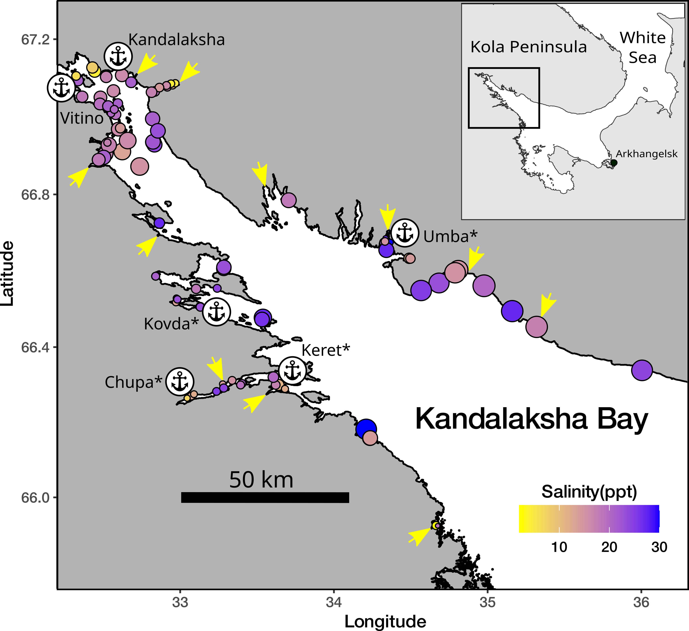
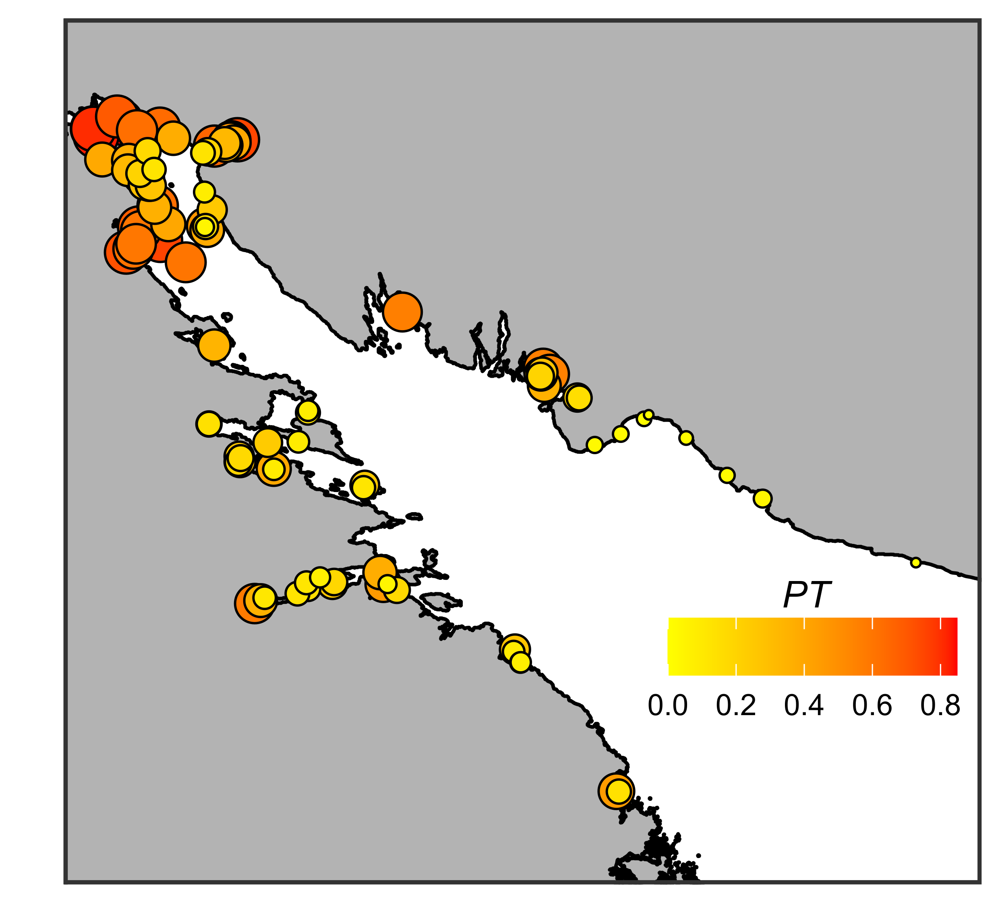

```{r setup, include=FALSE}
library(knitr)
opts_chunk$set(echo = FALSE, message = FALSE)
options(knitr.kable.NA = '')
```

```{r}
## Packages ######

library(ggplot2)
library(lme4)
library(glmmADMB)
library(reshape2)
library(dplyr)
library(patchwork)
library(broom)
library(broom.mixed)
library(tidyr)
library(readxl)
library(mgcv)
library(gratia)
library(cowplot)


```

```{r}
##### Data reading
myt_full <- read_excel(path = "data/myt_full.xls", sheet = "Samples")


ports <- data.frame(Shore = c("Kand", "Karel", "Kand", "Karel", "Karel", "Karel"), Port = c("Kandalaksha", "Vitino", "Umba", "Chupa", "Keret", "Kovda"), Status = c("Active", "Active", "Abandoned", "Abandoned", "Abandoned", "Abandoned"  ), Lat = c(67.137283, 67.076570,  66.677970, 66.269964, 66.294178, 66.696754), Lon = c(32.407995, 32.333630, 34.357655, 33.069534, 33.640656, 32.875396))


sites_fetch_df <- read.table("data/Distred_samples_fetch_values_2023.csv", sep = ",", header = T)

sites_fetch_df[,1:5] <- sites_fetch_df[,1:5]/1000 

# Сonventional coordinates of the top of the Kandalaksha Bay
Shore_boundary = c(67.162360, 32.332371)


```


```{r}

myt_full$Position <- factor(myt_full$Position)

myt_full$Position <- relevel(myt_full$Position, ref = "Bottom")

myt_full$Port_Status <- factor(myt_full$Port_Status)

myt_full$Port_Status <- relevel(myt_full$Port_Status, ref = "Abandoned")

myt_full$River_Size <- factor(myt_full$River_Size)

myt_full$River_Size <- relevel(myt_full$River_Size, ref = "Small")

myt_full$Site <- factor(myt_full$Site)

```


```{r}
myt_site <- myt_full %>% 
  group_by(Shore, Site) %>% 
  select(Lat, Lon, N_T, N_E, Salinity, Min_dist_river, River, River_Size, Min_dist_river_Large, Min_dist_port, Port, Port_Status, Average_Fetch, Dist_cut) %>% 
  summarise(Lat = mean(Lat), Lon = mean(Lon), N_T = sum(N_T), N_E = sum(N_E), Salinity = mean(Salinity), Min_dist_river = mean(Min_dist_river), River = unique(River), River_Size = unique(River_Size), Min_dist_river_Large = mean(Min_dist_river_Large),  Min_dist_port = mean(Min_dist_port), Port = unique(Port), Port_Status = unique(Port_Status), Average_Fetch = mean(Average_Fetch),   Dist_cut = mean(Dist_cut)) %>% 
  mutate(Prop_T = N_T/(N_T+N_E))

```

## Introduction

The recently described cryptic taxonomic heterogenity of "*Mytilus edulis*" complex  (++) raises the need to assess the role of such diversity in ecological processes where blue mussels play important role as ecosystem engineers (Günther, 1996; Commito & Rusignuolo, 2000; Arribas et al., 2014; Khalaman et al. 2021). For example, two closely related species *M. edulis* (thereafter *ME*) and *M. trossulus* (*MT*) form mixed settlements at North Atlantic coasts (Varvio et al., 1988; Hilbish et al., 2000; Mathiesen et al. 2016; Brooks, Farmen, 2013; Riginos, Cunningham, 2005; Katolikova et al. 2016; Vainola, Strelkov 2011; Wenne et al. 2020 убрать лишнее ) and proportion of two species vary in broad limits even in small spatial scales (Katolikova et al. 2016). However there is no clear ecologists' position how to design investigations of  communities where mussels presented by mixed species pull. In some cases, ecologists turn a blind eye to the presence of several mussel species, continuing to believe that a single species is represented in their region (Khalaman et al. 2021). Another approach is to designate the cryptic species complex as "*Mytilus* spp." (Leopold et al 2019). Both these approaches can lead to coarsen results and lose some ecological patterns  because different mussel species  can interact differently with environmental factors (Beyer et al. 2017; Lobel et al., 1990), predators (Khaitov et al. 2018; Lowen et al., 2013) and parasites (Pasteur et al. 1991) including transmissible cancer (Hammel et al., 2022). The most striking ecological difference of cryptic mussel species can be seen in their interaction with high level consumers, such as humans, expressing in  different commercial value of  mussels as aquaculture targets (Mallet et al., 1995; Penney et al. 2002; Beaumont et al., 2008; Dias et al., 2011). 
 

In light of the above, it seems important to develop approaches to the analysis of the ecological role of mussels, taking into account their taxonomic heterogeneity. The primary task, if moving in this direction,  becomes to understand what factors regulate the distribution of species: in which environment one species should be in abundance and in which the other. 


In this paper, we will consider the case where *ME* and *MT* come into contact, forming mixed populations. Such *MT-ME* contact zones are rather frequent in the North Atlantic.  At least seven systems of such kind are currently known: West Greenland, the coast of North America from the Gulf of Maine to Hudson Bay, northeastern Scotland,  the western Baltic Sea, western Norway, the coast of the Kola Peninsula in the Barents Sea and the coast of the Kandalaksha Bay of the White Sea (Vainola, Strelkov, 2011; Wenne et al. 2016; Wenne et al. 2020; Katolikova et al. 2016; Khaitov et al, 2021).  

In general, it is postulated that the proportion of *MT:ME* in the contact zones change along certain environmental gradients (Väinölä and Hvilsom 1991; Riginos and Cunningham 2005; Väinölä and Strelkov 2011). However, some cases of mosaic distribution of *MT* and *ME* have also been described, when spots of higher concentrations of one or other species are present within the region (Moreau et al., 2006; Katolikova et al., 2016; Wenne et al. 2020). The spatial scale of this patchness can range from several kilometers (Moreau et al., 2005; Moreau et al., 2006 report) to a few meters (Katolikova et al., 2016). 


On a biogeographic scale, the distribution of *Mytilus* species is thought to be regulated by regional temperature and its correlates (Popovic & Riginos, 2019; Wenne et al., 2020). *MT* is believed to be a more northerly species, more tolerant to cold waters inhabiting areas that once existed in glaciation zones. *ME* potentially can distribute in  cold waters but tend to form settlements in more temperate latitudes (Wenne et al., 2020). 


Salinity was often considered as a key factor regulating the spatial segregation of species in local *ME*-*MT* contact zones. *MT* are thought to gravitate toward areas of more freshened water, and *ME* toward areas with higher salinity (Riginos & Cunningham, 2005; Ridgway & Naewdal, 2004; Kijewski et al., 2019; Ridgway & Naevdal, 2004).  For example, *MT* form virtually single-species settlements in the heavily freshened Baltic Sea (Gosling, 1992; Vainola Strelkov, 2011) but *ME* proportion dramatically increase  when crossing the Danish straits toward the North Sea where oceanic salinity occurs (Kijewski et al., 2019). In other contact areas (Gulf of St. Lawrence, Mareau et al. 2005, Bergen area, Ridgway & Naevdal, 2004) a similar pattern is observed: *MT* settlements are represented in the most desalinated areas. 

Wave action was also considered as an important factor separating species in space. *MT* has been shown to gravitate toward more turbulent habitats and *ME* toward quieter areas (Tam, Scrosati, 2014; Comesaña et al., 1999; Bates, Innes, 1995). The pattern of species segregation by substrate has also been attempted to be linked to surf exposure (Katolikova et al, 2016): *MT* tended toward fuchcoid thalli, and *ME* toward the surface of bottom stony substrates. The authors (Katolikova et al, 2016) suggested that fucoids act as shock absorbers, mitigating the impact of surf damaging *MT* which possess thinner and more fragile shells (Beaumont et al, 2008; Michalek et al, 2021). Importantly, in the last case, an inverse relationship is assumed: *MT* avoids surf-exposed areas. However, in some studies, when the material collection design was specifically adapted to study of the surf effects, the role of this factor in the regulation of the *MT:ME* ratio has not been proven (Moreau et al., 2005). 

Another explanation of the spatial segregation of *MT* and *ME* can be related to the history of formation of the contact zone. For example, it is believed that in the Barents and White Seas, where initially only *ME* were represented, the *MT* settlements appeared as a result of the introduction of this species from the coast of North America by ships  performing transatlantic traffic  during the World War II (Vainola, Strelkov, 2011). According to the authors, the increased concentration of *MT* is observed in the port areas (Vainola and Strelkov, 2011; Katolikova et al. 2016), where this species was originally introduced. 

We can see a large spectrum of factors (salinity, wave action, proximity to harbor, and substrate type) which were considered as possible agents regulating the spatial segregation of *ME* and *MT*. Moreover, some correlations that seem obvious may have a different interpretation. For example, the relationship of high abundance of *MT* with reduced salinity can be interpreted by another way: the most desalinated areas (river mouths) are often also the quietest areas with minimal wave impact. Port structures, similarly, are often represented in the most sheltered and frequently desalinated areas. Thus, there is no strict evidence for the role of one or another factor in the regulation of species distribution. 

The only way to solve this problem is to include all predictors potentially affecting the composition of mixed settlements in one regression model. Such studies have been attempted before (Kijewski et al., 2019; Wenne et al., 2020) and allowed to show a clear relationship of the *MT:ME* ratio primarily with salinity and temperature. However, the populations involved in the works cyted were scattered over a very wide geographic range, with distances between them reaching hundreds and thousands of kilometers. On the other hand, the gradients of the key factors can vary on much smaller spatial scales. For example, salinity, as a prime candidate regulating the *MT:ME* ratio, can vary significantly on scales of a few kilometers in river estuaries (Van Damme, 2005). Does this mean that the *MT:ME* ratio will show a relationship with salinity at these scales as well? 

The contact zone of *MT* and *ME* found in the relatively small Kandalaksha Bay of the White Sea (Katolikova et al., 2016) is extremely convenient for investigation of the role of one or another factor in the regulation of the *MT:ME* ratio. Firstly, salinity gradients are well expressed in this area. The salinity variation is determined by the inflow of several large rivers into the sea (Katolikova et al., 2016). Secondly, the coast of the gulf possesses numerous sheltered areas (inlets and skerries) and areas open to the surf.  Third, there are several active and several abandoned ports (Katolikova et al., 2016).  Fourth, the fucoid belt is almost ubiquitous on the intertidal zone of the bay, mussels settle both on algae and on the ground surface throughout the area (Katolikova et al., 2016), which allows us to assess the role of substrate in the regulation of micro-scale species segregation. Fifth, the small size of the Kandalaksha Bay (Fig. ++) ensures that there are no clear temperature gradients in both warm and cold seasons. Therefore, the influence of temperature, which probably regulates the distribution of *Mytilus* species on a broader geographic scale (Wenne et al. 2020) or in areas where clear water temperature gradients exist (Hayhurst & Rawson, 2009), can be excluded from the discussion.

Finally, it was shown that in the Kandalaksha Bay genetic manipulations aimed at species identification can be replaced by a simple "morphotype test" based on the study of an easy to observe conchological trait (Khaitov et al. 2021). The results of this test allow identifying mussel species with sufficient accuracy (Khaitov et al. 2021). This makes it possible to process large material amount (dosen of sampling sites and thousands of mussels), which is necessary for ecological patterns' revealing and which could not be processed using expensive genetic technologies of species identification. 

In this paper, based on the large material collected in the Kandalaksha Bay of the White Sea, we will conduct a regression analysis aimed to reveal the dependence of *MT:ME* ratio on all the above candidate factors. 


## Material and methods


```{r}
Total_samples <- nrow(myt_full)
Total_site <- length(unique(myt_full$Site))
Total_N <- sum(myt_full$N_T) + sum(myt_full$N_E)
Min_N <- min(myt_full$N_T + myt_full$N_E)
Max_N <- max(myt_full$N_T + myt_full$N_E)
Mean_N <- mean(myt_full$N_T + myt_full$N_E)
SD_N <- sd(myt_full$N_T + myt_full$N_E)


```


### Study area

The 185 km long Kandalaksha Bay in the north of the White Sea is oriented from southeast to northwest and is funnel-shaped (Fig. ++). Climate is continental subarctic with cold winters (4-5 months of ice cover) and relatively warm summers (August SST is 13.8°C) (Filatov et al., 2005). The bay contains hundreds of banks, skerries and islands. The bay's shoreline is fringed by numerous smaller inlets. Because of this shoreline geometry, different areas even situated close each to other are exposed to wave action in  varying degrees. The summer surface salinity is 24 ppm in most of the Bay (“normal” salinity of the White Sea is 24-30 ppm), but lower in the estuary areas (Filatov et al., 2005). A total of 24 rivers and two canals of hydropower plants (ESM STable ++ ) with catchment area of 141 - 12830 km^2^ (average 240 km^2^) discharge fresh water into the bay creating local salinity gradients. The top of the Kandalaksha Bay is the most desalinated, due to the influence of the largest river Niva (Katolikova et al., 2016). 


Historically (through most of the 20th century), several ports (Fig. ++) were functioning in the area operating high tonnage oceanic vessels (Sailing directions of the White Sea, 1932; Krasavtsev,  2011). Two of these ports, Kandalaksha and Vitino, both in the top of the Bay, are currently functioning while the remaining ports have not been used to serve ocean-going ships in recent decades, but are still visited by coaster ships, according to the conventional knowledge.


Mussels are ubiquitous and abundant along the coasts of the Kandalaksha Bay. On the littoral, they are most abundant at local mussel beds (Khaitov, 2013) and within the fucoid belt formed mainly by  *Fucus vesiculosus* and *Ascophyllum nodosum* (Naumov, 2001) 


### Field collections

When sampling, we tried to describe littoral populations of mussels in the Kandalaksha Bay in as much detail as possible, also taking into account the heterogeneity of their habitats by salinity, wave exposure and proximity to ports. The material was collected on the littoral of the mainland and the islands of the Kandalaksha Bay (Fig. ++). Collections were carried out in July-August in 2011-2018 at `r Total_site` sites. 


At each site we collected mussels from two substrates: fucoid's thallus (thereafter "Algae") and bottom surface (i.e. stones, pebbles, sand, mud; thereafter "Bottom"). Algae samples were taken as individual bundles of fucoids large enough to contain at least a few dozens of mussels (however, this condition proved to be unfeasible for several samples from sparse populations). Bottom samples were taken using a 0.025 m^2^ square frame placed on a ground in such a way that at least a few dozens of mussels could be sampled. Three samples (replications) of each type were taken in each site no more than 20 meters apart. Geographic coordinates were determined for each site (i.e., the same coordinates were assigned to each sample within the same site). Each sample was placed in a plastic bag and transported to the laboratory.  




Mussels with a shell length more than 10 mm were cleaned from tissues and used in further analyses. Shell morphotypes (E-morphotype, characteristic to *ME*, and T-morphotype, characteristic to *MT*, see Katolikova et al. 2016) were identified as in Khaitov et al. 2021. In total we processed `r Total_N` specimens. The mean number of mussels collected per sample was `r round(Mean_N)`(range `r Min_N`, - `r Max_N`).   


### Environmental parameters assessment

This work was was aimed to examine the effects of substrate, salinity, surf level and proximity to ports. Some of these parameters were measured directly but for others several proxies were considered. 

The nature of the substrate was characterized by where the corresponding sample was taken from (*Algae* vs *Bottom*). The degree of proximity to port was estimated as the straight line distance (not accounting shoreline bends) from the sampling site to the nearest of the 6 large ports presented in the area (Fig++, STable ++). Additionally each port was assigned to one of two categories: *"Active"* if at the time of sampling the port was serving heavy-tonnage vessels plying out of the White Sea, or *"Abandoned"* if the port served only small vessels cruising within the White Sea, or was completely abandoned at the time of sampling. 

<!-- Earlier all abandoned ports (at least during World War II, before it or immediately after it) served heavy-tonnage vessels plying between the White Sea and the Barents Sea. -->


*Wind fetch as a proxy for wave impact*. When selecting sampling sites, we assumed that collections should characterize both surf and sheltered habitats. Each site was visually assigned to one of two categories: *"Exposed"* (sites located on open shores exposed to waves coming from the open part of the bay) or *"Sheltered"* (sites located in bays or skerries). For a more formal assessment, the value of wind fetch was calculated for each site. It was calculated as the unobstructed length of water surface (in km) over which wind from a certain direction can blow over. These values can be obtained from the analysis of geographical maps of the region. To calculate the wind fetch values, the R-package *"windfetch"* was used (Seers, 2022). The higher fetch values denote the more wave impact could  be brought from a certain direction. Wind fetch was measured for each site from all directions (North, East, South and West, STable +) but as a value for the further analysis we used an averaged fetch value.  

*Proxies for salinity assessment*. Water samples were taken at each site when mussels were collected, i.e. in the time of  the low tide. The salinity was measured using an "Atago S/Mill-E" handheld salinity refractometer (with 1 ppm accuracy). However, salinity measured directly at the sampling site poorly reflects the salinity regime in the site due to its fluctuations during the tidal cycle and due to weather conditions (waving, precipitation *etc.*). Therefore, as an additional estimate of the desalination level in a given site, we used the characteristics of fresh water discharging sources closest to the sampling site (rivers, channels of hydroelectric power plants). 

In total, 24 rivers are took place in the region, information about which is present in open sources (STable +). Additionally, two powerful freshwater dischargers (HPP canals) were included in the analysis. For each river, we assessed the catchment basin area and coordinates of its mouth.  For HPP canals, this information was obtained by visual analysis of geographical maps. Each of the rivers was assigned to one of two conditional categories: “Large” or “Small” depending on whether its catchment area was more or less than an median catchment area of all rivers included in the analysis (240 km^2^). To note, this operational classification should not be misleading  with classification of rivers size proposed by hydrologists (Khublaryan, 2009). 

We calculated the distance (straight line, not accounting shoreline bends) from each sampling site to the mouth of the nearest river. Thus salinity was characterized by three values: directly measured salinity, distance to the nearest river and the nearest river size. 


### Statistical analysis

The number of T- and E-morphotype mussels in each sample was counted and  proportion of T-morphotype mussels (*PT*) was calculated. Additionally this proportion was assessed for each site (the total number of T-morphotype mussels collected at this site divided by total number specimens collected). The proportion of *MT* in mixed populations in the White Sea is strongly correlated with probability to find *MT* genes in mixed mussels' populations (i.e. STRUCTURE score, Khaitov et al., 2021) and can be assumed as a proxy for *MT:ME* ratio.


All statistical processing was performed using the statistical programming language R 4.05 (R core Team, 2021). The analysis was conducted in two steps. The first step was to determine which predictors are statistically related to *PT*. The second step was to estimate the contribution of each predictor to the overall variation of *PT*. 


At the first step we assumed that the relationship between dependent variable and predictors can be curvelinear that's why we constructed a generalized additive mixed model (GAMM, +++) with beta-binomial residuals distribution (**Model 1**). The fixed part of the model included predictors as follows: 

*Substrate*: categorical, with two levels "Bottom" vs "Algae";    
*Salinity*: continuous, the directly measured salinity (ppt);    
*MinDistRiver*: continuous,  distance to the nearest river (km);    
*RiverSize*: categorical, with two levels "Small" vs "Large" accordingly to size of the nearest river;    
*MinDistPort*: continuous, the distance to the nearest port (km);   
*PortStatus*: categorical, with two levels "Abandoned" vs "Active";   
*AverageFetch*: continuous, fetch value (km).  


For all categorical predictors, the first mentioned category was used as base level in the analyses. The function gam() from the package “mgcv” (+++) was used to build the GLMM.  Smoothers for all continuous predictors were fitted using cubic basic splines (+++). Categorical predictors were included as parametric terms in the model. "Site" was considered as random factor in the model effect of which was assessed by bs="re" parameter in gam() function (see +++).         

To check the **Model 1** for the predictors collinearaity we calculated the variance inflation factor (VIF, Fox & Monette, 1992). Additionally we calculated Pearson correlation between continous predictors. 

To verify that the **Model 1** meets the assumptions of regression analysis, we examined the residuals plots and checked the model for the presence of overdispersion. There were no signs of violation of the assumptions. 


At the second step, the fraction of total variability explained by the fixed part of the model was estimated using marginal coefficient of determination  *R^2^* (Nakagawa & Schielzeth, 2013). Marginal *R^2^* can be decomposed into semi-partial coefficients of determination, *semi-partial R^2^*, that describe the contribution of each individual predictor to the overall coefficient of determination using the “partR2” package  (Stoffel et al., 2021). Unfortunately this package for now is adopted to use GLMM with binomial residual distribution  only (Stoffel et al., 2021). That's why we constructed the additional model, **Model 2**,  fixed part of which was analogous to that in **Model 1**. However, to take into account the overdispersion in **Model 2** we included in addition to "Site", as a random factor, the observation level random effect (OLRE). OLRE is a random factor which adsorbs overdispersion in GLMM (Harrison, 2015; Harrison, 2014). The **Model 2** was constructed using glmer() function from the "lme4" package (Bates et al., 2015)    


## Results

## Environmental parameters

Two of six ports presented in the area were active at the date of material collection (Fig. ++, STable ++ SEM). The distance from sampling sites to the nearest ports ranged from `r round(min(myt_site$Min_dist_port), 2)` to  `r round(max(myt_site$Min_dist_port), 0)` km (Median = `r round(median(myt_site$Min_dist_port), 1)` km) (SEM SFig ++, A). Sites visually categorized as "Sheltered" on average were characterized by lower values of wind fetch than those categorized as "Exposed" (ESM SFig. ++, B). The most exposed sites (maximum values of wind fetch) were located on the western coast of the Kandalaksha Bay, and on the open shores of the islands at the top of the bay (Fig. ++1,   SFig ++ ESM). Salinity measured at the time of sampling ranged from `r round(min(myt_site$Salinity), 0)` to  `r round(max(myt_site$Salinity), 0)` ppm (Median = `r round(median(myt_site$Salinity), 0)` ppm). The most desalinated areas were the top of the Bay and inlets where rivers flow into (Fig. ++1). Salinity at sites situated close to “Large” rivers was lower than at sites closer to “Small” ones (ESM SFig. ++, C). Salinity tended to increase with increasing of distance to the mouth of the nearest river (SEM SFig. ++ D) but no association between distance to the nearest port and salinity was found (SEM SFig. +++ E). Sites situated close to ports tended to have lower wind fetch (SEM SFig. +++ F). All correlations between salinity, distance to the nearest river mouth, distance to the nearest port and wind fetch were rather low (SEM STable +++). The largest correlation revealed was between wind fetch and distance to nearest port (r = 0.46).          


## *PT* distribution

The values of *PT* ranged from `r round(min(myt_site$Prop_T), 0)` to `r round(max(myt_site$Prop_T), 2)` at different sites. The frequency distribution of *PT* values displayed a bimodal structure both in the case of "Bottom" and "Algae" samples (Fig. ++). Thus two types of populations can be recognized in the studied area: populations dominated by E-morphotype (conditional boundary *PT* < 0.5) and samples in which mussels of T-morphotype dominated (*PT* > 0.5). In collections from the "Bottom" substrate, samples belonging to the first group were more frequent (the left peak in the distribution predominated). In collections from the "Algae" substrate, both groups of specimens were represented in more or less equal proportions.

```{r, fig.cap="Fig ++. The frequency distributon of *PT* values at different substrates. Blue lines represent the kernell density polygons smoothing the *PT* frequency distributions."}


myt_full %>% mutate(Prop_T = N_T/(N_T + N_E)) %>% 
ggplot(., aes (x = Prop_T)) + 
  geom_histogram(fill = "grey", color = "black", binwidth = 0.05) +
  geom_density(aes(y=0.05 * ..count..), color = "blue", size = 1, fill="blue", alpha = 0.2, ) + 
  labs(x = "PT", y = "Count") + 
  facet_wrap(~Position) +
  theme_bw()

```


The maximum proportion of the T-morphotype was observed in the top of the Kandalaksha Bay itself and in the small bays deeping into the mainland (Fig. ++). At the same time, sites with a lower proportion of the T-morphotype were located in the immediate vicinity of sites where settlements with high PT values were represented (Fig. ++), reflecting the high level of patchiness in PT spatial distribution. Settlements with the lowest frequency of T-morphotype were represented in the open areas of the Northwest Coast. 


<!--  -->


## Relationship of PT to predictors.

The proportion of T-morphotype mussels was, on average, higher on fucoids than on bottom substrates (Fig. ++ A). This value was slightly higher at sites for which the nearest river was a large river than at sites in the vicinity of small ones (Fig. ++ B). *PT* at sites for which the nearest port was active was, on average, higher than at sites closer to abandoned ports (Fig. ++ C). The *PT* value tended to decrease as Salinity, Average wind fetch, and Distance to the nearest port increased (Figs. ++ D, F, G, respectively). No clear association of *PT* with distance to the nearest river mouth was revealed (Fig. ++, E).


```{r, fig.cap="Figure +. Proportion of mussels with T-morphotype in samples from different conditions. (A) *PT* on two types of substrate; (B) *PT* at sites adjacent to rivers of different sizes. (C) *PT* in areas around abandoned and active ports. (D-G) *PT* as a function of Salinity, Distance to mouth of nearest rivers, average wind fetch and distance to the nearest port. Blue line - ordianry least square regression fitted. Confidential intervals are not shown for regression lines since them are not visualize a multiple regression model taking into account all predictors. These regession lines represent only some tendency in raw data."}

text_size <- 9

Pl_position <- 
  myt_full %>% 
  mutate(Prop_T = N_T/(N_T + N_E)) %>% 
  ggplot(., aes(x = Position, y = Prop_T)) +
  geom_boxplot(fill = "gray80") +
  theme_bw() +
  labs(x = "Substrate", y = "PT") +
  theme(panel.grid = element_blank(), axis.title = element_text(size = text_size), axis.text.x = element_text(size = text_size))


Pl_salinity <- 
  myt_full %>% 
  mutate(Prop_T = N_T/(N_T + N_E)) %>% 
  ggplot(., aes(x = Salinity, y = Prop_T)) +
  geom_point() +
  geom_smooth(se = F, method = "lm") +
  theme_bw() +
  labs(x = "Salinity", y = "PT") +
  theme(panel.grid = element_blank(), axis.title = element_text(size = text_size), axis.text.x = element_text(size = text_size))

Pl_min_dist_river <-  
  myt_full %>% 
  mutate(Prop_T = N_T/(N_T + N_E)) %>% 
  ggplot(., aes(x = Min_dist_river, y = Prop_T)) +
  geom_point() +
  geom_smooth(se = F, method = "lm") +
  theme_bw() +
  labs(x = "Distance to the neares river mouth", y = "") +
  theme(panel.grid = element_blank(), axis.title = element_text(size = text_size), axis.text.x = element_text(size = text_size))


Pl_min_dist_river_Large <-  
  myt_full %>% 
  mutate(Prop_T = N_T/(N_T + N_E)) %>% 
  ggplot(., aes(x = Min_dist_river_Large, y = Prop_T)) +
  geom_point() +
  geom_smooth(se = F, method = "lm") +
  theme_bw() +
  labs(x = "Distance to the neares Large river", y = "") +
  theme(panel.grid = element_blank(), axis.title = element_text(size = text_size), axis.text.x = element_text(size = text_size))


Pl_river_size <-
  myt_full %>% 
  mutate(Prop_T = N_T/(N_T + N_E)) %>% 
  ggplot(., aes(x = River_Size, y = Prop_T)) +
  geom_boxplot(fill = "gray80") +
  theme_bw() +
  labs(x = "The nearest river size", y = "") +
  theme(panel.grid = element_blank(), axis.title = element_text(size = text_size), axis.text.x = element_text(size = text_size))

Pl_fetch <-
  myt_full %>% 
  mutate(Prop_T = N_T/(N_T + N_E)) %>% 
  ggplot(., aes(x = Average_Fetch, y = Prop_T)) +
  geom_point() +
  geom_smooth(se = F, method = "lm") +
  theme_bw() +
  labs(x = "Average wind fetch", y = "PT") +
  theme(panel.grid = element_blank(), axis.title = element_text(size = text_size), axis.text.x = element_text(size = text_size))

Pl_min_dist_port <- 
  myt_full %>% 
  mutate(Prop_T = N_T/(N_T + N_E)) %>% 
  ggplot(., aes(x = Min_dist_port, y = Prop_T)) +
  geom_point() +
  geom_smooth(se = F, method = "lm") +
  theme_bw() +
  labs(x = "Distance to the nearest port", y = "") +
  theme(panel.grid = element_blank(), axis.title = element_text(size = text_size), axis.text.x = element_text(size = text_size))

Pl_port_status <-
  myt_full %>% 
  mutate(Prop_T = N_T/(N_T + N_E)) %>% 
  ggplot(., aes(x = Port_Status, y = Prop_T)) +
  geom_boxplot(fill = "gray80") +
  theme_bw() +
  labs(x = "The nearest port status", y = "") +
  theme(panel.grid = element_blank(), axis.title = element_text(size = text_size), axis.text.x = element_text(size = text_size))


Pl_PT_predictors <- 
(Pl_position + Pl_river_size + Pl_port_status)/ (Pl_salinity + Pl_min_dist_river) / (Pl_fetch + Pl_min_dist_port) + plot_annotation(tag_levels = "A")

library(jpeg)
ggsave(plot = Pl_PT_predictors, filename = "figures/Pl_PT_predictors.jpg", device = "jpeg", dpi = 600, width = 20, height = 20, units = "cm")

```


![Figure +. Proportion of mussels with T-morphotype in samples from different conditions. (A) *PT* on two types of substrate; (B) *PT* at sites adjacent to rivers of different sizes. (C) *PT* in areas around abandoned and active ports. (D-G) *PT* as a function of Salinity, Distance to mouth of nearest rivers, average wind fetch and distance to the nearest port. Blue line - ordianry least square regression fitted. Confidential intervals are not shown for regression lines since them are not visualize a multiple regression model taking into account all predictors. These regession lines represent only some tendency in raw data.](figures/Pl_PT_predictors.jpg)


```{r}

Mod_gam <- gam(Prop_T ~ s(Salinity, bs = "cr") + s(Min_dist_river, bs = "cr") + s(Average_Fetch, bs = "cr") + s(Min_dist_port, bs = "cr") + Position + River_Size + Port_Status + s(Site, k = Total_site, bs = "re"), method = "REML", family = betar(link = "logit", eps = 0.000000001), data = myt_full )

draw(Mod_gam)
Mod_gamm <- gamm(Prop_T ~ s(Salinity, bs = "cs") + s(Min_dist_river, bs = "cs") + s(Average_Fetch, bs = "cs") + s(Min_dist_port, bs = "cs") + Position + River_Size + Port_Status, random = list(Site = ~1), method = "REML", family = "betar", data = myt_full )


```

```{r}
logit_back <- function(x) exp(x)/(1 + exp(x)) 


sm <- smooth_estimates(Mod_gam) %>%
  add_confint()

sm <- sm %>% 
  mutate(Pi = logit_back(est + coef(Mod_gam)[1]), 
         CI_Pi_low = logit_back(lower_ci + coef(Mod_gam)[1]),
         CI_Pi_up = logit_back(upper_ci + coef(Mod_gam)[1]))

myt_full <- myt_full %>% 
  add_partial_residuals(Mod_gam)

myt_full <- myt_full %>% 
  mutate(Pi_Salinity = logit_back(`s(Salinity)` + coef(Mod_gam)[1]),
         Pi_Min_dist_river = logit_back(`s(Min_dist_river)` + coef(Mod_gam)[1]),
         Pi_Average_Fetch = logit_back(`s(Average_Fetch)` + coef(Mod_gam)[1]),
         Pi_Min_dist_port = logit_back(`s(Min_dist_port)` + coef(Mod_gam)[1]))


```


```{r}

Pl_sal_smoother <-
  sm %>%
  filter(smooth == "s(Salinity)") %>%
  ggplot() +
  geom_point(aes(x = Salinity, y = `s(Salinity)`, color = Position),
             data = myt_full, cex = 1, colour = "steelblue3") +
  geom_rug(aes(x = Salinity),
           data = myt_full,
           sides = "b", length = grid::unit(0.02, "npc")) +
  geom_ribbon(aes(ymin = lower_ci, ymax = upper_ci, x = Salinity),
              alpha = 0.2) +
  geom_line(aes(x = Salinity, y = est), lwd = 1) +
  labs(y = "Partial effect", x = "Salinity") +
  geom_hline(yintercept = 0, linetype = 2) +
  theme_bw()


Pl_riv_dist_smoother <- 
    sm %>%
  filter(smooth == "s(Min_dist_river)") %>%
  ggplot() +
  geom_point(aes(x = Min_dist_river, y = `s(Min_dist_river)`, color = Position),
             data = myt_full, cex = 1, colour = "steelblue3") +
  geom_rug(aes(x = Min_dist_river),
           data = myt_full,
           sides = "b", length = grid::unit(0.02, "npc")) +
  geom_ribbon(aes(ymin = lower_ci, ymax = upper_ci, x = Min_dist_river),
              alpha = 0.2) +
    geom_line(aes(x = Min_dist_river, y = est), lwd = 1) +
  labs(y = "Partial effect", x = "Distance to the nearest river (km)") +
    geom_hline(yintercept = 0, linetype = 2) +
  theme_bw()


  

Pl_port_dist_smoother <-
     sm %>%
  filter(smooth == "s(Min_dist_port)") %>%
  ggplot() +
  geom_point(aes(x = Min_dist_port, y = `s(Min_dist_port)`, color = Position),
             data = myt_full, cex = 1, colour = "steelblue3") +
  geom_rug(aes(x = Min_dist_port),
           data = myt_full,
           sides = "b", length = grid::unit(0.02, "npc")) +
  geom_ribbon(aes(ymin = lower_ci, ymax = upper_ci, x = Min_dist_port),
              alpha = 0.2) +
    geom_line(aes(x = Min_dist_port, y = est), lwd = 1) +
  labs(y = "Partial effect", x = "Distance to the nearest port (km)") +
  geom_hline(yintercept = 0, linetype = 2) +
  theme_bw()
    

Pl_fetch_smoother <-
  sm %>%
  filter(smooth == "s(Average_Fetch)") %>%
  ggplot() +
  geom_point(aes(x = Average_Fetch, y = `s(Average_Fetch)`, color = Position),
             data = myt_full, cex = 1, colour = "steelblue3") +
  geom_rug(aes(x = Average_Fetch),
           data = myt_full,
           sides = "b", length = grid::unit(0.02, "npc")) +
  geom_ribbon(aes(ymin = lower_ci, ymax = upper_ci, x = Average_Fetch),
              alpha = 0.2) +
    geom_line(aes(x = Average_Fetch, y = est), lwd = 1) +
  labs(y = "Partial effect", x = "Average Fetch") +
  geom_hline(yintercept = 0, linetype = 2) +
  theme_bw()
  
##################################

Pl_sal_smoother_Pi <-
  sm %>%
  filter(smooth == "s(Salinity)") %>%
  ggplot() +
  geom_point(aes(x = Salinity, y = Pi_Salinity), data = myt_full, cex = 1, colour = "steelblue3") +
  geom_rug(aes(x = Salinity),data = myt_full, sides = "b", length = grid::unit(0.02, "npc")) +
  geom_ribbon(aes(ymin = CI_Pi_low, ymax = CI_Pi_up, x = Salinity),alpha = 0.2) +
  geom_line(aes(x = Salinity, y = Pi), lwd = 1) +
  labs(y = "Partial effect", x = "Salinity (PPT)") +
  geom_hline(yintercept = median(myt_full$Pi_Salinity), linetype = 2)+
  theme_bw()+
  ylim(0, 0.8)


Pl_riv_dist_smoother_Pi <-
  sm %>%
  filter(smooth == "s(Min_dist_river)") %>%
  ggplot() +
  geom_point(aes(x = Min_dist_river, y = Pi_Min_dist_river), data = myt_full, cex = 1, colour = "steelblue3") +
  geom_rug(aes(x = Min_dist_river),data = myt_full, sides = "b", length = grid::unit(0.02, "npc")) +
  geom_ribbon(aes(ymin = CI_Pi_low, ymax = CI_Pi_up, x = Min_dist_river),alpha = 0.2) +
  geom_line(aes(x = Min_dist_river, y = Pi), lwd = 1) +
  labs(y = "Partial effect", x = "Distance to the nearest river (km)") +
  geom_hline(yintercept = median(myt_full$Pi_Min_dist_river), linetype = 2) +
  theme_bw()+
  ylim(0, 0.8)


Pl_port_dist_smoother_Pi <-
  sm %>%
  filter(smooth == "s(Min_dist_port)") %>%
  ggplot() +
  geom_point(aes(x = Min_dist_port, y = Pi_Min_dist_port), data = myt_full, cex = 1, colour = "steelblue3") +
  geom_rug(aes(x = Min_dist_port),data = myt_full, sides = "b", length = grid::unit(0.02, "npc")) +
  geom_ribbon(aes(ymin = CI_Pi_low, ymax = CI_Pi_up, x = Min_dist_port),alpha = 0.2) +
  geom_line(aes(x = Min_dist_port, y = Pi), lwd = 1) +
  labs(y = "Partial effect", x = "Distance to the nearest port (km)") +
  geom_hline(yintercept = median(myt_full$Pi_Min_dist_port), linetype = 2)+
  theme_bw()+
  ylim(0, 0.8)


Pl_fetch_smoother_Pi <-
  sm %>%
  filter(smooth == "s(Average_Fetch)") %>%
  ggplot() +
  geom_point(aes(x = Average_Fetch, y = Pi_Average_Fetch), data = myt_full, cex = 1, colour = "steelblue3") +
  geom_rug(aes(x = Average_Fetch),data = myt_full, sides = "b", length = grid::unit(0.02, "npc")) +
  geom_ribbon(aes(ymin = CI_Pi_low, ymax = CI_Pi_up, x = Average_Fetch),alpha = 0.2) +
  geom_line(aes(x = Average_Fetch, y = Pi), lwd = 1) +
  labs(y = "Partial effect", x = "Fetch (km)") +
  geom_hline(yintercept = median(myt_full$Pi_Average_Fetch), linetype = 2)+
  theme_bw()+
  ylim(0, 0.8)

```


```{r}
ds <-  data_slice(Mod_gam, Position = evenly(Position),  Port_Status = evenly(Port_Status), River_Size = evenly(River_Size)) 


Fit <- predict.gam(Mod_gam, newdata = ds, se = T,  exclude = c("s(Salinity)", "s(Min_dist_river)",  "s(Average_Fetch)",  "s(Min_dist_port)", "s(Site)"))

ds$Fit = Fit$fit

ds$SE = Fit$se.fit

ds$Pi <- logit_back(Fit$fit)
ds$Pi_CI_low <- logit_back(Fit$fit - 1.96*Fit$se.fit)
ds$Pi_CI_up <- logit_back(Fit$fit + 1.96*Fit$se.fit)


Pl_Small <-
ds %>% filter(River_Size == "Small") %>%   
ggplot(., aes(x = Position, y = Pi, fill = Port_Status)) + 
  geom_col(position = position_dodge()) +
  scale_fill_manual(values = c("blue", "gray")) +
  geom_errorbar(aes(ymin = Pi_CI_low, ymax = Pi_CI_up), width = 0.2, position = position_dodge(width = 0.9)) +
  theme_bw()+
  ggtitle("The nearest River: Small") +
  ylim(0, 0.7)+
  theme(legend.position = c(0.15, 0.7)) +
  labs(x = "", y = "Partial effect", fill = "Nearest port status")     
    
Pl_Large <-
ds %>% filter(River_Size == "Large") %>%   
ggplot(., aes(x = Position, y = Pi, fill = Port_Status)) + 
  geom_col(position = position_dodge()) +
  scale_fill_manual(values = c("blue", "gray")) +
  geom_errorbar(aes(ymin = Pi_CI_low, ymax = Pi_CI_up), width = 0.2, position = position_dodge(width = 0.9)) +
  theme_bw()+
  ggtitle("The nearest River: Large") +
  ylim(0, 0.7)+
  guides(fill = "none") +
  theme(legend.position = c(0.15, 0.8)) + 
  labs(x = "", y = "Partial effect")
    

# appraise(Mod_gam)

# tidy(Mod_gam, parametric = T)

# summary(Mod_gam)
```


```{r}
plot_grid(Pl_sal_smoother_Pi, Pl_riv_dist_smoother_Pi, Pl_port_dist_smoother_Pi, Pl_fetch_smoother_Pi, Pl_Small, Pl_Large, ncol = 2)

```


To assess the dependency of *PT* on all predictors we constructed the Model (Table ++). 


The values of VIF calculated for the predictors' set included in the model were rather small (the maximal VIF was detected for `r paste(names(VIF)[which.max(VIF)])`: `r round(max(VIF), 3)`). Although some pairwise correlation  between environmental factors were found (see above) the low VIF values can be interpreted as a negligible collinearity between predictors (i.e. they practically don't mask influence of each for other).   

According to Model 1 (Table ++) significant relationships were found between *PT* and the substrate type, average wind fetch, distance to the nearest port, the status of the nearest port and the size of the nearest river. According to positive coefficients (Table ++) *PT* is higher on "Algae" in comparison with "Bottom" substrates, at sites for which the nearest port belongs to "Active" group in contrast to "Abandoned" one and at sites for which the nearest river is "Large" one. The negative slope for *"MinDistPort"* and *"WindFetch"* (Table ++) indicates that *PT* decreased when distance to the nearest port increased and potential wave impacts enforced. 


<!-- ## Model 2 -->


```{r}
myt_full$OLRE <- 1:nrow(myt_full)


Model_2 <- glmer(cbind(N_T, N_E) ~ Position + Salinity + Min_dist_river + River_Size + Average_Fetch + Min_dist_port + Port_Status + (1|Site) + (1|OLRE),  data = myt_full, family = binomial(link = "logit"), control=glmerControl(optimizer="bobyqa",optCtrl=list(maxfun=2e5)) )


# Model_2scaled <- glmer(cbind(N_T, N_E) ~ Position + scale(Salinity) + scale(Min_dist_river) + River_Size + scale(Average_Fetch) + scale(Min_dist_port) + Port_Status + (1|Site) + (1|OLRE),  data = myt_full, family = binomial(link = "logit"), control=glmerControl(optimizer="bobyqa",optCtrl=list(maxfun=2e5)) )

options(scipen=999)

Model_2_print <- tidy(Model_2)

Model_2_print$p.value <- round(Model_2_print$p.value, 4) 
Model_2_print$p.value <- with(Model_2_print, ifelse(p.value < 0.0001, "<0.0001", p.value))
Model_2_print$estimate <- round(Model_2_print$estimate, 2)
Model_2_print$std.error <- round(Model_2_print$std.error, 3)
Model_2_print$statistic <- round(Model_2_print$statistic, 3)
Model_2_print$effect <- c(rep("fixed", length(fixef(Model_2))), "random", "random")


# Model_2_print$term <- c("$(Intercept)$", "$Position_{Algae}$", "$Salinity$", "$MinDistRiver$", "$RiverSize_{Large}$", "$AverageFetch$","$MinDistPort$", "$PortStatus_{Active}$", "$SD_{(Intercept)}$", "$SD_{(Intercept)}$")

# names(Model_2_print) <- c("Effect", "Group", "Model term", "Estimate", "SE", "Z statistic", "p-value")
  

  
# kable(Model_2_print, align = "lllrrrr")

```

```{r}
empty_row <- data.frame(effect = NA, group = NA,  term = NA, estimate = NA, std.error = NA, statistic = NA, p.value = NA)

empty_row[1,1] <- "Model 1"
empty_row1 <- empty_row 

empty_row[1,1] <- "Model 2"
empty_row2 <- empty_row 


Model_1_2_print <- rbind(empty_row1, Model_1_print, empty_row2, Model_2_print)
 

# kable(Model_1_2_print, align = "lllrrrr", caption = "Table +. Parameters of the GLMM fitted ")
```


```{r}
library(flextable)


Model_1_2_print$term <- c(
  "",
  "(Intercept)",
  "Substrate_{Algae}",
  "Salinity", 
  "MinDistRiver",
  "RiverSize_{Large}",
  "AverageFetch",
  "MinDistPort",
  "PortStatus_{Active}",
  "Sd_{Intercept}",
  "",
  "(Intercept)",
  "Substrate_{Algae}",
  "Salinity", 
  "MinDistRiver",
  "RiverSize_{Large}",
  "AverageFetch",
  "MinDistPort",
  "PortStatus_{Active}",
  "Sd_{Intercept}",
  "Sd_{Intercept}"
  )

names(Model_1_2_print) <- c(
  "Effect type",
  "Random effect",
  "Term",
  "Estimate",
  "SE",
  "z-statistic",
  "p-value"
) 


ft <- Model_1_2_print %>% flextable() 

ft <- compose(x = ft, j = "Term",
  value = as_paragraph(as_equation(Term, width = 3, height = .5)))


ft <- align(ft, j = "p-value", align = "right", part = "all")    
ft <- width(ft, j = "z-statistic",  width = 1)
ft <- width(ft, j = "Term",  width = 1)

ft <- set_caption(ft, "Table +. Parameters of the GLMM fitted ")

ft <- merge_at(ft, i = c(1), j = 1:7 )
ft <- align(ft, i = c(1), align = "center") 

ft <- merge_at(ft, i = c(11), j = 1:7 )
ft <- align(ft, i = c(11), align = "center") 

ft <- align(ft, j = 3, align = "left") 

ft <- bold(ft, i = c(1, 11),  bold = TRUE, part = "body")

ft 
```


<!-- ### Semi-partial $R^2$ -->

```{r}
library(partR2)

# res_part_R2 <- partR2(Model_2, partvars=c("Position", "Salinity", "Min_dist_river", "River_Size",  "Average_Fetch", "Min_dist_port", "Port_Status"),max_level=1, nboot=NULL, parallel = FALSE)

# save(res_part_R2, file = "partR2 result glmer binomial samples in sites.RData")

# Calculations by this code take several hours (due to GLMM bootstraping). Thus the results are loaded from the file with saved analysis data.


load(file = "partR2 result glmer binomial samples in sites.RData")

R2 <- res_part_R2$R2

# R2$term <- c("$Full Model$", "$Position$", "$Salinity$", "$MinDistRiver$", "$RiverSize$", "$AverageFetch$", "$MinDistPort$", "$PortStatus$")

R2$estimate <- round(R2$estimate, 4)
R2$CI_lower <- round(R2$CI_lower, 4)
R2$CI_upper <- round(R2$CI_upper, 4)


R2_print <- data.frame(Term = R2$term, Estimate = R2$estimate, Bootstap_CI = paste(R2$CI_lower," : ",R2$CI_upper), df = R2$ndf )


BW <- res_part_R2$BW

# BW$term <- c("$Position_{Algae}$", "$Salinity$", "$MinDistRiver$", "$RiverSize_{Large}$", "$AverageFetch$", "$MinDistPort$", "$PortStatus_{Active}$")

BW$estimate <- round(BW$estimate, 3)
BW$CI_lower <- round(BW$CI_lower, 3)
BW$CI_upper <- round(BW$CI_upper, 3)


BW_print <- data.frame(Term = BW$term, Estimate = BW$estimate, Bootstap_CI = paste(BW$CI_lower," : ",BW$CI_upper))


```


```{r}
R2_print <- R2_print %>% select(-Bootstap_CI, -df)

names(R2_print) <- c("Term", "Estimate")

R2_print$Term <- c(
  "Full Model",
  "Substrate",
  "Salinity", 
  "MinDistRiver",
  "RiverSize",
  "AverageFetch",
  "MinDistPort",
  "PortStatus"
)

R2_print <- R2_print %>% arrange(desc(Estimate))


ft2 <- flextable(R2_print)
# ft2 <- compose(x = ft2, j = "Term",
#   value = as_paragraph(as_equation(Term, width = 3, height = .5)))

ft2 <- set_caption(ft2, "Table ++. Partial (full model) and semi-partial (particular predictors) coeffitients of determination for the Model 2.")

ft2
```


<!-- ```{r} -->
<!-- kable(R2_print, caption = "Table +. Partial R^2^ for the full model and semi-partial R^2^ with bootstrap CI for predictors from the Model 1.", align = "lrrr") -->
<!-- ``` -->

Model 2 which was used for assessment of predictors influencing power shows the similar pattern of association between *PT* and predictors as was revealed in Model 1 (estimated coefficients for Model 2,  Table ++,  are close to those for Model 1). Partial R^2^ for Model 1 was quite low (part R^2^ = 0.20, Table ++) indicating that all predictors included in the model, in total, explained about 20% of the variation of *PT*. 

The analysis of semi-partial R^2^ calculated for the Model 2 (Table ++) revealed the substrate type and nearest port status as two best predictors regulating proportion of T-morphotype. The influence of wind fetch and distance to the nearest port was less pronounced. The signals from all predictors characterizing salinity were the lowest. 


<!-- ```{r} -->
<!-- kable(BW_print, caption = "Table +. Standardized slopes with bootstrap CI from Model 1.", align = "lrr") -->
<!-- ``` -->


<!-- ```{r, fig.cap="Figure ++. The importance of predictors as drivers of MT distribution.  Partial R^2^ reflecting the proportion of total variation explined."} -->

<!-- Pl_partR2_R2 <- forestplot(res_part_R2, type = "R2") -->

<!-- Pl_partR2_BW <- forestplot(res_part_R2, type = "BW") -->

<!-- # (Pl_partR2_R2 + Pl_partR2_BW)  + plot_annotation(tag_levels = "A") -->

<!-- Pl_partR2_R2 -->
<!-- ``` -->


```{r}
# # Model_1 diagnostic
# 
# Model_1_diagnostic <- data.frame(Fit = fitted(Model_1),  Resid = residuals(Model_1, type = "pearson"), Lon = myt_full$Lon, Lat = myt_full$Lat, Dist_cut = myt_full$Dist_cut, Shore = myt_full$Shore, Site = myt_full$Site)
# 
# ggplot(Model_1_diagnostic, aes(x= Fit,  y = Resid)) +
#   geom_point() +
#   geom_hline(yintercept = 0)
# 
# ggplot(Model_1_diagnostic, aes(x = Resid)) +
#   geom_histogram()
# 
# # Residuals are more or less evanly distributed, no evident pattern is seen
# 
# 
# library(mgcv)
# 
# Mod_gam_resid <- gam(Resid ~ s(Lon, Lat), data = Model_1_diagnostic)
# 
# summary(Mod_gam_resid)
# 
# # No strong spatial patterns in residuals
# 
# 
# library(spdep)
# 
# spdat <- SpatialPointsDataFrame(cbind(myt_full$Lon, myt_full$Lat), myt_full)
# 
# lstw  <- nb2listw(knn2nb(knearneigh(spdat, k = 60)))
# 
# moran.test(Model_1_diagnostic$Resid, lstw)
# 
# moran.mc(Model_1_diagnostic$Resid, lstw, nsim = 9999) #the same as previous test but with permutational approach
# 
# # No spatial autocorrelation

```


## Discussion

Using the "morphotype test" (Khaitov et al. 2021) as a tool for species identification, we were able to construct a model describing the relationship between T-morphotype frequency and all the factors that are generally considered to be the main regulators of the *MT:ME* ratio in mixed mussel settlements.  Our analysis showed that the predictors included in the model, although weakly correlated with each other, do not exhibit high collinearity. This means that we can consider all factors involved as independent entities that do not mask each other in their influence.   

<!-- The application of the "morphotype test" (Khaitov et al., 2021), as species identification tool, leaves a room for doubt that our results reflect the real *MT:ME* ratio. However, on the other hand, the high correlation between  PT proportion of *Mt:Me* assessed on the basis of genetic markers (Khaitov et al., 2021), as well as the very large volume of material (numerous sites and a large number of individuals collected on them) allow us to hope that the obtained pattern correlates well with the real pattern of species distribution. -->

An intriguing result of our study was the very weak signal of the influence of salinity on the *MT:ME* ratio. GLMM fitted do not reveal a statistically significant relationship between *PT* and salinity, per se, measured at the time of sampling. The influence power (semi-partial R^2^) of this predictor was extremely low. We attempted to estimate the degree of desalination indirectly by introducing into the model quantities that may alternatively characterize salinity at the sampling site: the distance to the nearest river and the size of the nearest river. Both of these quantities, like salinity, contributed negligibly to the total variance explained by the model. This result is in contradiction with the fact that many papers analyzing *MT* distribution in *MT-ME* contact zones indicate that *MT* forms populations in more desalinated habitats and *MT* gene frequencies decrease as salinity increases (Riginos and Cunningham, 2005; Katolikova et al., 2016; Stuckas et al., 2017; Kijewski et al 2019). 


Surprisingly, in spite of the fact that salinity is considered as a leading factor determining the segregation of *MT* and *ME* (see citations above) all studies discussing this relationship are correlative. Only a few works have been devoted to comparison of ecophysiological responses of these two species to salinity (Gardner&Thompson 2001; Qiu et al., 2002; Knobel et al. 2021).

Moreover, direct investigations tended to influence salinity analysis, did not reveal unequivocal evidence that adult *MT* stages are better adapted to reduced salinity than adult *ME* (Gardner&Thompson 2001; Qiu et al., 2002). It has only been shown that larval stages of *MT* survive in lower salinity better than the same *ME* stages (Qiu et al., 2002). That is, *MT* larvae are better performed in low salinity corresponding to those conditions in which adults exist (Knobel et al. 2021).

Looking at the raw data presented in our work, as in previous studies, one gets the impression that salinity is an important environmental parameter (Fig. ++ shows a clear negative correlation of *PT* with salinity). However more accurate analysis, where salinity influence is considered against the influence of other predictors included in a common model, is rather consistent with those ecophysiological works in which no explicit correlation between physiological indices of *MT* and *ME* and salinity was found. Thus, the correlation between salinity and the *MT:ME* ratio, noted in our raw data at least in this work, allows us to consider the above relationship as a spurious correlation. 

At the same time, it is apparently too early to completely abandon the regulatory role of salinity. A model based on beta-binomial distribution (**Model 1**) allowed us to capture weak but  significant signal about the role of salinity: if we express salinity in terms of the size of the nearest river then *PT* turns out to be higher on average if the nearest river is large. 

We admit that our methods of salinity determination, the way of sampling, the use of morphotype test instead of direct genotyping, all this does not allow us to reveal the fine  relationship between the *MT:ME* ratio and salinity. However, if such clear links with salinity, which have been revealed in other regions, exist also in the Kandalaksha Bay of the White Sea, where salinity gradients are very pronounced, then these patterns should have been reflected in the distribution of morphotypes (which are very tightly associated with the species status of mussels) as well. Perhaps we should look for the answer in other influences that shift the observed pattern. For example, it has been shown that only larvae (Qiu et al., 20++) show a clear dependence on salinity. If the critical stage for the formation of the *MT:ME* ratio relationship with salinity is larvae, then the ratio of larval numbers of the two species in the plankton will play a crucial role. We currently have no data on this ratio in the White Sea. However, it is logical to assume that the number of larvae will be proportional to the abundance of adults living on the bottom. If we consider only bottom substrates, the relative frequency of *ME*-dominated settlements (low *PT* values, Fig. ++) greatly exceeds the frequency of *MT*-dominated settlements (high *PT* values, Fig. ++). In the case of fucoid settlements, this ratio is close to equal. Mussel settlements existing on the bottom substrates in the White  Sea are very extensive and are represented by numerous littoral and sublittoral mussel beds located on gravel or muddy-sand substrates (Lukanin +++; Khaitov, 2013). The fucoid belt is only a narrow band along the lower part of the intertidal zone (Naumov, 2019; Novaczek & McLachlan,1989). These allow us to expect that in the plankton the absolute advantage should be with the *ME*. It is possible that with such ratios of species abundance in plankton and with a relatively small area of the Kandalaksha Bay, the salinity driven selection discussed in previous studies (Knobel et al., 2021) cannot manifest itself.  

Against the background of the unexpected failure in identifying the relationship between the *MT:ME* ratio and salinity, we found other, previously poorly studied, correlations. We found that the proportion of *MT* is clearly governed by three factors: the nature of the substrate, the proximity  to active port systems, and the degree of coast exposure to wave action. According to the data we obtained, the highest *MT* concentration should be expected on the fuchcoid tally, in sheltered areas close to active ports.


It is believed that *MT* was introduced into the Barents and White Seas due to ship traffic during World War II (Vainola & Strelkov, 2011). This hypothesis was based primarily on the fact that high concentrations of *MT* were found in the vicinity of currently active or abandoned ports in the Barents and White Seas (Vainola & Strelkov, 2011; Katolikova et al. 2016). Our study confirmed this hypothesis. The proportion of T-morphotype (and hence MT) in the studied area decreases with the distance from the port (negative coefficients with the predictor *"MinDistPort"* in Models 1 and 2, Table ++).


Apparently, the degree of port activity also plays an important role (the predictor *"PortStatus"* is among the leaders by the strength of influence on the explained variance, Table ++, Fig. ++) . According to our data, if the port nearest to the mixed settlement is active, i.e. it serves the ships coming from outside the White Sea (in our case it is "Kandlaksha" and "Vitino" ports), then the *PT* value in such settlements is higher than in the settlements adjacent to the abandoned harbors.  This can be explained in several ways. 

It is possible that new *MT* are constantly brought to the ports of the Kandalaksha Bay from the Barents Sea (primarily from the ports of Murmansk in the Kola Bay, where the abundance of *MT* is very high, Vainola&Strelrov, 2013). In the abandoned ports this constant renewation is absent and during the time of port inactivity *MT* have been displaced by *ME*. 

On the other hand, active ports tend to have a higher degree of anthropogenic pollution, leading to less stress tolerance of mussels (Hellou & Law, 2003). Different mussel species are known to interact differently with pollutants (Beyer et al., 2017) and in the Halifax area, for example, *MT* are more abundant in the most polluted habitats than *ME*, but show less stress tolerance than *ME* (Hellou & Law, 2003). However, studies of the immune systems of *MT* and *ME* in the Canadian contact zone suggest a greater suppression of the *MT* immune system in areas prone to pollution (Coray et al., 2006), making them more sensitive to stress than *ME*. The last fact contradicts the hypothesis of better performance of *MT* to pollutant influence allowing them to set populations in active port harbors.   

A third explanation is also possible. Transmissible cancer is known to circulate in *MT* populations (Skazina et al., 2021 and references therein). This disease can cross species barriers (Metzger et al., 2016): *MT* can infect other mussel species with their cancer cells which cause disseminated neoplasia in them. Although it has not yet been proven that transmissive cancer coming from *MT* can cause a spike in clam mortality, it can be assumed that it is very likely, since cancer-like diseases are one of the cause of mussels mortality (Benabdelmouna &Ledu, 2016; Burioli et al 2019), mussels infected by *MT*-originated neoplasia die during several weeks, but cases of remission is known as well (Burioli et al 2019). If propose that *MT* are more resistant to transmissible cancer (Yonemitsu et al., 2019, проверить) then it is expected that in port harbors where *MT* were introduced to, the abundance and subsequently the proportion of *ME* should decrease due to their higher mortality. 

In any case, our data allow us to confirm the earlier stated hypothesis that in the case of the White Sea  *MT* is an invasive species (Vainola&Strelkov 2011). Unfortunately, only few data could be provided to check this hypothesis for other European *MT* populations since the closeness to the port harbors was never included into species distribution models developed for other areas. In some cases it is probably an unrealistic aim due to absence of predictor variability.  For example in the case of *MT* populations in the Baltic Sea, where there is extremely active ship traffic and vessels visiting almost all parts of the Baltic, it is not possible to identify a correlation between the distribution of *MT* and the presence of ports. Unless, of course, we consider the whole Baltic Sea as a huge port area where *MT* were once introduced some ages ago. This is contradicted by the significant genetic difference of the Baltic *MT* from the conspecifics represented in other regions of the Atlantic (Wenne et al., 2020). At the same time, if we look at the map of *MT* distribution (Vainola & Strelkov, 2011), the confinement of *MT* to large European ports out of the Baltic Sea (e.g. Bergen, Murmansk), rather speaks in favor of the hypothesis of *MT* introduction due to ship traffic.  The unexpected increase in the number of *MT* in aquaculture plantations in the Scottish fjords (Beaumont 200+) is rather consistent with the hypothesis of the recent invasion as well. 

Our analysis revealed that the higher the wind fetch value, the lower the *PT* i.e. *MT* avoid open coasts potentially exposed to the surf. The lowest *PT* value (i.e., E-morphotype mussels dominate in the settlements) is observed on open shores of the north-east coast of Kandalaksha Bay (Fig. ++), exposed to wave action due to southeast and south-west winds which are frequent in the White Sea region (Berger, Naumov, 2001). This result corresponds well with the data on the thickness of *MT* and *ME* shells. It is known that *MT* have thinner, more fragile shells (Beaumont et al., 2008; Michalek et al, 2021). It is logical to expect that mollusks with such characteristics should avoid places with high wave loading. In such habitats, *ME* with stronger shells are expected to benefit. A similar pattern can be seen in other contact zones. For example, in Greenland, an increased frequency of *MT* was noted at the sheltered top of the fjord (GLS and GLD sites, Fig. 1 in Wenne et al. 2016), while the population at a more open site located near fjord mouth (GLL site in Wenne et al. 2016) is dominated by *ME*. 

Finally the nature of the substrate is the most powerful predictor that has an influence on *PT* variation (Table ++, Figure ++). The proportion of T-morphotype mussels appears to be significantly higher on fucoids than on bottom substrates (silty-sandy sediment, pebbles, boulders and rock surfaces) located in close proximity (not more than 20 m, within the same fucoid belt). This pattern was first detected in the analysis of a significantly smaller volume of material (Katolikova et al., 2016). Bringing in new data collected in a wider range of conditions confirmed the presence of this pattern. It can be assumed that the effect of substrate type on *PT* has the same mechanism that underlies the negative correlation of *PT* with wind fetch. Fucoids may work as shock absorbers, mitigating, to a certain extent, the impact of the surf.  Another explanation could also be given. Perhaps *MT* are capable of attaching to underwater substrates more strongly than *ME* do. This should cause less strongly attached molluscs to break off and remain on the bottom under constant fluctuations in the thallus of the fucoids. This hypothesis is contradicted by the fact that a comparison of attachment strength in *MT* and *ME* from the contact zone in Canada, showed no significant differences between the species when they were kept under laboratory  conditions (Lowen et al., 200+). Additional investigations of attachment strength of both species are needed. 


 At the same time it should be noted the rather low coefficient of determination (partial R^2^) for this model indicates that a significant portion of the variability in the *MT:ME* ratio is under the control of some factors both abiotic and biotic one which were not included in the model constructed. For example, we predict that some differences could be found in the tolerance of the two mussel species to freezing in ice (responses to freezing for *MT* studied in Gill et al., 2023, for *ME* - in Williams, 1970). The low temperature impact for mussels living  in the  White Sea covering by ice for several months may be an important factor regulating the *MT:ME* ratio. One of the possible biotic factor which was out of scope in our investigation is the influence of predators which can significantly shift *MT:ME* proportion (Khaitov et al, 2021; Khaitov et al., 2023). Another underestimated biotic factor that potentially can regulate the ratio of species in mixed settlements can be epidemic events (e.g. transmissible cancer, see above). Additionally,  our study revealed the segregation of *MT* and *ME* at very tiny spatial scales. We showed that these two species segregate within the same habitat (inside the fucoid belt), inhabiting different substrate types. This is the pattern to be expected if we have deal with two competing species occurring in common habitat. This suggests that, competitive interactions with *ME* may also constrain *MT* dispersal and as a consequence determine the *MT:ME* ratio. Additional extensive investigations are needed to fill mentioned gaps. 
 

<!-- ## Conclusion -->

<!-- Our analysis did not reveal the large-scale clinal patterns in the distribution of *MT* and *ME* associated with salinity gradients (temperature gradient was out of our interest since temperature does not show variation in the studied region) discussed in previous works. We have shown that in Kandalaksha Bay *MT* avoiding exposed areas are concentrated near port harbors, where they were probably originally introduced. Apparently, there are some factors preventing *MT* dispersal from these refugia.  We have previously suggested that such a factor may be predators (Khaitov et al., 2018), for which port areas may be unfavorable due to their anthropogenic contamination. Our current study revealed the segregation of *MT* and *ME* at even smaller spatial scales. We showed that these two species segregate within the same habitat (the local fucoid belt), inhabiting different substrate types. This is the pattern to be expected if we have deal with the two competing species occurring in common habitat. This suggests that, in addition to the influence of abiotic factors, predators, competitive relations with *ME* may also constrain *MT* dispersal.  -->

<!-- If this hypothesis is correct, then we can expect three temporal patterns in changes of *MT:ME* ratio. Firstly, one of the species can complitelly outcompete the other. Secondly, *MT* and *ME* can form a stable system with each species occupying its own ecological niche. Or, more likely, taking into account the instability of mussel settlements (Khaitov, Lentsman, +++),  these two species will alternately colonize certain habitats changing each other in time.  -->


## Supplementary electronic materials (SEM)

### Environmental parameters characteristics 

<!-- There are 6 ports presented in Kandalaksha Bay (STable +++). Most localities sampled (34 sites) had "Vitino" as the closest harbor, which came into service in the 1990s. The remaining ports, in operation since the beginning of the 20th century, were attributed as closest to 14-17 sites. The distance from sampling sites to the nearest ports varied in broad range (0.11 - 82 km) but on average the distance from port to the corresponding sites ranges in more narrow limits (17 - 26 km, Fig ++, A).  -->


```{r}

ports %>% 
  select(-Shore) %>% 
  kable(col.names = c("Port", "Status", "Latitude", "Longitude"), caption = "STable +. Ports presented in the Kandalaksha bay")
```


### Associations between environmental peameters

Pearson correlation between environmental parameters
```{r}
# names(myt_site)
cor_df <- 
myt_site %>% select(Salinity, Min_dist_river, Min_dist_port, Average_Fetch) %>% as.data.frame(.) %>% select(-Shore) %>% cor(., method = "pearson") %>% as.data.frame(.) %>% mutate(Predictor = names(.)) %>% select(-1) 

cor_df <- cor_df[-4,]
cor_df[2:3, 1] <- NA
cor_df[3, 2] <- NA

cor_df <- cor_df %>% select(Predictor, Min_dist_river, Min_dist_port, Average_Fetch)

ft_cor <- flextable(cor_df)

ft_cor

# cor.test(myt_site$Min_dist_river, myt_site$Min_dist_port)
```


```{r}

site_river <-
  myt_site %>% 
  group_by(River) %>% 
  summarise(Site_Number = n())
  


river_full <-
  merge(river_full, site_river, all.x = T) %>% 
  relocate(Site_Number, .after = Lon) %>% 
  mutate(Site_Number = replace_na(Site_Number, replace = 0))


river_full %>% 
  # filter(River %in% unique(myt_full$River)) %>% 
  select(-Shore, -Source) %>%  
  kable(col.names = c("River", "Drainage Area sq. km", "River Size", "Mouth Latitude", "Mauth Longitude", "Number of sampling sites near the river"), caption = "Table +. Parameters of river and other fresh-water discharging source associated with Kandalaksha Bay.")
  
```


```{r}
text_size <- 9

theme_set(theme_bw() + theme(panel.grid = element_blank(), axis.title = element_text(size = text_size), axis.text.x = element_text(size = text_size)))

port_neghbourds <- myt_site %>% group_by(Port) %>% summarise(Site_Number = n(), Median_Dist = median(Min_dist_port))

# range(round(port_neghbourds$Median_Dist))

Pl_Ports <- 
  myt_site %>% 
  ggplot(., aes(x = Port, y = Min_dist_port)) + 
  geom_boxplot(fill = "gray80") + 
  geom_text(data = port_neghbourds, aes(y = Median_Dist - 3, label = Site_Number)) + 
  labs(x = "Ports", y = "Distance to the nearest port (km)") +
  theme(axis.text.x = element_text(angle = 60, vjust = 0.6))


sites_fetch_df2 <- 
  sites_fetch_df %>% 
  melt(., id.vars = c("Site", "Site_Exposition"), value.name = "Fetch", variable.name = "Direction")

sites_fetch_df2$Direction <- factor(sites_fetch_df2$Direction, labels = c("Nort", "East", "South", "West", "Average Fetch"))


Pl_Fetch <-
  ggplot(sites_fetch_df2, aes(x = Site_Exposition, y = Fetch, fill = Direction)) + 
  geom_boxplot() + 
  scale_fill_manual(values = c("gray95", "gray80", "gray70", "gray60", "gray40")) + 
  labs(x = "Visual assessment of \nsite exposition", y = "Wind fetch") +
  theme(axis.text.x = element_text(angle = 60, vjust = 0.6))
# theme(legend.position = c(0.7, 0.75)) +


# range(myt_site$Salinity)

# median(myt_site$Salinity)


Pl_Salinity <-
  myt_full %>% group_by(Site, River_Size) %>% 
  summarise(Salinity = mean(Salinity)) %>% 
  ggplot(., aes(x = River_Size, y = Salinity)) + 
  geom_violin(fill = "gray") +
  labs(x = "The size of the nearest river", y = "Salinity") +
  theme(axis.text.x = element_text(angle = 60, vjust = 0.6))


Pl_Salinity_vs_Dist <- 
  ggplot(myt_site, aes(x = Min_dist_river, y = Salinity)) + 
  geom_point() +
  labs(x = "Distfnce to the nearest River", y = "Salinity")


Pl_Salinity_vs_Dist_to_Large_riv <- 
  ggplot(myt_site, aes(x = Min_dist_river_Large, y = Salinity)) + 
  geom_point() +
  labs(x = "Distfnce to the nearest Large River", y = "Salinity")


Pl_Fetch_vs_Dist_to_Port <- 
  ggplot(myt_site, aes(x = Min_dist_port, y = Average_Fetch)) + 
  geom_point() +
  labs(x = "Distance to the nearest port", y = "Wind Fetch")


Pl_Salinity_vs_Dist_to_Port <- 
  ggplot(myt_site, aes(x = Min_dist_port, y = Salinity)) + 
  geom_point() +
  labs(x = "Distance to the nearest port", y = "Salinity")


```


```{r, fig.cap="SFigure ++. Associations between environmental factors. "}

Pl_predictors <-
(Pl_Ports + Pl_Fetch) /
(Pl_Salinity + Pl_Salinity_vs_Dist) /
(Pl_Salinity_vs_Dist_to_Port + Pl_Fetch_vs_Dist_to_Port) + plot_annotation(tag_levels = "A")

ggsave(plot = Pl_predictors, filename = "figures/Pl_predictors.jpg", device = "jpeg", dpi = 600, width = 20, height = 20, units = "cm")


```


![SFigure +. Associations between environmental factors. (A) Boxplots showing the variation in distances to the nearest port. Numbers insite the box indicate the number of sites for which the corresponding port is the nearest. (B) Boxplots showing the variation of wind fetch for different directions for two groups of sites (Exposed vs Sheltered) choosen for material collection. (C) The kernel density violin-plots showing salinity variation for sites near Small and Large rivers. (D) The association of salinity with distance to the mouth of the nearest river. (E) The association of salinity with distance to the nearest port. (F) The association between wind fetch and distance to the nearest port.](figures/Pl_predictors.jpg)


```{r}
# Расстояние до ближайших портов

# range(myt_site$Min_dist_port)

```


<!-- Most of the sites visually evaluated during sampling time as "Sheltered" have wind fetch values lower than those assigned to the "Exposed" group (Fig. ++, B). For sites in the latter group, the most open direction is the southeastern one (Fig. ++, B), which coincides with the wind direction that prevails in the region during the warm seasons (Lebedev, 2016).  -->

<!-- The most open sites (maximum wind fetch) were located on the northwestern coast and on the open areas of the islands closer to the top of the Kandalaksha bay (Fig. ++1).  -->

<!-- Salinity measured at the time of sampling ranged from 2 to 30 ppm (Median = 19 ppm). The most desalinated areas were at the top of both the Kandalaksha Bay itself and at the tops of smaller inlets deeping into the shore, where rivers often flow into (Fig. ++1). The closest to the sampling sites were the mouths of 18 rivers, of which 11 were classified as "Large" (Table ++, Fig. ++). Salinity at sites where the nearest river was classified as "Large" was markedly lower than at sites closer to small rivers (Fig. ++, C). Salinity tended to increase as the distance to the nearest river increased (Fig. ++ D). -->


## Literature cited 

Лоция Белого моря / Гидрографическое управление ; общ. ред. А. Н. Рождественского. – 5-е изд. – Ленинград : Издание Гидрографического управления, 1932. – LXXII, 566 с., 22 вкл. л. ил., карт., схем.


