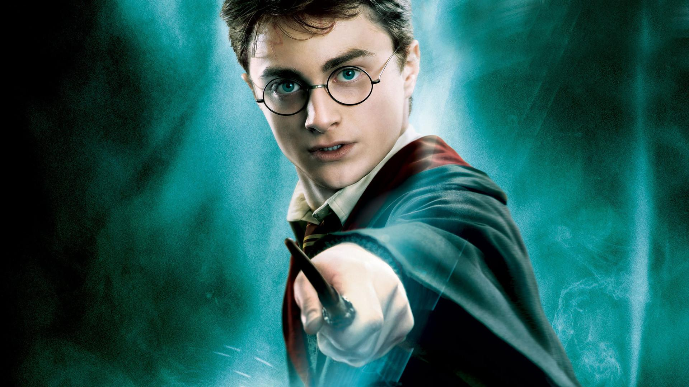
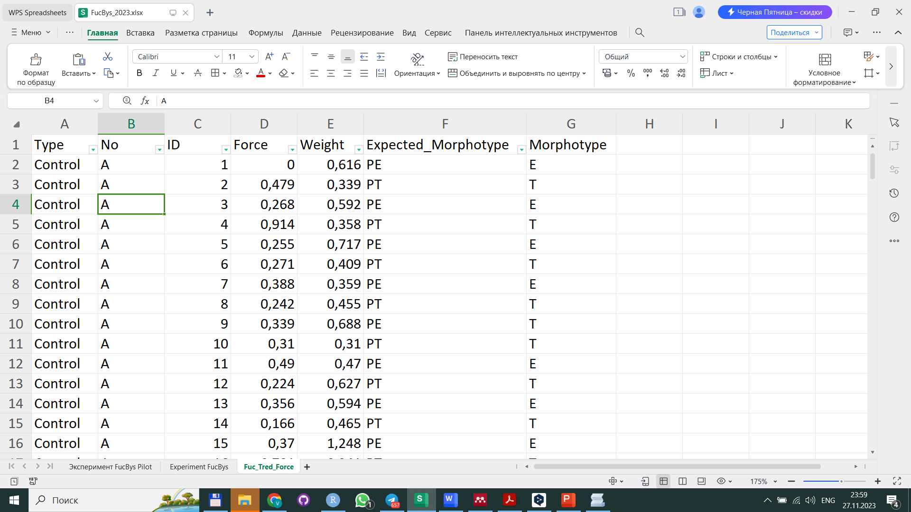
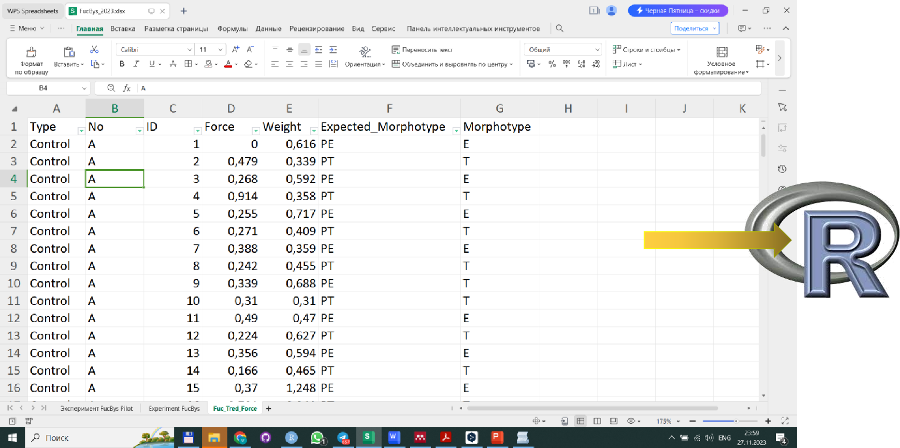
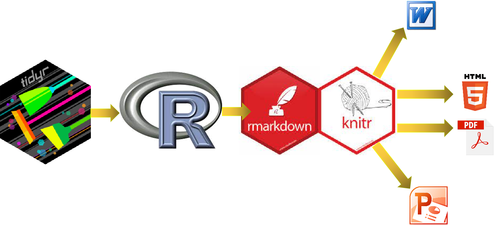
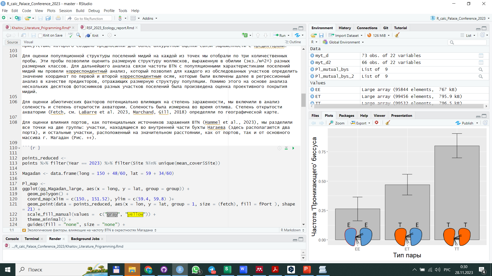
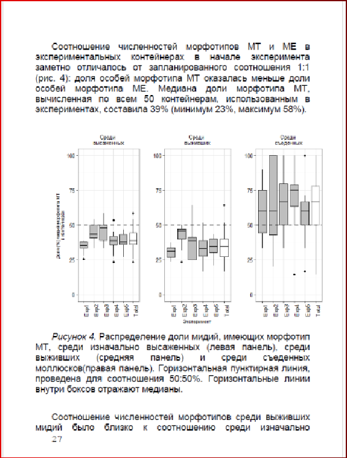
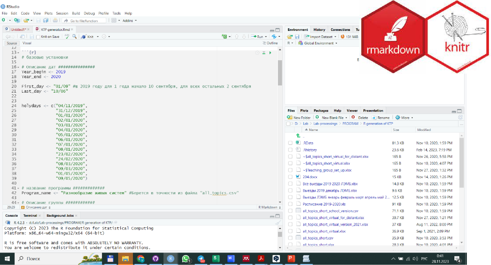
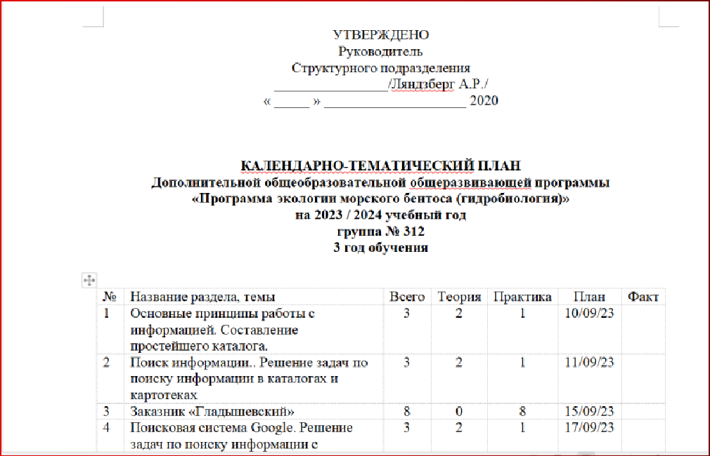
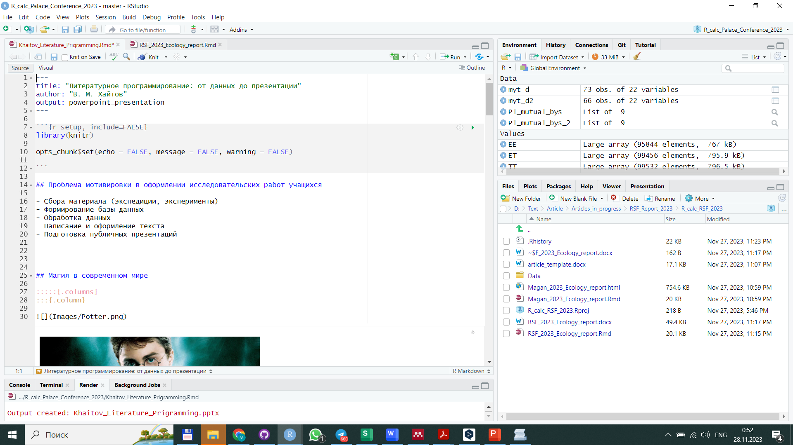
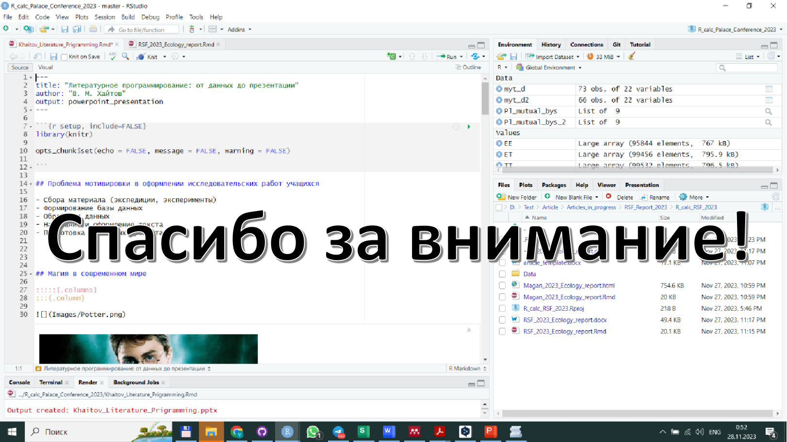

```{r setup, include=FALSE}
library(knitr)

opts_chunk$set(echo = FALSE, message = FALSE, warning = FALSE)

```

## Проблема мотивировки в производстве исследовательских работ учащихся

**При прохождении пяти основных этапов исследовательской работы**

- Сбор материала (экспедиции, эксперименты)
- Набивка базы данных 
- Обработка данных
- Написание и оформление текста
- Подготовка публичных презентаций

**Часто происходит снижение мотивации...**


## Магия в современном мире

:::::{.columns}
:::{.column}



:::

:::{.column}
- **Магия** - это управление миром с помощью информации.
- Именно этим и занимаются компьютерные технологии.
- Умение управлять информацией - важнейшая компетенция.

:::

::::::::::::::

# Первая ступень магии: От опрятных данных к красочным иллюстрациям

## Tidyverse: культура организации данных




## Tidyverse: культура организации данных




## Немного кода и грамматики графиков

:::::::::::{.columns}

:::{.column}

```{r echo=TRUE}

library(readxl)
library(dplyr)
library(ggplot2)
library(png)
myt_d <- read_excel("Data/TouchTrEd_D_2023.xlsx", na = "NA")
myt_d  <- myt_d  %>% filter(!is.na(Supposed_Morph_A))
myt_d  <- myt_d  %>% mutate(Reciproc = ifelse(Reciprocal_threads == "0", "No", "Present"), Total_Bys_A =  To_Substr_A + To_mate_A, Total_Bys_B = To_Substr_B + To_mate_B, Prop_to_Mate_A = To_mate_A/Total_Bys_A, Prop_to_Mate_B = To_mate_B/Total_Bys_B)

```

:::

:::{.column}
```{r}
myt_d  <- myt_d  %>% filter(Experiment_Type == "Field")
myt_d  <-
  myt_d  %>% mutate(Pair_Type = case_when(Morph_A == "t" & Morph_B == "t" ~ "TT",
                                        Morph_A == "e" & Morph_B == "e" ~ "EE",
                                        Morph_A == "t" & Morph_B == "e" |  Morph_A == "e" & Morph_B == "t"  ~ "ET") )


myt_d2 <-
myt_d  %>% filter(!((Supposed_Morph_A != Morph_A)|(Supposed_Morph_B != Morph_B)) )


# myt2 %>%
#   group_by(Morph_A, Morph_B) %>%
#   summarise(Prop_Reciproc = mean(Reciproc == "Present"))

myt_d2 <-
myt_d2 %>% mutate(Pair_Type = case_when(Morph_A == "t" & Morph_B == "t" ~ "TT",
                                      Morph_A == "e" & Morph_B == "e" ~ "EE",
                                      Morph_A == "t" & Morph_B == "e" |  Morph_A == "e" & Morph_B == "t"  ~ "ET") )

Pl_mutual_bys <- 
myt_d2 %>%
  group_by(Pair_Type) %>%
  summarise(Prop_Reciproc = mean(Reciproc == "Present"), N = n(), SE = sqrt(Prop_Reciproc*(1-Prop_Reciproc)/N)) %>%
  ggplot(., aes(x = Pair_Type, y = Prop_Reciproc)) +
  geom_col(fill = "gray", color = "gray20") +
  geom_errorbar(aes(ymin = Prop_Reciproc -  SE, ymax = Prop_Reciproc +  SE), width = 0.2) +
  labs(x = "Тип пары", y = "Частота 'Проникающего' биссуса")  + 
  theme_bw()+
  theme(axis.title = element_text(size = 15))
  
library(png)  

EE <- readPNG(source = "Images/EE.png")
ET <- readPNG(source = "Images/ET.png")
TT <- readPNG(source = "Images/TT.png")


library(cowplot)
Pl_mutual_bys_2 <- ggdraw() +
  draw_plot(Pl_mutual_bys) +
  draw_image(EE,  x = -0.22, y = -0.29, scale = .2) +
  draw_image(ET,  x = 0.06, y = -0.29, scale = .2) +
  draw_image(TT,  x = 0.33, y = -0.29, scale = .2) 
  
Pl_mutual_bys_2


```
:::
::::::::::


# Вторая ступень магии: Колдуем над текстом

## Документ порождается кодом




## Код документа



## Итоговый документ



## Прикладная магия для практикующих педагогов




## Прикладная магия для практикующих педагогов

::::{.columns}

:::{.column}



:::

:::{.column}

Рутинная работа по созданию шаблонных документов порождается небольшим программистским усилием.

:::

::::::::::

## Pro et Contra

:::::::::{.columns}
:::{.column}
**За**

- Технологии литературного программирования открывают широкие горизонты для взаимодействия и образования
- Дисциплинируют ум
- Развивают навыки рациональной работы с информацией
- Позволяют приобщиться к современным трендам
- etc...

:::


:::{.column}
**Против**

- Надо немного поработать...
:::
::::::::::


## Эта презентация была порождена той же магической силой...



## Эта презентация была порождена той же магической силой...


